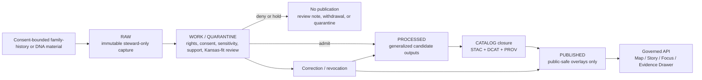

<!-- [KFM_META_BLOCK_V2]
doc_id: kfm://doc/<UUID-NEEDS-VERIFICATION>
title: Genealogy / Family-History Ingestion (Proposed Lane, with DNA and Consumer Genomics Controls)
type: standard
version: v1
status: draft
owners: <NEEDS-VERIFICATION>
created: 2026-04-10
updated: 2026-04-10
policy_label: <NEEDS-VERIFICATION>
related: [<NEEDS-VERIFICATION: adjacent repo docs or kfm:// ids>]
tags: [kfm, genealogy, family-history, dna, consent, provenance, proposed-lane]
notes: [Combined from two uploaded drafts: one broad family-history lane framing and one stricter DNA / consumer-genomics intake framing. Repo paths, owners, schemas, workflows, and mounted implementation depth remain unverified in the current session.]
[/KFM_META_BLOCK_V2] -->

# Genealogy / Family-History Ingestion (Proposed Lane, with DNA and Consumer Genomics Controls)

Proposed README for a consent-bound genealogy or family-history lane that stays subordinate to KFM evidence, rights, review, and publication rules, with a stricter high-sensitivity overlay for DNA and consumer-genomics material.

| Status | Owners | Badges | Quick jump |
| --- | --- | --- | --- |
| Experimental · **PROPOSED extension lane** | `<NEEDS-VERIFICATION>` |      | [Scope](#scope) · [DNA overlay](#dna-and-consumer-genomics-overlay) · [Repo fit](#repo-fit) · [Inputs](#inputs) · [Exclusions](#exclusions) · [Directory tree](#directory-tree-proposed-starter-layout) · [Quickstart](#quickstart) · [Usage](#usage) · [Diagram](#diagram-governed-lifecycle) · [Tables](#tables-governed-objects-and-publication-state) · [Task list](#task-list-definition-of-done) |

> [!WARNING]
> This README is intentionally staged. The attached KFM corpus confirms the governance model, truth path, Evidence Drawer, Kansas-first operating lanes, and contract-first direction. It does **not** directly verify a mounted genealogy module, exact repo path, adapters, workflows, or release receipts in the current session.

> [!IMPORTANT]
> The safest default is: **raw family-history material may enter stewarded intake, but public release is generalized-only unless a stricter, directly verified policy says otherwise. DNA and consumer-genomics material remain stricter still and are deny-by-default for direct public release.**

---

## Scope

This document does **not** claim that a live genealogy pipeline already exists in the visible repo.

Instead, it describes how a genealogy or family-history lane **should** be framed if KFM later admits it as a governed extension. The closest **CONFIRMED** KFM fits are:

- historical boundaries, census, settlement geography, and migration/mobility
- archives, newspapers, oral histories, public memory, and heritage

That means genealogy should be treated as a **review-heavy extension** under those lane families, not as a separate sovereign truth surface.

This combined README covers two nested things:

1. the broader **genealogy / family-history lane**, which is mainly about admissibility, review, generalization, and public-safe publication shape
2. a stricter **DNA and consumer-genomics overlay**, which adds revocable consent, living-person sensitivity, deny-by-default handling, and correction-ready provenance for genomics-bearing material

### Status snapshot

| Topic | Status | Why it is labeled this way |
| --- | --- | --- |
| KFM truth path, trust membrane, map-first shell, Evidence Drawer | **CONFIRMED** | Strongly repeated in the attached KFM corpus |
| Genealogy as a mounted repo lane | **UNKNOWN** | No directly visible repo tree, code, schemas, workflows, or receipts confirmed it |
| Combined README as a useful planning artifact | **PROPOSED** | It aligns the two uploaded drafts without claiming mounted implementation |
| `tools/ingest/genealogy/README.md` as the preferred target path | **INFERRED** | It appears in the broader uploaded draft, but is not directly verified in repo evidence |
| `tools/genealogy-ingest/README.md` as an alternate scaffold-era path | **INFERRED** | It appears in the DNA draft scaffold, but is not directly verified in repo evidence |
| Public release posture for family-history material | **PROPOSED** | KFM doctrine supports generalized, policy-safe publication, but no genealogy-specific publication class was directly surfaced |
| DNA / consumer-genomics controls | **PROPOSED** | The DNA draft gives a strong high-sensitivity design direction, but not mounted schema or workflow proof |
| Vendor-specific OAuth / export adapters | **NEEDS VERIFICATION** | Named in the uploaded drafts, but not directly confirmed in the visible KFM corpus |

### What this README is for

Use this file to decide:

1. whether a family-history source is admissible at all
2. what must remain steward-only
3. what could become a public-safe generalized overlay
4. what extra controls apply when the material includes DNA or consumer-genomics content
5. which proof objects must exist before anything is promoted

[Back to top](#genealogy--family-history-ingestion-proposed-lane-with-dna-and-consumer-genomics-controls)

---

## DNA and Consumer Genomics Overlay

This subsection narrows the broader lane for a smaller and more sensitive material class: consumer DNA exports, genotype files, DNA match lists, shared-segment data, and closely related genomics-bearing artifacts.

The DNA overlay is intentionally narrow. It covers **intake, normalization, validation, consent handling, review, and correction posture** for genealogy exports and DNA-match artifacts. It does **not** authorize public release of living-person data, medical inference, or a shortcut around KFM’s hydrology-first sequencing.

### High-sensitivity defaults

| Question | Default posture |
| --- | --- |
| Living person visibility | **Deny by default** |
| Raw DNA / genotype release | **Steward-only; no direct public release** |
| DNA segment release | **Steward-only unless explicitly approved by a stricter verified policy** |
| Exact person/location precision in public artifacts | **Generalize or withhold** |
| Consent basis for DNA-bearing material | **Required before downstream use** |
| Place canonicalization | Preserve original `place_string`; add canonical IDs and confidence as non-destructive enrichment |
| Revoked consent | Inactivate overlays, strip exported PII, preserve only hashed evidence references plus signed revocation proof |
| Medical or trait inference | **Not admitted** |

### Why keep DNA stricter even inside one combined README?

Because the broader lane can plausibly produce public-safe generalized place/time outputs, while DNA-bearing material adds living-person, kinship, re-identification, and revocation burdens that should stay visibly stricter even if the documentation is combined.

---

## Repo fit

**Preferred placeholder path:** `tools/ingest/genealogy/README.md` **(INFERRED from the broader uploaded draft; needs repo confirmation)**

**Alternate scaffold-era path noted in the DNA draft:** `tools/genealogy-ingest/README.md` **(also INFERRED; not directly verified)**

### Upstream / downstream fit

| Direction | Family or surface | Status | Role here |
| --- | --- | --- | --- |
| Upstream | `contracts/source/*` | **PROPOSED** | Source descriptors, access posture, rights, cadence, review intent |
| Upstream | `policy/*` | **PROPOSED** | Rights, sensitivity, public-safe publication classes, reviewer obligations |
| Upstream | steward review / correction runbooks | **PROPOSED** | Consent review, revocation, generalization, withdrawal, correction |
| Downstream | `data/work/` and `WORK / QUARANTINE` lifecycle behavior | **CONFIRMED doctrine** | Family-history intake should remain review-bearing before publication |
| Downstream | catalog closure (`STAC` / `DCAT` / `PROV`) | **CONFIRMED doctrine** | Generalized outputs still need outward metadata and lineage |
| Downstream | governed API, Map Explorer, Story, Focus, Evidence Drawer | **CONFIRMED doctrine / UNKNOWN module fit** | Public surfaces may only receive public-safe generalized outputs, never raw person-level or raw DNA-bearing records |

### Lane placement

This lane should be treated as a bridge across two confirmed KFM domain families:

- **Historical / migration / mobility:** where place-of-birth, origin-destination, and time-aware population movement already fit KFM’s Kansas-first worldview.
- **Archives / public memory / heritage:** where rights, reuse constraints, context preservation, and culturally sensitive material are already first-class concerns.

That makes this lane structurally plausible, but still later and riskier than the corpus’s preferred hydrology-first thin slice.

---

## Inputs

### Accepted inputs

| Input class | What belongs here | Source role | Status | Notes |
| --- | --- | --- | --- | --- |
| Kansas-relevant family-history interchange export | Candidate examples named in the drafts: `GEDCOM-7`, `GEDZIP` | community-contributed / documentary | **NEEDS VERIFICATION** | Treat as stewarded intake only, not as public artifact |
| User-initiated GEDCOM exports | family-tree interchange exports | community-contributed / documentary | **PROPOSED** | Plausible intake path; not sovereign truth |
| User-initiated GEDZIP bundles | bundled family-history exports | community-contributed / documentary | **PROPOSED** | Treat as archival input, not sovereign truth |
| Kansas-anchored place/time assertions | normalized records retaining source linkage and evidence state | derived from reviewed source | **PROPOSED** | Preferred bridge into KFM because they can be generalized |
| Archival or family-history evidence objects | scans, transcripts, captions, memoir fragments, oral-history excerpts, descriptive metadata | documentary / archival | **INFERRED fit** | Must remain context-linked; narrative convenience is not enough |
| User-downloaded raw DNA / genotype files | consumer genomics raw data | community-contributed / sensitive | **PROPOSED** | Intake only under explicit consent and review-bearing policy |
| DNA match lists / shared-segment CSVs | kinship match exports, segment tables, relationship hints | community-contributed / sensitive | **PROPOSED** | Normalize into typed match and segment records; preserve source-specific provenance |
| Place strings and vendor place identifiers | original textual place assertions plus vendor IDs | mixed | **PROPOSED** | Preserve originals and enrich non-destructively |
| Consent token / consent event reference | explicit downstream basis for sensitive use | governance object | **REQUIRED** for DNA-bearing material | Use wherever living-person or private-account consent is the operative basis |
| Official API sync where the provider explicitly allows it | permitted vendor or archival API access | source-specific | **PROPOSED** | Preferred over scraping; still subject to source-descriptor and rights review |
| Contract fixtures | source descriptor, ingest receipt, validation report, dataset version, evidence bundle examples | governance object | **PROPOSED** | Best first move if this lane is admitted |

### Intake expectations

1. Prefer **user-initiated uploads** or **official, consented APIs**.
2. Preserve the original file, filename, timestamp, and checksum at intake.
3. Emit typed proof objects early: at minimum a `SourceDescriptor`, `IngestReceipt`, and `ValidationReport`.
4. Keep living-person handling, revoked consent, exact-location exposure, and DNA-specific review as first-class policy questions.
5. Preserve vendor identifiers, source filenames, timestamps, and checksums alongside any KFM identifiers or canonical fields.

### Illustrative intake descriptor

```json
{
  "object_type": "SourceDescriptor",
  "lane": "genealogy",
  "status": "PROPOSED",
  "jurisdiction_anchor": "Kansas",
  "source_role": "community-contributed",
  "material_class": "family-history export",
  "rights_posture": "needs_review",
  "public_release_class": "generalized_only"
}
```

---

## Exclusions

This directory should **not** be used for:

- direct public publication of raw GEDCOM-like, person-level genealogical, or DNA-bearing files
- medical or trait inference
- HTML scraping, UI automation, or undocumented vendor access
- exact household, grave, residence, burial, or homestead point exposure on public surfaces
- direct model/runtime access to raw genealogy or DNA inputs
- unsupported claims that a live module, parser, adapter, or workflow already exists
- non-Kansas-relevant bulk tree import with no place/time anchor
- best-effort publication when rights, consent, or provenance are unresolved
- narrative claims that cannot route back to inspectable evidence and review state

---

## Directory tree (proposed starter layout)

The original drafts implied two different starter trees: a broader contract-first lane frame and a narrower package-shaped DNA scaffold. The combined version keeps the broader **contract-first** posture and folds DNA-specific examples and runbooks into it.

```text
tools/ingest/genealogy/
├── README.md
├── contracts/
│   ├── source_descriptor.example.json
│   ├── ingest_receipt.example.json
│   ├── validation_report.example.json
│   ├── decision_envelope.example.json
│   ├── dataset_version.example.json
│   ├── evidence_bundle.example.json
│   ├── correction_notice.example.json
│   └── dna_match_record.example.json
├── policy/
│   ├── publication_classes.md
│   ├── obligations.md
│   ├── reviewer_checklist.md
│   └── dna_and_consumer_genomics.md
├── examples/
│   ├── normalized_place_time_record.json
│   ├── generalized_overlay_fragment.json
│   ├── evidence_bundle_fragment.json
│   └── dna_revocation_receipt.example.json
└── runbooks/
    ├── consent_review.md
    ├── generalized_vs_precise_review.md
    ├── revocation_and_withdrawal.md
    └── dna_revocation_and_living_person_rules.md
```

**Reading rule:** every path above is **PROPOSED** starter structure, not a claim about mounted repo state.

[Back to top](#genealogy--family-history-ingestion-proposed-lane-with-dna-and-consumer-genomics-controls)

---

## Quickstart

### 1. Confirm lane admission before code

Do **not** start with a parser. Start by deciding whether the source belongs in KFM at all.

Questions to answer first:

1. Is the material Kansas-relevant in place and time?
2. Is the rights posture known enough to admit intake?
3. Can the public surface be generalized without exposing person-level truth?
4. Is there a correction and revocation path?
5. If DNA is present, is there an explicit downstream consent basis and a living-person review posture?

### 2. Declare the source before fetching it

Produce a minimal source descriptor and reviewer note before any sustained ingest work.

### 3. Route intake through steward-only stages first

Family-history source material should be treated as review-bearing from the beginning:

- `RAW` for immutable capture
- `WORK / QUARANTINE` for review, redaction, normalization, rejection, and DNA-specific policy checks
- `PROCESSED` only for generalized candidate outputs
- `CATALOG` only after metadata and lineage closure
- `PUBLISHED` only for public-safe overlays, never raw person-level or raw DNA-bearing records

### 4. Separate structure checks from policy decisions

A file can be structurally valid and still policy-blocked because consent, living-person exposure, rights posture, or exact-location sensitivity fails.

### 5. Build one thin slice, not a whole subsystem

A realistic first slice would be one Kansas-anchored source family, one source descriptor, one ingest receipt, one validation report, one generalized overlay example, and one correction or revocation drill.

---

## Usage

This README is meant to support three kinds of work.

**Design use:** define what a family-history lane is allowed to mean inside KFM.

**Review use:** determine whether a source can be admitted, generalized, denied, held in quarantine, or revoked.

**Implementation use:** provide enough contract language that future code, fixtures, tests, and runbooks can be added without inventing new doctrine.

A good mental model is:

> sensitive family-history material enters as evidence-bearing intake, remains steward-reviewable during transformation, and only emerges publicly as generalized place/time signal with visible provenance, rights posture, and correction behavior. DNA-bearing material remains stricter and should not become a direct public truth surface.

### Operating sequence

1. **Admit the source before admitting the data.**  
   Every export type or official endpoint needs a `SourceDescriptor` naming identity, access mode, rights posture, cadence, validation plan, and publication intent.

2. **Treat user files as evidence-bearing intake, not immediate truth.**  
   Raw uploads belong in `RAW`; normalization and policy evaluation happen later.

3. **Normalize without erasing source-specific meaning.**  
   Preserve original place text, vendor identifiers, original filenames, timestamps, and checksums. Add KFM identifiers and canonical fields alongside them.

4. **Separate structure checks from policy decisions.**  
   Structural validity does not by itself authorize release.

5. **Do not outrun KFM’s trust surfaces.**  
   If this lane later appears in Focus, Story, Dossier, Export, or the Evidence Drawer, it must inherit the same release linkage, rights state, freshness cues, and correction behavior as other KFM surfaces.

### Runtime outcome posture

If a downstream governed surface touches this lane, the lane should inherit KFM’s explicit negative-outcome behavior.

| Surface situation | Expected behavior |
| --- | --- |
| Evidence and policy pass | `ANSWER` or released feature/view, with evidence linkage |
| Scope exists but evidence is incomplete | `ABSTAIN` |
| Consent, rights, or sensitivity blocks use | `DENY` |
| Runtime or contract failure prevents safe response | `ERROR` |

### Public-safe reading rule

What becomes public should be things like:

- decade-bucket migration corridors
- county- or region-level origin/destination summaries
- place dossiers that explain settlement or movement context
- evidence-linked story material with visible dates, caveats, and lineage
- steward-reviewed generalized comparisons that preserve correction and withdrawal paths

What should **not** become public by default:

- raw person records
- household-level maps
- unreviewed family trees
- raw DNA / genotype files
- DNA segment or shared-segment releases
- exact residential, burial, or homestead coordinates
- “confidence” scores that imply person-level truth without an explicit support model

---

## Diagram (governed lifecycle)



---

## Tables (governed objects and publication state)

### KFM object families this lane would need

| Object family | Minimum purpose in this lane | Status |
| --- | --- | --- |
| `SourceDescriptor` | declare source role, rights posture, Kansas fit, publication intent | **PROPOSED** |
| `IngestReceipt` | prove that one fetch or handoff occurred | **PROPOSED** |
| `ValidationReport` | record what passed, failed, generalized, denied, revoked, or quarantined | **PROPOSED** |
| `DatasetVersion` | carry an authoritative candidate version for generalized outputs | **PROPOSED** |
| `CatalogClosure` | publish outward metadata and lineage for any public-safe artifact | **PROPOSED** |
| `DecisionEnvelope` / `ReviewRecord` | capture policy result, obligations, and steward review | **PROPOSED** |
| `EvidenceBundle` | package support for a claim, story excerpt, or exported overlay preview | **CONFIRMED family / PROPOSED lane fit** |
| `RuntimeResponseEnvelope` | make downstream answer / abstain / deny / error behavior accountable | **PROPOSED** |
| `ReleaseManifest` / `CorrectionNotice` | make publication, replacement, withdrawal, and rollback visible | **PROPOSED** |

### Publication state model

| State | What may exist here | Public? | Notes |
| --- | --- | --- | --- |
| `RAW` | immutable source capture, checksums, source note | No | steward-only |
| `WORK / QUARANTINE` | normalization attempts, rights review, redaction tests, rejection notes, DNA-specific checks | No | review-bearing |
| `PROCESSED` | generalized candidate outputs with stable IDs | Not yet | candidate only |
| `CATALOG` | outward `STAC` / `DCAT` / `PROV` closure | Not by itself | required before public-safe delivery |
| `PUBLISHED` | generalized overlays, story excerpts, evidence route, correction linkage | Yes, if policy-safe | never raw family-history or raw DNA truth |

### Source-role mapping

| Source role | Best fit in this lane | Main caution |
| --- | --- | --- |
| documentary / archival | memoirs, archival transcripts, captions, descriptive records | preserve context; do not flatten interpretive material |
| community-contributed | steward-submitted family exports, private research contributions, or consented consumer genomics exports | moderation, consent, and revocation matter |
| modeled / derived | generalized movement summaries or place/time overlays | never let derivative surfaces masquerade as person-level truth |
| mirror / discovery | third-party or discovery copies of another authority | provenance anchor, not sovereign truth |

### DNA-specific control table

| Material class | Minimum added control | Default public posture |
| --- | --- | --- |
| raw genotype file | explicit consent basis + steward review | not public |
| DNA match list | explicit consent basis + living-person review | not public |
| shared-segment data | highest-sensitivity review + revocation path | not public |
| generalized kinship or migration summary derived from reviewed material | evidence linkage + generalization review | only if policy-safe |

### Illustrative domain fields

These fields are **illustrative** and come from exploratory packet material, not mounted schemas.

| Object family | Illustrative fields |
| --- | --- |
| `kfm:person` | `urn`, `names`, `sex` |
| `kfm:event` | `type`, `date`, `place_string`, `place_pdid`, `lat`, `lon`, `geocode_confidence` |
| `kfm:dna_match` | `match_urn`, `kit_hash`, `relationship_hint`, `metrics`, `consent_token` |
| `kfm:dna_segments[]` | `chr`, `start_bp`, `end_bp`, `cM` |
| Evidence refs | `kind`, `hash`, `spec_hash` |

[Back to top](#genealogy--family-history-ingestion-proposed-lane-with-dna-and-consumer-genomics-controls)

---

## Task list (definition of done)

This lane is not ready for promotion until the following are true:

- [ ] a Kansas-anchored `SourceDescriptor` exists for at least one admitted source family
- [ ] a reviewer can distinguish **generalized public-safe output** from **steward-only precise material**
- [ ] at least one `IngestReceipt` and one `ValidationReport` example exist
- [ ] at least one `DatasetVersion` and one `CatalogClosure` example exist
- [ ] an `EvidenceBundle` example exists for a public-safe claim or place dossier
- [ ] a `DecisionEnvelope` or `ReviewRecord` example exists for allow / hold / deny behavior
- [ ] one user-upload flow lands a family-history or DNA artifact in `RAW` and emits an `IngestReceipt`
- [ ] living-person and revoked-consent rules are covered by policy tests
- [ ] one positive and one negative `RuntimeResponseEnvelope` trace exist for steward review
- [ ] one correction or revocation drill is documented end to end
- [ ] public surfaces show provenance, review state, and correction behavior
- [ ] no raw person-level family-history export or raw DNA-bearing record appears on a public surface
- [ ] target path, owners, adjacent docs, and any existing code are directly verified in the repo

---

## FAQ

### Is genealogy a confirmed baseline KFM lane?

No. In the currently visible corpus, the nearest confirmed fits are historical/migration and archives/heritage. A dedicated genealogy lane remains **UNKNOWN** as mounted implementation and **PROPOSED** as extension framing.

### Can raw family-history exports be published directly?

This README assumes **no**. Public delivery should be generalized-only unless a stricter, directly verified policy and review flow says otherwise.

### Can raw DNA or consumer-genomics data be published after parsing?

No. Parsing is not promotion. DNA-bearing material needs explicit consent posture, review, and a stricter policy-safe release shape; the default is steward-only.

### Why not keep the original code-first tree from the uploaded draft?

Because the current session did not directly verify those files, adapters, or workflows. A contract-first tree is more truthful and still useful.

### Why preserve the original place text if canonicalization is available?

Because canonicalization is enrichment, not replacement. Historical or family-supplied place strings may carry ambiguity, spelling variation, or context worth preserving.

### Why does revocation need a first-class receipt?

Because KFM preserves correction lineage. Revocation should narrow or withdraw use visibly, not erase the fact that a governed change happened.

### Where would Focus Mode fit?

Only downstream of governed evidence resolution. Focus may summarize public-safe outputs with citations and evidence drill-through, but it should never become a detached family-history assistant.

---

## Appendix

<details>
<summary><strong>Appendix A — Evidence posture used in this README</strong></summary>

| Area | Status | Reading rule |
| --- | --- | --- |
| KFM governance doctrine | **CONFIRMED** | may anchor the file confidently |
| Genealogy lane existence in mounted repo | **UNKNOWN** | do not write as if implemented |
| Preferred combined target path | **INFERRED** | useful as a reviewable placeholder |
| Alternate scaffold-era path | **INFERRED** | keep visible until repo verification resolves it |
| Candidate interchange terms from the drafts | **NEEDS VERIFICATION** | keep as draft input candidates, not confirmed KFM support |
| Public-safe generalized overlay pattern | **PROPOSED** | consistent with KFM doctrine, but still needs lane-specific review rules |
| DNA-specific consent and revocation overlay | **PROPOSED** | strong design direction, still needs mounted policy/schema proof |

</details>

<details>
<summary><strong>Appendix B — Candidate public-safe outputs</strong></summary>

These are examples of outputs that fit KFM better than raw family trees or raw DNA material:

- county-to-county migration corridor summaries by decade
- place dossiers that synthesize settlement, origin, and movement context
- region-level “family movement” overlays with explicit time/support semantics
- evidence-linked story excerpts that remain linked to archival or documentary bundles
- steward-reviewed generalized comparisons that preserve correction and withdrawal paths

</details>

<details>
<summary><strong>Appendix C — Illustrative field mapping carried forward from exploratory packet material</strong></summary>

```yaml
person:
  urn: kfm:person:<source>:<id>
  names: ["..."]
  sex: "F|M|X|unknown"

events:
  - type: BIRT|DEAT|MARR|...
    date: YYYY-MM-DD
    place_string: "original source text"
    place_pdid: "canonical place id when resolved"
    lat: 0.0
    lon: 0.0
    geocode_confidence: 0.0

dna_match:
  match_urn: kfm:dna:<source>:<id>
  kit_hash: sha256:...
  relationship_hint: "2nd-3rd cousin"
  metrics:
    shared_cM: 0.0
    total_segments: 0
    longest_segment: 0.0
  consent_token: consent:...
```

Use this as a design sketch only until real schemas and fixtures exist.

</details>

<details>
<summary><strong>Appendix D — Source and sync posture</strong></summary>

- Prefer official APIs where the provider explicitly allows them.
- Otherwise prefer user-initiated uploads and preserve the uploaded file as evidence.
- Do not rely on UI scraping to create a baseline operational path.
- Keep vendor-specific capability notes in a re-verifiable source registry, not as timeless doctrine in this README.

</details>

<details>
<summary><strong>Appendix E — Open verification backlog</strong></summary>

1. Confirm whether `tools/ingest/genealogy/README.md` is the real target path.
2. Resolve whether `tools/genealogy-ingest/README.md` was only scaffold-era packaging or reflects a real repo family.
3. Surface any existing repo modules, schemas, tests, or workflows touching genealogy, archives, family-history intake, or consumer-genomics review.
4. Confirm owners, policy label, and adjacent documentation links for the KFM meta block.
5. Confirm whether `GEDCOM-7` / `GEDZIP` are actually desired interchange targets for KFM.
6. Confirm whether a distinct policy label or review queue is required for DNA / human-genomics material.
7. Surface one generalized-vs-precise review example.
8. Surface one revocation, withdrawal, or correction drill for rights-sensitive historical or genomics-bearing material.
9. Confirm whether this lane should be admitted at all before or after hydrology-first proof work.
10. Surface whether any existing runtime envelopes or Evidence Drawer payloads already cover person-bearing material.

</details>

[Back to top](#genealogy--family-history-ingestion-proposed-lane-with-dna-and-consumer-genomics-controls)
