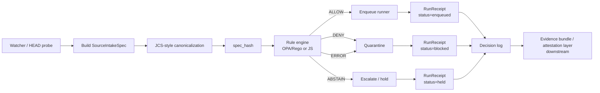

<!-- [KFM_META_BLOCK_V2]
doc_id: kfm://doc/TODO-uuid-NEEDS-VERIFICATION
title: KFM Ingest Edge Watcher
type: standard
version: v1
status: draft
owners: TODO-owner-NEEDS-VERIFICATION
created: 2026-05-06
updated: 2026-05-06
policy_label: TODO-policy-label-NEEDS-VERIFICATION
related: [TODO-verify-adjacent-docs-and-policy-paths]
tags: [kfm, ingest, watcher, policy, receipts]
notes: [PROPOSED target README; repository path ownership policy label and adjacent links were not verified in the current workspace]
[/KFM_META_BLOCK_V2] -->

# KFM Ingest Edge Watcher

Watch source change signals, canonicalize intake specs, evaluate policy, and fail closed before any candidate reaches processing.

> [!IMPORTANT]
> **Status:** experimental / PROPOSED  
> **Owners:** TODO — NEEDS VERIFICATION  
> **Badges:**  
> 
> 
> 
>   
> **Quick jumps:** [Scope](#scope) · [Repo fit](#repo-fit) · [Inputs](#inputs) · [Exclusions](#exclusions) · [Quickstart](#quickstart) · [Decision contract](#decision-contract) · [Failure matrix](#failure-matrix) · [Definition of done](#definition-of-done) · [Appendix](#appendix-starter-snippets)

---

## Scope

This directory is the proposed home for an **ingest-edge watcher**: a small boundary component that observes source changes, builds a stable spec, computes a `spec_hash`, asks policy for a finite decision, and records a receipt before anything is queued.

The core doctrine is simple:

```text
No ALLOW, no enqueue.
No receipt, no publication path.
Policy error means fail closed.
```

This README describes the proposed contract and starter implementation pattern. It does **not** claim that the CLI, paths, tests, or CI gates already exist.

---

## Repo fit

| Item | Path / link | Status | Notes |
|---|---:|---|---|
| Target README | `tools/ingest/watcher/README.md` | **PROPOSED** | Placement inferred from the requested ingest-edge watcher doc. Verify against repo conventions before commit. |
| Alternate corpus placement | `tools/probes/` | **NEEDS VERIFICATION** | Prior KFM materials place watcher / HEAD polling under probes. Confirm whether ingest watcher belongs here or in `tools/probes/`. |
| Canonicalization neighbor | `tools/diff/` or local module | **NEEDS VERIFICATION** | Prior KFM materials separate watcher and canonicalization. |
| Policy home | `policy/` or `policies/` | **NEEDS VERIFICATION** | Use the repository’s established OPA/Rego convention once confirmed. |
| Receipt home | `data/receipts/` | **PROPOSED** | KFM corpus repeatedly uses run receipts as process memory. Verify exact subpath. |
| Quarantine home | `data/quarantine/` | **PROPOSED** | Fail-closed candidates should not enter the runner queue. Verify exact subpath. |
| Attestation / proof layer | `tools/attest/` | **PROPOSED** | Receipts are process memory; attestations are proof artifacts. Keep them separate. |

### Upstream

This watcher expects upstream governance material before it runs:

- source descriptor or source registry entry
- rights, sensitivity, license, cadence, and source-role labels
- observed source metadata such as URL, ETag, Last-Modified, and content length
- policy package path and query
- prior `spec_hash` state, when available

### Downstream

This watcher may hand off only after policy allows the candidate:

- runner queue or batch runner
- validation tools
- receipt writer
- quarantine writer
- evidence bundle / attestation tooling
- catalog or release gate, downstream of validation

[Back to top](#kfm-ingest-edge-watcher)

---

## Inputs

Only governed source-intake material belongs here.

| Input | Required? | Status | Shape |
|---|---:|---|---|
| `source_id` | Yes | **PROPOSED** | Stable KFM source identifier, for example `src::<namespace>/<name>`. |
| Observed HEAD record | Yes | **PROPOSED** | `url`, `etag`, `last_modified`, `content_length`, and fetch timestamp when available. |
| Declared source governance | Yes | **CONFIRMED CONCEPT / PROPOSED FIELDS** | `role`, `rights_status`, `sensitivity`, `license`, cadence, and owner/steward metadata. |
| Policy package | Yes | **PROPOSED** | Rego or JS rule file that returns a finite decision. |
| Previous hash state | No | **PROPOSED** | Last accepted or last seen `spec_hash`, used for idempotency and drift detection. |
| Runner command | No | **PROPOSED** | Shell command invoked only after `ALLOW`. |

### Minimal `SourceIntakeSpec`

The canonicalized spec should not include its own `spec_hash`; compute the hash over the spec body, then attach the hash to the decision and receipt.

```json
{
  "schema_version": "v1",
  "object_type": "SourceIntakeSpec",
  "source_id": "src::<namespace>/<name>",
  "observed": {
    "url": "https://example.org/data.ndjson",
    "etag": "\"b2c1-5ab3f\"",
    "last_modified": "Tue, 05 May 2026 20:10:03 GMT",
    "content_length": 912341
  },
  "declared": {
    "role": "observation",
    "rights_status": "unknown",
    "sensitivity": "review_required",
    "license": "NEEDS_VERIFICATION"
  }
}
```

> [!NOTE]
> **PROPOSED:** `SourceIntakeSpec` should be reconciled with the repo’s eventual `SourceDescriptor` / schema wave before it becomes canonical.

---

## Exclusions

This directory should stay narrow. It is the governed edge, not the whole ingest stack.

| Does not belong here | Send it to | Why |
|---|---|---|
| Payload transformation | runner / domain ingest tools | The watcher decides whether to enqueue, not how to transform. |
| Catalog publication | release / catalog gate | Publication requires later validation, proof, and steward checks. |
| Attestation signing | `tools/attest/` | Receipts and attestations are related but separate artifacts. |
| Steward review UI | review queue / governance workflow | The watcher may escalate or hold, but does not adjudicate review. |
| Domain-specific validation | `tools/validators/` | The watcher checks intake policy, not every downstream contract. |
| Long-running batch work | runner | The watcher should stay small, observable, and easy to fail closed. |

[Back to top](#kfm-ingest-edge-watcher)

---

## Directory tree

**PROPOSED** structure for review:

```text
tools/ingest/watcher/
├── README.md
├── kfm_watch.py                 # PROPOSED CLI entrypoint
├── kfm_rule_engine.py            # PROPOSED Rego/JS adapter
├── pyproject.toml                # PROPOSED only if this becomes a Python package
└── tests/
    ├── test_spec_hash.py
    ├── test_policy_fail_closed.py
    ├── test_receipts.py
    └── fixtures/
        ├── allow.clean_observation.json
        ├── quarantine.unknown_rights.json
        ├── quarantine.license_missing.json
        └── error.policy_eval_failed.json
```

Suggested neighboring files, pending repository convention check:

```text
policy/ingest/qa.rego             # PROPOSED policy location
data/quarantine/                  # PROPOSED blocked candidate location
data/receipts/runs/               # PROPOSED run receipt location
tools/attest/                     # PROPOSED proof / attestation layer
```

---

## Quickstart

### POC command

The command below is a proposed shape for the ingest-edge CLI. Replace the path placeholders with the repo’s verified policy and runner paths.

```bash
export SOURCE_ID="src::example/data"
export SOURCE_URL="https://example.org/data.ndjson"
export POLICY_PATH="${POLICY_PATH:-policy/ingest/qa.rego}" # PROPOSED — verify repo convention

kfm-watch \
  --source "${SOURCE_ID}" \
  --url "${SOURCE_URL}" \
  --compute-spec \
  --hook kfm-rule-engine \
  --policy "${POLICY_PATH}" \
  --on-enqueue "kfm-runner --batch-size 4 --max-changes-per-run 8 --retries 3"
```

### Expected behavior

| Condition | Edge decision | Queue? | Receipt status |
|---|---:|---:|---:|
| Policy returns `ALLOW` | allow | yes | `enqueued` |
| Policy returns `DENY` | quarantine | no | `blocked` |
| Policy returns `ABSTAIN` | escalate / hold | no | `held` |
| Policy errors, times out, or returns malformed output | quarantine | no | `blocked` |
| Required governance labels are missing | quarantine or hold | no | `blocked` or `held` |

> [!WARNING]
> The watcher must never “best effort” its way into the runner queue. Missing policy output, schema mismatch, invalid JSON, and rule-engine failure all resolve to **no enqueue**.

---

## Diagram



---

## Decision contract

The rule engine should return one small decision envelope. Keep it deterministic, auditable, and easy to validate.

```json
{
  "schema_version": "v1",
  "object_type": "DecisionEnvelope",
  "policy_id": "qa_ingest_edge_v1",
  "policy_decision": "DENY",
  "action": "quarantine",
  "reason_code": "license_missing",
  "reason": "Declared license is NEEDS_VERIFICATION.",
  "spec_hash": "sha256:<64-hex>",
  "source_id": "src::<namespace>/<name>",
  "obligations": [],
  "decided_at": "2026-05-06T00:00:00Z"
}
```

### Decision vocabulary

| Policy decision | Edge action | Meaning |
|---|---|---|
| `ALLOW` | `allow` | Candidate may enter the runner queue. |
| `DENY` | `quarantine` | Candidate is blocked and placed in quarantine. |
| `ABSTAIN` | `escalate` / `hold` | Candidate needs steward review or missing context. No queue. |
| `ERROR` | `quarantine` | Policy could not be evaluated safely. No queue. |

### Run receipt

Run receipts are process memory. They should link the observed spec, decision, queue/quarantine outcome, and relevant artifact references.

```json
{
  "schema_version": "v1",
  "object_type": "run_receipt",
  "run_id": "kfm://run/ingest-edge/2026-05-06T00:00:00Z",
  "receipt_ref": "kfm://receipt/run/ingest-edge/2026-05-06T00:00:00Z",
  "source_id": "src::<namespace>/<name>",
  "spec_hash": "sha256:<64-hex>",
  "previous_spec_hash": null,
  "change_detected": true,
  "policy_results": [
    {
      "policy": "policy/ingest/qa.rego",
      "query": "data.kfm.qa.decision",
      "result": "DENY"
    }
  ],
  "decision": {
    "policy_id": "qa_ingest_edge_v1",
    "policy_decision": "DENY",
    "action": "quarantine",
    "reason_code": "license_missing"
  },
  "status": "blocked",
  "quarantine_ref": "kfm://quarantine/src/example/data/sha256-<hash>",
  "outputs": {
    "decision_log": "data/receipts/runs/<run_id>/decision.json",
    "run_receipt": "data/receipts/runs/<run_id>/run_receipt.json"
  },
  "created_at": "2026-05-06T00:00:00Z"
}
```

[Back to top](#kfm-ingest-edge-watcher)

---

## Failure matrix

The default posture is deny-by-default and fail-closed.

| Signal | Reason code | Recommended action | Notes |
|---|---|---|---|
| `rights_status = "unknown"` | `unknown_rights` | `DENY` → quarantine | Source cannot move forward without rights clarity. |
| `license = "NEEDS_VERIFICATION"` | `license_missing` | `DENY` → quarantine | Treat license gaps as publish blockers. |
| `sensitivity = "review_required"` | `ABSTAIN` or `DENY` | hold or quarantine | Use `ABSTAIN` only when a steward review lane exists. |
| Policy package missing | `policy_package_missing` | `ERROR` → quarantine | No policy means no enqueue. |
| Policy evaluation error | `policy_evaluation_failed` | `ERROR` → quarantine | Errors are not soft passes. |
| Decision envelope malformed | `decision_schema_invalid` | `ERROR` → quarantine | Validate before acting. |
| Hash canonicalization failed | `spec_hash_failed` | `ERROR` → quarantine | The receipt must not carry an unstable identity. |
| No change detected | `no_change` | no-op receipt | Optional: write a lightweight observation receipt. |

---

## Usage pattern

1. **Observe** source metadata with HEAD, S3 metadata, git refs, or another non-destructive probe.
2. **Assemble** `SourceIntakeSpec` from observed facts and declared governance labels.
3. **Canonicalize** the spec using a strict canonical JSON representation.
4. **Hash** the canonical bytes into `spec_hash`.
5. **Evaluate** policy with the spec and hash.
6. **Validate** the decision envelope.
7. **Act** only on finite outcomes:
   - `ALLOW` → enqueue runner
   - `DENY` → quarantine
   - `ABSTAIN` → hold / escalate
   - `ERROR` → quarantine
8. **Write** decision log and run receipt.
9. **Hand off** receipts to evidence bundle or attestation tooling downstream.

---

## Definition of done

Before this README graduates from proposed to active, verify the following:

- [ ] Target path is confirmed against repo conventions.
- [ ] Owner or owning team is added to the KFM meta block and impact block.
- [ ] Policy directory convention is confirmed: `policy/`, `policies/`, or another repo-native path.
- [ ] `SourceIntakeSpec` is reconciled with the canonical source descriptor schema.
- [ ] `DecisionEnvelope` and `run_receipt` schemas exist or are explicitly added.
- [ ] Valid and invalid fixtures cover `ALLOW`, `DENY`, `ABSTAIN`, and `ERROR`.
- [ ] Tests prove policy errors do not enqueue.
- [ ] Tests prove unknown rights and missing license block the runner.
- [ ] Tests prove `spec_hash` is stable across key ordering.
- [ ] Receipt writer is deterministic and produces valid JSON.
- [ ] Quarantine records link back to `source_id`, `spec_hash`, and decision reason.
- [ ] CI or local validation command is documented.
- [ ] Adjacent docs link here from the repo’s ingest, policy, receipts, or tooling index.

---

## FAQ

### Why hash the spec instead of only the payload?

The `spec_hash` identifies the governed intake contract: source location, observed change signal, declared rights/sensitivity, and other decision-critical context. Payload digests may still be needed downstream, but the edge needs a stable identity for the decision it actually made.

### Does `ALLOW` mean publish?

No. At the ingest edge, `ALLOW` means the candidate may enter the runner queue. Downstream validation, evidence bundle resolution, promotion gates, catalog closure, and attestation may still block publication.

### Should sensitivity review be quarantine or escalation?

Both are fail-closed because neither enqueues. Use `ABSTAIN` / hold when the repo has a steward review workflow. Use `DENY` / quarantine when missing review context must be corrected before retry.

### Can JS rules replace Rego?

For a POC, yes. For production, prefer the policy engine already used by the repo. The only hard contract here is that the rule engine returns a validated finite decision and fails closed on errors.

[Back to top](#kfm-ingest-edge-watcher)

---

## Appendix: starter snippets

<details>
<summary>Rego starter policy</summary>

```rego
package kfm.qa

import rego.v1

policy_id := "qa_ingest_edge_v1"

deny contains "unknown_rights" if {
  input.declared.rights_status == "unknown"
}

deny contains "license_missing" if {
  input.declared.license == "NEEDS_VERIFICATION"
}

deny contains "needs_steward_review" if {
  input.declared.sensitivity == "review_required"
}

allow if {
  input.declared.role == "observation"
  count(deny) == 0
}

action := "allow" if {
  allow
}

action := "quarantine" if {
  not allow
}

reason_code := "ok" if {
  allow
}

reason_code := first_reason if {
  not allow
  count(deny) > 0
  reasons := sort([r | r := deny[_]])
  first_reason := reasons[0]
}

reason_code := "policy_default_deny" if {
  not allow
  count(deny) == 0
}

decision := {
  "schema_version": "v1",
  "object_type": "DecisionEnvelope",
  "policy_id": policy_id,
  "policy_decision": upper(action),
  "action": action,
  "reason_code": reason_code,
  "obligations": [],
}
```

Example evaluation:

```bash
opa eval \
  --data policy/ingest/qa.rego \
  --input /tmp/source_intake_spec.json \
  --format json \
  'data.kfm.qa.decision'
```

</details>

<details>
<summary>JS rule alternative</summary>

```js
export function evaluate(input) {
  const base = {
    schema_version: "v1",
    object_type: "DecisionEnvelope",
    policy_id: "qa_ingest_edge_v1_js",
    policy_decision: "DENY",
    action: "quarantine",
    reason_code: "policy_default_deny",
    obligations: []
  };

  if (input?.declared?.license === "NEEDS_VERIFICATION") {
    return { ...base, reason_code: "license_missing" };
  }

  if (input?.declared?.rights_status === "unknown") {
    return { ...base, reason_code: "unknown_rights" };
  }

  if (input?.declared?.sensitivity === "review_required") {
    return {
      ...base,
      policy_decision: "ABSTAIN",
      action: "escalate",
      reason_code: "needs_steward_review",
      obligations: ["review_required"]
    };
  }

  if (input?.declared?.role === "observation") {
    return {
      ...base,
      policy_decision: "ALLOW",
      action: "allow",
      reason_code: "ok"
    };
  }

  return base;
}
```

</details>

<details>
<summary>Python watcher outline</summary>

```python
#!/usr/bin/env python3
"""
PROPOSED POC ONLY.

Replace the canonical_json function with a complete RFC 8785 / JCS implementation
before using this as a production identity function.
"""

from __future__ import annotations

import argparse
import hashlib
import json
import subprocess
from dataclasses import dataclass
from datetime import datetime, timezone
from pathlib import Path
from typing import Any


@dataclass(frozen=True)
class Decision:
    policy_id: str
    policy_decision: str
    action: str
    reason_code: str
    obligations: list[str]


def now_iso() -> str:
    return datetime.now(timezone.utc).isoformat()


def canonical_json(value: dict[str, Any]) -> bytes:
    # POC deterministic JSON, not a full JCS implementation.
    return json.dumps(
        value,
        ensure_ascii=False,
        separators=(",", ":"),
        sort_keys=True,
    ).encode("utf-8")


def compute_spec_hash(spec: dict[str, Any]) -> str:
    digest = hashlib.sha256(canonical_json(spec)).hexdigest()
    return f"sha256:{digest}"


def head_probe(url: str) -> dict[str, Any]:
    # Replace with requests, botocore, git ls-remote, or another repo-approved probe.
    return {
        "url": url,
        "etag": None,
        "last_modified": None,
        "content_length": None,
        "observed_at": now_iso(),
    }


def evaluate_policy(spec: dict[str, Any], policy_path: str) -> Decision:
    try:
        payload = json.dumps(spec)
        completed = subprocess.run(
            [
                "opa",
                "eval",
                "--data",
                policy_path,
                "--stdin-input",
                "--format",
                "json",
                "data.kfm.qa.decision",
            ],
            input=payload,
            text=True,
            check=True,
            capture_output=True,
        )
        raw = json.loads(completed.stdout)
        decision = raw["result"][0]["expressions"][0]["value"]
        return Decision(
            policy_id=decision["policy_id"],
            policy_decision=decision["policy_decision"],
            action=decision["action"],
            reason_code=decision["reason_code"],
            obligations=decision.get("obligations", []),
        )
    except Exception:
        return Decision(
            policy_id="qa_ingest_edge_v1",
            policy_decision="ERROR",
            action="quarantine",
            reason_code="policy_evaluation_failed",
            obligations=[],
        )


def write_json(path: Path, value: dict[str, Any]) -> None:
    path.parent.mkdir(parents=True, exist_ok=True)
    path.write_text(json.dumps(value, indent=2, sort_keys=True) + "\n", encoding="utf-8")


def main() -> int:
    parser = argparse.ArgumentParser()
    parser.add_argument("--source", required=True)
    parser.add_argument("--url", required=True)
    parser.add_argument("--policy", required=True)
    parser.add_argument("--on-enqueue", required=True)
    parser.add_argument("--receipt-root", default="data/receipts/runs")
    parser.add_argument("--quarantine-root", default="data/quarantine")
    args = parser.parse_args()

    spec = {
        "schema_version": "v1",
        "object_type": "SourceIntakeSpec",
        "source_id": args.source,
        "observed": head_probe(args.url),
        "declared": {
            "role": "observation",
            "rights_status": "unknown",
            "sensitivity": "review_required",
            "license": "NEEDS_VERIFICATION",
        },
    }

    spec_hash = compute_spec_hash(spec)
    decision = evaluate_policy(spec, args.policy)

    run_id = f"kfm://run/ingest-edge/{datetime.now(timezone.utc).strftime('%Y%m%dT%H%M%SZ')}"
    receipt_dir = Path(args.receipt_root) / hashlib.sha256(run_id.encode()).hexdigest()[:16]

    decision_log = {
        "schema_version": "v1",
        "object_type": "DecisionEnvelope",
        "policy_id": decision.policy_id,
        "policy_decision": decision.policy_decision,
        "action": decision.action,
        "reason_code": decision.reason_code,
        "obligations": decision.obligations,
        "source_id": args.source,
        "spec_hash": spec_hash,
        "decided_at": now_iso(),
    }

    status = "enqueued" if decision.action == "allow" else "blocked"
    quarantine_ref = None

    if decision.action == "allow":
        subprocess.run(args.on_enqueue, shell=True, check=False)
    else:
        quarantine_ref = f"kfm://quarantine/{args.source}/{spec_hash.replace(':', '-')}"
        write_json(Path(args.quarantine_root) / "latest.json", {"spec": spec, "decision": decision_log})

    receipt = {
        "schema_version": "v1",
        "object_type": "run_receipt",
        "run_id": run_id,
        "receipt_ref": f"kfm://receipt/run/ingest-edge/{receipt_dir.name}",
        "source_id": args.source,
        "spec_hash": spec_hash,
        "decision": decision_log,
        "status": status,
        "quarantine_ref": quarantine_ref,
        "created_at": now_iso(),
    }

    write_json(receipt_dir / "decision.json", decision_log)
    write_json(receipt_dir / "run_receipt.json", receipt)

    return 0 if decision.action == "allow" else 2


if __name__ == "__main__":
    raise SystemExit(main())
```

</details>
