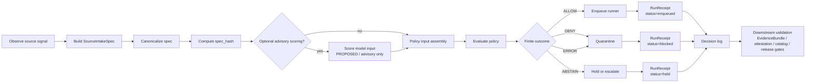

<!-- [KFM_META_BLOCK_V2]
doc_id: kfm://doc/TODO-uuid-NEEDS-VERIFICATION
title: KFM Ingest Edge Watcher
type: standard
version: v1
status: draft
owners: TODO-owner-NEEDS-VERIFICATION
created: 2026-05-06
updated: 2026-05-07
policy_label: TODO-policy-label-NEEDS-VERIFICATION
related: [
  tools/ingest/,
  tools/validators/,
  policy/,
  data/receipts/,
  data/quarantine/,
  docs/adr/,
  TODO-verify-adjacent-docs-and-policy-paths
]
tags: [kfm, ingest, watcher, policy, receipts, source-intake, spec-hash, fail-closed]
notes: [
  Repository connector observed this README path during rewrite; adjacent implementation, owners, policy label, and linked paths remain NEEDS VERIFICATION.
  Rebuilt from the existing ingest-edge watcher README and the governed artifact gate blueprint.
  ONNX/scoring, DSSE/Cosign, CI, policy bundle, and CLI examples are PROPOSED unless verified in the active branch.
]
[/KFM_META_BLOCK_V2] -->

<a id="top"></a>

# KFM Ingest Edge Watcher

Watch source change signals, canonicalize intake specs, evaluate policy, and fail closed before any candidate reaches processing.

<div align="center">

### Governed source-edge intake for Kansas Frontier Matrix

*No ALLOW, no enqueue • no receipt, no publication path • policy error means fail closed*

<br/>


</div>

> [!IMPORTANT]
> **Status:** draft / experimental  
> **Owners:** TODO — NEEDS VERIFICATION  
> **Target path:** `tools/ingest/watcher/README.md`  
> **Path status:** CONFIRMED in this rewrite from connected repository evidence; implementation status remains NEEDS VERIFICATION.  
> **Quick jumps:** [Scope](#scope) · [Repo fit](#repo-fit) · [Inputs](#inputs) · [Exclusions](#exclusions) · [Directory tree](#directory-tree) · [Quickstart](#quickstart) · [Usage](#usage) · [Diagram](#diagram) · [Decision contract](#decision-contract) · [Run receipt and signing](#run-receipt-and-signing) · [Failure matrix](#failure-matrix) · [Definition of done](#definition-of-done) · [FAQ](#faq) · [Appendix](#appendix-starter-snippets)

---

## Scope

The ingest edge watcher is a small boundary component that observes source change signals, builds a stable intake spec, computes a `spec_hash`, asks policy for a finite decision, and records a receipt before anything is queued.

```text
No ALLOW, no enqueue.
No receipt, no publication path.
Policy error means fail closed.
```

The watcher exists to prevent silent source movement across KFM lifecycle boundaries. It is allowed to observe, normalize decision inputs, compute identity, ask policy, route the candidate, and write receipts. It is not allowed to publish, transform domain payloads, decide truth, override sensitivity policy, or bypass review.

### Boundary contract

| This watcher is | This watcher is not |
|---|---|
| A governed source-edge control point | A public publication runtime |
| A deterministic intake decision surface | A sovereign truth system |
| A receipt-emitting gate before queueing | Canonical storage |
| A fail-closed preflight layer | An autonomous approval authority |
| A source-intake helper | A replacement for `EvidenceBundle` authority |
| A policy input producer | A direct model-serving endpoint |

> [!CAUTION]
> Optional model scoring, including ONNX-style scoring, is advisory policy input only. It must never become proof, publication authority, or a substitute for source descriptors, evidence bundles, policy decisions, release review, or rollback lineage.

[Back to top](#top)

---

## Repo fit

This README sits at the intake edge of the tooling lane. It should stay narrow and should point to stronger downstream gates instead of absorbing them.

| Area | Path or home | Status | Responsibility |
|---|---|---|---|
| Target README | `tools/ingest/watcher/README.md` | CONFIRMED IN THIS REWRITE | README path observed through connected repository evidence. |
| Watcher implementation | `tools/ingest/watcher/` | PROPOSED / NEEDS VERIFICATION | CLI or module home for source-edge watch behavior. |
| Alternate placement | `tools/probes/` | NEEDS VERIFICATION | Prior KFM material sometimes separates watcher/probe behavior. Verify before moving files. |
| Canonicalization helper | `tools/diff/`, `packages/hashing/`, or local module | NEEDS VERIFICATION | `spec_hash` logic should align with repo-standard hashing helpers. |
| Policy package | `policy/` or repo-standard policy home | NEEDS VERIFICATION | Rego/OPA/Conftest layout must be verified before wiring commands. |
| Receipts | `data/receipts/` or repo-standard receipt lane | PROPOSED | Run receipts are process memory and should not be confused with proof packs. |
| Quarantine | `data/quarantine/` or repo-standard quarantine lane | PROPOSED | Failed, unclear, or unsafe candidates stop here. |
| Attestation / proof layer | `tools/attest/`, `tools/proof_pack/`, or repo-standard equivalent | PROPOSED | Signing and proof objects are downstream of receipt writing. |

### Upstream

The watcher expects upstream governance material before it runs:

- source descriptor or source registry entry
- rights, sensitivity, license, cadence, and source-role labels
- observed source metadata such as URL, ETag, Last-Modified, object digest, content length, or source ref
- policy package path and query
- previous `spec_hash` state, when available

### Downstream

The watcher may hand off only after policy allows the candidate:

- runner queue or batch runner
- domain ingest tools
- validation tools
- receipt writer
- quarantine writer
- EvidenceBundle / attestation tooling
- catalog, proof, promotion, and release gates

[Back to top](#top)

---

## Inputs

Only governed source-intake material belongs here.

| Input | Required? | Status | Shape |
|---|---:|---|---|
| `source_id` | Yes | PROPOSED field | Stable KFM source identifier, for example `src::<namespace>/<name>`. |
| Observed source signal | Yes | PROPOSED field group | URL, ETag, Last-Modified, object key, digest, content length, or equivalent non-destructive signal. |
| Declared governance | Yes | CONFIRMED concept / PROPOSED fields | Source role, rights status, sensitivity, license, cadence, steward, terms, and authority limits. |
| Policy package | Yes | PROPOSED | Rego, JS, or repo-native policy adapter that returns a finite decision. |
| Previous hash state | No | PROPOSED | Last accepted or last seen `spec_hash`, used for idempotency and drift detection. |
| Runner command | No | PROPOSED | Invoked only after `ALLOW`; never invoked on `DENY`, `ABSTAIN`, or `ERROR`. |

### Minimal `SourceIntakeSpec`

The canonicalized spec should not include its own `spec_hash`. Compute the hash over the spec body, then attach the hash to the decision and receipt.

```json
{
  "schema_version": "v1",
  "object_type": "SourceIntakeSpec",
  "source_id": "src::<namespace>/<name>",
  "observed": {
    "url": "https://example.org/data.ndjson",
    "etag": "\"b2c1-5ab3f\"",
    "last_modified": "Tue, 05 May 2026 20:10:03 GMT",
    "content_length": 912341,
    "observed_at": "2026-05-07T00:00:00Z"
  },
  "declared": {
    "role": "observation",
    "rights_status": "unknown",
    "sensitivity": "review_required",
    "license": "NEEDS_VERIFICATION"
  }
}
```

> [!NOTE]
> PROPOSED: `SourceIntakeSpec` should be reconciled with the repo’s canonical `SourceDescriptor`, schema wave, and hashing rules before it becomes a machine-contract authority.

[Back to top](#top)

---

## Exclusions

This directory should stay narrow. It is the governed edge, not the whole ingest stack.

| Does not belong here | Send it to | Why |
|---|---|---|
| Payload transformation | Domain ingest tools or runner | The watcher decides whether to enqueue, not how to transform. |
| Domain-specific validation | `tools/validators/` or repo-standard validators | The watcher checks intake policy, not every downstream contract. |
| Catalog publication | Catalog, proof, and release gates | Publication requires validation, proof, review, and release state. |
| Attestation signing | Attestation/proof tooling | Receipts and attestations are related but separate artifacts. |
| Steward review UI | Review queue or governed UI | The watcher may escalate or hold but does not adjudicate review. |
| Long-running batch work | Runner or pipeline implementation | The watcher should stay small, observable, and fail-closed. |
| Public UI reads | Governed API / released artifacts | Public clients must not read RAW, WORK, QUARANTINE, or source-edge state directly. |

[Back to top](#top)

---

## Directory tree

PROPOSED structure for review:

```text
tools/ingest/watcher/
├── README.md
├── kfm_watch.py                 # PROPOSED CLI entrypoint
├── kfm_rule_engine.py            # PROPOSED Rego/JS adapter
├── pyproject.toml                # PROPOSED only if this becomes a Python package
└── tests/
    ├── test_spec_hash.py
    ├── test_policy_fail_closed.py
    ├── test_receipts.py
    └── fixtures/
        ├── allow.clean_observation.json
        ├── quarantine.unknown_rights.json
        ├── quarantine.license_missing.json
        └── error.policy_eval_failed.json
```

Suggested neighboring files, pending repository convention check:

```text
policy/ingest/qa.rego             # PROPOSED policy location
data/quarantine/                  # PROPOSED blocked candidate location
data/receipts/runs/               # PROPOSED run receipt location
tools/attest/                     # PROPOSED proof / attestation layer
tools/validators/source_descriptor/
tools/validators/evidence_bundle/
```

> [!WARNING]
> Do not create parallel schema, policy, receipt, proof, or source-registry homes just to support this watcher. If verified repo conventions differ from the proposed tree, update the ADR, file manifest, and migration notes before landing machine files.

[Back to top](#top)

---

## Quickstart

### POC command

The command below is a proposed shape for the ingest-edge CLI. Replace placeholders with the repo’s verified policy, runner, receipt, and quarantine paths.

```bash
export SOURCE_ID="src::example/data"
export SOURCE_URL="https://example.org/data.ndjson"
export POLICY_PATH="${POLICY_PATH:-policy/ingest/qa.rego}" # PROPOSED — verify repo convention

kfm-watch \
  --source "${SOURCE_ID}" \
  --url "${SOURCE_URL}" \
  --compute-spec \
  --hook kfm-rule-engine \
  --policy "${POLICY_PATH}" \
  --on-enqueue "kfm-runner --batch-size 4 --max-changes-per-run 8 --retries 3"
```

### Expected behavior

| Condition | Edge decision | Queue? | Receipt status |
|---|---:|---:|---:|
| Policy returns `ALLOW` | allow | yes | `enqueued` |
| Policy returns `DENY` | quarantine | no | `blocked` |
| Policy returns `ABSTAIN` | escalate / hold | no | `held` |
| Policy errors, times out, or returns malformed output | quarantine | no | `blocked` |
| Required governance labels are missing | quarantine or hold | no | `blocked` or `held` |

> [!WARNING]
> The watcher must never “best effort” its way into the runner queue. Missing policy output, schema mismatch, invalid JSON, rule-engine failure, and hash instability all resolve to **no enqueue**.

[Back to top](#top)

---

## Usage

### Stage 1 — Observe without mutating

The watcher observes source metadata through a non-destructive probe such as HTTP HEAD, object metadata, git refs, database change cursor, or source manifest inspection.

Required output:

| Field | Purpose |
|---|---|
| `observed_at` | Time the source signal was observed. |
| `etag` / `last_modified` / `digest` | Change signal, when available. |
| `source_id` | Stable source identity. |
| `source_role` | Source authority boundary. |
| `rights_status` | Public-use and redistribution posture. |
| `sensitivity` | Exposure and review posture. |

### Stage 2 — Build and hash the intake spec

The watcher builds a canonical `SourceIntakeSpec` and computes `spec_hash`.

```text
SourceIntakeSpec
  -> canonical JSON bytes
  -> SHA-256
  -> spec_hash
```

`spec_hash` is the stable join key across:

- intake decision
- policy evaluation
- receipt writing
- quarantine references
- review queues
- rollback and correction lineage

### Stage 3 — Optional advisory scoring

Optional model scoring may be added as policy input, but only under strict limits.

| Advisory scoring rule | Required posture |
|---|---|
| Model output is never truth | It may inform policy thresholds only. |
| Thresholds are explicit | No hidden or mutable threshold behavior. |
| Scores are receipt-linked | Model version, score, threshold, and input hash are recorded. |
| Sensitivity and rights outrank score | High score never overrides policy blockers. |
| Missing model output fails closed if required | No silent fallback into `ALLOW`. |

### Stage 4 — Policy decision

Policy returns a validated finite outcome:

| Outcome | Edge action | Meaning |
|---|---|---|
| `ALLOW` | enqueue | Candidate may enter runner queue. |
| `DENY` | quarantine | Candidate is blocked pending remediation. |
| `ABSTAIN` | hold / escalate | Candidate needs review or missing context. |
| `ERROR` | quarantine | Policy could not be evaluated safely. |

### Stage 5 — Receipt and handoff

Every decision writes a decision log and run receipt. Downstream gates may add DSSE/Cosign attestations, proof packs, catalog closure, release manifests, and rollback cards.

[Back to top](#top)

---

## Diagram



[Back to top](#top)

---

## Decision contract

The rule engine should return one small decision envelope. Keep it deterministic, auditable, and easy to validate.

```json
{
  "schema_version": "v1",
  "object_type": "DecisionEnvelope",
  "policy_id": "qa_ingest_edge_v1",
  "policy_decision": "DENY",
  "action": "quarantine",
  "reason_code": "license_missing",
  "reason": "Declared license is NEEDS_VERIFICATION.",
  "spec_hash": "sha256:<64-hex>",
  "source_id": "src::<namespace>/<name>",
  "obligations": [],
  "decided_at": "2026-05-07T00:00:00Z"
}
```

### Decision vocabulary

| Policy decision | Edge action | Meaning |
|---|---|---|
| `ALLOW` | `allow` | Candidate may enter the runner queue. |
| `DENY` | `quarantine` | Candidate is blocked and placed in quarantine. |
| `ABSTAIN` | `escalate` / `hold` | Candidate needs steward review or missing context. No queue. |
| `ERROR` | `quarantine` | Policy could not be evaluated safely. No queue. |

[Back to top](#top)

---

## Run receipt and signing

Run receipts are process memory. They link observed spec, decision, queue/quarantine outcome, and relevant artifact references.

```json
{
  "schema_version": "v1",
  "object_type": "RunReceipt",
  "run_id": "kfm://run/ingest-edge/2026-05-07T00:00:00Z",
  "receipt_ref": "kfm://receipt/run/ingest-edge/2026-05-07T00:00:00Z",
  "source_id": "src::<namespace>/<name>",
  "spec_hash": "sha256:<64-hex>",
  "previous_spec_hash": null,
  "change_detected": true,
  "policy_results": [
    {
      "policy": "policy/ingest/qa.rego",
      "query": "data.kfm.qa.decision",
      "result": "DENY"
    }
  ],
  "decision": {
    "policy_id": "qa_ingest_edge_v1",
    "policy_decision": "DENY",
    "action": "quarantine",
    "reason_code": "license_missing"
  },
  "status": "blocked",
  "quarantine_ref": "kfm://quarantine/src/example/data/sha256-<hash>",
  "outputs": {
    "decision_log": "data/receipts/runs/<run_id>/decision.json",
    "run_receipt": "data/receipts/runs/<run_id>/run_receipt.json"
  },
  "created_at": "2026-05-07T00:00:00Z"
}
```

### Signing posture

| Requirement | Status | Notes |
|---|---|---|
| Receipt emitted for every decision | REQUIRED | No receipt means no publication path. |
| Receipt signature before promotion | REQUIRED FOR PROMOTION | DSSE/Cosign or repo-standard signing must be verified. |
| Detached signature or bundle retained | PROPOSED | Exact storage home NEEDS VERIFICATION. |
| Offline verification documented | RECOMMENDED | Especially for release-significant gates. |
| Unsigned POC receipts | ALLOWED ONLY AS POC PROCESS RECORDS | They must not be treated as release proof. |

Example signing command, pending repo-standard signing decision:

```bash
cosign sign-blob \
  --yes \
  --output-signature run_receipt.sig \
  --output-certificate run_receipt.cert \
  run_receipt.json
```

> [!IMPORTANT]
> Promotion must not occur unless the receipt exists, the signature validates where signing is required, policy outcome is admissible, rights posture is resolved, sensitivity posture is resolved, and downstream evidence/release gates pass.

[Back to top](#top)

---

## Failure matrix

The default posture is deny-by-default and fail-closed.

| Signal | Reason code | Recommended action | Notes |
|---|---|---|---|
| `rights_status = "unknown"` | `unknown_rights` | `DENY` → quarantine | Source cannot move forward without rights clarity. |
| `license = "NEEDS_VERIFICATION"` | `license_missing` | `DENY` → quarantine | Treat license gaps as blockers. |
| `sensitivity = "review_required"` | `needs_steward_review` | `ABSTAIN` → hold | Use only when a steward review lane exists. |
| `sensitivity = "restricted"` | `restricted_sensitivity` | `DENY` → quarantine | Do not enqueue public-path candidates. |
| Policy package missing | `policy_package_missing` | `ERROR` → quarantine | No policy means no enqueue. |
| Policy evaluation error | `policy_evaluation_failed` | `ERROR` → quarantine | Errors are not soft passes. |
| Decision envelope malformed | `decision_schema_invalid` | `ERROR` → quarantine | Validate before acting. |
| Hash canonicalization failed | `spec_hash_failed` | `ERROR` → quarantine | Receipt must not carry unstable identity. |
| Required source descriptor missing | `source_descriptor_missing` | `DENY` or `ABSTAIN` | Do not infer source authority from display labels. |
| No change detected | `no_change` | no-op receipt | Optional lightweight observation receipt. |
| Public exposure requested from RAW/WORK/QUARANTINE | `public_internal_stage_access` | `DENY` | Public clients must use governed surfaces. |

[Back to top](#top)

---

## Definition of done

Before this README graduates from proposed to active, verify the following:

- [ ] Target path is confirmed against the active branch.
- [ ] Owner or owning team is added to the KFM meta block and impact block.
- [ ] Policy label is verified.
- [ ] Related links are replaced with verified adjacent docs and paths.
- [ ] Policy directory convention is confirmed: `policy/`, `policies/`, or another repo-native path.
- [ ] `SourceIntakeSpec` is reconciled with the canonical `SourceDescriptor` schema.
- [ ] `DecisionEnvelope` and `RunReceipt` schemas exist or are explicitly added.
- [ ] Valid and invalid fixtures cover `ALLOW`, `DENY`, `ABSTAIN`, and `ERROR`.
- [ ] Tests prove policy errors do not enqueue.
- [ ] Tests prove unknown rights and missing license block the runner.
- [ ] Tests prove `spec_hash` is stable across key ordering.
- [ ] Receipt writer is deterministic and produces valid JSON.
- [ ] Quarantine records link back to `source_id`, `spec_hash`, and decision reason.
- [ ] Signing requirements are documented or explicitly deferred as POC-only.
- [ ] CI or local validation command is documented.
- [ ] Adjacent docs link here from ingest, policy, receipt, tooling, or source-intake indexes.

[Back to top](#top)

---

## FAQ

### Why hash the spec instead of only the payload?

The `spec_hash` identifies the governed intake contract: source location, observed change signal, declared rights/sensitivity, and other decision-critical context. Payload digests may still be needed downstream, but the edge needs stable identity for the decision it actually made.

### Does `ALLOW` mean publish?

No. At the ingest edge, `ALLOW` means the candidate may enter the runner queue. Downstream validation, EvidenceBundle resolution, promotion gates, catalog closure, proof generation, signing, review, and release may still block publication.

### Should sensitivity review be quarantine or escalation?

Both are fail-closed because neither enqueues. Use `ABSTAIN` / hold when the repo has a steward review workflow. Use `DENY` / quarantine when missing review context must be corrected before retry.

### Can JS rules replace Rego?

For a POC, yes. For production, prefer the policy engine already used by the repo. The hard contract is that the rule engine returns a validated finite decision and fails closed on errors.

### Is ONNX scoring required?

No. ONNX-style scoring is optional and advisory. If scoring is used, model version, threshold, input hash, score, and policy interpretation should be recorded in the receipt or adjacent validation report.

[Back to top](#top)

---

## Appendix: starter snippets

<details>
<summary>Rego starter policy</summary>

```rego
package kfm.qa

import rego.v1

policy_id := "qa_ingest_edge_v1"

deny contains "unknown_rights" if {
  input.declared.rights_status == "unknown"
}

deny contains "license_missing" if {
  input.declared.license == "NEEDS_VERIFICATION"
}

deny contains "restricted_sensitivity" if {
  input.declared.sensitivity == "restricted"
}

hold contains "needs_steward_review" if {
  input.declared.sensitivity == "review_required"
}

allow if {
  input.declared.role == "observation"
  count(deny) == 0
  count(hold) == 0
}

policy_decision := "ALLOW" if allow
policy_decision := "DENY" if {
  not allow
  count(deny) > 0
}
policy_decision := "ABSTAIN" if {
  not allow
  count(deny) == 0
  count(hold) > 0
}

action := "allow" if policy_decision == "ALLOW"
action := "quarantine" if policy_decision == "DENY"
action := "hold" if policy_decision == "ABSTAIN"

reason_code := "ok" if policy_decision == "ALLOW"

reason_code := first_reason if {
  policy_decision == "DENY"
  reasons := sort([r | r := deny[_]])
  first_reason := reasons[0]
}

reason_code := first_hold if {
  policy_decision == "ABSTAIN"
  reasons := sort([r | r := hold[_]])
  first_hold := reasons[0]
}

decision := {
  "schema_version": "v1",
  "object_type": "DecisionEnvelope",
  "policy_id": policy_id,
  "policy_decision": policy_decision,
  "action": action,
  "reason_code": reason_code,
  "obligations": [],
}
```

Example evaluation:

```bash
opa eval \
  --data policy/ingest/qa.rego \
  --input /tmp/source_intake_spec.json \
  --format json \
  "data.kfm.qa.decision"
```

</details>

<details>
<summary>JS rule alternative</summary>

```js
export function evaluate(input) {
  const base = {
    schema_version: "v1",
    object_type: "DecisionEnvelope",
    policy_id: "qa_ingest_edge_v1_js",
    policy_decision: "DENY",
    action: "quarantine",
    reason_code: "policy_default_deny",
    obligations: []
  };

  if (input?.declared?.license === "NEEDS_VERIFICATION") {
    return { ...base, reason_code: "license_missing" };
  }

  if (input?.declared?.rights_status === "unknown") {
    return { ...base, reason_code: "unknown_rights" };
  }

  if (input?.declared?.sensitivity === "restricted") {
    return { ...base, reason_code: "restricted_sensitivity" };
  }

  if (input?.declared?.sensitivity === "review_required") {
    return {
      ...base,
      policy_decision: "ABSTAIN",
      action: "hold",
      reason_code: "needs_steward_review",
      obligations: ["review_required"]
    };
  }

  if (input?.declared?.role === "observation") {
    return {
      ...base,
      policy_decision: "ALLOW",
      action: "allow",
      reason_code: "ok"
    };
  }

  return base;
}
```

</details>

<details>
<summary>Conftest-style invocation</summary>

```bash
conftest test \
  /tmp/source_intake_spec.json \
  --policy policy/ingest \
  --output json \
  > /tmp/ingest_edge_policy_result.json
```

Required negative-path fixtures:

| Fixture | Expected result |
|---|---|
| `quarantine.unknown_rights.json` | `DENY` |
| `quarantine.license_missing.json` | `DENY` |
| `hold.review_required.json` | `ABSTAIN` |
| `error.policy_eval_failed.json` | `ERROR` |
| `allow.clean_observation.json` | `ALLOW` |

</details>

<details>
<summary>Python watcher outline</summary>

```python
#!/usr/bin/env python3
"""
PROPOSED POC ONLY.

Replace `canonical_json` with the repo-approved canonicalization implementation
before using this as production identity logic.
"""

from __future__ import annotations

import argparse
import hashlib
import json
import subprocess
from dataclasses import dataclass
from datetime import datetime, timezone
from pathlib import Path
from typing import Any


@dataclass(frozen=True)
class Decision:
    policy_id: str
    policy_decision: str
    action: str
    reason_code: str
    obligations: list[str]


def now_iso() -> str:
    return datetime.now(timezone.utc).isoformat().replace("+00:00", "Z")


def canonical_json(value: dict[str, Any]) -> bytes:
    return json.dumps(
        value,
        ensure_ascii=False,
        separators=(",", ":"),
        sort_keys=True,
    ).encode("utf-8")


def compute_spec_hash(spec: dict[str, Any]) -> str:
    digest = hashlib.sha256(canonical_json(spec)).hexdigest()
    return f"sha256:{digest}"


def head_probe(url: str) -> dict[str, Any]:
    return {
        "url": url,
        "etag": None,
        "last_modified": None,
        "content_length": None,
        "observed_at": now_iso(),
    }


def evaluate_policy(spec: dict[str, Any], policy_path: str) -> Decision:
    try:
        completed = subprocess.run(
            [
                "opa",
                "eval",
                "--data",
                policy_path,
                "--stdin-input",
                "--format",
                "json",
                "data.kfm.qa.decision",
            ],
            input=json.dumps(spec),
            text=True,
            check=True,
            capture_output=True,
        )
        raw = json.loads(completed.stdout)
        decision = raw["result"][0]["expressions"][0]["value"]
        return Decision(
            policy_id=decision["policy_id"],
            policy_decision=decision["policy_decision"],
            action=decision["action"],
            reason_code=decision["reason_code"],
            obligations=decision.get("obligations", []),
        )
    except Exception:
        return Decision(
            policy_id="qa_ingest_edge_v1",
            policy_decision="ERROR",
            action="quarantine",
            reason_code="policy_evaluation_failed",
            obligations=[],
        )


def write_json(path: Path, value: dict[str, Any]) -> None:
    path.parent.mkdir(parents=True, exist_ok=True)
    path.write_text(json.dumps(value, indent=2, sort_keys=True) + "\n", encoding="utf-8")


def main() -> int:
    parser = argparse.ArgumentParser()
    parser.add_argument("--source", required=True)
    parser.add_argument("--url", required=True)
    parser.add_argument("--policy", required=True)
    parser.add_argument("--on-enqueue", required=True)
    parser.add_argument("--receipt-root", default="data/receipts/runs")
    parser.add_argument("--quarantine-root", default="data/quarantine")
    args = parser.parse_args()

    spec = {
        "schema_version": "v1",
        "object_type": "SourceIntakeSpec",
        "source_id": args.source,
        "observed": head_probe(args.url),
        "declared": {
            "role": "observation",
            "rights_status": "unknown",
            "sensitivity": "review_required",
            "license": "NEEDS_VERIFICATION",
        },
    }

    spec_hash = compute_spec_hash(spec)
    decision = evaluate_policy(spec, args.policy)

    run_id = f"kfm://run/ingest-edge/{datetime.now(timezone.utc).strftime('%Y%m%dT%H%M%SZ')}"
    receipt_dir = Path(args.receipt_root) / hashlib.sha256(run_id.encode()).hexdigest()[:16]

    decision_log = {
        "schema_version": "v1",
        "object_type": "DecisionEnvelope",
        "policy_id": decision.policy_id,
        "policy_decision": decision.policy_decision,
        "action": decision.action,
        "reason_code": decision.reason_code,
        "obligations": decision.obligations,
        "source_id": args.source,
        "spec_hash": spec_hash,
        "decided_at": now_iso(),
    }

    status = "enqueued" if decision.action == "allow" else "held" if decision.action == "hold" else "blocked"
    quarantine_ref = None

    if decision.action == "allow":
        subprocess.run(args.on_enqueue, shell=True, check=False)
    else:
        quarantine_ref = f"kfm://quarantine/{args.source}/{spec_hash.replace(':', '-')}"
        write_json(
            Path(args.quarantine_root) / "latest.json",
            {"spec": spec, "decision": decision_log},
        )

    receipt = {
        "schema_version": "v1",
        "object_type": "RunReceipt",
        "run_id": run_id,
        "receipt_ref": f"kfm://receipt/run/ingest-edge/{receipt_dir.name}",
        "source_id": args.source,
        "spec_hash": spec_hash,
        "decision": decision_log,
        "status": status,
        "quarantine_ref": quarantine_ref,
        "created_at": now_iso(),
    }

    write_json(receipt_dir / "decision.json", decision_log)
    write_json(receipt_dir / "run_receipt.json", receipt)

    return 0 if decision.action == "allow" else 2


if __name__ == "__main__":
    raise SystemExit(main())
```

</details>
