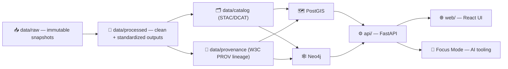

# 🧰 KFM Toolbelt (`tools/kfm/`)


> ⚠️ **North Star:** KFM is a *provenance-first* system. This toolbelt exists to make the **canonical pipeline flow** fast, repeatable, and hard-to-mess-up.  
> If a workflow bypasses metadata + provenance, it’s not a KFM workflow. 🧾🧬

---

## 🧭 What this folder is for

This directory is the **developer/operator toolbelt** for Kansas Frontier Matrix (KFM). It’s where we keep the scripts/CLIs that:

- 🚀 **Bring the stack up/down** quickly (DBs + API + Web UI + optional policy engines)
- 🧪 Run **smoke tests** and common dev checks (lint/test, endpoint pings, dataset integrity)
- 🧰 Run/validate **pipelines** and enforce “no surprises” ETL behavior
- 🗂️ Generate/validate **STAC/DCAT catalog** entries and **W3C PROV** lineage logs
- 🧠 Provide “one-liners” to **reindex** / refresh derived stores (graph/search) when needed
- 🧯 Provide consistent **troubleshooting** patterns (ports, permissions, container health)

> 💡 Keep this folder **boring**: deterministic inputs → deterministic outputs.  
> “It worked on my machine” is not a valid KFM data artifact. 😅

---

## 🔁 KFM canonical flow (do not skip steps)



---

## ⚡ Quickstart (dev ergonomics)

> These are “lowest common denominator” commands that should work even if your local `kfm` CLI wrapper isn’t installed yet.

### 1) Start the dev stack 🐳

```bash
# from repo root
docker-compose up --build
```

Typical services include (names may vary by compose file):
- `db` → Postgres + PostGIS (often `localhost:5432`)
- `graph` → Neo4j (often `localhost:7474` + bolt `7687`)
- `api` → FastAPI (often `localhost:8000`)
- `web` → React dev server (often `localhost:3000`)
- `opa` → optional policy sidecar (often `localhost:8181`)

### 2) Explore APIs 🔎

```text
Swagger UI:  http://localhost:8000/docs
GraphQL:     http://localhost:8000/graphql   (if enabled)
Neo4j UI:    http://localhost:7474           (if enabled)
Web UI:      http://localhost:3000
```

### 3) Run tests (inside container) ✅

```bash
docker-compose exec api pytest
```

---

## 🧩 Expected layout (this toolbelt’s “contract”)

This repo may evolve, but this folder should generally look like:

```text
🧰 tools/kfm/
├── README.md                 # 👈 you are here
├── kfm                        # (optional) 🚀 single-entry CLI (shell/python/node)
├── commands/                  # 🧱 subcommands grouped by domain (stack/pipeline/catalog/…)
├── templates/                 # 🧾 STAC/DCAT/PROV templates or scaffolds
├── checks/                    # ✅ validation rules (schema checks, lint rules, policies)
└── examples/                  # 🧪 example invocations + sample configs
```

> ✍️ If you add a script/command here, also update this README so the “contract” stays accurate.

---

## 🧑‍💻 The `kfm` CLI (recommended interface)

If this repo includes a `kfm` entrypoint (script/binary), treat the following as the **preferred UX**.

> Not all commands may exist yet — this list is the *target* command surface. Add incrementally.

### 🐳 Stack commands

```bash
kfm stack up         # docker-compose up --build
kfm stack down       # docker-compose down
kfm stack status     # container health summary
kfm stack logs api   # tail logs for a service
```

### 🧪 Developer checks

```bash
kfm doctor           # environment + ports + dependencies check
kfm test             # run api/web tests (or delegates)
kfm lint             # formatting/lint checks (repo conventions)
```

### 🧼 Pipeline commands (ETL + sims)

```bash
kfm pipeline list
kfm pipeline run <pipeline_name> [--since <date>] [--force]
kfm pipeline report <pipeline_name>   # summarize records, extents, outputs
```

### 🗂️ Catalog & provenance validation

```bash
kfm catalog validate             # STAC/DCAT schema checks + required fields
kfm provenance validate          # PROV schema checks + required links
kfm publish check <dataset_id>   # “ready for DB/API/UI?” gate ✅/❌
```

### 🗄️ Load to databases

```bash
kfm db load postgis <dataset_id>
kfm db load neo4j  <dataset_id>
kfm db reset --yes-i-mean-it      # dangerous: local/dev only
```

### 🧠 AI / Focus Mode checks

```bash
kfm ai status
kfm ai test "List major trails in Kansas and their purposes."
```

---

## 🧾 Non-negotiables (data integrity rules)

These rules exist to protect KFM’s core promise: **everything is evidence-backed and traceable** 🧬

### ✅ Pipelines must be deterministic

- 🚫 No interactive prompts in official pipelines
- 🧪 Re-running with the same inputs should produce **byte-identical** outputs
- ♻️ Pipelines should be **idempotent** (don’t duplicate outputs on repeated runs)

### ✅ Raw data is read-only

- `data/raw/` is the **snapshot** of the source (don’t “clean” it in place)
- All transformation happens downstream → outputs go to `data/processed/`

### ✅ Every dataset must ship with boundary artifacts

For each published dataset or “evidence artifact”:
- 📦 Processed output(s) in `data/processed/...`
- 🗂️ STAC/DCAT record(s) in `data/catalog/...`
- 🧬 PROV lineage in `data/provenance/...`

> 🧠 **AI outputs are also datasets.** If an analysis/LLM produces a layer, it must be cataloged + traced like anything else.

---

## 🧱 Adding a new domain (repeatable pattern)

When you add a new data domain, aim for isolation + clarity:

- 📥 `data/raw/<domain>/...`
- 🧪 (optional) `data/work/<domain>/...` for intermediates (if used in this repo)
- 📦 `data/processed/<domain>/...`
- 🗂️ `data/catalog/...` (STAC/DCAT entries)
- 🧬 `data/provenance/...` (PROV lineage)
- 📚 `docs/data/<domain>/README.md` (runbook: sources, ETL steps, gotchas)

✅ This keeps PR review simple and provenance auditable.

---

## 🔐 Governance posture (how tools should behave)

KFM tooling should be **fail-closed by default**:

- Missing license? ❌ block / fail CI
- Missing metadata/provenance? ❌ block publish
- Policy violation? ❌ deny access / deny merge

Tooling should help contributors “do the right thing” by default, with clear error messages and links to the fix.

---

## 🧯 Troubleshooting (common dev pains)

### 🔌 Port conflicts
If you already have services running locally, you may collide with:
- `5432` (Postgres)
- `7474/7687` (Neo4j)
- `8000` (API)
- `3000` (Web)

✅ Fix: stop the conflicting service or change compose port mappings.

### 🧱 Volume permissions / file writes
If containers can’t write into `data/` (mounted volume), you may see permission errors.

✅ Fix ideas:
- ensure local folder permissions allow Docker to write
- align container user UID/GID to host (compose/devcontainer settings)

### 🐢 Slow / killed containers
Large datasets can exceed default Docker memory settings.

✅ Fix:
- increase Docker memory/CPU
- run fewer services during pipeline work

---

## 🧷 Helpful links (within this repo)

- 🏠 Project root: `../../README.md`
- 🧠 Architecture overview: `../../docs/architecture/system_overview.md`
- 🧪 Pipelines: `../../pipelines/`
- 🗃️ Data lake: `../../data/`
- 📚 Docs hub: `../../docs/`

---

## ✅ Toolbelt maintenance checklist

When you change tooling in `tools/kfm/`:

- [ ] Update this README (command surface + examples)
- [ ] Add/adjust validation checks (catalog/prov gates)
- [ ] Keep commands **non-interactive** and **idempotent**
- [ ] Prefer “dry-run” modes for anything destructive
- [ ] Add one “happy path” example in `tools/kfm/examples/`
- [ ] Ensure errors are actionable (tell the user *what* to fix + *where*)

---

### 🧡 Philosophy
KFM is an atlas, a lab notebook, and a community artifact — all at once.  
This toolbelt exists to keep the *lab notebook* honest. 🧾🗺️

