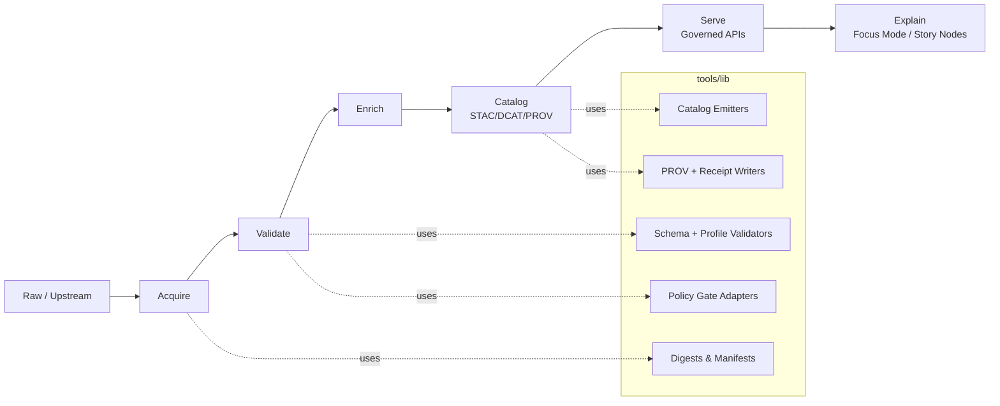

<!--
tools/lib/README.md

KFM Tools Library — shared, deterministic helpers for validators, catalog emitters, receipts,
and policy gates.

This README is governed documentation: keep it CI-friendly and link-check clean.
-->


# 🧰 `tools/lib`

Shared libraries for **KFM tooling** (validators, catalog emitters, provenance/receipt helpers, policy adapters).

> [!NOTE]
> **Entrypoints live in** `tools/<tool-name>/`.  
> **Reusable code lives here** in `tools/lib/`.

---

## 🎯 Purpose

KFM’s pipeline depends on consistent **boundary artifacts** and **gates** (catalogs, provenance, receipts, policy checks).  
`tools/lib` exists to make that tooling:

- **Reusable** across multiple tools and CI workflows
- **Deterministic** (same inputs + config → same outputs)
- **Contract-first** (schemas/profiles enforced)
- **Fail-closed** (missing rights/provenance/policy signals → deny promotion)

---

## ✅ What belongs here

Typical responsibilities for `tools/lib` include:

- **Digest + manifest utilities** (e.g., SHA-256 computation, deterministic manifests)
- **STAC / DCAT / PROV helpers**
  - emitters (write “boundary artifacts”)
  - validators (schema/profile checks, link-checks)
- **Receipt / run-manifest helpers**
  - stable JSON shapes
  - consistent error formats
- **Policy adapters**
  - prepare structured inputs for OPA/Conftest
  - run policy checks and normalize failures
- **Safe IO helpers**
  - atomic writes
  - directory conventions for `data/raw/`, `data/work/`, `data/processed/`, `data/stac/`, `data/catalog/dcat/`, `data/prov/`

---

## ❌ What does *not* belong here

- Domain-specific ETL logic → `src/pipelines/...`
- UI components → `web/...`
- API route handlers / server code → `src/server/...`
- Anything that encourages bypassing the governed API boundary (trust membrane)

> [!IMPORTANT]
> The subfolders listed below are an **opinionated default** *(not confirmed in repo)*.  
> Adjust to match the actual repository contents and conventions.

---

## 🗂️ Suggested directory layout

```text
tools/
├── lib/
│   ├── README.md
│   ├── core/                 # pure helpers: hashing, paths, JSON, logging, time
│   ├── catalogs/             # STAC/DCAT/PROV emit + validate helpers
│   ├── provenance/           # PROV + receipt/manifest helpers
│   ├── policy/               # OPA/Conftest invocation + input shaping
│   ├── geo/                  # geometry sanity checks, CRS helpers, bounds checks
│   ├── io/                   # atomic writes, file locks, directory utilities
│   └── fixtures/             # golden files used by unit/contract tests
└── <tool-name>/              # tool entrypoints (validation, linting, catalog QA, etc.)
```

---

## 🧱 Non-negotiables this code must preserve

| Invariant | What it means for `tools/lib` |
|---|---|
| **Evidence-first** | Tool outputs should be traceable to inputs + configuration. Prefer receipts + digests. |
| **Contract-first** | Emit/consume schema-validated artifacts (schemas/profiles are first-class). |
| **Deterministic & replay-safe** | Avoid hidden time/randomness. Inject time explicitly if needed. |
| **Fail closed** | Missing rights/license/provenance/policy → **deny** (don’t “warn and continue”). |
| **Trust membrane** | Don’t add helpers that enable UI/external clients to touch storage directly. |

---

## 🧭 How `tools/lib` fits the KFM pipeline



---

## 🔁 Recommended tool shape

Keep tool entrypoints simple and consistent:

```text
load inputs
  → normalize
  → validate schemas/profiles
  → run policy gate (fail-closed)
  → write outputs atomically
  → emit receipt/manifest + provenance
```

### Error handling rules

- Prefer structured errors: `{ code, message, details }`
- Never auto-fill missing license/rights/sensitivity metadata
- When uncertain: **deny with an actionable message**

---

## 🧑‍💻 Contributing

### Add a new helper module

- [ ] **Small scope** (one concern per module)
- [ ] **Deterministic** (no implicit timestamps/randomness)
- [ ] **Tested** (unit tests + at least one golden fixture)
- [ ] **Documented** (docstring/header comment + this README updated if needed)
- [ ] **No trust-membrane regression**
- [ ] **No secrets** committed; tools should read credentials from env/vault at runtime

### Definition of Done (changes under `tools/lib/`)

- ✅ Unit tests pass  
- ✅ Lint/format checks pass  
- ✅ Schema/profile validations pass (STAC/DCAT/PROV when applicable)  
- ✅ Policy unit tests pass (when relevant)  
- ✅ Diff is reviewable (small, clear intent)  

---

## 🔗 Related repo artifacts (canonical places)

Use these as the “source of truth” when wiring tooling into the governed pipeline:

- `schemas/` — JSON Schemas for receipts/manifests/catalogs
- `policy/opa/` — fail-closed policy packs (OPA/Rego)
- `docs/MASTER_GUIDE_v13.md` — canonical pipeline & repo structure
- `docs/standards/` — KFM STAC/DCAT/PROV profiles
- `src/pipelines/` — domain pipelines (tooling supports these; tooling should not replace them)

---

<details>
<summary>FAQ</summary>

**Why not put this in <code>src/</code>?**  
Because this is tooling support code (CI gates, validators, catalog emitters) that should remain lightweight and reusable across multiple tools.

**Can tooling call databases/object stores?**  
If a tool must touch storage, prefer doing so through the same ports/adapters used by production code, and keep the access surface minimal, audited, and policy-gated.

</details>