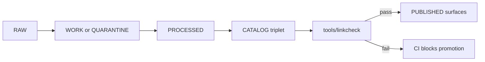

<!-- [KFM_META_BLOCK_V2]
doc_id: kfm://doc/3455e0ac-e920-4872-938b-63640d57c707
title: Linkcheck tool
type: standard
version: v1
status: draft
owners: KFM Engineering
created: 2026-02-22
updated: 2026-02-22
policy_label: public
related: []
tags: [kfm, tooling, ci, promotion-gate, linkcheck]
notes:
  - Contract-first README for tools/linkcheck.
[/KFM_META_BLOCK_V2] -->

# Linkcheck
Deterministic, **fail-closed** link integrity checks for KFM catalogs and citations.


## Navigate
- [Purpose](#purpose)
- [What this checks](#what-this-checks)
- [Quick start](#quick-start)
- [Directory layout](#directory-layout)
- [CI integration](#ci-integration)
- [Configuration](#configuration)
- [Reports and exit codes](#reports-and-exit-codes)
- [Adding new checks](#adding-new-checks)
- [Governance and safety](#governance-and-safety)
- [Troubleshooting](#troubleshooting)
- [References](#references)

---

## Purpose

KFM relies on **cross-linked catalogs** (DCAT + STAC + PROV) to make datasets navigable, auditable, and citeable.
If those links drift or break, *everything above them* (evidence resolution, citations, UI “evidence drawers”, and
Focus Mode cite-or-abstain) becomes unreliable.

**This tool exists to turn “catalog cross-linking” into enforceable behavior in CI.**

### Promotion gate alignment

**CONFIRMED requirement:** promotion must be blocked unless **cross-links resolve** and **EvidenceRefs resolve** for the dataset version being promoted.

Linkcheck is the mechanism that enforces that gate as code (not as “reviewer memory”).

### What “fail-closed” means here

If a promoted dataset version contains broken or ambiguous links, linkcheck must exit non‑zero so CI blocks promotion.

> ✅ Linkcheck is intended to be run **after** schema validation (DCAT/STAC/PROV validators) and **before** any
> “promotion” step that publishes the dataset to governed runtime surfaces.

### Where it fits in the Truth Path



[Back to top](#linkcheck)

---

## What this checks

### Catalog cross-links

Minimum cross-link rules this tool must be able to verify:

- A DCAT Dataset record enumerates Distributions, and each Distribution points to an artifact digest (or a digest-pinned URI)
- A DCAT Dataset record points to the PROV activity that generated it (for example via `prov:wasGeneratedBy`)
- A STAC Collection links to its DCAT Dataset record via `rel="describedby"`
- Each STAC Item links to a PROV activity and/or a run receipt (so you can trace “what produced this”)
- EvidenceRef schemes map to these objects **deterministically** (no heuristics / no guessing)

> NOTE  
> Cross-links must be deterministic. “Best effort” resolution is not acceptable for promoted artifacts.

### Repo-context resolution

By default, linkcheck should operate in **repo context**:

- Resolve relative paths against the repo checkout
- Resolve content-addressed digests against the expected artifact layout
- Treat network access as *optional* (see [Configuration](#configuration))

### Non-goals

Linkcheck is **not** intended to be:

- a full internet crawler
- a validator for JSON schema (that’s `tools/validators/*`)
- a content checker (it verifies referential integrity, not scientific/historical correctness)

[Back to top](#linkcheck)

---

## Quick start

> This README documents the **contract** for the linkcheck tool. If your implementation uses different filenames
> or a different runtime (Node/Python/etc.), update the commands below to match.

### Run locally

```bash
# Typical entrypoint for catalog cross-link checking
node tools/linkcheck/catalog_linkcheck.js
```

### Run against a specific dataset subtree

```bash
node tools/linkcheck/catalog_linkcheck.js \
  --root data \
  --include "data/**/catalog/**" \
  --report artifacts/linkcheck-report.json
```

### Developer-friendly output

```bash
node tools/linkcheck/catalog_linkcheck.js --format pretty
```

[Back to top](#linkcheck)

---

## Directory layout

Expected layout (adjust if your repo differs):

```text
tools/
└─ linkcheck/
   ├─ README.md
   ├─ catalog_linkcheck.js        # catalog cross-link verification (entrypoint; name from KFM CI example)
   ├─ linkcheck.config.json       # optional config (repo defaults)
   ├─ lib/                        # implementation helpers (resolvers, scanners)
   └─ fixtures/                   # tiny catalog fixtures for tests
```

[Back to top](#linkcheck)

---

## CI integration

The intended CI posture is “run on every PR that touches promoted artifacts or catalogs”.

Example (GitHub Actions style):

```yaml
- name: Validate catalogs
  run: |
    node tools/validators/validate_dcat.js
    node tools/validators/validate_stac.js
    node tools/validators/validate_prov.js

- name: Linkcheck citations
  run: node tools/linkcheck/catalog_linkcheck.js
```

### When to run it

Run linkcheck when any of the following change:

- DCAT / STAC / PROV JSON or JSON-LD files
- processed artifact manifests or digest lists
- run receipts
- schema/profile changes that alter cross-link expectations

[Back to top](#linkcheck)

---

## Configuration

> **PROPOSED** default config shape. Adopt only if your implementation supports it.

### Configuration file

`tools/linkcheck/linkcheck.config.json`:

```json
{
  "mode": "offline",
  "roots": ["data", "prov", "catalog"],
  "include": ["**/*.json", "**/*.jsonld"],
  "exclude": ["**/node_modules/**", "**/.git/**"],
  "external": {
    "enabled": false,
    "allowDomains": [],
    "timeoutMs": 5000,
    "maxConcurrency": 8
  },
  "policy": {
    "redactInLogs": true,
    "skipSchemes": ["mailto", "tel"]
  }
}
```

### Offline vs online

- **offline (default)**: verify only what can be proven from repo + artifacts + digests
- **online (optional)**: also `HEAD`/`GET` external URLs (recommended only with allowlisted domains)

> WARNING  
> Online checking can introduce flakiness. If enabled, keep it **allowlist-only** and cache results.

[Back to top](#linkcheck)

---

## Reports and exit codes

### Exit codes

- `0` — all checks passed
- `1` — at least one broken link (promotion must be blocked)
- `2` — invalid arguments/config
- `3` — unexpected exception (treat as failure in CI)

### Report format

> **PROPOSED** report schema. Keep it stable once adopted.

```json
{
  "tool": "kfm-linkcheck",
  "version": "1.0.0",
  "started_at": "2026-02-22T00:00:00Z",
  "finished_at": "2026-02-22T00:00:02Z",
  "mode": "offline",
  "totals": { "checked": 123, "errors": 2, "warnings": 1 },
  "errors": [
    {
      "code": "E_LINK_MISSING",
      "from": "data/hazards/noaa/catalog/stac-collection.json",
      "to": "prov/run/2026-02-20T12:34Z.noaa.abcd1234.jsonld",
      "message": "STAC item links to a PROV run receipt that does not exist in repo context."
    }
  ],
  "warnings": []
}
```

[Back to top](#linkcheck)

---

## Adding new checks

When you add a new catalog profile field or EvidenceRef scheme, treat linkcheck as part of the
**promotion contract**:

1. Add/adjust a resolver (how to resolve this link in repo context)
2. Add fixture(s) in `fixtures/` for pass + fail cases
3. Add a unit test that asserts:
   - the failure is detected
   - the error code is stable and actionable
4. Update this README with the new rule (and why it’s required)

### Definition of Done for a new rule

- [ ] Rule is deterministic (no guessing)
- [ ] Rule is covered by tests (pass + fail)
- [ ] Report includes actionable remediation text
- [ ] CI blocks promotion when the rule fails

[Back to top](#linkcheck)

---

## Governance and safety

### Don’t leak sensitive paths or links

If catalogs include restricted locations, partner-controlled endpoints, or private artifact stores:

- redact tokens and credentials in logs
- consider masking full URLs in failure output (show domain + path prefix only)
- treat “restricted” policy labels as **default-deny** for external checks

### Determinism over convenience

Prefer checks that are:

- local and reproducible
- pinned by digest
- independent of third-party uptime

### Threat considerations

Link sources are untrusted input. Linkcheck must:

- treat catalogs and markdown as data, not code
- never execute embedded scripts or follow `file://` outside the repo root
- cap recursion and concurrency to avoid DoS during CI runs

[Back to top](#linkcheck)

---

## Troubleshooting

### “It passes locally but fails in CI”

Common causes:

- CI runs from a different working directory (use repo-root resolution)
- files generated locally are missing from the PR
- config differs between local and CI

Recommended debugging:

```bash
node tools/linkcheck/catalog_linkcheck.js --debug --format pretty
```

### “We have legit external links, but CI is flaky”

- keep external checking disabled in CI
- move the external URL into a “reference registry” and pin it via snapshot if it matters for promotion
- if you must check external links, allowlist domains and increase timeouts modestly

[Back to top](#linkcheck)

---

## References

Internal KFM requirements that motivate this tool:

- KFM: cross-linking rules and “CI should include a link-checker” (see Definitive Design & Governance Guide, vNext draft)
- KFM: promotion workflow includes “Linkcheck citations” step in CI (illustrative workflow)
