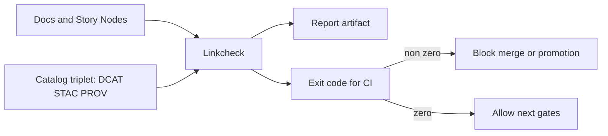

<!-- [KFM_META_BLOCK_V2]
doc_id: kfm://doc/cb299109-a84e-48ce-bfcb-b107245cc921
title: tools/linkcheck/README
type: standard
version: v1
status: draft
owners: TBD
created: 2026-02-26
updated: 2026-02-26
policy_label: public
related:
  - docs/MASTER_GUIDE_v13.md
  - docs/standards/KFM_MARKDOWN_WORK_PROTOCOL.md
  - tools/validators/
  - policy/rego/
tags: [kfm, tooling, ci, governance, linkcheck]
notes:
  - Fail-closed reference integrity gate for catalogs, docs, and Story Nodes.
[/KFM_META_BLOCK_V2] -->

<a id="top"></a>

# Linkcheck

**Purpose:** fail-closed validation of **links, citations, and cross-references** so that *nothing user-facing ships with broken evidence*.  
**Primary use:** CI promotion gates (blocks merge/promotion when references don’t resolve).

**Status:** `draft` (verify wiring + entrypoints) · **Owners:** `TBD`

 <!-- TODO: wire to real workflow badge -->

-blue) <!-- TODO: confirm runtime + versions in repo -->

---

## Quick navigation

- [What this tool is](#what-this-tool-is)
- [Where it fits in KFM](#where-it-fits-in-kfm)
- [Quickstart](#quickstart)
- [What gets checked](#what-gets-checked)
- [Inputs and outputs](#inputs-and-outputs)
- [CI integration](#ci-integration)
- [Definition of done](#definition-of-done)
- [Governance and safety notes](#governance-and-safety-notes)
- [Troubleshooting](#troubleshooting)
- [Directory layout](#directory-layout)
- [Appendix](#appendix)

---

## What this tool is

`tools/linkcheck/` is the home for **reference integrity checks** used by KFM CI to prevent:

- docs pointing to files that were moved/removed,
- Story Nodes citing sources that don’t exist,
- catalog artifacts (DCAT/STAC/PROV) that don’t cross-link cleanly,
- “EvidenceRef” / citation handles that can’t be resolved.

> **Fail-closed rule:** if a reference is ambiguous or missing, the tool should exit non‑zero and CI should block.

---

## Where it fits in KFM

KFM treats **cross-links and citations** as a promotion requirement (alongside schema-valid catalogs, policy tests, etc.). Link checking is part of the CI workflow and is intended to run after catalog schema validators and before policy/contract gates.



---

## Quickstart

### Run in CI (expected)

The design docs show CI invoking the catalog link checker like this:

```bash
node tools/linkcheck/catalog_linkcheck.js
```

If your repo uses a different entrypoint name (or a wrapper script), update this README and the CI step accordingly.

### Run locally

```bash
# from repo root
node tools/linkcheck/catalog_linkcheck.js

# always check help if available
node tools/linkcheck/catalog_linkcheck.js --help
```

---

## What gets checked

> **Important:** the *exact* checks depend on the implementation in this folder. The table below captures the **required intent** (what CI is trying to guarantee).

| Check area | Examples of what must resolve | Why it matters | Expected behavior |
|---|---|---|---|
| **Catalog cross-links** | DCAT ↔ STAC ↔ PROV references line up; IDs referenced exist | Prevent “published” datasets that can’t be traced end-to-end | Fail the run |
| **Asset href existence** | STAC assets / distributions point to real artifacts (or a resolvable stable URI) | Prevent UI from linking to missing data | Fail the run |
| **EvidenceRef resolvability** | EvidenceRefs used by Story Nodes / Focus cases point to known evidence bundles or catalog items | Enforces cite-or-abstain and protects trust membrane | Fail the run |
| **Doc and Story Node links** *(recommended)* | Internal links, citations, and reference tags are valid | Prevent broken narratives and missing sources | Fail the run |

---

## Inputs and outputs

### Typical inputs (expected locations)

These are the canonical homes used throughout KFM:

- Catalogs: `data/catalog/dcat/`, `data/stac/`, `data/prov/`
- Docs / Story Nodes: `docs/`, plus any Story Node directories under `docs/` (project-dependent)

> If your repo uses different paths, treat them as configuration and keep the tool deterministic.

### Outputs (recommended contract)

Even if the implementation differs, KFM benefits from a stable output contract:

- **Exit code**
  - `0` → all references resolve
  - `!= 0` → at least one unresolved/invalid reference
- **Machine report** (recommended)
  - `artifacts/reports/linkcheck.json`
- **Human summary** (recommended)
  - `artifacts/reports/linkcheck.md`

<details>
<summary><strong>Suggested JSON report shape</strong> (proposed)</summary>

```json
{
  "ok": false,
  "checked_at": "2026-02-26T00:00:00Z",
  "counts": { "files_scanned": 123, "refs_checked": 456, "errors": 2, "warnings": 7 },
  "errors": [
    {
      "type": "missing_target",
      "source_file": "data/catalog/dcat/example.jsonld",
      "ref": "stac://items/does-not-exist",
      "message": "Referenced STAC item not found"
    }
  ],
  "warnings": []
}
```

</details>

---

## CI integration

### Minimal GitHub Actions example

```yaml
- name: Validate catalogs
  run: |
    node tools/validators/validate_dcat.js
    node tools/validators/validate_stac.js
    node tools/validators/validate_prov.js

- name: Linkcheck citations
  run: node tools/linkcheck/catalog_linkcheck.js
```

### Gate placement guidance

Recommended ordering (high-level):

1. **Lint / typecheck**
2. **Unit tests**
3. **Catalog schema validators**
4. **Linkcheck (this tool)**
5. **Policy tests**
6. **Spec-hash drift / contract tests**
7. **Focus Mode eval harness (optional early)**

---

## Definition of done

This folder is “gate-ready” when:

- [ ] The CI job runs linkcheck on every PR that touches catalogs/docs.
- [ ] Broken or missing references cause a non-zero exit code.
- [ ] The tool produces a stable, machine-readable report artifact.
- [ ] There are fixtures/tests for at least:
  - [ ] one passing case
  - [ ] one broken-cross-link case
  - [ ] one missing-asset-href case
  - [ ] one unresolved EvidenceRef/citation case (if applicable)
- [ ] External URL fetching is either disabled in CI or tightly allowlisted.

---

## Governance and safety notes

- **Default-deny / fail-closed:** do not “best effort” a broken reference into a pass.
- **Don’t leak sensitive content in logs:** if a missing reference points to a restricted dataset, keep the error message descriptive but not disclosive.
- **Be careful with external network calls:** prefer *offline* validation (existence + formatting) unless an explicit allowlist is configured (avoid accidental scanning of third-party sites from CI runners).
- **Determinism:** results should not depend on time-of-day or external availability.

---

## Troubleshooting

### “It fails on my branch but not on main”

Common causes:

- You moved or renamed a file without updating all references (docs, Story Nodes, catalog links).
- A dataset version ID changed but an EvidenceRef wasn’t updated everywhere.
- A catalog validator passed schema, but cross-links between catalogs are now inconsistent.

**Fix pattern:** locate the first reported broken reference, update the source to point to the new target, and rerun.

### “CI is timing out”

If your implementation checks external URLs:

- add an allowlist + caching, or
- switch to offline-only mode in CI, and run deep external checking only in scheduled jobs.

---

## Directory layout

> Directory documentation standard: **title + purpose**, **where it fits**, **acceptable inputs**, **exclusions**.

```text
tools/linkcheck/
  README.md                   # You are here
  catalog_linkcheck.js         # (expected) catalog cross-link validator used by CI
  ...                          # implementation-specific helpers, tests, configs
```

### Acceptable inputs

- Catalog artifacts and/or docs that are part of the governed KFM build.
- Configuration files for link checking (ignore lists, allowlists), if present.

### Exclusions

- Not a content linter for prose quality.
- Not a replacement for JSON Schema validation (that belongs in `tools/validators/`).
- Not a network scanner / crawler unless explicitly configured and approved.

---

## Appendix

### Minimum verification steps (to confirm this README matches reality)

1. List the directory: `ls -la tools/linkcheck/`
2. Confirm the CI entrypoint: search CI config for `tools/linkcheck/`
3. Run locally and confirm expected exit codes + reports:
   - `node tools/linkcheck/catalog_linkcheck.js`
4. Ensure failures block merge in CI.

---

**Back to top:** [↑](#top)
