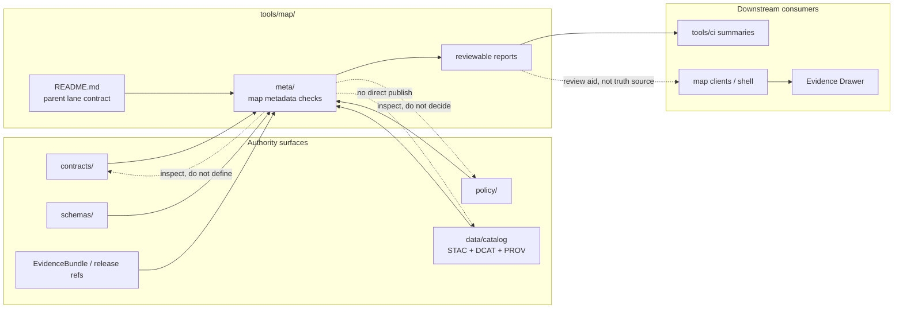

<!-- [KFM_META_BLOCK_V2]
doc_id: kfm://doc/NEEDS-UUID
title: tools/map
type: standard
version: v1
status: draft
owners: @bartytime4life
created: 2026-04-18
updated: 2026-04-18
policy_label: public
related: [../README.md, ./meta/README.md, ../../README.md, ../../.github/README.md, ../../.github/CODEOWNERS, ../../contracts/, ../../schemas/, ../../policy/, ../../data/, ../../tests/, ../../apps/, ../../packages/, ../../pipelines/, ../../scripts/]
tags: [kfm, tools, map, maplibre, metadata, descriptors, evidence]
notes: [Replaces an empty README placeholder for tools/map, owner inherited from current CODEOWNERS /tools coverage, doc_id remains a review placeholder, final leaf-specific ownership and policy label should be rechecked before publish.]
[/KFM_META_BLOCK_V2] -->

<a id="top"></a>

# `tools/map`

Map-facing helper namespace for descriptor quality, representation-risk review, and governed map support utilities in Kansas Frontier Matrix.


> [!IMPORTANT]
> **Status:** experimental  
> **Owners:** `@bartytime4life` *(inherited from current `/tools/` ownership; narrower `tools/map/` ownership NEEDS VERIFICATION)*  
> **Path:** `tools/map/README.md`  
> **Quick jumps:** [Scope](#scope) · [Repo fit](#repo-fit) · [Accepted inputs](#accepted-inputs) · [Exclusions](#exclusions) · [Current evidence snapshot](#current-evidence-snapshot) · [Directory tree](#directory-tree) · [Quickstart](#quickstart) · [Usage](#usage) · [Diagram](#diagram) · [Operating tables](#operating-tables) · [Task list](#task-list--definition-of-done) · [FAQ](#faq) · [Appendix](#appendix)

> [!WARNING]
> `tools/map/` may support map-facing review, validation, and summary work. It must not become a hidden map runtime, schema authority, policy authority, release manager, catalog source of truth, or shortcut around the Evidence Drawer.

> [!NOTE]
> This README uses KFM truth labels deliberately: **CONFIRMED**, **INFERRED**, **PROPOSED**, **UNKNOWN**, and **NEEDS VERIFICATION**.

---

## Scope

`tools/map/` is the parent helper lane for **map-facing support utilities**.

Use this lane for small, reviewable helpers that make map artifacts easier to inspect before they reach a governed shell. The lane exists because KFM treats map claims as evidence-bearing claims: a layer, legend, view, descriptor, or style hint can shape what a user thinks is true.

This lane should help maintainers answer five questions quickly:

1. Does a map-facing descriptor say what it is actually representing?
2. Does it expose enough CRS, time, support, source-role, and uncertainty context for review?
3. Does it preserve the split between data, styling, catalog linkage, policy, and runtime rendering?
4. Does it route outward map claims toward EvidenceBundle / catalog / release surfaces instead of browser-side truth assembly?
5. Is the helper small enough to be reviewed, tested, and reversed without changing product runtime behavior?

### Scope boundary

| Claim | Status | Handling |
|---|---:|---|
| `tools/map/` exists as a current public repo path | **CONFIRMED** | Treat as a real parent lane. |
| `tools/map/README.md` had no substantive content before this revision | **CONFIRMED** | This file establishes the parent lane contract. |
| `tools/map/meta/` exists as the current child lane | **CONFIRMED** | Keep parent and child responsibilities aligned. |
| Executable map helper inventory is mature | **UNKNOWN** | Do not claim helper maturity without direct checkout inspection. |
| Map-facing metadata checks are a proper first focus | **INFERRED** | Grounded in the existing `meta/` child README and KFM shell doctrine. |
| New checker names, fixtures, and report formats | **PROPOSED** | Add only with tests/examples and caller documentation. |

[Back to top](#top)

---

## Repo fit

**Path:** `tools/map/README.md`  
**Role in repo:** parent directory README for map-facing helper lanes that support descriptor review, metadata checks, representation-risk summaries, MapLibre-facing source/layer sanity checks, and reviewer-readable reports.

### Upstream, sibling, and downstream surfaces

| Direction | Surface | Relationship | Why it matters |
|---|---|---|---|
| Upstream | [`../README.md`](../README.md) | parent `tools/` contract | Defines the reusable helper surface and prevents `tools/` from becoming runtime or policy law. |
| Upstream | [`../../README.md`](../../README.md) | root repo orientation | Keeps the map helper lane aligned with KFM’s evidence-first identity. |
| Governance | [`../../.github/README.md`](../../.github/README.md) | gatehouse context | Review, ownership, and merge posture travel through repo control surfaces. |
| Governance | [`../../.github/CODEOWNERS`](../../.github/CODEOWNERS) | owner map | Current owner fallback for `/tools/`; leaf-specific ownership still needs confirmation. |
| Adjacent authority | [`../../contracts/`](../../contracts/) | normative object meaning | Map helpers consume declared contracts; they do not define contract truth. |
| Adjacent authority | [`../../schemas/`](../../schemas/) | machine validation boundary | Field shape belongs in schemas, not buried inside map helper code. |
| Adjacent authority | [`../../policy/`](../../policy/) | decision logic | Rights, sensitivity, denial, and publishability remain policy-governed. |
| Adjacent data | [`../../data/`](../../data/) | lifecycle/categorical data surfaces | Receipts, proofs, catalogs, and published assets do not belong inside `tools/map/`. |
| Adjacent verification | [`../../tests/`](../../tests/) | fixtures and assertions | Any non-trivial helper should have success and failure coverage. |
| Adjacent runtime | [`../../apps/`](../../apps/) | product/app surfaces | Product map runtime should not be hidden in helper lanes. |
| Adjacent shared code | [`../../packages/`](../../packages/) | library code | Broadly imported logic belongs in packages, not one-off helpers. |
| Adjacent operations | [`../../pipelines/`](../../pipelines/) | lane-specific execution | Source fetch, transform, tiling, publish, and watcher flows belong near their lane. |
| Adjacent orchestration | [`../../scripts/`](../../scripts/) | operator entrypoints | Scripts may call helpers; helpers should remain independently inspectable. |
| Current child | [`./meta/README.md`](./meta/README.md) | map metadata helper lane | Owns metadata-oriented checks and review aids beneath this parent. |

### Placement rule

`tools/map/` should be a **map helper namespace**, not a map application.

| Belongs here when… | Does not belong here when… |
|---|---|
| The work checks, summarizes, or reviews map-facing descriptors. | The work renders the user-facing map shell. |
| The work helps prove metadata completeness or representation-risk disclosure. | The work defines schema or policy authority. |
| The work produces a small report for CI or steward review. | The work mutates release, catalog, RAW, WORK, PROCESSED, or PUBLISHED state. |
| The work is reusable across map-facing lanes. | The work is a domain pipeline, long-running watcher, or hidden transformation. |

[Back to top](#top)

---

## Accepted inputs

The following content may belong in or under `tools/map/` when it is finite, reviewable, and subordinate to stronger authority surfaces:

- map-facing descriptor checkers
- layer metadata audit helpers
- legend and symbol metadata checkers
- MapLibre source/layer linkage sanity checks
- representation-risk disclosure reports
- style metadata extractors used only for review
- catalog back-pointer checks for map-facing descriptors
- small fixtures for valid and invalid descriptor examples
- CI-readable reports about map metadata completeness
- helper READMEs that route narrow map support lanes

### Accepted input posture

| Input quality | Requirement |
|---|---|
| Explicit | Inputs should be file paths, finite descriptors, fixtures, or declared metadata extracts. |
| Reviewable | A reviewer should understand what was checked without running a full map app. |
| Bounded | Helpers should not discover broad remote state unless a probe contract explicitly allows it. |
| Schema-shaped | Use declared contracts/schemas where available; otherwise mark example shapes as illustrative. |
| Safe | No secrets, unrestricted sensitive coordinates, rights-unclear fixtures, or unpublished steward-only payloads. |

[Back to top](#top)

---

## Exclusions

Do not put these in `tools/map/` as canonical or hidden behavior.

| Excluded content | Put it in | Reason |
|---|---|---|
| Product map UI, shell state, or renderer implementation | [`../../apps/`](../../apps/) or [`../../packages/`](../../packages/) | Runtime behavior must stay visible in runtime/library lanes. |
| MapLibre style-authoring authority | contracts/schemas/docs lane chosen by maintainers | This lane may inspect style metadata; it should not become style law. |
| Canonical schemas, envelopes, or vocabularies | [`../../contracts/`](../../contracts/) and [`../../schemas/`](../../schemas/) | Helper code should not silently define project authority. |
| Rights, sensitivity, admission, or publication decisions | [`../../policy/`](../../policy/) and release/review surfaces | KFM decisions must be policy-visible and fail-closed. |
| Canonical data artifacts, receipts, proofs, catalogs, or published tiles | [`../../data/`](../../data/) and release/evidence lanes | Tools may report on these objects, not own them. |
| Domain ingest, watcher, tiling, or ETL logic | [`../../pipelines/`](../../pipelines/) or [`../../scripts/`](../../scripts/) | Full operational flows should not hide as “map helpers.” |
| Attestation signing or proof-pack assembly | `../attest/` | Proof work already has a helper family. |
| Catalog closure as source of truth | `../catalog/` plus [`../../data/`](../../data/) | Map helpers can inspect back-pointers but not replace catalog closure. |
| One-off visual experiments | scratch / examples / app prototype lane | Reusable helper lanes need reviewable, durable purpose. |
| Restricted coordinates or sensitive fixture payloads | stewarded/private data lanes | Public helper lanes must stay safe to clone and run. |

> [!CAUTION]
> A helper that “just cleans metadata” can still change trust meaning. Any helper that rewrites source role, CRS, time basis, support, or uncertainty must be treated as review-bearing.

[Back to top](#top)

---

## Current evidence snapshot

| Evidence item | Status | How this README uses it |
|---|---:|---|
| `tools/map/` is visible on current public `main` | **CONFIRMED** | Establishes this parent README as a real directory landing page. |
| `tools/map/README.md` is present but effectively empty before this revision | **CONFIRMED** | This draft fills the missing parent-lane orientation. |
| `tools/map/meta/README.md` is present | **CONFIRMED** | Parent README routes to the existing child map-metadata lane. |
| Current `/tools/` owner coverage points to `@bartytime4life` | **CONFIRMED** | Owner block is grounded, but leaf-specific ownership still needs verification. |
| Current helper code under `tools/map/` | **UNKNOWN** | No executable helper inventory is claimed here. |
| Map-facing disclosure burden | **CONFIRMED doctrine** | KFM map artifacts must preserve representation, CRS, time, support, source role, uncertainty, and catalog/evidence context. |
| MapLibre-aware boundary | **CONFIRMED doctrine / runtime boundary** | Sources and layers should remain distinguishable; rendering does not become truth assembly. |
| Parent `tools/README.md` family count | **NEEDS VERIFICATION** | Current live tree shows additional tool families beyond older parent wording; update parent when broad tree claims matter. |

[Back to top](#top)

---

## Directory tree

### Current public shape for this lane

```text
tools/map/
├── README.md
└── meta/
    └── README.md
```

### Current role split

```text
tools/
├── README.md              # parent helper-surface contract
└── map/
    ├── README.md          # this file: map helper namespace and route map
    └── meta/
        └── README.md      # current child: map-facing metadata checks and disclosures
```

### PROPOSED future helper landing shape

```text
tools/map/
├── README.md
├── meta/
│   └── README.md
├── examples/              # PROPOSED: public-safe descriptor fixtures
├── fixtures/              # PROPOSED: valid/invalid machine fixtures
└── tests/                 # PROPOSED: helper behavior tests when code lands
```

> [!NOTE]
> The future helper landing shape is a placement pattern, not current implementation proof. Add child directories only when a concrete helper needs them.

[Back to top](#top)

---

## Quickstart

Start from a live checkout and verify the tree before making behavior-bearing claims.

```bash
# 0) Start from the repository root.
git rev-parse --show-toplevel 2>/dev/null || pwd

# 1) Confirm the current map helper lane.
find tools/map -maxdepth 4 \( -type f -o -type d \) 2>/dev/null | sort

# 2) Inspect parent and child README contracts.
sed -n '1,240p' tools/README.md 2>/dev/null
sed -n '1,240p' tools/map/README.md 2>/dev/null
sed -n '1,260p' tools/map/meta/README.md 2>/dev/null

# 3) Recheck owner and gatehouse context.
sed -n '1,220p' .github/CODEOWNERS 2>/dev/null
sed -n '1,220p' .github/README.md 2>/dev/null
sed -n '1,220p' .github/workflows/README.md 2>/dev/null
```

Search for existing map-facing contract terms before inventing helper names or field aliases.

```bash
grep -RIn \
  "source_role\|valid_time\|as_of\|uncertainty_note\|representation_note\|source-layer\|MapLibre\|EvidenceBundle" \
  README.md docs contracts schemas policy tests tools scripts packages pipelines 2>/dev/null || true
```

Syntax-check executable helper files only when they actually exist.

```bash
find tools/map -type f -name "*.py" -print0 2>/dev/null | xargs -0 -r -n1 python -m py_compile
find tools/map -type f -name "*.mjs" -print0 2>/dev/null | xargs -0 -r -n1 node --check
find tools/map -type f -name "*.sh" -print0 2>/dev/null | xargs -0 -r -n1 bash -n
```

[Back to top](#top)

---

## Usage

### Choose the narrowest map helper job

| Job | Preferred location | Why |
|---|---|---|
| Check map-facing descriptor metadata | `tools/map/meta/` | Current child lane already owns map metadata review aids. |
| Summarize map descriptor completeness for CI | `tools/map/` helper + `../ci/` report shaping | Keep domain check and CI presentation separate. |
| Validate contract shape | `../validators/` or schema test lane | Contract validation should stay coherent with repo-wide validation. |
| Check STAC/DCAT/PROV closure | `../catalog/` | Catalog closure is broader than map metadata. |
| Compare descriptor drift | `../diff/` | Deterministic comparison belongs in the diff lane unless tightly map-specific. |
| Verify proof/signature material | `../attest/` | Proof surfaces should remain centralized. |
| Generate or transform tiles | `../tiler/`, [`../../pipelines/`](../../pipelines/), or another owning lane | Map data production is not a metadata helper. |
| Implement UI interaction | [`../../apps/`](../../apps/) or [`../../packages/`](../../packages/) | Product behavior belongs in runtime/library lanes. |

### Add the first executable helper safely

1. Identify the caller: local reviewer, CI summary, release review, or steward workflow.
2. Confirm whether `tools/map/meta/` already covers the job.
3. Use declared contracts/schemas where they exist.
4. Add at least one valid fixture and one failing fixture for non-trivial checks.
5. Emit a stable output format when CI or review will consume the result.
6. Document the helper in the child README and this parent README in the same PR.
7. Keep policy outcomes, release decisions, and EvidenceBundle resolution outside the helper.

### Preferred report shape

Use JSON or JSONL for machine-consumed reports.

```json
{
  "tool": "map_descriptor_check",
  "status": "fail",
  "blocking": true,
  "subject": "examples/map/hydrology-layer.invalid.json",
  "checks": [
    {
      "id": "crs-present",
      "result": "pass"
    },
    {
      "id": "valid-time-present",
      "result": "fail",
      "message": "map-facing descriptors must declare valid_time or an approved equivalent"
    },
    {
      "id": "representation-risk-disclosed",
      "result": "fail",
      "message": "descriptor must distinguish observed, modeled, regulatory, or narrative context"
    }
  ],
  "audit_ref": "audit:tools:map:descriptor:example-01"
}
```

[Back to top](#top)

---

## Diagram



> [!IMPORTANT]
> The browser renders released, policy-mediated, evidence-linked map surfaces. `tools/map/` helps make those surfaces reviewable; it does not assemble truth for the browser.

[Back to top](#top)

---

## Operating tables

### Minimum burden matrix for map-facing helpers

| Concern | Minimum expectation | Why it matters | Status |
|---|---|---|---:|
| CRS / projection | Check for `crs` or approved equivalent | Hidden reprojection can create false spatial claims. | **CONFIRMED doctrine** |
| Time basis | Check for `valid_time`, `as_of`, or approved equivalents | Observation, source vintage, publication, and UI time are not interchangeable. | **CONFIRMED doctrine** |
| Support / intended use scale | Check for `support` or equivalent | Prevents silent scale jumps and unsupported fusion. | **CONFIRMED doctrine** |
| Source role | Check explicit source-role disclosure | Regulatory, observed, modeled, documentary, and operational feeds have different authority. | **CONFIRMED doctrine** |
| Uncertainty / caveat | Check `uncertainty_note` or equivalent | A visually polished map can still mislead without uncertainty context. | **CONFIRMED doctrine** |
| Representation class | Check whether the descriptor states what kind of representation is shown | A model output, flood regulation layer, and story context layer must not be flattened. | **CONFIRMED obligation / PROPOSED field naming** |
| Catalog / evidence linkage | Check outward references to catalog, release, or evidence surfaces where required | Reviewers need a path from map descriptor to support. | **PROPOSED lane check** |
| MapLibre source/layer split | Check that data source and render layer assumptions remain distinguishable | Renderer configuration should not become semantic truth. | **CONFIRMED boundary** |
| Negative states | Surface missing, stale, restricted, or unresolved states clearly | KFM trust depends on visible refusal and limitation states. | **CONFIRMED doctrine** |

### Current child-lane registry

| Child lane | Current role | Current posture | Parent obligation |
|---|---|---|---|
| [`meta/`](./meta/README.md) | Map-facing metadata, descriptor quality, and representation-risk disclosures | **CONFIRMED path / README-first** | Keep parent scope aligned and avoid duplicate authority. |

### PROPOSED future helper families

| Family | Example helper | Add only when… | Must not do |
|---|---|---|---|
| Descriptor checks | `check_layer_descriptor.py` | A concrete descriptor fixture exists. | Define canonical contract fields by accident. |
| Legend checks | `check_legend_metadata.py` | Symbols/legend metadata become map-facing review objects. | Rewrite style assets or renderer behavior. |
| Source/layer checks | `check_maplibre_source_layer.py` | MapLibre-facing source/layer metadata needs review support. | Pretend style JSON is the truth source. |
| Catalog back-pointer checks | `check_map_catalog_refs.py` | Descriptors must point back to released catalog/proof surfaces. | Decide publishability. |
| Review report emitter | `summarize_map_descriptor_report.py` | CI or PR review needs stable summaries. | Hide blocking logic inside PR prose. |

[Back to top](#top)

---

## Task list / Definition of done

### For this README

- [ ] `doc_id` placeholder replaced with a real UUID when the repository’s doc ID process is confirmed.
- [ ] Leaf-specific ownership rechecked against `CODEOWNERS` and any maintainer-owned owner map.
- [ ] Policy label confirmed by the project’s documentation policy.
- [ ] Relative links checked from `tools/map/README.md`.
- [ ] Current evidence snapshot updated if `tools/map/` gains helper code or additional child lanes.
- [ ] Parent [`../README.md`](../README.md) updated if its `tools/` family map is stale relative to current public tree.

### For any new helper under `tools/map/`

- [ ] The helper has one narrow, documented purpose.
- [ ] The helper’s inputs and outputs are finite and reviewable.
- [ ] The helper emits stable machine-readable output when CI or review consumes it.
- [ ] At least one success fixture and one failure fixture exist for non-trivial behavior.
- [ ] The helper does not define schema, policy, release, catalog, or renderer authority.
- [ ] The helper does not fetch undeclared remote state.
- [ ] The helper does not commit secrets, restricted coordinates, or rights-unclear fixtures.
- [ ] The helper can be run locally outside workflow YAML.
- [ ] Caller paths are documented near the helper.
- [ ] Parent and child READMEs are updated together.

### First useful proof slice

- [ ] Add one public-safe hydrology or flood-context map descriptor fixture.
- [ ] Include explicit CRS, valid time, `as_of`, support, uncertainty, source role, representation note, and catalog/evidence back-pointers.
- [ ] Add one invalid fixture missing a time basis.
- [ ] Add one invalid fixture confusing modeled, observed, or regulatory representation class.
- [ ] Emit one reviewer-readable JSON report.
- [ ] Keep the proof slice independent of product runtime and publication state.

[Back to top](#top)

---

## FAQ

### Why does `tools/map/` exist if `tools/map/meta/` already exists?

`tools/map/` is the parent namespace. It explains the map-helper boundary, routes maintainers to `meta/`, and prevents future map helper lanes from drifting into app runtime, policy, schema, or catalog authority.

### Why not put all map helper work in `tools/validators/`?

Use `tools/validators/` when the dominant job is generic validation against declared schemas or contracts. Use `tools/map/` when the dominant job is map-facing descriptor review, representation disclosure, or MapLibre-aware metadata sanity. A serious checker may involve both lanes, but one lane should own the entrypoint.

### Does this lane own MapLibre style JSON?

No. It may inspect MapLibre-facing metadata, source/layer naming, or style-adjacent extracts for review. It does not own renderer behavior, product interaction, style law, or evidence resolution.

### Does this lane decide whether a map layer can be published?

No. It can report missing metadata or risky ambiguity. Publish, quarantine, release, rights, sensitivity, and correction decisions belong to policy, review, release, and catalog surfaces.

### What is the safest first helper?

A small descriptor checker that fails when a public-safe hydrology or flood-context layer descriptor omits CRS, time basis, support, uncertainty, source role, representation note, or catalog/evidence back-pointers.

### What remains UNKNOWN?

Current executable helper inventory, workflow callers, branch protections, merge gates, leaf-specific owner rules, final policy label, and whether `tools/map/` should gain additional child lanes beyond `meta/`.

[Back to top](#top)

---

## Appendix

<details>
<summary>Illustrative descriptor fixture shape</summary>

The field names below are **illustrative** until tied to an accepted contract or schema.

```json
{
  "layer_id": "hydrology:flow-accumulation",
  "title": "Flow accumulation context layer",
  "source_role": "hydrology_derivative",
  "representation_class": "modeled_derivative",
  "crs": "EPSG:4326",
  "valid_time": {
    "start": "2026-01-01T00:00:00Z",
    "end": "2026-12-31T23:59:59Z"
  },
  "as_of": "2026-04-18T00:00:00Z",
  "support": "30 m raster; watershed-context use only",
  "uncertainty_note": "Derived accumulation surface; do not treat as direct observed inundation.",
  "representation_note": "Modeled hydrology derivative rendered for map inspection.",
  "catalog_refs": {
    "stac": "kfm://catalog/stac/hydrology/example",
    "dcat": "kfm://catalog/dcat/hydrology/example",
    "prov": "kfm://catalog/prov/hydrology/example"
  },
  "evidence_ref": "kfm://evidence/hydrology/example",
  "release_ref": "kfm://release/hydrology/example"
}
```

</details>

<details>
<summary>Change discipline reminder</summary>

When this lane changes, update:

1. this parent README,
2. affected child READMEs,
3. directory trees,
4. quickstart commands,
5. accepted inputs and exclusions,
6. task list / definition of done,
7. examples and fixtures,
8. any caller documentation in `scripts/`, `.github/`, `tests/`, or CI-support lanes.

</details>

[Back to top](#top)
