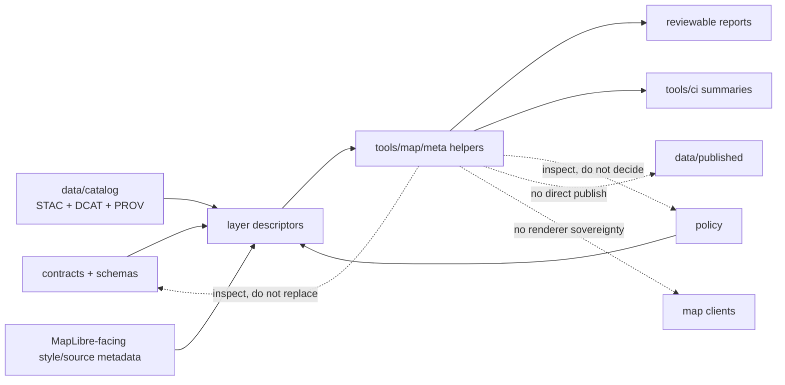

<!-- [KFM_META_BLOCK_V2]
doc_id: kfm://doc/NEEDS_VERIFICATION__tools_map_meta_readme
title: map metadata
type: standard
version: v1
status: draft
owners: @bartytime4life
created: NEEDS_VERIFICATION__YYYY-MM-DD
updated: NEEDS_VERIFICATION__YYYY-MM-DD
policy_label: NEEDS_VERIFICATION__public_or_internal
related: [../../README.md, ../../../.github/CODEOWNERS, ../../../.github/README.md, ../../../.github/workflows/README.md, ../../../contracts/README.md, ../../../schemas/README.md, ../../../policy/README.md, ../../../tests/README.md, ../../../scripts/README.md, ../../docs/README.md, ../../catalog/README.md, ../../diff/README.md, ../../attest/README.md, ../../ci/README.md, ../../probes/README.md, ../../validators/README.md]
tags: [kfm, tools, map, metadata, descriptors, maplibre, representation]
notes: [Requested target path is tools/map/meta/README.md. Broader tools-family README conventions and KFM map-metadata doctrine are strongly supported in current-session evidence, but direct active-branch proof for this exact leaf subtree, helper inventory, document dates, and final policy label remains NEEDS VERIFICATION.]
[/KFM_META_BLOCK_V2] -->

<a id="top"></a>

# map metadata

Reusable helpers and lane guidance for KFM map-facing metadata, descriptor quality, and representation-risk disclosures.


> [!IMPORTANT]
> **Status:** experimental  
> **Owners:** `@bartytime4life` *(inherited from current `/tools/` owner coverage; narrower leaf ownership still needs verification)*  
> **Path:** `tools/map/meta/README.md`  
> **Repo fit:** helper lane under `tools/` for map-facing metadata checks and review aids; canonical truth remains upstream in `contracts/`, `schemas/`, `policy/`, `tests/`, and outward catalog surfaces  
> **Quick jumps:** [Scope](#scope) · [Repo fit](#repo-fit) · [Accepted inputs](#accepted-inputs) · [Exclusions](#exclusions) · [Current evidence snapshot](#current-evidence-snapshot) · [Directory tree](#directory-tree) · [Quickstart](#quickstart) · [Usage](#usage) · [Diagram](#diagram) · [Operating tables](#operating-tables) · [Task list](#task-list) · [FAQ](#faq) · [Appendix](#appendix)

> [!WARNING]
> This lane may inspect, normalize, or summarize map-facing metadata, but it must **not** redefine schema authority, policy meaning, release law, or browser/runtime truth.

> [!NOTE]
> KFM doctrine is unusually strict here: map-facing claims need visible disclosure of representation class, source role, `crs`, `valid_time`, `as_of`, `support`, and `uncertainty` rather than leaving those meanings implicit.

> [!TIP]
> **Best first proof for this lane:** one hydrology or flood-context layer descriptor fixture plus one small helper that fails when CRS, time, support, source-role, or representation disclosures are missing.

---

## Scope

`tools/map/meta/` is the helper surface for **map-facing metadata**.

That means small, explicit tooling that improves the quality and reviewability of:

- outward layer descriptors
- source and layer metadata used by map clients
- legend / symbol metadata tied to map-facing assets
- representation-risk disclosures
- source-role and support/time disclosure checks
- review-facing summaries about map metadata quality

This lane is the right home for metadata-oriented support work that sits **between** canonical contracts and outward map behavior without becoming either one.

### Truth labels used in this README

| Label | Meaning here |
| --- | --- |
| **CONFIRMED** | Directly supported by surfaced repo-facing docs or KFM doctrine in the current session |
| **INFERRED** | Strongly suggested by adjacent repo patterns and doctrine, but not directly proven for this exact leaf |
| **PROPOSED** | Recommended landing shape, helper family, or check pattern |
| **UNKNOWN** | Not verified strongly enough in the current session |
| **NEEDS VERIFICATION** | Explicit review marker that should be checked against the active branch before merge |

[Back to top](#top)

---

## Repo fit

`tools/map/meta/` should feel like a **support lane**, not a second truth system.

### Path and adjacent surfaces

| Surface | Relationship | Status | Why it matters |
| --- | --- | --- | --- |
| `tools/map/meta/` | Requested leaf | **NEEDS VERIFICATION** | This target path was requested directly, but the active-branch subtree was not surfaced in-session. |
| [`../../README.md`](../../README.md) | Parent `tools/` family contract | **CONFIRMED** | `tools/` defines helper-family boundaries and keeps support lanes from becoming authority lanes. |
| [`../../../contracts/README.md`](../../../contracts/README.md) | Human-readable trust-object guide | **CONFIRMED** | This lane may inspect declared object meaning, but does not own it. |
| [`../../../schemas/README.md`](../../../schemas/README.md) | Machine-file scaffold and schema boundary | **CONFIRMED** | Canonical field definitions belong there, not here. |
| [`../../../policy/README.md`](../../../policy/README.md) | Executable governance boundary | **CONFIRMED** | Publishability, rights, sensitivity, and deny-by-default logic stay upstream. |
| [`../../../tests/README.md`](../../../tests/README.md) | Verification boundary | **CONFIRMED** | Fixtures and assertions should prove helper behavior. |
| [`../../../scripts/README.md`](../../../scripts/README.md) | Thin entrypoint boundary | **CONFIRMED** | Operational wrappers may call helpers here, but reusable metadata logic should remain inspectable outside shell scripts. |
| [`../../docs/README.md`](../../docs/README.md) | Adjacent documentation-tooling lane | **CONFIRMED** | Markdown structure and metadata-doc hygiene belong there more than here. |
| [`../../catalog/README.md`](../../catalog/README.md) | Catalog closure helper lane | **CONFIRMED** | This lane may inspect map-facing back-pointers, but should not take over `STAC + DCAT + PROV` closure logic. |
| [`../../diff/README.md`](../../diff/README.md) | Deterministic comparison helper lane | **CONFIRMED** | Metadata drift and descriptor changes may later feed stable diff summaries. |
| [`../../attest/README.md`](../../attest/README.md) | Proof / attestation helper lane | **CONFIRMED** | Map metadata may reference proofs, but proof assembly is not owned here. |
| [`../../ci/README.md`](../../ci/README.md) | Reviewer-summary lane | **CONFIRMED** | CI may render outputs from this lane, but should not become the only place metadata meaning exists. |
| [`../../probes/README.md`](../../probes/README.md) | Bounded-read helper lane | **CONFIRMED** | Probes may discover freshness or status that map metadata helpers later summarize. |
| [`../../validators/README.md`](../../validators/README.md) | Validation helper family | **CONFIRMED** | If this lane becomes executable, it must stay coherent with the repo’s validation surfaces. |
| [`../../../.github/CODEOWNERS`](../../../.github/CODEOWNERS) | Owner map | **CONFIRMED** | Current visible owner coverage for `/tools/` flows through here. |
| [`../../../.github/workflows/README.md`](../../../.github/workflows/README.md) | Workflow boundary | **CONFIRMED** | Workflow YAML should stay a caller/orchestration seam, not the only place metadata-check logic exists. |

### Operating rule

Use this lane when the work is about **checking or explaining map metadata**.

Do not use it to:

- define canonical schema law
- decide rights or policy outcomes
- mutate release state
- hide rendering or business logic in “just helper code”
- silently become the only place where map descriptor meaning lives

[Back to top](#top)

---

## Accepted inputs

This lane may accept:

- map-facing layer descriptor files
- source/layer metadata registries
- legend and symbol metadata
- style snippets or runtime metadata extracts for linting
- `STAC` / `DCAT` / `PROV` back-pointers used by map-facing assets
- representation-risk notes and disclosure tables
- review fixtures for valid/invalid metadata cases
- CI-friendly intermediate reports about descriptor completeness

### Expected input posture

Inputs should be:

- explicit
- finite
- reviewable
- schema-shaped where practical
- subordinate to canonical upstream surfaces

[Back to top](#top)

---

## Exclusions

This lane does **not** own:

- policy decisions
- publish / quarantine / rollback decisions
- release manifests or DSSE bundles
- canonical schema authorship
- catalog authority
- source onboarding approval
- renderer implementation
- tile, mesh, or raster generation
- hidden remote discovery or undeclared fetches

> [!CAUTION]
> A helper in this lane may *inspect* `source`, `layer`, `projection`, `valid_time`, or `catalog_refs`; it must not quietly turn those inspections into sovereign release decisions.

[Back to top](#top)

---

## Current evidence snapshot

| Topic | Current reading | Why it matters here |
| --- | --- | --- |
| Broader `tools/` family | Visible and documentation-first in current public-facing evidence | This leaf should start narrow and truth-bounded rather than pretending a mature helper inventory. |
| Exact `tools/map/meta/` subtree | Not directly surfaced in the session | This README is written as a lane contract and landing guide, not as proof of mounted helpers. |
| Map-facing disclosure burden | Strongly doctrinal | KFM treats representation choice, source role, support, CRS, and time basis as part of claim meaning. |
| Minimum outward metadata | `crs`, `valid_time`, `as_of`, `support`, `uncertainty_note` | These are treated as minimum outward fields for layer descriptors and claim envelopes. |
| Source-role disclosure | Required and stable | Observation, operational feed, model, documentary evidence, and regulatory record are not interchangeable. |
| Representation-risk disclosure | Required for burden-bearing layers | A map must not hide whether it shows regulatory, observed, modeled, or narrative context. |
| MapLibre runtime boundary | Stable enough to plan against | Sources specify data; layers specify rendering; helpers here should respect that split. |

### Working interpretation

The strongest safe reading is:

1. **CONFIRMED:** KFM needs stronger, outward-facing metadata discipline for map claims.  
2. **INFERRED:** a `tools/map/meta/` helper lane is a plausible native place for metadata-oriented checks and summaries.  
3. **PROPOSED:** the first executable surface should be one small descriptor-oriented checker with fixtures, not a broad toolbox.

[Back to top](#top)

---

## Directory tree

### Current public `tools/` family snapshot

```text
tools/
├── README.md
├── attest/
│   └── README.md
├── catalog/
│   └── README.md
├── ci/
│   └── README.md
├── diff/
│   └── README.md
├── docs/
│   └── README.md
├── probes/
│   └── README.md
└── validators/
    └── README.md
```

### Requested leaf landing shape

```text
tools/
└── map/
    └── meta/
        └── README.md
```

### PROPOSED minimal helper landing shape

```text
tools/
└── map/
    └── meta/
        ├── README.md
        ├── check_layer_descriptor.py        # PROPOSED starter
        ├── check_legend_metadata.py         # PROPOSED starter
        └── examples/                        # PROPOSED fixtures/examples
```

> [!NOTE]
> Use the split above intentionally:
>
> - the first tree reflects **current surfaced family context**
> - the second tree reflects the **requested target path**
> - the third tree is a **preferred landing shape**, not current branch proof

[Back to top](#top)

---

## Quickstart

The commands below are **inventory-first**. Run them before claiming helper files, callers, or workflow wiring.

1. Confirm what actually exists in the requested leaf and adjacent family surfaces.

```bash
test -d tools/map/meta && find tools/map/meta -maxdepth 4 \( -type f -o -type d \) | sort || true
find tools -maxdepth 3 \( -type f -o -type d \) | sort | grep -E '^tools/(attest|catalog|ci|diff|docs|probes|validators)'
```

2. Recheck stronger authority surfaces before adding helper logic here.

```bash
sed -n '1,240p' tools/README.md 2>/dev/null
sed -n '1,220p' contracts/README.md 2>/dev/null
sed -n '1,220p' schemas/README.md 2>/dev/null
sed -n '1,220p' policy/README.md 2>/dev/null
sed -n '1,220p' tests/README.md 2>/dev/null
sed -n '1,220p' scripts/README.md 2>/dev/null
```

3. Search the current tree for map-facing metadata callers and doctrinal field names before inventing a new helper contract.

```bash
grep -RIn "valid_time\|uncertainty_note\|source_role\|representation\|legend\|source-layer\|MapLibre" \
  README.md docs contracts schemas policy tests scripts tools 2>/dev/null || true
```

4. Syntax-check helpers **only when they actually exist**.

```bash
find tools/map/meta -type f -name "*.py" -print0 2>/dev/null | xargs -0 -r -n1 python -m py_compile
find tools/map/meta -type f -name "*.mjs" -print0 2>/dev/null | xargs -0 -r -n1 node --check
```

> [!TIP]
> If the local tree still does not surface `tools/map/meta/`, treat this file as the lane contract and landing plan for the first helper, not as evidence that helper code is already present.

[Back to top](#top)

---

## Usage

Use this lane when the job is to:

- check whether a layer descriptor carries the minimum outward metadata KFM expects
- validate map-facing legend / symbol metadata before it drifts from asset reality
- ensure representation-risk disclosures are present for burden-bearing layers
- confirm source-role disclosure is explicit and stable
- sanity-check source / `source-layer` / layer linkage assumptions in MapLibre-facing metadata
- inspect whether outward map surfaces carry usable back-pointers to catalog and release objects
- emit compact, reviewer-readable reports about metadata completeness or drift

Do **not** use this lane when the job is to:

- define canonical contract fields
- settle rights / sensitivity questions
- decide promotion or quarantine
- sign or verify proofs
- compute or generate the map data itself
- implement renderer behavior or front-end interaction rules
- hide release-significant transformation inside “metadata cleanup”

[Back to top](#top)

---

## Diagram



> [!IMPORTANT]
> The governing split is intentional:
>
> - contracts and schemas define meaning,
> - policy decides,
> - catalogs describe outward objects,
> - map clients render,
> - `tools/map/meta/` only helps those surfaces stay legible and reviewable.

[Back to top](#top)

---

## Operating tables

### Minimum disclosure matrix for map-facing descriptors

| Concern | Minimum disclosure | Why it matters | Status |
| --- | --- | --- | --- |
| CRS / projection | `crs` | Hidden reprojection can produce semantically false map claims. | **CONFIRMED doctrine** |
| Time basis | `valid_time` + `as_of` | Observation time, publication time, and fetch/promotion time are not interchangeable. | **CONFIRMED doctrine** |
| Support / intended use scale | `support` | Prevents silent scale jumps and unsupported fusion. | **CONFIRMED doctrine** |
| Uncertainty / caveat | `uncertainty_note` or equivalent | A map can mislead even when the computation itself was competent. | **CONFIRMED doctrine** |
| Source role | explicit role marker | Regulatory, observed, modeled, documentary, and operational sources answer different questions. | **CONFIRMED doctrine** |
| Representation class | representation note or equivalent | Regulatory NFHL, observed inundation, modeled depth, and narrative context are not interchangeable. | **CONFIRMED obligation / PROPOSED field naming** |
| MapLibre data/render split | source vs layer linkage | Sources specify data; layers specify rendering; helper logic should respect that boundary. | **CONFIRMED external/runtime boundary** |
| Catalog back-pointers | `stac_ref` / `dcat_ref` / `prov_ref` / release pointer or equivalent | Reviewers need a way to follow map metadata back to outward trust surfaces. | **PROPOSED lane check** |

### Candidate helper matrix

| Helper concern | Intended outcome | Status |
| --- | --- | --- |
| Required outward field presence | Missing `crs`, `valid_time`, `as_of`, `support`, or uncertainty fails review early | **PROPOSED** |
| Source-role disclosure | Observation vs regulatory vs modeled vs documentary remains explicit | **PROPOSED** |
| Representation-risk disclosure | Burden-bearing layers carry a short, visible note about what is actually being shown | **PROPOSED** |
| MapLibre source/layer sanity | Metadata confirms data/render separation instead of flattening them into one object | **PROPOSED** |
| Legend / symbol metadata checks | Symbol assets stay named, typed, and reviewable | **PROPOSED** |
| Catalog back-pointer checks | Map-facing metadata does not drift away from outward catalog and release surfaces | **PROPOSED** |
| Placeholder / stale-marker scan for map metadata docs | Reviewers see unfinished fields before they masquerade as settled reality | **INFERRED from adjacent docs-tooling pattern** |

[Back to top](#top)

---

## Task list

### Definition of done for this lane README

- [ ] Active branch confirms whether `tools/map/meta/` already exists or is being created intentionally
- [ ] Meta block placeholders are retired only after direct repo verification
- [ ] Relative links are checked from the real file location
- [ ] Immediate parent `tools/map/` relationship is verified before adding it as a hard link target
- [ ] This file remains explicit about what is current fact vs proposed helper shape
- [ ] No section quietly turns this lane into schema, policy, release, or renderer authority

### Best next hardening steps

- [ ] Land one small descriptor checker with valid / invalid fixtures
- [ ] Prove one hydrology or flood-context descriptor end to end
- [ ] Add a reviewer-readable report format consumable by `tools/ci/`
- [ ] Add one negative fixture showing hidden CRS or time disclosure fails review
- [ ] Add one negative fixture showing modeled vs regulatory class confusion fails review
- [ ] Keep any future helper names subordinate to current active-branch inventory

[Back to top](#top)

---

## FAQ

### Why isn’t this just part of `tools/docs/`?

Because `tools/docs/` is the better home for **Markdown structure and doc hygiene**, while this lane is about the **meaning-bearing metadata** attached to map-facing objects.

### Why doesn’t this lane own schema truth?

Because the repo already distinguishes helper surfaces from machine-authority surfaces. `contracts/` and `schemas/` are where canonical object shape should live.

### Does this lane own MapLibre style JSON?

Not as a source of truth. It may inspect or summarize style/source/layer metadata, but it should not become the renderer law or style-authoring authority.

### Does this lane decide whether something is publishable?

No. It can surface missing metadata or risky ambiguity, but rights, sensitivity, and promotion decisions belong upstream in policy, validation, and release surfaces.

### What is the best first proof object for this lane?

One **public-safe hydrology or flood-context layer descriptor fixture** with explicit CRS, time basis, support, uncertainty, source role, and representation note plus one small checker and one failing fixture.

### What remains unverified right now?

The exact active-branch existence of `tools/map/meta/`, any immediate `tools/map/README.md`, helper inventory, workflow callers, leaf-specific ownership, and final policy label.

[Back to top](#top)

---

## Appendix

<details>
<summary><strong>Observed family pattern and illustrative starter shape</strong></summary>

### Observed nearby family pattern

```text
tools/
├── README.md
├── attest/
├── catalog/
├── ci/
├── diff/
├── docs/
├── probes/
└── validators/
```

### Illustrative starter descriptor shape

The field names below are **illustrative**. Treat them as a review aid, not as canonical contract truth.

```json
{
  "layer_id": "hydrology:flow-accumulation",
  "source_role": "hydrology_derivative",
  "crs": "EPSG:4326",
  "valid_time": {
    "start": "2026-01-01T00:00:00Z",
    "end": "2026-12-31T23:59:59Z"
  },
  "as_of": "2026-04-13T00:00:00Z",
  "support": "30 m raster; watershed-context use only",
  "uncertainty_note": "Derived accumulation surface; do not treat as direct observed inundation.",
  "representation_note": "Modeled hydrology derivative rendered for map inspection.",
  "catalog_refs": {
    "stac": "kfm://catalog/stac/hydrology/example",
    "prov": "kfm://catalog/prov/hydrology/example"
  }
}
```

### Change discipline reminder

When this lane changes, update:

1. the current evidence snapshot,
2. the directory tree,
3. the task list,
4. the illustrative starter shape if its doctrine changes,
5. any related helper-lane links that would otherwise drift.

[Back to top](#top)

</details>
