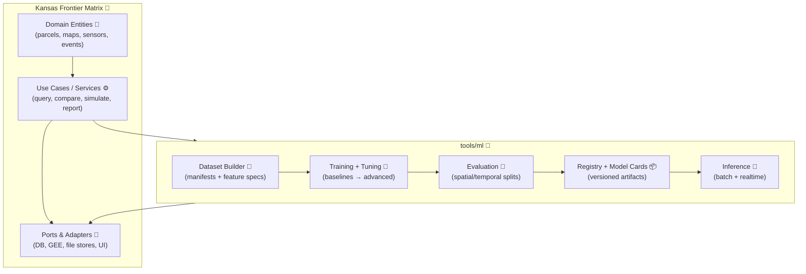

# 🤖 `tools/ml` — Machine Learning Toolkit (Kansas Frontier Matrix)

    
 

> 🧭 **North Star:** ML inside KFM must be **searchable, mappable, auditable, and modelable** — with **sources + processing steps** treated as first‑class citizens. :contentReference[oaicite:0]{index=0}

---

## 🎯 What this folder is

`tools/ml/` is the **ML workbench** for KFM: training, evaluation, and deployment helpers for models that operate on **Kansas’s spatial truth** — from scanned archival maps to sensor streams and satellite imagery.

It is designed for:
- 🗺️ **Geospatial ML** (vector + raster + spatiotemporal)
- 📡 **Remote sensing** (GEE + local pipelines)
- 🧪 **Reproducible experiments** (stats‑correct, leakage‑resistant)
- 🧾 **Provenance-first artifacts** (dataset manifests + model cards)
- 🧰 **Practical baselines first** (regression/classification before deep nets)
- 🧩 **Clean architecture integration** (ports/adapters, not spaghetti) :contentReference[oaicite:1]{index=1}

---

## 🧱 Non‑negotiable principles

### 1) 🧾 Provenance-first
Every dataset, feature set, trained model, and prediction must be traceable to:
- source datasets (IDs/URLs/archives)
- transformations (parameters + code version)
- evaluation protocol (split strategy, metrics)
- assumptions + limitations

KFM treats citations/metadata as “first-class data,” avoiding black boxes. :contentReference[oaicite:2]{index=2}

### 2) 🧠 Advisory AI only
KFM AI is **assistive** and **evidence-backed**.  
No autonomous decision-making, no silent policy recommendations. :contentReference[oaicite:3]{index=3}

### 3) 🧪 Statistics-correct evaluation
We prioritize:
- spatial/temporal cross-validation (not random splits by default)
- uncertainty + error bars (not just point metrics)
- experiment design discipline (avoid “dashboard science”)

### 4) ♻️ Reproducible by default
If you can’t rerun it, you can’t ship it:
- pinned env + deterministic seeds (where feasible)
- manifests for datasets and models
- machine-readable run logs

### 5) 🧰 Baselines before “SOTA”
Start with interpretable baselines:
- linear/logistic regression
- tree ensembles
- generalized linear models
- Bayesian baselines when uncertainty matters

(ML theory + practical algorithms foundations) :contentReference[oaicite:4]{index=4} :contentReference[oaicite:5]{index=5}

---

## 🏗️ How `tools/ml` fits into KFM

KFM follows a modular / clean architecture approach (core domain ↔ use cases ↔ adapters). ML tooling should **plug in**, not sprawl. :contentReference[oaicite:6]{index=6}



---

## 📁 Suggested layout (inside `tools/ml/`)

> ✅ Treat this as a **contract** for what belongs here (and what doesn’t).

```text
tools/ml/ 🤖
├─ 🧾 manifests/                  # dataset + model manifests (YAML/JSON)
├─ 🧺 datasets/                   # dataset builders + validators
├─ 🧱 features/                   # feature engineering (geo, time, text, imagery)
├─ 🧠 models/                     # model definitions (baseline → advanced)
├─ 🧪 training/                   # train loops, tuning, tracking
├─ 🧭 eval/                       # metrics, spatial CV, error analysis
├─ 📦 registry/                   # model cards, artifact metadata, promotion gates
├─ 🍱 serving/                    # inference adapters (batch, streaming, API)
├─ 🗺️ viz/                        # mapping helpers + tiles/overlays + WebGL hooks
├─ 📓 notebooks/                  # exploration (kept disposable + documented)
├─ 🛠️ scripts/                    # CLI entrypoints (build/train/eval/pack)
├─ ✅ tests/                      # unit + data-contract + leakage tests
└─ 📘 README.md                   # you are here
```

---

## 🚀 Quickstart (workflow contract)

Even before code exists, we standardize *the shape* of workflows.

### 0) Decide the *problem class* 🎯
- **Tabular regression/classification** (sensor + parcel features)
- **Raster/imagery** (classification, segmentation, change detection)
- **Spatiotemporal forecasting** (moisture, drought indicators, anomalies)
- **Graph ML** (networks: roads, rivers, ownership, citations)

### 1) Build a dataset manifest 🧾
Create a manifest that defines:
- sources (with IDs + citations)
- spatial/temporal bounds
- transforms
- label definitions
- split strategy

Example (skeletal):

```yaml
dataset_id: "kfm_soil_moisture_v1"
task: "regression"
label:
  name: "soil_moisture"
  unit: "volumetric_water_content"
sources:
  - id: "usda_soil_survey"
    type: "vector"
    provenance: { citation: "..." }
  - id: "sentinel_2_ndvi"
    type: "raster"
    provenance: { citation: "..." }
splits:
  strategy: "spatial_block_cv"
  folds: 5
transforms:
  - name: "reproject"
    crs: "EPSG:XXXX"
  - name: "normalize"
    method: "zscore"
```

### 2) Train a baseline first 🧰
Start simple:
- linear regression / ridge / lasso
- random forest / gradient boosting
- calibrated uncertainty estimates (when needed)

(Practical + theory) :contentReference[oaicite:7]{index=7} :contentReference[oaicite:8]{index=8}

### 3) Evaluate like it’s geospatial 🗺️
Default evaluation should assume **spatial autocorrelation** and **time dependence**:
- spatial blocking
- temporal forward-chaining
- “leave-region-out” tests for generalization

### 4) Package artifacts with a model card 📦
A “ship-ready” model includes:
- model card (what it does + what it *can’t* do)
- dataset manifest(s)
- metrics by slice (region/time)
- known failure modes
- calibration notes + uncertainty approach

### 5) Serve predictions as map-ready outputs 🧩
Predictions should be exportable as:
- vector attributes (GeoJSON/Parquet)
- raster tiles / COGs
- time-indexed series
…and always include provenance metadata.

---

## 🗺️ Geospatial ML guardrails (KFM defaults)

### CRS + units are part of your model ✅
- Every feature set must declare CRS, resolution, and units.
- Reprojection is a **logged transform**, not a hidden step.

### Spatial leakage is sneaky 🕵️
Random splits can inflate metrics because nearby points are similar.
Prefer:
- spatial blocks
- grouped splits by watershed/county/grid cell
- temporal splits for forecasting

### Raster + vector alignment is a first-class problem 🧠
Document:
- resampling method
- pixel size
- window/patch extraction logic
- nodata handling

(Map design and GIS visualization expectations matter for trust)  
📌 *Cartographic clarity is part of “model quality.”*  
(Helpful GIS visualization references) :contentReference[oaicite:9]{index=9}

---

## 🧪 Experimental discipline checklist

Use this before you brag about an R² 😄

- [ ] Split strategy matches the deployment scenario (space/time)
- [ ] Baseline beats naive heuristics (mean, last-value, seasonal)
- [ ] Metrics include uncertainty / confidence intervals where relevant
- [ ] Error analysis includes map views (where does it fail?)
- [ ] Model card includes limitations + assumptions
- [ ] Data + model provenance recorded and queryable
- [ ] Performance tested at scale (DB + pipeline throughput) :contentReference[oaicite:10]{index=10}

---

## 📦 Data + model registries (what we store)

### Dataset record (minimum viable)
- dataset_id, version, created_at
- sources + citations
- spatial/temporal bounds
- transforms + parameters
- schema (features + dtypes + units)
- split strategy
- checksums for files / partitions

### Model record (minimum viable)
- model_id, version, task
- dataset_id(s) used
- training config hash
- metrics + slices
- calibration + uncertainty notes
- intended use + prohibited use
- fairness/coverage notes (when applicable)
- runtime constraints (latency, memory)

(When storing these in a DB, treat performance as a design requirement, not a “later” problem.) :contentReference[oaicite:11]{index=11}

---

## 🧰 Tooling patterns we encourage

### 🧮 Numerical + scientific computing
Lean on well-tested scientific Python workflows when possible. :contentReference[oaicite:12]{index=12}

### 🧾 Theory + algorithmic grounding
When in doubt, return to fundamentals (PAC, ERM/SRM, optimization framing). :contentReference[oaicite:13]{index=13}

### 📐 Linear algebra literacy
If you can’t reason about matrices, you’ll struggle to debug ML pipelines. :contentReference[oaicite:14]{index=14}

### 🧩 Flexible, maintainable system design
ML tooling should stay modular and adaptable as requirements change. :contentReference[oaicite:15]{index=15}

### 🧵 Concurrency for streaming/near-real-time
Sensor data + inference pipelines need safe concurrency patterns (avoid race conditions and “phantom” bugs).

---

## 🗺️ Visualization & UI hooks

Model outputs must be **human-inspectable**:
- map overlays (confidence, error, anomalies)
- time sliders
- interactive 3D where appropriate (archaeology / terrain / volumes)

If you’re feeding a WebGL-based viewer, export formats should be designed intentionally (tile pyramids, lightweight vector payloads, etc.).  

---

## 🔐 Security, governance, and “do no harm”

Even “just a model” is part of the system’s attack surface:
- protect dataset credentials / API keys
- validate inputs (don’t trust external feeds)
- treat model artifacts as supply-chain items (hash + provenance)
- log access for sensitive datasets

Also: model outputs can be socially consequential. KFM’s posture is **transparent, accountable, and community-oriented** (digital humanism lens).

---

## 📚 Project source library (used to shape `tools/ml`) 📚

> The following project PDFs inform the design, guardrails, and recommended techniques in this folder.  
> Some are deep references; others are practical cookbooks. Together they form the “KFM ML stack brain.” 🧠✨

<details>
<summary><strong>🧠 ML fundamentals & math</strong></summary>

- **Understanding Machine Learning: From Theory to Algorithms** — learning theory, PAC/ERM, algorithmic paradigms. :contentReference[oaicite:16]{index=16}  
- **Basics of Linear Algebra for Machine Learning** — matrices, decompositions, least squares intuition. :contentReference[oaicite:17]{index=17}  
- **regression-analysis-with-python.pdf** — applied regression patterns for baseline modeling.  
- **Regression analysis using Python - slides-linear-regression.pdf** — quick regression refreshers & visuals.  
- **think-bayes-bayesian-statistics-in-python.pdf** — Bayesian framing for uncertainty & decision support.  

</details>

<details>
<summary><strong>🧪 Statistics, experimental design, EDA</strong></summary>

- **Understanding Statistics & Experimental Design.pdf** — experimental discipline, inference, avoiding misleading conclusions.  
- **graphical-data-analysis-with-r.pdf** — fast EDA patterns (plots, residuals, diagnostics).  

</details>

<details>
<summary><strong>🛰️ Geospatial, mapping, remote sensing</strong></summary>

- **Kansas Frontier Matrix (KFM) – Comprehensive Technical Documentation** — provenance-first + clean architecture + evidence-backed AI ethos. :contentReference[oaicite:18]{index=18}  
- **Cloud-Based Remote Sensing with Google Earth Engine-Fundamentals and Applications.pdf** — scalable remote sensing workflows.  
- **python-geospatial-analysis-cookbook.pdf** — Python recipes for GIS operations and spatial data handling.  
- **making-maps-a-visual-guide-to-map-design-for-gis.pdf** — cartographic clarity (critical for trustworthy ML outputs).  
- **Mobile Mapping_ Space, Cartography and the Digital - 9789048535217.pdf** — mapping in lived contexts (useful for UX & field tools).  
- **Archaeological 3D GIS_26_01_12_17_53_09.pdf** — 3D spatial reasoning, volumes, visibility analysis, interpretive layers. :contentReference[oaicite:19]{index=19}  

</details>

<details>
<summary><strong>🗄️ Data engineering, storage, scale</strong></summary>

- **Database Performance at Scale.pdf** — practical tuning mindset; performance is a product feature. :contentReference[oaicite:20]{index=20}  
- **PostgreSQL Notes for Professionals - PostgreSQLNotesForProfessionals.pdf** — SQL competence for registries/features.  
- **Scalable Data Management for Future Hardware.pdf** — thinking about storage/compute trends and system layout.  
- **Data Spaces.pdf** — interoperability + governance patterns for multi-source data ecosystems.  

</details>

<details>
<summary><strong>🧩 Systems, architecture, language/tooling</strong></summary>

- **Flexible Software Design** — designing for changing requirements (perfect match for evolving ML tooling). :contentReference[oaicite:21]{index=21}  
- **Implementing Programming Languages** — useful when we introduce DSLs for pipelines/queries. :contentReference[oaicite:22]{index=22}  
- **concurrent-real-time-and-distributed-programming-in-java-threads-rtsj-and-rmi.pdf** — concurrency lessons for real-time ingestion & serving.  
- **A programming Books.pdf / B‑C / D‑E / F‑H / I‑L / M‑N / O‑R / S‑T / U‑X programming Books.pdf** — broad language/tool references (the “shelf”).  
- **MATLAB Notes for Professionals** — numerical/prototyping quick reference. :contentReference[oaicite:23]{index=23}  
- **Bash Notes for Professionals** — pipeline scripting + ops glue. :contentReference[oaicite:24]{index=24}  
- **Objective‑C Notes for Professionals** — legacy/mobile integrations where relevant. :contentReference[oaicite:25]{index=25}  

</details>

<details>
<summary><strong>🧠 Simulation, graphs, optimization, complex systems</strong></summary>

- **Scientific Modeling and Simulation_ A Comprehensive NASA-Grade Guide.pdf** — verification/validation mindset, modeling rigor.  
- **Spectral Geometry of Graphs.pdf** — spectral methods for graph analytics & embeddings.  
- **Generalized Topology Optimization for Structural Design.pdf** — optimization patterns and constraint thinking (useful beyond structures).  
- **Principles of Biological Autonomy - book_9780262381833.pdf** — systems thinking for ecological/agent-like modeling.  

</details>

<details>
<summary><strong>🖥️ Visualization, formats, web</strong></summary>

- **webgl-programming-guide-interactive-3d-graphics-programming-with-webgl.pdf** — 3D visualization pipelines for model outputs.  
- **responsive-web-design-with-html5-and-css3.pdf** — dashboards and map UIs that work on real devices.  
- **compressed-image-file-formats-jpeg-png-gif-xbm-bmp.pdf** — image format pitfalls (critical for raster provenance).  

</details>

<details>
<summary><strong>⚖️ Ethics, law, security</strong></summary>

- **Introduction to Digital Humanism.pdf** — human-centered tech constraints for KFM’s AI layer.  
- **On the path to AI Law’s prophecies and the conceptual foundations of the machine learning age.pdf** — governance + legal framing.  
- **ethical-hacking-and-countermeasures-secure-network-infrastructures.pdf** — security awareness for pipelines & infra.  
- **Gray Hat Python - Python Programming for Hackers and Reverse Engineers (2009).pdf** — defensive understanding and hardening mindset (use responsibly).  

</details>

<details>
<summary><strong>🔥 Deep learning (optional / when warranted)</strong></summary>

- **Deep Learning for Coders with fastai and PyTorch** — deep learning workflow reference for imagery or large-scale tasks.  
  *(Use after baselines, with clear evaluation + provenance.)*

</details>

---

## ✅ “Ready to merge” criteria for any ML tool added here

- [ ] Has a manifest schema (dataset or model) 🧾  
- [ ] Has at least one baseline implementation 🧰  
- [ ] Has tests for data contracts + leakage ✅  
- [ ] Produces map-ready outputs 🗺️  
- [ ] Writes provenance metadata 🧾  
- [ ] Documents limits + failure modes 🧠  
- [ ] Plays nicely with KFM’s clean architecture 🔌 :contentReference[oaicite:26]{index=26}

---

## 🧭 Next milestones (roadmap)

- 🧾 Implement dataset manifest validation + checksums
- 🧪 Add spatial CV utilities + leakage tests
- 📦 Add model card templates + registry schema (Postgres/PostGIS)
- 🍱 Add serving adapters for batch + streaming inference
- 🗺️ Add “prediction → map overlay” exporters (vector + raster + tiles)

---

> 🧠 If you’re about to add a model without a dataset manifest and a spatially-aware evaluation plan…  
> **please don’t** 😄 — start with provenance and splits, then model.

