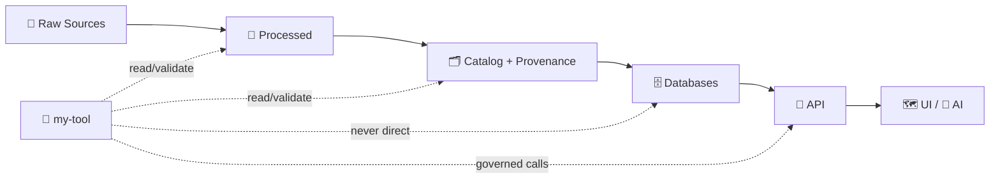

# 🧰 my-tool — Evidence‑First Utility for Kansas‑Matrix-System

<p align="center">
  <b>Small, sharp tooling that respects the KFM “truth path”</b><br/>
  Raw ➜ Processed ➜ Catalog/Provenance ➜ Databases ➜ API ➜ UI/AI ✅
</p>

<p align="center">
  <!-- ✨ Replace <OWNER>/<REPO> + workflow names with your real ones -->
  /<REPO>/ci.yml?branch=main" />
  /<REPO>" />
  
  
  
</p>

---

## ✨ What is this?

**`my-tool`** is a **tooling module** (CLI-first) for the **Kansas‑Matrix-System / KFM stack**, built to help you:
- 🔎 **Inspect** the system (health checks, config checks, connectivity checks)
- 🧪 **Validate** inputs/outputs (schemas, geospatial sanity, provenance rules)
- 🗂️ **Interact** with governed APIs (dataset lookup, catalog search, safe queries)
- 🧾 **Enforce evidence** (“No Source, No Answer” ✅) when generating or verifying derived outputs

> 🧠 Design goal: empower fast iteration **without** bypassing provenance, metadata, or governance.

---

## 🧭 Design Principles (Non‑Negotiables)

- 🧾 **Evidence-first outputs**  
  If a report/map/answer can’t be traced to sources + metadata, it’s not “done”.

- 🛤️ **No bypass of the truth path**  
  Tools should **never** “shortcut” ingestion/canonical processing/catlogging to make something “appear” in the UI.  
  If you need a value in the UI, it must pass through **Catalog/Provenance ➜ DB ➜ API**.

- 🔌 **Loose coupling**  
  `my-tool` talks to services via their **APIs/contracts**, not internal DB hacks.

- 📦 **Container-friendly**  
  Prefer running inside `docker compose` so your results match CI/production behavior.

---

## 🚀 Quickstart

### Option A (Recommended): Run inside Docker Compose 🐳

From repo root:

```bash
docker compose up -d
```

Then:

```bash
docker compose exec api my-tool --help
docker compose exec api my-tool doctor
```

> ✅ Why this is recommended: you get the same service wiring (API + DB + catalog + AI) used by the platform.

---

### Option B: Run locally (fast iteration) ⚡

```bash
cd tools/my-tool

python -m venv .venv
source .venv/bin/activate

pip install -U pip
pip install -e ".[dev]"

my-tool --help
my-tool doctor
```

---

## 🧩 Commands (CLI)

> All commands should be **safe by default**: read-only unless explicitly told otherwise.

### 🔍 System Checks

```bash
my-tool doctor
my-tool doctor --verbose
```

Typical checks:
- ✅ environment variables present
- ✅ API reachable
- ✅ auth configured (if enabled)
- ✅ storage paths readable
- ✅ optional AI backend reachable (e.g., local model or external provider)

---

### 🗂️ Catalog & Dataset Discovery

Examples use KFM-style endpoints like:
- `GET /api/v1/datasets/{id}`
- `GET /api/v1/catalog/search`

```bash
my-tool api ping
my-tool datasets get ks_hydrology_1880
my-tool catalog search --q "river" --bbox "-102,36,-94,40" --time "1880..1900"
```

---

### 🧾 Provenance Guards

```bash
my-tool validate dataset ./data/processed/ks_hydrology_1880.geojson
my-tool validate catalog ./data/catalog/dcat/datasets/ks_hydrology_1880.json
my-tool validate prov ./data/catalog/prov/ks_hydrology_1880.prov.json
```

What “validate” should cover:
- 🧬 schema checks (required fields)
- 🗺️ geospatial sanity (bbox, CRS expectations, geometry validity)
- 🧾 provenance links exist (W3C PROV-style relationships)
- 🏷️ metadata present (STAC/DCAT summaries + links to assets)

---

### 🧠 Focus Mode / AI Safety Tests (Optional)

If your stack exposes a “Focus Mode” endpoint (example: `POST /focus-mode/query`) and you want regression tests:

```bash
my-tool focus ask "List major trails in Kansas and cite sources."
my-tool focus regression --suite ./tests/focus/*.yaml
```

Suggested assertions:
- ✅ answer includes citations/refs
- ✅ tool does not hallucinate dataset IDs
- ✅ “no evidence found” is returned when appropriate

---

## 🔧 Configuration

`my-tool` reads configuration from:
- ✅ environment variables
- ✅ `.env` files (if you use them)
- ✅ docker-compose environment wiring

Create `tools/my-tool/.env` (never commit secrets):

```bash
# API
KFM_API_BASE_URL=http://localhost:8000
KFM_AUTH_TOKEN=  # optional if auth disabled

# Data paths (adjust to your repo conventions)
KFM_DATA_ROOT=../../data
KFM_LOG_LEVEL=info

# Optional AI
AI_BACKEND=ollama        # or openai / none
AI_BACKEND_URL=http://localhost:11434
OLLAMA_MODEL=llama2:7b
```

> 🔐 Tip: mirror the repo’s `.env.example` naming where possible.

---

## 🗂️ Repo Layout (Suggested)

```text
tools/my-tool/
├─ 📄 README.md
├─ 📦 pyproject.toml            # or package.json if JS/TS tool
├─ 🔐 .env.example
├─ 🧠 my_tool/
│  ├─ __init__.py
│  ├─ cli.py                    # entrypoint
│  ├─ config.py                 # env parsing + defaults
│  ├─ api_client.py             # governed API calls only
│  ├─ validators/
│  │  ├─ dataset.py
│  │  ├─ catalog.py
│  │  └─ prov.py
│  └─ utils/
│     ├─ logging.py
│     └─ io.py
├─ 🧪 tests/
│  ├─ test_doctor.py
│  ├─ test_validators.py
│  └─ focus/                    # optional regression suites
└─ 🛠️ scripts/
   └─ dev.sh
```

---

## 🧱 Architecture Fit

`my-tool` is intentionally positioned as a **helper** and **guardrail** around the platform:



✅ **Allowed:** validate processed outputs, validate catalog/prov records, query the API  
🚫 **Not allowed:** writing directly into DBs “to save time”, bypassing metadata, shipping untraceable artifacts

---

## 🧪 Dev Workflow

### Lint / Format

```bash
# examples (adjust to your stack)
ruff check .
ruff format .
```

### Type checks

```bash
mypy my_tool
```

### Tests

```bash
pytest -q
```

### Pre-commit (recommended)

```bash
pre-commit install
pre-commit run --all-files
```

---

## 🔐 Security & Data Governance Notes

- 🧯 **Secrets**: never commit `.env` (use `.env.example`)
- 🧾 **Provenance**: if you generate/transform data, emit a PROV record + link it in catalog metadata
- 🧭 **Access controls**: if OAuth2/role access exists, don’t “work around it” — make the tool respect it
- 🧼 **Safe defaults**: prefer read-only commands unless `--write` or `--apply` is explicitly set

---

## 🧯 Troubleshooting

<details>
  <summary><b>“API not reachable”</b></summary>

- Check Docker: `docker compose ps`
- Check ports: `docker compose logs api --tail 200`
- If using local run, confirm `KFM_API_BASE_URL` matches the running service.
</details>

<details>
  <summary><b>“AI backend not reachable” (Ollama / local model)</b></summary>

- Confirm the service is running and the URL/port is correct.
- If API is in Docker and model runs on host, you may need `host.docker.internal` (platform-dependent).
</details>

<details>
  <summary><b>Validation fails on geometry</b></summary>

- Common causes: invalid polygons, mixed CRS assumptions, broken bbox metadata.
- Run with `--verbose` and output a small failing sample for debugging.
</details>

---

## 🗺️ Roadmap (Suggested)

- [ ] `my-tool doctor --json` for CI consumption
- [ ] `my-tool validate --fix` (safe, deterministic fixes only)
- [ ] `my-tool catalog diff` (compare catalog vs DB vs storage)
- [ ] `my-tool focus regression` with golden citations
- [ ] Add SOPs under `mcp/sops/` for repeatable workflows 📚

---

## 🤝 Contributing

1. ✅ Keep changes small and testable  
2. ✅ Add/adjust validators when introducing new dataset shapes  
3. ✅ Document behavior changes in this README  
4. ✅ If you add a new command, add `--help` examples + at least one test

---

## 📄 License

See the repository root `LICENSE` file.

---

### 🧠 Mini Philosophy Reminder

> If it can’t be traced, it can’t be trusted.  
> If it bypasses the path, it doesn’t ship.
