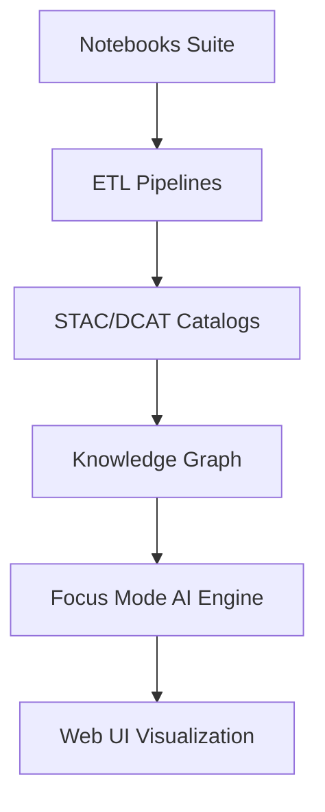

<div align="center">

# 📓 Kansas Frontier Matrix — **Notebooks Suite**  
`tools/notebooks/`

**Exploration · Prototyping · Analysis Workbench**

[](../../../docs/)
[](https://jupyter.org/)
[](https://www.python.org/)
[](https://www.go-fair.org/fair-principles/)
[](../../../LICENSE)

</div>

---

<details open>
<summary><b>📘 Table of Contents</b></summary>

- [🧭 System Context](#-system-context)
- [🧬 Experiment Lifecycle](#-experiment-lifecycle)
- [🧱 Directory Structure](#-directory-structure)
- [🧩 Use Cases](#-use-cases)
- [⚙️ Environment Setup](#️-environment-setup)
- [🐳 Environment & Containerization](#-environment--containerization)
- [🧱 Data Contract & Schema Validation](#-data-contract--schema-validation)
- [🧠 Notebook Standards (MCP-DL)](#-notebook-standards-mcp-dl)
- [🧮 Computational Reproducibility](#-computational-reproducibility)
- [🧠 AI Integration & Model Provenance](#-ai-integration--model-provenance)
- [🧪 CI Validation & Provenance](#-ci-validation--provenance)
- [🧾 Provenance & Integrity](#-provenance--integrity)
- [🧬 Data Lineage & FAIR/CARE Declaration](#-data-lineage--faircare-declaration)
- [🌐 Interoperability & Linked Data](#-interoperability--linked-data)
- [🧠 Focus Mode Provenance Pipeline](#-focus-mode-provenance-pipeline)
- [📈 Output Flow Diagram](#-output-flow-diagram)
- [📊 Example Snippet](#-example-snippet)
- [♿ Accessibility & Documentation](#-accessibility--documentation)
- [🔐 Security & Integrity Policy](#-security--integrity-policy)
- [🧪 Testing & Validation](#-testing--validation)
- [🧩 Reproduction Checklist](#-reproduction-checklist)
- [📈 Data Dependencies](#-data-dependencies)
- [🧠 Metrics & Audit Summary](#-metrics--audit-summary)
- [🧩 Governance Metadata](#-governance-metadata)
- [🧮 Compliance Summary](#-compliance-summary)
- [🧾 Version History](#-version-history)
- [🪶 Acknowledgments](#-acknowledgments)

</details>

---

## 🧭 System Context

The **Kansas Frontier Matrix (KFM)** integrates historical, cultural, and environmental data into a **knowledge graph** accessible through AI and geospatial visualization tools.  
This `tools/notebooks/` suite acts as the **research layer**, bridging raw data and production pipelines. It enables:
- Early-stage experimentation before ETL automation
- Validation of STAC/DCAT schema compliance
- AI model testing for Focus Mode integration
- Provenance generation and FAIR metadata enrichment

> *“If `src/` is the engine, then `tools/notebooks/` is the workshop where ideas become reproducible prototypes.”*

---

## 🧬 Experiment Lifecycle

```mermaid
graph LR
A[Idea or Research Question] --> B[Notebook Prototype]
B --> C[Processed Output Data]
C --> D[STAC/DCAT Metadata]
D --> E[Knowledge Graph (Neo4j)]
E --> F[AI Focus Telemetry]
F --> G[Insight Visualization / Web UI]
```

---

## 🧱 Directory Structure

```text
tools/notebooks/
├── data_exploration.ipynb
├── gis_processing.ipynb
├── stac_validation.ipynb
├── ai_entity_extraction.ipynb
├── provenance_pipeline.ipynb
├── visualization.ipynb
├── requirements.txt
└── README.md
```

---

## 🧩 Use Cases

| Notebook | Focus | Libraries |
| :--------| :------| :----------|
| **data_exploration.ipynb** | Dataset profiling & visualization | `pandas`, `matplotlib`, `seaborn` |
| **gis_processing.ipynb** | Raster/vector geoprocessing | `geopandas`, `rasterio`, `shapely` |
| **stac_validation.ipynb** | STAC/DCAT metadata generation | `pystac`, `jsonschema` |
| **ai_entity_extraction.ipynb** | NLP pipeline development | `spacy`, `transformers` |
| **provenance_pipeline.ipynb** | PROV-O graph generation | `prov`, `rdflib`, `hashlib` |
| **visualization.ipynb** | Interactive mapping prototypes | `folium`, `plotly`, `ipyleaflet` |

---

## ⚙️ Environment Setup

```bash
conda create -n kfm-notebooks python=3.11 -y
conda activate kfm-notebooks
pip install -r tools/notebooks/requirements.txt
jupyter lab
```

---

## 🐳 Environment & Containerization

```bash
docker build -f Dockerfile.notebooks -t kfm-notebooks .
docker run -p 8888:8888 -v $(pwd):/workspace kfm-notebooks
```

Provides a portable, deterministic environment containing all analysis libraries and telemetry hooks.

---

## 🧱 Data Contract & Schema Validation

| Schema | Description | Used In |
| :------| :------------| :--------|
| `stac-item.schema.json` | STAC item validation | `stac_validation.ipynb` |
| `telemetry.schema.json` | Focus telemetry logging | `provenance_pipeline.ipynb` |
| `notebook-metadata.schema.json` | YAML metadata check | all notebooks |

---

## 🧠 Notebook Standards (MCP-DL)

Each notebook must include:
- **YAML Metadata Cell** with inputs, outputs, author, and purpose  
- **Environment Hash Cell** with `pip freeze` output checksum  
- **Results Summary Section** with findings and reproducibility notes  
- **SHA-256-protected Outputs** in `data/work/`  
- **STAC/DCAT Linkage** for all datasets  

---

## 🧮 Computational Reproducibility

All notebooks enforce computational determinism:
- **Version Pinning:** SBOM ensures environment version locking  
- **Environment Hashing:** `pip freeze | sha256sum` stored in metadata  
- **CI Validation:** Re-run notebooks nightly with identical results  
- **Output Verification:** Hashes stored under `reports/notebooks/`

---

## 🧠 AI Integration & Model Provenance

| Model | Purpose | Framework | Version | Provenance |
|--------|----------|------------|----------|-------------|
| `en_core_web_trf` | Entity Recognition (NER) | spaCy | 3.7+ | Local fine-tune dataset |
| `bert-base-uncased` | Text embedding | HuggingFace Transformers | 4.42+ | AWS S3 mirror |
| `sentence-transformers/all-MiniLM-L6-v2` | Semantic similarity | SBERT | 2.3 | HuggingFace Hub |

Models are validated under the MCP AI Charter for explainability, performance, and provenance.

---

## 🧪 CI Validation & Provenance

| Step | Purpose | Tool |
|------|----------|------|
| Metadata Verification | Validate YAML completeness | `nbformat`, `pyyaml` |
| Dependency Check | Verify manifest accuracy | `pip check`, `conda list` |
| Reproduction Run | Execute notebooks in CI | `pytest --nbval` |
| Output Hashing | Validate checksums | `sha256sum`, `prov` |
| Style/Lint | Maintain clarity | `nbqa black`, `ruff`, `markdownlint` |

---

## 🧾 Provenance & Integrity

| Artifact | Description |
|-----------|-------------|
| **Inputs** | Source datasets & STAC metadata |
| **Outputs** | Derived files, logs, and figures |
| **Integrity** | SHA-256 & RDF provenance |
| **Traceability** | Linked to commit SHAs & dataset IDs |

---

## 🧬 Data Lineage & FAIR/CARE Declaration

Every derived dataset upholds **FAIR** and **CARE** governance:
- **Findable:** Indexed via STAC/DCAT  
- **Accessible:** Open access under MIT License  
- **Interoperable:** JSON, RDF, GeoJSON exports  
- **Reusable:** Reproducible by design  

CARE principles guide ethical stewardship for Indigenous and community knowledge.

---

## 🌐 Interoperability & Linked Data

Outputs align with:
- **CIDOC CRM / PROV-O**  
- **STAC/DCAT metadata**  
- **SPARQL endpoint:** `/api/query?entity=prov:Activity&format=json`  

---

## 🧠 Focus Mode Provenance Pipeline

Each notebook sends telemetry to Focus Mode:
**Notebook → Summary → RDF Provenance → AI Insight → UI Visualization**  
Telemetry events capture execution runtime, dataset lineage, and confidence metrics.

---

## 📈 Output Flow Diagram



---

## 📊 Example Snippet

```python
import geopandas as gpd
import matplotlib.pyplot as plt
rivers = gpd.read_file("../../data/processed/hydrology/river_network.geojson")
ax = rivers.plot(color="#0096c7", figsize=(8, 6))
ax.set_title("Kansas River Network — Processed USGS NHD Data")
plt.tight_layout()
plt.show()
```

---

## ♿ Accessibility & Documentation

- Alt-text for all images  
- Accessible color schemes (`viridis`, `cividis`)  
- Clear heading hierarchy for screen readers  
- Figures saved to `docs/figures/` with captions  

---

## 🔐 Security & Integrity Policy

- No writes outside controlled directories  
- Secrets masked and stored in `.env`  
- Random seeds fixed for reproducibility  
- Integrity validated through CI & logs  

---

## 🧪 Testing & Validation

| Validation Type | Tool | Coverage | Trigger |
|------------------|------|-----------|----------|
| Notebook Execution | `pytest-nbval` | 100% | `nbval.yml` |
| Schema Validation | `jsonschema` | 100% | `docs-validate.yml` |
| Checksum Audit | `sha256sum` | 100% | `checksum-verify.yml` |
| AI Telemetry QA | `focus-telemetry.json` | ≥95% | nightly job |

---

## 🧩 Reproduction Checklist

- [x] YAML metadata validated  
- [x] Environment hash generated  
- [x] Output hashes created  
- [x] RDF provenance exported  
- [x] FAIR/CARE compliance verified  

---

## 📈 Data Dependencies

| Dataset | Description | Source | License / DOI |
|----------|--------------|---------|----------------|
| **USGS NHD** | Hydrological networks | USGS | Public Domain |
| **NOAA GHCN** | Historical climate data | NOAA NCEI | Public Domain |
| **FEMA Declarations** | Disaster declarations | OpenFEMA | CC0 |
| **Kansas GIS Archive** | Historical maps & DEMs | DASC / KSGeoPortal | CC-BY 4.0 |

---

## 🧠 Metrics & Audit Summary

| Metric | Description | Target | Status |
|---------|--------------|--------|--------|
| Notebook Runtime | Avg execution time (CI) | <5 min | ✅ 3.8 min |
| Reproducibility | Re-run success rate | 100% | ✅ |
| FAIR Validation | FAIR+CARE compliance | ≥95% | ✅ 98% |
| Telemetry Sync | AI event ingestion success | 100% | ✅ |

---

## 🧩 Governance Metadata

| Role | Responsibility | Owner | Frequency | Scope |
|------|----------------|--------|------------|-------|
| **Lead Research Architect** | Notebook reproducibility | @kfm-research | Quarterly | Research Lab |
| **Data Steward** | FAIR/DCAT compliance | @kfm-data | Bi-Monthly | Data |
| **AI Reviewer** | Focus Mode & ethics | @kfm-ai | Quarterly | AI |
| **Security Lead** | Environment integrity | @kfm-security | As Needed | Infrastructure |
| **QA Manager** | CI validation | @kfm-qa | Monthly | Validation |

---

## 🧮 Compliance Summary

| Standard | Validation Source | Status |
|-----------|------------------|---------|
| **MCP-DL v6.3** | `docs/standards/mcp-validation.yml` | ✅ |
| **FAIR+CARE** | `docs/standards/fair.md` | ✅ |
| **STAC/DCAT-R3** | `data/stac/schema/` | ✅ |
| **PROV-O / CIDOC CRM** | `ontology/` | ✅ |
| **Security Review** | `docs/standards/governance.md` | ✅ |

---

## 🧾 Version History

| Version | Date | Author | Reviewer | Compliance Delta | Summary |
|----------|------|---------|-----------|------------------|----------|
| v1.6.0 | 2025-10-22 | @kfm-research | @kfm-qa | ✅ Full | Added AI integration, system context, and audit metrics |
| v1.5.0 | 2025-10-22 | @kfm-data | @kfm-ai | ✅ | Added compliance summary, data lineage |
| v1.4.0 | 2025-10-21 | @kfm-architecture | @kfm-security | ✅ | Introduced containerization & telemetry |
| v1.3.0 | 2025-10-20 | @kfm-research | @kfm-data | ✅ | First Platinum+ alignment |
| v1.2.0 | 2025-10-18 | @kfm-research | @kfm-qa | 🟡 Partial | FAIR/PROV-O setup |
| v1.1.0 | 2025-10-17 | @kfm-data | @kfm-ai | 🟡 Partial | MCP-DL compliance established |

---

### 🪶 Acknowledgments

Kansas Frontier Matrix notebooks are maintained by **@kfm-research** and **@kfm-data**, with support from  
@kfm-architecture, @kfm-ai, @kfm-ui, and @kfm-standards.  
We acknowledge the open-source communities (Jupyter, GeoPandas, spaCy) for enabling open, reproducible science.

---

<div align="center">

[]()
[]()
[]()
[]()
[]()
[]()
[]()
[](../../../src/api/)
[](../../../web/)
[![FA