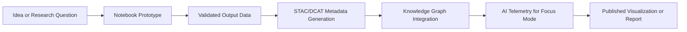

<div align="center">

# 📓 Kansas Frontier Matrix — **Notebooks Suite**  
`tools/notebooks/`

**Exploration · Prototyping · Analysis Workbench**

[](../../../docs/)
[](https://jupyter.org/)
[](https://www.python.org/)
[](https://www.go-fair.org/fair-principles/)
[](../../../LICENSE)

</div>

---

<details open>
<summary><b>📘 Table of Contents</b></summary>

- [🧭 Overview](#-overview)
- [🧬 Experiment Lifecycle](#-experiment-lifecycle)
- [🧱 Directory Structure](#-directory-structure)
- [🧩 Use Cases](#-use-cases)
- [⚙️ Environment Setup](#️-environment-setup)
- [🐳 Environment & Containerization](#-environment--containerization)
- [🧱 Data Contract & Schema Validation](#-data-contract--schema-validation)
- [🧠 Notebook Standards (MCP-DL)](#-notebook-standards-mcp-dl)
- [🧪 CI Validation & Provenance](#-ci-validation--provenance)
- [🧾 Provenance & Integrity](#-provenance--integrity)
- [🧬 Data Lineage & FAIR/CARE Declaration](#-data-lineage--faircare-declaration)
- [🌐 Interoperability & Linked Data](#-interoperability--linked-data)
- [🧠 Focus Mode Provenance Pipeline](#-focus-mode-provenance-pipeline)
- [📊 Example Snippet](#-example-snippet)
- [♿ Accessibility & Documentation](#-accessibility--documentation)
- [🔐 Security & Integrity Policy](#-security--integrity-policy)
- [🧪 Testing & Validation](#-testing--validation)
- [🧩 Governance Metadata](#-governance-metadata)
- [🔗 Related Documentation](#-related-documentation)
- [🧾 Versioning & Metadata](#-versioning--metadata)
- [📜 License](#-license)
- [🪶 Acknowledgments](#-acknowledgments)

</details>

---

## 🧭 Overview

`tools/notebooks/` is the **interactive lab environment** for the **Kansas Frontier Matrix (KFM)** — designed for historians, data scientists, and engineers to **prototype, explore, and analyze** workflows in a reproducible, auditable, and AI-integrated context.  
Each notebook serves as an **executable research artifact**, following **MCP-DL v6.3**, **FAIR+CARE**, and **PROV-O** protocols.

> *“Every notebook is a reproducible story — where provenance meets discovery.”*

---

## 🧬 Experiment Lifecycle



---

## 🧱 Directory Structure

```text
tools/notebooks/
├── data_exploration.ipynb     # Dataset inspection & summary statistics
├── gis_processing.ipynb       # Spatial transforms & CRS alignment
├── stac_validation.ipynb      # STAC/DCAT schema validation
├── ai_entity_extraction.ipynb # NLP entity extraction & linking prototypes
├── provenance_pipeline.ipynb  # Hashing & PROV-O linkage generation
├── visualization.ipynb        # MapLibre, Plotly, and Folium demos
├── requirements.txt           # Dependencies for notebook execution
└── README.md
```

---

## 🧩 Use Cases

| Notebook | Focus | Libraries |
| :--------| :------| :----------|
| **data_exploration.ipynb** | Exploratory Data Analysis (EDA) on datasets | `pandas`, `matplotlib`, `seaborn` |
| **gis_processing.ipynb** | Geospatial processing and transformations | `geopandas`, `rasterio`, `shapely` |
| **stac_validation.ipynb** | Build & validate STAC/DCAT metadata | `pystac`, `jsonschema` |
| **ai_entity_extraction.ipynb** | OCR → NER → Entity linking | `spacy`, `transformers` |
| **provenance_pipeline.ipynb** | PROV-O graphs & checksum workflows | `hashlib`, `prov`, `rdflib` |
| **visualization.ipynb** | Maps, timelines, & narrative visualizations | `folium`, `plotly`, `ipyleaflet` |

---

## ⚙️ Environment Setup

```bash
conda create -n kfm-notebooks python=3.11 -y
conda activate kfm-notebooks
pip install -r tools/notebooks/requirements.txt
jupyter lab
```

---

## 🐳 Environment & Containerization

Each notebook can be executed within a reproducible Docker environment:

```bash
docker build -f Dockerfile.notebooks -t kfm-notebooks .
docker run -p 8888:8888 -v $(pwd):/workspace kfm-notebooks
```

The container includes JupyterLab, GeoPandas, PROV-O, and Focus Mode telemetry hooks for consistent experimentation.

---

## 🧱 Data Contract & Schema Validation

All notebooks adhere to internal **data contracts** and schemas located in `docs/contracts/data-contract-v3.json`.

| Schema | Description | Used In |
| :------| :------------| :--------|
| `stac-item.schema.json` | STAC item validation | `stac_validation.ipynb` |
| `telemetry.schema.json` | Focus Mode telemetry validation | `provenance_pipeline.ipynb` |
| `notebook-metadata.schema.json` | YAML front-matter validation | All notebooks |

---

## 🧠 Notebook Standards (MCP-DL)

1. **YAML front matter** with metadata fields.  
2. **Environment cell** with package hash (via `pip freeze`).  
3. **Relative paths** for reproducibility.  
4. **Summary cell** outlining conclusions and assumptions.  
5. **Checksum outputs** verified and stored.  
6. **Linked Provenance** to STAC/DCAT entries.

Example metadata cell:

```yaml
---
title: "Kansas Floodplain Analysis"
author: "A. Barta"
date: "2025-10-22"
inputs: ["data/processed/hydrology/floodplains.geojson"]
outputs: ["data/work/floodplain_summary.csv"]
description: "Analyzes historical floodplain expansion in the Kansas River Basin."
commit: "<git-sha>"
---
```

---

## 🧪 CI Validation & Provenance

| Step | Purpose | Tooling |
| :----| :--------| :--------|
| **Metadata Check** | Validate YAML structure | `nbformat`, `pyyaml` |
| **Dependency Check** | Verify environment consistency | `pip check`, `conda list` |
| **Repro Run** | Execute notebooks in CI | `pytest --nbval` |
| **Output Hashing** | Validate checksums | `sha256sum`, `prov` |
| **Style/Lint** | Code and markdown quality | `nbqa black`, `ruff`, `markdownlint` |

CI logs and provenance manifests are written to `/reports/notebooks/`.

---

## 🧾 Provenance & Integrity

| Artifact | Description |
| :--------| :------------|
| **Inputs** | Raw datasets and STAC/DCAT metadata |
| **Outputs** | Derived files, GeoJSONs, plots, logs |
| **Integrity** | SHA-256 sidecars and RDF provenance graphs |
| **Traceability** | Linked to commit SHAs and dataset URIs |

---

## 🧬 Data Lineage & FAIR/CARE Declaration

All notebooks inherit project-level FAIR+CARE governance:

- **Findable:** Indexed via STAC/DCAT catalog  
- **Accessible:** Published through API and web map  
- **Interoperable:** JSON, GeoJSON, RDF formats  
- **Reusable:** Openly licensed with provenance graphs  

**CARE:** Collective Benefit · Authority to Control · Responsibility · Ethics.

---

## 🌐 Interoperability & Linked Data

All outputs follow **CIDOC CRM**, **PROV-O**, and **FAIR** standards and are accessible through the project SPARQL endpoint:

```bash
curl -X GET "https://api.kfm.org/query?entity=prov:Activity&format=json"
```

Each artifact defines:
- `prov:Activity` → `prov:Entity` → `prov:Agent`  
- STAC/DCAT metadata embedded for cross-platform discovery.

---

## 🧠 Focus Mode Provenance Pipeline

Notebook provenance metadata is transformed into **AI telemetry** via `focus-telemetry.json`.  
This integration enables Focus Mode to contextualize each experiment:

- Notebook → Summary → Provenance RDF → AI Insight  
- Telemetry logs compute confidence, runtime, and correlation metrics  
- Stored in `/reports/focus-telemetry/` for model retraining and audit

---

## 📊 Example Snippet

```python
import geopandas as gpd
import matplotlib.pyplot as plt

rivers = gpd.read_file("../../data/processed/hydrology/river_network.geojson")
ax = rivers.plot(color="#0096c7", figsize=(8, 6))
ax.set_title("Kansas River Network — Processed USGS NHD Data")
plt.tight_layout()
plt.show()
```

> Always cite STAC IDs and data sources in markdown cells next to visualizations.

---

## ♿ Accessibility & Documentation

- Provide **alt-text** for all visuals  
- Use **accessible palettes** (`viridis`, `cividis`)  
- Include **semantic headings** for navigation  
- Save visuals to `docs/figures/` with captions  

---

## 🔐 Security & Integrity Policy

- No writes outside repository data directories.  
- Secrets stored in `.env` and masked in outputs.  
- Deterministic random seeds enforced for reproducibility.  
- Integrity gates: checksum validation, provenance verification, and audit logging.

---

## 🧪 Testing & Validation

| Validation Type | Tool | Coverage Target | Trigger |
|------------------|------|-----------------|----------|
| **Notebook Execution** | `pytest-nbval` | 100% run success | `nbval.yml` |
| **Schema Validation** | `jsonschema` | 100% compliance | `docs-validate.yml` |
| **Checksum Audit** | `sha256sum` | 100% traceability | `checksum-verify.yml` |
| **AI Telemetry QA** | `focus-telemetry.json` | ≥95% accuracy | Nightly Focus Mode job |

---

## 🧩 Governance Metadata

| Role | Responsibility | Owner | Frequency | Scope |
|------|----------------|--------|------------|-------|
| **Lead Research Architect** | Notebook reproducibility & metadata | @kfm-research | Quarterly | Research Lab |
| **Data Steward** | FAIR/DCAT compliance | @kfm-data | Bi-Monthly | Data & Metadata |
| **AI Reviewer** | Focus Mode alignment & ethics | @kfm-ai | Quarterly | AI/Telemetry |
| **Security Lead** | Environment & credentials | @kfm-security | As Needed | Infrastructure |
| **QA Manager** | CI validation & docs review | @kfm-qa | Monthly | CI/CD Validation |

---

## 🔗 Related Documentation

- **Tools Overview** — `tools/README.md`  
- **STAC Catalog** — `data/stac/README.md`  
- **AI System** — `docs/architecture/ai-system.md`  
- **Data Architecture** — `docs/architecture/data-architecture.md`  
- **Focus Mode** — `docs/features/focus-mode.md`  
- **Governance** — `docs/standards/governance.md`

---

## 🧾 Versioning & Metadata

| Field | Value |
| :---- | :---- |
| **Version** | `v1.4.0` |
| **Codename** | *Comprehensive Research Integration* |
| **Last Updated** | 2025-10-22 |
| **Maintainers** | @kfm-data · @kfm-research |
| **License** | MIT |
| **Alignment** | FAIR · CARE · PROV-O · CIDOC CRM · STAC/DCAT-R3 · MCP-DL v6.3 |
| **Maturity** | Platinum+ / Research Sandbox |

---

## 📜 License

All notebooks are released under the **MIT License**.  
© 2025 Kansas Frontier Matrix — *open, traceable, reproducible science at scale.*

> *“Every notebook is a living experiment — documenting the frontier between data and discovery.”*

---

### 🪶 Acknowledgments

Kansas Frontier Matrix notebooks are maintained by **@kfm-research** and **@kfm-data**, with contributions from  
@kfm-architecture, @kfm-ai, @kfm-ui, and @kfm-standards.  
Special thanks to open-source communities (Jupyter, GeoPandas, spaCy) for advancing open science.

---

<div align="center">

[]()
[]()
[]()
[]()
[]()
[](../../../src/api/)
[](../../../web/)
[]()
[]()

</div>