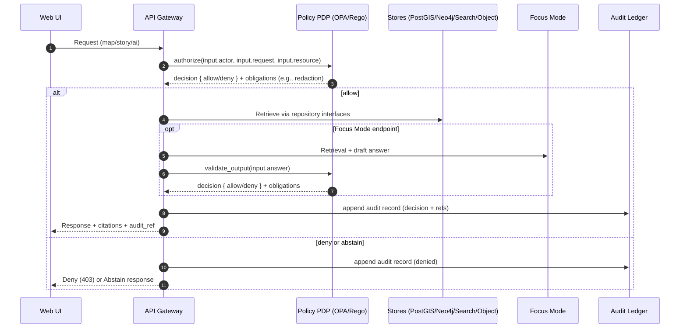

<!--
File: tools/policy/README.md
Status: Governed artifact (security + governance critical)
Scope: Policy-as-Code for KFM (OPA/Rego + Conftest harness + fixtures)

Change control:
- Treat changes here as production changes.
- Require code review from Platform + Governance owners.
-->

# KFM policy tooling


This directory contains **KFM’s policy-as-code**: the rules, tests, fixtures, and CI hooks that enforce governance at the **trust membrane**.

KFM policy is not “documentation.” It is a **gate**:
- **Runtime**: authorization and output validation run on *every* data/story/AI request.
- **CI**: promotion/publishing is **fail-closed**: merges and releases are blocked unless policy + evidence contracts pass.

> [!IMPORTANT]
> **Trust membrane invariant:** the UI never queries databases directly. All access flows through the governed API boundary, where policy is evaluated and audit/provenance are emitted.  
> (See the platform blueprint for the non-negotiable trust membrane + per-request policy evaluation + Focus Mode cite-or-abstain requirement.)

---

## Contents

<details>
<summary><strong>Table of contents</strong></summary>

- [What lives here](#what-lives-here)
- [Non-negotiables](#non-negotiables)
- [How policy is used](#how-policy-is-used)
  - [Policy enforcement points](#policy-enforcement-points)
  - [Runtime enforcement flow](#runtime-enforcement-flow)
- [Directory layout](#directory-layout)
- [Tooling](#tooling)
- [Quickstart](#quickstart)
  - [Run OPA unit tests](#run-opa-unit-tests)
  - [Run Conftest contract tests](#run-conftest-contract-tests)
  - [Run the CI-style acceptance harness locally](#run-the-ci-style-acceptance-harness-locally)
- [Policy contracts](#policy-contracts)
  - [Policy input schema](#policy-input-schema)
  - [Default deny baseline](#default-deny-baseline)
  - [Focus Mode cite-or-abstain](#focus-mode-cite-or-abstain)
- [Sensitivity and redaction](#sensitivity-and-redaction)
  - [Recommended sensitivity classes](#recommended-sensitivity-classes)
  - [Redaction is a first-class transformation](#redaction-is-a-first-class-transformation)
- [CI policy regression suite](#ci-policy-regression-suite)
- [Promotion contract and acceptance harness](#promotion-contract-and-acceptance-harness)
  - [Minimum promotion gates](#minimum-promotion-gates)
  - [Deterministic spec_hash](#deterministic-spec_hash)
- [Versioning and change control](#versioning-and-change-control)
- [Troubleshooting](#troubleshooting)
- [References](#references)

</details>

---

## What lives here

This folder is the **policy source of truth** for:

- **OPA/Rego** policies (authorization, redaction obligations, promotion gates, Focus Mode output validation).
- **OPA unit tests** (`opa test …`) to keep policy behavior stable and reviewable.
- **Conftest** tests for contracts (receipts/manifests, catalog bundles, promotion “preconditions”).
- **Fixtures** (small synthetic examples) to keep CI deterministic.
- **Local + CI wrappers** (“make verify” style targets and/or scripts) so engineers can run policy checks the same way CI does.

> [!NOTE]
> The Next-Gen blueprint describes a canonical repo layout that includes a top-level `policy/` directory.
> In this repo we keep policy tooling under `tools/policy/`.
> If other CI/jobs assume `policy/`, either:
> 1) point those jobs at `tools/policy/`, or  
> 2) add a thin wrapper/symlink at repo root (e.g., `policy -> tools/policy/rego`), **without** changing the policy packages.

---

## Non-negotiables

These are KFM invariants that policy must enforce or support:

- **Default deny** (deny-by-default, allow only when rules match).
- **Fail-closed** behavior for publishing/promotion (missing evidence blocks promotion).
- **Per-request policy evaluation** (authorization and output validation happen on every request path).
- **Focus Mode cite-or-abstain** (answers must have citations and pass sensitivity rules, otherwise abstain/deny).
- **Sensitivity-aware redaction** (restricted/sensitive fields and precise locations are not exposed without explicit grants).

---

## How policy is used

### Policy enforcement points

Policy is evaluated in two places:

1. **CI / promotion gate (merge-blocking)**  
   Used to block merges/releases unless:
   - catalogs/metadata exist (STAC/DCAT/PROV),
   - checksums and deterministic IDs exist,
   - signatures/attestations verify (where required),
   - policy tests + contract tests pass.

2. **Runtime (API gateway boundary + output validator)**  
   Used to:
   - authorize access to datasets/layers/story content/evidence,
   - apply redaction obligations,
   - validate Focus Mode output before it is returned to clients.

### Runtime enforcement flow



---

## Directory layout

This README assumes the following **baseline** structure (adapt as needed, but keep the concepts):

```text
```text
tools/policy/                                 # KFM policy pack: OPA/Rego + tests + fixtures + CI-parity scripts
├── README.md                                 # How to run policy checks, add rules, write tests, interpret failures
│
├── rego/                                     # Rego source-of-truth (packaged for OPA/Conftest)
│   └── kfm/                                  # Root policy namespace (package kfm.*)
│       ├── data.rego                         # Baseline data-access rules (default-deny, allow/deny + rationale)
│       ├── ai.rego                           # Focus Mode output gate (cite-or-abstain, schema/contract checks)
│       │
│       ├── promotion/                        # Dataset lifecycle gates (Raw → Work → Processed)
│       │   ├── provenance_guard.rego         # Requires provenance completeness (PROV links, checksums, manifests)
│       │   └── materiality_rules.rego        # Materiality thresholds (changes forcing re-review/re-promotion)
│       │
│       └── sensitivity/                      # Sensitivity controls (classification & redaction)
│           ├── classification.rego           # Classification inference/propagation rules (public/restricted/etc.)
│           └── redaction.rego                # Redaction transforms + deny rules when redaction is impossible
│
├── tests/                                    # OPA unit tests (run: opa test rego/ tests/)
│   ├── kfm_data_test.rego                    # Tests for kfm.data (deny-by-default, allow paths, edge cases)
│   ├── kfm_ai_test.rego                      # Tests for kfm.ai (citations required, contract enforcement)
│   └── promotion_guard_test.rego             # Tests for promotion gates (provenance/materiality)
│
├── fixtures/                                 # Deterministic JSON fixtures for unit + contract/acceptance tests
│   ├── input/                                # Inputs to policy evaluation (request context)
│   │   ├── focus_answer_allow.json           # Valid Focus Mode response (should pass)
│   │   ├── focus_answer_deny.json            # Invalid Focus Mode response (should fail w/ reasons)
│   │   ├── dataset_public.json               # Public dataset example (should allow publication/serving)
│   │   ├── dataset_restricted.json           # Restricted dataset example (should redact/deny as configured)
│   │   └── run_receipt_minimal.json          # Minimal run receipt (audit/trace envelope for governed actions)
│   └── expected/                             # Expected outputs after evaluation/transforms
│       └── redacted_response.json            # Canonical redaction result (regression/contract baseline)
│
├── conftest/                                 # Conftest integration (optional; used by CI checks)
│   └── conftest.toml                         # Policy paths, input routing, output formatting, fail-closed knobs
│
└── scripts/                                  # Local wrappers to match CI behavior exactly
    ├── policy_test.sh                        # Runs opa test with pinned flags + consistent output
    └── acceptance_verify.sh                  # Contract checks: fixtures/input vs fixtures/expected
```

```

> [!TIP]
> Keep fixtures **small and synthetic**. Policy tests should be fast enough to run on every PR.

---

## Tooling

Recommended tools used by KFM policy workflows:

- **OPA** (Open Policy Agent) — policy engine, `opa test` for unit tests.
- **Conftest** — apply Rego to structured artifacts (YAML/JSON) as contract tests.
- **stac-validator** — validation of STAC catalogs/items/collections.
- **cosign** — verify signatures/attestations (supply chain / provenance artifacts).

> [!WARNING]
> Treat toolchain versions as governed dependencies: pin versions and review changes.
> Conftest/OPA syntax/version shifts can cause “silent policy breakage” if not pinned.

---

## Quickstart

The commands below assume you run them from the **repo root**.

### Run OPA unit tests

```bash
opa test ./tools/policy/rego ./tools/policy/tests -v
```

Common expectations:
- tests must encode “deny-by-default” and “allow only with explicit predicates”
- tests must cover Focus Mode cite-or-abstain
- tests must cover sensitivity + redaction obligations for restricted inputs

### Run Conftest contract tests

Conftest is typically used to validate:
- receipts/manifests contain required keys
- promotion preconditions exist (license, catalogs, checksums)
- API response fixtures respect redaction requirements

Example:

```bash
conftest test \
  --policy ./tools/policy/rego \
  ./tools/policy/fixtures/input/*.json
```

If using a config file:

```bash
conftest test --config ./tools/policy/conftest/conftest.toml ./tools/policy/fixtures/input
```

### Run the CI-style acceptance harness locally

KFM’s acceptance harness pattern is:

- Validate **STAC/DCAT/PROV**
- Run **policy tests** (OPA + Conftest)
- Verify **cosign** attestations (if required)
- Verify **spec_hash** reproducibility (deterministic identity)

If you wrap this in a local script, the goal is a single command like:

```bash
./tools/policy/scripts/acceptance_verify.sh
```

> [!IMPORTANT]
> Local verification must match CI behavior (same inputs, pinned versions, deterministic outputs).

---

## Policy contracts

### Policy input schema

A recommended policy input shape (illustrative):

```json
{
  "actor": { "role": "public|reviewer|admin", "attributes": {} },
  "request": { "endpoint": "/api/v1/ai/query", "context": {} },
  "resource": { "kind": "dataset|layer|story|evidence", "id": "…" },
  "answer": {
    "text": "…",
    "has_citations": true,
    "citations": [],
    "sensitivity_ok": true
  }
}
```

Contract rules:
- All runtime policy checks must be expressible using this shape (or a small compatible extension).
- Missing keys should fail closed (policy denies).

### Default deny baseline

**Baseline requirement:** `default allow := false` in every top-level policy module.

A typical baseline for data access:

- allow public datasets for everyone
- allow restricted datasets only for reviewers/admins (or explicit grants)
- allow admin overrides

### Focus Mode cite-or-abstain

Focus Mode output validation must be treated like an authorization step:

- If the answer lacks citations → **deny / abstain**
- If sensitivity checks fail → **deny / abstain**
- Optionally enforce a minimum citation count for nontrivial answers

This is a core KFM contract:
- **No source, no answer.**
- The UI must be able to resolve citation references to evidence views.

---

## Sensitivity and redaction

### Recommended sensitivity classes

A workable controlled vocabulary that policy can enforce:

- `public` — OK to expose broadly.
- `restricted` — requires roles or explicit grants.
- `sensitive-location` — precise coordinates withheld by default (show generalized view only).
- `aggregate-only` — only aggregated statistics for public; raw is restricted.

> [!IMPORTANT]
> If a dataset’s sensitivity is unknown, treat it as restricted until classified.

### Redaction is a first-class transformation

Redaction is not a “UI trick.” It is a governed transformation with provenance.

Practical implications:
- Store raw and redacted variants (where needed).
- Redaction rules must be explicit, testable, and reviewable.
- Redaction events should be recorded in provenance/audit so downstream consumers can see what changed and why.

---

## CI policy regression suite

Policy changes can unintentionally expand access or weaken “no source, no answer.”
To prevent drift, maintain a regression suite:

- A set of standard fixtures (public, restricted, sensitive-location).
- “Golden” expected outputs (including redaction expectations).
- Tests that assert:
  - no newly allowed access without explicit rule change,
  - Focus Mode answers deny/abstain when citations are missing,
  - sensitive location precision is not leaked,
  - promotion gates remain fail-closed when required artifacts are missing.

---

## Promotion contract and acceptance harness

KFM’s promotion gate should be treated as a **Promotion Contract** enforced in CI:

- merges are blocked unless promotion preconditions are met
- policy packs deny promotion if provenance/attestations/signatures/governance fields are missing or invalid
- acceptance harness runs: STAC/DCAT/PROV validation + policy tests + cosign verify + spec_hash reproducibility checks

### Minimum promotion gates

A minimal set of gates to enforce before anything is “processed/promoted”:

- Schema validation (required fields, type coercion rules documented)
- Geometry validity + bounds (where applicable)
- Temporal consistency (no impossible timestamps for historical datasets)
- License + attribution captured in DCAT
- Provenance completeness (PROV chain + deterministic checksum)
- Contract test: API responses include provenance bundles and respect redaction

### Deterministic spec_hash

To keep identity stable and reviewable:

- Define: `spec_hash = sha256(JCS(spec))`
- `spec` must be a schema-defined object
- Include `spec_schema_id` and `spec_recipe_version`
- Use RFC 8785 JSON Canonicalization Scheme (JCS) so the same logical spec hashes the same way everywhere

This avoids “hashes become incomparable” failures where audits can’t establish equivalence.

---

## Versioning and change control

Policy is security- and governance-critical. Recommended controls:

- Version policy packs and contracts using semantic versioning.
- Pin tool versions used for CI verification.
- Require reviews from:
  - platform engineering (correctness/performance)
  - governance (CARE/FAIR and sensitivity)
  - security (supply chain + threat model implications)
- Maintain a review cadence for policy packs (e.g., quarterly or after major toolchain updates).

---

## Troubleshooting

### OPA tests fail after tool upgrade

Symptoms:
- parse errors
- unexpected allow/deny changes
- Conftest behavior changes

Checklist:
- confirm OPA and Conftest versions are pinned
- confirm Rego language level matches policy (e.g., Rego v1 defaults)
- run `opa test … -v` locally with the same version CI uses
- add/refresh fixtures to capture newly surfaced edge cases

### Focus Mode “abstains too often”

Common causes:
- citations are missing or not being passed into policy input
- sensitivity flags are too strict or not computed
- the UI/API is not resolving citations reliably

Fix:
- validate the policy input schema is being populated correctly
- add tests that prove “citations present” passes and “citations absent” denies

### “Public data” not accessible

Common causes:
- dataset sensitivity is unset and defaults to restricted
- resource.kind/id mismatch (policy doesn’t recognize the resource shape)

Fix:
- ensure dataset catalogs include a valid sensitivity label (public/restricted/etc.)
- verify policy input resource fields match what policies expect

---

## References

Internal KFM documents that define the policy requirements and patterns:

- **KFM_NextGen_Blueprint_and_Primary_Guide_v1_2_EXPANSIVE_TOC.pdf**
  - Trust membrane + per-request policy evaluation
  - Default deny policies
  - Focus Mode cite-or-abstain pattern
  - Example CI job running `opa test …`

- **KFM_Comprehensive_Data_Source_Integration_Blueprint_v1_massive.pdf**
  - Sensitivity classes and redaction as first-class transformation
  - CI policy regression suite requirements
  - Promotion gates and contract testing expectations

- **Integrating “New Ideas Feb-2026” Into Knowledge-First Management.pdf**
  - Promotion Contract + acceptance harness pattern
  - Policy packs (provenance guard, materiality rules)
  - “make verify” parity goal for local/CI

- **KFM Integration Report for KFM New Ideas 2-8-26.pdf**
  - spec_hash standardization recommendation
  - fixture strategy guidance
  - “No Source, No Answer” as a hard policy gate pattern

