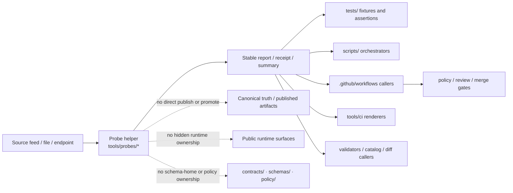

<!-- [KFM_META_BLOCK_V2]
doc_id: kfm://doc/NEEDS-VERIFICATION
title: probes
type: standard
version: v1
status: draft
owners: @bartytime4life
created: NEEDS-VERIFICATION
updated: 2026-04-13
policy_label: public
related: [../README.md, ../../README.md, ../../.github/README.md, ../../.github/CODEOWNERS, ../../.github/workflows/README.md, ../validators/README.md, ../diff/README.md, ../catalog/README.md, ../ci/README.md, ../attest/README.md, ../../scripts/README.md, ../../tests/README.md, ../../policy/README.md, ../../contracts/README.md, ../../schemas/README.md, ../../tools/validators/promotion_gate/README.md]
tags: [kfm, tools, probes, freshness, status, inspection, bounded-observation]
notes: [Merged from the older doctrine-heavy tools/probes README and the newer neighboring-lane context. doc_id and created date remain placeholders pending direct history verification; owner is inherited from current /tools/ CODEOWNERS coverage.]
[/KFM_META_BLOCK_V2] -->

# probes

Bounded inspection, freshness, status, and read-only evidence helpers for Kansas Frontier Matrix.

> **Status:** experimental  
> **Owners:** `@bartytime4life` *(current `/tools/` owner inherited; narrower probe-specific ownership is not separately declared in the visible public tree)*  
> **Path:** `tools/probes/README.md`  
> **Repo fit:** child lane under [`../README.md`](../README.md) · upstream [`../../README.md`](../../README.md) · governance [`../../.github/README.md`](../../.github/README.md) · owner map [`../../.github/CODEOWNERS`](../../.github/CODEOWNERS) · downstream [`../../.github/workflows/README.md`](../../.github/workflows/README.md) · adjacent [`../validators/README.md`](../validators/README.md) · [`../diff/README.md`](../diff/README.md) · [`../catalog/README.md`](../catalog/README.md) · [`../ci/README.md`](../ci/README.md) · [`../attest/README.md`](../attest/README.md) · [`../../scripts/README.md`](../../scripts/README.md) · [`../../tests/README.md`](../../tests/README.md) · [`../../policy/README.md`](../../policy/README.md) · [`../../contracts/README.md`](../../contracts/README.md) · [`../../schemas/README.md`](../../schemas/README.md)  
> **Evidence posture:** doctrine-grounded · repo-grounded for current public `main` subtree fact · deeper local checkout, workflow settings, and mounted runtime remain bounded  
> **Current public snapshot:** `tools/probes/` currently contains `README.md` only on public `main`  
> **Current public file state:** `tools/probes/README.md` is already substantive on public `main`; future edits should revise it in place rather than reset it to generic scaffold text  
>       
> **Quick jumps:** [Scope](#scope) · [Repo fit](#repo-fit) · [Accepted inputs](#accepted-inputs) · [Exclusions](#exclusions) · [Current verified snapshot](#current-verified-snapshot) · [Directory tree](#directory-tree) · [Quickstart](#quickstart) · [Usage](#usage) · [Diagram](#diagram) · [Tables](#tables) · [Task list](#task-list--definition-of-done) · [FAQ](#faq) · [Appendix](#appendix)

> [!IMPORTANT]
> `tools/probes/` is for bounded readers and reporters. It is **not** a hidden publish lane, a policy source-of-truth, or a place to bury runtime business logic.

> [!TIP]
> **Current executable snapshot (thin-slice posture)**  
> `tools/probes/` remains a probe lane with **bounded public executable evidence**. This README therefore documents:
>
> - the lane contract
> - the first-probe landing rules
> - the difference between observing and deciding
> - the neighboring-lane handoff rules for validators, diff, catalog, CI, and attestation
>
> Unlike the promotion thin slice and parts of `tools/ci/`, this lane does **not** yet claim a concrete current helper inventory beyond README-level public evidence unless verified on the active branch.

> [!NOTE]
> The parent [`tools/README.md`](../README.md) remains the family contract for the wider helper lane. This file narrows that contract to `probes/` while keeping current public-tree reality explicit. Exact sibling-family presence below is grounded in the live public `tools/` listing, not in documentary prose alone.

---

## Scope

`tools/probes/` is the KFM lane for small, explicit helpers whose primary job is to **inspect**, **sample**, **check freshness/status/materiality**, and **emit reviewable reports** without quietly changing trust state.

That means probes for things like:

- source/feed availability
- freshness and lag
- schema-presence or surface-shape discovery
- checksum or artifact drift observation
- endpoint/status sanity checks
- bounded operational sampling that produces a report another lane can review
- trust-surface presence or closure visibility checks that remain observational rather than authoritative

Today, the public subtree is still README-first. That does **not** weaken the lane’s role. It means this README must do two jobs at once:

1. describe the **current public state** honestly
2. define the **governed target shape** for the first executable probes

### What belongs here

- reusable, read-mostly helpers that inspect systems or artifacts and emit stable reports
- probe CLIs that can be run locally, from `scripts/`, or from CI without rewriting their logic in YAML
- helper code that measures **freshness**, **availability**, **materiality**, **surface state**, or **boundary visibility**
- tiny, reviewable support code that keeps operational observation separate from promotion, publication, and mutation

### Truth labels used here

| Marker | Meaning here |
| --- | --- |
| **CONFIRMED** | Supported by current public repo files or adjacent repo-grounded documentary surfaces |
| **INFERRED** | Strongly suggested by doctrine and nearby repo docs, but not proven as current subtree implementation |
| **PROPOSED** | Target shape, placement rule, or future probe guidance that fits KFM doctrine |
| **UNKNOWN** | Not established strongly enough from visible repo evidence |
| **NEEDS VERIFICATION** | Placeholder detail that should be checked before merge if this lane becomes executable |

[Back to top](#probes)

---

## Repo fit

**Path:** `tools/probes/README.md`  
**Role in repo:** directory README for bounded inspection helpers inside the broader `tools/` support surface.

| Direction | Surface | Why it matters |
| --- | --- | --- |
| Parent | [`../README.md`](../README.md) | Defines the `tools/` lane contract and distinguishes present state from target shape |
| Upstream | [`../../README.md`](../../README.md) | Root repo posture: governed, evidence-first, map-first, time-aware |
| Governance | [`../../.github/README.md`](../../.github/README.md) | Gatehouse framing for repo-local governance and documentary boundaries |
| Governance | [`../../.github/CODEOWNERS`](../../.github/CODEOWNERS) | Current visible ownership coverage for `/tools/` |
| Downstream | [`../../.github/workflows/README.md`](../../.github/workflows/README.md) | Workflow callers may invoke probes, but probe logic should remain inspectable outside YAML |
| Adjacent | [`../validators/README.md`](../validators/README.md) | Validators prove explicit rules and shapes; probes inspect and report |
| Adjacent | [`../diff/README.md`](../diff/README.md) | Diff helpers compare stable states; probes discover or measure them |
| Adjacent | [`../catalog/README.md`](../catalog/README.md) | Catalog helpers inspect closure quality; probes may observe freshness or availability around those surfaces |
| Adjacent | [`../ci/README.md`](../ci/README.md) | CI helpers may render probe results; probes should emit stable machine-readable outputs |
| Adjacent | [`../attest/README.md`](../attest/README.md) | Attestation helpers sign/verify; probes may inspect availability or visible state of trust artifacts without performing signing law |
| Adjacent | [`../../scripts/README.md`](../../scripts/README.md) | Scripts may orchestrate probes, but reusable probe logic should not be buried there |
| Adjacent | [`../../tests/README.md`](../../tests/README.md) | Probe behavior, pass/fail paths, and fixtures should be proven explicitly |
| Adjacent | [`../../policy/README.md`](../../policy/README.md) | Policy source-of-truth stays separate; probes may inform policy review but do not own policy |
| Adjacent | [`../../contracts/README.md`](../../contracts/README.md) | Contracts define shapes; probes may inspect or summarize them but do not replace them |
| Adjacent | [`../../schemas/README.md`](../../schemas/README.md) | Schema-home authority is still a governed boundary elsewhere; probes may inspect shape, but they do not settle schema authority |
| Promotion neighbor | [`../../tools/validators/promotion_gate/README.md`](../../tools/validators/promotion_gate/README.md) | Promotion increasingly benefits from bounded freshness, availability, and surface-state checks without turning those checks into promotion authority |

### Working interpretation

Use this lane when the main job is **observe, summarize, and report**. Move out of this lane when the main job becomes **decide, mutate, publish, or own** the canonical rule.

---

## Accepted inputs

The following belong in or under `tools/probes/`:

- files, snapshots, manifests, or exported artifacts that need bounded inspection
- endpoint URLs, feeds, or service surfaces that need freshness/status observation
- declared thresholds or tolerances used only for reporting/gating, not as hidden business truth
- output paths for reviewable reports, receipts, summaries, or machine-readable probe results
- minimal scoped credentials when inspection genuinely requires authenticated access
- local shell, operator, or CI contexts that need the same probe behavior without re-implementing it elsewhere

### Good probe questions

A probe is a good fit when the main question sounds like one of these:

- “Is this source reachable?”
- “How stale is this artifact?”
- “Did the surface shape drift?”
- “Did the upstream checksum or timestamp change?”
- “Can we emit a bounded report another lane can review?”
- “Is the declared outward surface present and observable?”
- “Is a trust-visible artifact missing, stale, or malformed before a stronger lane decides what that means?”

### Particularly strong fit classes

| Probe class | Typical examples |
| --- | --- |
| Freshness probes | feed lag, dataset staleness, receipt age, bundle update lag |
| Availability probes | endpoint reachable, artifact exists, source responds, resource visible |
| Surface-shape probes | field presence, response skeleton, schema-like shape drift without full validation ownership |
| Drift observers | checksum drift, timestamp drift, resource count drift |
| Trust-surface probes | outward refs visible, attestation result present, bundle members present, catalog triplet surface reachable |

[Back to top](#probes)

---

## Exclusions

| Does **not** belong here | Put it in | Why |
| --- | --- | --- |
| Long-running public runtime code | app or package lanes | Probes are support helpers, not product runtime |
| Promotion, publication, or trust-state mutation logic | `scripts/`, governed API, or workflow/review lanes | A probe may inform a decision; it should not silently make it |
| Policy bundles or policy source-of-truth | [`../../policy/README.md`](../../policy/README.md) | Probes may summarize policy-relevant facts, but policy ownership stays separate |
| Contract ownership | [`../../contracts/README.md`](../../contracts/README.md) | Probes inspect declared shapes; they do not define them |
| Canonical schema-home decisions | [`../../schemas/README.md`](../../schemas/README.md) | Probes may inspect schema surfaces, but they do not arbitrate schema authority |
| Hidden one-off shell blobs embedded only in workflow YAML | stable tool entrypoints plus documented workflow callers | Reviewers should be able to inspect logic outside CI YAML |
| Unsafe coordinate dumps, private samples, or sensitive fixtures | secure data lanes or tightly-scoped test fixtures | Public tooling should remain safe to clone and review |
| Broad operator orchestration | [`../../scripts/README.md`](../../scripts/README.md) | A script may call several helpers; a probe should stay narrow |
| Generic QA assertion inventory | [`../../tests/README.md`](../../tests/README.md) | Tests prove behavior; probes generate observation |
| Structural diff logic | `tools/diff/` | Comparing two declared states is different from probing one surface |
| Reviewer Markdown rendering | `tools/ci/` | Probes should emit stable data that renderers can consume |

---

## Current verified snapshot

| Evidence item | Status | Why it matters |
| --- | --- | --- |
| `tools/probes/README.md` exists | **CONFIRMED** | This file is a real lane surface, not a hypothetical path |
| No additional public files are currently visible under `tools/probes/` | **CONFIRMED** | Prevents overclaiming executable probe inventory |
| The current public `tools/probes/README.md` is already a substantive family README, not a placeholder scaffold | **CONFIRMED** | Future edits should revise upward instead of resetting the lane to generic scaffold prose |
| The live public `tools/` directory listing confirms sibling families `attest/`, `catalog/`, `ci/`, `diff/`, `docs/`, `probes/`, and `validators/` | **CONFIRMED** | Grounds relative links and family context from the current tree itself |
| `/tools/` ownership is covered by current visible `CODEOWNERS` | **CONFIRMED** | Grounds the owners line for this README |
| Public `.github/workflows/` remains README-first or otherwise bounded in visible `main` | **CONFIRMED bounded workflow evidence** | Keeps CI caller claims bounded |
| Parent `tools/README.md` still frames probes as helpers that emit bounded reports rather than silent mutation | **CONFIRMED** | Grounds the lane contract defined here even where other documentary snapshots need rechecking |
| Neighbor lanes now explicitly document CI rendering, attestation, diff, catalog, and promotion surfaces that can consume probe output | **CONFIRMED via adjacent documentation** | Strengthens the handoff model for this lane |
| Exact workflow callers, platform rulesets, and any non-public runtime use of probes | **UNKNOWN** | These are not derivable from public tree inspection alone |

---

## Directory tree

### Current public subtree

```text
tools/probes/
└── README.md
```

### Confirmed parent family context

```text
tools/
├── attest/
├── catalog/
├── ci/
├── diff/
├── docs/
├── probes/
├── validators/
└── README.md
```

> [!WARNING]
> The landing shape below is a **PROPOSED** growth pattern, not a statement that the current public subtree is already populated.

### PROPOSED landing shape for first executable probes

```text
tools/probes/
├── README.md
└── <domain>_<question>_probe.py
```

### PROPOSED slightly richer landing shape

```text
tools/probes/
├── README.md
├── <domain>_<question>_probe.py
├── <domain>_<freshness>_probe.py
└── examples/
```

> [!TIP]
> Prefer keeping fixtures and assertions in [`../../tests/`](../../tests/) unless a tiny, safe helper-local sample is genuinely easier to maintain here.

[Back to top](#probes)

---

## Quickstart

Run these checks before adding or moving anything under `tools/probes/`.

### 1. Confirm what actually exists

```bash
tree -a -L 2 tools/probes 2>/dev/null || find tools/probes -maxdepth 2 \( -type f -o -type d \) 2>/dev/null | sort
```

### 2. Recheck parent-lane doctrine and current owner coverage

```bash
sed -n '1,260p' tools/README.md 2>/dev/null
sed -n '1,180p' .github/CODEOWNERS 2>/dev/null
```

### 3. Recheck current workflow and adjacent boundary surfaces

```bash
sed -n '1,260p' .github/workflows/README.md 2>/dev/null
sed -n '1,240p' scripts/README.md 2>/dev/null
sed -n '1,240p' tests/README.md 2>/dev/null
sed -n '1,240p' policy/README.md 2>/dev/null
sed -n '1,240p' contracts/README.md 2>/dev/null
sed -n '1,240p' schemas/README.md 2>/dev/null
sed -n '1,240p' tools/catalog/README.md 2>/dev/null
sed -n '1,240p' tools/ci/README.md 2>/dev/null
```

### 4. Search for existing callers and naming patterns before inventing a new probe

```bash
rg -n "tools/probes|_probe|probe.json|freshness|materiality|availability|stale" README.md .github docs scripts tests tools -S 2>/dev/null
```

### 5. If you add the first executable probe, prove the lane stays narrow

```bash
find tools/probes -maxdepth 3 -type f \( -name "*.py" -o -name "*.sh" -o -name "*.mjs" -o -name "*.ts" \) 2>/dev/null | sort
```

---

## Usage

### Add the first executable probe

1. Start with a **single narrow question**.
2. Keep the probe **read-only by default**.
3. Emit a **stable report** that a human, a test, or a workflow can review.
4. Document callers in this README instead of hiding behavior in CI YAML.
5. Add representative pass/fail coverage in [`../../tests/`](../../tests/).

> [!CAUTION]
> A probe may write a caller-chosen report file, but it should not directly mutate canonical truth, publish artifacts, promote releases, or bypass governed review as its primary job.

### Working rules for entrypoints

- Prefer one clear CLI entrypoint per probe.
- Keep exit codes deterministic.
- Stamp the check time and, when relevant, the observed source timestamp or freshness basis.
- Keep secrets minimal and externally injected.
- Avoid silent retries that erase the evidence of degradation.
- Keep any schema- or contract-specific logic subordinate to the canonical surfaces that own those rules.

### Illustrative invocation only

The example below is **illustrative**. It shows the kind of entrypoint this lane is meant to hold. It is **not** proof that the file already exists in the current public tree.

```bash
python tools/probes/gtfsrt_probe.py --out probe.json
```

### Illustrative bounded report shape

The shape below is an example, not a settled contract.

```json
{
  "probe": "example",
  "checked_at": "2026-03-24T00:00:00Z",
  "target": "publisher-or-endpoint",
  "status": "pass",
  "summary": "freshness and availability within declared bounds",
  "observations": [],
  "artifacts": ["probe.json"]
}
```

### Healthy handoff model

A good probe usually hands off to a stronger lane:

- `tools/validators/` when observation becomes rule enforcement
- `tools/diff/` when the task becomes stable state comparison
- `tools/catalog/` when the task becomes catalog closure QA
- `tools/ci/` when the task becomes reviewer-facing rendering
- `policy/` when a decision about allow/deny/obligations must be made

[Back to top](#probes)

---

## Diagram



---

## Tables

### Boundary map

| Surface | Primary job | Probe handoff rule |
| --- | --- | --- |
| `tools/probes/` | Inspect and report bounded operational facts | Keep the question narrow and the output reviewable |
| `tools/validators/` | Assert declared rule or shape conformance | Use when the main task is pass/fail validation, not observation |
| `tools/diff/` | Compare stable states or artifacts | Use when the main task is change description, not probing |
| `tools/catalog/` | Inspect catalog closure quality | Use when the main task is STAC/DCAT/PROV closure checking rather than freshness/status probing |
| `tools/ci/` | Render reviewer-facing summaries and annotations | Use when stable probe output already exists and needs human-facing presentation |
| `tools/attest/` | Sign and verify trust objects | Use when trust-object verification or signature state is the primary job |
| `scripts/` | Orchestrate repeatable multi-step work | A script may call a probe; the probe should stay reusable on its own |
| `policy/` | Own decision rules and policy bundles | A probe may supply evidence; policy still decides |
| `contracts/` | Own machine-readable trust objects | A probe may inspect or summarize them; it does not define authority |
| `schemas/` | Hold schema-home boundary documentation while authority remains explicit | A probe may inspect schema surfaces, but should not silently choose the schema home |
| `tests/` | Prove behavior with fixtures and assertions | Every material probe should be exercised here |
| `.github/workflows/` | Run automation in CI/CD | Call probes from workflows; do not let YAML become the only implementation surface |

### Probe behavior contract

| Concern | Working rule | Why |
| --- | --- | --- |
| Mutation | Read-only by default | Protects the trust membrane |
| Output | Emit stable, reviewable reports or receipts | Humans and CI should be able to inspect the same result |
| Exit behavior | Use clear non-zero exits for blocking failures | Callers should not guess what happened |
| Freshness/time | Include `checked_at` and source freshness basis when relevant | Supports stale/materiality review |
| Secrets | Use least-privilege, externally supplied credentials only when required | Keeps probe runs reviewable and safer |
| Callers | Stay runnable locally, from scripts, and from workflows | Avoids YAML-only logic |
| Tests | Add representative positive and negative-path fixtures | KFM verification includes negative outcomes |
| Docs | Update this README when lane behavior changes materially | Keeps documentary surfaces honest |
| Authority | Never become the canonical owner of policy, contracts, or schema-home decisions | Prevents helper-code drift into sovereign truth |

### Probe class matrix

| Probe class | Typical question | Example outputs |
| --- | --- | --- |
| Freshness probe | How stale is this source or artifact? | lag report, `checked_at`, source timestamp, warning threshold result |
| Availability probe | Is this endpoint or artifact reachable? | reachable/unreachable result, latency, transport notes |
| Surface-shape probe | Did the visible response or file shape drift? | field presence report, response skeleton summary |
| Drift probe | Did timestamp, checksum, or count visibly change? | observed drift summary, prior/current values |
| Trust-surface probe | Are expected outward or supporting artifacts present? | missing artifact report, visibility summary, presence matrix |

[Back to top](#probes)

---

## Task list / Definition of done

- [ ] Live tree rechecked before merge
- [ ] Any first executable probe is documented here as **CONFIRMED** or **PROPOSED** appropriately
- [ ] Probe entrypoint stays narrow, read-mostly, and reviewable
- [ ] No direct canonical write, publish, or promote path is introduced
- [ ] Caller surfaces are documented
- [ ] Representative test coverage lands with the probe
- [ ] Output format and exit behavior are stable enough for local and CI use
- [ ] Adjacent boundary docs remain in sync if schema-, contract-, or policy-facing assumptions change
- [ ] Unknowns remain visible instead of being smoothed into implementation claims
- [ ] If a probe begins to enforce rules rather than observe facts, it is moved or split into a stronger lane

---

## FAQ

### Are probes the same as validators?

No. A validator primarily proves a declared rule or shape. A probe primarily inspects a surface and emits a bounded observation that another lane can review, gate, diff, or summarize.

### Can a probe publish data or promote a release?

Not as its primary job. A probe may inform a governed decision, but promotion, publication, and trust-state changes belong in stronger lanes.

### Does this README claim executable probes already exist here?

No. The current public subtree is README-only. Any executable examples in this file are clearly marked **PROPOSED** or illustrative.

### Where should fixtures live?

Prefer [`../../tests/`](../../tests/) for representative fixtures and assertions. Keep helper-local samples tiny and safe if they exist at all.

### Should workflow YAML contain the only copy of probe logic?

No. Workflows may call probes, but the executable behavior should remain inspectable as a stable entrypoint under `tools/probes/`.

### Do probes decide schema or policy authority?

No. Probes may inspect those surfaces, but canonical ownership remains with the explicitly governed lanes that already document those responsibilities.

### Can probes help promotion review?

Yes — especially around freshness, availability, and visible trust-surface state. But they should report those facts, not turn them into release law.

---

## Appendix

<details>
<summary><strong>PROPOSED landing rubric for the first executable probe</strong></summary>

### Minimal rubric

1. Pick one question:
   - freshness
   - availability
   - checksum drift
   - surface-shape drift
   - bounded materiality check

2. Name the entrypoint clearly:

```text
<domain>_<question>_probe.py
```

3. Keep output stable:
   - one report
   - one clear status
   - one clear failure path

4. Add proof in the same change:
   - README update
   - representative test coverage
   - caller documentation

5. Keep boundaries sharp:
   - no hidden promotion logic
   - no policy ownership
   - no silent canonical writes
   - no schema-home arbitration by convenience

### Design-note reminder

The parent `tools/README.md` and sibling helper lane documents already establish the family pattern: thin helper lanes stay readable, reusable, and subordinate to stronger contract, policy, test, and workflow surfaces. Treat any future `tools/probes/*.py` example as a naming illustration until the live tree proves it exists.

</details>

<details>
<summary><strong>Illustrative trust-surface probe output</strong></summary>

```json
{
  "probe": "promotion_bundle_visibility",
  "checked_at": "2026-04-13T00:00:00Z",
  "target": "promotion-bundle.json",
  "status": "warn",
  "summary": "bundle present but verification result missing",
  "observations": [
    {
      "id": "decision_present",
      "result": "pass"
    },
    {
      "id": "verify_result_present",
      "result": "warn"
    }
  ],
  "artifacts": ["promotion-bundle.json"]
}
```

This kind of helper belongs here only if it remains observational and does not decide whether promotion should proceed.

</details>

[Back to top](#probes)
