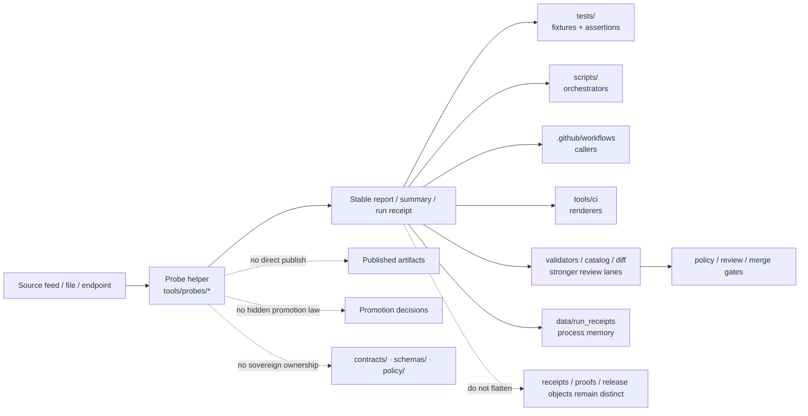

<!-- [KFM_META_BLOCK_V2]
doc_id: kfm://doc/NEEDS-VERIFICATION
title: tools/probes
type: standard
version: v1
status: draft
owners: @bartytime4life
created: NEEDS-VERIFICATION
updated: 2026-04-23
policy_label: public
related: [../README.md, ../../README.md, ../../.github/README.md, ../../.github/CODEOWNERS, ../../.github/workflows/README.md, ../../scripts/README.md, ../../tests/README.md, ../../contracts/README.md, ../../schemas/README.md, ../../policy/README.md, ../../data/receipts/README.md, ../../data/proofs/README.md, ../../data/run_receipts/, ../validators/README.md, ../diff/README.md, ../catalog/README.md, ../ci/README.md, ../attest/README.md]
tags: [kfm, tools, probes, freshness, status, inspection, bounded-observation, receipts, proofs]
notes: [doc_id and created date remain placeholders pending authoritative repo history verification; updated date reflects this draft revision; owner is inherited from current /tools/ ownership evidence and should be rechecked against active CODEOWNERS before publication; this README preserves the README-first probe-lane posture unless executable probes are verified in-tree.]
[/KFM_META_BLOCK_V2] -->

<a id="top"></a>

# tools/probes

Bounded inspection, freshness, status, and read-only evidence helpers for Kansas Frontier Matrix.

> [!NOTE]
> **Status:** experimental  
> **Owners:** `@bartytime4life`  
> **Path:** `tools/probes/README.md`  
> **Primary job:** observe, inspect, measure, summarize, and emit reviewable reports  
> **Evidence posture:** README-first lane evidence is carried forward; executable inventory, workflow callers, and active-branch usage remain **NEEDS VERIFICATION** until checked in the mounted repo.  
>
> 
> 
> 
> 
> 
> 
> 

**Quick jumps:** [Scope](#scope) · [Repo fit](#repo-fit) · [Accepted inputs](#accepted-inputs) · [Exclusions](#exclusions) · [Current evidence snapshot](#current-evidence-snapshot) · [Directory tree](#directory-tree) · [Quickstart](#quickstart) · [Usage](#usage) · [Diagram](#diagram) · [Boundary tables](#boundary-tables) · [Task list / definition of done](#task-list--definition-of-done) · [FAQ](#faq) · [Appendix](#appendix)

> [!IMPORTANT]
> `tools/probes/` is for **bounded readers and reporters**.
>
> It is not a hidden publish lane, a policy source of truth, a schema home, a validator lane, a diff lane, or a place to bury release-significant runtime behavior.

> [!TIP]
> Keep the KFM trust split visible:
>
> **probe output ≠ receipt authority ≠ proof authority ≠ policy decision ≠ promotion decision**
>
> Probes observe and report. Receipts preserve process memory. Proofs remain higher-order trust objects. Validators enforce declared rules. Policy decides. Workflows and scripts orchestrate. CI renderers summarize.

---

## Scope

`tools/probes/` is the helper lane for small, explicit utilities whose main job is to **inspect**, **sample**, **measure**, **check freshness/materiality**, and **emit reviewable outputs** without quietly changing trust state.

Typical probe work includes:

- source, feed, endpoint, or artifact availability checks
- freshness and lag observation
- response-surface, field-presence, or outward-shape checks
- checksum, count, timestamp, href, or item-set drift observation
- bounded trust-surface presence checks
- small read-only helpers that turn operational facts into machine-readable reports, summaries, or run receipts

A probe is a strong fit when the main question sounds like:

- “Is this source reachable?”
- “How stale is this artifact?”
- “Did the visible shape drift?”
- “Did the upstream checksum, timestamp, href, or item set change?”
- “Is the outward trust surface present?”
- “Can we emit a bounded report another lane can validate, render, diff, or gate?”

[Back to top](#top)

---

## Repo fit

`tools/probes/README.md` is a directory README inside the broader `tools/` support surface.

| Direction | Surface | Probe-lane relationship |
|---|---|---|
| Parent | [`../README.md`](../README.md) | Defines the broader `tools/` family contract and helper-lane boundaries. |
| Upstream | [`../../README.md`](../../README.md) | Carries the root KFM posture: governed, evidence-first, map-first, time-aware. |
| Governance | [`../../.github/README.md`](../../.github/README.md) | Repository gatehouse and governance framing. |
| Ownership | [`../../.github/CODEOWNERS`](../../.github/CODEOWNERS) | Owner coverage must be rechecked before publication. |
| Workflow callers | [`../../.github/workflows/README.md`](../../.github/workflows/README.md) | Workflows may call probes, but workflow YAML should not be the only implementation surface. |
| Orchestration | [`../../scripts/README.md`](../../scripts/README.md) | Scripts may call probes; reusable probe behavior should stay here. |
| Proof | [`../../tests/README.md`](../../tests/README.md) | Probe behavior, fixtures, pass paths, and failure paths should be proven explicitly. |
| Authority | [`../../policy/README.md`](../../policy/README.md) | Policy decides; probes provide bounded facts. |
| Contracts | [`../../contracts/README.md`](../../contracts/README.md) | Contracts define trust-object meaning; probes may inspect them but do not replace them. |
| Schemas | [`../../schemas/README.md`](../../schemas/README.md) | Schema authority stays outside this lane. |
| Process memory | [`../../data/run_receipts/`](../../data/run_receipts/) | Probe runs may emit run receipts here when the repo confirms this lane. |
| Receipts | [`../../data/receipts/README.md`](../../data/receipts/README.md) | Probes may emit or inspect process-memory receipts without owning receipt authority. |
| Proofs | [`../../data/proofs/README.md`](../../data/proofs/README.md) | Probes may inspect proof visibility, but proof assembly and release evidence stay separate. |
| Adjacent | [`../validators/README.md`](../validators/README.md) | Validators enforce declared rules; probes observe and report. |
| Adjacent | [`../diff/README.md`](../diff/README.md) | Diff helpers compare stable states; probes inspect live or bounded surfaces. |
| Adjacent | [`../catalog/README.md`](../catalog/README.md) | Catalog helpers inspect closure quality; probes may observe freshness or availability around those surfaces. |
| Adjacent | [`../ci/README.md`](../ci/README.md) | CI helpers may render probe results, but should not own probe logic. |
| Adjacent | [`../attest/README.md`](../attest/README.md) | Attestation helpers verify or assemble trust objects; probes may inspect their presence or freshness. |

### Working interpretation

Use this lane when the main job is:

> **observe → summarize → report**

Move out of this lane when the main job becomes:

> **decide → mutate → publish → own canonical truth**

[Back to top](#top)

---

## Accepted inputs

The following belong in or under `tools/probes/` when they remain bounded, observational, and reviewable:

- files, manifests, snapshots, catalogs, proof refs, receipts, or exported artifacts needing bounded inspection
- endpoint URLs, feeds, APIs, object stores, or service surfaces needing freshness or status observation
- declared thresholds or tolerances used for reporting or gating support
- output paths for reports, summaries, process-memory receipts, or machine-readable probe artifacts
- minimal scoped credentials when authenticated inspection is genuinely required
- local shell, operator, script, or CI contexts that should run the same probe behavior deterministically
- receipt, proof, catalog, or release refs when the probe question is observational rather than trust-decisional

### Particularly strong probe classes

| Probe class | Typical examples |
|---|---|
| Freshness probes | feed lag, dataset staleness, receipt age, release lag |
| Availability probes | endpoint reachable, asset exists, source responds, resource visible |
| Surface-shape probes | field presence, response skeleton, item-count surface, contract-adjacent drift observation |
| Drift observers | checksum drift, timestamp drift, count drift, href drift |
| Trust-surface probes | EvidenceBundle members present, receipt visible, release refs reachable, proof refs present, attestation result visible |
| Materiality probes | candidate upstream changes that need review before stronger lanes decide impact |

### Input rules

1. Keep inputs explicit and caller-supplied where possible.
2. Prefer declared thresholds over hidden constants.
3. Keep credentials minimal, externally supplied, and documented.
4. Prefer read-only inspection over convenience mutation.
5. Preserve role names such as `receipt_ref`, `proof_ref`, `release_ref`, and `evidence_ref` instead of flattening everything into a generic artifact blob.

[Back to top](#top)

---

## Exclusions

| Does **not** belong here | Put it in | Why |
|---|---|---|
| Long-running public runtime code | app or package lanes | Probes are support helpers, not product runtime. |
| Promotion, publication, or trust-state mutation logic | governed API, promotion validators, release workflows, or reviewed scripts | A probe may inform a decision; it should not silently make it. |
| Policy bundles or policy source of truth | [`../../policy/README.md`](../../policy/README.md) | Probes may summarize policy-relevant facts, but policy ownership stays separate. |
| Contract ownership | [`../../contracts/README.md`](../../contracts/README.md) | Probes inspect declared shapes; they do not define them. |
| Canonical schema-home decisions | [`../../schemas/README.md`](../../schemas/README.md) | Probes may inspect schema surfaces, but they do not arbitrate schema authority. |
| Proof-pack assembly or signature verification | [`../attest/README.md`](../attest/README.md) and proof lanes | Probes may inspect visibility; attestation owns trust-object verification. |
| Deterministic structural comparison | [`../diff/README.md`](../diff/README.md) | Comparing two declared states is different from probing one surface. |
| Reviewer Markdown rendering | [`../ci/README.md`](../ci/README.md) | Probes should emit stable data that renderers can consume. |
| Hidden one-off shell blobs embedded only in workflow YAML | stable tool entrypoints plus documented workflow callers | Reviewers should be able to inspect logic outside CI YAML. |
| Unsafe coordinate dumps, private samples, or sensitive fixtures | secured data lanes or tightly scoped test fixtures | Public tooling should remain safe to clone and review. |
| Broad operator orchestration | [`../../scripts/README.md`](../../scripts/README.md) | A script may call several helpers; a probe should stay narrow. |
| Generic QA assertion inventory | [`../../tests/README.md`](../../tests/README.md) | Tests prove behavior; probes generate observations. |

> [!CAUTION]
> A probe may write a caller-chosen report file, but it should not directly mutate canonical truth, publish artifacts, approve promotion, or bypass governed review as its primary job.

[Back to top](#top)

---

## Current evidence snapshot

This table records the lane posture carried forward for this README. Recheck it in the mounted repo before merge.

| Evidence item | Status | Current meaning |
|---|---:|---|
| `tools/probes/README.md` is the target lane surface | **CONFIRMED** | This README is a real lane document, not a hypothetical path. |
| Public-tree evidence for `tools/probes/` is README-first | **CONFIRMED / NEEDS VERIFICATION in active checkout** | Prevents overclaiming executable probe inventory. |
| The existing probe README lineage is substantive | **CONFIRMED** | This revision builds upward instead of resetting the lane to generic scaffold prose. |
| Sibling `tools/` lanes include validators, diff, catalog, CI, attest, docs, and probes | **CONFIRMED from retrieved repo-doc evidence / NEEDS ACTIVE CHECKOUT VERIFICATION** | Grounds handoff boundaries and relative-link structure. |
| `/tools/` owner coverage uses `@bartytime4life` | **CONFIRMED from retrieved repo-doc evidence / NEEDS ACTIVE CODEOWNERS VERIFICATION** | Grounds the owner line without inventing a narrower `/tools/probes/` owner rule. |
| Exact executable probes under `tools/probes/` | **UNKNOWN** | Do not claim executable inventory until the active branch is inspected. |
| Exact workflow callers, rulesets, or non-public runtime use | **UNKNOWN** | Not derivable from README lineage alone. |
| Whether `data/run_receipts/` is populated or active | **NEEDS VERIFICATION** | Probe outputs may land there only when repo conventions confirm it. |

[Back to top](#top)

---

## Directory tree

### Current documented lane shape

```text
tools/probes/
└── README.md
```

### Confirmed parent-family context from repo-doc evidence

```text
tools/
├── attest/
├── catalog/
├── ci/
├── diff/
├── docs/
├── probes/
├── validators/
└── README.md
```

> [!WARNING]
> The landing shapes below are **PROPOSED** growth patterns, not statements that executable probes are already present.

### Minimal first-probe landing

```text
tools/probes/
├── README.md
└── <domain>_<question>_probe.py
```

### Richer probe landing

```text
tools/probes/
├── README.md
├── <domain>_<question>_probe.py
├── <domain>_<freshness>_probe.py
└── examples/
    └── README.md
```

### Receipt-oriented output neighborhood

```text
data/
├── work/
│   ├── meta/
│   └── raw/
├── receipts/
└── run_receipts/
```

> [!TIP]
> Keep fixtures and assertions in [`../../tests/`](../../tests/) unless a tiny, safe helper-local sample is genuinely easier to maintain here.

[Back to top](#top)

---

## Quickstart

Run these checks before adding or moving anything under `tools/probes/`.

### 1. Confirm the live tree

```bash
tree -a -L 2 tools/probes 2>/dev/null \
  || find tools/probes -maxdepth 2 \( -type f -o -type d \) 2>/dev/null | sort
```

### 2. Recheck family doctrine and ownership

```bash
sed -n '1,260p' tools/README.md 2>/dev/null
sed -n '1,180p' .github/CODEOWNERS 2>/dev/null
```

### 3. Recheck adjacent boundary docs

```bash
sed -n '1,260p' .github/workflows/README.md 2>/dev/null
sed -n '1,240p' scripts/README.md 2>/dev/null
sed -n '1,240p' tests/README.md 2>/dev/null
sed -n '1,240p' policy/README.md 2>/dev/null
sed -n '1,240p' contracts/README.md 2>/dev/null
sed -n '1,240p' schemas/README.md 2>/dev/null
sed -n '1,240p' data/receipts/README.md 2>/dev/null
sed -n '1,240p' data/proofs/README.md 2>/dev/null
sed -n '1,240p' tools/validators/README.md 2>/dev/null
sed -n '1,240p' tools/diff/README.md 2>/dev/null
sed -n '1,240p' tools/catalog/README.md 2>/dev/null
sed -n '1,240p' tools/ci/README.md 2>/dev/null
sed -n '1,240p' tools/attest/README.md 2>/dev/null
```

### 4. Search for existing callers and naming patterns

```bash
rg -n "tools/probes|_probe|probe.json|freshness|materiality|availability|stale|run_receipts|receipt_ref|proof_ref" \
  README.md .github docs scripts tests tools data contracts schemas policy -S 2>/dev/null
```

### 5. If adding the first executable probe, prove the lane stays narrow

```bash
find tools/probes -maxdepth 3 -type f \
  \( -name "*.py" -o -name "*.sh" -o -name "*.mjs" -o -name "*.ts" \) 2>/dev/null | sort
```

[Back to top](#top)

---

## Usage

### Add a probe

1. Pick one narrow observational question.
2. Confirm no sibling lane already owns the work.
3. Define inputs, thresholds, output path, exit behavior, and caller expectations.
4. Keep the probe read-only by default.
5. Emit one stable machine-readable report.
6. Add positive and negative-path tests under [`../../tests/`](../../tests/).
7. Document workflow or script callers here if they exist.
8. Keep promotion, publication, signing, and policy decisions outside this lane.

### Name a probe

Use names that describe the domain and question:

```text
<domain>_<question>_probe.py
```

Examples:

```text
hydrology_freshness_probe.py
catalog_release_refs_probe.py
stac_materiality_probe.py
```

These are naming examples, not confirmed executable files.

### Report status vocabulary

Use a small, documented vocabulary. A probe report may use a `status` such as:

| Status | Meaning |
|---|---|
| `OBSERVED` | Probe completed and emitted a bounded observation. |
| `UNCHANGED` | Probe completed and observed no material drift under the declared threshold. |
| `CHANGED` | Probe observed drift or materiality requiring downstream review. |
| `STALE` | Probe observed freshness outside the declared tolerance. |
| `UNREACHABLE` | Probe could not reach the source or artifact. |
| `ERROR` | Probe failed due to input, configuration, parsing, or execution error. |

> [!IMPORTANT]
> Do not reuse runtime answer outcomes such as `ANSWER`, `ABSTAIN`, `DENY`, or `ERROR` unless the probe is explicitly inspecting a governed runtime envelope. Probe status is observational; runtime decisions and promotion decisions belong elsewhere.

### Minimal probe report shape

```json
{
  "probe_id": "kfm.probes.example.v1",
  "question": "Is the declared source reachable and fresh enough for review?",
  "checked_at": "2026-04-23T00:00:00Z",
  "inputs": {
    "source_ref": "kfm://source/NEEDS-VERIFICATION",
    "url": "https://example.invalid/feed",
    "freshness_threshold": "PT24H"
  },
  "status": "OBSERVED",
  "observations": {
    "reachable": true,
    "source_timestamp": "2026-04-22T18:00:00Z",
    "lag_seconds": 21600
  },
  "refs": {
    "receipt_ref": null,
    "proof_ref": null,
    "evidence_ref": null
  },
  "limits": [
    "illustrative example; not a current checked-in report"
  ],
  "warnings": [],
  "errors": []
}
```

### Exit-code guidance

| Exit code | Default meaning |
|---:|---|
| `0` | Report emitted and no caller-blocking condition was found. |
| `1` | Report emitted with caller-blocking finding or failed threshold. |
| `2` | Invalid arguments, missing required input, or configuration failure. |
| `3` | Source unavailable, unreadable, or authentication failure. |

Document any probe-specific deviation in the probe’s help text and tests.

[Back to top](#top)

---

## Diagram



[Back to top](#top)

---

## Boundary tables

### Lane boundary map

| Surface | Primary job | Probe handoff rule |
|---|---|---|
| `tools/probes/` | Inspect and report bounded operational facts | Keep the question narrow and the output reviewable. |
| `tools/validators/` | Assert rule or shape conformance | Move here when the main task becomes pass/fail validation. |
| `tools/diff/` | Compare stable states or artifacts | Move here when the main task is deterministic comparison. |
| `tools/catalog/` | Catalog QA and closure helpers | Use when STAC/DCAT/PROV closure is the main concern. |
| `tools/ci/` | Reviewer-facing summaries and annotations | Use when stable probe output already exists and needs rendering. |
| `tools/attest/` | Trust-object verification and support bundles | Use when attestation or proof verification is the main job. |
| `scripts/` | Orchestrate repeatable multi-step work | A script may call a probe; the probe should remain reusable alone. |
| `policy/` | Own decision rules | A probe supplies evidence; policy decides. |
| `contracts/` | Own machine-readable trust objects | A probe may inspect them, not define them. |
| `schemas/` | Hold schema-home boundary documentation | A probe may inspect shape, not settle authority. |
| `tests/` | Prove behavior with fixtures and assertions | Every material probe should be exercised here. |
| `.github/workflows/` | CI/CD automation | Workflows call probes; they should not become the only implementation surface. |
| `data/run_receipts/` | Process-memory outputs for runs | Good fit for probe-emitted run receipts when the lane exists. |
| `data/receipts/` / `data/proofs/` | Governed trust storage | Probes may inspect or reference, but should not become these lanes. |

### Probe behavior contract

| Concern | Working rule | Why |
|---|---|---|
| Mutation | Read-only by default | Preserves the trust membrane. |
| Output | Emit stable, reviewable reports or receipts | Humans and CI should inspect the same result. |
| Exit behavior | Clear non-zero exits for blocking failures | Callers should not guess what happened. |
| Freshness/time | Include `checked_at` or equivalent timing basis | Supports stale/materiality review. |
| Secrets | Use least-privilege externally supplied credentials only when required | Keeps probe runs safer and reviewable. |
| Callers | Stay runnable locally, from scripts, and from workflows | Avoids YAML-only logic. |
| Tests | Add representative positive and negative-path fixtures | KFM verification includes failure paths. |
| Docs | Update this README when lane behavior changes materially | Keeps documentary surfaces honest. |
| Authority | Never become the canonical owner of policy, contracts, receipts, proofs, or schema decisions | Prevents helper-code drift into sovereign truth. |

### Probe class matrix

| Class | Good fit | Poor fit |
|---|---|---|
| Freshness | “How old is the latest visible source artifact?” | “Should this dataset be promoted?” |
| Availability | “Can the endpoint be reached from CI?” | “Should the source be admitted as authoritative?” |
| Surface shape | “Does the response still include the fields we inspect?” | “What is the canonical schema?” |
| Materiality | “Did item count or checksum drift beyond threshold?” | “Should the drift be approved?” |
| Trust-surface visibility | “Is the receipt/proof/ref visible?” | “Is the proof valid and sufficient for release?” |
| Report rendering | “Can a downstream renderer consume the report?” | “Render the entire review handoff here.” |

[Back to top](#top)

---

## Task list / definition of done

Before merging a probe change:

- [ ] Live tree rechecked before merge.
- [ ] Owner coverage verified against active [`../../.github/CODEOWNERS`](../../.github/CODEOWNERS).
- [ ] Any executable probe is documented here as **CONFIRMED**, **PROPOSED**, or **NEEDS VERIFICATION** appropriately.
- [ ] Probe entrypoint stays narrow, read-mostly, and reviewable.
- [ ] No direct canonical write, publish, promote, sign, or proof-approval path is introduced.
- [ ] Caller surfaces are documented.
- [ ] Output format and exit behavior are stable enough for local and CI use.
- [ ] Representative test coverage lands with the probe.
- [ ] Sensitive samples, exact protected locations, secrets, and private data are excluded or handled by safer lanes.
- [ ] Adjacent boundary docs remain in sync if schema-, contract-, proof-, receipt-, or policy-facing assumptions change.
- [ ] Unknowns remain visible instead of being smoothed into implementation claims.
- [ ] If a probe begins to enforce rules rather than observe facts, it is moved or split into a stronger lane.

[Back to top](#top)

---

## FAQ

### Are probes the same as validators?

No. A validator primarily proves a declared rule or shape. A probe primarily inspects a surface and emits a bounded observation that another lane can review, gate, diff, or summarize.

### Can a probe publish data or promote a release?

No, not as its primary job. A probe may inform a governed decision, but promotion, publication, and trust-state changes belong in stronger lanes.

### Does this README claim executable probes already exist here?

No. The carried-forward lane posture is README-first. Any executable examples in this file are marked **PROPOSED**, illustrative, or **NEEDS VERIFICATION** until verified in the active repo checkout.

### Where should fixtures live?

Prefer [`../../tests/`](../../tests/) for representative fixtures and assertions. Keep helper-local samples tiny and safe if they exist at all.

### Should workflow YAML contain the only copy of probe logic?

No. Workflows may call probes, but executable behavior should remain inspectable as a stable entrypoint under `tools/probes/`.

### Do probes decide schema or policy authority?

No. Probes may inspect those surfaces, but canonical ownership remains with the explicitly governed lanes that already document those responsibilities.

### Can probes help promotion review?

Yes, especially around freshness, availability, materiality, and visible trust-surface state. They should report those facts, not turn them into release law.

[Back to top](#top)

---

## Appendix

<details>
<summary><strong>PROPOSED landing rubric for the first executable probe</strong></summary>

### Minimal rubric

1. Pick one question:
   - freshness
   - availability
   - checksum drift
   - surface-shape drift
   - bounded materiality check
   - trust-surface presence

2. Name the entrypoint clearly:

   ```text
   <domain>_<question>_probe.py
   ```

3. Keep output stable:
   - one report
   - one clear status
   - one clear failure path
   - one declared timing basis

4. Add proof in the same change:
   - README update
   - representative tests
   - caller documentation
   - sample output if safe

5. Keep boundaries sharp:
   - no hidden promotion logic
   - no policy ownership
   - no silent canonical writes
   - no schema-home arbitration by convenience
   - no proof authority collapse

</details>

<details>
<summary><strong>Illustrative trust-surface probe output</strong></summary>

```json
{
  "probe_id": "kfm.probes.trust_surface_visibility.v1",
  "question": "Are declared release refs visible without asserting proof sufficiency?",
  "checked_at": "2026-04-23T00:00:00Z",
  "status": "OBSERVED",
  "inputs": {
    "release_manifest_ref": "release/example/release_manifest.json",
    "expected_refs": [
      "receipt_ref",
      "proof_ref",
      "catalog_ref"
    ]
  },
  "observations": {
    "receipt_ref_present": true,
    "proof_ref_present": false,
    "catalog_ref_present": true
  },
  "warnings": [
    "proof_ref missing; this probe reports visibility only and does not decide release sufficiency"
  ],
  "errors": []
}
```

</details>

<details>
<summary><strong>Maintainer reminders</strong></summary>

- Probes are excellent early-warning tools, but weak release authorities.
- A stable report is better than a clever hidden side effect.
- A probe can be useful even when it returns `CHANGED`, `STALE`, or `UNREACHABLE`.
- A probe that starts deciding policy should become a validator or policy gate.
- A probe that starts comparing canonical states should move to `tools/diff/`.
- A probe that starts verifying signatures should move to `tools/attest/`.
- A probe that starts rendering reviewer documents should move to `tools/ci/`.
- A probe that starts mutating lifecycle state should be split, reviewed, and routed through governed promotion.

</details>

[Back to top](#top)
