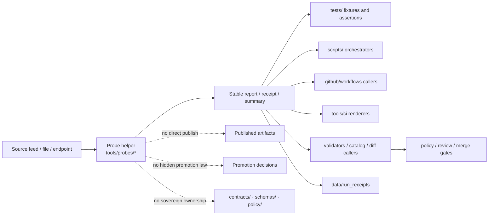

<!--
KFM Meta Block V2
doc_id: kfm.tools.probes.readme
title: Tools — Probes
type: standard
version: v1
status: draft
owners: @bartytime4life
created: NEEDS-VERIFICATION
updated: 2026-04-16
policy_label: public
related:
  - ../README.md
  - ../../README.md
  - ../../.github/README.md
  - ../../.github/CODEOWNERS
  - ../../.github/workflows/README.md
  - ../validators/README.md
  - ../diff/README.md
  - ../catalog/README.md
  - ../ci/README.md
  - ../attest/README.md
  - ../../scripts/README.md
  - ../../tests/README.md
  - ../../policy/README.md
  - ../../contracts/README.md
  - ../../schemas/README.md
  - ../../data/run_receipts/
tags:
  - kfm
  - tools
  - probes
  - freshness
  - status
  - inspection
  - bounded-observation
notes:
  - Current public snapshot remains README-first unless executable probes are landed and verified in-tree.
  - doc_id and created date should be reconciled against authoritative repo history before publication.
-->

# 🔎 tools/probes/

> Bounded inspection, freshness, status, and read-only evidence helpers for Kansas Frontier Matrix.

<div align="left">


</div>

| Field | Value |
|---|---|
| **Path** | `tools/probes/README.md` |
| **Owners** | `@bartytime4life` *(current `/tools/` owner inherited from visible `CODEOWNERS` coverage)* |
| **Repo fit** | child lane under [`../README.md`](../README.md) |
| **Primary job** | observe, inspect, measure, summarize, and emit reviewable reports |
| **Not this lane** | policy authority, promotion authority, publishing, hidden runtime logic |
| **Current public snapshot** | `tools/probes/` is README-first on visible public `main` unless deeper branch evidence proves otherwise |

**Quick jumps:** [Scope](#scope) · [Repo fit](#repo-fit) · [Accepted inputs](#accepted-inputs) · [Exclusions](#exclusions) · [Current verified snapshot](#current-verified-snapshot) · [Directory tree](#directory-tree) · [Quickstart](#quickstart) · [Usage](#usage) · [Diagram](#diagram) · [Tables](#tables) · [Task list](#task-list--definition-of-done) · [FAQ](#faq) · [Appendix](#appendix)

> [!IMPORTANT]
> `tools/probes/` is for **bounded readers and reporters**. It is **not** a hidden publish lane, a policy source-of-truth, a schema home, or a place to bury release-significant runtime behavior.

> [!NOTE]
> This README is intentionally dual-purpose:
>
> 1. it records the **current public-tree reality** honestly  
> 2. it defines the **landing contract** for the first executable probes
>
> That means examples below may be marked **PROPOSED** or **illustrative** until verified in-tree.

---

## Scope

`tools/probes/` is the KFM helper lane for small, explicit utilities whose job is to **inspect**, **sample**, **measure**, **check freshness/materiality**, and **emit reviewable outputs** without quietly changing trust state.

Typical probe work includes:

- source or feed availability checks
- freshness and lag observation
- response-surface or field-presence checks
- checksum, count, or timestamp drift observation
- bounded trust-surface presence checks
- small read-only helpers that turn operational facts into machine-readable reports

### What belongs here

- reusable, read-mostly helpers that inspect systems or artifacts
- probe CLIs runnable locally, from `scripts/`, or from CI
- helpers that measure **freshness**, **availability**, **materiality**, **surface state**, or **boundary visibility**
- tools that emit stable reports, receipts, or summaries for downstream review

### What a probe should sound like

A probe is a strong fit when the main question sounds like:

- “Is this source reachable?”
- “How stale is this artifact?”
- “Did the visible shape drift?”
- “Did the upstream checksum, timestamp, or item set change?”
- “Is the outward trust surface present?”
- “Can we emit a bounded report another lane can validate, render, or gate?”

### Truth labels used here

| Marker | Meaning |
|---|---|
| **CONFIRMED** | Supported by visible repo files or authoritative adjacent documentation |
| **INFERRED** | Strongly suggested by repo doctrine, but not proven as current implementation |
| **PROPOSED** | Target shape or recommended landing pattern |
| **UNKNOWN** | Not established strongly enough from current evidence |
| **NEEDS VERIFICATION** | Placeholder detail requiring direct repo history or active-branch inspection |

[Back to top](#-toolsprobes)

---

## Repo fit

**Path:** `tools/probes/README.md`  
**Role:** directory README for bounded inspection helpers inside the broader `tools/` surface.

| Direction | Surface | Why it matters |
|---|---|---|
| Parent | [`../README.md`](../README.md) | Family contract for `tools/` and helper-lane boundaries |
| Upstream | [`../../README.md`](../../README.md) | Root repo posture: governed, evidence-first, map-first, time-aware |
| Governance | [`../../.github/README.md`](../../.github/README.md) | Repository gatehouse and governance framing |
| Ownership | [`../../.github/CODEOWNERS`](../../.github/CODEOWNERS) | Grounds current visible owner coverage |
| Downstream | [`../../.github/workflows/README.md`](../../.github/workflows/README.md) | Workflows may call probes, but should not be the only home of probe logic |
| Adjacent | [`../validators/README.md`](../validators/README.md) | Validators enforce declared rules; probes observe and report |
| Adjacent | [`../diff/README.md`](../diff/README.md) | Diff helpers compare canonicalized states; probes inspect live or bounded surfaces |
| Adjacent | [`../catalog/README.md`](../catalog/README.md) | Catalog QA and closure checks may consume probe outputs |
| Adjacent | [`../ci/README.md`](../ci/README.md) | CI renderers can present probe results without owning probe logic |
| Adjacent | [`../attest/README.md`](../attest/README.md) | Attestation helpers verify or assemble trust objects; probes may inspect their presence |
| Orchestration | [`../../scripts/README.md`](../../scripts/README.md) | Scripts may call probes; reusable probe behavior should not be buried there |
| Proof | [`../../tests/README.md`](../../tests/README.md) | Probe behavior should be proven with fixtures and assertions |
| Authority | [`../../policy/README.md`](../../policy/README.md) | Policy decides; probes provide facts |
| Contracts | [`../../contracts/README.md`](../../contracts/README.md) | Contracts define shapes and trust objects; probes inspect, not own |
| Schemas | [`../../schemas/README.md`](../../schemas/README.md) | Schema-home authority stays outside this lane |
| Receipts | [`../../data/run_receipts/`](../../data/run_receipts/) | Probe outputs frequently land as process-memory receipts |

### Working interpretation

Use this lane when the main job is:

> **observe → summarize → report**

Move out of this lane when the main job becomes:

> **decide → mutate → publish → own canonical truth**

---

## Accepted inputs

The following belong in or under `tools/probes/`:

- files, manifests, snapshots, catalogs, or exported artifacts needing bounded inspection
- endpoint URLs, feeds, APIs, or service surfaces needing freshness or status observation
- declared thresholds or tolerances used for reporting or gating support
- output paths for reports, summaries, receipts, or machine-readable probe artifacts
- minimal scoped credentials when authenticated inspection is genuinely required
- local shell, operator, or CI contexts that should run the same probe behavior deterministically

### Strong-fit probe classes

| Probe class | Typical examples |
|---|---|
| Freshness probes | feed lag, dataset staleness, receipt age, release lag |
| Availability probes | endpoint reachable, asset exists, source responds |
| Surface-shape probes | field presence, response skeleton, item-count surface |
| Drift observers | checksum drift, timestamp drift, count drift, href drift |
| Trust-surface probes | evidence bundle members present, receipt visible, release refs reachable |

### Example bounded inputs

- STAC collection or change-feed URL
- artifact path plus expected digest file
- release manifest plus outward proof references
- response payload plus expected field-presence checklist
- receipt directory plus freshness threshold

[Back to top](#-toolsprobes)

---

## Exclusions

| Does **not** belong here | Put it in | Why |
|---|---|---|
| Long-running runtime code | app or package lanes | Probes are support helpers, not product runtime |
| Promotion or publication logic | `scripts/`, workflow/review lanes, or runtime surfaces | Probes may inform a decision but should not silently make it |
| Policy bundles or policy truth | [`../../policy/README.md`](../../policy/README.md) | Policy ownership stays sovereign |
| Contract ownership | [`../../contracts/README.md`](../../contracts/README.md) | Probes inspect declared shapes; they do not define them |
| Canonical schema-home decisions | [`../../schemas/README.md`](../../schemas/README.md) | Shape inspection is different from schema authority |
| Hidden workflow-only shell blobs | stable tool entrypoints | Probe behavior must be inspectable outside YAML |
| Broad orchestration | [`../../scripts/README.md`](../../scripts/README.md) | Scripts coordinate many steps; probes stay narrow |
| Generic QA assertion inventory | [`../../tests/README.md`](../../tests/README.md) | Tests prove behavior; probes generate observations |
| Stable state comparison logic | `tools/diff/` | Comparing two canonicalized states is a different concern |
| Reviewer summary formatting | `tools/ci/` | Probes should emit data that renderers can consume |

> [!CAUTION]
> A probe may write a caller-chosen report file, but it should not directly mutate canonical truth, publish artifacts, approve promotion, or bypass governed review as its primary job.

---

## Current verified snapshot

| Evidence item | Status | Why it matters |
|---|---|---|
| `tools/probes/README.md` exists | **CONFIRMED** | This lane is real in the public tree |
| The visible public subtree is README-first | **CONFIRMED** | Prevents overclaiming executable inventory |
| The current README is already substantive | **CONFIRMED** | This file should be revised upward, not reset to generic scaffold text |
| The visible `tools/` family includes `attest/`, `catalog/`, `ci/`, `diff/`, `docs/`, `probes/`, and `validators/` | **CONFIRMED** | Grounds sibling references and lane context |
| `/tools/` ownership is covered by visible `CODEOWNERS` | **CONFIRMED** | Supports the ownership line above |
| Adjacent lane docs already describe validator, diff, catalog, CI, and attestation boundaries | **CONFIRMED** | Strengthens clean handoff expectations |
| Exact workflow callers or non-public runtime usage of probes | **UNKNOWN** | Not derivable from visible tree inspection alone |
| Any landed executable probe under `tools/probes/` on non-public branches | **UNKNOWN** | Requires active-branch or deeper checkout verification |

---

## Directory tree

### Current public subtree

```text
tools/probes/
└── README.md
```

### Confirmed parent family context

```text
tools/
├── attest/
├── catalog/
├── ci/
├── diff/
├── docs/
├── probes/
├── validators/
└── README.md
```

> [!WARNING]
> Everything below is a **PROPOSED landing shape**, not a statement that the current public subtree is already populated.

### Minimal first-probe landing

```text
tools/probes/
├── README.md
└── <domain>_<question>_probe.py
```

### Example STAC-oriented landing

```text
tools/probes/
├── README.md
└── stac_change_runner.py
```

### Expected data-side outputs for receipt-oriented probes

```text
data/
├── work/
│   ├── meta/
│   └── raw/
└── run_receipts/
```

> [!TIP]
> `stac_change_runner.py` is a strong **PROPOSED** first executable fit for this lane because it observes upstream STAC materiality, persists raw payloads, and emits run receipts without becoming a publish or policy surface.

[Back to top](#-toolsprobes)

---

## Quickstart

Run these checks before adding or moving anything under `tools/probes/`.

### 1. Confirm the live tree

```bash
tree -a -L 2 tools/probes 2>/dev/null || find tools/probes -maxdepth 2 \( -type f -o -type d \) 2>/dev/null | sort
```

### 2. Recheck family doctrine and ownership

```bash
sed -n '1,260p' tools/README.md 2>/dev/null
sed -n '1,180p' .github/CODEOWNERS 2>/dev/null
```

### 3. Recheck adjacent boundary docs

```bash
sed -n '1,260p' .github/workflows/README.md 2>/dev/null
sed -n '1,240p' scripts/README.md 2>/dev/null
sed -n '1,240p' tests/README.md 2>/dev/null
sed -n '1,240p' policy/README.md 2>/dev/null
sed -n '1,240p' contracts/README.md 2>/dev/null
sed -n '1,240p' schemas/README.md 2>/dev/null
sed -n '1,240p' tools/catalog/README.md 2>/dev/null
sed -n '1,240p' tools/ci/README.md 2>/dev/null
sed -n '1,240p' tools/validators/README.md 2>/dev/null
```

### 4. Search for existing caller and naming patterns

```bash
rg -n "tools/probes|_probe|run_receipt|freshness|availability|materiality|stale|drift" README.md .github docs scripts tests tools data -S 2>/dev/null
```

### 5. If adding the first executable probe, prove the lane stays narrow

```bash
find tools/probes -maxdepth 3 -type f \( -name "*.py" -o -name "*.sh" -o -name "*.mjs" -o -name "*.ts" \) 2>/dev/null | sort
```

---

## Usage

### Design rules for executable probes

1. Start with **one narrow question**
2. Stay **read-only by default**
3. Emit a **stable report or receipt**
4. Keep the entrypoint runnable **outside CI**
5. Document caller surfaces here
6. Add representative **positive and negative-path tests**

### Entry-point expectations

- prefer one clear CLI entrypoint per probe
- keep exit codes deterministic
- stamp `checked_at` and, when relevant, observed source freshness basis
- keep secrets minimal and externally injected
- avoid hidden retries that erase evidence of degradation
- keep policy, contract, and schema authority outside the helper

### Illustrative invocation

The example below is **illustrative** until verified in-tree.

```bash
SOURCE_URL=https://example.com/stac/collections/foo \
WORK_DIR=./data \
python3 tools/probes/stac_change_runner.py
```

### Illustrative bounded receipt shape

This is an example output shape, not a settled repo contract.

```json
{
  "source": "https://example.com/stac/collections/foo",
  "collection": "foo",
  "fetch_ts": "2026-04-16T02:40:31Z",
  "etag": "\"abc123\"",
  "last_modified": "Wed, 15 Apr 2026 23:59:59 GMT",
  "spec_hash": "b2e7...",
  "changed_items": ["item-001", "item-042"],
  "transport_status": 200
}
```

### Healthy handoff model

A good probe usually hands off to a stronger lane:

- `tools/validators/` when observation becomes rule enforcement
- `tools/diff/` when the task becomes stable-state comparison
- `tools/catalog/` when the task becomes catalog closure QA
- `tools/ci/` when machine-readable output needs reviewer rendering
- `policy/` when allow/deny/obligation decisions must be made
- `data/run_receipts/` when process-memory artifacts need durable placement

[Back to top](#-toolsprobes)

---

## Diagram



---

## Tables

### Boundary map

| Surface | Primary job | Probe handoff rule |
|---|---|---|
| `tools/probes/` | Inspect and report bounded operational facts | Keep the question narrow and the output reviewable |
| `tools/validators/` | Assert rule or shape conformance | Move here when the main task becomes pass/fail validation |
| `tools/diff/` | Compare stable states or artifacts | Move here when the main task is deterministic comparison |
| `tools/catalog/` | Catalog QA and closure helpers | Use when STAC/DCAT/PROV closure is the main concern |
| `tools/ci/` | Reviewer-facing summaries and annotations | Use when stable probe output already exists and needs rendering |
| `tools/attest/` | Trust-object verification and support bundles | Use when attestation or proof verification is the main job |
| `scripts/` | Orchestrate repeatable multi-step work | A script may call a probe; the probe should remain reusable alone |
| `policy/` | Own decision rules | A probe supplies evidence; policy decides |
| `contracts/` | Own machine-readable trust objects | A probe may inspect them, not define them |
| `schemas/` | Hold schema-home boundary documentation | A probe may inspect shape, not settle authority |
| `tests/` | Prove behavior with fixtures and assertions | Every material probe should be exercised here |
| `.github/workflows/` | CI/CD automation | Workflows call probes; they should not become the only implementation surface |

### Probe behavior contract

| Concern | Working rule | Why |
|---|---|---|
| Mutation | Read-only by default | Preserves the trust membrane |
| Output | Emit stable, reviewable reports or receipts | Humans and CI should inspect the same result |
| Exit behavior | Clear non-zero exits for blocking failures | Callers should not guess what happened |
| Freshness/time | Include `checked_at` or equivalent timing basis | Supports stale/materiality review |
| Secrets | Use least-privilege externally supplied credentials only when required | Keeps probe runs safer and reviewable |
| Callers | Stay runnable locally, from scripts, and from workflows | Avoids YAML-only logic |
| Tests | Add representative positive and negative-path fixtures | KFM verification includes failure paths |
| Docs | Update this README when lane behavior changes materially | Keeps documentary surfaces honest |
| Authority | Never become the canonical owner of policy, contracts, or schema decisions | Prevents helper-code drift into sovereign truth |

### Probe class matrix

| Probe class | Typical question | Example outputs |
|---|---|---|
| Freshness probe | How stale is this source or artifact? | lag report, observed timestamp, threshold result |
| Availability probe | Is this endpoint or artifact reachable? | reachable/unreachable result, transport notes |
| Surface-shape probe | Did the visible response or file shape drift? | field presence report, structure summary |
| Drift probe | Did checksum, timestamp, count, or href set change? | observed drift summary, prior/current values |
| Trust-surface probe | Are expected outward or supporting artifacts present? | missing artifact report, presence matrix |

[Back to top](#-toolsprobes)

---

## Task list / Definition of done

- [ ] Live tree rechecked before merge
- [ ] Any first executable probe is documented here as **CONFIRMED** or **PROPOSED** appropriately
- [ ] Probe entrypoint stays narrow, read-mostly, and reviewable
- [ ] No direct canonical write, publish, or promote path is introduced
- [ ] Caller surfaces are documented
- [ ] Representative test coverage lands with the probe
- [ ] Output format and exit behavior are stable enough for local and CI use
- [ ] Adjacent boundary docs remain in sync if schema-, contract-, or policy-facing assumptions change
- [ ] Unknowns remain visible instead of being smoothed into implementation claims
- [ ] If a probe begins to enforce rules rather than observe facts, it is moved or split into a stronger lane

---

## FAQ

### Are probes the same as validators?

No. A validator primarily proves a declared rule or shape. A probe primarily inspects a bounded surface and emits observations another lane can review, render, diff, or gate.

### Can a probe publish data or promote a release?

Not as its primary job. A probe may inform a governed decision, but promotion, publication, and trust-state changes belong elsewhere.

### Does this README claim executable probes already exist here?

No. The current visible public subtree is README-first unless executable files are separately verified in-tree.

### Where should fixtures live?

Prefer [`../../tests/`](../../tests/) for representative fixtures and assertions. Keep helper-local samples tiny and safe if they exist at all.

### Should workflow YAML contain the only copy of probe logic?

No. Workflows may call probes, but executable behavior should remain inspectable as stable entrypoints under `tools/probes/`.

### Do probes decide schema or policy authority?

No. Probes may inspect those surfaces, but canonical ownership remains with the explicitly governed lanes that already document those responsibilities.

### Can probes help promotion review?

Yes, especially around freshness, availability, and visible trust-surface state. They should report those facts, not convert them into release law.

---

## Appendix

<details>
<summary><strong>PROPOSED landing rubric for the first executable probe</strong></summary>

### Minimal rubric

1. Pick one question:
   - freshness
   - availability
   - checksum drift
   - surface-shape drift
   - bounded materiality check

2. Name the entrypoint clearly:

```text
<domain>_<question>_probe.py
```

3. Keep output stable:
   - one report
   - one clear status
   - one clear failure path

4. Add proof in the same change:
   - README update
   - representative test coverage
   - caller documentation

5. Keep boundaries sharp:
   - no hidden promotion logic
   - no policy ownership
   - no silent canonical writes
   - no schema-home arbitration by convenience

### Example first-probe candidate

A STAC materiality watcher such as:

```text
tools/probes/stac_change_runner.py
```

is a strong fit **if** it remains:

- read-only with respect to upstreams
- deterministic in its spec-hash and change detection
- explicit about outputs under `data/work/` and `data/run_receipts/`
- fail-closed only through external validator or policy callers

</details>

<details>
<summary><strong>Illustrative trust-surface probe output</strong></summary>

```json
{
  "probe": "promotion_bundle_visibility",
  "checked_at": "2026-04-16T00:00:00Z",
  "target": "promotion-bundle.json",
  "status": "warn",
  "summary": "bundle present but verification result missing",
  "observations": [
    {
      "id": "decision_present",
      "result": "pass"
    },
    {
      "id": "verify_result_present",
      "result": "warn"
    }
  ],
  "artifacts": [
    "promotion-bundle.json"
  ]
}
```

This kind of helper belongs here only if it remains observational and does not decide whether promotion should proceed.

</details>

<details>
<summary><strong>Illustrative STAC change receipt</strong></summary>

```json
{
  "source": "https://example.com/stac/collections/foo",
  "collection": "foo",
  "fetch_ts": "2026-04-16T02:40:31Z",
  "etag": "\"abc123\"",
  "last_modified": "Wed, 15 Apr 2026 23:59:59 GMT",
  "spec_hash": "b2e7...",
  "changed_items": [
    "item-001",
    "item-042"
  ],
  "transport_status": 200
}
```

This belongs in the probes lane only while it is still **process memory and observation**, not proof-pack authority or release law.

</details>

[Back to top](#-toolsprobes)
