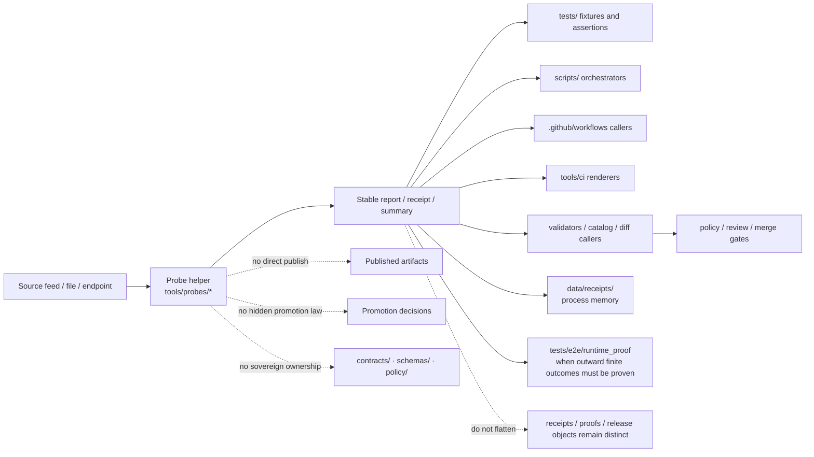
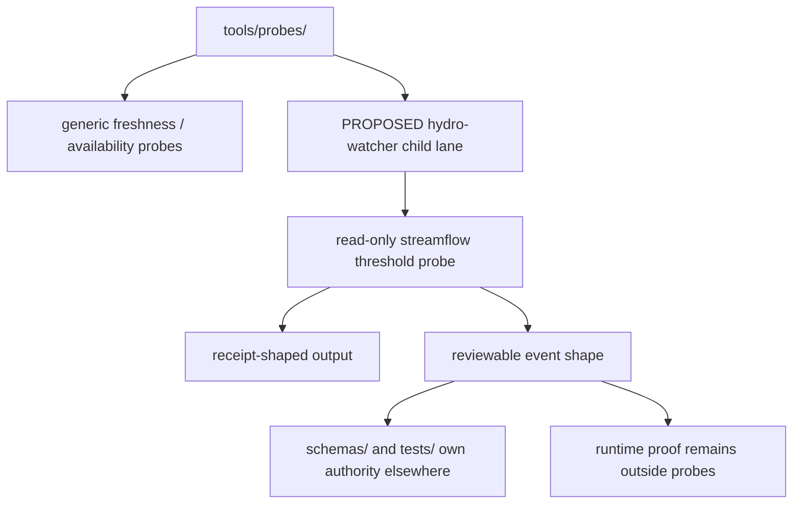

<!-- [KFM_META_BLOCK_V2]
doc_id: kfm://doc/NEEDS_VERIFICATION
title: probes
type: standard
version: v1
status: draft
owners: [@bartytime4life]
created: NEEDS-VERIFICATION
updated: 2026-04-18
policy_label: public
related: [../README.md, ../../README.md, ../../.github/README.md, ../../.github/CODEOWNERS, ../../.github/workflows/README.md, ../../.github/watchers/README.md, ../../scripts/README.md, ../../tests/README.md, ../../contracts/README.md, ../../schemas/README.md, ../../policy/README.md, ../../data/receipts/README.md, ../../data/proofs/README.md, ../validators/README.md, ../diff/README.md, ../catalog/README.md, ../ci/README.md, ../attest/README.md, ./hydro-watcher/README.md]
tags: [kfm, tools, probes, freshness, status, inspection, bounded-observation, receipts, proofs, hydrology]
notes: [Current public snapshot remains README-first unless executable probes are landed and verified in-tree. Updated to align this lane with watcher, receipt/proof, validator, diff, catalog, CI-renderer, attestation, and proposed hydrology child-lane boundaries. This revision keeps probe outputs aligned to the single central `data/receipts/` process-memory doctrine while preserving proof separation. doc_id and created date should be reconciled against authoritative repo history before publication.]
[/KFM_META_BLOCK_V2] -->

<a id="top"></a>

# `tools/probes/`

Bounded inspection, freshness, status, and read-only evidence helpers for Kansas Frontier Matrix.

<div align="left">


</div>

| Field | Value |
|---|---|
| **Status** | experimental |
| **Owners** | `@bartytime4life` *(current `/tools/` owner inherited from visible `CODEOWNERS` coverage; no narrower `/tools/probes/` rule directly verified)* |
| **Path** | `tools/probes/README.md` |
| **Repo fit** | child lane under [`../README.md`](../README.md); adjacent to [`../validators/README.md`](../validators/README.md), [`../diff/README.md`](../diff/README.md), [`../catalog/README.md`](../catalog/README.md), [`../ci/README.md`](../ci/README.md), and [`../attest/README.md`](../attest/README.md); downstream callers may live in [`../../scripts/README.md`](../../scripts/README.md) or [`../../.github/workflows/README.md`](../../.github/workflows/README.md); process-memory outputs should align to [`../../data/receipts/README.md`](../../data/receipts/README.md) while higher-order trust objects remain separate in [`../../data/proofs/README.md`](../../data/proofs/README.md) |
| **Evidence posture** | doctrine-grounded · repo-grounded for the current README-first lane shape plus broader public-tree context · exact executable probe inventory, workflow callers, and active-branch local usage remain bounded |
| **Current lane snapshot** | `tools/probes/` is still README-first on visible public `main` unless deeper branch evidence proves otherwise. This README therefore records the lane contract and careful landing patterns for future executable probes without overstating current inventory. |
| **Quick jumps** | [Scope](#scope) · [Repo fit](#repo-fit) · [Accepted inputs](#accepted-inputs) · [Exclusions](#exclusions) · [Current verified snapshot](#current-verified-snapshot) · [Directory tree](#directory-tree) · [Quickstart](#quickstart) · [Usage](#usage) · [Diagram](#diagram) · [Tables](#tables) · [Task list / definition of done](#task-list--definition-of-done) · [FAQ](#faq) · [Appendix](#appendix) |

> [!IMPORTANT]
> `tools/probes/` is for **bounded readers and reporters**.
>
> It is **not**:
>
> - a hidden publish lane
> - a policy source of truth
> - a schema home
> - a validator lane
> - a diff lane
> - a place to bury release-significant runtime behavior

> [!TIP]
> Keep the KFM trust split visible here:
>
> **probe output ≠ receipt authority ≠ proof authority ≠ policy decision ≠ promotion decision**
>
> - probes observe and report
> - receipts remain process memory
> - proofs remain higher-order trust objects
> - validators enforce declared rules
> - policy decides
> - workflows/scripts orchestrate
> - CI renderers summarize downstream results

> [!NOTE]
> This README is intentionally dual-purpose:
>
> 1. it records the **current public-tree reality** honestly  
> 2. it defines the **landing contract** for the first executable probes
>
> That means example probe names, child lanes, receipts, or CLI shapes below may be marked **PROPOSED** or **illustrative** until verified in-tree.

---

## Scope

`tools/probes/` is the KFM helper lane for small, explicit utilities whose main job is to **inspect**, **sample**, **measure**, **check freshness/materiality**, and **emit reviewable outputs** without quietly changing trust state.

Typical probe work includes:

- source or feed availability checks
- freshness and lag observation
- response-surface or field-presence checks
- checksum, count, timestamp, or href drift observation
- bounded trust-surface presence checks
- small read-only helpers that turn operational facts into machine-readable reports, summaries, or receipt-shaped process memory
- narrow domain probes whose logic remains observational even when the subject matter is specialized

### What belongs here

- reusable, read-mostly helpers that inspect systems or artifacts
- probe CLIs runnable locally, from `scripts/`, or from CI
- helpers that measure **freshness**, **availability**, **materiality**, **surface state**, or **boundary visibility**
- tools that emit stable reports, summaries, or process-memory receipts for downstream review
- observational trust-surface checks that preserve receipt/proof separation instead of flattening everything into one “artifact present” claim
- thin-slice domain probes when they still follow the same bounded-inspection contract

### What a probe should sound like

A probe is a strong fit when the main question sounds like:

- “Is this source reachable?”
- “How stale is this artifact?”
- “Did the visible shape drift?”
- “Did the upstream checksum, timestamp, or item set change?”
- “Is the outward trust surface present?”
- “Can we emit a bounded report another lane can validate, render, diff, or gate?”
- “Can we observe a narrow domain condition without making the release or policy decision here?”

### What a probe should not sound like

A probe is the wrong fit when the main question sounds like:

- “Should this be promoted?”
- “Is this valid under policy?”
- “What changed between these two canonicalized objects?”
- “Can we render this for reviewers?”
- “Can we sign or verify this trust object?”
- “Can we publish this now?”

Those questions belong in stronger or more specialized lanes.

### Truth labels used here

| Marker | Meaning |
|---|---|
| **CONFIRMED** | Supported by visible repo files or authoritative adjacent documentation |
| **INFERRED** | Strongly suggested by repo doctrine, but not proven as current implementation |
| **PROPOSED** | Target shape or recommended landing pattern |
| **UNKNOWN** | Not established strongly enough from current evidence |
| **NEEDS VERIFICATION** | Placeholder detail requiring direct repo history or active-branch inspection |

[Back to top](#top)

---

## Repo fit

**Path:** `tools/probes/README.md`  
**Role:** directory README for bounded inspection helpers inside the broader `tools/` surface.

| Direction | Surface | Why it matters |
|---|---|---|
| Parent | [`../README.md`](../README.md) | Family contract for `tools/` and helper-lane boundaries |
| Upstream | [`../../README.md`](../../README.md) | Root repo posture: governed, evidence-first, map-first, time-aware |
| Governance | [`../../.github/README.md`](../../.github/README.md) | Repository gatehouse and governance framing |
| Ownership | [`../../.github/CODEOWNERS`](../../.github/CODEOWNERS) | Grounds current visible owner coverage |
| Workflow boundary | [`../../.github/workflows/README.md`](../../.github/workflows/README.md) | Workflows may call probes, but should not be the only home of probe logic |
| Watcher boundary | [`../../.github/watchers/README.md`](../../.github/watchers/README.md) | Watcher lanes may emit process-memory facts or upstream observations that later probes inspect or summarize |
| Adjacent | [`../validators/README.md`](../validators/README.md) | Validators enforce declared rules; probes observe and report |
| Adjacent | [`../diff/README.md`](../diff/README.md) | Diff helpers compare canonicalized states; probes inspect live or bounded surfaces |
| Adjacent | [`../catalog/README.md`](../catalog/README.md) | Catalog QA and closure checks may consume probe outputs |
| Adjacent | [`../ci/README.md`](../ci/README.md) | CI renderers can present probe results without owning probe logic |
| Adjacent | [`../attest/README.md`](../attest/README.md) | Attestation helpers verify or assemble trust objects; probes may inspect their presence or freshness without verifying them |
| Orchestration | [`../../scripts/README.md`](../../scripts/README.md) | Scripts may call probes; reusable probe behavior should not be buried there |
| Proof | [`../../tests/README.md`](../../tests/README.md) | Probe behavior should be proven with fixtures and assertions |
| Authority | [`../../policy/README.md`](../../policy/README.md) | Policy decides; probes provide facts |
| Contracts | [`../../contracts/README.md`](../../contracts/README.md) | Contracts define shapes and trust objects; probes inspect, not own |
| Schemas | [`../../schemas/README.md`](../../schemas/README.md) | Schema-home authority stays outside this lane |
| Process memory | [`../../data/receipts/README.md`](../../data/receipts/README.md) | Probe outputs should land as receipt-shaped process memory under the central receipts doctrine |
| Trust storage | [`../../data/proofs/README.md`](../../data/proofs/README.md) | Probes may report on proof-bearing surfaces without becoming their authority |
| Proposed child lane | [`./hydro-watcher/README.md`](./hydro-watcher/README.md) | Example of a domain-specific probe surface that still remains bounded, read-only, and evidence-first | **PROPOSED** child lane |

### Working interpretation

Use this lane when the main job is:

> **observe → summarize → report**

Move out of this lane when the main job becomes:

> **decide → mutate → publish → own canonical truth**

### KFM boundary rule for probes

A probe may:

- inspect a source
- measure lag
- verify surface presence
- emit a receipt
- summarize an observation
- provide bounded machine-readable facts to stronger lanes

A probe should **not**:

- silently promote
- silently publish
- silently validate policy
- silently redefine schema authority
- silently sign or verify trust objects
- silently reclassify observational facts as release truth

### Domain thin slices are allowed, but still bounded

A specialized child lane under `tools/probes/` is a good fit only when the specialization does **not** override the probe contract.

That means a hydrology, catalog, or other domain-specific probe may exist here if it still behaves like a probe:

- read-only by default
- bounded in scope
- explicit about inputs
- explicit about outputs
- reviewable outside CI YAML
- clear about handoff to schemas, validators, policy, receipts, proofs, and runtime proof

[Back to top](#top)

---

## Accepted inputs

The following belong in or under `tools/probes/` when they remain bounded, observational, and reviewable:

- files, manifests, snapshots, catalogs, or exported artifacts needing bounded inspection
- endpoint URLs, feeds, APIs, or service surfaces needing freshness or status observation
- declared thresholds or tolerances used for reporting or gating support
- output paths for reports, summaries, receipts, or machine-readable probe artifacts
- minimal scoped credentials when authenticated inspection is genuinely required
- local shell, operator, or CI contexts that should run the same probe behavior deterministically
- receipt or proof refs when the probe question is observational rather than trust-decisional

### Strong-fit probe classes

| Probe class | Typical examples |
|---|---|
| Freshness probes | feed lag, dataset staleness, receipt age, release lag |
| Availability probes | endpoint reachable, asset exists, source responds |
| Surface-shape probes | field presence, response skeleton, item-count surface |
| Drift observers | checksum drift, timestamp drift, count drift, href drift |
| Trust-surface probes | evidence bundle members present, receipt visible, release refs reachable, proof refs present, attestation result visible |
| Domain threshold probes | narrow observational checks like seasonal-tail streamflow evaluation that still hand consequential decisions downstream |

### Example bounded inputs

- STAC collection or change-feed URL
- artifact path plus expected digest file
- release manifest plus outward proof references
- response payload plus expected field-presence checklist
- receipt directory plus freshness threshold
- proof directory plus presence expectations
- promotion bundle plus visibility checklist
- watcher-produced receipt or status artifact
- domain-specific identifiers such as a USGS site number plus an explicit comparison basis

### Input rules

1. Keep inputs explicit and caller-supplied where possible.
2. Prefer declared thresholds over hidden constants.
3. Keep credentials minimal, externally supplied, and reviewable in interface docs.
4. Prefer read-only inspection over convenience mutation.
5. If a probe touches receipt or proof refs, keep those roles explicit instead of flattening them into generic “artifact present” blobs.
6. If a probe applies domain thresholds, keep the governing baseline or threshold source explicit and keep any downstream consequential decision outside the helper unless another lane formally owns it.

[Back to top](#top)

---

## Exclusions

| Does **not** belong here | Put it in | Why |
|---|---|---|
| Long-running runtime code | app or package lanes | Probes are support helpers, not product runtime |
| Promotion or publication logic | `scripts/`, workflow/review lanes, or runtime surfaces | Probes may inform a decision but should not silently make it |
| Policy bundles or policy truth | [`../../policy/README.md`](../../policy/README.md) | Policy ownership stays sovereign |
| Contract ownership | [`../../contracts/README.md`](../../contracts/README.md) | Probes inspect declared shapes; they do not define them |
| Canonical schema-home decisions | [`../../schemas/README.md`](../../schemas/README.md) | Shape inspection is different from schema authority |
| Hidden workflow-only shell blobs | stable tool entrypoints | Probe behavior must be inspectable outside YAML |
| Broad orchestration | [`../../scripts/README.md`](../../scripts/README.md) | Scripts coordinate many steps; probes stay narrow |
| Generic QA assertion inventory | [`../../tests/README.md`](../../tests/README.md) | Tests prove behavior; probes generate observations |
| Stable state comparison logic | `tools/diff/` | Comparing two canonicalized states is a different concern |
| Reviewer summary formatting | `tools/ci/` | Probes should emit data that renderers can consume |
| Signature generation or verification | `tools/attest/` | Probes may inspect trust-surface presence, not verify trust state |
| Receipt or proof storage authority | `../../data/receipts/`, `../../data/proofs/` | Probes may emit process-memory observations or inspect refs, not become sovereign storage |
| Release-bearing hydrology alert publication | pipeline, runtime API, or governed review surface | Even a hydrology watcher child lane here remains probe-first, not public-alert authority |

> [!CAUTION]
> A probe may write a caller-chosen report file or receipt-shaped output, but it should not directly mutate canonical truth, publish artifacts, approve promotion, or bypass governed review as its primary job.

[Back to top](#top)

---

## Current verified snapshot

| Evidence item | Status | Why it matters |
|---|---|---|
| `tools/probes/README.md` exists | **CONFIRMED** | This lane is real in the public tree |
| The visible public subtree is README-first | **CONFIRMED** | Prevents overclaiming executable inventory |
| The current README is already substantive | **CONFIRMED** | This file should be revised upward, not reset to generic scaffold text |
| The visible `tools/` family includes `attest/`, `catalog/`, `ci/`, `diff/`, `docs/`, `probes/`, and `validators/` | **CONFIRMED** | Grounds sibling references and lane context |
| `/tools/` ownership is covered by visible `CODEOWNERS` | **CONFIRMED** | Supports the ownership line above |
| Adjacent lane docs already describe validator, diff, catalog, CI, and attestation boundaries | **CONFIRMED** | Strengthens clean handoff expectations |
| `.github/watchers/README.md` now exists as a public watcher-boundary surface | **CONFIRMED** | Probes can now be described more cleanly relative to watcher-produced process memory |
| Adjacent docs now explicitly distinguish receipts from proofs and rendering from authority surfaces | **CONFIRMED in-session doctrine alignment** | This lane should now be clearer about process memory vs. proof storage vs. observational output |
| A hydrology child-lane README is being prepared as a probe-first watcher surface | **PROPOSED** | Parent lane documentation should be able to acknowledge that landing shape without claiming it is merged |
| Exact workflow callers or non-public runtime usage of probes | **UNKNOWN** | Not derivable from visible tree inspection alone |
| Any landed executable probe under `tools/probes/` on non-public branches | **UNKNOWN** | Requires active-branch or deeper checkout verification |

---

## Directory tree

### Current public subtree

```text
tools/probes/
└── README.md
```

### Confirmed parent family context

```text
tools/
├── attest/
├── catalog/
├── ci/
├── diff/
├── docs/
├── probes/
├── validators/
└── README.md
```

> [!WARNING]
> Everything below is a **PROPOSED landing shape**, not a statement that the current public subtree is already populated.

### Minimal first-probe landing

```text
tools/probes/
├── README.md
└── <domain>_<question>_probe.py
```

### Example STAC-oriented landing

```text
tools/probes/
├── README.md
└── stac_change_runner.py
```

### Example domain-child landing

```text
tools/probes/
├── README.md
└── hydro-watcher/
    ├── README.md
    └── streamflow_probe.py
```

### Expected data-side outputs for receipt-oriented probes

```text
data/
├── work/
│   ├── meta/
│   └── raw/
└── receipts/
    └── probes/
```

> [!TIP]
> `stac_change_runner.py` is a strong **PROPOSED** first executable fit for this lane because it observes upstream STAC materiality, persists raw payloads, and emits receipt-shaped process memory without becoming a publish or policy surface.

> [!TIP]
> A hydrology child lane such as `hydro-watcher/` is also a plausible fit **only if** it remains clearly probe-first and keeps schema, policy, public-alert, and runtime-proof authority outside this lane.

[Back to top](#top)

---

## Quickstart

Run these checks before adding or moving anything under `tools/probes/`.

### 1. Confirm the live tree

```bash
tree -a -L 2 tools/probes 2>/dev/null || find tools/probes -maxdepth 2 \( -type f -o -type d \) 2>/dev/null | sort
```

### 2. Recheck family doctrine and ownership

```bash
sed -n '1,260p' tools/README.md 2>/dev/null
sed -n '1,180p' .github/CODEOWNERS 2>/dev/null
```

### 3. Recheck adjacent boundary docs

```bash
sed -n '1,260p' .github/workflows/README.md 2>/dev/null
sed -n '1,260p' .github/watchers/README.md 2>/dev/null
sed -n '1,240p' scripts/README.md 2>/dev/null
sed -n '1,240p' tests/README.md 2>/dev/null
sed -n '1,240p' policy/README.md 2>/dev/null
sed -n '1,240p' contracts/README.md 2>/dev/null
sed -n '1,240p' schemas/README.md 2>/dev/null
sed -n '1,240p' data/receipts/README.md 2>/dev/null
sed -n '1,240p' data/proofs/README.md 2>/dev/null
sed -n '1,240p' tools/catalog/README.md 2>/dev/null
sed -n '1,240p' tools/ci/README.md 2>/dev/null
sed -n '1,240p' tools/validators/README.md 2>/dev/null
sed -n '1,240p' tools/attest/README.md 2>/dev/null
```

### 4. Search for existing caller and naming patterns

```bash
rg -n "tools/probes|_probe|run_receipt|freshness|availability|materiality|stale|drift|proof_ref|receipt_ref|data/receipts/probes|hydro-watcher|streamflow_probe" \
  README.md .github docs scripts tests tools data -S 2>/dev/null
```

### 5. If adding the first executable probe, prove the lane stays narrow

```bash
find tools/probes -maxdepth 3 -type f \( -name "*.py" -o -name "*.sh" -o -name "*.mjs" -o -name "*.ts" \) 2>/dev/null | sort
```

### 6. If adding a child-lane README, keep the parent index truthful

```bash
sed -n '1,260p' tools/probes/README.md 2>/dev/null
sed -n '1,260p' tools/probes/hydro-watcher/README.md 2>/dev/null
```

---

## Usage

### Design rules for executable probes

1. Start with **one narrow question**
2. Stay **read-only by default**
3. Emit a **stable report or receipt**
4. Keep the entrypoint runnable **outside CI**
5. Document caller surfaces here
6. Add representative **positive and negative-path tests**
7. Keep receipt/proof roles explicit when they appear

### Entry-point expectations

- prefer one clear CLI entrypoint per probe
- keep exit codes deterministic
- stamp `checked_at` and, when relevant, observed source freshness basis
- keep secrets minimal and externally injected
- avoid hidden retries that erase evidence of degradation
- keep policy, contract, and schema authority outside the helper
- if the output is a receipt, keep it clearly process-memory shaped rather than proof-shaped

### Illustrative invocation

The example below is **illustrative** until verified in-tree.

```bash
SOURCE_URL=https://example.com/stac/collections/foo \
WORK_DIR=./data \
python3 tools/probes/stac_change_runner.py
```

### Illustrative domain-child invocation

The example below is also **illustrative** until verified in-tree.

```bash
python3 tools/probes/hydro-watcher/streamflow_probe.py \
  --site 06887500 \
  --comid 12345678
```

### Illustrative bounded receipt shape

This is an example output shape, not a settled repo contract.

```json
{
  "source": "https://example.com/stac/collections/foo",
  "collection": "foo",
  "fetch_ts": "2026-04-16T02:40:31Z",
  "etag": "\"abc123\"",
  "last_modified": "Wed, 15 Apr 2026 23:59:59 GMT",
  "spec_hash": "b2e7...",
  "changed_items": ["item-001", "item-042"],
  "transport_status": 200
}
```

### Illustrative domain-threshold event shape

This is a **PROPOSED** shape for a thin-slice hydrology probe output, not a settled lane contract.

```json
{
  "site_no": "06887500",
  "permanent_id": null,
  "comid": 12345678,
  "doy": 93,
  "obs_cfs": 41.2,
  "p5_cfs": 55.0,
  "p95_cfs": 481.0,
  "rolling_7d_mean_cfs": 44.9,
  "status": "low",
  "alert_class": "seasonal_low_tail",
  "breach_days": 3,
  "join_resolution_reason": "fallback_comid",
  "baseline_kind": "day_of_year_percentile",
  "event_content_hash": "sha256:NEEDS_VERIFICATION"
}
```

### Healthy handoff model

A good probe usually hands off to a stronger lane:

- `tools/validators/` when observation becomes rule enforcement
- `tools/diff/` when the task becomes stable-state comparison
- `tools/catalog/` when the task becomes catalog closure QA
- `tools/ci/` when machine-readable output needs reviewer rendering
- `policy/` when allow/deny/obligation decisions must be made
- `data/receipts/` when process-memory artifacts need durable placement
- `data/proofs/` only when a stronger lane, not the probe itself, owns those authoritative trust surfaces
- `tests/e2e/runtime_proof/` when request-time finite outcomes and outward trust cues must be proven

### Probe-output rule

A probe output can be important without being sovereign.

That means:

- a probe report may be review-significant
- a probe receipt may be useful evidence
- a probe summary may feed a gate
- a narrow domain event may support review
- but none of those automatically become policy law, proof-pack truth, runtime proof authority, or release authority

[Back to top](#top)

---

## Diagram



### Example child-lane relationship



[Back to top](#top)

---

## Tables

### Boundary map

| Surface | Primary job | Probe handoff rule |
|---|---|---|
| `tools/probes/` | Inspect and report bounded operational facts | Keep the question narrow and the output reviewable |
| `tools/validators/` | Assert rule or shape conformance | Move here when the main task becomes pass/fail validation |
| `tools/diff/` | Compare stable states or artifacts | Move here when the main task is deterministic comparison |
| `tools/catalog/` | Catalog QA and closure helpers | Use when STAC/DCAT/PROV closure is the main concern |
| `tools/ci/` | Reviewer-facing summaries and annotations | Use when stable probe output already exists and needs rendering |
| `tools/attest/` | Trust-object verification and support bundles | Use when attestation or proof verification is the main job |
| `scripts/` | Orchestrate repeatable multi-step work | A script may call a probe; the probe should remain reusable alone |
| `policy/` | Own decision rules | A probe supplies evidence; policy decides |
| `contracts/` | Own machine-readable trust objects | A probe may inspect them, not define them |
| `schemas/` | Hold schema-home boundary documentation | A probe may inspect shape, not settle authority |
| `tests/` | Prove behavior with fixtures and assertions | Every material probe should be exercised here |
| `tests/e2e/runtime_proof/` | Prove request-time finite outward outcomes | Probe outputs may feed this leaf, but the proof burden does not live in `tools/probes/` |
| `.github/workflows/` | CI/CD automation | Workflows call probes; they should not become the only implementation surface |
| `data/receipts/` | Governed process-memory storage | Good fit for probe-emitted receipt-shaped outputs |
| `data/proofs/` | Governed proof storage | Probes may inspect or reference, but should not become this lane |

### Probe behavior contract

| Concern | Working rule | Why |
|---|---|---|
| Mutation | Read-only by default | Preserves the trust membrane |
| Output | Emit stable, reviewable reports or receipts | Humans and CI should inspect the same result |
| Exit behavior | Clear non-zero exits for blocking failures | Callers should not guess what happened |
| Freshness/time | Include `checked_at` or equivalent timing basis | Supports stale/materiality review |
| Secrets | Use least-privilege externally supplied credentials only when required | Keeps probe runs safer and reviewable |
| Callers | Stay runnable locally, from scripts, and from workflows | Avoids YAML-only logic |
| Tests | Add representative positive and negative-path fixtures | KFM verification includes failure paths |
| Docs | Update this README when lane behavior changes materially | Keeps documentary surfaces honest |
| Authority | Never become the canonical owner of policy, contracts, receipts, proofs, runtime proof, or schema decisions | Prevents helper-code drift into sovereign truth |

### Probe class matrix

| Probe class | Typical question | Example outputs |
|---|---|---|
| Freshness probe | How stale is this source or artifact? | lag report, observed timestamp, threshold result |
| Availability probe | Is this endpoint or artifact reachable? | reachable/unreachable result, transport notes |
| Surface-shape probe | Did the visible response or file shape drift? | field presence report, structure summary |
| Drift probe | Did checksum, timestamp, count, or href set change? | observed drift summary, prior/current values |
| Trust-surface probe | Are expected outward or supporting artifacts present? | missing artifact report, presence matrix |
| Receipt/proof visibility probe | Are process-memory and proof-bearing refs both present and distinguishable? | explicit receipt/proof visibility summary |
| Domain threshold probe | Is a narrow domain condition observable against an explicit threshold or baseline? | bounded event object, threshold summary, abstain/no-change report |

[Back to top](#top)

---

## Task list / Definition of done

- [ ] Live tree rechecked before merge
- [ ] Any first executable probe is documented here as **CONFIRMED** or **PROPOSED** appropriately
- [ ] Probe entrypoint stays narrow, read-mostly, and reviewable
- [ ] No direct canonical write, publish, or promote path is introduced
- [ ] Caller surfaces are documented
- [ ] Representative test coverage lands with the probe
- [ ] Output format and exit behavior are stable enough for local and CI use
- [ ] Adjacent boundary docs remain in sync if schema-, contract-, policy-, receipt-, proof-, or runtime-proof-facing assumptions change
- [ ] Unknowns remain visible instead of being smoothed into implementation claims
- [ ] If a probe begins to enforce rules rather than observe facts, it is moved or split into a stronger lane
- [ ] If a probe starts to emit trust-bearing artifacts, receipt/proof/process-memory boundaries stay explicit
- [ ] If `hydro-watcher/` lands, this parent README indexes it without overstating merge status

---

## FAQ

### Are probes the same as validators?

No. A validator primarily proves a declared rule or shape. A probe primarily inspects a bounded surface and emits observations another lane can review, render, diff, or gate.

### Can a probe publish data or promote a release?

Not as its primary job. A probe may inform a governed decision, but promotion, publication, and trust-state changes belong elsewhere.

### Does this README claim executable probes already exist here?

No. The current visible public subtree is README-first unless executable files are separately verified in-tree.

### Can a domain-specific child lane still belong under `tools/probes/`?

Yes, but only if it still behaves like a probe. Specialization does not relax the lane boundary. A hydrology watcher here is acceptable only if it stays read-only, bounded, reviewable, and explicit about downstream handoff.

### Where should fixtures live?

Prefer [`../../tests/`](../../tests/) for representative fixtures and assertions. Keep helper-local samples tiny and safe if they exist at all.

### Should workflow YAML contain the only copy of probe logic?

No. Workflows may call probes, but executable behavior should remain inspectable as stable entrypoints under `tools/probes/`.

### Do probes decide schema or policy authority?

No. Probes may inspect those surfaces, but canonical ownership remains with the explicitly governed lanes that already document those responsibilities.

### Can probes help promotion review?

Yes, especially around freshness, availability, and visible trust-surface state. They should report those facts, not convert them into release law.

### Why mention receipts, proofs, and runtime proof here?

Because observational helpers are a common place for trust-state flattening to creep in. Keeping receipts, proofs, and runtime proof explicitly separate prevents a convenience report from masquerading as a stronger trust object.

---

## Appendix

<details>
<summary><strong>PROPOSED landing rubric for the first executable probe</strong></summary>

### Minimal rubric

1. Pick one question:
   - freshness
   - availability
   - checksum drift
   - surface-shape drift
   - bounded materiality check
   - narrow domain threshold observation

2. Name the entrypoint clearly:

```text
<domain>_<question>_probe.py
```

3. Keep output stable:
   - one report
   - one clear status
   - one clear failure path

4. Add proof in the same change:
   - README update
   - representative test coverage
   - caller documentation

5. Keep boundaries sharp:
   - no hidden promotion logic
   - no policy ownership
   - no silent canonical writes
   - no schema-home arbitration by convenience
   - no receipt/proof flattening by convenience
   - no runtime-proof authority by convenience

### Example first-probe candidates

A STAC materiality watcher such as:

```text
tools/probes/stac_change_runner.py
```

is a strong fit **if** it remains:

- read-only with respect to upstreams
- deterministic in its spec-hash and change detection
- explicit about outputs under `data/work/` and `data/receipts/probes/`
- fail-closed only through external validator or policy callers

A hydrology child lane such as:

```text
tools/probes/hydro-watcher/streamflow_probe.py
```

is a strong fit **if** it remains:

- observational rather than publish-bearing
- explicit about approved baseline source and persistence rules
- clear that schema authority lives outside `tools/probes/`
- clear that runtime proof lives under `tests/e2e/runtime_proof/`
- explicit that downstream policy or public-alert authority is elsewhere

</details>

<details>
<summary><strong>Illustrative trust-surface probe output</strong></summary>

```json
{
  "probe": "promotion_bundle_visibility",
  "checked_at": "2026-04-16T00:00:00Z",
  "target": "promotion-bundle.json",
  "status": "warn",
  "summary": "bundle present but verification result missing",
  "observations": [
    {
      "id": "decision_present",
      "result": "pass"
    },
    {
      "id": "verify_result_present",
      "result": "warn"
    }
  ],
  "artifacts": [
    "promotion-bundle.json"
  ]
}
```

This kind of helper belongs here only if it remains observational and does not decide whether promotion should proceed.

</details>

<details>
<summary><strong>Illustrative STAC change receipt</strong></summary>

```json
{
  "source": "https://example.com/stac/collections/foo",
  "collection": "foo",
  "fetch_ts": "2026-04-16T02:40:31Z",
  "etag": "\"abc123\"",
  "last_modified": "Wed, 15 Apr 2026 23:59:59 GMT",
  "spec_hash": "b2e7...",
  "changed_items": [
    "item-001",
    "item-042"
  ],
  "transport_status": 200
}
```

This belongs in the probes lane only while it is still **process memory and observation**, not proof-pack authority or release law.

</details>

<details>
<summary><strong>Illustrative hydrology probe event</strong></summary>

```json
{
  "site_no": "06887500",
  "permanent_id": null,
  "comid": 12345678,
  "doy": 93,
  "obs_cfs": 41.2,
  "p5_cfs": 55.0,
  "p50_cfs": 210.0,
  "p95_cfs": 481.0,
  "rolling_7d_mean_cfs": 44.9,
  "rolling_30d_mean_cfs": 61.2,
  "status": "low",
  "alert_class": "seasonal_low_tail",
  "breach_days": 3,
  "join_resolution_reason": "fallback_comid",
  "decision": "ANSWER",
  "reason": "sustained percentile breach",
  "baseline_kind": "day_of_year_percentile",
  "event_content_hash": "sha256:NEEDS_VERIFICATION"
}
```

This kind of output can fit in `tools/probes/` only while it remains a bounded observational result that hands schema authority, proof burden, and downstream release authority elsewhere.

</details>

[Back to top](#top)
