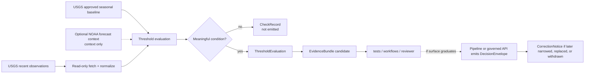

<!-- [KFM_META_BLOCK_V2]
doc_id: kfm://doc/NEEDS-UUID
title: Hydrologic Threshold Watcher
type: standard
version: v1
status: draft
owners: @bartytime4life
created: 2026-04-11
updated: 2026-04-11
policy_label: public
related: [tools/probes/README.md, .github/watchers/README.md, docs/domains/hydrology/README.md, docs/domains/hydrology/usgs-tail-alerts-schema.md, pipelines/wbd-huc12-watcher/README.md]
tags: [kfm, hydrology, probes, usgs, thresholds]
notes: [Draft child-lane README. Exact child-lane path, narrower ownership, and any NOAA forecast role remain review-bearing.]
[/KFM_META_BLOCK_V2] -->

# Hydrologic Threshold Watcher

Bounded child-lane README for a read-only hydrology threshold probe that evaluates recent water conditions, packages evidence, and hands consequential downstream emission off to governed review surfaces.

> **Status:** draft child lane · experimental surface  
> **Owners:** `@bartytime4life` *(inherits current `/tools/` owner coverage; narrower child-lane ownership NEEDS VERIFICATION)*  
> **Path:** `tools/probes/hydro-watcher/README.md` *(PROPOSED child lane under the checked-in `tools/probes/` surface)*  
> **Repo fit:** parent [`../README.md`](../README.md) · root [`../../README.md`](../../README.md) · gatehouse [`../../.github/README.md`](../../.github/README.md) · watcher doctrine [`../../.github/watchers/README.md`](../../.github/watchers/README.md) · hydrology lane [`../../docs/domains/hydrology/README.md`](../../docs/domains/hydrology/README.md) · seasonal tail standard [`../../docs/domains/hydrology/usgs-tail-alerts-schema.md`](../../docs/domains/hydrology/usgs-tail-alerts-schema.md) · comparable watcher lane [`../../pipelines/wbd-huc12-watcher/README.md`](../../pipelines/wbd-huc12-watcher/README.md) · downstream proof surfaces [`../../tests/README.md`](../../tests/README.md), [`../../policy/README.md`](../../policy/README.md), [`../../contracts/README.md`](../../contracts/README.md), [`../../schemas/README.md`](../../schemas/README.md)  
>        
> **Quick jumps:** [Scope](#scope) · [Repo fit](#repo-fit) · [Accepted inputs](#accepted-inputs) · [Exclusions](#exclusions) · [Directory tree](#directory-tree) · [Quickstart](#quickstart) · [Usage](#usage) · [Diagram](#diagram) · [Tables](#tables) · [Task list](#task-list--definition-of-done) · [FAQ](#faq) · [Appendix](#appendix)

> [!IMPORTANT]
> In `tools/probes/`, this surface must stay the bounded inspection half of a watcher pattern. It may fetch, normalize, compare, and emit reviewable reports or proof candidates, but it must not silently become a public alerting lane, a policy source-of-truth, or a direct publication surface.

> [!NOTE]
> This README is deliberately split between **CONFIRMED** parent-lane doctrine and **PROPOSED** child-lane packaging. If this child lane lands, update [`../README.md`](../README.md) in the same governed review stream so the parent subtree and landing-shape language remain truthful.

## Scope

`tools/probes/hydro-watcher/` is the narrow hydrology-probe surface for threshold-oriented observation around Kansas-relevant water conditions.

Use this child lane when the primary job is to:

- fetch recent hydrologic observations from an authoritative source
- compare them against declared direct thresholds or approved seasonal baselines
- keep recency, qualifiers, persistence, and hysteresis visible
- emit a stable, reviewable record that another lane can test, approve, suppress, or promote

Use some other owner surface when the primary job becomes:

- long-running scheduler ownership
- public alert publication
- canonical rule ownership
- direct release or promotion
- silent mutation of accepted baseline state

### Truth labels used here

| Label | Use here |
| --- | --- |
| **CONFIRMED** | Supported by checked-in repo docs or the attached KFM doctrine corpus |
| **INFERRED** | Conservative completion that fits repo doctrine but is not directly proven as checked-in subtree reality |
| **PROPOSED** | Recommended child-lane structure, commands, or report shapes not yet proven as present on the reviewed branch |
| **UNKNOWN** | Not verified strongly enough to present as settled repo or runtime fact |
| **NEEDS VERIFICATION** | Concrete detail to confirm before merge, caller wiring, or behavior-bearing claims |

[Back to top](#hydrologic-threshold-watcher)

## Repo fit

| Surface | Path | Why it matters here | Status |
| --- | --- | --- | --- |
| Parent probe contract | [`../README.md`](../README.md) | Defines `tools/probes/` as a read-only helper lane for bounded inspection and stable reports | **CONFIRMED** |
| Root posture | [`../../README.md`](../../README.md) | Anchors KFM as governed, evidence-first, map-first, and time-aware | **CONFIRMED** |
| Gatehouse doctrine | [`../../.github/README.md`](../../.github/README.md) | Keeps trust-boundary claims evidence-bounded and review-bearing | **CONFIRMED** |
| Watcher doctrine | [`../../.github/watchers/README.md`](../../.github/watchers/README.md) | Frames emit-only watcher behavior and warns against treating docs-only watcher surfaces as runtime proof | **CONFIRMED** |
| Hydrology lane boundary | [`../../docs/domains/hydrology/README.md`](../../docs/domains/hydrology/README.md) | Defines what belongs in hydrology and keeps publication burdens visible | **CONFIRMED** |
| Seasonal tail standard | [`../../docs/domains/hydrology/usgs-tail-alerts-schema.md`](../../docs/domains/hydrology/usgs-tail-alerts-schema.md) | Supplies the strongest checked-in rule set for percentile-based hydrologic alert logic and abstention behavior | **CONFIRMED** |
| Comparable watcher lane | [`../../pipelines/wbd-huc12-watcher/README.md`](../../pipelines/wbd-huc12-watcher/README.md) | Shows how KFM currently documents a watcher-oriented hydrology slice when the surface is execution-bearing rather than probe-only | **CONFIRMED** |
| Tests / policy / contracts / schemas | [`../../tests/README.md`](../../tests/README.md), [`../../policy/README.md`](../../policy/README.md), [`../../contracts/README.md`](../../contracts/README.md), [`../../schemas/README.md`](../../schemas/README.md) | Hold proof, gate, and shape authority that this child lane must not quietly absorb | **CONFIRMED** as adjacent surfaces |
| This child lane | `tools/probes/hydro-watcher/README.md` | Proposed dedicated hydrology probe surface for threshold evaluation and evidence handoff | **PROPOSED** |

### Working interpretation

Inside `tools/probes/`, a hydrologic threshold watcher should be understood as a **probe-first** surface:

- it may produce a `CheckRecord` or a `ThresholdEvaluation`
- it may assemble an `EvidenceBundle` candidate when the finding is consequential
- it should defer any release-bearing `DecisionEnvelope` emission to a better-owner surface unless and until the lane graduates with explicit policy, tests, and runtime proof

[Back to top](#hydrologic-threshold-watcher)

## Accepted inputs

| Input class | Examples | Why it belongs here | Status |
| --- | --- | --- | --- |
| Source identifiers | `site_id`, `parameter_code`, optional watershed or station context | Stable probe targeting and report labeling | **CONFIRMED** concept |
| Authoritative recent observations | USGS IV / DV observations for stage, discharge, groundwater, reservoir context | Primary candidate values for threshold evaluation | **CONFIRMED** |
| Approved seasonal baseline | USGS day-of-year percentile statistics and related approval metadata | Governing comparison basis for seasonal tail mode | **CONFIRMED** |
| Threshold configuration | direct stage or discharge thresholds, percentile thresholds, recency limit, persistence minimum, hysteresis rules | Makes comparison logic explicit instead of implicit | **PROPOSED** exact child-lane file shape |
| Qualifier and suppression context | ice, estimated, equipment, stale, or other caution states | Supports visible `ABSTAIN`, `DENY`, or hold behavior | **INFERRED** / **PROPOSED** implementation detail |
| Optional contextual enrichers | NOAA forecast context, watershed joins, nearby-gage context | Helpful for review summaries, but must not outrank governing observation/baseline evidence | **PROPOSED** |
| Output targets | report JSON, receipt path, review artifact directory | Keeps probe behavior inspectable outside CI YAML | **CONFIRMED** pattern |

### Threshold families that fit this lane

| Threshold family | Governing source role | Good fit here? | Reading posture |
| --- | --- | --- | --- |
| Direct operating threshold | explicit site/parameter threshold declared in config or reviewed registry | Yes | **PROPOSED** child-lane config |
| Seasonal tail threshold | approved USGS day-of-year percentile baseline | Yes | **CONFIRMED** standard, **PROPOSED** child-lane implementation |
| Forecast-context threshold | NOAA stage or forecast context | Context only | **PROPOSED** and **NEEDS VERIFICATION** before it drives consequential outcomes |

## Exclusions

| Does not belong here as settled behavior | Why | Put it in instead |
| --- | --- | --- |
| Direct public alert publication | `tools/probes/` is a bounded inspection lane, not a release authority | pipeline, governed API, or reviewed release surfaces |
| Canonical threshold policy ownership | This child lane may apply reviewed rules, but it must not become their sovereign home | [`../../policy/README.md`](../../policy/README.md), [`../../contracts/README.md`](../../contracts/README.md), [`../../schemas/README.md`](../../schemas/README.md) |
| Hidden baseline mutation | Accepted comparison state should remain visible and reviewable | pipeline or catalog/review plane with receipts and correction lineage |
| Unverified scheduler or workflow claims | Current public gatehouse docs remain cautious about watcher-runtime certainty | checked-in workflow or runtime owner surface once visible |
| NOAA-only causality | Forecast context is not a substitute for authoritative observation plus approved baseline | reviewer-facing context only unless later standardized |
| Sensitive or private coordinate dumps | Public tooling should stay safe to clone and review | steward-only data or tightly scoped test fixtures |

> [!CAUTION]
> If this surface needs to own long-running schedules, direct outward `DecisionEnvelope` emission, or release-bearing catalog writes, it has outgrown the safe `tools/probes/` contract. Graduate the owner surface instead of stretching the probe lane until it quietly becomes runtime.

## Directory tree

### Confirmed parent context

```text
tools/
└── probes/
    └── README.md
```

### Proposed child-lane landing shape

```text
tools/
└── probes/
    ├── README.md
    └── hydro-watcher/
        ├── README.md
        ├── hydro_threshold_probe.py
        ├── thresholds.example.yaml
        └── ../../tests/tools/probes/hydro_watcher/
```

> [!WARNING]
> The tree above is a starter shape, not current public-branch proof. Keep the child path, entrypoint name, and test location synchronized with the exact branch under review.

[Back to top](#hydrologic-threshold-watcher)

## Quickstart

There is no checked-in runnable child-lane entrypoint verified from the current public tree. The safe quickstart is inspection-first.

1. Recheck the parent probe contract and adjacent hydrology doctrine.

```bash
sed -n '1,260p' tools/probes/README.md
sed -n '1,260p' .github/watchers/README.md
sed -n '1,260p' docs/domains/hydrology/README.md
sed -n '1,260p' docs/domains/hydrology/usgs-tail-alerts-schema.md
```

2. Verify the exact branch inventory before claiming commands or files.

```bash
find tools/probes -maxdepth 3 -type f | sort
```

3. Search for overlapping threshold, NWIS, or watcher logic before inventing a new entrypoint.

```bash
rg -n "tail alert|threshold|nwis|usgs|DecisionEnvelope|EvidenceBundle|CheckRecord" \
  .github docs pipelines policy contracts schemas tests tools -S
```

4. Only after the child-lane files are actually checked in, run the entrypoint from the reviewed branch.

```bash
python tools/probes/hydro-watcher/hydro_threshold_probe.py \
  --config tools/probes/hydro-watcher/thresholds.example.yaml \
  --out out/hydro-threshold-report.json
```

> [!TIP]
> The final command is intentionally a target-shape example. Keep it out of merge-ready docs unless the exact file path and CLI flags exist on the branch being reviewed.

## Usage

### What a good run should do

1. Fetch recent authoritative hydrologic observations for a configured site and parameter.
2. Resolve the correct comparison basis:
   - direct threshold mode, or
   - seasonal tail mode using approved day-of-year percentile context.
3. Apply recency, qualifier, persistence, and hysteresis gates before any consequential conclusion.
4. Emit a stable, reviewable output that makes the negative path visible rather than silently disappearing.
5. Hand consequential downstream emission off to a better-owner surface if needed.

### Lane-local output model

| Output | Why it belongs here | Status |
| --- | --- | --- |
| `CheckRecord` | Makes no-change or non-emit checks visible | **PROPOSED** contract stub |
| `ThresholdEvaluation` | Keeps comparison logic machine-checkable | **PROPOSED** contract stub |
| `EvidenceRef` | Gives review flows a stable pointer to proof payloads | **PROPOSED** contract stub |
| `EvidenceBundle` candidate | Packages consequential evidence for downstream review | **PROPOSED** contract stub |
| `DecisionEnvelope` | Useful if this logic graduates into a watcher/pipeline owner surface | **PROPOSED downstream** |
| `CorrectionNotice` | Preserves supersession and narrowing if downstream emissions are later corrected | **PROPOSED downstream** |

### Conservative operating defaults

| Setting | Suggested default | Why | Status |
| --- | ---: | --- | --- |
| Recency limit | `96h` | Avoid stale current-value claims | **PROPOSED**, but aligned to checked-in tail-alert guidance |
| Persistence minimum | `3` consecutive readings | Reduces noisy single-point excursions | **PROPOSED** |
| Low seasonal tail | `p05` | Conservative unusual-low trigger | **PROPOSED** |
| High seasonal tail | `p95` | Conservative unusual-high trigger | **PROPOSED** |
| Missing approved baseline | `ABSTAIN` | Trust-preserving negative state | **CONFIRMED** doctrine |
| Hysteresis clear threshold | less severe than trigger threshold | Prevents rapid flip-flop near boundary | **PROPOSED** |

> [!IMPORTANT]
> Seasonal tail mode should not emit a consequential finding when the approved baseline is missing, stale, unresolved, or not quality-assured. The correct KFM move is visible abstention, not an improvised comparison.

## Diagram



## Tables

### Source-role discipline

| Source family | Lane role | Must not be mistaken for |
| --- | --- | --- |
| USGS recent observations | candidate condition source | approved historical baseline |
| USGS approved daily or statistical history | governing seasonal comparison basis | forecast or contextual enrichment |
| NOAA forecast context | contextual enrichment for review | authoritative trigger source |
| Local joins such as HUC or nearby-gage context | explanatory context | canonical threshold truth |

### Outcome reading

| Outcome | Meaning here | Default lane action |
| --- | --- | --- |
| `ANSWER` | Threshold condition supported strongly enough for a consequential handoff | write evidence candidate and surface for downstream review |
| `ABSTAIN` | Trustworthy basis missing or insufficient | emit visible non-emit record |
| `DENY` | Policy or reviewed suppression rule blocks emission | emit visible non-emit record |
| `ERROR` | Execution failure prevented evaluation | fail clearly and preserve run evidence |

[Back to top](#hydrologic-threshold-watcher)

## Task list / definition of done

- [ ] Confirm whether this child lane should exist under `tools/probes/` or graduate immediately to a pipeline/watcher owner surface.
- [ ] Update [`../README.md`](../README.md) so the parent subtree and landing-shape language stay accurate if this child lane lands.
- [ ] Check in one explicit entrypoint and one example config before keeping runnable commands in this README.
- [ ] Prove `CheckRecord` and `ThresholdEvaluation` fixtures in [`../../tests/README.md`](../../tests/README.md) or a clearly linked child test surface.
- [ ] Encode no-baseline -> `ABSTAIN`, stale-observation -> `ABSTAIN`, qualifier suppression -> `DENY` or hold, and hysteresis/persistence behavior as explicit tests.
- [ ] Decide whether any `DecisionEnvelope` output remains strictly downstream.
- [ ] Keep NOAA context clearly labeled as optional context unless a reviewed source-role rule says otherwise.

### Definition of done

This README is in a healthy merge-ready state when:

- the child path and adjacent links match the exact reviewed branch
- the parent probe README no longer contradicts the child-lane tree
- no command implies a file or workflow that is not checked in
- the lane stays read-only and evidence-first
- threshold logic distinguishes direct thresholds from seasonal approved-baseline logic
- negative states remain first-class and visible
- downstream release-bearing behavior is either linked to a real owner surface or explicitly left out

## FAQ

### Why not publish alerts directly from `tools/probes/`?

Because the checked-in `tools/probes/` contract is for bounded inspection and stable reporting, not for hidden trust-state mutation or public release behavior.

### Why does missing baseline data lead to `ABSTAIN` instead of “best effort”?

Because the checked-in hydrology alert standard treats approved seasonal baselines as governing comparison evidence. Without that basis, a confident alert would overclaim.

### Why keep NOAA context optional and secondary?

Because current hydrology repo docs ground threshold causality in authoritative observations and approved historical baselines. Forecast context can help reviewers, but it should not outrank the primary evidence path without explicit review.

### Why use both persistence and hysteresis?

Persistence reduces one-off spikes. Hysteresis reduces repeated state flipping when values hover near a threshold. They solve different noise problems and combine well in probe-oriented reporting.

## Appendix

<details>
<summary><strong>Illustrative config and report shapes</strong></summary>

### Example threshold config

```yaml
sites:
  - site_id: "06887500"
    parameter_code: "00060"
    mode: "seasonal_tail"
    tail_direction: "low"
    percentile: 5
    recency_limit_hours: 96
    persistence_min: 3
    hysteresis:
      enabled: true
      clear_percentile: 10
```

### Example no-emit record

```json
{
  "schema_version": "v1",
  "check_id": "uuid",
  "dataset_id": "hydrology.nwis.06887500.00060",
  "observed_at": "2026-04-11T00:00:00Z",
  "comparison_status": "baseline_unavailable",
  "emit_status": "not_emitted",
  "reason_code": "approved_percentile_missing",
  "reason_summary": "Seasonal tail mode abstained because the approved percentile baseline was not resolvable."
}
```

### Example consequential handoff candidate

```json
{
  "schema_version": "v1",
  "bundle_kind": "watcher_evidence_bundle",
  "dataset": {
    "dataset_id": "hydrology.nwis.06887500.00060",
    "authority_class": "authoritative",
    "policy_class": "public"
  },
  "trigger": {
    "trigger_type": "DOMAIN_DELTA",
    "reason_code": "seasonal_low_tail_triggered"
  },
  "outcome": {
    "outcome": "ANSWER",
    "emit_status": "candidate_only"
  },
  "human_summary": "Recent discharge remained below the approved seasonal low-tail threshold across the configured persistence window."
}
```

</details>

<details>
<summary><strong>Review notes for the first implementation pass</strong></summary>

- Keep the first checked-in artifact small: one site, one parameter, one threshold family, one stable report.
- Prefer reviewed fixtures and receipts over broad source coverage.
- If the first implementation needs scheduling, publication, or correction authority, move the runtime owner surface before the lane takes on that burden accidentally.

</details>
