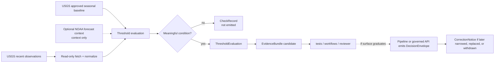
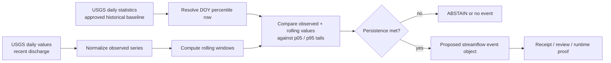
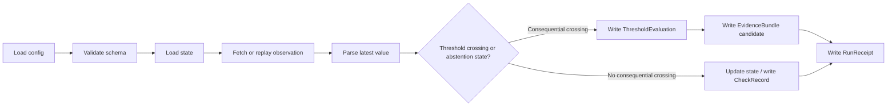
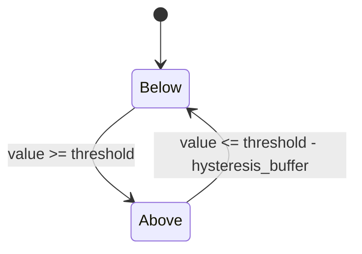

<!-- [KFM_META_BLOCK_V2]
doc_id: kfm://doc/TODO-hydrologic-threshold-watcher-readme
title: Hydrologic Threshold Watcher
type: standard
version: v1
status: draft
owners: [@bartytime4life]
created: 2026-04-11
updated: 2026-04-18
policy_label: public-safe
related: [tools/probes/README.md, .github/watchers/README.md, docs/domains/hydrology/README.md, docs/domains/hydrology/usgs-tail-alerts-schema.md, pipelines/wbd-huc12-watcher/README.md, tools/validators/README.md, data/receipts/README.md, schemas/README.md, schemas/hydrology/streamflow-event.schema.json, policy/README.md, tests/e2e/runtime_proof/README.md]
tags: [kfm, hydrology, probes, watcher, usgs, noaa, thresholds, streamflow]
notes: [Merged from the prior draft and updated to include a proposed deterministic USGS streamflow seasonal-tail probe landing. Exact child-lane file inventory, callable entrypoints, workflow wiring, and schema placement still require branch verification before merge.]
[/KFM_META_BLOCK_V2] -->

# Hydrologic Threshold Watcher

Bounded child-lane README for a read-only hydrology threshold probe that evaluates recent water conditions, packages evidence, and hands consequential downstream emission off to governed review surfaces.

> **Status:** draft child lane · experimental surface  
> **Owners:** `@bartytime4life` *(inherits current `/tools/` owner coverage; narrower child-lane ownership NEEDS VERIFICATION)*  
> **Path:** `tools/probes/hydro-watcher/README.md` *(PROPOSED child lane under the checked-in `tools/probes/` surface)*  
> **Primary source posture:** USGS-first authoritative observation and approved-baseline logic; NOAA remains optional contextual enrichment unless a reviewed source-role rule later upgrades it.  
> **Downstream:** reviewer-facing proof surfaces, receipts, and any later owner lane that may emit release-bearing decisions.  
> **Quick jumps:** [Status](#status) · [Scope](#scope) · [Repo fit](#repo-fit) · [Accepted inputs](#accepted-inputs) · [Exclusions](#exclusions) · [Directory tree](#directory-tree) · [Quickstart](#quickstart) · [Usage](#usage) · [Output model](#output-model) · [Diagram](#diagram) · [Tables](#tables) · [Task list](#task-list--definition-of-done) · [FAQ](#faq) · [Appendix](#appendix)

[](#status)
[](#repo-fit)
[](#repo-fit)
[](#scope)
[](#scope)
[](#status)

> [!IMPORTANT]
> In `tools/probes/`, this surface must stay the bounded inspection half of a watcher pattern. It may fetch, normalize, compare, and emit reviewable reports or proof candidates, but it must not silently become a public alerting lane, a policy source-of-truth, or a direct publication surface.

> [!NOTE]
> This README deliberately separates **CONFIRMED** parent-lane doctrine from **PROPOSED** or **INFERRED** child-lane packaging. If this child lane lands, update the parent `tools/probes/README.md` in the same governed review stream so the subtree remains truthful.

---

## Status

Hydrology remains the preferred first thin slice in the attached KFM corpus because it is public-safe, place/time-rich, and operationally legible. This watcher surface keeps that posture while staying explicit about what is directly supported versus what still needs repo verification.

| Field | Value |
| --- | --- |
| Lifecycle | Experimental / draft build surface |
| Runtime posture | Fail-closed |
| Thin-slice role | Hydrology-first governed proof lane |
| Dominant causal basis | authoritative recent observations + approved seasonal baselines |
| Forecast role | contextual only unless reviewed otherwise |
| Mounted repo verification | **NEEDS VERIFICATION** for actual file presence, workflows, validator entrypoints, and final CLI surface |

### Truth labels used here

| Label | Use here |
| --- | --- |
| **CONFIRMED** | Supported by checked-in repo docs or the attached KFM doctrine corpus |
| **INFERRED** | Conservative completion that fits repo doctrine but is not directly proven as checked-in subtree reality |
| **PROPOSED** | Recommended child-lane structure, commands, or report shapes not yet proven as present on the reviewed branch |
| **UNKNOWN** | Not verified strongly enough to present as settled repo or runtime fact |
| **NEEDS VERIFICATION** | Concrete detail to confirm before merge, caller wiring, or behavior-bearing claims |

[Back to top](#hydrologic-threshold-watcher)

## Scope

`tools/probes/hydro-watcher/` is the narrow hydrology-probe surface for threshold-oriented observation around Kansas-relevant water conditions.

Use this child lane when the primary job is to:

- fetch recent hydrologic observations from an authoritative source
- compare them against declared direct thresholds or approved seasonal baselines
- keep recency, qualifiers, persistence, and hysteresis visible
- emit a stable, reviewable record that another lane can test, approve, suppress, or promote
- preserve process memory through receipts and explicit local state
- support deterministic seasonal streamflow tail checks using approved USGS historical daily statistics

Use some other owner surface when the primary job becomes:

- long-running scheduler ownership
- public alert publication
- canonical rule ownership
- direct release or promotion
- silent mutation of accepted baseline state
- broad historical warehousing or catalog ownership

### Current thin-slice emphasis

The strongest currently documented thin slice remains **USGS seasonal-tail detection** for streamflow, especially where a recent observed value can be compared against an approved day-of-year percentile baseline and must visibly **ABSTAIN** when that baseline is unavailable, stale, or unresolved.

[Back to top](#hydrologic-threshold-watcher)

## Repo fit

| Surface | Path | Why it matters here | Status |
| --- | --- | --- | --- |
| Parent probe contract | `tools/probes/README.md` | Defines `tools/probes/` as a read-only helper lane for bounded inspection and stable reports | **CONFIRMED** |
| Watcher doctrine | `.github/watchers/README.md` | Frames emit-only watcher behavior and warns against treating docs-only watcher surfaces as runtime proof | **CONFIRMED** |
| Hydrology lane boundary | `docs/domains/hydrology/README.md` | Defines what belongs in hydrology and keeps publication burdens visible | **CONFIRMED** |
| Seasonal tail standard | `docs/domains/hydrology/usgs-tail-alerts-schema.md` | Supplies the strongest documented basis for percentile-style hydrologic alert logic and abstention behavior | **CONFIRMED** |
| Comparable watcher lane | `pipelines/wbd-huc12-watcher/README.md` | Shows how KFM currently documents a watcher-oriented hydrology slice when the surface is execution-bearing rather than probe-only | **CONFIRMED** |
| Validators / schemas / policy / contracts / tests | `tools/validators/README.md`, `schemas/README.md`, `policy/README.md`, `contracts/README.md`, `tests/README.md` | Hold proof, gate, and shape authority that this child lane must not quietly absorb | **CONFIRMED** as adjacent surfaces |
| Receipts / work memory | `data/receipts/README.md`, `data/work/README.md` | Keep process memory and working-state expectations visible | **CONFIRMED** pattern, exact local linkage **NEEDS VERIFICATION** |
| Runtime proof family | `tests/e2e/runtime_proof/README.md` | Holds request-time proof obligations for finite outward outcomes and visible trust cues | **CONFIRMED** pattern |
| This child lane | `tools/probes/hydro-watcher/README.md` | Proposed dedicated hydrology probe surface for threshold evaluation and evidence handoff | **PROPOSED** |

### Working interpretation

Inside `tools/probes/`, a hydrologic threshold watcher should be understood as a **probe-first** surface:

- it may produce a `CheckRecord` or a `ThresholdEvaluation`
- it may assemble an `EvidenceBundle` candidate when the finding is consequential
- it may stage a deterministic streamflow tail event object for downstream review
- it should defer any release-bearing `DecisionEnvelope` emission to a better-owner surface unless and until the lane graduates with explicit policy, tests, and runtime proof

### Proposed streamflow thin-slice landing

The clearest KFM-aligned starter landing for this child lane is:

- `streamflow_probe.py` as the narrow read-only fetch/compare entrypoint
- a hydrology schema outside the lane for the event payload shape
- runtime-proof fixtures under `tests/e2e/runtime_proof/`
- receipts and report artifacts kept distinct from proofs

This is **PROPOSED** landing shape, not a claim that all files are already checked in.

[Back to top](#hydrologic-threshold-watcher)

## Accepted inputs

### Lane-level classes

| Input class | Examples | Why it belongs here | Status |
| --- | --- | --- | --- |
| Source identifiers | `site_id`, `parameter_code`, optional watershed or station context | Stable probe targeting and report labeling | **CONFIRMED** concept |
| Authoritative recent observations | USGS IV / DV observations for stage, discharge, groundwater, reservoir context | Primary candidate values for threshold evaluation | **CONFIRMED** |
| Approved seasonal baseline | USGS day-of-year percentile statistics and related approval metadata | Governing comparison basis for seasonal tail mode | **CONFIRMED** |
| Threshold configuration | direct stage or discharge thresholds, percentile thresholds, recency limit, persistence minimum, hysteresis rules | Makes comparison logic explicit instead of implicit | **PROPOSED** exact child-lane file shape |
| Qualifier and suppression context | ice, estimated, equipment, stale, or other caution states | Supports visible `ABSTAIN`, `DENY`, or hold behavior | **INFERRED** / **PROPOSED** |
| Optional contextual enrichers | NOAA forecast context, watershed joins, nearby-gage context | Helpful for review summaries, but must not outrank governing observation/baseline evidence | **PROPOSED** |
| Output targets | report JSON, receipt path, review artifact directory | Keeps probe behavior inspectable outside CI YAML | **CONFIRMED** pattern |

### Bundle-oriented runtime inputs

| Input | Role | Status |
| --- | --- | --- |
| `config/sites.yaml` | primary watcher configuration for sources, thresholds, and output paths | **INFERRED** from supplied watcher bundle |
| `schemas/config/hydro-watcher-sites.schema.json` | contract authority for config validation | **INFERRED** exact path, **CONFIRMED** need for a schema authority |
| saved fixture JSON | offline replay input for deterministic tests | **CONFIRMED** pattern |
| local state files | previous regime + last observation memory | **PROPOSED** / **INFERRED** |
| source responses | latest observation payload from a configured adapter | **CONFIRMED** concept |

### Threshold families that fit this lane

| Threshold family | Governing source role | Good fit here? | Reading posture |
| --- | --- | --- | --- |
| Direct operating threshold | explicit site/parameter threshold declared in config or reviewed registry | Yes | **PROPOSED** child-lane config |
| Seasonal tail threshold | approved USGS day-of-year percentile baseline | Yes | **CONFIRMED** standard, **PROPOSED** implementation |
| Forecast-context threshold | NOAA stage or forecast context | Context only | **PROPOSED** and **NEEDS VERIFICATION** before it drives consequential outcomes |

### Streamflow probe inputs — proposed starter contract

| Field | Purpose | Status |
| --- | --- | --- |
| `site` | USGS site number for the watched gage | **PROPOSED** CLI field |
| `permanent_id` | preferred durable hydro identifier when available | **PROPOSED** |
| `comid` | fallback hydro join identifier when `permanent_id` is absent | **PROPOSED** |
| `lookback_days` | rolling window and recent-value lookback | **PROPOSED** |
| `low_percentile` / `high_percentile` | seasonal tail thresholds; current thin-slice default favors `p05/p95` | **PROPOSED**, but aligns to documented tail doctrine |
| `sustained_days` | persistence gate for repeated breach detection | **PROPOSED** |

### Illustrative selector fields

| Field | Purpose | Status |
| --- | --- | --- |
| `id` / `site_id` | site or gauge identifier | **PROPOSED** exact field name |
| `source` | adapter selection such as `usgs` or `noaa_nwps` | **PROPOSED** |
| `parameter` / `parameter_code` | source-specific variable selector | **PROPOSED** exact field name |
| `threshold` | primary upward crossing threshold | **PROPOSED** |
| `hysteresis_buffer` | downward reset buffer or clear value offset | **PROPOSED** |

[Back to top](#hydrologic-threshold-watcher)

## Exclusions

| Does not belong here as settled behavior | Why | Put it in instead |
| --- | --- | --- |
| Direct public alert publication | `tools/probes/` is a bounded inspection lane, not a release authority | pipeline, governed API, or reviewed release surfaces |
| Canonical threshold policy ownership | This child lane may apply reviewed rules, but it must not become their sovereign home | `policy/README.md`, `contracts/README.md`, `schemas/README.md` |
| Hidden baseline mutation | Accepted comparison state should remain visible and reviewable | pipeline or catalog/review plane with receipts and correction lineage |
| Unverified scheduler or workflow claims | Current public gatehouse docs remain cautious about watcher-runtime certainty | checked-in workflow or runtime owner surface once visible |
| NOAA-only causality | Forecast context is not a substitute for authoritative observation plus approved baseline | reviewer-facing context only unless later standardized |
| Sensitive or private coordinate dumps | Public tooling should stay safe to clone and review | steward-only data or tightly scoped test fixtures |
| Broad historical time-series warehousing | This surface is an inspection and threshold-evaluation lane, not a canonical warehouse | governed processed/catalog lanes |
| Best-effort ambiguous alerting | KFM defaults to visible negative outcomes, not improvised positive claims | fail-closed negative states such as `ABSTAIN`, `DENY`, or `ERROR` |

> [!CAUTION]
> If this surface needs to own long-running schedules, direct outward `DecisionEnvelope` emission, or release-bearing catalog writes, it has outgrown the safe `tools/probes/` contract. Graduate the owner surface instead of stretching the probe lane until it quietly becomes runtime.

[Back to top](#hydrologic-threshold-watcher)

## Directory tree

### Confirmed parent context

```text
tools/
└── probes/
    └── README.md
```

### Bundle-derived child-lane landing shape

```text
tools/
└── probes/
    └── hydro-watcher/
        ├── README.md
        ├── config/
        │   ├── README.md
        │   ├── sites.yaml
        │   ├── sites.yaml.example
        │   └── sites.ci.yaml
        ├── scripts/
        │   └── run_watcher.py
        └── tests/
            ├── README.md
            ├── test_replay_offline.py
            └── fixtures/
                ├── config.replay.yaml
                └── usgs_latest_continuous_06891000_00065.json
```

### Proposed streamflow thin-slice landing shape

```text
tools/
└── probes/
    └── hydro-watcher/
        ├── README.md
        └── streamflow_probe.py

schemas/
└── hydrology/
    └── streamflow-event.schema.json

tests/
└── e2e/
    └── runtime_proof/
        └── hydrology/
            └── streamflow/
                ├── README.md
                ├── test_streamflow_runtime_proof.py
                └── fixtures/
                    └── seasonal_low_tail_answer/
                        └── event.json
```

### Alternative starter landing shape seen in the stricter child-lane draft

```text
tools/
└── probes/
    └── hydro-watcher/
        ├── README.md
        ├── hydro_threshold_probe.py
        ├── thresholds.example.yaml
        └── ../../tests/tools/probes/hydro_watcher/
```

> [!WARNING]
> The trees above are landing shapes, not current public-branch proof. Keep the child path, entrypoint name, config names, schema location, and test location synchronized with the exact branch under review.

[Back to top](#hydrologic-threshold-watcher)

## Quickstart

### Safe inspection-first quickstart

There is no child-lane entrypoint verified from the currently visible branch material. The safe quickstart is inspection-first.

1. Recheck the parent probe contract and adjacent hydrology doctrine.

```bash
sed -n '1,260p' tools/probes/README.md
sed -n '1,260p' .github/watchers/README.md
sed -n '1,260p' docs/domains/hydrology/README.md
sed -n '1,260p' docs/domains/hydrology/usgs-tail-alerts-schema.md
```

2. Verify the exact branch inventory before claiming commands or files.

```bash
find tools/probes -maxdepth 3 -type f | sort
find schemas -maxdepth 3 -type f | sort | rg "hydrology|streamflow"
find tests/e2e/runtime_proof -maxdepth 5 -type f | sort | rg "hydrology|streamflow"
```

3. Search for overlapping threshold, NWIS, or watcher logic before inventing a new entrypoint.

```bash
rg -n "tail alert|threshold|nwis|usgs|DecisionEnvelope|EvidenceBundle|CheckRecord|streamflow" \
  .github docs pipelines policy contracts schemas tests tools -S
```

4. Only after the child-lane files are actually checked in, run the reviewed branch entrypoint.

```bash
python tools/probes/hydro-watcher/streamflow_probe.py \
  --site 06887500 \
  --comid 12345678
```

> [!TIP]
> The final command is intentionally a target-shape example. Keep it out of merge-ready docs unless the exact file path and CLI flags exist on the branch being reviewed.

### Bundle-derived local smoke path — NEEDS VERIFICATION

If the supplied watcher bundle shape is present on the reviewed branch, the following commands are the clearest local verification path:

```bash
make hydro-validate
make hydro-test
make hydro-once
make hydro-smoke
make hydro-loop
```

And the lower-level target command surface may look like:

```bash
python tools/validators/validate_hydro_watcher_config.py \
  --config tools/probes/hydro-watcher/config/sites.yaml \
  --schema schemas/config/hydro-watcher-sites.schema.json

pytest -q tools/probes/hydro-watcher/tests/test_replay_offline.py
pytest -q tests/e2e/runtime_proof/hydrology/streamflow/test_streamflow_runtime_proof.py
```

[Back to top](#hydrologic-threshold-watcher)

## Usage

### What a good run should do

1. Fetch recent authoritative hydrologic observations for a configured site and parameter.
2. Resolve the correct comparison basis:
   - direct threshold mode, or
   - seasonal tail mode using approved day-of-year percentile context.
3. Apply recency, qualifier, persistence, and hysteresis gates before any consequential conclusion.
4. Emit a stable, reviewable output that makes the negative path visible rather than silently disappearing.
5. Hand consequential downstream emission off to a better-owner surface if needed.

### Operating modes — bundle-oriented proposal

| Mode | Purpose | When to use it | Status |
| --- | --- | --- | --- |
| One-shot | single bounded polling pass | local verification, cron-style execution, smoke runs | **PROPOSED** |
| Loop | repeated polling using configured cadence | daemon-style watching | **PROPOSED** |
| Replay | fixture-driven offline execution | deterministic CI, parser proof, threshold regression testing | **PROPOSED**, but strongly aligned to KFM doctrine |

### Streamflow seasonal-tail mode — proposed implementation reading

For the first narrow streamflow slice, the strongest implementation reading is:

1. fetch recent USGS daily values for discharge (`00060`)
2. fetch approved daily historical statistics for the same site
3. resolve the current day-of-year percentile row
4. compare the observed value and short rolling mean against the approved seasonal tail
5. require a persistence window before any consequential result
6. emit a visible **ABSTAIN** when the baseline row cannot be resolved

### Core behavior

1. Load config and validate it against the watcher schema.
2. Load prior state for each watched site.
3. Fetch or replay the latest observation.
4. Parse the latest value for the configured parameter.
5. Resolve the comparison basis and apply threshold logic.
6. Apply recency, qualifier, persistence, and hysteresis rules before any consequential conclusion.
7. Write state or equivalent continuity memory on deterministic outcomes.
8. Write reviewable records, evidence candidates, and a run receipt according to the result state.

### Hysteresis and persistence

- **Rising transition:** emit or mark crossed when `value >= threshold`
- **Reset transition:** return to below state only when `value <= threshold - hysteresis_buffer` or an equivalent less-severe clear value
- **Persistence minimum:** require multiple consecutive observations before a consequential handoff when configured

Persistence reduces one-off spikes. Hysteresis reduces repeated flip-flops near the threshold. They solve different noise problems and combine well.

### Seasonal streamflow defaults — doctrinally aligned starter values

| Setting | Suggested default | Why | Status |
| --- | ---: | --- | --- |
| Low seasonal tail | `p05` | Conservative unusual-low trigger | **PROPOSED**, but aligned to checked-in tail-alert guidance |
| High seasonal tail | `p95` | Conservative unusual-high trigger | **PROPOSED**, but aligned to checked-in tail-alert guidance |
| Persistence minimum | `3` consecutive observations | Reduces noisy single-point excursions | **PROPOSED** |
| Missing approved baseline | `ABSTAIN` | Trust-preserving negative state | **CONFIRMED** doctrine |
| Rolling confirmation | short rolling mean must agree with the tail breach | Reduces one-day noise | **PROPOSED** |

[Back to top](#hydrologic-threshold-watcher)

## Output model

### Lane-local output model

| Output | Why it belongs here | Status |
| --- | --- | --- |
| `CheckRecord` | Makes no-change or non-emit checks visible | **PROPOSED** contract stub |
| `ThresholdEvaluation` | Keeps comparison logic machine-checkable | **PROPOSED** contract stub |
| `EvidenceRef` | Gives review flows a stable pointer to proof payloads | **PROPOSED** contract stub |
| `EvidenceBundle` candidate | Packages consequential evidence for downstream review | **PROPOSED** contract stub |
| `RunReceipt` | Preserves process memory for the pass | **CONFIRMED** pattern, exact schema **PROPOSED** |
| `StateFile` or equivalent local continuity object | Preserves regime continuity | **PROPOSED** |
| streamflow tail event object | Keeps the thin-slice seasonal-tail result portable across tests and downstream review | **PROPOSED** |
| `DecisionEnvelope` | Useful if this logic graduates into a watcher/pipeline owner surface | **PROPOSED downstream** |
| `CorrectionNotice` | Preserves supersession and narrowing if downstream emissions are later corrected | **PROPOSED downstream** |

### Proposed streamflow event shape

| Field | Why it matters |
| --- | --- |
| `site_no` | stable USGS gage identifier |
| `permanent_id` / `comid` | durable hydro join context with explicit fallback |
| `doy` | visible baseline lookup basis |
| `obs_cfs` | candidate observed discharge |
| `p5_cfs` / `p95_cfs` | governing seasonal tail thresholds for the starter thin slice |
| `rolling_7d_mean_cfs` | short-window confirmation against one-day noise |
| `status` | finite `low` / `high` event class |
| `alert_class` | outward-readable seasonal tail class |
| `breach_days` | visible persistence count |
| `join_resolution_reason` | preserves `permanent_id` vs fallback COMID logic |
| `decision` / `reason` | finite outward reading for downstream proof |
| `baseline_kind` | makes the comparison basis explicit |
| `event_content_hash` | stable material-change key for suppression or replay checks |

### Artifact-oriented shape

| Object | Why it exists | Typical fields |
| --- | --- | --- |
| Event artifact | describes the crossing decision | `event_id`, `type`, `site`, `source`, `parameter`, `value`, `threshold`, `direction`, `outcome`, `reason`, `timestamp` |
| Evidence bundle | explains why the event exists | parsed observation, previous state, threshold rule, request provenance, run identifier, deterministic input hash |
| Run receipt | preserves process memory for the pass | `run_id`, started/ended timestamps, sites checked, events emitted, errors, abstains, result list, config hash |
| State file | preserves regime continuity | prior regime, latest observation marker, last transition |

### Expected artifact behavior

| Situation | Check / Event | Evidence | Receipt |
| --- | --- | --- | --- |
| True crossing | yes | yes | yes |
| No crossing | visible `CheckRecord` or no event artifact | optional / mode-specific | yes |
| Parse failure | no consequential event | optional failure detail | yes |
| Missing baseline | visible `ABSTAIN` or equivalent non-emit record | optional | yes |
| Invalid config | no runtime event | no runtime evidence | validation failure / receipt or hard stop depending on runner |

> [!IMPORTANT]
> Seasonal tail mode should not emit a consequential finding when the approved baseline is missing, stale, unresolved, or not quality-assured. The correct KFM move is visible abstention, not an improvised comparison.

[Back to top](#hydrologic-threshold-watcher)

## Diagram

### Probe-lane decision model



### Streamflow seasonal-tail thin slice



### Execution model — bundle-oriented proposal



### Regime model — hysteresis proposal



[Back to top](#hydrologic-threshold-watcher)

## Tables

### Source-role discipline

| Source family | Lane role | Must not be mistaken for |
| --- | --- | --- |
| USGS recent observations | candidate condition source | approved historical baseline |
| USGS approved daily or statistical history | governing seasonal comparison basis | forecast or contextual enrichment |
| NOAA forecast context | contextual enrichment for review | authoritative trigger source |
| Local joins such as HUC or nearby-gage context | explanatory context | canonical threshold truth |

### Outcome reading

| Outcome | Meaning here | Default lane action |
| --- | --- | --- |
| `ANSWER` | Threshold condition supported strongly enough for a consequential handoff | write evidence candidate and surface for downstream review |
| `ABSTAIN` | Trustworthy basis missing or insufficient | emit visible non-emit record |
| `DENY` | Policy or reviewed suppression rule blocks emission | emit visible non-emit record |
| `ERROR` | Execution failure prevented evaluation | fail clearly and preserve run evidence |

### Join-resolution reading for streamflow events

| Situation | Expected outward cue |
| --- | --- |
| durable `permanent_id` available | `join_resolution_reason: "permanent_id"` |
| `permanent_id` missing but hydrology join still possible | `comid` present with `join_resolution_reason: "fallback_comid"` |
| neither durable join available | **NEEDS VERIFICATION** whether the thin slice should ABSTAIN or emit a site-only review object |

[Back to top](#hydrologic-threshold-watcher)

## Task list / definition of done

- [ ] Confirm whether this child lane should exist under `tools/probes/` or graduate immediately to a pipeline/watcher owner surface.
- [ ] Update `tools/probes/README.md` so the parent subtree and landing-shape language stay accurate if this child lane lands.
- [ ] Check in one explicit entrypoint and one example config before keeping runnable commands in the main quickstart.
- [ ] Confirm whether the starter thin slice lands as `streamflow_probe.py`, `hydro_threshold_probe.py`, or another reviewed entrypoint name.
- [ ] Confirm whether the hydrology event schema belongs in `schemas/hydrology/` on the reviewed branch.
- [ ] Prove `CheckRecord`, `ThresholdEvaluation`, and streamflow tail fixtures in `tests/README.md` or a clearly linked child test surface.
- [ ] Encode no-baseline -> `ABSTAIN`, stale-observation -> `ABSTAIN`, qualifier suppression -> `DENY` or hold, and hysteresis/persistence behavior as explicit tests.
- [ ] Decide whether any `DecisionEnvelope` output remains strictly downstream.
- [ ] Keep NOAA context clearly labeled as optional context unless a reviewed source-role rule says otherwise.
- [ ] Keep event, evidence, and receipt objects distinct.
- [ ] Prove deterministic replay for at least one true rising crossing and one seasonal low-tail case.
- [ ] Ensure one-shot execution writes a receipt even when no crossing occurs.
- [ ] Isolate smoke outputs from local runtime outputs.
- [ ] Document fail-closed behavior for invalid config, parse failure, insufficient data, stale observation, and stale or unresolved baseline resolution.

### Definition of done

This README is in a healthy merge-ready state when:

- the child path and adjacent references match the exact reviewed branch
- the parent probe README no longer contradicts the child-lane tree
- no command implies a file or workflow that is not checked in
- the lane stays read-only and evidence-first
- threshold logic distinguishes direct thresholds from seasonal approved-baseline logic
- seasonal streamflow tail behavior is explicitly modeled as a thin slice without overclaiming branch reality
- negative states remain first-class and visible
- downstream release-bearing behavior is either linked to a real owner surface or explicitly left out
- bundle-derived operational details are either verified in-branch or kept clearly marked as illustrative

[Back to top](#hydrologic-threshold-watcher)

## FAQ

### Why not publish alerts directly from `tools/probes/`?

Because the checked-in `tools/probes/` contract is for bounded inspection and stable reporting, not for hidden trust-state mutation or public release behavior.

### Why does missing baseline data lead to `ABSTAIN` instead of “best effort”?

Because the checked-in hydrology alert standard treats approved seasonal baselines as governing comparison evidence. Without that basis, a confident alert would overclaim.

### Why keep NOAA context optional and secondary?

Because current hydrology repo docs ground threshold causality in authoritative observations and approved historical baselines. Forecast context can help reviewers, but it should not outrank the primary evidence path without explicit review.

### Why use both persistence and hysteresis?

Persistence reduces one-off spikes. Hysteresis reduces repeated state flipping when values hover near a threshold. They solve different noise problems and combine well in probe-oriented reporting.

### Why separate checks, evidence, and receipts?

Because they serve different trust roles.

- checks or evaluations describe what was concluded
- evidence explains why the conclusion exists
- receipts preserve process memory for the run

### Why keep an offline replay path?

To prove watcher behavior deterministically in CI without depending on live upstream availability.

### Why make the streamflow thin slice percentiles explicit?

Because the reviewed hydrology doctrine already treats approved day-of-year percentile baselines as the strongest documented basis for seasonal tail interpretation. Making those thresholds outward-visible improves reviewability and fail-closed behavior.

### Why fail closed?

Because ambiguous hydrologic outputs should not silently turn into alerting decisions.

## Appendix

<details>
<summary><strong>Illustrative config and report shapes</strong></summary>

### Example threshold config

```yaml
sites:
  - site_id: "06887500"
    parameter_code: "00060"
    mode: "seasonal_tail"
    tail_direction: "low"
    percentile: 5
    recency_limit_hours: 96
    persistence_min: 3
    hysteresis:
      enabled: true
      clear_percentile: 10
```

### Example no-emit record

```json
{
  "schema_version": "v1",
  "check_id": "uuid",
  "dataset_id": "hydrology.nwis.06887500.00060",
  "observed_at": "2026-04-11T00:00:00Z",
  "comparison_status": "baseline_unavailable",
  "emit_status": "not_emitted",
  "reason_code": "approved_percentile_missing",
  "reason_summary": "Seasonal tail mode abstained because the approved percentile baseline was not resolvable."
}
```

### Example consequential handoff candidate

```json
{
  "schema_version": "v1",
  "bundle_kind": "watcher_evidence_bundle",
  "dataset": {
    "dataset_id": "hydrology.nwis.06887500.00060",
    "authority_class": "authoritative",
    "policy_class": "public"
  },
  "trigger": {
    "trigger_type": "DOMAIN_DELTA",
    "reason_code": "seasonal_low_tail_triggered"
  },
  "outcome": {
    "outcome": "ANSWER",
    "emit_status": "candidate_only"
  },
  "human_summary": "Recent discharge remained below the approved seasonal low-tail threshold across the configured persistence window."
}
```

### Example proposed streamflow event object

```json
{
  "site_no": "06887500",
  "permanent_id": null,
  "comid": 12345678,
  "doy": 93,
  "obs_cfs": 41.2,
  "p5_cfs": 55.0,
  "p50_cfs": 210.0,
  "p95_cfs": 481.0,
  "rolling_7d_mean_cfs": 44.9,
  "rolling_30d_mean_cfs": 61.2,
  "status": "low",
  "alert_class": "seasonal_low_tail",
  "breach_days": 3,
  "join_resolution_reason": "fallback_comid",
  "decision": "ANSWER",
  "reason": "sustained percentile breach",
  "baseline_kind": "day_of_year_percentile",
  "event_content_hash": "sha256:NEEDS_VERIFICATION_EXAMPLE"
}
```

</details>

<details>
<summary><strong>Illustrative local workflow — bundle-derived and NEEDS VERIFICATION</strong></summary>

```bash
cp tools/probes/hydro-watcher/config/sites.yaml.example \
  tools/probes/hydro-watcher/config/sites.yaml

make hydro-validate
make hydro-test
make hydro-once
```

</details>

<details>
<summary><strong>Review notes for the first implementation pass</strong></summary>

- Keep the first checked-in artifact small: one site, one parameter, one threshold family, one stable report.
- Prefer reviewed fixtures and receipts over broad source coverage.
- Prefer USGS-only seasonal-tail causality in the first slice; add NOAA strictly as reviewer context if it lands at all.
- If the first implementation needs scheduling, publication, or correction authority, move the runtime owner surface before the lane takes on that burden accidentally.

</details>

[Back to top](#hydrologic-threshold-watcher)
