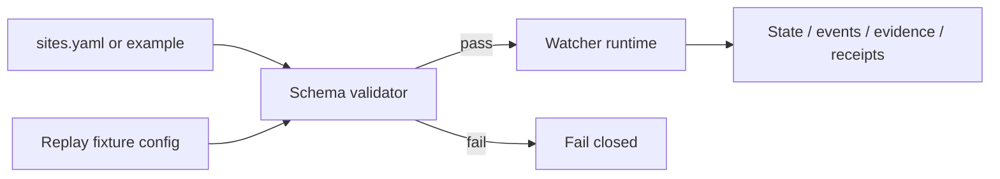

<!-- [KFM_META_BLOCK_V2]
doc_id: kfm://doc/TODO-hydrologic-threshold-watcher-config-readme
title: Hydrologic Threshold Watcher Config
type: standard
version: v1
status: draft
owners: [@bartytime4life]
created: 2026-04-11
updated: 2026-04-11
policy_label: public-safe
related: [../README.md, ../../../../schemas/config/hydro-watcher-sites.schema.json, ../../../validators/validate_hydro_watcher_config.py, ../tests/README.md]
tags: [kfm, hydrology, watcher, config, schema]
notes: [doc_id is a reviewable placeholder because no authoritative UUID was surfaced, config paths and field names come from the supplied watcher bundle and remain NEEDS VERIFICATION against mounted repo state]
[/KFM_META_BLOCK_V2] -->

# Hydrologic Threshold Watcher Config

Contract-bearing configuration surface for watcher sources, thresholds, output paths, and replay fixtures.

<p align="left">
  <a href="#status"></a>
  <a href="#validation"></a>
  <a href="#field-guide"></a>
  <a href="#task-list"></a>
</p>

> **Status:** experimental  
> **Owners:** @bartytime4life  
> **Target path:** `tools/probes/hydro-watcher/config/README.md`  
> **Repo fit:** [Watcher README](../README.md) · [Tests README](../tests/README.md) · [Schema home](../../../../schemas/README.md) · [Validator lane](../../../validators/README.md)  
> **Downstream:** validated watcher runs, smoke configs, replay configs, isolated output roots  
> **Quick jumps:** [Status](#status) · [Scope](#scope) · [Repo fit](#repo-fit) · [Accepted inputs](#accepted-inputs) · [Exclusions](#exclusions) · [Directory tree](#directory-tree) · [Validation](#validation) · [Quickstart](#quickstart) · [Usage](#usage) · [Diagram](#diagram) · [Field guide](#field-guide) · [Task list](#task-list) · [FAQ](#faq)

---

## Status

This directory is small by design: it holds config, examples, and validation-facing material, while schema authority remains outside the directory.

| Field | Value |
| --- | --- |
| Posture | Required, explicit, validated |
| Schema authority | external to this directory |
| Runtime rule | validate before watcher execution |
| Replay support | fixture-driven config supported |
| Mounted repo verification | **NEEDS VERIFICATION** for actual config filenames and validator entrypoint |

---

## Scope

This directory contains watcher configuration files and examples.

It should contain:

- local operator config
- example starter config
- CI smoke config
- references to replay test config

It should not redefine schema authority or compete with validation contracts owned elsewhere.

---

## Repo fit

### Path, upstream, downstream

| Aspect | Fit |
| --- | --- |
| Target path | `tools/probes/hydro-watcher/config/` |
| Upstream | `../../../../schemas/config/hydro-watcher-sites.schema.json`; `../../../validators/validate_hydro_watcher_config.py` |
| Downstream | watcher runtime, smoke runs, replay tests, output path isolation |

### Neighbor surfaces

| Surface | Relationship |
| --- | --- |
| `../README.md` | runtime behavior, artifact roles, quickstart |
| `../tests/README.md` | replay fixture expectations |
| `../../../../schemas/README.md` | schema-home boundary |
| `../../../validators/README.md` | validator posture and contract checks |

---

## Accepted inputs

| Input | Role |
| --- | --- |
| `sites.yaml` | operator-local watcher config |
| `sites.yaml.example` | starter example to copy and adapt |
| `sites.ci.yaml` | CI smoke config |
| `tests/fixtures/config.replay.yaml` | replay-only config reference |
| schema JSON | contract for accepted structure and field semantics |

---

## Exclusions

| Not owned here | Where it belongs instead |
| --- | --- |
| canonical schema definitions | `schemas/` |
| runtime state, evidence, and receipts | watcher output directories |
| policy-authority decisions | `policy/` |
| broad test fixture governance | `tests/` or shared test-data docs |

---

## Directory tree

```text
tools/probes/hydro-watcher/config/
├── README.md
├── sites.yaml
├── sites.yaml.example
└── sites.ci.yaml
```

> Replay-specific config commonly lives under `../tests/fixtures/` so test data remains isolated from operator-facing config.

---

## Validation

Validation should happen before any watcher execution. The supplied watcher bundle names a schema-first flow: config file → validator → watcher runtime.

## Quickstart

### Validate the main config

```bash
python tools/validators/validate_hydro_watcher_config.py \
  --config tools/probes/hydro-watcher/config/sites.yaml \
  --schema schemas/config/hydro-watcher-sites.schema.json
```

### Or use the task runner

```bash
make hydro-validate
```

### Start from the example file

```bash
cp tools/probes/hydro-watcher/config/sites.yaml.example \
  tools/probes/hydro-watcher/config/sites.yaml
```

---

## Usage

### Minimal operator workflow

1. Copy `sites.yaml.example` to `sites.yaml`.
2. Fill in source enablement, thresholds, and output paths.
3. Validate the file before running the watcher.
4. Use separate output roots for local runtime, CI smoke, and replay tests.
5. Run the watcher only after validation passes.

### Why isolation matters

| Surface | Reason |
| --- | --- |
| local runtime outputs | prevents collisions during normal use |
| CI smoke outputs | keeps test artifacts predictable and disposable |
| replay outputs | makes deterministic assertions easy to inspect |

---

## Diagram



---

## Field guide

### File registry

| File | Role |
| --- | --- |
| `sites.yaml` | primary operator config |
| `sites.yaml.example` | starter config |
| `sites.ci.yaml` | CI smoke config |
| `../tests/fixtures/config.replay.yaml` | replay config kept outside the operator-facing directory |

### Top-level fields

| Field | Meaning |
| --- | --- |
| `poll_interval_seconds` | loop cadence |
| `user_agent` | outbound HTTP user agent |
| `api_keys` | optional source API keys |
| `threshold_defaults` | default hysteresis values |
| `output` | state, receipts, events, and evidence paths |
| `sources` | source adapters and base URLs |
| `sites` | site-specific monitoring definitions |

### Site fields

| Field | Meaning |
| --- | --- |
| `id` | source-specific site identifier |
| `source` | adapter selection |
| `parameter` | variable selector |
| `threshold` | upward crossing threshold |
| `hysteresis_buffer` | optional site override |
| `display_name` | human-friendly label |
| `comid` | optional NHDPlus linkage |
| `huc12` | optional watershed code |
| `metadata` | auxiliary site metadata |
| `fixture_path` | optional local JSON replay path |

### Example local config

```yaml
poll_interval_seconds: 300
user_agent: "kfm-hydro-watcher/0.1"
api_keys:
  usgs: ""
threshold_defaults:
  hysteresis_buffer: 0.5
output:
  state_dir: "var/state"
  receipts_dir: "var/receipts"
  events_dir: "var/events"
  evidence_dir: "var/evidence"
sources:
  usgs:
    enabled: true
    base_url: "https://api.waterdata.usgs.gov/ogcapi/v0"
  noaa_nwps:
    enabled: false
    base_url: "https://api.water.noaa.gov/nwps/v1"
sites:
  - id: "06891000"
    source: "usgs"
    parameter: "00065"
    threshold: 20.0
    hysteresis_buffer: 0.5
    display_name: "Example gauge"
    comid: 12345678
    huc12: "102701020305"
```

### Example replay-only snippet

```yaml
sites:
  - id: "06891000"
    source: "usgs"
    parameter: "00065"
    threshold: 20.0
    fixture_path: "tools/probes/hydro-watcher/tests/fixtures/usgs_latest_continuous_06891000_00065.json"
```

---

## Task list

A config surface is ready for use when all of the following are true.

- [ ] The file validates against the watcher schema.
- [ ] Output directories are explicit and mode-specific.
- [ ] Site identifiers, source names, and parameter selectors are stable.
- [ ] Replay fixture paths stay out of production config unless intentionally testing.
- [ ] Threshold and hysteresis values are reviewable in diffs.

---

## FAQ

### Can config contain source-specific extras?

Yes, through `metadata`, but core behavior should still be expressed through named fields.

### Should fixture paths be used in production config?

No. Fixture mode is intended for replay and test surfaces.

### Where does schema authority live?

In `schemas/config/hydro-watcher-sites.schema.json`, not in this directory.

---

## Appendix

<details>
<summary>Evidence posture for this README</summary>

- **CONFIRMED:** config is contract-bearing, validation should happen before runtime, and replay-specific config is part of the supplied watcher bundle
- **PROPOSED / NEEDS VERIFICATION:** actual schema file presence, field-level enforcement, and validator CLI location were not verified against a mounted repo tree in the current workspace

</details>

[Back to top](#hydrologic-threshold-watcher-config)
