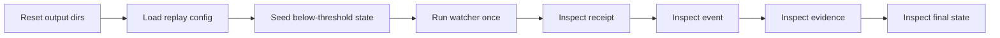

<!-- [KFM_META_BLOCK_V2]
doc_id: kfm://doc/TODO-hydrologic-threshold-watcher-tests-readme
title: Hydrologic Threshold Watcher Tests
type: standard
version: v1
status: draft
owners: [@bartytime4life]
created: 2026-04-11
updated: 2026-04-11
policy_label: public-safe
related: [../README.md, ../../../validators/README.md, ../../../../tests/README.md]
tags: [kfm, hydrology, watcher, tests, replay]
notes: [doc_id is a reviewable placeholder because no authoritative UUID was surfaced, test file paths and assertions come from the supplied watcher bundle and remain NEEDS VERIFICATION against mounted repo state]
[/KFM_META_BLOCK_V2] -->

# Hydrologic Threshold Watcher Tests

Replay-first test surface for proving watcher behavior deterministically and fail-closed.

<p align="left">
  <a href="#status"></a>
  <a href="#usage"></a>
  <a href="#what-is-proven"></a>
  <a href="#task-list"></a>
</p>

> **Status:** experimental  
> **Owners:** @bartytime4life  
> **Target path:** `tools/probes/hydro-watcher/tests/README.md`  
> **Repo fit:** [Watcher README](../README.md) · [Validators](../../../validators/README.md) · `tests/` root docs  
> **Downstream:** CI replay gates · regression detection · reviewer confidence in emitted artifacts  
> **Quick jumps:** [Status](#status) · [Scope](#scope) · [Repo fit](#repo-fit) · [Accepted inputs](#accepted-inputs) · [Exclusions](#exclusions) · [Directory tree](#directory-tree) · [Quickstart](#quickstart) · [Usage](#usage) · [Diagram](#diagram) · [What is proven](#what-is-proven) · [Task list](#task-list) · [FAQ](#faq)

---

## Status

These tests are intentionally small. Their job is behavior proof, not full integration coverage.

| Field | Value |
| --- | --- |
| Primary posture | Offline, deterministic |
| Live dependency | None required for replay |
| Current focus | USGS fixture replay |
| Intended use | local verification, CI gate, regression guard |
| Mounted repo verification | **NEEDS VERIFICATION** for actual pytest module location and fixture inventory |

---

## Scope

This directory exists to prove that the watcher can:

- load config
- load a saved fixture payload
- parse an observation deterministically
- apply hysteresis correctly
- emit the expected event and evidence artifacts
- write final state and run receipt

It is deliberately centered on **behavior proof**, not exhaustive integration testing.

---

## Repo fit

### Path, upstream, downstream

| Aspect | Fit |
| --- | --- |
| Target path | `tools/probes/hydro-watcher/tests/` |
| Upstream | `../scripts/run_watcher.py`; fixture configs; saved payloads |
| Downstream | replay-based CI checks; regression detection; reviewer trust in watcher artifact semantics |

### Neighbor surfaces

| Surface | Relationship |
| --- | --- |
| `../README.md` | explains runtime behavior and artifact roles |
| `../config/README.md` | explains replay config fields and validation expectations |
| `../../../validators/README.md` | contract validation posture for config inputs |

---

## Accepted inputs

| Input | Role |
| --- | --- |
| `fixtures/config.replay.yaml` | replay-specific watcher config with isolated output roots |
| `fixtures/usgs_latest_continuous_06891000_00065.json` | saved payload for deterministic replay |
| seeded prior state | forces the watcher to begin below threshold |
| `../scripts/run_watcher.py` | runtime surface under test |
| local temp output dirs | emitted event, evidence, receipt, and state objects |

---

## Exclusions

| Not owned here | Where it belongs instead |
| --- | --- |
| live API availability tests | smoke or integration lanes |
| policy-authority decisions | policy / release review surfaces |
| broad end-to-end deployment testing | runtime or environment-specific validation |
| permanent fixture registry governance | broader test-data stewardship docs |

---

## Directory tree

```text
tools/probes/hydro-watcher/tests/
├── README.md
├── test_replay_offline.py
└── fixtures/
    ├── config.replay.yaml
    └── usgs_latest_continuous_06891000_00065.json
```

---

## Quickstart

### Direct pytest

```bash
pytest -q tools/probes/hydro-watcher/tests/test_replay_offline.py
```

### Via task runner

```bash
make hydro-test
```

---

## Usage

### Replay workflow

1. Reset output directories to avoid collisions.
2. Load the replay config.
3. Seed a below-threshold prior state.
4. Run the watcher once against the fixture payload.
5. Inspect the emitted receipt.
6. Inspect the emitted event.
7. Inspect the evidence bundle.
8. Confirm the final state moved to `above`.

### What to inspect first

| Artifact | Why it matters |
| --- | --- |
| receipt | confirms run summary and zero-error execution |
| event | confirms threshold direction, outcome, and event count |
| evidence | confirms replay provenance such as `fixture://` request origin |
| final state | confirms the watcher actually transitioned regime |

---

## Diagram



---

## What is proven

| Behavior | Expected proof |
| --- | --- |
| config loads | replay config parses successfully |
| prior state influences outcome | test begins in a below-threshold regime |
| upward crossing is detected | fixture value exceeds threshold |
| event is emitted once | exactly one event artifact exists |
| evidence is written | one evidence bundle exists |
| receipt is written | one run receipt exists |
| final state changes | regime ends in `above` |

### Assertions of interest

The supplied watcher bundle names the following high-value assertions:

- `events_emitted == 1`
- `errors == 0`
- one event file exists
- one evidence file exists
- event `direction == "rising"`
- event `outcome == "ANSWER"`
- evidence request URL starts with `fixture://`
- final state regime becomes `above`

---

## Task list

Use this checklist when adding fixtures or extending replay coverage.

- [ ] Replay config uses isolated output roots.
- [ ] Fixture payload is small enough to review and diff easily.
- [ ] Test proves exactly one crossing outcome for the seeded state.
- [ ] Receipt, event, evidence, and final state are all asserted.
- [ ] Negative-path coverage exists or is queued for invalid config, malformed fixture, and disabled source cases.

---

## FAQ

### Why not only use live smoke tests?

Because live smoke tests are useful but nondeterministic. Replay tests are better for stable behavior proof.

### Why keep fixtures minimal?

Because small fixtures are easier to review, diff, and maintain.

### Should these tests own policy decisions?

No. They verify watcher behavior and artifact shapes, not policy authority.

---

## Appendix

<details>
<summary>Good next additions</summary>

- no-crossing replay case
- downward-reset replay case
- malformed fixture fail-closed case
- schema-invalid config case
- disabled source case

</details>

<details>
<summary>Evidence posture for this README</summary>

- **CONFIRMED:** replay-first testing intent, proof objects, and assertions named in the supplied watcher bundle
- **PROPOSED / NEEDS VERIFICATION:** exact module paths, fixture filenames, and make targets were not validated against a mounted repo tree in the current workspace

</details>

[Back to top](#hydrologic-threshold-watcher-tests)
