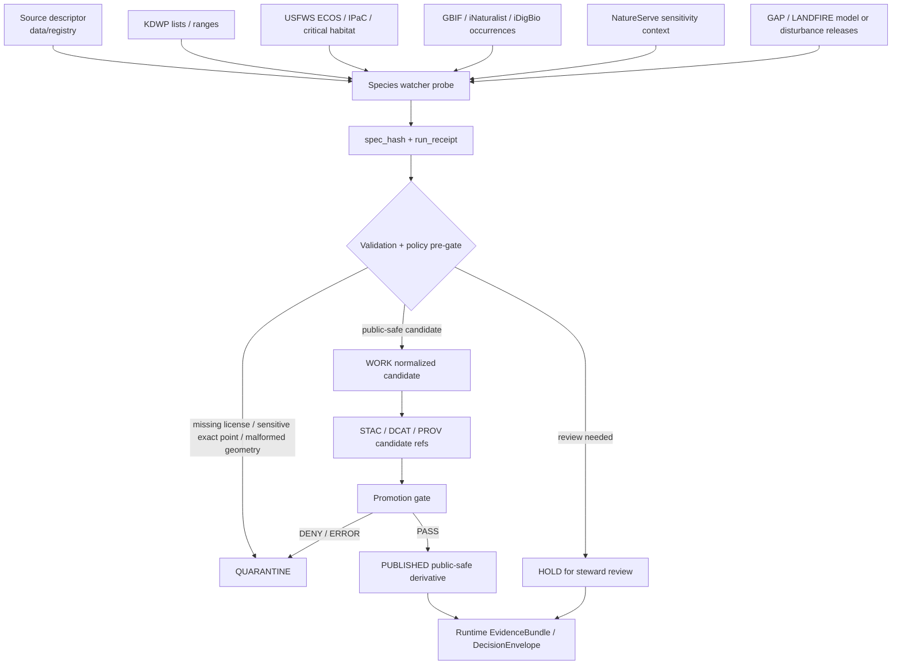

<!-- [KFM_META_BLOCK_V2]
doc_id: kfm://doc/NEEDS-VERIFICATION__tools-probes-species-watchers-readme
title: tools/probes/species_watchers
type: standard
version: v1
status: draft
owners: @bartytime4life
created: 2026-04-18
updated: 2026-04-18
policy_label: public
related: [../README.md, ../../README.md, ../../validators/README.md, ../../validators/promotion_gate/README.md, ../../attest/README.md, ../../../data/registry/README.md, ../../../data/receipts/README.md, ../../../data/quarantine/README.md, ../../../data/work/README.md, ../../../data/catalog/README.md, ../../../data/published/README.md, ../../../contracts/README.md, ../../../schemas/README.md, ../../../policy/README.md, ../../../tests/README.md]
tags: [kfm, tools, probes, species-watchers, biodiversity, ecology, sensitivity, provenance]
notes: [Public-safe README for a sensitive ecology probe lane; exact leaf inventory, executable scripts, CI wiring, doc_id UUID, and branch-level ownership still need direct repo verification.]
[/KFM_META_BLOCK_V2] -->

<a id="top"></a>

# `tools/probes/species_watchers/`

Public-safe probe lane for watching species, habitat, occurrence, and disturbance sources without turning sensitive ecology into an ungated public map layer.

> [!IMPORTANT]
> **Status:** `experimental`  
> **Owners:** `@bartytime4life` *(verify exact leaf ownership before merge)*  
> **Path:** `tools/probes/species_watchers/README.md`  
> **Repo fit:** child probe lane under [`../README.md`](../README.md), laterally coupled to [`../../validators/README.md`](../../validators/README.md), [`../../validators/promotion_gate/README.md`](../../validators/promotion_gate/README.md), [`../../../policy/README.md`](../../../policy/README.md), [`../../../contracts/README.md`](../../../contracts/README.md), and [`../../../schemas/README.md`](../../../schemas/README.md); downstream into [`../../../data/receipts/README.md`](../../../data/receipts/README.md), [`../../../data/quarantine/README.md`](../../../data/quarantine/README.md), [`../../../data/catalog/README.md`](../../../data/catalog/README.md), and role-gated publication/review surfaces.  
> **Quick jumps:** [Scope](#scope) · [Repo fit](#repo-fit) · [Accepted inputs](#accepted-inputs) · [Exclusions](#exclusions) · [Current evidence snapshot](#current-evidence-snapshot) · [Directory tree](#directory-tree) · [Quickstart](#quickstart) · [Usage](#usage) · [Diagram](#diagram) · [Operating tables](#operating-tables) · [Definition of done](#definition-of-done) · [FAQ](#faq) · [Appendix](#appendix)


> [!CAUTION]
> Species watchers are **not** publication tools. They observe upstream source changes, emit evidence-bearing receipts, and prepare reviewable candidates. They must not publish precise sensitive locations, licensed restricted records, or model-derived claims without policy, provenance, and review closure.

---

## Scope

This directory is the proposed home for **small, inspectable probes** that watch biodiversity and habitat-adjacent sources for material changes.

The lane’s job is to answer narrow operational questions:

- Did an authoritative species list, status, range, or critical habitat layer change?
- Did an occurrence source emit new or changed records relevant to a governed area of interest?
- Did a model or disturbance product release a new version that could affect ecological context?
- Does the change belong in `WORK`, `QUARANTINE`, `CATALOG`, or a later promotion review?

The lane’s job is **not** to decide that a species is present, absent, safe to expose, or publishable.

### Canonical posture

**Occurrence is a signal, not truth. Habitat models are context, not authority. Regulatory layers are stronger than observations, but still require source identity, effective date, and review state before release.**

[Back to top](#top)

---

## Repo fit

| Relationship | Path | Role | Status |
|---|---|---|---|
| Parent probe lane | [`../README.md`](../README.md) | Defines how `tools/probes/` should observe sources without becoming publishing machinery. | **NEEDS VERIFICATION** |
| Tooling parent | [`../../README.md`](../../README.md) | Broader tools surface for repo-local helpers. | **NEEDS VERIFICATION** |
| Validator coupling | [`../../validators/README.md`](../../validators/README.md) | Where executable checks should live after probes emit candidate artifacts. | **PROPOSED** |
| Promotion gate coupling | [`../../validators/promotion_gate/README.md`](../../validators/promotion_gate/README.md) | Later release gate; probes may feed it, never bypass it. | **PROPOSED / NEEDS VERIFICATION** |
| Attestation coupling | [`../../attest/README.md`](../../attest/README.md) | Proof objects and signature bundles, when a candidate reaches release review. | **PROPOSED / NEEDS VERIFICATION** |
| Registry input | [`../../../data/registry/README.md`](../../../data/registry/README.md) | Source descriptors for KDWP, USFWS, GBIF, NatureServe, and related sources. | **PROPOSED** |
| Receipts output | [`../../../data/receipts/README.md`](../../../data/receipts/README.md) | Process-memory output for probe runs. | **CONFIRMED pattern / leaf path NEEDS VERIFICATION** |
| Quarantine output | [`../../../data/quarantine/README.md`](../../../data/quarantine/README.md) | Default destination for missing licenses, unresolved sensitivity, malformed geometry, or ambiguous taxonomy. | **PROPOSED** |
| Work output | [`../../../data/work/README.md`](../../../data/work/README.md) | Normalized, non-published candidate artifacts for validation and review. | **PROPOSED** |
| Catalog output | [`../../../data/catalog/README.md`](../../../data/catalog/README.md) | STAC / DCAT / PROV linkage after validation; not a substitute for release approval. | **PROPOSED** |
| Publication boundary | [`../../../data/published/README.md`](../../../data/published/README.md) | Public-safe or steward-approved release surface. Probes must not write here directly. | **PROPOSED** |

> [!NOTE]
> The path is intentionally under `tools/probes/` rather than `data/published/` or `apps/`. That placement keeps source watching separate from publication, runtime answering, and map display.

[Back to top](#top)

---

## Accepted inputs

Accepted inputs should be small, source-bounded, and reviewable.

| Input class | Examples | Required handling |
|---|---|---|
| Source descriptors | `data/registry/usfws_critical_habitat.yaml`, `data/registry/gbif_occurrence.yaml` | Must name source role, rights posture, cadence, sensitivity, public-safe representation, and conflict rule. |
| AOI descriptors | County, HUC12, buffered public-safe geometry, or steward-approved WKT | Must avoid checked-in exact sensitive locations unless explicitly approved for restricted fixtures. |
| Remote source metadata | ETag, Last-Modified, service version, effective date, status date, product year | Must be recorded in the run receipt when available. |
| Regulatory species and habitat snapshots | KDWP listing/range references, USFWS ECOS / IPaC / critical habitat responses | Must preserve authority, effective date, source URL, and consultation caveat. |
| Occurrence deltas | GBIF / iNaturalist / iDigBio-style records | Must retain source geoprivacy and license fields; exact coordinates belong in restricted handling only. |
| Sensitivity context | NatureServe data-sensitive flags/categories, state rules, source geoprivacy | Must drive policy labels, precision class, redaction, and quarantine decisions. |
| Model / disturbance release metadata | USGS GAP-style model version, LANDFIRE-style disturbance release, raster checksums | Must be visibly labeled `modeled`, `derived`, or `disturbance_context`, not treated as observation. |
| Fixtures | Tiny valid/invalid JSON or GeoJSON examples | Must be public-safe, synthetic, or generalized unless a restricted fixture lane is approved. |

### Minimum probe receipt fields

A species watcher receipt should carry, at minimum:

| Field | Why it matters |
|---|---|
| `run_id` | Binds all artifacts from one bounded probe run. |
| `source_id` | Resolves to the source descriptor. |
| `source_role` | Prevents flattening regulatory, occurrence, modeled, and disturbance sources into one “data” bucket. |
| `query_ref` or `request_hash` | Makes source access replayable without over-storing sensitive payloads. |
| `source_etag` / `source_last_modified` / `source_version` | Supports change detection and freshness reasoning. |
| `spec_hash` | Deterministic identity anchor for the normalized source snapshot. |
| `rights_status` | Blocks missing or ambiguous licenses before publication pressure appears. |
| `precision_class` | Distinguishes public generalized, steward precise, and non-public restricted geometry. |
| `sensitivity_reason` | Explains why geometry or fields were withheld, generalized, or quarantined. |
| `validation_result` | Records PASS / HOLD / DENY / ERROR-style validator outcome. |
| `quarantine_ref` | Required when the probe withholds material for review. |
| `evidence_refs` | Linkable evidence references; no evidence means no downstream claim. |

[Back to top](#top)

---

## Exclusions

| Do **not** put here | Put it here instead | Why |
|---|---|---|
| Raw precise coordinates for sensitive taxa | `RAW`, `WORK`, `QUARANTINE`, or restricted steward storage | Public repo fixtures and probe docs must not expose sensitive ecology. |
| NatureServe Explorer Pro, heritage-program, or other licensed restricted payloads | Access-controlled source vault or quarantine path | License terms and precision limits may prohibit redistribution. |
| API keys, OAuth tokens, cookies, service credentials | Secret manager / runtime environment | Credentials are access power, not repo content. |
| Public map tiles or user-facing layer releases | `data/published/` after promotion | Probes are upstream observers, not release channels. |
| Final species-presence claims | Runtime evidence / DecisionEnvelope lanes after evidence resolution | Occurrence and habitat intersections need interpretation and policy checks. |
| Emergency alerts or operational warnings | Dedicated public safety systems | This lane is for evidence and stewardship context, not emergency notification. |
| Unlabeled model outputs | `WORK` or `QUARANTINE` until model identity, version, CRS, nodata, and uncertainty are explicit | Modeled suitability must not masquerade as observed presence. |
| Broad source crawlers without scope | Source-onboarding review | Sensitive lanes require bounded purpose and bounded area-of-interest. |

[Back to top](#top)

---

## Current evidence snapshot

| Claim | Status | Notes |
|---|---|---|
| KFM treats biodiversity and sensitive ecology as high-value but high-burden. | **CONFIRMED** | The corpus repeatedly frames biodiversity as later-phase and sensitivity-heavy. |
| This exact `tools/probes/species_watchers/` leaf exists in the mounted repo. | **UNKNOWN** | No mounted repository tree was available in this session. |
| Probe names such as `usfws_critical_habitat_probe.py`, `gap_species_model_probe.py`, `landfire_release_probe.py`, and `gbif_occurrence_delta_probe.py` are proposed starter names. | **PROPOSED** | Names are drawn from corpus implementation sketches, not verified branch inventory. |
| Species watchers should preserve the KFM truth path and avoid direct publication. | **CONFIRMED doctrine / PROPOSED local expression** | This README turns doctrine into a local lane contract. |
| Public/generalized versus steward/detailed geometry must be explicit before biodiversity publication. | **CONFIRMED doctrine / PROPOSED implementation** | This is the central sensitivity rule for this lane. |
| Exact CI, runner commands, schema locations, and workflow names are ready to execute. | **NEEDS VERIFICATION** | Commands below are inspection-first or illustrative until files are checked in. |

[Back to top](#top)

---

## Directory tree

Current branch inventory for this leaf is **NEEDS VERIFICATION**.

The following is a proposed target shape that should be narrowed to the actual branch before merge:

```text
tools/probes/species_watchers/
├── README.md                                  # this file
├── usfws_critical_habitat_probe.py            # PROPOSED: regulatory habitat watcher
├── kdwp_species_list_probe.py                 # PROPOSED: Kansas state listing / range watcher
├── gbif_occurrence_delta_probe.py             # PROPOSED: occurrence delta watcher
├── natureserve_sensitivity_probe.py           # PROPOSED: sensitivity/category watcher
├── gap_species_model_probe.py                 # PROPOSED: modeled range / habitat release watcher
├── landfire_release_probe.py                  # PROPOSED: disturbance-context release watcher
├── config/
│   ├── sources.example.yaml                   # PROPOSED: source ids, cadence, role, policy
│   └── aoi.example.geojson                    # PROPOSED: public-safe AOI only
├── fixtures/
│   ├── valid/
│   │   └── usfws-critical-habitat.min.json    # PROPOSED
│   └── invalid/
│       └── gbif-occurrence-missing-license.json
├── policy/
│   └── species_probe.rego                     # PROPOSED: local probe pre-gate
└── examples/
    └── receipt.min.json                       # PROPOSED
```

> [!TIP]
> Add only the smallest leaf shape the active branch can support. A narrow truthful probe is better than a broad speculative watcher suite.

[Back to top](#top)

---

## Quickstart

Use inspection-first commands until the leaf inventory is verified.

### 1. Confirm the local tree

```bash
find tools -maxdepth 3 -type f | sort
find tools/probes -maxdepth 3 -type f 2>/dev/null | sort
find tools/probes/species_watchers -maxdepth 3 -type f 2>/dev/null | sort
```

### 2. Re-read adjacent lane contracts

```bash
sed -n '1,240p' tools/probes/README.md 2>/dev/null || true
sed -n '1,240p' tools/validators/README.md 2>/dev/null || true
sed -n '1,240p' tools/validators/promotion_gate/README.md 2>/dev/null || true
sed -n '1,240p' data/registry/README.md 2>/dev/null || true
sed -n '1,240p' data/receipts/README.md 2>/dev/null || true
sed -n '1,240p' policy/README.md 2>/dev/null || true
```

### 3. Search for established vocabulary before adding terms

```bash
grep -RIn \
  -e 'biodiversity' \
  -e 'species' \
  -e 'habitat' \
  -e 'occurrence' \
  -e 'critical habitat' \
  -e 'KDWP' \
  -e 'USFWS' \
  -e 'ECOS' \
  -e 'IPaC' \
  -e 'GBIF' \
  -e 'NatureServe' \
  -e 'generalization' \
  -e 'sensitive' \
  -e 'precision_class' \
  -e 'spec_hash' \
  -e 'run_receipt' \
  docs contracts schemas policy data tools tests 2>/dev/null || true
```

### 4. Run only verified scripts

```bash
# Safe compile check once Python files exist.
python -m compileall tools/probes/species_watchers 2>/dev/null || true
```

> [!WARNING]
> Do not paste live API credentials, exact sensitive coordinates, or raw restricted payloads into fixtures while testing the lane.

[Back to top](#top)

---

## Usage

### Probe contract

Each probe should behave like a bounded source observer:

1. Read a source descriptor and a bounded AOI or release target.
2. Fetch only the required source metadata or snapshot.
3. Compute a deterministic `spec_hash`.
4. Run source-role, license, geometry, sensitivity, and taxonomy checks.
5. Emit a run receipt.
6. Send ambiguous or restricted material to quarantine.
7. Prepare a candidate artifact only when public-safe or steward-reviewable.

### Illustrative dry-run command

This command is **PROPOSED** and should not be documented as runnable until the matching script exists:

```bash
python tools/probes/species_watchers/usfws_critical_habitat_probe.py \
  --source-id usfws_critical_habitat \
  --aoi tools/probes/species_watchers/config/aoi.example.geojson \
  --mode dry-run \
  --out data/receipts/probes/usfws/NEEDS_VERIFICATION_RUN_ID/
```

### Minimal receipt shape

This example is illustrative. Replace placeholders with values emitted by a real probe.

```json
{
  "receipt_type": "species_probe_run",
  "version": "v1",
  "run_id": "NEEDS-VERIFICATION-RUN-ID",
  "source_id": "usfws_critical_habitat",
  "source_role": "regulatory_habitat",
  "query_ref": "sha256:NEEDS_VERIFICATION_QUERY_HASH",
  "source_version": "NEEDS-VERIFICATION",
  "source_etag": "NEEDS-VERIFICATION",
  "source_last_modified": "NEEDS-VERIFICATION",
  "spec_hash": "sha256:NEEDS_VERIFICATION_SPEC_HASH",
  "rights_status": "NEEDS-VERIFICATION",
  "precision_class": "public_generalized",
  "sensitivity_reason": "critical_habitat_context_requires_review_banner",
  "validation_result": "HOLD",
  "reason_codes": [
    "needs_steward_review"
  ],
  "evidence_refs": [
    "kfm://source/usfws_critical_habitat"
  ],
  "quarantine_ref": null
}
```

[Back to top](#top)

---

## Diagram



[Back to top](#top)

---

## Operating tables

### Source role matrix

| Source family | KFM role | Strongest allowed use | Publication posture |
|---|---|---|---|
| KDWP T&E / SINC lists and range materials | Kansas state regulatory / stewardship authority | State listing status, county/range context, Kansas-specific review trigger | Public-safe summaries; verify county/range currency before use |
| USFWS ECOS / IPaC / critical habitat | Federal regulatory authority and consultation context | Federal listing, critical habitat, official species-list support for AOI review | Public with consultation caveat; precise intersections should still be reviewed |
| NatureServe Explorer / heritage-derived sensitivity categories | Sensitivity and conservation-context authority | Data-sensitive flags/categories and conservation status context | Treat as restricted unless license and redistribution posture are explicit |
| GBIF / iNaturalist / iDigBio occurrences | Occurrence signal / corroborative evidence | Time-stamped observation/specimen signal, never standalone truth | Generalize or obscure according to source policy; exact coordinates are steward-only |
| USGS GAP-style species models | Modeled habitat / suitability context | Ecological expectation or suitability overlay | Must be labeled modeled; no presence claim without corroborating evidence |
| LANDFIRE-style disturbance products | Environmental disturbance context | Fire/disturbance recency context for habitat interpretation | Public-safe if source/license/version are clear |
| PAD-US / protected-area context | Administrative / protected-area context | Stewardship geography and public-land context | Public-safe when rights and source version are clear |

### Probe types

| Probe | Watches for | Primary output | Default failure mode |
|---|---|---|---|
| `usfws_critical_habitat_probe.py` | New or changed federal critical habitat records, effective dates, geometry hashes | Regulatory habitat receipt and candidate artifact | `HOLD` or `DENY` if legal status, effective date, or geometry validity is unresolved |
| `kdwp_species_list_probe.py` | State listing/range-list updates and county-list drift | Kansas listing receipt and status-delta summary | `HOLD` if source page notes county/range list currency issues |
| `gbif_occurrence_delta_probe.py` | Occurrence deltas for bounded AOI/time windows | Occurrence signal receipt with license, geoprivacy, and QA summary | `QUARANTINE` if license, coordinate validity, or taxonomic match is unresolved |
| `natureserve_sensitivity_probe.py` | Sensitivity categories and taxa flags | Sensitivity sidecar for policy decisions | `DENY` public release if restricted category lacks approved generalization |
| `gap_species_model_probe.py` | New model/habitat release version or raster checksum | Modeled-context release receipt | `DENY` if output is unlabeled or missing CRS, cell size, nodata, or model version |
| `landfire_release_probe.py` | Disturbance product release/version changes | Disturbance-context receipt | `HOLD` if product code, release lineage, or year is unresolved |

### Gate behavior

| Condition | Expected handling | Reason |
|---|---|---|
| Missing license or redistribution posture | `QUARANTINE` / `DENY` | KFM must not publish rights-ambiguous data. |
| Sensitive taxon exact point | `HOLD` or steward-only path | Public utility does not justify exposing sensitive locations. |
| Source geoprivacy says obscured/private | Preserve and respect source policy | Upstream geoprivacy is part of the evidence. |
| Critical habitat intersection | Add steward-review flag | Regulatory context can be public, but interpretation and exact overlays may need caution. |
| Occurrence-only support | `ABSTAIN` for presence claims | Observation signals require validation and corroboration. |
| Model-only support | Label as modeled context; no presence claim | Suitability is not observation. |
| Taxonomy mismatch | Reject or quarantine | Misaligned names can produce false ecological claims. |
| Duplicate cluster | Collapse or downgrade confidence | Prevent repeated observations from looking like independent support. |
| Invalid geometry | `ERROR` or `DENY` | Bad geometry cannot support spatial claims. |

[Back to top](#top)

---

## Definition of done

A change in this lane is review-ready only when the following are true:

- [ ] The local branch inventory for `tools/probes/species_watchers/` has been inspected and this README no longer implies nonexistent scripts.
- [ ] Every source watched by a probe has a source descriptor or an explicit TODO to add one.
- [ ] Every probe emits a receipt with `run_id`, `source_id`, `source_role`, `spec_hash`, `rights_status`, and `precision_class`.
- [ ] Missing license, missing owner, ambiguous sensitivity, invalid geometry, or unresolved taxonomy cannot proceed silently.
- [ ] Exact sensitive coordinates are absent from public fixtures and public docs.
- [ ] Public outputs are generalized or summarized; precise outputs are restricted to steward-review paths.
- [ ] Occurrence outputs are labeled as signals, not truth.
- [ ] Model outputs are labeled as modeled, with version, CRS, cell size, nodata, and uncertainty notes where applicable.
- [ ] Quarantine paths are explicit and reviewable.
- [ ] Any promotion candidate links receipt, STAC/DCAT/PROV refs, policy decision, and evidence bundle or proof object.
- [ ] Example commands have been tested or clearly labeled as illustrative.
- [ ] Relative links in this README have been checked from `tools/probes/species_watchers/`.

[Back to top](#top)

---

## FAQ

### Why are species watchers under `tools/probes/` instead of `data/pipelines/`?

Because the first responsibility is safe observation and change detection. A probe may trigger later ETL, validation, or promotion work, but it should not become a hidden publication path.

### Can a GBIF or iNaturalist occurrence become a public map point?

Not by default. Occurrence records must pass license checks, coordinate QA, source geoprivacy handling, sensitivity review, and public-safe generalization rules before any public representation.

### Can critical habitat be displayed publicly?

Often yes as regulatory context, but KFM should still attach source, effective date, geometry hash, and consultation caveat. The map representation should not imply that a user has completed formal consultation or survey obligations.

### What happens when KDWP and USFWS disagree?

Do not merge them into one flattened status. Keep source role, jurisdiction, date, and conflict notes explicit. Use a policy decision or steward review to determine which downstream surface can reference each status.

### What should happen when a probe cannot determine rights or sensitivity?

The safe default is `QUARANTINE`, `HOLD`, `DENY`, or `ABSTAIN`, depending on the object family. It should never silently publish.

[Back to top](#top)

---

## Appendix

<details>
<summary>Suggested reason codes</summary>

| Reason code | Use when |
|---|---|
| `missing_license` | Source license or redistribution posture is absent. |
| `sensitive_precision_unreviewed` | Exact or high-precision sensitive location lacks review. |
| `source_geoprivacy_restricted` | Upstream source marks the record obscured or private. |
| `taxonomy_unresolved` | Scientific name, accepted ID, or synonym mapping is ambiguous. |
| `geometry_invalid` | Geometry fails validity, CRS, or bounds checks. |
| `model_output_unlabeled` | A modeled surface is not clearly labeled as modeled. |
| `critical_habitat_review_required` | AOI intersects critical habitat and steward review is required. |
| `source_drift_detected` | ETag/version/hash changed unexpectedly. |
| `occurrence_signal_insufficient` | Occurrence evidence is too weak to support an answer. |
| `catalog_closure_unresolved` | STAC/DCAT/PROV linkage does not close over the same subject. |

</details>

<details>
<summary>Metadata sidecar sketch</summary>

```json
{
  "source_id": "gbif_occurrence",
  "source_role": "occurrence_signal",
  "dataset_license": "NEEDS-VERIFICATION",
  "dataset_attribution": "NEEDS-VERIFICATION",
  "source_uri": "NEEDS-VERIFICATION",
  "source_version": "NEEDS-VERIFICATION",
  "source_etag": "NEEDS-VERIFICATION",
  "spec_hash": "sha256:NEEDS_VERIFICATION",
  "sensitivity_reason": "NEEDS-VERIFICATION",
  "precision_class": "public_generalized",
  "generalization_method": "huc12_centroid_or_grid_snap",
  "generalization_seed": "NEEDS-VERIFICATION",
  "policy_label": "restricted",
  "owners": [
    "@bartytime4life"
  ]
}
```

</details>

<details>
<summary>Public-safe publication classes</summary>

| Class | Description | Public release |
|---|---|---|
| `public_summary` | State/county/HUC summary with no exact sensitive coordinates. | Usually allowed after source and rights checks. |
| `public_generalized_geometry` | Coarsened geometry, grid, HUC centroid, or buffered footprint with method recorded. | Allowed only with reproducible generalization and policy pass. |
| `steward_precise_geometry` | Exact coordinates or high-precision geometries for approved reviewers. | Not public. Requires restricted access and review logging. |
| `restricted_licensed` | Licensed source payload or derivative with redistribution limits. | Not public unless license explicitly permits. |
| `quarantined_unresolved` | Ambiguous rights, sensitivity, geometry, taxonomy, or provenance. | Not public. Requires review. |

</details>

[Back to top](#top)
