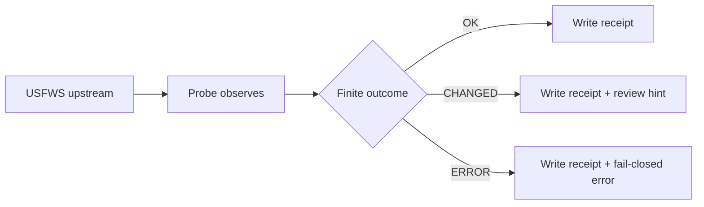

<!-- [KFM_META_BLOCK_V2]
doc_id: kfm://doc/tools/probes/species-watchers/usfws-critical-habitat-probe
title: usfws_critical_habitat_probe
type: standard
version: v1
status: draft
owners: @bartytime4life
created: 2026-04-13
updated: 2026-04-13
policy_label: public-safe
related: [../README.md, ../../README.md, ../../../data/registry/usfws_critical_habitat.yaml, ../../../data/receipts/README.md, ../../../tools/probes/README.md, ../../../tools/validators/README.md, ../../../policy/README.md, ../../../contracts/README.md]
tags: [kfm, probes, species, usfws, critical-habitat, receipts, drift, stewardship]
notes: [Updated from an earlier broader draft into a thinner, release-aligned probe contract. Exact executable wiring, sibling inventory, source-descriptor path, and adjacent lane contents remain NEEDS VERIFICATION on the live branch.]
[/KFM_META_BLOCK_V2] -->

# usfws_critical_habitat_probe

Read-only probe contract for observing authoritative U.S. Fish & Wildlife Service critical-habitat change and recording that observation as **receipts**, not release proof.

> [!NOTE]
> **Status:** draft  
> **Owners:** `@bartytime4life`  
> **Path:** `tools/probes/species_watchers/usfws_critical_habitat_probe.md`  
> **Lane:** `tools/probes/`  
> **Posture:** read-only · fail-closed for uncertain observations · no publish authority  
> **Quick jumps:** [Scope](#scope) · [Repo fit](#repo-fit) · [Inputs](#inputs) · [Exclusions](#exclusions) · [Checks](#checks) · [Finite outcomes](#finite-outcomes) · [Outputs](#outputs) · [Quickstart](#quickstart) · [FAQ](#faq)


> [!IMPORTANT]
> This document defines a **probe contract**.  
> It does **not** claim that a checked-in runnable probe, workflow, or CLI entrypoint has been verified on the mounted branch.

> [!WARNING]
> Critical habitat is a **regulatory boundary source**, not a precise occurrence source.  
> This probe must not imply species presence from habitat overlap alone, and it must not publish exact sensitive geometry merely because the source is federal.

---

## Scope

This probe watches the `usfws_critical_habitat` source for observable upstream change and records bounded process memory for downstream review.

This file is the right place for:

- source-role clarification for USFWS critical-habitat inputs
- probe-side observation rules
- change detection expectations
- receipt output requirements
- finite probe outcomes
- review handoff boundaries

This file is **not** the right place for:

- policy authorship
- promotion logic
- STAC/DCAT/PROV schema ownership
- occurrence ingestion workflows
- exact public publication rules beyond probe-side cautions
- UI rendering or runtime shell choreography

---

## Repo fit

| Direction | Surface | Role |
| --- | --- | --- |
| Current file | `tools/probes/species_watchers/usfws_critical_habitat_probe.md` | thin probe contract for critical-habitat observation |
| Upstream | `../../../data/registry/usfws_critical_habitat.yaml` | source identity and governance anchor |
| Neighbor | `../../README.md` | probes-lane contract *(NEEDS VERIFICATION)* |
| Neighbor | `../README.md` | species-watchers lane index *(NEEDS VERIFICATION)* |
| Downstream | `../../../data/receipts/README.md` | process-memory home for probe outputs |
| Downstream | `../../../tools/validators/README.md` | release-facing validators consume probe receipts |
| Policy boundary | `../../../policy/README.md` | policy semantics stay here, not in the probe |
| Contract boundary | `../../../contracts/README.md` | shared machine/human contract context |

> [!TIP]
> Probe outputs belong in `data/receipts/`, not `data/proofs/`.  
> Receipts remember runs; proofs support releases.

---

## Inputs

The probe accepts explicitly declared inputs only.

| Input | Required | Purpose |
| --- | ---: | --- |
| `source_id` | yes | Must resolve to `usfws_critical_habitat` |
| `upstream_endpoint` | yes | Canonical USFWS source surface |
| `spatial_filter` | yes | Kansas filter or equivalent declared scope |
| `prior_snapshot_ref` | no | Previous observed state for drift comparison |
| `run_id` | yes | Deterministic run identity |
| `as_of` | yes | Observation timestamp |
| `aoi_geometry` | no | Optional bounded AOI for scoped observation |
| `snapshot_uri` | no | Optional bulk snapshot or comparison surface |

### Minimum source expectations

Every accepted source should answer:

- what authority produced it
- whether it is a living service or snapshot
- when it was observed
- what geometry class it returned
- whether Kansas scoping can be applied deterministically

---

## Exclusions

This probe does **not**:

- publish data into `data/published/`
- create release manifests
- approve promotion
- infer policy labels from missing evidence
- ingest community occurrence feeds
- replace occurrence review with habitat review
- author formal ESA consultation outputs

---

## Source basis

The probe treats source roles as distinct and non-interchangeable.

| Source family | Role in this probe | Good for | Main caution |
| --- | --- | --- | --- |
| **USFWS Critical Habitat service** | primary observation surface | current boundary checks, repeated polling, drift detection | living service behavior is not a complete historical archive |
| **ECOS snapshot / bulk baseline** | comparison anchor | reproducible bulk comparison, evidence capture | cadence may differ from live service |
| **Optional AOI response** | scoped context only | bounded local checks | not the replacement for the canonical habitat source |
| **State or range context** | optional enrichment | contextual review support | not occurrence truth |
| **Occurrence overlays** | optional review signal | stewardship escalation | do not merge into habitat truth |

> [!IMPORTANT]
> The probe observes statutory habitat boundaries.  
> It does not elevate those boundaries into direct observational evidence.

---

## Checks

The probe should only assert what can be directly observed from the declared source.

### 1. Source identity
Confirm the declared source maps to `usfws_critical_habitat`.

### 2. Metadata drift
Observe version/date/service-level changes where available.

### 3. Record-count drift
Compare Kansas-filtered counts against prior observed state.

### 4. Geometry drift
Compute a deterministic geometry hash from a normalized view.

### 5. Shape sanity
Confirm the returned structure is polygonal or multipolygonal and not empty.

### 6. Scope applicability
Confirm Kansas or declared AOI scoping can be applied without ambiguity.

> [!CAUTION]
> Probe-side geometry checking is intentionally limited.  
> Final release-grade geometry validation belongs in validators, not probes.

---

## Finite outcomes

The probe emits one of the following finite results:

| Outcome | Meaning |
| --- | --- |
| `OK` | No meaningful upstream change observed |
| `CHANGED` | Observable drift detected; downstream review may be needed |
| `ERROR` | Observation failed or could not be trusted safely |

The probe does **not** emit promotion decisions such as `PROMOTE` or `DENY`.

---

## Outputs

Every run emits:

- machine-readable receipt JSON
- reviewer-readable summary markdown
- optional candidate work-path hint
- explicit finite status

### Expected output pattern

```text
data/receipts/probes/usfws/YYYY-MM-DD/receipt.json
data/receipts/probes/usfws/YYYY-MM-DD/summary.md
```

### Receipt expectations

A receipt should capture:

- source identity
- run timestamp
- observed endpoint
- prior/current comparison state when available
- finite result
- next-action hint without asserting publish authority

---

## Current evidence snapshot

| Item | Status | Use in this file |
| --- | --- | --- |
| KFM treats ecology and biodiversity as governance-bearing, not decorative | **CONFIRMED** | grounds the existence of a stewardship-aware probe |
| Critical habitat belongs to the regulatory / statutory role | **CONFIRMED** | keeps this source distinct from occurrence truth |
| Public release should avoid silent precision escalation | **CONFIRMED** | grounds read-only and review-first posture |
| A dual-surface pattern of live service plus snapshot baseline is useful | **INFERRED** | supports optional comparison shape |
| Exact runnable CLI for this probe exists on the mounted branch | **UNKNOWN** | examples remain explicitly proposed |
| Exact sibling inventory under `tools/probes/species_watchers/` | **UNKNOWN** | lane-local claims stay conservative |
| Exact related-link validity on current branch | **NEEDS VERIFICATION** | links should be rechecked before merge |

---

## Determinism rules

To stay replayable and review-safe, the probe should:

- use explicitly declared source surfaces
- normalize geometry hashing consistently
- record timestamps in UTC
- avoid hidden retries that alter semantics
- avoid policy enrichment
- preserve observed disagreement rather than flattening it away

---

## Failure posture

Fail closed when:

- upstream response is malformed
- geometry cannot be normalized consistently
- source identity cannot be mapped to the registry
- Kansas scope cannot be applied deterministically
- required observation fields are absent

Recommended outcome in these cases: `ERROR`.

---

## Probe-to-review handoff

A `CHANGED` result may hand off a candidate path for review. It does **not** authorize publication.



---

## Quickstart

### Minimal operator flow

1. Resolve `source_id` to `usfws_critical_habitat`.
2. Observe the declared upstream surface.
3. Apply Kansas or declared AOI scoping.
4. Normalize enough structure for deterministic comparison.
5. Compute current observed hashes and counts.
6. Compare against prior observed state if present.
7. Emit receipt + summary with a finite outcome.

### Illustrative invocation

```bash
# PSEUDOCODE — exact runner, flags, and output layout remain NEEDS VERIFICATION
python -m tools.probes.species_watchers.usfws_critical_habitat_probe \
  --source-id usfws_critical_habitat \
  --upstream-endpoint "$USFWS_ENDPOINT" \
  --spatial-filter Kansas \
  --as-of 2026-04-13T14:00:00Z \
  --out data/receipts/probes/usfws/2026-04-13/
```

### Illustrative receipt

```json
{
  "receipt_type": "probe_receipt",
  "probe_id": "usfws_critical_habitat_probe",
  "source_id": "usfws_critical_habitat",
  "ran_at": "2026-04-13T14:00:00Z",
  "status": "CHANGED",
  "observed": {
    "record_count_prior": 141,
    "record_count_current": 143,
    "metadata_version_prior": "2025-12-10",
    "metadata_version_current": "2026-02-01",
    "geometry_hash_prior": "sha256:...",
    "geometry_hash_current": "sha256:..."
  },
  "decision_hint": {
    "next_action": "review_required",
    "promotion_candidate": true
  }
}
```

---

## Usage notes

### Use this probe when the job is to

- monitor authoritative federal habitat boundary change
- preserve source identity and observation timing
- generate reviewable process memory
- trigger downstream validation when drift is detected

### Do not use this probe to

- imply species presence from habitat overlap
- publish exact geometry by default
- replace occurrence review
- bypass policy because the source is federal
- collapse source disagreement into a single silent answer

---

## Operating tables

### Minimal observed fields

| Field | Why it matters | Minimum posture |
| --- | --- | --- |
| `source_id` | stable registry anchor | required |
| `source_record_id` | upstream traceability | preserve when available |
| `species_code` | stable subject identity | preserve when available |
| `species_name` | readable subject label | preserve when available |
| `designation_type` | regulatory status context | preserve |
| `legal_status` | review and runtime context | preserve |
| `effective_date` | legal time anchor | preserve when available |
| `source_uri` | provenance anchor | always record |
| `pull_timestamp` | freshness and audit | always record |
| `spec_hash` | collection/state identity | strongly recommended |
| `geometry_hash` | geometry comparison | strongly recommended |

### Change classes

| Class | Meaning | Typical next action |
| --- | --- | --- |
| `none` | no meaningful observed change | receipt only |
| `minor` | metadata-only or clearly limited drift | receipt + optional note |
| `material` | changed geometry, designation, or legal context | review candidate |
| `sensitive` | changed output would increase precision or stewardship risk | escalate for review |

> [!NOTE]
> These classes are reviewer-facing interpretation aids.  
> The probe’s actual finite machine outcome remains `OK`, `CHANGED`, or `ERROR`.

---

## Task list / Definition of done

- [ ] Registry entry exists for `usfws_critical_habitat`
- [ ] Probe accepts explicit source identity and scope inputs
- [ ] Observation time is recorded in UTC
- [ ] Record-count and geometry drift can be compared against prior state
- [ ] Receipt JSON is emitted for every run
- [ ] Summary markdown is emitted for every run
- [ ] Probe never writes published or proof artifacts
- [ ] Probe fails closed on malformed or ambiguous upstream state
- [ ] A `CHANGED` run can hand off a candidate hint without implying approval

---

## FAQ

### Why is this probe read-only?

Because probes are bounded inspection surfaces. They observe and record; they do not publish or promote.

### Is critical habitat the same thing as an occurrence layer?

No. Critical habitat is regulatory boundary context, not direct observation truth.

### Why keep receipts separate from proofs?

Receipts preserve process memory for runs. Proofs support release review and attestation. They are related but not interchangeable.

### Can the probe use both a live service and a snapshot?

Yes, when both are explicitly declared. The live surface helps with current observation; the snapshot helps with reproducible comparison.

### Can this probe emit a public artifact?

No. At most, it can emit a review hint. Publication belongs downstream.

---

## Appendix

<details>
<summary><strong>Appendix A — Minimal credible thin slice</strong></summary>

A smallest credible first slice for this probe should prove:

- one declared `source_id`
- one declared upstream surface
- one bounded Kansas observation
- one deterministic comparison against prior state
- one receipt
- one reviewer-readable summary
- one finite outcome

</details>

<details>
<summary><strong>Appendix B — Open verification items</strong></summary>

The following remain intentionally open until a live repo check confirms them:

- exact sibling inventory under `tools/probes/species_watchers/`
- exact runner / CLI path
- exact source-descriptor schema path
- exact receipt schema filename
- exact related-link validity on target branch

</details>
