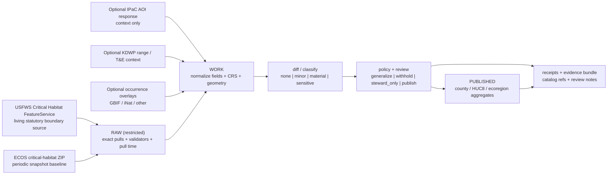

<!-- [KFM_META_BLOCK_V2]
doc_id: kfm://doc/NEEDS_VERIFICATION__assign_uuid
title: USFWS Critical Habitat Probe
type: standard
version: v1
status: draft
owners: @bartytime4life
created: YYYY-MM-DD
updated: YYYY-MM-DD
policy_label: public
related: [../README.md, ../../README.md, ../../../policy/README.md, ../../../contracts/README.md, ../../../schemas/README.md, ../../../data/receipts/README.md, ../../../data/proofs/README.md, ../../../data/catalog/stac/README.md, ../../../data/catalog/dcat/README.md, ../../../data/catalog/prov/README.md]
tags: [kfm, probes, species, usfws, critical-habitat, ecology, stewardship]
notes: [Path is user-specified; doc_id, dates, owner coverage, adjacent lane inventory, and related-link validity need live-repo verification. This file is doctrine-grounded probe guidance, not proof that a checked-in runnable probe already exists on the mounted branch.]
[/KFM_META_BLOCK_V2] -->

# USFWS Critical Habitat Probe

Governed probe contract for monitoring authoritative U.S. Fish & Wildlife Service critical-habitat boundaries and turning them into KFM-safe stewardship outputs.

> **Status:** experimental  
> **Owners:** `@bartytime4life` *(NEEDS VERIFICATION — inferred from adjacent `/tools/` documentation patterns rather than a mounted repo recheck for this exact lane)*  
> **Path:** `tools/probes/species_watchers/usfws_critical_habitat_probe.md`  
> **Repo fit:** standard-doc contract for the `tools/probes/species_watchers/` lane; upstream source-descriptor and policy surfaces should feed it, and downstream receipts, proofs, and catalog surfaces should consume it  
> **Accepted inputs:** registered USFWS Critical Habitat FeatureService URI, registered ECOS critical-habitat snapshot URI, optional AOI geometry, prior receipt/hash state, optional IPaC AOI response for stewardship context  
> **Exclusions:** community-occurrence harvesting, exact rare-species occurrence publication, policy-bundle authorship, formal ESA consultation letters, and UI-shell rendering  
> **Quick jump:** [Scope](#scope) · [Repo fit](#repo-fit) · [Accepted inputs](#accepted-inputs) · [Exclusions](#exclusions) · [Current evidence snapshot](#current-evidence-snapshot) · [Source basis](#source-basis) · [Quickstart](#quickstart) · [Usage](#usage) · [Diagram](#diagram) · [Operating tables](#operating-tables) · [Task list](#task-list--definition-of-done) · [FAQ](#faq) · [Appendix](#appendix)


> [!IMPORTANT]
> This file defines a **probe contract** for statutory habitat boundaries.  
> It does **not** claim that a mounted runnable probe, workflow, schema pack, or checked-in source descriptor for this lane was directly verified in the current session.

> [!WARNING]
> In KFM, critical-habitat boundaries are not the same thing as precise occurrence truth.  
> Raw or sub-county geometry should stay restricted by default, and public release should prefer county, HUC8, or ecoregion aggregation unless steward review explicitly closes a finer-grained path.

---

## Scope

This document defines the intended behavior of a KFM probe that watches authoritative USFWS critical-habitat sources, records stable evidence of change, and prepares only policy-safe outputs for downstream publication.

This file is the right place for:

- source-role clarification for USFWS critical-habitat inputs
- probe-side fetch, snapshot, normalization, and diff expectations
- minimum field and evidence requirements
- publication-class boundaries
- review hooks for stewardship-sensitive outputs
- bounded quickstart and usage guidance for this lane

This file is **not** the right place for:

- canonical policy-bundle authorship
- exact occurrence ingestion logic for GBIF, iNaturalist, or eBird
- UI rendering or Evidence Drawer choreography
- formal ESA consultation workflow generation
- claims about merge-blocking enforcement that were not directly verified

### Truth labels used in this file

| Label | Meaning here |
| --- | --- |
| **CONFIRMED** | Directly supported by attached KFM doctrine or adjacent attached KFM documentation examples |
| **INFERRED** | Strongly suggested by the corpus or target path, but not directly proven as mounted repo reality |
| **PROPOSED** | Recommended implementation shape consistent with the corpus |
| **UNKNOWN** | Not verified strongly enough in the current session |
| **NEEDS VERIFICATION** | Reviewer fill-in or live-repo check required before treating the value as settled |

[Back to top](#usfws-critical-habitat-probe)

---

## Repo fit

| Direction | Surface | Role in this file |
| --- | --- | --- |
| Current file | `tools/probes/species_watchers/usfws_critical_habitat_probe.md` | probe-specific contract for statutory habitat boundary intake |
| Upstream candidate | [`../README.md`](../README.md) | likely species-watcher lane index *(NEEDS VERIFICATION)* |
| Upstream candidate | [`../../README.md`](../../README.md) | likely probes-lane boundary doc *(NEEDS VERIFICATION)* |
| Authority neighbor | [`../../../contracts/README.md`](../../../contracts/README.md) | human-readable contract context |
| Authority neighbor | [`../../../schemas/README.md`](../../../schemas/README.md) | machine-schema home for any future probe records |
| Control-plane neighbor | [`../../../policy/README.md`](../../../policy/README.md) | policy semantics stay here, not in the probe |
| Downstream candidate | [`../../../data/receipts/README.md`](../../../data/receipts/README.md) | run receipts and fetch evidence |
| Downstream candidate | [`../../../data/proofs/README.md`](../../../data/proofs/README.md) | evidence bundles and release-grade proof objects |
| Downstream candidate | [`../../../data/catalog/stac/README.md`](../../../data/catalog/stac/README.md) · [`../../../data/catalog/dcat/README.md`](../../../data/catalog/dcat/README.md) · [`../../../data/catalog/prov/README.md`](../../../data/catalog/prov/README.md) | outward catalog closure after review and aggregation |

> [!NOTE]
> The path above is grounded by the user-specified target.  
> The neighboring links are deliberately conservative and should be rechecked against the live branch before commit.

---

## Accepted inputs

The probe may accept the following input classes:

1. A registered **USFWS Critical Habitat FeatureService** URI used as the living, queryable boundary source.
2. A registered **ECOS critical-habitat bulk snapshot** URI used as a periodic baseline or cross-check.
3. Optional **AOI geometry** for scoped pulls, review, or local impact checks.
4. Optional **IPaC location response** used as AOI-specific consultation context, not as the replacement for the critical-habitat anchor.
5. Prior **hash / receipt / manifest state** for change classification and idempotent re-runs.
6. Optional reviewer-supplied **aggregation target** such as county, HUC8, or ecoregion.

### Minimum source expectations

Every accepted source should arrive with enough metadata to answer:

- what authority it comes from
- whether it is living or snapshot-like
- what pull time and validators were observed
- what geometry class and CRS were delivered
- whether the result is suitable for raw storage only, steward review, or public-safe aggregation

---

## Exclusions

This probe should **not** silently absorb responsibilities that belong elsewhere.

| Excluded responsibility | Where it belongs instead |
| --- | --- |
| Precise occurrence ingestion from GBIF / iNaturalist / eBird | separate occurrence or biodiversity ingest lane |
| Publishing exact rare-species or exact occurrence coordinates | restricted stewardship path only |
| Policy-decision authorship | policy lane and review surfaces |
| Formal ESA consultation packet generation | dedicated regulatory workflow |
| Narrative, story, or shell rendering | governed API and UI surfaces |
| Community-observation truth elevation | evidence review, corroboration, and stewardship workflows |

---

## Current evidence snapshot

| Evidence item | Status | How this file uses it |
| --- | --- | --- |
| KFM treats ecology and biodiversity as a structural lane with publication burden, not decorative content | **CONFIRMED** | grounds the existence of a stewardship-sensitive probe in this area |
| The ecology lane explicitly includes statutory and critical-habitat ingest from **USFWS ECOS / IPaC** | **CONFIRMED** | grounds the source basis of this probe |
| KFM doctrine distinguishes statutory records, direct observations, documentary material, and community-contributed data | **CONFIRMED** | prevents critical-habitat boundaries from being treated as occurrence truth |
| The attached corpus recommends **public-safe generalized** versus **steward-only precise** publication classes for biodiversity work | **CONFIRMED** | grounds the default aggregation and withholding posture |
| Attached working notes describe a dual-source pattern: **live FeatureService** plus **ECOS ZIP snapshot**, preserved with hashes, pull times, and FR citation context | **CONFIRMED** | grounds the recommended probe lifecycle |
| The current session directly exposed a PDF-rich corpus, not a mounted KFM repo tree | **CONFIRMED** | forces bounded claims about checked-in code, schemas, or workflows |
| The exact sibling inventory under `tools/probes/species_watchers/` | **UNKNOWN** | no broader lane claims are made here |
| A checked-in runnable CLI entrypoint for this exact probe | **UNKNOWN** | quickstart examples are marked pseudocode |
| Exact owner coverage for this exact file path | **NEEDS VERIFICATION** | owner field is conservative and should be rechecked at commit time |

---

## Source basis

The probe should treat source roles as first-class, not as interchangeable fetch targets.

| Source family | Role in this probe | What it is good for | Main caution |
| --- | --- | --- | --- |
| **USFWS Critical Habitat FeatureService** | living statutory boundary source | queryable current features, repeated polling, delta-oriented checks | do not confuse “updated as needed” with a full historical snapshot archive |
| **ECOS critical-habitat bulk snapshot** | periodic baseline / evidence anchor | reproducible bulk comparison, exact snapshot capture, evidence bundles | snapshot cadence differs from live service behavior |
| **IPaC Location API** | AOI-specific regulatory context | “what is in this footprint now” checks, consultation context | snapshot probe only; not the replacement for the federal boundary anchor |
| **KDWP range / T&E context** | Kansas-side statutory context | state listing context, range-map comparison, public-facing context | range maps are not precise occurrences |
| **GBIF / iNaturalist overlays** | optional stewardship overlay input | intersecting occurrence context and review triggers | public resharing must honor geoprivacy and generalization rules |
| **NatureServe** | contextual sensitivity and review pressure | provider context, sensitivity cues, review-sensitive enrichments | licensing and precision constraints remain visible |

> [!IMPORTANT]
> Critical habitat belongs in the **statutory / administrative** role.  
> It is authoritative for regulatory boundary context, but it must not silently replace direct observational evidence or precise occurrence records.

---

## Quickstart

### Minimal operator flow

1. Register the live FeatureService URI and the snapshot URI in a source descriptor.
2. Pull both into restricted raw storage with validators, pull timestamps, and content hashes.
3. Normalize geometry and required fields into a stable comparison shape.
4. Compute feature- and collection-level digests.
5. Classify changes as none, minor, material, or sensitive.
6. Run policy and review checks before any outward publication.
7. Publish only aggregated or otherwise policy-safe outputs by default.

### Illustrative invocation

```bash
# PSEUDOCODE — exact runner, config path, and output layout NEED VERIFICATION
python tools/probes/run_probe.py \
  --probe usfws_critical_habitat \
  --source-descriptor configs/sources/usfws_critical_habitat.yml \
  --aoi path/to/aoi.geojson \
  --out data/work/species_watchers/usfws_critical_habitat/
```

### Illustrative review handoff

```bash
# PSEUDOCODE — exact filenames and validators NEED VERIFICATION
python tools/validators/review_bundle.py \
  --input data/work/species_watchers/usfws_critical_habitat/run_receipt.json \
  --proof data/proofs/species_watchers/usfws_critical_habitat/evidence_bundle.json \
  --out data/work/species_watchers/usfws_critical_habitat/review_handoff.md
```

> [!TIP]
> If the live service and the snapshot disagree, preserve both states and make the conflict visible.  
> The probe should not “fix” the disagreement by flattening it away.

---

## Usage

### What this probe is for

Use this probe when the job is to:

- monitor authoritative federal habitat boundary change
- preserve exact boundary-source identity
- feed KFM stewardship overlays and review queues
- prepare public-safe aggregates for maps or dossiers
- trigger analyst review when another dataset intersects critical habitat
- preserve Federal Register context alongside geometry

### What this probe is not for

Do **not** use this probe to:

- imply species presence from boundary membership alone
- publish precise protected-area geometry as the default public path
- replace occurrence review with habitat review
- bypass policy because the source is federal
- treat AOI snapshots as a complete historical baseline

---

## Diagram



---

## Operating tables

### Minimal field registry

| Field | Why it matters | Minimum posture |
| --- | --- | --- |
| `sciname` | stable scientific name context | preserve from source, do not silently rewrite |
| `comname` | readable common-name context | preserve where present |
| `source_id` / `entity_id` | stable federal identity anchor | required for diffing and cross-reference |
| `status` | listing context | preserve source semantics |
| `type` | `Final` vs `Proposed` or equivalent designation | required for review and portrayal logic |
| `fr_publication_date` | legal/regulatory time anchor | preserve if available |
| `fr_citation` | regulatory traceability | preserve if available |
| `geometry` | actual critical-habitat boundary | restricted by default until publication class is resolved |
| `source_uri` | provenance anchor | always record |
| `pull_timestamp` | freshness and audit | always record |
| `spec_hash` | canonical collection identity | required |
| `geometry_digest` | stable geometry comparison | strongly recommended |
| `policy_label` | publication control | required before outward release |
| `needs_steward_review` | explicit review handoff flag | required when occurrence or other sensitive overlays intersect |

### Change classes

| Class | Meaning | Typical action |
| --- | --- | --- |
| `none` | identical authoritative state after normalization | skip publish, keep receipt |
| `minor` | metadata-only or clearly non-consequential change | log and retain proof |
| `material` | changed geometry, status, designation type, or FR context | prepare reviewable release candidate |
| `sensitive` | changed output would increase precision or stewardship risk | withhold or steward-only pending review |

### Output classes

| Output | Audience | Default visibility | Notes |
| --- | --- | --- | --- |
| Raw live pull | internal only | restricted | exact service payload or response capture |
| Raw snapshot bundle | internal only | restricted | exact ZIP or equivalent evidence anchor |
| Normalized geometry package | internal review | restricted | comparison-ready form, not public by default |
| Diff report | reviewer / auditor | internal | explicit prior/current comparison |
| Run receipt | reviewer / proof surfaces | internal | pull time, validators, source refs, hashes |
| Evidence bundle | reviewer / auditor | internal | links receipts, proof objects, and review context |
| County / HUC8 / ecoregion aggregate | public-safe | conditional public | default outward class |
| Sub-county or exact geometry export | steward-only | withheld by default | requires explicit sign-off |

### Negative outcomes to keep visible

| Outcome | When it is valid | What should remain visible |
| --- | --- | --- |
| `DENY` | rights, sensitivity, or publication rules are unresolved | reason codes, obligations, audit linkage |
| `ABSTAIN` | the probe cannot support a confident outward interpretation | visible incompleteness, not silent omission |
| `ERROR` | fetch, validation, or packaging failed | runtime trace and repair path |
| `QUARANTINE` | data is malformed, ambiguous, or too sensitive for current release intent | restricted storage and review state |

---

## Task list / Definition of done

- [ ] A source descriptor exists for the live FeatureService URI.
- [ ] A source descriptor exists for the ECOS snapshot URI.
- [ ] Pull-time validators, timestamps, and content hashes are captured for every run.
- [ ] Required identity and regulatory fields are preserved without flattening source semantics.
- [ ] Geometry validity, CRS, and deterministic normalization rules are defined.
- [ ] A stable `spec_hash` and geometry digest are emitted.
- [ ] Prior/current diffing produces an explicit change class.
- [ ] Any intersecting occurrence or stewardship overlay can raise `needs_steward_review`.
- [ ] Raw and exact geometries stay in restricted lanes by default.
- [ ] Public outputs default to county, HUC8, or ecoregion aggregation.
- [ ] Any finer-grained release requires explicit steward sign-off.
- [ ] A run receipt and evidence bundle are emitted for every material run.
- [ ] Downstream catalog references are prepared only after publication class is resolved.
- [ ] Negative outcomes are rendered as valid governed states, not hidden failures.

[Back to top](#usfws-critical-habitat-probe)

---

## FAQ

### Why use both the FeatureService and the ECOS snapshot?

They serve different trust jobs. The FeatureService is the living, queryable source for repeated checks; the snapshot is the reproducible baseline that can be preserved in an evidence bundle.

### Is critical habitat the same as a species occurrence layer?

No. This probe handles statutory habitat boundaries. It should not be used to imply precise occurrence truth.

### Why are county or HUC8 aggregates the default public path?

Because KFM treats ecology and rare-species-adjacent geography as review-bearing. Aggregation reduces precision risk and better matches public-safe publication.

### Does this probe replace IPaC?

No. IPaC is useful for AOI-specific context and stewardship checks. It is not the replacement for the critical-habitat boundary anchor.

### Can this probe join occurrence datasets?

Yes, but only as an optional review aid. Any occurrence intersection should raise a stewardship flag, and public outputs should still honor source geoprivacy and KFM precision controls.

---

## Appendix

<details>
<summary><strong>Appendix A — Minimal release posture</strong></summary>

A smallest credible first release for this probe should prove:

- one registered live critical-habitat source
- one registered snapshot source
- one exact raw capture into restricted storage
- one normalized comparison object with stable hashes
- one explicit diff result
- one policy-safe aggregate output
- one receipt / evidence handoff that preserves source identity, timing, and review state

</details>

<details>
<summary><strong>Appendix B — Review questions</strong></summary>

Before promotion, reviewers should be able to answer:

1. Which federal source produced the current boundary state?
2. Is the change actually geometric, or only metadata-level?
3. Did the designation type or Federal Register context change?
4. Is any outward precision greater than the approved publication class?
5. If an occurrence overlay was used, does the result require steward review?
6. Can a public reader still distinguish statutory habitat context from direct occurrence evidence?

</details>

<details>
<summary><strong>Appendix C — Open verification items</strong></summary>

The following remain intentionally open until a live repo check confirms them:

- sibling inventory under `tools/probes/species_watchers/`
- exact runner/CLI path
- exact source-descriptor schema path
- exact receipt/proof schema filenames
- exact owner coverage for this file path
- whether the downstream data/catalog paths are already checked in on the target branch

</details>
