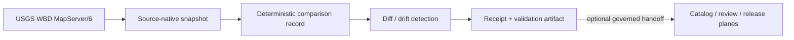

<!-- [KFM_META_BLOCK_V2]
doc_id: kfm://doc/NEEDS-UUID
title: WBD HUC12 Probe
type: standard
version: v1
status: draft
owners: NEEDS VERIFICATION
created: YYYY-MM-DD
updated: YYYY-MM-DD
policy_label: NEEDS VERIFICATION
related: [tools/probes/wbd_huc12_probe/README.md, NEEDS_VERIFICATION]
tags: [kfm, hydrology, wbd, huc12, probe]
notes: [Target path inferred from supplied draft; mounted repo tree beyond confirmed root directories was not directly visible in this session.]
[/KFM_META_BLOCK_V2] -->

# WBD HUC12 Probe

Bounded, read-only monitoring guidance for the USGS Watershed Boundary Dataset HUC12 layer as a hydrology-first KFM thin slice.


| Field | Value |
| --- | --- |
| Status | `experimental` |
| Owners | `NEEDS VERIFICATION` |
| Evidence posture | `CONFIRMED doctrine + CONFIRMED WBD service context + INFERRED local path and CLI` |
| Quick jumps | [Scope](#scope) · [Repo fit](#repo-fit) · [Accepted inputs](#accepted-inputs) · [Exclusions](#exclusions) · [Directory tree](#directory-tree) · [Quickstart](#quickstart) · [Usage](#usage) · [Diagram](#diagram) · [Comparison basis and artifacts](#comparison-basis-and-artifacts) · [Task list](#task-list) · [FAQ](#faq) |

> [!IMPORTANT]
> Mounted evidence in this session confirmed the repository root directories, but did **not** surface a live `tools/probes/wbd_huc12_probe/` tree or local implementation files. Pathing below is therefore marked where needed as `INFERRED`, `PROPOSED`, or `NEEDS VERIFICATION`.

## Scope

This probe exists to watch the authoritative WBD HUC12 layer, not to publish new truth.

It is intended to:

- fetch a bounded HUC12 snapshot from the USGS WBD ArcGIS service
- preserve the fetched payload as source-native evidence
- compare stable hydrologic identity and geometry across runs
- emit machine-checkable probe artifacts that can feed later review, diff, or release work

It is **not** the place to make policy decisions, publish catalog closures, or mutate canonical geometry.

## Repo fit

| Item | Value |
| --- | --- |
| Path | `INFERRED / PROPOSED — tools/probes/wbd_huc12_probe/README.md` |
| Repo roots confirmed in session | [`../../../tools/`](../../../tools/) · [`../../../data/`](../../../data/) · [`../../../contracts/`](../../../contracts/) · [`../../../policy/`](../../../policy/) · [`../../../docs/`](../../../docs/) · [`../../../tests/`](../../../tests/) |
| Upstream neighbors | [`../../../contracts/`](../../../contracts/) for contract surfaces · [`../../../data/`](../../../data/) for source, snapshot, and catalog zones |
| Downstream neighbors | [`../../../policy/`](../../../policy/) for gates · [`../../../docs/`](../../../docs/) for runbooks and architecture docs · [`../../../tests/`](../../../tests/) for fixtures and validation |

### Why this README belongs in a hydrology-first slice

KFM repeatedly treats hydrology as the preferred first governed thin slice because it is public-safe, place-and-time rich, and operationally legible. WBD HUC12 is a natural fit for that slice because it gives a stable hydrologic boundary key for joins, rollups, and evidence drill-through.

## Accepted inputs

| Input | Status | What belongs here |
| --- | --- | --- |
| WBD HUC12 service endpoint | `CONFIRMED` | The authoritative USGS WBD ArcGIS layer for HUC12 boundaries |
| Query predicate | `CONFIRMED` | A bounded `where` clause or other service-side filter for the requested scope |
| Area of interest | `CONFIRMED` | Kansas-wide or smaller spatial scope used only to limit the fetch |
| Stable hydrologic keys | `CONFIRMED` | HUC12 identifiers and other fields needed to compare one run to another |
| Service metadata | `INFERRED` | Response headers or layer metadata useful for refresh checks and receipts |
| Local probe config | `PROPOSED` | Any repo-local YAML, JSON, or CLI flags used to parameterize the run |

## Exclusions

| This does **not** belong here | Where it goes instead |
| --- | --- |
| Catalog publication or dataset release | Catalog / release planes under `../../../data/`, `../../../contracts/`, and governed publication workflows |
| Rights, sensitivity, or steward approval decisions | `../../../policy/` and review / stewardship surfaces |
| Focus Mode, Evidence Drawer, or public-facing runtime answers | Governed API + UI contract work under `../../../contracts/` and `../../../docs/` |
| NHDPlus HR traversal, flow routing, or catchment analysis | Separate hydro network tooling; do not overload this boundary probe |
| Canonical geometry rewrite, simplification, or repair | Canonical build / repair lanes, not a read-only probe |

> [!WARNING]
> Normalization for hashing is acceptable. Authoritative geometry rewriting is not. A probe may simplify data for comparison logic, but it must never present that temporary representation as canonical truth.

## Directory tree

**INFERRED starter shape — needs repo verification**

```text
tools/
└── probes/
    └── wbd_huc12_probe/
        ├── README.md
        ├── probe.py                  # PROPOSED
        ├── fixtures/                 # PROPOSED
        ├── tests/                    # PROPOSED
        └── examples/                 # PROPOSED
```

## Quickstart

### 1. Fetch a bounded HUC12 slice from the service

```bash
curl "https://hydro.nationalmap.gov/arcgis/rest/services/wbd/MapServer/6/query?where=states%20LIKE%20'%25KS%25'&outFields=*&f=geojson"
```

### 2. Illustrative local invocation

```bash
# NEEDS VERIFICATION: local CLI shape and file path
python tools/probes/wbd_huc12_probe/probe.py \
  --service-url "https://hydro.nationalmap.gov/arcgis/rest/services/wbd/MapServer/6" \
  --where "states LIKE '%KS%'"
```

> [!NOTE]
> The external service query is grounded in the supplied draft and recent hydrology notes. The local CLI example is a proposed interface, not confirmed mounted implementation.

## Usage

### Operating pattern

| Step | Purpose | Expected artifact posture |
| --- | --- | --- |
| 1. Declare the source | Freeze endpoint, scope, cadence, and intent | `SourceDescriptor` or equivalent intake contract |
| 2. Fetch a source-native snapshot | Preserve what the service returned for this run | Raw snapshot + `IngestReceipt` or equivalent |
| 3. Normalize a comparison record | Build a deterministic, non-authoritative comparison object | Validation-friendly intermediate record |
| 4. Compare against prior state | Detect additions, removals, or materially changed boundaries | Diff summary or `ValidationReport` |
| 5. Hand off, if needed | Feed later review or release work without publishing directly | Receipt / audit refs only; no direct publish |

### Read-only rule

This probe should behave like a watcher, not a repair lane. It may read authoritative sources and emit receipts, but it should not back-write into canonical truth, derived delivery layers, or public runtime surfaces.

## Diagram



## Comparison basis and artifacts

### Stable comparison basis

| Signal | Status | Why it matters |
| --- | --- | --- |
| `huc12` | `CONFIRMED` | Primary hydrologic identity key |
| geometry | `CONFIRMED` | Material boundary drift must be visible |
| `name` | `INFERRED` | Useful human-facing context if the service exposes it |
| `areasqkm` | `INFERRED` | Helpful secondary drift check for area changes |
| `states` | `INFERRED` | Useful for Kansas scoping in sample queries |
| `LoadDate` / `lastEditDate` | `NEEDS VERIFICATION` | Helpful service metadata, but not sufficient on their own to define material change |
| `ETag` / `Last-Modified` | `NEEDS VERIFICATION` | Efficient refresh hints only if the service actually returns them for the request shape you use |

### Minimum KFM-aligned artifact expectations

| Artifact family | Status in KFM doctrine | Why it matters here |
| --- | --- | --- |
| `SourceDescriptor` | `CONFIRMED` doctrinal contract family | Declares intake scope and validation intent |
| `IngestReceipt` | `CONFIRMED` doctrinal contract family | Proves the fetch and landing event happened |
| `ValidationReport` | `CONFIRMED` doctrinal contract family | Records pass/fail and detected drift |
| Probe diff summary | `PROPOSED` for this README | Gives maintainers a reviewable change object |
| `DatasetVersion` or release artifacts | `OPTIONAL / LATER` | Only needed if this probe feeds a promoted slice |

### Material-change stance

A good probe should prefer stable, decomposable comparisons over shallow metadata churn. Treat geometry and stable identity as primary. Treat service timestamps and edit markers as supporting context unless the live service contract proves they are sufficient for the change class you care about.

## Task list

### Definition of done for a first credible slice

- [ ] A source descriptor exists for the WBD HUC12 endpoint and scope.
- [ ] Every fetch emits a receipt with run time, source reference, and integrity checks.
- [ ] The comparison record is deterministic and explicitly non-authoritative.
- [ ] Diff output distinguishes add, remove, and changed-boundary cases.
- [ ] The probe never writes into canonical, catalog, or published layers directly.
- [ ] At least one valid fixture and one failing fixture exist under `tests/` or equivalent.
- [ ] README links and local paths have been verified against the mounted repo tree.

### Gate conditions before this probe should be treated as active

- [ ] Live service fields and response behavior have been rechecked.
- [ ] Header-level freshness hints have been verified for the chosen query pattern.
- [ ] Any local CLI shape in this README matches the real implementation.
- [ ] Downstream review / publication handoff is documented elsewhere.

## FAQ

### Why WBD HUC12 first?

Because WBD HUC12 gives stable hydrologic boundary identity with strong place and time semantics, and hydrology is KFM’s preferred first thin slice.

### Why not start with NHDPlus HR here?

NHDPlus HR is better suited to flow-network and catchment analysis. This README is scoped to a boundary probe, not a full hydro network toolchain.

### Why not use `lastEditDate` alone?

Because a metadata update is not the same thing as a material boundary change. Use service metadata as supporting evidence, not as the only drift signal.

### Does this probe publish data?

No. Its job is bounded observation, comparison, and evidence-bearing handoff.

## Appendix

<details>
<summary><strong>Illustrative probe output shape</strong></summary>

```json
{
  "probe_id": "wbd-huc12",
  "source": "https://hydro.nationalmap.gov/arcgis/rest/services/wbd/MapServer/6",
  "queried_at": "YYYY-MM-DDT00:00:00Z",
  "scope": {
    "where": "states LIKE '%KS%'"
  },
  "change_state": "unknown",
  "feature_count": 0,
  "artifacts": []
}
```

This example is intentionally minimal. The exact schema should be verified against the real implementation and, where appropriate, aligned to KFM contract families such as `IngestReceipt` and `ValidationReport`.
</details>

<details>
<summary><strong>Illustrative field shortlist to verify against the live service</strong></summary>

```text
huc12
name
areasqkm
states
LoadDate
lastEditDate
```

Use the live layer contract to confirm exact field names before freezing tests or code.
</details>

[Back to top](#wbd-huc12-probe)
