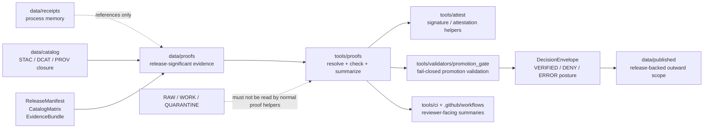

<!-- [KFM_META_BLOCK_V2]
doc_id: kfm://doc/NEEDS-VERIFICATION
title: tools/proofs/
type: standard
version: v1
status: draft
owners: NEEDS VERIFICATION
created: NEEDS_VERIFICATION_YYYY-MM-DD
updated: 2026-04-24
policy_label: NEEDS VERIFICATION
related: [../README.md, ../attest/README.md, ../validators/README.md, ../ci/README.md, ../../data/proofs/README.md, ../../data/receipts/README.md, ../../data/catalog/README.md, ../../schemas/contracts/v1/README.md, ../../policy/README.md, ../../tests/README.md]
tags: [kfm, tools, proofs, proof-pack, release-evidence, promotion, validation]
notes: [Target path requested by current task. Current session did not expose a mounted KFM checkout, so owner, creation date, policy label, exact executable inventory, and workflow wiring remain NEEDS VERIFICATION.]
[/KFM_META_BLOCK_V2] -->

<a id="top"></a>

# `tools/proofs/`

Bounded helper lane for resolving, checking, and summarizing proof-bearing KFM artifacts without becoming the proof store, policy authority, or promotion gate.

> [!NOTE]
> **Status:** experimental  
> **Owners:** NEEDS VERIFICATION  
> **Path:** `tools/proofs/README.md`  
> **Path status:** NEEDS VERIFICATION unless the real checkout confirms this lane already exists or the current PR creates it  
> **Repo fit:** child lane under [`../README.md`](../README.md); adjacent to [`../attest/README.md`](../attest/README.md), [`../validators/README.md`](../validators/README.md), [`../ci/README.md`](../ci/README.md), [`../diff/README.md`](../diff/README.md), and [`../probes/README.md`](../probes/README.md); downstream of durable proof instances in [`../../data/proofs/README.md`](../../data/proofs/README.md)  
> **Quick jumps:** [Scope](#scope) · [Repo fit](#repo-fit) · [Inputs](#inputs) · [Exclusions](#exclusions) · [Current snapshot](#current-snapshot) · [Directory tree](#directory-tree) · [Quickstart](#quickstart) · [Usage](#usage) · [Diagram](#diagram) · [Reference tables](#reference-tables) · [Task list](#task-list--definition-of-done) · [FAQ](#faq) · [Appendix](#appendix)


> [!IMPORTANT]
> `tools/proofs/` is a **helper seam**, not an authority seam.
>
> It may read proof-bearing artifacts, resolve proof references, compare expected and observed proof shape, and emit reviewer-friendly summaries. It must not store release proof objects, decide policy, publish artifacts, sign artifacts, mutate canonical data, or treat process receipts as release proof.

---

## Scope

`tools/proofs/` exists to make KFM proof evidence easier to inspect and harder to drift.

A helper in this lane should answer narrow questions such as:

- Does a declared `proof_ref` resolve to an existing proof object?
- Does a release candidate carry the expected proof families?
- Does a `ProofPack` point to the expected `ReleaseManifest`, `CatalogMatrix`, `EvidenceBundle`, review, correction, and rollback references?
- Does a reviewer-facing summary accurately describe the machine-readable proof check?
- Did a proof check fail closed when proof support was missing, malformed, stale, mismatched, or policy-blocked?

### The lane’s one-sentence posture

`tools/proofs/` helps **inspect and report proof linkage**; it does not create KFM truth by itself.

### Truth labels used here

| Label | Meaning in this README |
|---|---|
| **CONFIRMED** | Verified from the current task, attached doctrine, or visible current-session workspace evidence. |
| **INFERRED** | Strongly suggested by adjacent KFM documentation patterns, but not directly verified from a mounted checkout in this session. |
| **PROPOSED** | Recommended helper shape or workflow that still needs implementation evidence. |
| **UNKNOWN** | Not verified because the target repo, workflows, tests, runtime outputs, and emitted artifacts were not mounted. |
| **NEEDS VERIFICATION** | Concrete item to check before merge, enforcement, or stronger documentation claims. |

[Back to top](#top)

---

## Repo fit

`tools/proofs/` sits between durable proof-bearing data and the tools that consume proof evidence during validation, review, promotion, rollback, and correction.

| Direction | Surface | Relationship |
|---|---|---|
| Parent | [`../README.md`](../README.md) | Owns the broader `tools/` contract and should link this lane once the path is confirmed. |
| Lateral | [`../attest/README.md`](../attest/README.md) | Signature and attestation helpers belong there. This lane may consume verification result references, but must not sign or attest. |
| Lateral | [`../validators/README.md`](../validators/README.md) | Validators decide whether schemas, policies, source descriptors, or promotion candidates pass. This lane only resolves and summarizes proof evidence. |
| Lateral | [`../validators/promotion_gate/README.md`](../validators/promotion_gate/README.md) | Promotion gates may consume proof-check reports, but the gate owns promotion decisions. |
| Lateral | [`../ci/README.md`](../ci/README.md) | CI helpers may render proof summaries, comments, or artifacts from reports emitted here. |
| Lateral | [`../diff/README.md`](../diff/README.md) | Diff helpers compare structured artifacts. This lane may ask for diff evidence, but should not absorb diff logic. |
| Lateral | [`../probes/README.md`](../probes/README.md) | Probes inspect freshness or status. Proof helpers should not become live source probes. |
| Upstream data | [`../../data/proofs/README.md`](../../data/proofs/README.md) | Durable proof instances belong there, not under `tools/`. |
| Upstream data | [`../../data/receipts/README.md`](../../data/receipts/README.md) | Run memory and validation memory belong there; receipts are not release proof. |
| Upstream data | [`../../data/catalog/README.md`](../../data/catalog/README.md) | Catalog closure can be checked as proof support but remains a catalog responsibility. |
| Downstream | [`../../.github/workflows/README.md`](../../.github/workflows/README.md) | Workflow callers may run proof helpers only after local commands and fixtures are verified. |
| Contracts | [`../../contracts/README.md`](../../contracts/README.md), [`../../schemas/contracts/v1/README.md`](../../schemas/contracts/v1/README.md) | Object meaning and executable schema shape belong in contracts and schemas, not helper code. |
| Policy | [`../../policy/README.md`](../../policy/README.md) | Rights, sensitivity, promotion, and release rules stay policy-owned. |
| Tests | [`../../tests/README.md`](../../tests/README.md) | Valid and invalid proof fixtures should live under test surfaces, not hidden inside helper scripts. |

[Back to top](#top)

---

## Inputs

### Accepted inputs

Use `tools/proofs/` for small, declared, reviewable inputs.

| Input class | Examples | Why it belongs here |
|---|---|---|
| Proof references | `proof_ref`, `proof_pack_ref`, `release_manifest_ref`, `evidence_bundle_ref` | Proof helpers can resolve references and fail closed when a required proof cannot be found. |
| Release proof artifacts | `release-proof-pack.json`, `candidate-proof-pack.json`, `proof-bundle.json` | These are the objects this lane may inspect. Durable copies still belong under `data/proofs/`. |
| Promotion-adjacent objects | `ReleaseManifest`, `CatalogMatrix`, `PromotionDecision`, `DecisionEnvelope` | Proof helpers may verify linkage across release-significant artifacts. |
| Evidence support objects | `EvidenceBundle`, `EvidenceRef`, review records, correction notices | These help prove whether a public claim or release is supportable. |
| Attestation or verification results | `decision-sign-result.json`, `decision-verify-result.json`, detached signature metadata | This lane may confirm presence and shape. Signing and signature verification remain `tools/attest/` responsibilities. |
| Digest and integrity inputs | `checksums.txt`, digest maps, artifact URI + expected digest pairs | Useful for checking whether proof statements align with artifact identity. |
| Synthetic fixtures | valid proof pack, missing proof, mismatched digest, stale proof, invalid citation support | Negative paths are first-class KFM evidence tests. |
| Reviewer-summary templates | Markdown summary fragments, compact CI artifacts, PR comment inputs | Review-facing derived summaries can be generated from proof-check reports. |

### Input rules

1. Prefer declared file paths or KFM refs over implicit environment scraping.
2. Treat missing proof as a blocking condition, not a warning to smooth over.
3. Keep proof helpers deterministic and safe to run without network access unless a separate probe lane explicitly provides a verified source.
4. Preserve the upstream object shape instead of inventing helper-only alternatives.
5. Keep public fixtures small, synthetic, and rights-safe.
6. Do not let a helper read `RAW`, `WORK`, `QUARANTINE`, unpublished source captures, secrets, or exact sensitive coordinates.

[Back to top](#top)

---

## Exclusions

| Does **not** belong here | Put it here instead | Why |
|---|---|---|
| Durable release proof objects | [`../../data/proofs/README.md`](../../data/proofs/README.md) | Tools are executable seams; proof artifacts are evidence-bearing instances. |
| Run receipts, validation receipts, AI receipts, process memory | [`../../data/receipts/README.md`](../../data/receipts/README.md) | Receipts document what happened; they are not release proof. |
| Canonical object definitions | [`../../contracts/README.md`](../../contracts/README.md) | Human semantic contracts should not be hidden in tool code. |
| JSON Schema authority | [`../../schemas/contracts/v1/README.md`](../../schemas/contracts/v1/README.md) | Executable shape belongs in schema lanes. |
| Rights, sensitivity, promotion, or runtime policy | [`../../policy/README.md`](../../policy/README.md) | Policy rules stay policy-owned and fail closed. |
| Promotion decision logic | [`../validators/promotion_gate/README.md`](../validators/promotion_gate/README.md) | Promotion is a governed state transition, not a proof-helper side effect. |
| Signature creation or attestation publishing | [`../attest/README.md`](../attest/README.md) | Signing and attestation are separate supply-chain responsibilities. |
| CI-only Markdown rendering | [`../ci/README.md`](../ci/README.md) | CI presentation helpers should not become proof-check authorities. |
| Stable artifact diffing | [`../diff/README.md`](../diff/README.md) | Diff logic should stay reusable and independent. |
| Source probing, freshness checks, or network fetches | [`../probes/README.md`](../probes/README.md) or pipeline lanes | Proof helpers should consume declared proof inputs, not harvest evidence. |
| Published outward artifacts | [`../../data/published/README.md`](../../data/published/README.md) | Publication is downstream of release proof. |
| Raw source captures or unpublished candidates | governed lifecycle lanes under `data/raw/`, `data/work/`, or `data/quarantine/` | Public or normal tool paths must not bypass the trust membrane. |

[Back to top](#top)

---

## Current snapshot

### Current-session evidence boundary

| Item | Status | Notes |
|---|---|---|
| Current task target: `tools/proofs/README.md` | **CONFIRMED** | The target path was explicitly requested. |
| Mounted KFM checkout in this session | **CONFIRMED absent** | Current workspace inspection exposed uploaded PDFs only, not the target repository checkout. |
| Exact current `tools/proofs/` inventory | **UNKNOWN** | No mounted checkout was available to confirm whether this directory already exists. |
| Adjacent proof doctrine | **CONFIRMED doctrine** | KFM doctrine repeatedly separates receipts, proofs, catalogs, release manifests, correction notices, runtime envelopes, and evidence bundles. |
| Public-main or branch enforcement for this exact lane | **NEEDS VERIFICATION** | Check workflow YAML, CODEOWNERS, package manager, helper scripts, and tests in the real repo before stronger claims. |

### Minimum shape if this PR creates the lane

```text
tools/proofs/
└── README.md
```

### Doctrine-aligned starter shape *(PROPOSED)*

```text
tools/proofs/
├── README.md
├── resolve_proof_refs.py          # PROPOSED: resolve proof refs and report missing/stale/mismatched links
├── check_proof_pack.py            # PROPOSED: validate proof-pack linkage after schema validation
├── summarize_proof_pack.py        # PROPOSED: emit reviewer-facing Markdown from machine reports
└── report_schema.example.json     # PROPOSED: illustrative only; canonical schema belongs under schemas/
```

> [!CAUTION]
> Do not copy this starter tree into a PR as implementation proof. Re-open the real checkout first and adapt to existing language, package, test, and naming conventions.

[Back to top](#top)

---

## Directory tree

The tree below is intentionally split into verified minimum and proposed growth.

```text
tools/proofs/
└── README.md                      # README-like lane contract
```

Future helper files should be added only when they satisfy the definition of done below.

[Back to top](#top)

---

## Quickstart

Start by inspecting the repo before adding executable behavior.

### 1) Re-open adjacent docs from the repo root

```bash
sed -n '1,260p' tools/README.md 2>/dev/null || true
sed -n '1,260p' tools/attest/README.md 2>/dev/null || true
sed -n '1,260p' tools/validators/README.md 2>/dev/null || true
sed -n '1,260p' tools/validators/promotion_gate/README.md 2>/dev/null || true
sed -n '1,260p' tools/ci/README.md 2>/dev/null || true
sed -n '1,260p' data/proofs/README.md 2>/dev/null || true
sed -n '1,260p' data/receipts/README.md 2>/dev/null || true
sed -n '1,260p' data/catalog/README.md 2>/dev/null || true
sed -n '1,260p' schemas/contracts/v1/README.md 2>/dev/null || true
sed -n '1,260p' policy/README.md 2>/dev/null || true
sed -n '1,260p' tests/README.md 2>/dev/null || true
```

### 2) Confirm whether this lane already exists

```bash
find tools/proofs -maxdepth 3 \( -type f -o -type d \) 2>/dev/null | sort || true
git status --short -- tools/proofs 2>/dev/null || true
```

### 3) Search existing trust vocabulary before naming new helpers

```bash
grep -RIn \
  -e 'ProofPack' \
  -e 'ReleaseProofPack' \
  -e 'proof_ref' \
  -e 'proof-pack' \
  -e 'release-proof' \
  -e 'ReleaseManifest' \
  -e 'CatalogMatrix' \
  -e 'EvidenceBundle' \
  -e 'DecisionEnvelope' \
  -e 'CorrectionNotice' \
  -e 'PromotionDecision' \
  -e 'run_receipt' \
  -e 'ai_receipt' \
  -e 'spec_hash' \
  tools data contracts schemas policy tests .github docs 2>/dev/null || true
```

### 4) Verify toolchain before documenting commands

```bash
find . -maxdepth 3 \( \
  -name package.json -o \
  -name pyproject.toml -o \
  -name requirements.txt -o \
  -name uv.lock -o \
  -name pnpm-lock.yaml -o \
  -name Makefile \
\) -print | sort
```

> [!TIP]
> Keep the first executable proof helper boring: one valid fixture, one missing-proof fixture, one mismatched-digest fixture, one deterministic machine report, and one reviewer Markdown summary.

[Back to top](#top)

---

## Usage

### Helper responsibilities

A proof helper in this lane should perform one bounded responsibility.

| Responsibility | Good helper behavior | Bad helper behavior |
|---|---|---|
| Resolve refs | Confirm that proof refs point to declared proof artifacts. | Search arbitrary folders until something plausible appears. |
| Check linkage | Confirm expected relationships among proof pack, release manifest, catalog matrix, decision, review, correction, and EvidenceBundle. | Decide promotion approval by itself. |
| Summarize | Render compact reviewer-facing output from a machine report. | Hide missing proof behind friendly prose. |
| Report | Emit deterministic JSON with finite outcomes and reason codes. | Emit unstructured logs that CI cannot inspect. |
| Fail closed | Return non-zero or `DENY` / `ERROR`-equivalent report when proof support is invalid. | Treat absence of proof as a non-blocking warning. |

### Proposed report shape

This is an illustrative helper output shape, not a canonical schema.

```json
{
  "kind": "ProofCheckReport",
  "schema_version": "v1",
  "checked_at": "NEEDS_VERIFICATION_DATE_TIME",
  "subject_ref": "kfm://release/NEEDS-VERIFICATION",
  "outcome": "VERIFIED",
  "reason_codes": [],
  "proof_refs_checked": [
    "kfm://proof/NEEDS-VERIFICATION"
  ],
  "missing_refs": [],
  "mismatched_refs": [],
  "stale_refs": [],
  "evidence_bundle_refs": [
    "kfm://evidence-bundle/NEEDS-VERIFICATION"
  ],
  "catalog_refs": [
    "kfm://catalog-matrix/NEEDS-VERIFICATION"
  ],
  "decision_refs": [
    "kfm://decision/NEEDS-VERIFICATION"
  ],
  "audit_ref": "kfm://audit/NEEDS-VERIFICATION"
}
```

Recommended finite outcomes for helper reports:

| Outcome | Meaning |
|---|---|
| `VERIFIED` | Required proof refs resolved and passed local helper checks. |
| `MISSING` | One or more required proof refs were absent. |
| `MISMATCH` | A proof ref resolved, but digest, identity, relation, or subject did not match. |
| `STALE` | Proof exists but does not match the current release candidate, spec hash, or correction state. |
| `DENY` | Helper detected a condition that policy or promotion should treat as blocking. |
| `ERROR` | Helper could not complete due to malformed input, tool failure, or unavailable required context. |

[Back to top](#top)

---

## Diagram



[Back to top](#top)

---

## Reference tables

### Proof-object boundary matrix

| Object family | What it proves or carries | Preferred authority / home | Role for `tools/proofs/` |
|---|---|---|---|
| `SourceDescriptor` | Source identity, role, rights, cadence, sensitivity | `data/registry/`, `contracts/`, `schemas/` | May be referenced, not owned. |
| `RunReceipt` | What a run fetched, transformed, validated, or emitted | `data/receipts/` | May be linked as context; not release proof. |
| `AIReceipt` | Model-mediated contribution trace | `data/receipts/` or AI receipt lane | May be linked as context; never substitutes for EvidenceBundle. |
| `ReleaseManifest` | Release scope and member artifacts | release contracts + proof/release lanes | Check linkage and subject agreement. |
| `ProofPack` / `ReleaseProofPack` | Release-significant proof bundle | `data/proofs/` | Primary object this lane may inspect or summarize. |
| `CatalogMatrix` | Cross-catalog closure and discovery linkage | `data/catalog/` + contracts/schemas | Verify references if declared. |
| `EvidenceBundle` | Evidence support package for a claim or runtime context | runtime/evidence contracts + proof/citation surfaces | Verify presence and claim-scope fit when required. |
| `DecisionEnvelope` | Finite policy or gate decision | policy / validator / promotion surfaces | Consume as input or summarize; do not author policy meaning. |
| `CorrectionNotice` | Correction or supersession lineage | correction contracts + release/proof lanes | Check lineage and affected release refs. |
| `RuntimeResponseEnvelope` | Trust-visible outward response | governed API/runtime schemas | Not proof; only relevant when a runtime answer must point back to support. |

### Helper output contract checklist

| Check | Required posture |
|---|---|
| Missing proof refs | Fail closed. |
| Invalid JSON or schema shape | Fail closed. |
| Digest mismatch | Fail closed. |
| Stale `spec_hash` or release subject mismatch | Fail closed. |
| Unresolved EvidenceBundle for consequential claim | Return blocking report; promotion or runtime should abstain/deny. |
| Rights or sensitivity uncertainty | Defer to policy; do not downgrade to warning. |
| Reviewer summary | Derived from machine report, never hand-authored as authority. |
| Network access | Off by default unless explicitly routed through a verified probe or source lane. |

[Back to top](#top)

---

## Task list / definition of done

A `tools/proofs/` helper or README update is done enough to merge when:

- [ ] The real checkout confirms whether `tools/proofs/` is new or existing.
- [ ] Owner and policy label are confirmed or explicitly left as `NEEDS VERIFICATION`.
- [ ] Parent and sibling README links are valid from `tools/proofs/README.md`.
- [ ] The helper reads declared proof inputs only.
- [ ] Durable proof objects remain under `data/proofs/`.
- [ ] Receipts remain under `data/receipts/`.
- [ ] Canonical object meaning remains in `contracts/` and executable shape remains in `schemas/`.
- [ ] Policy and promotion decisions remain in `policy/` and promotion validator lanes.
- [ ] At least one valid and one invalid fixture prove the helper’s behavior.
- [ ] Missing, malformed, stale, mismatched, or rights-uncertain proof cases fail closed.
- [ ] No helper reads `RAW`, `WORK`, `QUARANTINE`, unpublished candidate stores, or secrets.
- [ ] Machine output is deterministic and reviewer summaries are derived from machine output.
- [ ] CI wiring is added only after local fixture tests pass.
- [ ] Rollback is a file revert or helper disablement, not data mutation.
- [ ] Documentation states exactly what is **CONFIRMED**, **PROPOSED**, **UNKNOWN**, and **NEEDS VERIFICATION**.

[Back to top](#top)

---

## FAQ

### Why not put proof helpers under `tools/validators/`?

Some helpers may become validators later. This lane is for helper behavior that resolves, assembles, checks, or summarizes proof linkage without owning policy or promotion decisions. If a helper starts deciding release eligibility, move or delegate that responsibility to the promotion validator.

### Why not store generated proof packs here?

Because tool directories are executable surfaces. Durable release-significant proof belongs under `data/proofs/`, where it can remain inspectable across promotion, rollback, correction, and audit.

### Are receipts proof?

No. Receipts are process memory. They can support proof, but they do not replace release-significant proof objects.

### Can a proof helper call Cosign or verify signatures?

Only if the repo already uses that pattern and the helper remains a narrow consumer of attestation results. Signature creation, verification semantics, and supply-chain policy should stay in `tools/attest/` and policy/gate surfaces.

### Can this lane publish or promote?

No. Publishing and promotion are governed state transitions. A proof helper can emit evidence for a gate; it cannot become the gate.

[Back to top](#top)

---

## Appendix

<details>
<summary>Terminology quick reference</summary>

| Term | Working meaning in this README |
|---|---|
| `proof_ref` | A stable reference to a proof-bearing object. |
| `ProofPack` | A release-significant bundle of proof evidence. |
| `ReleaseManifest` | A release scope object that names released assets and their identities. |
| `CatalogMatrix` | Cross-catalog closure surface, commonly tying release evidence to STAC, DCAT, PROV, or equivalent catalog records. |
| `EvidenceBundle` | Claim-support context for a consequential answer, dossier, or released claim. |
| `DecisionEnvelope` | Finite decision payload carrying outcome, basis, reasons, obligations, and scope. |
| `CorrectionNotice` | Durable statement of correction, supersession, or rollback consequence. |
| `RunReceipt` | Process-memory record of a run. Useful context, not release proof. |
| `spec_hash` | Deterministic identity anchor for a spec, batch, policy bundle, or derived artifact family. |

</details>

<details>
<summary>Suggested first helper slice *(PROPOSED)*</summary>

The smallest useful executable slice is:

1. A resolver that accepts a tiny promotion contract fixture with two proof refs.
2. A valid fixture where both refs resolve.
3. An invalid fixture where one ref is missing.
4. An invalid fixture where one digest mismatches.
5. A deterministic `ProofCheckReport`.
6. A reviewer Markdown summary generated from that report.
7. A test that proves missing or mismatched proof fails closed.

Do not add signing, network probing, live source reads, broad release assembly, or UI binding in the first slice.

</details>

[Back to top](#top)
