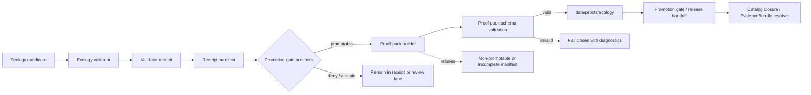

<!-- [KFM_META_BLOCK_V2]
doc_id: kfm://doc/<NEEDS_VERIFICATION_UUID>
title: Ecology Proof Pack Toolchain
type: standard
version: v1
status: draft
owners: @bartytime4life
created: <NEEDS_VERIFICATION_CREATED_DATE>
updated: 2026-04-24
policy_label: <NEEDS_VERIFICATION_POLICY_LABEL>
related: [
  ./ecology_proof_pack_builder.py,
  ./ecology_proof_pack.py,
  ./tests/test_ecology_proof_pack_builder.py,
  ./tests/test_ecology_proof_pack_cli.py,
  ./tests/test_ecology_proof_pack_schema_validation.py,
  ../../../schemas/ecology/ecology_proof_pack.schema.json,
  ../../../schemas/ecology/ecology_receipt_manifest.schema.json,
  ../../../data/receipts/ecology/README.md,
  ../../../data/proofs/README.md,
  ../../validators/promotion_gate/ecology_manifest.py,
  ../../receipts/ecology_manifest_builder.py
]
tags: [kfm, ecology, proof-pack, proofs, receipts, promotion, provenance, catalog-closure]
notes: [
  "Merged README for the proposed ecology proof-pack builder, CLI, schema, fixtures, and promotion handoff.",
  "Does not claim implementation exists until active-branch verification.",
  "Owner, document UUID, creation date, policy label, final path, schema home, and CI wiring need branch verification.",
  "Relative links assume this README lands at tools/proofs/ecology/README.md."
]
[/KFM_META_BLOCK_V2] -->

<a id="top"></a>

# Ecology Proof Pack Toolchain

Builds schema-validated ecology proof packs from promotion-ready receipt manifests and catalog references.

> [!IMPORTANT]
> **Status:** experimental / draft  
> **Truth posture:** `PROPOSED` until the active branch exposes the builder, CLI, schema, fixtures, tests, promotion-gate seam, and CI wiring.  
> **Owners:** `@bartytime4life` — **NEEDS VERIFICATION**  
> **Suggested path:** `tools/proofs/ecology/README.md` — **NEEDS VERIFICATION**
>
> 
> 
> 
> 
> 
> 
>
> **Quick jumps:** [Scope](#scope) · [Repo fit](#repo-fit) · [Inputs](#inputs) · [Exclusions](#exclusions) · [Directory tree](#directory-tree) · [Quickstart](#quickstart) · [Proof-pack shape](#proof-pack-shape) · [Builder behavior](#builder-behavior) · [Fail-closed rules](#fail-closed-rules) · [Output discipline](#output-discipline) · [Validation and tests](#validation-and-tests) · [Definition of done](#definition-of-done)

---

## Scope

This README describes the proposed ecology proof-pack toolchain: the builder, CLI, schema, fixtures, tests, and release handoff that turn a promotion-ready ecology receipt manifest into a proof artifact under `data/proofs/ecology/`.

```text
validator receipt
  → receipt manifest
  → promotion-gate pass
  → proof-pack builder
  → proof-pack schema validation
  → data/proofs/ecology/
```

A proof pack is **not** a receipt and is **not** the promoted release itself. It is release-significant evidence: an inspectable object that binds the candidate, receipt set, `spec_hash`, catalog references, validation lineage, policy posture, and `proof_complete` state into one schema-validated artifact.

### What this toolchain should prove

| Proof burden | Required posture |
|---|---|
| Candidate identity | The proof pack has a stable `proof_pack_id`, `candidate_id`, `candidate_type`, and `spec_hash`. |
| Manifest authority | The proof pack points back to the receipt manifest that reached a promotable posture. |
| Receipt continuity | Every referenced receipt belongs to the manifest and has a passing decision. |
| Spec integrity | Receipt-level `spec_hash` values match the manifest `spec_hash` when present or required. |
| Evidence continuity | Evidence refs or receipt-backed evidence refs are preserved without copying raw evidence. |
| Catalog closure | Required DCAT, STAC, and PROV references are present for the candidate type. |
| Schema validity | The emitted proof pack validates against `ecology_proof_pack.schema.json`. |
| Release handoff | The output is ready for promotion-gate consumption, not silently published. |

> [!IMPORTANT]
> A proof pack is release evidence. It is not canonical ecology data, not a raw receipt dump, not an AI summary, not a tile artifact, and not a replacement for policy, sensitivity, rights, or catalog validation.

[Back to top](#top)

---

## Repo fit

**PROPOSED target path:** `tools/proofs/ecology/README.md`

This file is a directory README for a future ecology proof-pack toolchain. It orients maintainers before they edit code, schemas, fixtures, catalog-closure wiring, or promotion-gate wiring.

| Surface | Proposed path from this README | Relationship | Status |
|---|---|---|---:|
| Builder doc | `README.md` | Human-readable builder and CLI contract. | `PROPOSED` |
| Builder implementation | [`./ecology_proof_pack_builder.py`](./ecology_proof_pack_builder.py) | Reads validated ecology receipt manifests and emits proof-pack objects. | `NEEDS VERIFICATION` |
| CLI entry point | [`./ecology_proof_pack.py`](./ecology_proof_pack.py) | Provides file-based generation, validation, and exit codes. | `NEEDS VERIFICATION` |
| Builder tests | [`./tests/test_ecology_proof_pack_builder.py`](./tests/test_ecology_proof_pack_builder.py) | Exercises pass/fail builder behavior. | `NEEDS VERIFICATION` |
| CLI tests | [`./tests/test_ecology_proof_pack_cli.py`](./tests/test_ecology_proof_pack_cli.py) | Exercises file handling and exit codes. | `NEEDS VERIFICATION` |
| Schema-validation tests | [`./tests/test_ecology_proof_pack_schema_validation.py`](./tests/test_ecology_proof_pack_schema_validation.py) | Confirms emitted packs validate and malformed packs fail. | `NEEDS VERIFICATION` |
| Proof-pack schema | [`../../../schemas/ecology/ecology_proof_pack.schema.json`](../../../schemas/ecology/ecology_proof_pack.schema.json) | Machine contract for emitted proof packs. | `NEEDS VERIFICATION` |
| Receipt manifest schema | [`../../../schemas/ecology/ecology_receipt_manifest.schema.json`](../../../schemas/ecology/ecology_receipt_manifest.schema.json) | Machine contract for consumed manifests. | `NEEDS VERIFICATION` |
| Receipt manifest builder | [`../../receipts/ecology_manifest_builder.py`](../../receipts/ecology_manifest_builder.py) | Upstream producer of manifest candidates. | `NEEDS VERIFICATION` |
| Promotion gate | [`../../validators/promotion_gate/ecology_manifest.py`](../../validators/promotion_gate/ecology_manifest.py) | Upstream gate that marks manifests promotion-ready. | `NEEDS VERIFICATION` |
| Ecology receipts | [`../../../data/receipts/ecology/README.md`](../../../data/receipts/ecology/README.md) | Upstream process-memory receipt lane. | `NEEDS VERIFICATION` |
| Proof lane overview | [`../../../data/proofs/README.md`](../../../data/proofs/README.md) | Downstream proof-object lane and separation rules. | `NEEDS VERIFICATION` |
| Ecology proof output | `../../../data/proofs/ecology/<candidate_id>.proof_pack.json` | Generated proof artifact after validation. | `PROPOSED` |

> [!NOTE]
> Earlier drafts mixed a flat `tools/proofs/` module layout with a nested `tools/proofs/ecology/README.md` path. This revision assumes the nested README path so relative links are coherent. Confirm the active branch before committing.

### Upstream and downstream seams



[Back to top](#top)

---

## Evidence boundary

| Claim area | Current posture | How to upgrade it |
|---|---|---|
| This README’s content | `PROPOSED` | Commit after active-branch path and owner verification. |
| Builder file exists | `NEEDS VERIFICATION` | Confirm file presence and importability. |
| CLI command works | `NEEDS VERIFICATION` | Run documented command against valid and invalid fixtures. |
| Schema exists | `NEEDS VERIFICATION` | Inspect `ecology_proof_pack.schema.json` and run schema tests. |
| Promotion gate calls builder | `NEEDS VERIFICATION` | Inspect promotion-gate code or release workflow. |
| CI enforces proof-pack tests | `NEEDS VERIFICATION` | Inspect workflow YAML or CI configuration. |
| Publication behavior | `UNKNOWN` | Inspect release workflow, proof objects, catalog outputs, and rollback/correction conventions. |

[Back to top](#top)

---

## Inputs

Accepted inputs are deliberately narrow. The toolchain should consume already-governed artifacts, not raw ecology data.

| Input | Required | Expected shape | Gate |
|---|---:|---|---|
| Ecology receipt manifest | Yes | JSON manifest for one ecology candidate. | Normal build requires `decision == "ready_for_promotion"`. A `proof_complete` manifest posture may be accepted only for idempotent replay if schema/policy confirms it. |
| Passing receipts | Yes | Receipt refs or embedded receipt entries. | Every receipt decision is `pass`. |
| Candidate identity | Yes | `candidate_id`, `candidate_type`, `spec_hash`. | Required for deterministic proof-pack identity. |
| Catalog refs JSON or manifest catalog refs | Yes | `dcat`, `stac`, and `prov` arrays as required by candidate type. | Required refs are non-empty; at least PROV is required unless schema/policy explicitly exempts the candidate. |
| Proof-pack schema | Yes | JSON Schema. | Exists and validates the emitted proof pack. |
| Validation lineage | Recommended / candidate-dependent | Validator names, receipt refs, optional validation report refs. | Required where the manifest schema or promotion policy requires reviewable lineage. |
| Policy, review, sensitivity, or rights refs | Candidate-dependent | Manifest-level refs or decisions. | Required when candidate type, source role, rights, sensitivity, exact-location exposure, or steward review requires them. |

### Accepted manifest posture

The manifest must describe a single candidate and contain at least:

- `manifest_id`
- `candidate_id`
- `candidate_type`
- `spec_hash`
- one or more receipt entries or receipt refs
- a promotable decision/status
- required catalog refs or an approved external catalog-refs input

Receipt entries must be objects. Each receipt must carry a passing decision and must not conflict with the manifest `spec_hash`.

[Back to top](#top)

---

## Exclusions

This toolchain should stay small and proof-focused.

| Not here | Belongs instead |
|---|---|
| RAW, WORK, or QUARANTINE data | Domain lifecycle storage and ingest pipelines. |
| Unvalidated ecological claims | Validator and receipt stages. |
| Failed or partial receipts | Receipt storage plus diagnostics, not proof output. |
| Receipt generation | Ecology validator / receipt-manifest tooling. |
| Catalog generation itself | Catalog-closure tooling; this builder attaches and verifies catalog refs. |
| Canonical schemas or policy bundles | `schemas/`, `contracts/`, or `policy/` homes after repo verification. |
| Promotion approval | Promotion gate and release review workflow. |
| Public API or MapLibre rendering | Governed API, layer manifest, and UI surfaces after release. |
| AI-generated explanation text | Governed AI / Focus Mode only after EvidenceBundle resolution, policy checks, and citation validation. |
| Public map tiles, PMTiles, COGs, or other delivery artifacts | Published delivery surfaces after promotion and proof closure. |

[Back to top](#top)

---

## Directory tree

The tree below is the **proposed** local shape for this README. Adjust it if the active branch uses a different proof-tool layout.

```text
tools/proofs/ecology/
├── README.md
├── ecology_proof_pack_builder.py
├── ecology_proof_pack.py
└── tests/
    ├── test_ecology_proof_pack_builder.py
    ├── test_ecology_proof_pack_cli.py
    └── test_ecology_proof_pack_schema_validation.py

schemas/ecology/
├── ecology_proof_pack.schema.json
└── ecology_receipt_manifest.schema.json

data/proofs/ecology/
└── <candidate_id>.proof_pack.json
```

Suggested fixture layout:

```text
tests/fixtures/ecology/proof_pack/
├── valid/
│   ├── ecology_manifest.ready.json
│   ├── catalog_refs.complete.json
│   └── expected.proof_pack.json
└── invalid/
    ├── manifest-not-promotable.json
    ├── receipt-failed.json
    ├── spec-hash-mismatch.json
    ├── missing-catalog-ref.json
    ├── missing-candidate-id.json
    ├── missing-policy-ref.json
    └── existing-output-conflict.json
```

[Back to top](#top)

---

## Quickstart

> [!CAUTION]
> These commands are proposed interfaces. Do not document them as CI-backed, release-backed, or branch-verified until the module path, schema path, fixtures, and workflow are visible in the active checkout.

Preferred nested module path:

```bash
python -m tools.proofs.ecology.ecology_proof_pack \
  --manifest data/receipts/ecology/manifests/<candidate_id>.receipt_manifest.json \
  --catalog-refs data/catalog/ecology/<candidate_id>.catalog_refs.json \
  --schema schemas/ecology/ecology_proof_pack.schema.json \
  --out data/proofs/ecology/<candidate_id>.proof_pack.json
```

If the active branch keeps the CLI flat under `tools/proofs/`, use this path instead:

```bash
python -m tools.proofs.ecology_proof_pack \
  --manifest data/receipts/ecology/manifests/<candidate_id>.receipt_manifest.json \
  --catalog-refs data/catalog/ecology/<candidate_id>.catalog_refs.json \
  --schema schemas/ecology/ecology_proof_pack.schema.json \
  --out data/proofs/ecology/<candidate_id>.proof_pack.json
```

[Back to top](#top)

---

## Usage

### Generate one proof pack

```bash
python -m tools.proofs.ecology.ecology_proof_pack \
  --manifest data/receipts/ecology/manifests/eco-index-demo.receipt_manifest.json \
  --catalog-refs data/catalog/ecology/eco-index-demo.catalog_refs.json \
  --schema schemas/ecology/ecology_proof_pack.schema.json \
  --out data/proofs/ecology/eco-index-demo.proof_pack.json
```

### Exit codes

| Exit | Meaning |
|---:|---|
| `0` | Proof pack generated and validated. |
| `1` | Invalid JSON, invalid manifest, invalid catalog refs, non-promotable content, or emitted proof-pack schema failure. |
| `2` | Manifest or catalog refs file missing. |
| `3` | Proof-pack schema missing or invalid. |
| `5` | Unexpected internal error. |

> [!TIP]
> Keep diagnostics reviewable, but do not emit a `proof_complete` proof pack for failure cases.

[Back to top](#top)

---

## Proof-pack shape

The schema is the authority once present. This example shows the intended release-significant shape without using empty catalog refs as success placeholders.

> [!WARNING]
> Empty `catalog_refs` arrays are invalid at `proof_complete` time unless an approved schema or policy explicitly exempts the candidate type.

```json
{
  "proof_pack_id": "kfm.proof.ecology.<candidate_id>",
  "candidate_id": "<candidate-id>",
  "candidate_type": "eco_index|ecological_claim|map_layer|processed_artifact",
  "spec_hash": "sha256:<hex-or-schema-approved-hash>",
  "manifest_ref": "data/receipts/ecology/manifests/<candidate_id>.receipt_manifest.json",
  "receipts": [
    {
      "receipt_ref": "data/receipts/ecology/<receipt-id>.json",
      "validator": "<validator-name>",
      "decision": "pass",
      "spec_hash": "sha256:<hex-or-schema-approved-hash>"
    }
  ],
  "evidence_refs": [
    {
      "evidence_ref": "<evidence-ref-or-receipt-evidence-ref>",
      "source_role": "<source-role>",
      "frozen": true
    }
  ],
  "catalog_refs": {
    "dcat": ["data/catalog/ecology/<candidate_id>.dcat.json"],
    "stac": ["data/catalog/ecology/<candidate_id>.stac.json"],
    "prov": ["data/catalog/ecology/<candidate_id>.prov.json"]
  },
  "validation_lineage": [
    {
      "validator": "<validator-name>",
      "receipt_ref": "data/receipts/ecology/<receipt-id>.json",
      "validation_report_ref": "<optional-validation-report-ref>"
    }
  ],
  "generated_at": "<UTC-ISO-8601-timestamp>",
  "status": "proof_complete"
}
```

### Field rules

| Field | Rule | Failure mode |
|---|---|---|
| `proof_pack_id` | Must be deterministic enough for review and replay, using `kfm.proof.ecology.<candidate_id>` unless schema says otherwise. | Fail if `candidate_id` is missing or unsafe. |
| `candidate_id` | Must match the manifest candidate ID exactly. | Fail if missing or blank. |
| `candidate_type` | Must be one of the supported ecology candidate types. | Fail if missing or unsupported. |
| `spec_hash` | Must match the manifest `spec_hash`; receipt hashes must match when present or required. | Fail on missing manifest hash or mismatch. |
| `manifest_ref` | Must point to the manifest that passed promotion precheck. | Fail if missing. |
| `receipts[]` | Must be non-empty; every receipt must have `decision == "pass"`. | Fail if empty or any receipt is not passing. |
| `evidence_refs[]` | Should preserve frozen evidence refs when manifest supplies them. | Fail where schema/policy requires evidence refs and they are missing. |
| `catalog_refs` | Must include required catalog refs for the candidate type. | Fail if required refs are missing or empty. |
| `validation_lineage[]` | Should preserve validator/report lineage for review. | Fail where schema/policy requires lineage and it is missing. |
| `generated_at` | Must be UTC and machine-parseable. | Fail or normalize according to schema policy. |
| `status` | Must be `proof_complete` only on success. | Do not emit a proof pack for failures. |

### Candidate-type catalog expectations

These defaults are **PROPOSED** until the manifest schema or policy bundle confirms exact requirements.

| Candidate type | Required catalog posture |
|---|---|
| `eco_index` | DCAT and PROV required; STAC required when the index publishes a spatial asset. |
| `ecological_claim` | PROV required; DCAT required when dataset-backed; STAC required when map/spatial asset-backed. |
| `map_layer` | DCAT, STAC, and PROV required. |
| `processed_artifact` | PROV required; DCAT/STAC required according to artifact kind. |

[Back to top](#top)

---

## Builder behavior

The builder is a narrow assembler and verifier. It should not make new ecological truth claims.

```text
receipt manifest
  → verify promotable manifest posture
  → verify required manifest identity fields
  → collect and normalize receipt refs
  → verify every receipt decision == pass
  → validate spec_hash consistency
  → verify required catalog refs
  → preserve frozen evidence refs and validation lineage
  → build proof-pack object
  → validate proof pack against schema
  → write atomically, without unsafe overwrite
```

### Stage contract

| Stage | Builder action | Builder must not do |
|---|---|---|
| Manifest intake | Parse and schema-check the manifest. | Guess missing fields or coerce unrelated artifacts into a manifest. |
| Promotion verification | Require `ready_for_promotion` unless schema/policy explicitly permits replay of `proof_complete`. | Promote a candidate itself. |
| Receipt collection | Preserve receipt refs, validators, decisions, and lineage. | Convert failed receipts into proof evidence. |
| Hash consistency | Check manifest and receipt `spec_hash` compatibility. | Recompute a different candidate identity without review. |
| Catalog attachment | Require catalog refs already produced or approved upstream. | Silently create placeholder catalog refs. |
| Policy and sensitivity carry-through | Require manifest-level refs when the candidate type or source posture requires them. | Decide release safety from scratch or hide unresolved sensitivity. |
| Proof emission | Write one proof pack under `data/proofs/ecology/`. | Overwrite an existing non-identical proof pack. |
| Schema validation | Validate the emitted proof pack before success. | Treat pretty JSON as proof of validity. |

[Back to top](#top)

---

## Fail-closed rules

The builder must fail without emitting a `proof_complete` artifact when any of these conditions hold.

| Rule | Required failure |
|---|---|
| Manifest decision/status is not promotable. | Refuse build. |
| Manifest is malformed or schema-invalid. | Refuse build. |
| `manifest_id`, `candidate_id`, `candidate_type`, or manifest `spec_hash` is missing. | Refuse build. |
| Candidate type is unsupported. | Refuse build. |
| Receipt list is empty. | Refuse build. |
| Any receipt entry is not an object. | Refuse build. |
| Any receipt decision is not `pass`. | Refuse build. |
| Any receipt-level `spec_hash`, when present or required, conflicts with manifest `spec_hash`. | Refuse build. |
| Required catalog refs are missing or empty. | Refuse build. |
| Catalog refs lack PROV and no schema/policy exemption exists. | Refuse build. |
| Required policy, review, sensitivity, or rights refs are missing from a release-significant manifest. | Refuse build. |
| Generated proof pack fails schema validation. | Refuse build. |
| Existing proof pack path already contains different content for the same candidate. | Refuse overwrite; require correction/rollback workflow. |

> [!CAUTION]
> A failed proof-pack build is not a publication artifact. It may produce diagnostics for CI or review, but it must not produce a proof pack with `status: proof_complete`.

[Back to top](#top)

---

## Output discipline

```text
data/proofs/ecology/
└── <candidate_id>.proof_pack.json
```

The output path is **PROPOSED**. The writer should apply these rules once the repo layout is verified:

1. Create parent directories only where repo convention allows generated proof artifacts.
2. Write atomically.
3. Refuse to overwrite an existing proof pack unless the existing file is byte-identical.
4. Treat corrected proof packs as a correction or rollback workflow, not an in-place mutation.
5. Preserve the prior proof pack for audit and lineage when a correction is required.

[Back to top](#top)

---

## Policy and sensitivity notes

Ecology artifacts may involve sensitive habitats, species occurrences, steward-controlled data, exact-location exposure, or rights constraints. The proof-pack builder does not decide those issues from scratch, but it must preserve and require the manifest-level outcomes that make release safe.

At proof-build time, the builder should require the manifest to carry or reference:

| Required posture | Why it matters |
|---|---|
| Policy decision ref | Prevents proof completion before release policy has passed. |
| Sensitivity or public-safety ref when applicable | Prevents exact-location or sensitive ecology leakage. |
| Rights/source-role ref when applicable | Prevents release of artifacts without source authority and redistribution posture. |
| Review ref when required | Keeps steward review visible in release evidence. |
| Catalog refs | Keeps publication tied to inspectable DCAT/STAC/PROV closure. |

If the manifest does not include these refs but the candidate type requires them, the builder should fail closed.

[Back to top](#top)

---

## Validation and tests

The test suite should cover success and failure paths before CI or promotion uses the builder.

| Test case | Expected result |
|---|---|
| Valid promotable manifest with passing receipts and catalog refs. | Emits `proof_complete`. |
| Manifest decision is `needs_review`, `denied`, `failed`, missing, or otherwise not promotable. | Raises failure; no proof pack. |
| Missing `manifest_id`, `candidate_id`, `candidate_type`, or manifest `spec_hash`. | Raises failure; no proof pack. |
| Unsupported `candidate_type`. | Raises failure; no proof pack. |
| Empty receipt list. | Raises failure; no proof pack. |
| Receipt entry is not an object. | Raises failure; no proof pack. |
| Receipt decision is not `pass`. | Raises failure; no proof pack. |
| Receipt `spec_hash` conflicts with manifest `spec_hash`. | Raises failure; no proof pack. |
| Required DCAT/STAC/PROV ref missing. | Raises failure; no proof pack. |
| Required policy/review/sensitivity/rights ref missing for a candidate type that requires it. | Raises failure; no proof pack. |
| Emitted proof pack violates schema. | Raises failure; no proof pack. |
| Existing output path has non-identical content. | Raises failure; no overwrite. |

### Review checklist

Use this checklist before treating the toolchain as more than proposed.

| Check | Pass condition |
|---|---|
| Path verification | Active branch confirms the README path and relative links. |
| Builder presence | Builder file exists and is importable. |
| CLI presence | CLI file exists and supports the documented arguments. |
| Schema presence | `ecology_proof_pack.schema.json` exists and validates at least one valid fixture. |
| Negative fixtures | Missing manifest, missing catalog refs, missing PROV, bad receipt decision, and `spec_hash` mismatch fail closed. |
| Receipt/proof separation | Receipts remain process memory; proof packs remain proof objects. |
| Catalog closure | Proof pack carries catalog refs without embedding unrelated catalog blobs. |
| Promotion seam | Promotion gate consumes or can reference the proof pack without treating file movement as release. |
| CI evidence | Workflow or test command is visible before this README says CI is enforced. |

[Back to top](#top)

---

## Related docs

| Surface | Relationship | Status |
|---|---|---:|
| [`../../../data/receipts/ecology/README.md`](../../../data/receipts/ecology/README.md) | Explains upstream receipt-manifest lane. | `NEEDS VERIFICATION` |
| [`../../../data/proofs/README.md`](../../../data/proofs/README.md) | Explains proof-object lane and proof/receipt/catalog separation. | `NEEDS VERIFICATION` |
| [`../../../schemas/ecology/ecology_proof_pack.schema.json`](../../../schemas/ecology/ecology_proof_pack.schema.json) | Proof-pack machine contract. | `NEEDS VERIFICATION` |
| [`../../../schemas/ecology/ecology_receipt_manifest.schema.json`](../../../schemas/ecology/ecology_receipt_manifest.schema.json) | Manifest machine contract. | `NEEDS VERIFICATION` |
| [`../../validators/promotion_gate/ecology_manifest.py`](../../validators/promotion_gate/ecology_manifest.py) | Promotion-gate precheck. | `NEEDS VERIFICATION` |
| [`../../receipts/ecology_manifest_builder.py`](../../receipts/ecology_manifest_builder.py) | Upstream manifest producer. | `NEEDS VERIFICATION` |

[Back to top](#top)

---

## Definition of done

- [ ] Builder implementation exists at a verified repo path.
- [ ] CLI exists at a verified repo path.
- [ ] Proof-pack schema exists.
- [ ] Receipt manifest schema consumption is validated.
- [ ] At least one valid proof-pack fixture exists.
- [ ] At least one invalid fixture exists for every fail-closed rule.
- [ ] `manifest_id`, `candidate_id`, `candidate_type`, and `spec_hash` are required or schema-equivalent.
- [ ] Receipt decisions are enforced as `pass`.
- [ ] `spec_hash` consistency is enforced.
- [ ] Required catalog refs are enforced.
- [ ] Policy/review/sensitivity/rights refs are enforced where required by candidate type.
- [ ] Output writes to the verified `data/proofs/ecology/` location.
- [ ] Existing proof packs are not silently overwritten.
- [ ] Builder tests pass.
- [ ] CLI tests pass.
- [ ] Schema-validation tests pass.
- [ ] Catalog refs are generated by catalog-closure tooling.
- [ ] Promotion gate can call or reference the proof-pack builder.
- [ ] CI check is verified from workflow evidence.
- [ ] Documentation links from adjacent receipt, proof, schema, and promotion-gate docs are added after path verification.
- [ ] README status is updated from `PROPOSED` only after branch evidence supports it.

[Back to top](#top)

---

## FAQ

### Does this README prove the ecology proof-pack builder exists?

No. This README is a proposed implementation guide until the active branch exposes the files, tests, fixtures, schema, and workflow evidence.

### Why require a PROV ref?

Because a proof pack should preserve provenance closure. STAC and DCAT can describe assets and datasets, but PROV is the explicit lineage surface that helps reviewers reconstruct responsibility and transformation history.

### Why not embed receipts, catalog records, or release bundles directly?

Because KFM keeps object families separate. Receipts, catalog refs, proof packs, release manifests, correction notices, and rollback refs answer different review questions.

### Can this tool publish ecology outputs?

No. It may generate a proof artifact. Publication remains a separate governed transition after validation, policy checks, review, and release handoff.

### What should change first when the repo is mounted?

Confirm path layout. The most likely immediate edit is reconciling whether implementation files live under `tools/proofs/ecology/` or flat under `tools/proofs/`.

[Back to top](#top)

---

## Open verification items

| Item | Why it remains unresolved |
|---|---|
| `doc_id` UUID | Not confirmed from a mounted document registry. |
| `created` date | Not confirmed from branch history or document registry. |
| `policy_label` | Not confirmed from policy registry or doc metadata convention. |
| Owner | Supplied in drafts, but not confirmed from CODEOWNERS or repo docs. |
| Final path | Drafts suggest `tools/proofs/ecology/README.md`; code path convention still needs branch verification. |
| Builder module path | Nested and flat module paths both remain plausible from draft evidence. |
| Schema home | `schemas/ecology/` is proposed; active repo schema conventions must confirm it. |
| Exact manifest schema fields | `ecology_receipt_manifest.schema.json` path is supplied but not verified. |
| Required catalog refs by candidate type | Needs schema or policy confirmation. |
| Receipt-level `spec_hash` requirement | Drafts allow optional receipt hashes; schema should decide whether they become mandatory. |
| CI command | No workflow or package manager is verified. |
| Correction/rollback implementation | Needs repo proof-object and release workflow conventions. |

```text
Current safest posture:
PROPOSED builder/toolchain contract.
UNKNOWN mounted implementation.
NEEDS VERIFICATION before release use.
```

[Back to top](#top)

---

<details>
<summary><strong>Appendix — minimal implementation sketch</strong></summary>

This sketch is **pseudocode**. It does not claim a current implementation exists.

```python
from __future__ import annotations

from datetime import datetime, timezone
from typing import Any


class ProofPackError(ValueError):
    """Raised when a manifest cannot produce a proof-complete proof pack."""


SUPPORTED_CANDIDATE_TYPES = {
    "eco_index",
    "ecological_claim",
    "map_layer",
    "processed_artifact",
}


def _utc_now() -> str:
    return datetime.now(timezone.utc).isoformat().replace("+00:00", "Z")


def _required_catalog_ref_types(manifest: dict[str, Any]) -> list[str]:
    """Return manifest-provided requirements, or a fail-closed default."""
    explicit = manifest.get("required_catalog_ref_types")
    if explicit:
        return list(explicit)

    # PROPOSED default. Confirm exact defaults in schema/policy.
    if manifest.get("candidate_type") == "map_layer":
        return ["dcat", "stac", "prov"]

    return ["dcat", "prov"]


def _require_non_empty(value: Any, field_name: str) -> None:
    if value in (None, "", [], {}):
        raise ProofPackError(f"missing required field: {field_name}")


def build_proof_pack(manifest: dict[str, Any]) -> dict[str, Any]:
    """Build a proof pack from a promotion-ready ecology receipt manifest.

    Pseudocode contract:
    - validates manifest promotion decision;
    - validates identity fields;
    - validates receipt pass decisions;
    - validates spec_hash consistency;
    - validates required catalog refs;
    - returns the proof-pack object.
    """

    if manifest.get("decision") != "ready_for_promotion":
        raise ProofPackError("manifest not promotable")

    for field in ("manifest_id", "candidate_id", "candidate_type", "spec_hash"):
        _require_non_empty(manifest.get(field), field)

    candidate_type = manifest["candidate_type"]
    if candidate_type not in SUPPORTED_CANDIDATE_TYPES:
        raise ProofPackError(f"unsupported candidate_type: {candidate_type}")

    spec_hash = manifest["spec_hash"]
    receipts = manifest.get("receipts") or []
    if not receipts:
        raise ProofPackError("manifest has no receipts")

    for index, receipt in enumerate(receipts):
        if not isinstance(receipt, dict):
            raise ProofPackError(f"receipts[{index}] is not an object")

        prefix = f"receipts[{index}]"
        _require_non_empty(receipt.get("receipt_ref"), f"{prefix}.receipt_ref")
        _require_non_empty(receipt.get("validator"), f"{prefix}.validator")

        if receipt.get("decision") != "pass":
            raise ProofPackError(f"{prefix} is not passing")

        receipt_spec_hash = receipt.get("spec_hash")
        if receipt_spec_hash and receipt_spec_hash != spec_hash:
            raise ProofPackError(f"{prefix} spec_hash mismatch")

    catalog_refs = manifest.get("catalog_refs") or {}
    for ref_type in _required_catalog_ref_types(manifest):
        if not catalog_refs.get(ref_type):
            raise ProofPackError(f"missing catalog_refs.{ref_type}")

    return {
        "proof_pack_id": f"kfm.proof.ecology.{manifest['candidate_id']}",
        "candidate_id": manifest["candidate_id"],
        "candidate_type": candidate_type,
        "spec_hash": spec_hash,
        "manifest_ref": manifest["manifest_id"],
        "receipts": receipts,
        "evidence_refs": manifest.get("evidence_refs", []),
        "catalog_refs": catalog_refs,
        "validation_lineage": manifest.get("validation_lineage", []),
        "generated_at": _utc_now(),
        "status": "proof_complete",
    }
```

</details>

[Back to top](#top)
