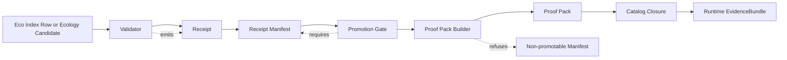

<!-- [KFM_META_BLOCK_V2]
doc_id: kfm://doc/<NEEDS_VERIFICATION_UUID>
title: Ecology Proof Pack Builder
type: standard
version: v1
status: draft
owners: @bartytime4life
created: <NEEDS_VERIFICATION_CREATED_DATE>
updated: 2026-04-24
policy_label: <NEEDS_VERIFICATION_POLICY_LABEL>
related: [
  ../../../data/receipts/ecology/README.md,
  ../../../data/proofs/README.md,
  ../../../schemas/ecology/ecology_receipt_manifest.schema.json,
  ../../validators/promotion_gate/ecology_manifest.py,
  ../../receipts/ecology_manifest_builder.py
]
tags: [kfm, ecology, proof-pack, receipts, promotion, provenance]
notes: [
  "PROPOSED proof-pack builder for ecological artifacts.",
  "Does not claim implementation exists in the current repo.",
  "Suggested Markdown path and related paths require mounted-repo verification.",
  "doc_id, created, and policy_label require verification before publication."
]
[/KFM_META_BLOCK_V2] -->

<a id="top"></a>

# Ecology Proof Pack Builder

Generates release-ready proof packs from validated ecology receipt manifests.


> [!NOTE]
> **Truth posture:** `PROPOSED`  
> **Suggested Markdown path:** `tools/proofs/ecology/README.md` — `NEEDS VERIFICATION`  
> **Suggested implementation path:** `tools/proofs/ecology_proof_pack_builder.py` — `PROPOSED`  
> **Implementation claim:** none. This document describes the target behavior for a future builder.

**Quick jumps:** [Scope](#scope) · [Repo fit](#repo-fit) · [Accepted inputs](#accepted-inputs) · [Proof pack shape](#proof-pack-shape) · [Builder behavior](#builder-behavior) · [Fail-closed rules](#fail-closed-rules) · [Implementation sketch](#minimal-implementation-sketch) · [Definition of done](#definition-of-done)

---

## Scope

This builder is the final proof assembly step after the ecology validation and promotion chain has already succeeded:

```text
validator → receipt → manifest → promotion gate → proof pack
```

The proof pack is the final inspectable artifact before publication or release-significant catalog closure. It should preserve enough references for a reviewer or runtime EvidenceBundle resolver to answer:

| Question | Proof-pack responsibility |
|---|---|
| What candidate is being promoted? | Carry `candidate_id`, `candidate_type`, and `spec_hash`. |
| Which manifest authorized promotion? | Carry `manifest_ref` and require a promotable manifest decision. |
| Which validators passed? | Carry receipt refs, validator names, receipt decisions, and lineage refs. |
| Which evidence was frozen? | Carry evidence refs or receipt-backed evidence refs without copying raw evidence. |
| Which catalogs close the release loop? | Carry DCAT, STAC, and PROV refs required by the candidate type. |
| Can the artifact be replayed or checked? | Preserve deterministic identity and validation lineage. |

> [!IMPORTANT]
> A proof pack is release evidence. It is not canonical ecology data, not a raw receipt dump, not an AI summary, and not a replacement for policy or catalog validation.

[Back to top](#top)

---

## Repo fit

The path assumptions below are **PROPOSED** because the mounted repository layout has not been verified in this session.

| Surface | Proposed path | Relationship | Status |
|---|---|---|---|
| Builder doc | `tools/proofs/ecology/README.md` | Human-readable builder contract and review guide. | `PROPOSED / NEEDS VERIFICATION` |
| Builder implementation | `tools/proofs/ecology_proof_pack_builder.py` | Reads validated ecology receipt manifests and emits proof packs. | `PROPOSED` |
| Receipt manifest schema | `schemas/ecology/ecology_receipt_manifest.schema.json` | Defines the manifest shape consumed by the builder. | `NEEDS VERIFICATION` |
| Receipt manifest builder | `tools/receipts/ecology_manifest_builder.py` | Upstream producer of manifest candidates. | `NEEDS VERIFICATION` |
| Promotion gate | `tools/validators/promotion_gate/ecology_manifest.py` | Upstream gate that marks manifests `ready_for_promotion`. | `NEEDS VERIFICATION` |
| Proof output | `data/proofs/ecology/` | Target directory for generated proof-pack JSON. | `PROPOSED` |
| Receipt records | `data/receipts/ecology/` | Process-memory receipts referenced by proof packs. | `PROPOSED / NEEDS VERIFICATION` |

### Upstream and downstream seams



[Back to top](#top)

---

## Accepted inputs

Only promotion-ready manifest material belongs here.

| Accepted input | Required posture | Why it belongs |
|---|---|---|
| Ecology receipt manifest | `decision == "ready_for_promotion"` | The builder is downstream of validation and promotion. |
| Passing receipts | Every receipt decision is `pass`. | Proof cannot be complete if any validator failed. |
| Candidate identity | `candidate_id`, `candidate_type`, `spec_hash`. | Required for deterministic proof-pack identity. |
| Catalog references | Required DCAT/STAC/PROV refs for the candidate type. | Catalog closure must be inspectable before publication. |
| Validation lineage | Validator names, receipt refs, and optional validation report refs. | Reviewers need traceable proof, not just a green status. |
| Policy/review refs | Manifest-level policy and review refs where required. | Ecology artifacts can carry rights, sensitivity, or precise-location concerns. |

## Exclusions

These do **not** belong in the proof pack builder.

| Excluded material | Goes instead |
|---|---|
| RAW, WORK, or QUARANTINE data | Domain lifecycle storage and ingest pipelines. |
| Unvalidated ecological claims | Validator and receipt stages. |
| Failed or partial receipts | Receipt storage plus failure diagnostics, not proof output. |
| Canonical schemas or policy bundles | `schemas/`, `contracts/`, or `policy/` homes after repo verification. |
| Catalog generation itself | Catalog closure tooling; this builder only attaches and verifies catalog refs. |
| AI-generated explanation text | Runtime EvidenceBundle / Focus Mode surfaces after citation validation. |
| Public map tiles or PMTiles | Published delivery surfaces after promotion and proof closure. |

[Back to top](#top)

---

## Proof pack shape

The builder should emit one JSON proof pack per promotable ecology candidate.

> [!WARNING]
> Empty `catalog_refs` arrays are invalid at `proof_complete` time unless an approved schema or policy explicitly exempts the candidate type. The original draft used empty arrays as placeholders only.

```json
{
  "proof_pack_id": "kfm.proof.ecology.<candidate_id>",
  "candidate_id": "<candidate-id>",
  "candidate_type": "eco_index|ecological_claim|map_layer|processed_artifact",
  "spec_hash": "sha256:<hex-or-schema-approved-hash>",
  "manifest_ref": "<receipt-manifest-ref>",
  "receipts": [
    {
      "receipt_ref": "<receipt-path>",
      "validator": "<validator-name>",
      "decision": "pass",
      "spec_hash": "sha256:<hex-or-schema-approved-hash>"
    }
  ],
  "evidence_refs": [
    {
      "evidence_ref": "<evidence-ref-or-receipt-evidence-ref>",
      "source_role": "<source-role>",
      "frozen": true
    }
  ],
  "catalog_refs": {
    "dcat": ["<dcat-record-ref>"],
    "stac": ["<stac-item-or-collection-ref>"],
    "prov": ["<prov-record-ref>"]
  },
  "validation_lineage": [
    {
      "validator": "<validator-name>",
      "receipt_ref": "<receipt-path>",
      "validation_report_ref": "<optional-validation-report-ref>"
    }
  ],
  "generated_at": "<UTC-ISO-8601-timestamp>",
  "status": "proof_complete"
}
```

### Field rules

| Field | Rule | Failure mode |
|---|---|---|
| `proof_pack_id` | Must be deterministic: `kfm.proof.ecology.<candidate_id>`. | Fail if `candidate_id` is missing or unsafe. |
| `candidate_id` | Must match the manifest candidate ID exactly. | Fail if missing or blank. |
| `candidate_type` | Must be one of the supported ecology candidate types. | Fail if missing or unsupported. |
| `spec_hash` | Must match the manifest `spec_hash`; receipt hashes must match when present. | Fail on missing manifest hash or mismatch. |
| `manifest_ref` | Must point to the manifest that passed promotion. | Fail if missing. |
| `receipts[]` | Must be non-empty; every receipt must have `decision == "pass"`. | Fail if empty or any receipt is not passing. |
| `catalog_refs` | Must include required catalog refs for the candidate type. | Fail if required refs are missing or empty. |
| `generated_at` | Must be UTC and machine-parseable. | Fail or normalize according to schema policy. |
| `status` | Must be `proof_complete` only on success. | Do not emit a proof pack for failures. |

### Candidate-type catalog expectations

These defaults are **PROPOSED** until the manifest schema or policy bundle confirms exact requirements.

| Candidate type | Required catalog posture |
|---|---|
| `eco_index` | DCAT and PROV required; STAC required when the index publishes a spatial asset. |
| `ecological_claim` | PROV required; DCAT required when dataset-backed; STAC required when map/spatial asset-backed. |
| `map_layer` | DCAT, STAC, and PROV required. |
| `processed_artifact` | PROV required; DCAT/STAC required according to artifact kind. |

[Back to top](#top)

---

## Builder behavior

The builder is a narrow assembler and verifier. It should not make new ecological truth claims.

```text
receipt manifest
  → verify manifest decision == ready_for_promotion
  → verify required manifest identity fields
  → collect and normalize receipt refs
  → verify every receipt decision == pass
  → validate spec_hash consistency
  → verify required catalog refs
  → attach frozen evidence refs and validation lineage
  → emit proof pack
```

### Stage contract

| Stage | Builder action | Builder must not do |
|---|---|---|
| Manifest intake | Parse and schema-check the manifest. | Guess missing fields. |
| Promotion verification | Require `ready_for_promotion`. | Promote a candidate itself. |
| Receipt collection | Preserve receipt refs and validator decisions. | Convert failed receipts into proof evidence. |
| Hash consistency | Check manifest and receipt `spec_hash` compatibility. | Recompute a different candidate identity without review. |
| Catalog attachment | Require catalog refs already produced or approved upstream. | Silently create placeholder catalog refs. |
| Proof emission | Write one proof pack under `data/proofs/ecology/`. | Overwrite an existing non-identical proof pack. |

[Back to top](#top)

---

## Fail-closed rules

The builder must fail without emitting a `proof_complete` artifact when any of these conditions hold.

| Rule | Required failure |
|---|---|
| Manifest decision is not `ready_for_promotion`. | Refuse build. |
| Manifest is malformed or schema-invalid. | Refuse build. |
| `candidate_id`, `candidate_type`, or manifest `spec_hash` is missing. | Refuse build. |
| Receipt list is empty. | Refuse build. |
| Any receipt decision is not `pass`. | Refuse build. |
| Any receipt-level `spec_hash`, when present, conflicts with manifest `spec_hash`. | Refuse build. |
| Required catalog refs are missing or empty. | Refuse build. |
| Required policy, review, sensitivity, or rights refs are missing from a release-significant manifest. | Refuse build. |
| Existing proof pack path already contains different content for the same candidate. | Refuse overwrite; require correction/rollback workflow. |

> [!CAUTION]
> A failed proof-pack build is not a publication artifact. It may produce diagnostics for CI or review, but it must not produce a proof pack with `status: proof_complete`.

[Back to top](#top)

---

## Minimal implementation sketch

This sketch is **pseudocode**. It does not claim a current implementation exists.

```python
from __future__ import annotations

from datetime import datetime, timezone
from typing import Any


class ProofPackError(ValueError):
    """Raised when a manifest cannot produce a proof-complete proof pack."""


SUPPORTED_CANDIDATE_TYPES = {
    "eco_index",
    "ecological_claim",
    "map_layer",
    "processed_artifact",
}


def _utc_now() -> str:
    return datetime.now(timezone.utc).isoformat().replace("+00:00", "Z")


def _required_catalog_ref_types(manifest: dict[str, Any]) -> list[str]:
    """Return manifest-provided requirements, or a fail-closed default."""
    explicit = manifest.get("required_catalog_ref_types")
    if explicit:
        return list(explicit)

    # PROPOSED default. Confirm exact defaults in schema/policy.
    if manifest.get("candidate_type") == "map_layer":
        return ["dcat", "stac", "prov"]

    return ["dcat", "prov"]


def _require_non_empty(value: Any, field_name: str) -> None:
    if value in (None, "", [], {}):
        raise ProofPackError(f"missing required field: {field_name}")


def build_proof_pack(manifest: dict[str, Any]) -> dict[str, Any]:
    """Build a proof pack from a promotion-ready ecology receipt manifest.

    Pseudocode contract:
    - validates manifest promotion decision;
    - validates identity fields;
    - validates receipt pass decisions;
    - validates spec_hash consistency;
    - validates required catalog refs;
    - returns the proof-pack object.
    """

    if manifest.get("decision") != "ready_for_promotion":
        raise ProofPackError("manifest not promotable")

    for field in ("manifest_id", "candidate_id", "candidate_type", "spec_hash"):
        _require_non_empty(manifest.get(field), field)

    candidate_type = manifest["candidate_type"]
    if candidate_type not in SUPPORTED_CANDIDATE_TYPES:
        raise ProofPackError(f"unsupported candidate_type: {candidate_type}")

    spec_hash = manifest["spec_hash"]
    receipts = manifest.get("receipts") or []
    if not receipts:
        raise ProofPackError("manifest has no receipts")

    for index, receipt in enumerate(receipts):
        prefix = f"receipts[{index}]"

        _require_non_empty(receipt.get("receipt_ref"), f"{prefix}.receipt_ref")
        _require_non_empty(receipt.get("validator"), f"{prefix}.validator")

        if receipt.get("decision") != "pass":
            raise ProofPackError(f"{prefix} is not passing")

        receipt_spec_hash = receipt.get("spec_hash")
        if receipt_spec_hash and receipt_spec_hash != spec_hash:
            raise ProofPackError(f"{prefix} spec_hash mismatch")

    catalog_refs = manifest.get("catalog_refs") or {}
    for ref_type in _required_catalog_ref_types(manifest):
        if not catalog_refs.get(ref_type):
            raise ProofPackError(f"missing catalog_refs.{ref_type}")

    return {
        "proof_pack_id": f"kfm.proof.ecology.{manifest['candidate_id']}",
        "candidate_id": manifest["candidate_id"],
        "candidate_type": candidate_type,
        "spec_hash": spec_hash,
        "manifest_ref": manifest["manifest_id"],
        "receipts": receipts,
        "evidence_refs": manifest.get("evidence_refs", []),
        "catalog_refs": catalog_refs,
        "validation_lineage": manifest.get("validation_lineage", []),
        "generated_at": _utc_now(),
        "status": "proof_complete",
    }
```

[Back to top](#top)

---

## Output location and write discipline

```text
data/proofs/ecology/
└── <candidate_id>.proof_pack.json
```

The output path is **PROPOSED**. The writer should apply these rules once the repo layout is verified:

1. Create parent directories only where repo convention allows generated proof artifacts.
2. Write atomically.
3. Refuse to overwrite an existing proof pack unless the existing file is byte-identical.
4. Treat corrected proof packs as a correction or rollback workflow, not an in-place mutation.
5. Preserve the prior proof pack for audit and lineage when a correction is required.

[Back to top](#top)

---

## Validation and tests

The test suite should cover success and failure paths before CI or promotion uses the builder.

| Test case | Expected result |
|---|---|
| Valid promotable manifest with passing receipts and catalog refs. | Emits `proof_complete`. |
| Manifest decision is `needs_review`, `denied`, `failed`, or missing. | Raises failure; no proof pack. |
| Missing `candidate_id`. | Raises failure; no proof pack. |
| Missing manifest `spec_hash`. | Raises failure; no proof pack. |
| Unsupported `candidate_type`. | Raises failure; no proof pack. |
| Empty receipt list. | Raises failure; no proof pack. |
| Receipt decision is not `pass`. | Raises failure; no proof pack. |
| Receipt `spec_hash` conflicts with manifest `spec_hash`. | Raises failure; no proof pack. |
| Required DCAT/STAC/PROV ref missing. | Raises failure; no proof pack. |
| Existing output path has non-identical content. | Raises failure; no overwrite. |

### Suggested fixture layout

```text
tests/fixtures/ecology/proof_pack/
├── valid/
│   ├── ecology_manifest.ready.json
│   └── expected.proof_pack.json
└── invalid/
    ├── manifest-not-promotable.json
    ├── receipt-failed.json
    ├── spec-hash-mismatch.json
    ├── missing-catalog-ref.json
    └── missing-candidate-id.json
```

[Back to top](#top)

---

## Policy and sensitivity notes

Ecology artifacts may involve sensitive habitats, species occurrences, steward-controlled data, exact-location exposure, or rights constraints. The proof-pack builder does not decide those issues from scratch, but it must preserve and require the manifest-level outcomes that make release safe.

At proof-build time, the builder should require the manifest to carry or reference:

| Required posture | Why it matters |
|---|---|
| Policy decision ref | Prevents proof completion before release policy has passed. |
| Sensitivity or public-safety ref when applicable | Prevents exact-location or sensitive ecology leakage. |
| Rights/source-role ref when applicable | Prevents release of artifacts without source authority and redistribution posture. |
| Review ref when required | Keeps steward review visible in release evidence. |
| Catalog refs | Keeps publication tied to inspectable DCAT/STAC/PROV closure. |

If the manifest does not include these refs but the candidate type requires them, the builder should fail closed.

[Back to top](#top)

---

## Definition of done

- [ ] Builder implementation exists at a verified repo path.
- [ ] Receipt manifest schema consumption is validated.
- [ ] Valid and invalid fixtures exist.
- [ ] `candidate_id`, `candidate_type`, `manifest_id`, and `spec_hash` are required.
- [ ] Receipt decisions are enforced as `pass`.
- [ ] `spec_hash` consistency is enforced.
- [ ] Required catalog refs are enforced.
- [ ] Policy/review/sensitivity refs are enforced where required by candidate type.
- [ ] Output writes to the verified `data/proofs/ecology/` location.
- [ ] Existing proof packs are not silently overwritten.
- [ ] Tests cover pass and fail-closed conditions.
- [ ] CI integration is verified before the builder is used by release or publication workflows.
- [ ] Documentation links from adjacent receipt, proof, schema, and promotion-gate docs are added after path verification.

[Back to top](#top)

---

## Open verification items

| Item | Why it remains open |
|---|---|
| Markdown file path | The current draft implies `tools/proofs/ecology/`, but the mounted repo path is not verified. |
| `doc_id` UUID | No verified document registry entry was available. |
| `created` date | The draft supplied a placeholder. |
| `policy_label` | Release/publication policy label is not confirmed. |
| Exact manifest schema fields | `ecology_receipt_manifest.schema.json` path is supplied but not verified. |
| Required catalog refs by candidate type | Needs schema or policy confirmation. |
| Receipt-level `spec_hash` requirement | The draft allows optional receipt hashes; schema should decide whether they become mandatory. |
| CI command | No workflow or package manager is verified. |
| Correction/rollback implementation | Needs repo proof-object and release workflow conventions. |

```text
Current safest posture:
PROPOSED builder contract.
UNKNOWN mounted implementation.
NEEDS VERIFICATION before release use.
```

[Back to top](#top)
