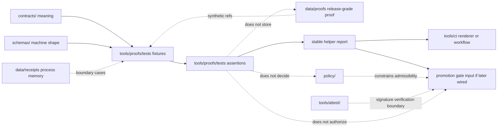

<!-- [KFM_META_BLOCK_V2]
doc_id: kfm://doc/NEEDS_VERIFICATION__tools_proofs_tests_readme
title: tools/proofs/tests
type: standard
version: v1
status: draft
owners: NEEDS_VERIFICATION__CODEOWNERS_or_tools_owner
created: NEEDS_VERIFICATION__YYYY-MM-DD
updated: 2026-04-24
policy_label: NEEDS_VERIFICATION__public_or_internal
related: [../README.md, ../../README.md, ../../attest/README.md, ../../validators/README.md, ../../validators/promotion_gate/README.md, ../../ci/README.md, ../../../tests/README.md, ../../../tests/contracts/README.md, ../../../tests/e2e/runtime_proof/README.md, ../../../data/proofs/README.md, ../../../data/receipts/README.md, ../../../contracts/README.md, ../../../schemas/README.md, ../../../policy/README.md, ../../../docs/README.md, ../../../.github/workflows/README.md, ../../../.github/CODEOWNERS]
tags: [kfm, tools, proofs, tests, verification, receipts, proofs, fail-closed]
notes: [Target path supplied by the current request; exact active-branch file presence, created date, owner, runner, and policy label need verification in a mounted checkout; this README keeps proof-helper tests separate from canonical proof storage, receipt storage, schemas, policy, and promotion decisions.]
[/KFM_META_BLOCK_V2] -->

<a id="top"></a>

# `tools/proofs/tests/`

Tool-local proof tests for KFM proof-helper behavior, receipt/proof boundary checks, finite outcomes, and fail-closed validation fixtures.

> [!NOTE]
> This README is written for the target path `tools/proofs/tests/README.md`.
> The current authoring session did **not** expose a mounted KFM Git checkout, so executable inventory and merge-gate behavior remain **NEEDS VERIFICATION** until checked on the active branch.

<div align="left">


</div>

> **Status:** experimental  
> **Owners:** `NEEDS VERIFICATION` — expected to resolve through `../../../.github/CODEOWNERS` or a narrower `tools/proofs/` rule  
> **Path:** `tools/proofs/tests/README.md`  
> **Repo fit:** child test lane for proof helpers under `tools/proofs/`; adjacent to attest, validators, CI renderers, contracts, schemas, policy, receipts, and proof storage  
> **Quick jumps:** [Scope](#scope) · [Repo fit](#repo-fit) · [Accepted inputs](#accepted-inputs) · [Exclusions](#exclusions) · [Directory tree](#directory-tree) · [Quickstart](#quickstart) · [Usage](#usage) · [Diagram](#diagram) · [Operating tables](#operating-tables) · [Task list / definition of done](#task-list--definition-of-done) · [FAQ](#faq) · [Appendix](#appendix)

> [!IMPORTANT]
> `tools/proofs/tests/` proves **proof-helper behavior**.
> It does not store release-grade proof packs, decide policy, define schemas, mint canonical contracts, or authorize publication.

---

## Scope

Use this lane when the main burden is testing proof-related helper code that lives under, or is owned by, `tools/proofs/`.

This includes narrow, deterministic tests for:

- proof-reference shape and linkage checks
- proof bundle fixture handling
- digest comparison behavior
- receipt/proof separation
- finite proof outcome grammar
- fail-closed handling of malformed or ambiguous payloads
- compact machine-readable reports emitted by proof helpers

### Working interpretation

`tools/proofs/tests/` is a **tool-local test surface**. It may use tiny synthetic fixtures and golden outputs, but it should not become a second `data/proofs/` directory or a hidden promotion gate.

| Claim | Truth label | Working rule |
| --- | --- | --- |
| KFM treats proof objects as distinct from receipts, catalogs, contracts, and policy | CONFIRMED doctrine | Preserve the distinction in every fixture and assertion |
| `tools/proofs/tests/` is the requested target path | CONFIRMED request | Draft this README for that path |
| Current executable files under this exact path | UNKNOWN | Verify in the active checkout before claiming inventory |
| Test runner and dependency stack | NEEDS VERIFICATION | Use repo-native runner after inspection |
| First useful test shape | PROPOSED | Start with small valid/invalid proof-helper fixtures and fail-closed assertions |

[Back to top](#top)

---

## Repo fit

### Upstream / downstream map

| Surface | Link from this README | Relationship |
| --- | --- | --- |
| Parent proof-helper lane | [`../README.md`](../README.md) | Owns proof helper purpose, interfaces, and implementation notes |
| Tools index | [`../../README.md`](../../README.md) | Places proof helpers beside attest, validators, CI, catalog, diff, and probe helpers |
| Attestation helpers | [`../../attest/README.md`](../../attest/README.md) | May verify signatures or attestations; should not be replaced by proof tests |
| Validators | [`../../validators/README.md`](../../validators/README.md) | Own executable validation helpers; tests may call them but do not become them |
| Promotion gate | [`../../validators/promotion_gate/README.md`](../../validators/promotion_gate/README.md) | Consumes proof evidence for release decisions; this lane does not decide promotion |
| CI renderer helpers | [`../../ci/README.md`](../../ci/README.md) | May render proof-helper reports for reviewers; rendering behavior belongs in CI tests |
| Global tests index | [`../../../tests/README.md`](../../../tests/README.md) | Wider governed verification surface |
| Contract-facing tests | [`../../../tests/contracts/README.md`](../../../tests/contracts/README.md) | Better home when the main burden is object contract validation |
| Runtime proof tests | [`../../../tests/e2e/runtime_proof/README.md`](../../../tests/e2e/runtime_proof/README.md) | Better home when the main burden is request-time trust behavior |
| Proof storage | [`../../../data/proofs/README.md`](../../../data/proofs/README.md) | Stores release-grade proof packs and proof-bearing objects |
| Receipt storage | [`../../../data/receipts/README.md`](../../../data/receipts/README.md) | Stores process memory; receipts are not release proof |
| Contracts | [`../../../contracts/README.md`](../../../contracts/README.md) | Defines human-readable meaning |
| Schemas | [`../../../schemas/README.md`](../../../schemas/README.md) | Defines machine-checkable shape |
| Policy | [`../../../policy/README.md`](../../../policy/README.md) | Defines allow/deny/obligation logic |
| Workflow docs | [`../../../.github/workflows/README.md`](../../../.github/workflows/README.md) | Orchestrates checks after branch-level verification |

### Fit summary

| Question | Answer |
| --- | --- |
| What belongs here? | Small tests that prove `tools/proofs/` helpers recognize valid proof-shaped inputs, reject invalid or receipt-shaped inputs, and emit stable reports |
| What does not belong here? | Canonical schemas, live proof archives, release decisions, policy law, production proofs, or workflow orchestration |
| Why not put this under `data/proofs/`? | `data/proofs/` is evidence-bearing storage; this lane is tool-local test pressure |
| Why not put this under `tests/e2e/`? | Whole-path runtime and release proof belongs in e2e; this lane is narrower and helper-focused |
| Why not put this under `tools/attest/`? | Attest helpers may verify signatures; proof-helper tests may assert inputs/outputs but should not own attestation semantics |

[Back to top](#top)

---

## Accepted inputs

Only explicit, reviewable, public-safe inputs belong here.

| Input class | Examples | Why it belongs here |
| --- | --- | --- |
| Tiny proof-like fixtures | `proof_bundle.valid.json`, `decision_verify_result.valid.json`, `proof_ref.missing.invalid.json` | Proves helper behavior without requiring emitted production proof packs |
| Synthetic proof references | `kfm://proof/example/release-001`, `kfm://release/manifest/example-v1` | Keeps reference resolution testable and clone-safe |
| Digest fixtures | expected/observed digest pairs, mismatch examples, malformed digests | Exercises integrity rules and contradiction handling |
| Boundary fixtures | receipt-shaped payloads presented as proofs, catalog-only payloads presented as proof, empty bundles | Prevents helper code from flattening trust surfaces |
| Golden helper reports | compact JSON result, reviewer-safe summary fragment | Lets CI and review tools consume deterministic outputs |
| Failure-path fixtures | missing proof refs, ambiguous kind, unsupported outcome, wrong timestamp type | KFM negative states must be visible and tested |

### Input rules

1. Prefer static files over live fetches.
2. Prefer tiny synthetic fixtures over copied release evidence.
3. Name fixtures so the object kind, scenario, and validity are visible.
4. Keep valid and invalid examples equally reviewable.
5. Preserve upstream object shape when a helper depends on a contract or schema.
6. Do not embed secrets, credentials, unpublished evidence, controlled locations, or rights-unclear records.
7. Make every ambiguous proof/receipt case fail closed.

[Back to top](#top)

---

## Exclusions

| Does **not** belong here | Better home | Why |
| --- | --- | --- |
| Release-grade proof packs, attestations, SBOMs, or promoted proof archives | [`../../../data/proofs/README.md`](../../../data/proofs/README.md) | Proof storage is an evidence-bearing data surface, not a test helper folder |
| Run receipts, ingest receipts, validation receipts, or replay logs | [`../../../data/receipts/README.md`](../../../data/receipts/README.md) | Receipts preserve process memory and must not be recast as proof |
| Human-readable contract law | [`../../../contracts/README.md`](../../../contracts/README.md) | Contracts define meaning; tests prove recognition |
| Machine schema definitions | [`../../../schemas/README.md`](../../../schemas/README.md) | Schemas define shape; this lane may consume them |
| Policy rules, obligations, or denial vocabularies | [`../../../policy/README.md`](../../../policy/README.md) | Policy decides admissibility; proof tests may assert consequences only when policy outputs are provided |
| Promotion approval, hold, deny, or release authorization | [`../../validators/promotion_gate/README.md`](../../validators/promotion_gate/README.md) | Promotion is a governed state transition, not a local proof-helper assertion |
| Attestation signing or signature verification implementation | [`../../attest/README.md`](../../attest/README.md) | Attestation helpers own signing/verification details |
| Reviewer-facing Markdown rendering | [`../../ci/README.md`](../../ci/README.md) | CI renderers own presentation of machine reports |
| Whole-path runtime outcomes | [`../../../tests/e2e/runtime_proof/README.md`](../../../tests/e2e/runtime_proof/README.md) | Runtime proof needs request-time evidence resolution and outward trust-state coverage |
| Large raw datasets or unpublished candidate artifacts | governed data lifecycle zones | This lane must remain safe to clone and review |

[Back to top](#top)

---

## Directory tree

The exact active-branch tree is **NEEDS VERIFICATION**. The shape below is a compact starter pattern for the first useful proof-helper test slice.

```text
tools/proofs/tests/
├── README.md
├── fixtures/
│   ├── valid/
│   │   ├── proof_bundle__minimal__valid.json
│   │   ├── proof_ref__release_manifest__valid.json
│   │   └── decision_verify_result__valid.json
│   ├── invalid/
│   │   ├── proof_bundle__missing_ref__invalid.json
│   │   ├── proof_bundle__receipt_instead_of_proof__invalid.json
│   │   ├── proof_digest__malformed__invalid.json
│   │   └── proof_outcome__unknown__invalid.json
│   └── golden/
│       ├── proof_bundle__minimal__report.json
│       └── proof_bundle__missing_ref__report.json
├── test_proof_bundle_refs.py
├── test_proof_digest_rules.py
├── test_proof_receipt_boundary.py
└── test_proof_report_shape.py
```

### Reading rule

| Tree item | Status | Rule |
| --- | --- | --- |
| `README.md` | PROPOSED for target path | This document defines the lane contract |
| `fixtures/valid/` | PROPOSED | Passing fixtures should be minimal and public-safe |
| `fixtures/invalid/` | PROPOSED | Negative fixtures should fail deterministically |
| `fixtures/golden/` | PROPOSED | Golden outputs should test report shape, not every byte unless byte stability matters |
| `test_*.py` files | PROPOSED / runner-dependent | Rename or relocate if the repo uses a different test framework |

[Back to top](#top)

---

## Quickstart

> [!WARNING]
> Commands below are review and starter commands. Confirm the active branch, package manager, and runner before treating them as CI truth.

### Inspect the lane

```bash
# from repo root
find tools/proofs/tests -maxdepth 4 -type f 2>/dev/null | sort
sed -n '1,260p' tools/proofs/tests/README.md 2>/dev/null || true
sed -n '1,260p' tools/proofs/README.md 2>/dev/null || true
```

### Inspect proof-adjacent boundaries

```bash
# from repo root
sed -n '1,220p' data/proofs/README.md 2>/dev/null || true
sed -n '1,220p' data/receipts/README.md 2>/dev/null || true
sed -n '1,220p' tools/attest/README.md 2>/dev/null || true
sed -n '1,220p' tools/validators/promotion_gate/README.md 2>/dev/null || true
```

### Run this lane only

```bash
# NEEDS VERIFICATION: replace with the repo-native runner if this lane is not Python/pytest.
pytest -q tools/proofs/tests
```

### Run a narrower proof-helper case

```bash
# NEEDS VERIFICATION: test filenames are proposed until the active tree is inspected.
pytest -q tools/proofs/tests/test_proof_receipt_boundary.py
```

[Back to top](#top)

---

## Usage

### Fixture naming

Use names that make review possible without opening every file.

```text
<object_kind>__<scenario>__<validity>.json
```

Examples:

| Fixture | Meaning |
| --- | --- |
| `proof_bundle__minimal__valid.json` | smallest proof bundle accepted by helper |
| `proof_bundle__missing_ref__invalid.json` | bundle without required proof reference |
| `proof_bundle__receipt_instead_of_proof__invalid.json` | receipt-like payload rejected as proof |
| `proof_digest__malformed__invalid.json` | digest field fails format or semantic checks |
| `decision_verify_result__valid.json` | proof-adjacent verification result accepted by helper |

### First assertion set

A first useful test slice should prove:

1. valid proof fixtures pass
2. invalid proof fixtures fail with stable reason codes
3. receipt-shaped objects are rejected as proof-shaped objects
4. digest mismatch and malformed digest cases are distinct
5. helper reports are stable enough for CI renderers and reviewers
6. no test depends on network access, live source systems, local secrets, or unpublished artifacts

### Expected report posture

Proof-helper tests should prefer compact, machine-readable results that a CI helper can render later.

```json
{
  "kind": "ProofHelperTestReport",
  "version": "v1",
  "valid": false,
  "checked_at": "2026-04-24T00:00:00Z",
  "reason_codes": ["PROOF_REF_MISSING"],
  "fixture": "fixtures/invalid/proof_bundle__missing_ref__invalid.json"
}
```

> [!NOTE]
> The JSON above is illustrative. Use the repo’s real schema or report contract once verified.

[Back to top](#top)

---

## Diagram



[Back to top](#top)

---

## Operating tables

### Boundary rules

| Boundary | Must do | Must not do |
| --- | --- | --- |
| Proof tests ↔ proof storage | Use tiny synthetic proof-like fixtures | Store release proof packs as test truth |
| Proof tests ↔ receipts | Assert receipts are not proofs | Treat a process receipt as release-grade evidence |
| Proof tests ↔ contracts | Consume object meaning through links or fixtures | Redefine object semantics locally |
| Proof tests ↔ schemas | Validate against schema when available | Become a second schema home |
| Proof tests ↔ policy | Assert provided policy outcomes when needed | Decide policy or obligations directly |
| Proof tests ↔ attest | Exercise proof-helper handling of attestation refs | Implement signing or verification |
| Proof tests ↔ CI | Emit stable reports | Own reviewer presentation as its primary purpose |
| Proof tests ↔ promotion gate | Provide evidence that a helper behaves correctly | Approve, publish, hold, or deny releases |

### Test family matrix

| Test family | First useful cases | Failure behavior |
| --- | --- | --- |
| Proof reference checks | present ref, missing ref, malformed ref | fail with stable reason code |
| Digest checks | expected/observed match, mismatch, malformed digest | distinguish mismatch from invalid digest |
| Receipt/proof boundary | receipt-like payload, proof-like payload, ambiguous payload | reject ambiguity fail-closed |
| Bundle shape checks | minimal valid bundle, extra fields, missing required fields | schema or structure error |
| Outcome grammar | supported outcome, unsupported outcome | unsupported outcome rejected |
| Report stability | valid report, invalid report, golden summary | deterministic report shape |
| Fixture hygiene | no secrets, no live URLs unless inert, no unpublished data | fail or quarantine fixture |

### Minimal reason-code vocabulary

Use existing repo reason codes if present. If no narrower vocabulary exists, this lane should start with a compact helper-local set and avoid policy-owned language.

| Reason code | Meaning |
| --- | --- |
| `PROOF_REF_MISSING` | Required proof reference absent |
| `PROOF_REF_INVALID` | Proof reference has unsupported shape |
| `RECEIPT_NOT_PROOF` | Process-memory receipt was supplied where proof was required |
| `AMBIGUOUS_KIND` | Payload cannot be safely classified |
| `DIGEST_INVALID` | Digest format or field type invalid |
| `DIGEST_MISMATCH` | Expected and observed digests differ |
| `OUTCOME_UNSUPPORTED` | Outcome is not in the approved finite registry |
| `SCHEMA_INVALID` | Payload failed executable schema validation |
| `FIXTURE_UNSAFE` | Fixture includes secret-bearing, live, unpublished, or rights-unclear data |

[Back to top](#top)

---

## Task list / definition of done

A change that lands or revises this lane is not done until it satisfies the review gates below.

- [ ] README has one H1, KFM Meta Block V2, badges, quick jumps, scope, repo fit, accepted inputs, exclusions, tree, diagram, and verification backlog.
- [ ] Active-branch owner is verified through `../../../.github/CODEOWNERS` or a narrower owner record.
- [ ] The actual test runner is documented or the quickstart is corrected.
- [ ] Every valid fixture has a matching invalid fixture or a documented reason it does not.
- [ ] Invalid fixtures fail deterministically and do not silently skip.
- [ ] Receipt/proof separation is asserted by at least one negative test.
- [ ] Digest mismatch is not conflated with malformed digest.
- [ ] Proof-helper reports are stable enough for CI rendering or reviewer inspection.
- [ ] Tests do not fetch live sources, require secrets, mutate governed data, or publish artifacts.
- [ ] Links to contracts, schemas, policy, receipts, proofs, validators, attest helpers, and CI renderers are reviewed.
- [ ] Any new schema, policy, or promotion dependency is added in its owning surface, not inside this test lane.
- [ ] Rollback is simple: remove the tests/fixtures and revert parent README references without touching release proof storage.

[Back to top](#top)

---

## FAQ

### Is this the canonical proof-pack home?

No. Canonical or emitted proof packs belong in [`../../../data/proofs/README.md`](../../../data/proofs/README.md). This lane holds tool-local tests and tiny fixtures for proof-helper behavior.

### Can tests here use receipts?

Yes, but only as fixtures or boundary cases. A receipt fixture can prove that proof helpers reject receipt-shaped payloads where proof-shaped payloads are required. Receipts remain process memory.

### Can this lane decide promotion?

No. Promotion remains a governed state transition owned by promotion contracts, policy, proof packs, and the promotion gate. Tests here may support that gate by proving helpers behave correctly.

### Should this lane call `tools/attest/`?

Only if the helper under test depends on an attestation result or reference. Signature generation and verification implementation belongs in the attest lane.

### What should happen when a fixture is ambiguous?

Ambiguity fails closed. The test should assert a stable error or reason code rather than allowing helper code to infer trust.

### Why keep this under `tools/proofs/` instead of global `tests/`?

This location is appropriate when the test burden is local to proof-helper implementation. If the burden grows into whole-path release, runtime, contract, or policy proof, move the case to the more specific global test family.

[Back to top](#top)

---

## Appendix

<details>
<summary><strong>Appendix A — Evidence posture for this README</strong></summary>

This README uses three evidence layers:

1. **CONFIRMED current request:** the target file path is `tools/proofs/tests/README.md`.
2. **CONFIRMED KFM doctrine:** KFM separates receipts, proofs, catalogs, contracts, schemas, policy, runtime outcomes, and publication state.
3. **UNKNOWN active-branch implementation:** this session did not expose the mounted repository, so exact files, runner, fixtures, workflow callers, and owner rules remain branch-level verification items.

Working rule for maintainers: keep this README useful even before executable depth is fully settled, but never use it as proof that executable files or CI gates already exist.

</details>

<details>
<summary><strong>Appendix B — Active-branch verification commands</strong></summary>

Run these before marking the lane as settled.

```bash
# from repo root
git status --short
git branch --show-current

# verify path and owner
find tools/proofs -maxdepth 4 -type f 2>/dev/null | sort
grep -RIn "tools/proofs\|data/proofs\|data/receipts" .github/CODEOWNERS 2>/dev/null || true

# inspect adjacent docs
sed -n '1,240p' tools/proofs/README.md 2>/dev/null || true
sed -n '1,240p' tools/attest/README.md 2>/dev/null || true
sed -n '1,240p' tools/validators/promotion_gate/README.md 2>/dev/null || true
sed -n '1,240p' data/proofs/README.md 2>/dev/null || true
sed -n '1,240p' data/receipts/README.md 2>/dev/null || true

# inspect likely executable depth
find tools/proofs/tests -maxdepth 4 -type f 2>/dev/null | sort
find tests -maxdepth 4 -type f 2>/dev/null | grep -Ei 'proof|receipt|attest|promotion|runtime' | sort || true
```

</details>

<details>
<summary><strong>Appendix C — Open verification backlog</strong></summary>

| Item | Status | Resolution path |
| --- | --- | --- |
| Does `tools/proofs/` already exist on the active branch? | UNKNOWN | Inspect checkout |
| Does this exact README already exist? | UNKNOWN | Inspect checkout |
| Is `/tools/` owner inherited by this path? | NEEDS VERIFICATION | Check `CODEOWNERS` |
| Is this lane Python, Node, shell, or mixed? | NEEDS VERIFICATION | Inspect tool implementation and CI |
| Are proof helper schemas already defined? | NEEDS VERIFICATION | Inspect `contracts/`, `schemas/`, and `tools/proofs/` |
| Are proof fixtures already stored elsewhere? | NEEDS VERIFICATION | Inspect `tests/`, `data/proofs/`, and `tools/proofs/` |
| Does CI already call proof-helper tests? | UNKNOWN | Inspect workflow YAML |
| Are reason codes already standardized? | NEEDS VERIFICATION | Inspect contracts, vocab, validators, and policy |
| Does promotion gate consume proof-helper reports? | UNKNOWN | Inspect promotion-gate README and implementation |

</details>

[Back to top](#top)
