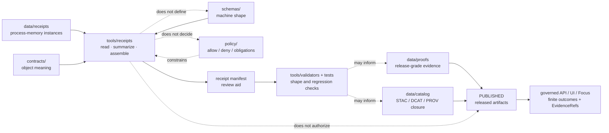

<!-- [KFM_META_BLOCK_V2]
doc_id: kfm://doc/NEEDS-VERIFICATION-tools-receipts-readme
title: tools/receipts
type: standard
version: v1
status: draft
owners: @bartytime4life
created: 2026-04-24
updated: 2026-04-24
policy_label: public
related: [
  ../../README.md,
  ../README.md,
  ../../data/receipts/README.md,
  <NEEDS_VERIFICATION: ../../data/proofs/README.md>,
  <NEEDS_VERIFICATION: ../../data/catalog/README.md>,
  <NEEDS_VERIFICATION: ../../contracts/README.md>,
  <NEEDS_VERIFICATION: ../../schemas/README.md>,
  <NEEDS_VERIFICATION: ../../policy/README.md>,
  <NEEDS_VERIFICATION: ../../tests/README.md>,
  <NEEDS_VERIFICATION: ../validators/README.md>
]
tags: [kfm, tools, receipts, process-memory, governance]
notes: [
  "Target path requested for revision: tools/receipts/README.md.",
  "Public-main evidence showed this README as empty before this replacement draft.",
  "Public-main evidence showed ecology_manifest_builder.py in this directory; syntax, tests, workflow callers, and schema conformance still need verification.",
  "Owner is inherited from current public README/CODEOWNERS-facing pattern; tool-specific ownership should be rechecked before publish."
]
[/KFM_META_BLOCK_V2] -->

<a id="top"></a>

# `tools/receipts/`

Receipt tooling for reading, validating, summarizing, and assembling receipt-shaped process memory without becoming proof, policy, catalog, or publication authority.


| Impact field | Value |
|---|---|
| **Status** | experimental |
| **Document status** | draft |
| **Owners** | `@bartytime4life` — **NEEDS VERIFICATION** against active `CODEOWNERS` |
| **Path** | `tools/receipts/README.md` |
| **Authority class** | operational helper surface |
| **Primary role** | receipt-manifest and receipt-summary helper tooling |
| **Quick jumps** | [Scope](#scope) · [Repo fit](#repo-fit) · [Accepted inputs](#accepted-inputs) · [Exclusions](#exclusions) · [Directory tree](#directory-tree) · [Quickstart](#quickstart) · [Usage](#usage) · [Diagram](#diagram) · [Reference tables](#reference-tables) · [Definition of done](#definition-of-done) · [FAQ](#faq) · [Appendix](#appendix) |

> [!IMPORTANT]
> `tools/receipts/` owns **helper behavior** around receipt-shaped process memory.
>
> It does **not** own receipt schemas, proof authority, catalog closure, policy decisions, runtime truth, or publication state.

> [!CAUTION]
> A receipt can make a run inspectable. It does not, by itself, make an artifact releasable.

---

## Scope

`tools/receipts/` is the local helper lane for receipt-adjacent utilities: reading receipt JSON, assembling receipt manifests, summarizing receipt state, checking receipt readiness, and preparing reviewer-friendly outputs.

CONFIRMED public-main snapshot:

| Surface | Status | Reading rule |
|---|---:|---|
| `tools/receipts/README.md` | **CONFIRMED empty before this revision** | This file is a replacement-grade README draft, not a small edit to existing prose. |
| `tools/receipts/ecology_manifest_builder.py` | **CONFIRMED present** | Treat as a receipt-manifest helper. Syntax, tests, CLI behavior, and workflow callers remain **NEEDS VERIFICATION**. |
| Local mounted checkout | **UNKNOWN in this authoring pass** | Re-run the [Quickstart](#quickstart) checks in the real branch before merge. |

The lane should support KFM’s governed lifecycle without weakening it:

```text
RAW -> WORK / QUARANTINE -> PROCESSED -> CATALOG / TRIPLET -> PUBLISHED
                         \-> RECEIPTS support replay, audit, correction, and review
```

Receipts are useful because they preserve **what ran**, **what was checked**, **what was linked**, **what was held**, and **what a reviewer should inspect next**.

[Back to top](#top)

---

## Repo fit

`tools/receipts/` sits between emitted receipt instances and the validation/review surfaces that need to inspect them.

| Relation | Surface | Fit | Status |
|---|---|---|---:|
| Root posture | [`../../README.md`](../../README.md) | Defines KFM as governed, evidence-first, map-first, time-aware, and centered on inspectable claims. | **CONFIRMED public README** |
| Parent helper lane | [`../README.md`](../README.md) | Defines `tools/` as governed helper surface, not a truth source. | **CONFIRMED public README** |
| Current helper file | [`./ecology_manifest_builder.py`](./ecology_manifest_builder.py) | Builds an ecology receipt manifest from receipt-like inputs. | **CONFIRMED file / NEEDS VERIFICATION execution** |
| Receipt instances | [`../../data/receipts/README.md`](../../data/receipts/README.md) | Process-memory home for receipt-shaped artifacts. | **CONFIRMED public README** |
| Release proof | [`../../data/proofs/README.md`](../../data/proofs/README.md) | Proof packs, attestations, rollback proof, and release-grade evidence stay separate. | **NEEDS VERIFICATION** |
| Catalog closure | [`../../data/catalog/README.md`](../../data/catalog/README.md) | STAC/DCAT/PROV discovery and lineage surfaces stay separate. | **NEEDS VERIFICATION** |
| Contract meaning | [`../../contracts/README.md`](../../contracts/README.md) | Human semantic meaning for receipt object families. | **NEEDS VERIFICATION** |
| Schema shape | [`../../schemas/README.md`](../../schemas/README.md) | Machine-checkable receipt and manifest shapes. | **NEEDS VERIFICATION** |
| Policy authority | [`../../policy/README.md`](../../policy/README.md) | Allow, deny, abstain, obligation, rights, sensitivity, and promotion logic. | **NEEDS VERIFICATION** |
| Fixtures and tests | [`../../tests/README.md`](../../tests/README.md) | Valid/invalid examples, regression checks, and executable proof of behavior. | **NEEDS VERIFICATION** |
| Validator helpers | [`../validators/README.md`](../validators/README.md) | Adjacent validation helper lane; receipt tools may feed it or be checked by it. | **NEEDS VERIFICATION** |

> [!NOTE]
> Tooling may read or summarize receipt-shaped files, but actual receipt custody belongs in the approved lifecycle surface, usually `data/receipts/` or its repo-confirmed equivalent.

[Back to top](#top)

---

## Accepted inputs

Use this directory for small, reviewable helpers that make receipt state easier to inspect.

| Accepted input | Why it belongs here | Must still defer to |
|---|---|---|
| Receipt manifest builders | Assemble a bounded set of receipt references into a reviewer-friendly manifest. | `contracts/`, `schemas/`, `data/receipts/`, `data/proofs/` |
| Receipt summary renderers | Convert machine receipts into readable review summaries without changing authority. | source receipt + schema + policy result |
| Receipt comparison helpers | Compare receipt sets, `spec_hash` values, decisions, or candidate references. | schema validators and test fixtures |
| Receipt readiness checks | Surface `ready`, `hold`, `not_ready`, or similar machine states for reviewers. | promotion gate and policy lane |
| Validator glue for receipt fields | Check required keys, finite decisions, timestamps, and subject references. | approved receipt schemas |
| Non-sensitive examples in docs | Show shape and intent when the real fixture home is not yet settled. | `tests/fixtures/` once confirmed |

Healthy tools may say:

- “this receipt set is internally consistent”
- “this `spec_hash` does not match the candidate”
- “this manifest is `not_ready` because at least one receipt is blocking”
- “this summary links to receipt references reviewers should inspect”

They must not say:

- “this candidate is published”
- “this proof pack is valid”
- “this policy allows release”
- “this evidence is authoritative”
- “this runtime answer is safe to show”

[Back to top](#top)

---

## Exclusions

Do **not** put these under `tools/receipts/` as their authoritative home.

| Excluded content | Better home | Why |
|---|---|---|
| Actual receipt instances | `../../data/receipts/` or repo-approved receipt store | Tools may generate or inspect receipt candidates; custody belongs in lifecycle data. |
| Release proof packs, attestations, rollback proof | `../../data/proofs/` or release proof surface | Proof is release-significant; receipt tooling is not proof custody. |
| Catalog triplets or outward lineage records | `../../data/catalog/` | Discoverability and lineage closure are separate from process memory. |
| Receipt schemas | `../../schemas/` or approved schema home | Prevents a second executable contract universe. |
| Human semantic contracts | `../../contracts/` | Tool README prose must not replace object definitions. |
| Policy bundles or policy law | `../../policy/` | Policy must remain independently reviewable and testable. |
| Raw, work, or quarantine payloads | `../../data/raw/`, `../../data/work/`, `../../data/quarantine/` after verification | Tooling must not become hidden lifecycle storage. |
| Secrets, tokens, salts, credentials | secret manager / CI secret settings | Never commit secrets to helper code, fixtures, docs, or logs. |
| Public release artifacts | `../../data/published/` or approved release surface | Publication is a governed state transition, not a tool-side file write. |
| One-off scratch scripts | local scratch space or approved `scripts/` lane | KFM helper behavior should be repeatable, named, and reviewable. |

[Back to top](#top)

---

## Directory tree

### Current public-main shape

```text
tools/
└── receipts/
    ├── README.md                    # CONFIRMED empty before this revision
    └── ecology_manifest_builder.py  # CONFIRMED file; execution NEEDS VERIFICATION
```

### Candidate future shape

The following tree is **PROPOSED**. Do not create every file at once unless a PR explicitly needs it.

```text
tools/
└── receipts/
    ├── README.md
    ├── ecology_manifest_builder.py
    ├── render_receipt_summary.py      # PROPOSED: render-only reviewer summary
    ├── validate_receipt_manifest.py   # PROPOSED: manifest-shape and readiness checks
    └── compare_receipt_sets.py        # PROPOSED: deterministic receipt-set comparison
```

### Adjacent surfaces to recheck before merge

```text
data/
├── receipts/   # process memory
├── proofs/     # release-grade proof
└── catalog/    # STAC / DCAT / PROV closure

contracts/      # object meaning
schemas/        # executable shape
policy/         # admissibility and obligations
tests/          # fixtures and regression checks
```

[Back to top](#top)

---

## Quickstart

Run these checks in the working checkout before changing this directory.

### 1. Confirm branch and tree state

```bash
git status --short
git branch --show-current || true
find tools/receipts -maxdepth 2 -type f | sort
```

### 2. Inspect the README and current helper

```bash
sed -n '1,260p' tools/receipts/README.md
sed -n '1,260p' tools/receipts/ecology_manifest_builder.py
```

### 3. Verify the Python helper before treating it as executable

```bash
python -m py_compile tools/receipts/ecology_manifest_builder.py
```

> [!WARNING]
> A successful syntax check is not enough. This helper still needs positive and negative tests before maintainers treat it as repo-enforced behavior.

### 4. Recheck adjacent receipt/proof authority lanes

```bash
for path in \
  data/receipts \
  data/proofs \
  data/catalog \
  contracts \
  schemas \
  policy \
  tests \
  tools/validators
do
  echo "== $path =="
  find "$path" -maxdepth 2 -type f -name 'README.md' -print 2>/dev/null | sort
done
```

### 5. Search for receipt-family usage before adding names

```bash
grep -RIn \
  -e 'run_receipt' \
  -e 'ai_receipt' \
  -e 'receipt_manifest' \
  -e 'spec_hash' \
  -e 'ready_for_promotion' \
  tools data contracts schemas policy tests .github 2>/dev/null || true
```

[Back to top](#top)

---

## Usage

### Current helper: `ecology_manifest_builder.py`

CONFIRMED public-main code shape / **NEEDS VERIFICATION** execution.

The visible helper appears to:

1. load JSON receipt-like objects,
2. extract `receipt_type`, `validator`, `decision`, `spec_hash`, and `generated_at`,
3. compare receipt `spec_hash` values with the candidate `spec_hash`,
4. classify manifest readiness,
5. write a sorted JSON manifest.

Treat that behavior as a helper boundary, not a release gate.

| Function or concept | Role | Review caution |
|---|---|---|
| `ManifestReceipt` | Small receipt summary model. | Confirm whether this should become a contract-backed schema. |
| `load_json(path)` | Reads a receipt-like JSON object. | Must reject non-object JSON and should be covered by tests. |
| `receipt_to_manifest_item(...)` | Normalizes receipt fields into manifest entries. | Missing required fields should be tested explicitly. |
| `decide_manifest(...)` | Determines `not_ready`, `hold`, or `ready_for_promotion`. | Promotion authority still lives elsewhere. |
| `build_manifest(...)` | Builds manifest object for an ecology candidate. | Keep ecology-specific naming from leaking into all receipt families. |
| `write_manifest(...)` | Writes JSON output. | Confirm intended output directory before allowing CI use. |

### Suggested first test cases

| Case | Expected posture |
|---|---|
| no receipt paths | `not_ready` |
| one receipt with `decision: fail` | `not_ready` |
| one receipt with `decision: hold` | `not_ready` under current helper constants |
| receipt `spec_hash` differs from candidate `spec_hash` | `not_ready` |
| unknown decision string | `hold` |
| all receipts `pass` with matching `spec_hash` | `ready_for_promotion` |
| non-object JSON input | error / invalid input |

[Back to top](#top)

---

## Diagram



[Back to top](#top)

---

## Reference tables

### Authority split

| Surface | Owns | Must not silently own |
|---|---|---|
| `tools/receipts/` | Helper behavior for receipt summaries, manifests, comparisons, and checks. | Receipt schemas, proof authority, policy law, or publication state. |
| `data/receipts/` | Emitted receipt-shaped process memory. | Release proof or public truth. |
| `data/proofs/` | Release-grade proof packs, attestations, rollback proof, integrity evidence. | Process-memory convenience summaries. |
| `data/catalog/` | Discoverability and outward lineage closure. | Validation authority or promotion authorization. |
| `contracts/` | Human semantic object meaning and invariants. | Executable validation as the only truth expression. |
| `schemas/` | Machine-checkable shape and constraints. | Object meaning as the only source of truth. |
| `policy/` | Admissibility, obligations, allow/deny/abstain, rights, sensitivity, promotion logic. | Generic object semantics. |
| `tests/` | Valid/invalid examples and regression checks. | Production doctrine or hidden operational state. |

### Decision vocabulary observed in current helper

| Decision value | Current helper handling | Review reading |
|---|---|---|
| `fail` | blocking → `not_ready` | Sensible blocker; needs tests. |
| `hold` | blocking → `not_ready` | Note that this is stricter than a neutral hold. |
| `not_ready` | blocking → `not_ready` | Sensible blocker. |
| `pass` | ready candidate | Requires all receipts to be compatible. |
| `ready_for_promotion` | ready candidate | Name is promotion-adjacent, not promotion authority. |
| `proof_complete` | ready candidate | Needs proof-lane cross-check before strong use. |
| any other value | `hold` | Good negative-path test candidate. |
| mismatched `spec_hash` | `not_ready` | Keeps identity mismatch visible. |

### Truth labels used here

| Label | Meaning |
|---|---|
| **CONFIRMED** | Supported by public-main evidence inspected for this authoring pass or by surfaced KFM doctrine. |
| **INFERRED** | Strongly implied by adjacent docs or code shape, but not direct implementation proof. |
| **PROPOSED** | Recommended target shape or rule consistent with KFM doctrine. |
| **UNKNOWN** | Not verified strongly enough from available evidence. |
| **NEEDS VERIFICATION** | Must be checked in the exact working branch or runtime before relying on it. |
| **LINEAGE** | Useful prior design history that is not current tree proof. |

[Back to top](#top)

---

## Definition of done

A change under `tools/receipts/` is ready for review when all applicable checks are true:

- [ ] `tools/receipts/README.md` reflects the real branch tree and does not preserve stale “empty README” language after replacement.
- [ ] `../README.md` is updated to list `tools/receipts/` as a current child lane.
- [ ] `ecology_manifest_builder.py` passes `python -m py_compile`.
- [ ] The helper has positive and negative tests for empty receipts, blocking decisions, unknown decisions, matching `spec_hash`, and mismatched `spec_hash`.
- [ ] Any emitted manifest shape is either schema-backed or clearly labeled **PROPOSED / NEEDS VERIFICATION**.
- [ ] No raw, work, quarantine, secret, restricted, exact sensitive-location, DNA, living-person, archaeological-site, or critical-infrastructure payload is introduced.
- [ ] Tool output does not claim proof completion, catalog closure, promotion, or publication unless those claims are validated by the proper adjacent surfaces.
- [ ] Relative links from this README work from `tools/receipts/`.
- [ ] Ownership has been checked against `.github/CODEOWNERS`.
- [ ] Rollback remains simple: revert the PR and remove only non-release helper outputs.

[Back to top](#top)

---

## FAQ

### Is `tools/receipts/` a receipt store?

No. Receipt instances belong in the approved receipt custody lane, usually `data/receipts/`. This directory holds helper code and documentation.

### Can this tool lane declare a candidate ready for publication?

No. It may produce a readiness summary or receipt manifest. Publication remains a governed state transition that depends on validation, policy, catalog/proof closure, review, release state, and rollback/correction readiness.

### Should `ecology_manifest_builder.py` be treated as active CI behavior?

Not until the working branch proves syntax, tests, workflow callers, and expected output location. Current evidence supports file presence and visible code shape, not merge-gate enforcement.

### Can receipt tools create proof packs?

Not as their normal authority. A helper may prepare inputs or summaries for proof generation, but proof custody and verification belong to the proof/release surfaces.

### Where should `run_receipt` and `ai_receipt` schemas live?

Not here. Receipt tools should consume approved contracts and schemas after the repo settles the object home. Until then, schema-home and fixture-home claims remain **NEEDS VERIFICATION**.

[Back to top](#top)

---

## Appendix

<details>
<summary><strong>Candidate manifest shape and open verification items</strong></summary>

### Candidate manifest shape reflected by current helper

This example is illustrative and should not be treated as a normative schema.

```json
{
  "manifest_id": "kfm.receipt_manifest.ecology.<candidate_id>",
  "candidate_id": "<candidate_id>",
  "candidate_type": "<candidate_type>",
  "spec_hash": "<sha256-or-approved-hash>",
  "receipts": [
    {
      "receipt_type": "<receipt_type>",
      "validator": "<validator-id>",
      "receipt_ref": "<path-or-uri>",
      "decision": "pass",
      "spec_hash": "<sha256-or-approved-hash>",
      "generated_at": "2026-04-24T00:00:00+00:00"
    }
  ],
  "decision": "ready_for_promotion",
  "generated_at": "2026-04-24T00:00:00+00:00"
}
```

### Open verification items

| Item | Evidence needed |
|---|---|
| Current branch tree | `find tools/receipts -maxdepth 3 -type f \| sort` |
| Python syntax | `python -m py_compile tools/receipts/ecology_manifest_builder.py` |
| Test coverage | pytest or repo-native test output for receipt manifest cases |
| Schema home | resolved `contracts/` vs `schemas/` rule for receipt manifests |
| Fixture home | valid/invalid receipt fixtures and negative-path cases |
| Workflow callers | `.github/workflows/**`, `.github/actions/**`, or pipeline entrypoints that call this helper |
| Output custody | approved destination for generated manifest files |
| Parent navigation | updated `tools/README.md` child-lane table |
| Ownership | active `CODEOWNERS` line covering `tools/receipts/` |
| Release interaction | proof that this helper cannot bypass promotion, proof, or catalog gates |

</details>

[Back to top](#top)
