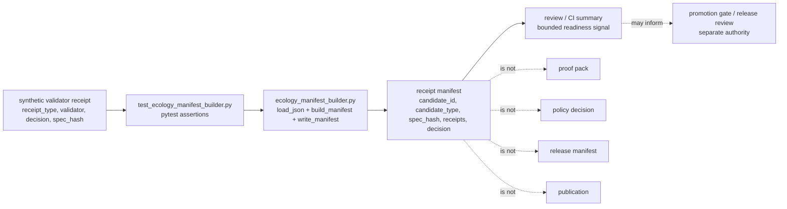

<!-- [KFM_META_BLOCK_V2]
doc_id: kfm://doc/NEEDS-VERIFICATION
title: tools/receipts/tests
type: standard
version: v1
status: draft
owners: @bartytime4life
created: NEEDS-VERIFICATION
updated: 2026-04-24
policy_label: NEEDS-VERIFICATION
related: [../README.md, ../ecology_manifest_builder.py, ../../README.md, ../../validators/README.md, ../../../README.md, ../../../.github/CODEOWNERS, ../../../tests/README.md, ../../../data/receipts/README.md, ../../../data/proofs/README.md, ../../../contracts/README.md, ../../../schemas/README.md, ../../../policy/README.md]
tags: [kfm, tools, receipts, tests, pytest, manifest, validation, spec-hash, promotion-readiness]
notes: [doc_id, created date, and policy_label need repository-documentation registry verification; owner is grounded in broad CODEOWNERS fallback for tools; this README documents receipt-manifest tests only, not production receipt custody or release proof; parent tools/receipts README should link here after it is revised]
[/KFM_META_BLOCK_V2] -->

<a id="top"></a>

# `tools/receipts/tests/`

Fixture-first tests for receipt-manifest helper behavior without turning receipts into proofs, policy decisions, or publication authority.

> [!IMPORTANT]
> **Status:** `experimental` · **Document status:** `draft`  
> **Owners:** `@bartytime4life` · **Path:** `tools/receipts/tests/README.md`  
> **Primary role:** narrow test lane for `tools/receipts/ecology_manifest_builder.py`  
>
> 
> 
> 
> 
> 
> 
> 
>
> **Quick jumps:** [Scope](#scope) · [Repo fit](#repo-fit) · [Accepted inputs](#accepted-inputs) · [Exclusions](#exclusions) · [Current evidence snapshot](#current-evidence-snapshot) · [Directory tree](#directory-tree) · [Quickstart](#quickstart) · [Usage](#usage) · [Diagram](#diagram) · [Operating tables](#operating-tables) · [Task list](#task-list--definition-of-done) · [FAQ](#faq) · [Appendix](#appendix)

> [!CAUTION]
> `ready_for_promotion` in this helper is a **receipt-manifest readiness classification**. It is not a `PromotionDecision`, not a `ReleaseManifest`, not a proof pack, and not permission to publish.

---

## Scope

`tools/receipts/tests/` verifies a small receipt helper seam:

```text
validator-style receipt fixtures
        ↓
ecology_manifest_builder.py
        ↓
receipt manifest decision
        ↓
review / CI / promotion-adjacent handoff
```

The current test lane is intentionally narrow. It should prove that receipt-shaped inputs are grouped into an inspectable manifest and that unsafe or incomplete conditions fail closed.

This directory is for tests that answer questions such as:

- Does a valid validator receipt produce a manifest with stable candidate metadata?
- Does a failed receipt block promotion readiness?
- Does a mismatched `spec_hash` block promotion readiness?
- Does an unknown receipt decision produce `hold` rather than a false pass?
- Does an empty receipt list return `not_ready`?
- Does a non-object receipt raise a clear error?
- Does manifest writing create parent directories and preserve JSON output?

It is not a general receipt schema registry, not a validator store, not an emitted receipt archive, and not a release gate.

[Back to top](#top)

---

## Repo fit

| Direction | Surface | Relationship | Current posture |
|---|---|---|---:|
| Root orientation | [`../../../README.md`](../../../README.md) | Defines KFM as governed, evidence-first, map-first, time-aware, and centered on inspectable claims. | **CONFIRMED doctrine / active branch NEEDS VERIFICATION** |
| Ownership routing | [`../../../.github/CODEOWNERS`](../../../.github/CODEOWNERS) | Broad fallback owner for `tools/` and `tests/` is `@bartytime4life`. | **CONFIRMED fallback / narrower teams PROPOSED** |
| Parent helper lane | [`../../README.md`](../../README.md) | Explains `tools/` as governed helper surface, not truth source. | **CONFIRMED adjacent README** |
| Parent receipt tooling | [`../README.md`](../README.md) | Should orient receipt helper code and link this test lane. | **NEEDS REVISION / verify active branch** |
| Tested helper | [`../ecology_manifest_builder.py`](../ecology_manifest_builder.py) | Builds manifest records from receipt-shaped JSON inputs. | **CONFIRMED path / runtime NEEDS VERIFICATION** |
| Validator helper lane | [`../../validators/README.md`](../../validators/README.md) | Related fail-closed validation surface; validators may emit receipts consumed by this helper. | **CONFIRMED adjacent README** |
| Governed test root | [`../../../tests/README.md`](../../../tests/README.md) | Broader KFM verification surface for fixtures, contracts, policies, and negative paths. | **CONFIRMED adjacent README** |
| Receipt custody | [`../../../data/receipts/README.md`](../../../data/receipts/README.md) | Process-memory store for emitted receipt-shaped artifacts. This test lane uses tiny fixtures only. | **CONFIRMED adjacent README** |
| Proof custody | [`../../../data/proofs/README.md`](../../../data/proofs/README.md) | Release-significant proof objects remain separate from receipts and tests. | **NEEDS VERIFICATION** |
| Machine shape | [`../../../schemas/README.md`](../../../schemas/README.md) | Receipt or manifest schemas belong in schema lanes, not this test directory. | **NEEDS VERIFICATION** |
| Meaning / contracts | [`../../../contracts/README.md`](../../../contracts/README.md) | Semantic object contracts belong in contract lanes, not this test directory. | **NEEDS VERIFICATION** |
| Policy decisions | [`../../../policy/README.md`](../../../policy/README.md) | Policy owns allow, deny, abstain, obligations, and promotion rules. | **NEEDS VERIFICATION** |

### Upstream

This test lane consumes the receipt helper module and tiny receipt-shaped fixtures generated in test code.

### Downstream

This test lane supports local review, CI wiring, future parent README coverage, and promotion-adjacent confidence. It does **not** create release evidence by itself.

[Back to top](#top)

---

## Accepted inputs

Material belongs in `tools/receipts/tests/` when it is small, deterministic, public-safe, and explicitly tied to receipt-helper behavior.

| Accepted input | Belongs here when… | Required boundary |
|---|---|---|
| Unit tests for `ecology_manifest_builder.py` | The test verifies manifest shape, decision classification, file writing, or failure handling. | Keep test scope local and deterministic. |
| Tiny receipt fixtures | The fixture is generated inside tests or stored as a small public-safe file. | Do not use real operational receipts unless redacted and approved. |
| Negative fixtures | The fixture proves a blocking or malformed case. | Negative cases should remain first-class, not optional. |
| `spec_hash` examples | The hash is synthetic and used to prove drift detection. | A synthetic hash is not an attestation or release proof. |
| Expected manifest snippets | The expected output proves helper shape and decision semantics. | Keep expected outputs small and reviewable. |
| Test README notes | The note clarifies runner, boundaries, and active-branch verification gaps. | Do not describe CI enforcement as active without workflow evidence. |

[Back to top](#top)

---

## Exclusions

Do not place these responsibilities or artifacts in `tools/receipts/tests/`.

| Excluded item | Use instead | Why |
|---|---|---|
| Production receipts | [`../../../data/receipts/`](../../../data/receipts/) after policy and repo verification | Tests should not become process-memory custody. |
| Release proof packs | [`../../../data/proofs/`](../../../data/proofs/) or release-approved proof homes | Proofs are release-significant objects, not test fixtures. |
| Canonical receipt schemas | [`../../../schemas/`](../../../schemas/) or approved schema home | Tests validate behavior; they do not define machine authority. |
| Semantic object contracts | [`../../../contracts/`](../../../contracts/) | Test files should not replace human-readable contracts. |
| Policy bundles or promotion law | [`../../../policy/`](../../../policy/) | Tests prove policy behavior; policy decides. |
| RAW, WORK, QUARANTINE, or unpublished candidate data | `data/` lifecycle lanes after source-intake review | Tests must not create a shortcut around KFM lifecycle boundaries. |
| Secrets, tokens, service credentials, or private URLs | local secret management outside committed fixtures | Receipt auditability is not permission to leak operational access. |
| Sensitive exact geometry or private records | restricted lifecycle homes and steward review | Receipt tests should remain public-safe and synthetic. |
| Network-dependent live source checks | integration-specific tests outside default local unit tests | First-wave tests should be no-network and replayable. |
| Broad promotion or publication decisions | promotion gate, release, and proof lanes | `ready_for_promotion` here is helper-local readiness only. |

[Back to top](#top)

---

## Current evidence snapshot

> [!WARNING]
> This snapshot should be re-run in the active checkout before merge. Public `main` and local branch state can diverge.

| Item | Label | Maintainer reading |
|---|---:|---|
| `tools/receipts/tests/README.md` | **CONFIRMED path / DRAFT replacement** | The directory has a README target; this file supplies the missing orientation. |
| `tools/receipts/tests/test_ecology_manifest_builder.py` | **CONFIRMED path / runtime NEEDS VERIFICATION** | Tests target the receipt manifest builder and use pytest-style assertions. |
| `tools/receipts/ecology_manifest_builder.py` | **CONFIRMED path / syntax NEEDS VERIFICATION** | Helper shape is visible, but execution should be checked from the actual checkout. |
| `tools/receipts/README.md` | **CONFIRMED path / content NEEDS REVISION** | Parent receipt-tooling README should be revised separately and link this file. |
| CI coverage for this path | **UNKNOWN** | Do not claim merge-blocking coverage until workflows or task runners prove it. |
| Receipt-manifest schema | **UNKNOWN / PROPOSED** | If formalized, schema belongs under the approved schema home, not here. |
| Real emitted receipt examples | **UNKNOWN** | Tests should continue using synthetic fixtures unless a governed fixture path is approved. |

[Back to top](#top)

---

## Directory tree

### Current narrow lane

```text
tools/receipts/tests/
├── README.md
└── test_ecology_manifest_builder.py
```

### Immediate parent lane

```text
tools/receipts/
├── README.md                         # parent orientation; NEEDS REVISION if still empty
├── ecology_manifest_builder.py       # helper under test
└── tests/
    ├── README.md                     # this file
    └── test_ecology_manifest_builder.py
```

### Possible future growth

Only add fixture files if they stay public-safe, tiny, and clearly synthetic.

```text
tools/receipts/tests/
├── README.md
├── test_ecology_manifest_builder.py
└── fixtures/                         # PROPOSED only
    ├── validator_result.valid.json
    ├── validator_result.fail.json
    ├── validator_result.hash-mismatch.json
    └── receipt_array.invalid.json
```

[Back to top](#top)

---

## Quickstart

Run these from the repository root.

### 1. Inspect the branch and file shape

```bash
git status --short
git branch --show-current || true

find tools/receipts -maxdepth 3 -type f | sort

sed -n '1,240p' tools/receipts/ecology_manifest_builder.py
sed -n '1,280p' tools/receipts/tests/test_ecology_manifest_builder.py
```

### 2. Verify Python syntax before trusting runtime claims

```bash
python -m compileall tools/receipts
```

> [!IMPORTANT]
> A file path is not proof that a helper is executable. Syntax and import behavior must be checked in the active checkout.

### 3. Run this narrow test lane

Use pytest only after the active environment confirms it is available.

```bash
python -m pytest tools/receipts/tests -q
```

### 4. Check whether repo-level commands include this path

```bash
make test
```

> [!NOTE]
> If `make test` does not include `tools/receipts/tests`, record that as a CI/test-runner gap rather than claiming the lane is covered.

[Back to top](#top)

---

## Usage

Use this directory when changing receipt manifest behavior.

### Change routing

| Change | Tests that should move with it | Review emphasis |
|---|---|---|
| Add a new ready receipt decision | Update ready-path test and decision table. | Avoid accidental promotion readiness from ambiguous input. |
| Add a new blocking decision | Add negative test that returns `not_ready`. | Fail closed. |
| Change `spec_hash` handling | Add matching and mismatching hash tests. | Prevent invisible input/spec drift. |
| Change manifest ID format | Update manifest identity assertion. | Keep deterministic and reviewable identity. |
| Add receipt fields to manifest output | Assert presence/absence rules. | Avoid copying full receipts or sensitive payloads. |
| Change write behavior | Assert parent creation and stable JSON readability. | Keep output inspectable and non-destructive. |

### Helper-local decision rule

The current helper should keep manifest readiness finite and conservative:

```text
all receipts ready + matching spec_hash      -> ready_for_promotion
no receipts                                  -> not_ready
blocking receipt decision                    -> not_ready
mismatched receipt spec_hash                 -> not_ready
unknown receipt decision                     -> hold
non-object receipt JSON                      -> error raised
```

> [!CAUTION]
> `hold` and `not_ready` are valuable outcomes. Do not weaken them into success for convenience.

[Back to top](#top)

---

## Diagram



The boundary is the point: tests may prove helper behavior, but they do not promote, publish, sign, catalog, or decide policy.

[Back to top](#top)

---

## Operating tables

### Current helper concepts

| Concept | Meaning in this lane | Must not be confused with |
|---|---|---|
| `receipt_type` | Declares the fixture as a receipt-shaped input. | Schema authority or proof class. |
| `validator` | Names the checker that produced the receipt-shaped result. | Policy owner or proof signer. |
| `decision` | Local result consumed by manifest helper logic. | Project-wide `DecisionEnvelope` unless formalized elsewhere. |
| `spec_hash` | Stable comparison value used to detect input/spec drift. | Attestation, signature, or complete provenance. |
| `manifest_id` | Deterministic manifest identifier derived from candidate ID. | Release ID. |
| `ready_for_promotion` | Helper-level readiness signal. | Permission to publish. |
| `hold` | Conservative pause for unknown receipt decisions. | Failure to document; it is intentional negative-path behavior. |
| `not_ready` | Conservative block for missing, failed, or mismatched evidence. | Runtime error. |

### Expected test cases

| Test behavior | Expected result | Why it matters |
|---|---:|---|
| Valid validator receipt with matching `spec_hash` | `ready_for_promotion` | Proves happy path without live data. |
| Failed validator receipt | `not_ready` | Blocks unsafe candidate readiness. |
| Mismatched `spec_hash` | `not_ready` | Detects input/spec drift. |
| Unknown receipt decision | `hold` | Prevents accidental success on undefined grammar. |
| Empty receipt list | `not_ready` | No receipts means no readiness support. |
| Non-object receipt JSON | raises `ValueError` | Prevents arrays/scalars from masquerading as receipt objects. |
| Write manifest to nested path | file exists and JSON is readable | Proves safe local output behavior. |

### Truth labels used here

| Label | Meaning |
|---|---|
| **CONFIRMED** | Verified from the current public repo snapshot, current command output, or directly inspected adjacent docs. |
| **INFERRED** | Strongly suggested by adjacent evidence but still narrower than direct proof. |
| **PROPOSED** | Recommended target shape or future addition consistent with KFM doctrine. |
| **UNKNOWN** | Not verified from current branch, runtime, workflows, emitted artifacts, or platform settings. |
| **NEEDS VERIFICATION** | Concrete branch/runtime check required before treating the statement as fact. |
| **LINEAGE** | Useful prior source material or repeated design pressure that does not prove current implementation. |

[Back to top](#top)

---

## Task list / definition of done

A change under `tools/receipts/tests/` is ready for review when:

- [ ] `tools/receipts/ecology_manifest_builder.py` compiles as Python in the active checkout.
- [ ] `python -m pytest tools/receipts/tests -q` passes, or the repo-native equivalent is documented.
- [ ] The tests include at least one ready path and at least one blocking or negative path.
- [ ] Mismatched `spec_hash` remains a blocking condition.
- [ ] Unknown receipt decisions remain conservative (`hold`) unless an ADR or contract expands the grammar.
- [ ] Empty receipt lists remain `not_ready`.
- [ ] Non-object receipt JSON cannot be treated as valid receipt input.
- [ ] No real operational receipts, secrets, RAW/WORK/QUARANTINE data, or sensitive exact locations are introduced.
- [ ] Manifest readiness language stays clearly separate from promotion, proof, catalog, and publication authority.
- [ ] Parent docs are updated or an explicit follow-up is recorded for `tools/receipts/README.md`.
- [ ] CI coverage for this path is confirmed, or the gap is recorded as **NEEDS VERIFICATION**.
- [ ] Rollback is simple: revert the PR and remove any generated local-only test artifacts.

[Back to top](#top)

---

## FAQ

### Is this directory the receipt store?

No. It is a test lane for receipt-manifest helper behavior. Receipt custody belongs under governed receipt data surfaces such as `data/receipts/` after active-branch verification.

### Are these tests proof that a candidate may be published?

No. These tests can show that a helper returns `ready_for_promotion` for a narrow manifest case. Publication still requires policy, review, proof, catalog, release, and rollback/correction handling.

### Why does this lane use synthetic receipts?

Because first-wave tests should be deterministic, public-safe, no-network, and small enough to inspect. Real receipts can carry source terms, operational metadata, sensitivity, or internal references that do not belong in unit tests.

### Can a validator receipt decide policy?

No. A validator receipt may record a validation result. Policy decisions, obligations, denials, and promotion gates belong to policy and release-control surfaces.

### What should happen when a new receipt decision appears?

Add a test before accepting it. Undefined decisions should remain `hold` unless the decision grammar is explicitly expanded and documented.

[Back to top](#top)

---

## Appendix

<details>
<summary><strong>Illustrative valid receipt fixture</strong></summary>

```json
{
  "receipt_type": "validator_result",
  "validator": "tools/validators/ecology_index",
  "schema_ref": "schemas/ecology/kfm_eco_index.schema.json",
  "input_ref": "candidate.json",
  "decision": "pass",
  "errors": [],
  "warnings": [],
  "spec_hash": "aaaaaaaaaaaaaaaaaaaaaaaaaaaaaaaaaaaaaaaaaaaaaaaaaaaaaaaaaaaaaaaa",
  "generated_at": "2026-04-24T00:00:00Z"
}
```

This is an illustrative public-safe fixture shape. It is not proof of a real validator run.

</details>

<details>
<summary><strong>Illustrative manifest shape</strong></summary>

```json
{
  "manifest_id": "kfm.receipt_manifest.ecology.eco_index.example",
  "candidate_id": "eco_index.example",
  "candidate_type": "eco_index",
  "spec_hash": "aaaaaaaaaaaaaaaaaaaaaaaaaaaaaaaaaaaaaaaaaaaaaaaaaaaaaaaaaaaaaaaa",
  "receipts": [
    {
      "receipt_type": "validator_result",
      "validator": "tools/validators/ecology_index",
      "receipt_ref": "/tmp/example/receipt.json",
      "decision": "pass",
      "spec_hash": "aaaaaaaaaaaaaaaaaaaaaaaaaaaaaaaaaaaaaaaaaaaaaaaaaaaaaaaaaaaaaaaa",
      "generated_at": "2026-04-24T00:00:00Z"
    }
  ],
  "decision": "ready_for_promotion",
  "generated_at": "2026-04-24T00:00:00+00:00"
}
```

This shape is helper output, not a `ReleaseManifest`.

</details>

<details>
<summary><strong>Minimal branch verification checklist</strong></summary>

```bash
git status --short
git branch --show-current || true
git rev-parse --show-toplevel

find tools/receipts -maxdepth 3 -type f | sort
find tools/validators tests data/receipts data/proofs schemas contracts policy -maxdepth 3 -type f 2>/dev/null | sort | sed -n '1,240p'

python -m compileall tools/receipts
python -m pytest tools/receipts/tests -q
```

</details>
