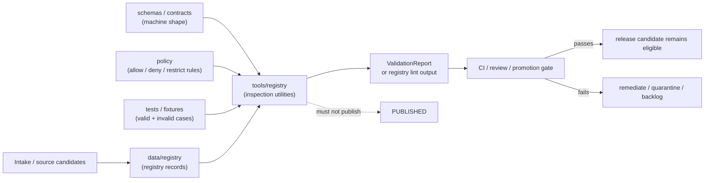

<!-- [KFM_META_BLOCK_V2]
doc_id: TODO(kfm://doc/<uuid>): assign from the repo document registry after verification
title: tools/registry README
type: standard
version: v1
status: draft
owners: TODO(registry/tooling owner)
created: TODO(verify existing file creation date before commit)
updated: 2026-04-25
policy_label: TODO(public|restricted): confirm against repo policy labels
related: [../../data/registry/README.md (NEEDS VERIFICATION), ../../schemas/README.md (NEEDS VERIFICATION), ../../policy/README.md (NEEDS VERIFICATION), ../../tests/README.md (NEEDS VERIFICATION)]
tags: [kfm, tools, registry, source-registry, validation, control-plane]
notes: [Target path requested as tools/registry/README.md; mounted repo was unavailable during drafting; directory contents, owners, doc_id, policy label, and adjacent links require verification]
[/KFM_META_BLOCK_V2] -->

# tools/registry

Purpose: define the governed tooling boundary for registry inspection, source-admission checks, and evidence-control-plane maintenance.

<div id="top"></div>

> [!IMPORTANT]
> **Status:** experimental — NEEDS VERIFICATION in a mounted KFM checkout  
> **Owners:** TODO(registry/tooling owner)  
> **Path:** `tools/registry/`  
> **Impact:** registry tools may support KFM governance, but they do **not** become source authority, policy authority, schema authority, or publication authority.


**Quick jumps:** [Scope](#scope) · [Repo fit](#repo-fit) · [Inputs](#accepted-inputs) · [Exclusions](#exclusions) · [Directory tree](#directory-tree) · [Quickstart](#quickstart) · [Usage contract](#usage-contract) · [Validation gates](#validation-gates) · [FAQ](#faq)

---

## Scope

`tools/registry/` is the proposed home for small, deterministic utilities that inspect, lint, summarize, or validate KFM registry/control-plane materials.

This directory is **not** the registry itself. It is a tooling lane that should read registry artifacts from their canonical homes, apply schema and policy checks, and emit reviewable validation outputs.

| Claim | Status | Working rule |
|---|---:|---|
| `tools/registry/` exists in the real repo | NEEDS VERIFICATION | Inspect the mounted checkout before asserting inventory. |
| This README is the requested target file | CONFIRMED | Target path supplied by the current documentation task. |
| Registry tools should be deterministic and no-network by default | PROPOSED | Aligns with KFM’s evidence-first, reversible, validation-first build posture. |
| Registry tools can publish or activate sources | DENY | Activation and publication require governed source, policy, review, and promotion state. |

> [!CAUTION]
> A registry tool can help evaluate whether an object is ready for review. It must not silently promote a source, mutate canonical truth, publish a layer, or bypass policy gates.

[Back to top](#top)

---

## Repo fit

| Role | Path / target | Status | Notes |
|---|---|---:|---|
| This README | `tools/registry/README.md` | PROPOSED | Commit or reconcile with an existing README after repo inspection. |
| Upstream registry records | [`../../data/registry/`](../../data/registry/) | NEEDS VERIFICATION | Expected home for source descriptors, source status, and admission metadata if repo convention confirms it. |
| Upstream schemas | [`../../schemas/`](../../schemas/) | NEEDS VERIFICATION | Machine contract location remains subject to schema-home ADR / repo convention. |
| Upstream policy | [`../../policy/`](../../policy/) | NEEDS VERIFICATION | Registry tools should call or reference policy; policy bodies belong in `policy/`. |
| Upstream intake/docs | [`../../docs/intake/`](../../docs/intake/) | NEEDS VERIFICATION | Exploratory or candidate registry ideas should move through intake, not become tool behavior by accident. |
| Downstream fixtures/tests | [`../../tests/`](../../tests/) | NEEDS VERIFICATION | Valid/invalid fixtures and no-network checks should prove tool behavior. |
| Downstream CI / checks | [`../../.github/workflows/`](../../.github/workflows/) | NEEDS VERIFICATION | Workflow names and enforcement status must be inspected before claiming automation. |

### Responsibility boundary



[Back to top](#top)

---

## Accepted inputs

Registry tools may read or validate the following, provided the paths are confirmed in the mounted repo:

| Input | What belongs | What the tool may do |
|---|---|---|
| Source descriptors | Source identity, source role, status, rights posture, cadence, review burden, activation state | Validate required fields, unknowns, status transitions, and link integrity. |
| Source authority registers | Authority ladder entries, source family labels, canon/lineage/exploratory status | Detect missing labels, unsupported upgrades, duplicate source claims, or stale authority notes. |
| Schema references | `$schema`, `schema_version`, object-family schema refs, fixture refs | Verify resolvability and warn on schema-home ambiguity. |
| Policy references | Policy bundle IDs, deny reason references, sensitivity rules, publication gates | Confirm referenced policy surfaces exist; do not define policy here. |
| Valid/invalid fixtures | Minimal registry examples for CI and review | Run no-network checks and emit clear failure reasons. |
| Generated validation summaries | Prior validation results, registry coverage summaries, lint reports | Compare, summarize, and report drift without overwriting authoritative objects. |

### Minimum input posture

Every accepted input should carry enough context to answer:

1. **What object is being checked?**
2. **Which schema or contract defines it?**
3. **Which source or registry family does it belong to?**
4. **Which policy or sensitivity posture applies?**
5. **What evidence supports the status claimed?**
6. **What must happen before public release or activation?**

[Back to top](#top)

---

## Exclusions

The following do **not** belong in `tools/registry/`:

| Excluded item | Why excluded | Preferred home |
|---|---|---|
| RAW, WORK, QUARANTINE, PROCESSED, CATALOG, TRIPLET, or PUBLISHED data | Tools must not become lifecycle storage. | `../../data/` lifecycle homes, after verification |
| Canonical source descriptors | Tooling should inspect registry truth, not own it. | `../../data/registry/` or confirmed registry home |
| Machine schemas | Schema authority must remain centralized. | `../../schemas/` or confirmed schema home |
| Policy rules | Policy must be reviewable as policy, not hidden inside scripts. | `../../policy/` |
| Live source connectors | Registry checks should be no-network by default. | Confirmed pipeline/connector home |
| Secrets, API keys, tokens, cookies | Security boundary violation. | Secret manager / deployment config, never committed |
| Public layer artifacts, tiles, PMTiles, COGs, scenes | Delivery artifacts are downstream of promotion. | Published/release artifact homes |
| Proof packs, signatures, release manifests | Tools may validate references; they should not own release evidence. | Release/proof homes after repo convention verification |
| UI components or Focus Mode behavior | Registry tooling is not product runtime. | Confirmed app/UI architecture path |

> [!WARNING]
> Do not add a tool that reaches external services by default. A live fetch must be explicitly reviewed, source-bounded, policy-aware, and separately gated.

[Back to top](#top)

---

## Directory tree

NEEDS VERIFICATION: no mounted repository tree was available while drafting this README. The tree below is a proposed orientation pattern, not confirmed inventory.

```text
tools/registry/
├── README.md                         # this file
├── <registry-checker>.py             # PROPOSED: deterministic registry validation entrypoint
├── <registry-link-linter>.py         # PROPOSED: path/ref/link integrity checker
├── <registry-coverage-reporter>.py   # PROPOSED: source/registry coverage summary generator
└── README.local.md                   # OPTIONAL: local maintainer notes, if repo convention permits
```

Preferred fixture placement is **not decided here**. If the repo already centralizes fixtures under `tests/fixtures/`, keep fixtures there and make tools read them by path. Do not create a parallel fixture world under `tools/registry/` without a local convention or ADR.

[Back to top](#top)

---

## Quickstart

### 1. Verify the real checkout first

```bash
git status --short
git branch --show-current
find tools/registry -maxdepth 2 -type f | sort
```

### 2. Inspect adjacent control-plane homes

```bash
find data/registry schemas policy tests docs -maxdepth 3 -type f 2>/dev/null | sort
```

### 3. Run the confirmed registry entrypoint

NEEDS VERIFICATION: replace the placeholder below with the repo-native command after the actual tool inventory is known.

```bash
# PSEUDOCODE — replace <registry-tool> with a confirmed script or module.
python tools/registry/<registry-tool>.py \
  --registry data/registry \
  --schemas schemas \
  --policy policy \
  --fixtures tests/fixtures
```

### 4. Preserve the output

Registry tools should emit machine-readable validation output when practical, and they should never hide failures in prose-only logs.

```bash
# PSEUDOCODE — output path depends on repo convention.
python tools/registry/<registry-tool>.py \
  --registry data/registry \
  --out /tmp/kfm-registry-validation.json
```

[Back to top](#top)

---

## Usage contract

Every registry tool in this directory should follow the same behavioral contract.

| Rule | Requirement |
|---|---|
| Deterministic by default | Same inputs produce the same outputs. |
| No live network by default | Any live fetch requires an explicit opt-in flag and source-policy review. |
| Read-only by default | Tools may report drift; writes require an explicit destination and reviewable diff. |
| Fail closed | Missing schema, missing policy, unknown rights, unknown status, or unresolved source role should fail or block promotion eligibility. |
| Emit reasons | Every failure must identify the object, rule, and remediation hint. |
| Separate report from proof | A validation report is useful process memory; it does not become proof of truth by itself. |
| Preserve lifecycle boundaries | Do not read RAW/WORK/QUARANTINE for public checks unless the tool is explicitly scoped for internal validation. |
| Avoid jargon drift | Use existing KFM object names where confirmed: `SourceDescriptor`, `EvidenceBundle`, `DecisionEnvelope`, `ReleaseManifest`, `CatalogMatrix`, `RunReceipt`, and related shared terms. |

### Preferred output shape

The exact schema is NEEDS VERIFICATION. Until a repo schema is confirmed, tools should at least report:

| Field | Purpose |
|---|---|
| `tool_name` | Which utility ran. |
| `tool_version` | Local semantic version or commit-derived version. |
| `input_refs` | Files or registry objects inspected. |
| `schema_refs` | Schemas/contracts used for validation. |
| `policy_refs` | Policy bundles or rule sets consulted. |
| `status` | `PASS`, `FAIL`, `ABSTAIN`, or `ERROR` as appropriate to the tool. |
| `findings` | Specific, reviewable issues. |
| `generated_at` | Timestamp, if the repo permits generated output timestamps. |
| `spec_hash` | Hash of the checked input set when available. |

[Back to top](#top)

---

## Registry surfaces this tooling may inspect

| Surface | Tooling question | Fail-closed condition |
|---|---|---|
| Source descriptor registry | Are required source identity, role, status, rights, cadence, and review fields present? | Unknown source role, unknown rights, or active status without review support. |
| Source authority register | Is the source being used for the claim type it is allowed to support? | Aggregator, model, or contextual source treated as authoritative without policy support. |
| Schema registry | Do all registry entries resolve to the expected schema version? | Missing schema, ambiguous schema home, or schema version drift. |
| Policy registry | Do registry records identify applicable policy gates? | Missing deny reason, sensitivity rule, publication rule, or review burden. |
| Evidence/proof references | Can an `EvidenceRef` resolve to the expected `EvidenceBundle` or proof object? | Broken reference, missing bundle, or unsupported citation chain. |
| Release/catalog closure | Does the object link cleanly to catalog/release records when required? | Catalog record, release manifest, proof pack, or digest mismatch. |

[Back to top](#top)

---

## Validation gates

Use this checklist before adding or changing tools in this directory.

- [ ] The mounted repo was inspected and current directory inventory was recorded.
- [ ] This README’s metadata block has a real `doc_id`, owner, policy label, and related links.
- [ ] Every tool has a short entrypoint description and a declared input/output contract.
- [ ] Every tool is no-network by default.
- [ ] Every tool fails closed on unknown source role, missing schema, missing policy, or unknown rights.
- [ ] Every tool emits reviewable reasons, not just `true` / `false`.
- [ ] Valid and invalid fixtures exist in the repo’s confirmed fixture home.
- [ ] CI uses no live source endpoints for ordinary registry validation.
- [ ] Registry tools do not publish, promote, sign, or mutate canonical truth directly.
- [ ] Rollback is simple: remove the tool and its generated non-authoritative outputs without migrating data.

### Definition of done for this README

- [ ] Repo owner confirms whether `tools/registry/` is the correct tooling home.
- [ ] Adjacent relative links are verified from this file location.
- [ ] Placeholder badges are replaced or approved as documentation-only badges.
- [ ] The proposed tree is updated to the actual tree.
- [ ] Quickstart commands are replaced with confirmed entrypoints.
- [ ] The README is cross-linked from the parent `tools/README.md` if that file exists.

[Back to top](#top)

---

## Maintenance rules

1. **Do not hide authority decisions in scripts.** If a tool needs a new source status, policy category, or schema family, update the registry/policy/schema docs first.
2. **Do not turn exploratory intake into registry truth.** New Ideas and source-refresh candidates must be triaged before registry activation.
3. **Do not use a successful lint as publication approval.** Validation can support review; it does not replace promotion.
4. **Do not fork object names casually.** Prefer shared KFM terms and schemas where they exist.
5. **Do not normalize away uncertainty.** `UNKNOWN`, `NEEDS VERIFICATION`, and `ABSTAIN` are useful outcomes when evidence is incomplete.

[Back to top](#top)

---

## FAQ

### Is `tools/registry/` the source registry?

No. It is a proposed tooling home. Source registry records belong in the confirmed registry location, likely `data/registry/` unless the mounted repo proves otherwise.

### Can tools here activate a source?

No. A source can only become active through governed source metadata, policy checks, review state, and whatever promotion path the repo confirms.

### Can tools here write generated reports?

PROPOSED: yes, but only to a non-authoritative output path and only when the output is clearly labeled as validation/process memory. Generated reports are not canonical truth.

### What should happen when schema home is ambiguous?

ABSTAIN or fail closed. Record the ambiguity and route the decision through the schema-home ADR or equivalent repo-native decision record.

### What should happen when a registry record has unknown rights?

Fail closed for public release eligibility. Unknown rights may remain in intake or quarantine, but should not pass source activation or publication checks.

[Back to top](#top)

---

## Appendix: truth labels used here

<details>
<summary>Open truth-label reference</summary>

| Label | Meaning in this README |
|---|---|
| CONFIRMED | Verified by the current task or must be true because this is the requested target file. |
| INFERRED | Reasonable repo-doc classification based on the target path and KFM doctrine, but not directly verified from a mounted repo. |
| PROPOSED | Recommended behavior or structure for review before commit. |
| UNKNOWN | Not knowable from the drafting session because the mounted repo was unavailable. |
| NEEDS VERIFICATION | Specific item that must be checked in the real repo before claiming it as implementation fact. |
| DENY | Behavior that would violate the intended KFM trust boundary. |
| ABSTAIN | Correct response when evidence, schema, policy, rights, or source role is insufficient. |

</details>

---

## Appendix: pre-publish checklist

<details>
<summary>Open README checklist</summary>

- [x] One H1.
- [x] One-line purpose directly below title.
- [x] Top-of-file impact block.
- [x] Status, owner placeholder, badges, and quick jumps.
- [x] Scope.
- [x] Repo fit with path and upstream/downstream references.
- [x] Accepted inputs.
- [x] Exclusions with preferred homes.
- [x] Directory tree, labeled NEEDS VERIFICATION.
- [x] Quickstart with safe discovery commands.
- [x] Meaningful Mermaid diagram.
- [x] Registry surface table.
- [x] Task list / definition of done.
- [x] FAQ.
- [x] Long appendix content wrapped in `<details>`.
- [x] No claim of current tool implementation.
- [x] Placeholders left visibly reviewable.

</details>

[Back to top](#top)
