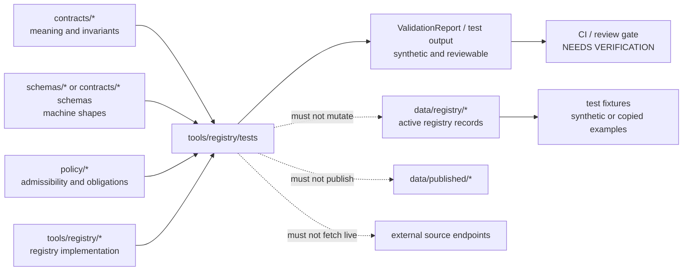

<!-- [KFM_META_BLOCK_V2]
doc_id: kfm://doc/<NEEDS_VERIFICATION_UUID>
title: tools/registry/tests
type: standard
version: v1
status: draft
owners: <NEEDS_VERIFICATION_OWNER>
created: 2026-04-25
updated: 2026-04-25
policy_label: <NEEDS_VERIFICATION_POLICY_LABEL>
related: [../README.md, ../../../data/registry/README.md, ../../../contracts/README.md, ../../../schemas/README.md, ../../../policy/README.md, ../../../tests/fixtures/README.md, ../../../docs/registers/README.md]
tags: [kfm, tools, registry, tests, fixtures, validation]
notes: [Mounted repo tree was not available in the authoring session; owner, doc_id, policy label, local runner, and exact adjacent paths remain NEEDS VERIFICATION.]
[/KFM_META_BLOCK_V2] -->

<a id="top"></a>

# `tools/registry/tests/`

Registry-test workspace for proving KFM registry artifacts stay schema-valid, policy-linked, fixture-backed, and safe for governed validation.

> [!NOTE]
> **Status:** experimental  
> **Document status:** draft  
> **Owners:** `<NEEDS_VERIFICATION_OWNER>`  
> **Path:** [`tools/registry/tests/README.md`](./README.md)  
> **Repo fit:** child test lane under [`../README.md`](../README.md); upstream registry records are expected under [`../../../data/registry/README.md`](../../../data/registry/README.md); contract/schema authority is expected through [`../../../contracts/README.md`](../../../contracts/README.md) and/or [`../../../schemas/README.md`](../../../schemas/README.md); release admissibility is expected through [`../../../policy/README.md`](../../../policy/README.md); cross-cutting fixtures may live under [`../../../tests/fixtures/README.md`](../../../tests/fixtures/README.md). All adjacent links are **NEEDS VERIFICATION** in the mounted checkout.  
>      
> **Quick jumps:** [Scope](#scope) · [Repo fit](#repo-fit) · [Inputs](#inputs) · [Exclusions](#exclusions) · [Directory tree](#directory-tree) · [Quickstart](#quickstart) · [Test matrix](#test-matrix) · [Definition of done](#definition-of-done) · [Open verification](#open-verification)

---

## Scope

`tools/registry/tests/` holds tests for the **registry control surface** of KFM.

A registry test is not a registry record, not a policy rule, not a production receipt, and not a promotion decision. It is a small, reviewable proof that registry-shaped artifacts can be checked before downstream tooling trusts them.

In KFM terms, this lane helps keep registry artifacts aligned with:

- source-role discipline
- contract/schema expectations
- fixture-backed validation
- policy and sensitivity handoff
- deterministic identity such as `spec_hash` where applicable
- fail-closed behavior when evidence, rights, linkage, or source authority is unclear

> [!IMPORTANT]
> Tests here may prove registry behavior. They must not promote data, mutate canonical registries, fetch live sources, publish artifacts, or bypass the KFM truth path.

---

## Repo fit

| Relationship | Path | Role | Status |
|---|---|---|---|
| This README | [`./README.md`](./README.md) | Directory landing page and contribution rules | CONFIRMED by requested target path |
| Parent registry tooling | [`../README.md`](../README.md) | Expected owner of registry tool behavior | NEEDS VERIFICATION |
| Tooling root | [`../../README.md`](../../README.md) | Expected tools-area orientation | NEEDS VERIFICATION |
| Source registry | [`../../../data/registry/README.md`](../../../data/registry/README.md) | Expected home for active source, dataset, layer, and vocabulary registry records | NEEDS VERIFICATION |
| Contracts | [`../../../contracts/README.md`](../../../contracts/README.md) | Human-readable object meaning, invariants, lifecycle intent | NEEDS VERIFICATION |
| Schemas | [`../../../schemas/README.md`](../../../schemas/README.md) | Machine-checkable shapes and executable constraints | NEEDS VERIFICATION |
| Policy | [`../../../policy/README.md`](../../../policy/README.md) | Rights, sensitivity, release, denial, and obligation logic | NEEDS VERIFICATION |
| Shared fixtures | [`../../../tests/fixtures/README.md`](../../../tests/fixtures/README.md) | Cross-cutting valid/invalid exemplars | NEEDS VERIFICATION |
| Registers | [`../../../docs/registers/README.md`](../../../docs/registers/README.md) | Authority, lineage, and index documentation | NEEDS VERIFICATION |

### Responsibility boundary



[Back to top](#top)

---

## Inputs

Accepted inputs are intentionally narrow.

| Input | Belongs here? | Why |
|---|---:|---|
| Synthetic valid registry fixtures | yes | Proves minimum acceptable shape without relying on live data |
| Synthetic invalid registry fixtures | yes | Proves fail-closed behavior and meaningful error reporting |
| Golden validation outputs | yes | Locks expected messages, reason codes, and stable ordering |
| Regression cases for known registry drift | yes | Prevents recurrence of previously fixed validation gaps |
| Test helpers local to registry tests | yes | Keeps registry-test setup readable and isolated |
| Fixture copies of active registry records | conditional | Allowed only when copied intentionally, scrubbed, and marked as fixture material |
| Live source URLs, credentials, tokens, or secret-bearing examples | no | Live source activation and credentials do not belong in tests |
| Production `RunReceipt`, `ProofPack`, or release objects | no | Tests may use synthetic examples only |

---

## Exclusions

| Does not belong here | Where it should go instead | Reason |
|---|---|---|
| Active source descriptors | `data/registry/` | Registry tests must not become canonical source registry state |
| Canonical contract narratives | `contracts/` | Tests exercise contracts; they do not define object meaning |
| Canonical JSON Schemas | `schemas/` or the repo-confirmed schema home | Tests consume schemas; they do not settle schema authority |
| Policy rules | `policy/` | Tests verify policy handoff; they do not own release logic |
| Validator implementation | `tools/registry/` or `tools/validators/` | Test code should not hide production validation behavior |
| Emitted receipts or proof packs | `data/receipts/` and `data/proofs/` | Process memory and proof artifacts remain separate object families |
| Published artifacts | `data/published/` | Publication is a governed state transition, not a test side effect |
| Live probes or watchers | `tools/probes/`, `pipelines/`, or repo-confirmed equivalent | Tests should be no-network by default |
| Broad integration scenarios | `tests/e2e/` or repo-confirmed equivalent | This directory should stay focused on registry behavior |

---

## Directory tree

Current mounted tree: **UNKNOWN** in this authoring session.

The target shape below is a **PROPOSED** directory map for maintainers to compare against the real checkout.

```text
tools/registry/tests/
├── README.md
├── fixtures/
│   ├── valid/
│   │   └── minimal-source-descriptor.example.json
│   ├── invalid/
│   │   ├── missing-policy-label.example.json
│   │   ├── unresolved-schema-ref.example.json
│   │   └── live-credential-leak.example.json
│   └── edge/
│       └── superseded-source-id.example.json
├── golden/
│   ├── minimal-source-descriptor.report.json
│   └── invalid-registry-errors.report.json
├── regression/
│   └── README.md
└── smoke/
    └── README.md
```

> [!WARNING]
> Do not create these subdirectories merely to match this README. First inspect the mounted repo. If the repo already has a different fixture convention, update this README to point to the existing convention rather than duplicating authority.

---

## Quickstart

The local test runner is **NEEDS VERIFICATION**. Use the repo-native command once it is confirmed.

```bash
# pseudocode — replace with the mounted repo's documented test runner
<repo-native-test-runner> tools/registry/tests
```

Candidate runner families to verify before documenting as fact:

```bash
# pseudocode examples only — do not copy into CI until verified
pytest tools/registry/tests
npm test -- tools/registry/tests
pnpm test tools/registry/tests
make test-registry
just test-registry
```

### Safety expectation

Registry tests should default to:

- no live network calls
- no credential loading
- no writes to `data/registry/`
- no writes to lifecycle directories
- deterministic fixture ordering
- explicit failure messages for missing registry linkage

```bash
# pseudocode — intended safety posture, not confirmed command syntax
KFM_TEST_NETWORK=0 <repo-native-test-runner> tools/registry/tests
```

[Back to top](#top)

---

## Test matrix

| Test family | What it proves | Expected outcome | Fails closed when |
|---|---|---|---|
| Fixture shape | Registry examples match the canonical schema home | `PASS` / valid report | Schema missing, schema ambiguous, malformed fixture |
| Required registry fields | Source identity, role, rights, policy label, cadence, and review fields are present when required | `PASS` / valid report | Required registry field is absent or unknown |
| Linkage integrity | Registry records point to resolvable schema, policy, fixture, and documentation references | `PASS` / link report | Any required reference cannot be resolved |
| Policy handoff | Policy labels and sensitivity classes are represented as policy-owned tokens, not invented by tests | `PASS` / policy-link report | Unknown policy label, missing rights posture, unsupported sensitivity state |
| Deterministic identity | Stable identifiers and `spec_hash`-like fields are reproducible where required | `PASS` / hash report | Hash drift, non-canonical ordering, duplicate IDs |
| No-network guard | Test fixtures do not trigger live source calls | `PASS` / no-network report | HTTP request, credential lookup, or external dependency is attempted |
| Regression cases | Known registry failure modes stay fixed | `PASS` / regression report | Previously closed failure reappears |
| Golden output drift | Error codes and result ordering remain stable enough for review | `PASS` / golden diff clean | Unexpected diff without changelog or reviewer approval |

### Preferred finite outcomes

Use repo-confirmed enums when available. Until that is verified, keep local test language aligned with the KFM pattern:

| Context | Preferred outcome set | Notes |
|---|---|---|
| Test result | `PASS`, `FAIL`, `ERROR` | Test-runner level; not a promotion decision |
| Policy decision fixture | `ALLOW`, `ABSTAIN`, `DENY`, `ERROR` | Policy-owned semantics |
| Promotion-gate fixture | `PASS`, `HOLD`, `DENY`, `ERROR` | Promotion-owned semantics |
| Runtime envelope fixture | `ANSWER`, `ABSTAIN`, `DENY`, `ERROR` | Runtime-owned semantics |

> [!CAUTION]
> Do not collapse policy, test, promotion, and runtime outcomes into one enum unless the canonical vocabulary registry explicitly allows that mapping.

---

## Fixture discipline

Every fixture added here should answer four review questions:

1. What registry behavior is being proved?
2. Which schema, contract, policy, or registry entry is the fixture exercising?
3. Is the fixture synthetic, copied from a scrubbed registry record, or derived from a prior regression?
4. What should fail if this fixture is changed incorrectly?

### Naming pattern

Use names that explain both the registry family and the expected behavior.

```text
<registry-family>.<case-kind>.<expected-outcome>.json
```

Examples:

```text
source-descriptor.minimal.valid.json
source-descriptor.missing-policy-label.invalid.json
vocabulary.unknown-runtime-outcome.invalid.json
layer-registry.unreleased-source-id.invalid.json
catalog-matrix.missing-proof-ref.invalid.json
```

---

## Review rules

A registry-test PR is ready for review only when it includes enough context to prevent orphaned tests.

| Requirement | Why it matters |
|---|---|
| Fixture has a clear expected outcome | Prevents tests from becoming opaque snapshots |
| Fixture links to schema or contract authority | Keeps tests subordinate to object meaning |
| Invalid fixture proves a real denial or error path | Avoids decorative negative tests |
| Golden output is deterministic | Keeps review diffs meaningful |
| Test does not fetch live sources | Preserves local and CI reproducibility |
| Changelog or PR note explains changed failures | Makes drift reviewable |
| Sensitive or exact-location content is absent | Keeps tests public-safe by default |

---

## Definition of done

- [ ] Mounted repo has been inspected for the actual test runner and fixture convention.
- [ ] Parent [`../README.md`](../README.md) links to this README, or a maintainer records why it should remain unlinked.
- [ ] Active registry records are not stored in this directory.
- [ ] Valid and invalid fixtures are separated.
- [ ] Every invalid fixture has an expected reason code or failure message.
- [ ] Tests run without live network access.
- [ ] Tests do not write to lifecycle directories.
- [ ] Schema-home ambiguity is resolved or explicitly marked in an ADR.
- [ ] Policy-token drift is caught by at least one fixture or registry check.
- [ ] CI integration is documented only after the workflow path is confirmed.

---

## Rollback path

If this directory or its tests cause false confidence, drift, or CI instability:

1. Revert the test change or disable only the new registry-test job.
2. Preserve useful fixtures under a regression or lineage folder if the repo convention supports it.
3. Record the reason in the PR or changelog.
4. Keep default registry behavior fail-closed while the test is repaired.
5. Do not relax registry, policy, or source-descriptor requirements just to make the test pass.

---

## FAQ

### Can tests here touch real source endpoints?

No. Live source probes belong in a probe or pipeline lane, with source terms, cadence, credentials, and receipts handled explicitly.

### Can this directory define a source descriptor?

No. It can hold fixture copies of source descriptors. Active source descriptors belong in `data/registry/` or the repo-confirmed registry home.

### Can a failing registry test block publication?

Indirectly, yes. The test may feed CI or a promotion gate. The test itself is not a promotion decision.

### What happens if `contracts/` and `schemas/` disagree?

Mark the conflict as **NEEDS VERIFICATION**, resolve canonical schema ownership through an ADR, and refuse new tests that silently choose one home without review.

---

## Open verification

| Item | Status | Owner |
|---|---|---|
| Actual contents of `tools/registry/tests/` | UNKNOWN | `<NEEDS_VERIFICATION_OWNER>` |
| Parent `tools/registry/` README and command surface | UNKNOWN | `<NEEDS_VERIFICATION_OWNER>` |
| Canonical schema home | NEEDS VERIFICATION | `<NEEDS_VERIFICATION_OWNER>` |
| Repo-native test runner | NEEDS VERIFICATION | `<NEEDS_VERIFICATION_OWNER>` |
| CI workflow that should call registry tests | NEEDS VERIFICATION | `<NEEDS_VERIFICATION_OWNER>` |
| Whether shared fixtures live here or under `tests/fixtures/` | NEEDS VERIFICATION | `<NEEDS_VERIFICATION_OWNER>` |
| Whether a governed vocabulary registry already exists | NEEDS VERIFICATION | `<NEEDS_VERIFICATION_OWNER>` |

<details>
<summary>Appendix: proposed fixture review card</summary>

Use this card in PR descriptions when adding or changing registry fixtures.

| Field | Value |
|---|---|
| Fixture path | `<path>` |
| Registry family | `<source-descriptor | vocabulary | layer-registry | catalog-matrix | other>` |
| Case type | `<valid | invalid | edge | regression>` |
| Expected outcome | `<PASS | FAIL | ERROR | other repo-confirmed token>` |
| Expected reason code | `<reason-code or none>` |
| Schema or contract authority | `<relative path or kfm:// id>` |
| Policy linkage | `<relative path or kfm:// id>` |
| Network behavior | `no-network` |
| Sensitive content present? | `no` |
| Drift risk | `<low | medium | high>` |
| Rollback note | `<how to revert safely>` |

</details>

[Back to top](#top)
