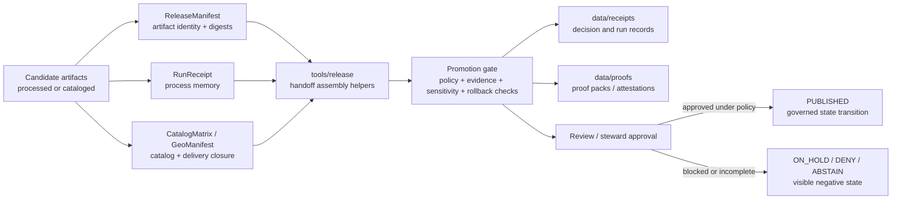

<!-- [KFM_META_BLOCK_V2]
doc_id: kfm://doc/tools_release_readme
title: tools/release
type: standard
version: v1
status: active
owners: release-tooling
created: 2026-04-28
updated: 2026-04-28
policy_label: internal
related: [../README.md, ../ci/README.md, ../validators/README.md, ../validators/promotion_gate/README.md, ../attest/README.md, ../../data/receipts/README.md, ../../data/proofs/README.md, ../../schemas/README.md, ../../schemas/contracts/README.md, ../../policy/README.md, ../../tests/e2e/release_assembly/README.md, ../../.github/workflows/README.md]
tags: [kfm, tools, release, release-assembly, proof-pack, release-manifest, receipts, promotion, rollback]
notes: [Repository-mounted update completed with executable inventory and runnable release publication helper documentation.]
[/KFM_META_BLOCK_V2] -->

<a id="top"></a>

# `tools/release/`

Release helper tooling for assembling, checking, and summarizing KFM release candidates without becoming the act of publication.

> [!IMPORTANT]
> **Status:** experimental  
> **Document status:** active  
> **Owners:** `release-tooling`  
> **Path:** `tools/release/README.md`  
> **Repo fit:** child tooling lane under [`../README.md`](../README.md), adjacent to [`../ci/README.md`](../ci/README.md), [`../validators/promotion_gate/README.md`](../validators/promotion_gate/README.md), and [`../attest/README.md`](../attest/README.md); downstream into release review, [`../../data/receipts/README.md`](../../data/receipts/README.md), [`../../data/proofs/README.md`](../../data/proofs/README.md), and [`../../tests/e2e/release_assembly/README.md`](../../tests/e2e/release_assembly/README.md).  
> **Quick jumps:** [Scope](#scope) · [Repo fit](#repo-fit) · [Accepted inputs](#accepted-inputs) · [Exclusions](#exclusions) · [Current evidence snapshot](#current-evidence-snapshot) · [Directory tree](#directory-tree) · [Quickstart](#quickstart) · [Usage](#usage) · [Diagram](#diagram) · [Operating tables](#operating-tables) · [Task list](#task-list--definition-of-done) · [FAQ](#faq) · [Appendix](#appendix)


> [!NOTE]
> In KFM, promotion is a governed state transition, not a file move. This directory may help assemble release evidence, but it must not quietly publish, promote, sign, or expose artifacts by itself.

---

## Scope

`tools/release/` is the home for small, deterministic helper scripts that make **release candidates reviewable**.

This lane may help:

- assemble release-candidate handoff packets from already-produced artifacts
- summarize `ReleaseManifest`, `ProofPack`, `CatalogMatrix`, `GeoManifest`, and `LayerManifest` inputs
- render reviewer-facing release summaries
- check that receipts, proof references, rollback references, and policy decisions are present
- prepare CI-readable release assembly reports
- support rollback and correction review by making release lineage visible

This lane is intentionally narrow. It supports the release path; it does not own the release decision.

[Back to top](#top)

---

## Repo fit

| Relationship | Path or surface | Role |
|---|---|---|
| Parent tooling index | [`../README.md`](../README.md) | Local owner of tool-lane conventions and cross-tool navigation. |
| CI summary helpers | [`../ci/README.md`](../ci/README.md) | Publishes or renders reviewer summaries after release checks run. |
| Promotion gate | [`../validators/promotion_gate/README.md`](../validators/promotion_gate/README.md) | Decides whether a release candidate is promotable under KFM governance. |
| Attestation tooling | [`../attest/README.md`](../attest/README.md) | Handles signing or attestation helpers when verified; release helpers should not hide this boundary. |
| Receipts | [`../../data/receipts/README.md`](../../data/receipts/README.md) | Process memory: what ran, when, with which inputs, and with which validation outcomes. |
| Proofs | [`../../data/proofs/README.md`](../../data/proofs/README.md) | Release-significant proof objects, proof packs, attestations, rollback references, and correction lineage. |
| Schema and contract authority | [`../../schemas/README.md`](../../schemas/README.md), [`../../schemas/contracts/README.md`](../../schemas/contracts/README.md) | Machine-readable object definitions; this lane consumes them but does not redefine them. |
| Policy authority | [`../../policy/README.md`](../../policy/README.md) | Rights, sensitivity, source-role, and release-policy logic; this lane reports policy state but does not create it. |
| E2E release proof | [`../../tests/e2e/release_assembly/README.md`](../../tests/e2e/release_assembly/README.md) | Whole-path verification that release assembly remains complete and reviewable. |

[Back to top](#top)

---

## Accepted inputs

Release helpers may consume only artifacts that have already passed the relevant upstream lifecycle and validation steps.

| Input family | Belongs here when… | Required posture |
|---|---|---|
| `ReleaseManifest` | The release candidate has a digest-bearing manifest with artifact identity and release-state fields. | Must include rollback target or explicit rollback gap. |
| `ProofPack` / proof refs | Release-significant checks have been gathered for reviewer inspection. | Must stay separate from receipts and catalogs. |
| `RunReceipt` / validation reports | Candidate-producing jobs emitted process memory and validation outcomes. | Must be append-only review evidence, not proof by itself. |
| `CatalogMatrix` | STAC/DCAT/PROV/internal references close over the candidate. | Missing closure should block promotion handoff. |
| `GeoManifest` / layer delivery manifests | Geospatial assets such as PMTiles, COG, GeoParquet, or layer definitions are release candidates. | Artifact digest and declared media type must be explicit. |
| `PolicyDecision` / `DecisionEnvelope` | Policy evaluation has produced a finite allow, deny, defer, or hold-style outcome. | Fail-closed when rights, source role, sensitivity, or evidence closure is unresolved. |
| `CorrectionNotice` / rollback refs | The candidate supersedes, corrects, withdraws, or rolls back a previous release. | Public-facing lineage must remain reconstructable. |
| Reviewer notes | Human review is required by risk class or policy. | Must not be converted into publication without a governed decision. |

[Back to top](#top)

---

## Exclusions

| Does **not** belong in `tools/release/` | Goes instead | Reason |
|---|---|---|
| Source ingestion, crawling, live API fetches, or watcher logic | Source-specific pipeline/tooling lanes | Release helpers should not create new evidence. |
| Canonical schema or contract definitions | [`../../schemas/README.md`](../../schemas/README.md), [`../../contracts/README.md`](../../contracts/README.md) | Contract authority must remain centralized. |
| Policy rules, source-role law, rights logic, or sensitivity law | [`../../policy/README.md`](../../policy/README.md) | Release helpers report policy outcomes; they do not define policy. |
| Promotion decision authority | [`../validators/promotion_gate/README.md`](../validators/promotion_gate/README.md) | Promotion is a governed decision, not a release helper side effect. |
| Signing, key management, or attestation authority | [`../attest/README.md`](../attest/README.md) | Signatures and proof bundles must remain auditable and separable. |
| Direct writes to `data/published/` | Governed publication workflow | Hidden direct publication is a trust-membrane bypass. |
| UI rendering, Evidence Drawer components, or Focus Mode answers | UI/runtime lanes | Release evidence can feed UI surfaces, but this lane is not a UI. |
| AI inference or prompt assembly | Governed AI/runtime lanes | AI is interpretive and evidence-subordinate; it is never release authority. |
| Secrets, deployment credentials, or signing keys | Secret manager / deployment controls | Release artifacts and receipts must not leak secrets. |

[Back to top](#top)

---

## Current evidence snapshot

| Item | Status | Reading rule |
|---|---:|---|
| Target file requested | CONFIRMED | User requested `tools/release/README.md`. |
| Mounted KFM repo available during drafting | CONFIRMED | Inventory verified in `/workspace/Kansas-Frontier-Matrix`. |
| `tools/release/` existing directory contents | CONFIRMED | Contains `README.md` and `publish_release.py`. |
| Release object vocabulary | CONFIRMED doctrine / PROPOSED implementation | KFM doctrine repeatedly names release manifests, proof packs, receipts, catalog closure, policy decisions, rollback, and correction as distinct surfaces. |
| Exact executable entrypoints | NEEDS VERIFICATION | Do not document `python`, `node`, `make`, `pnpm`, or workflow calls as authoritative until branch evidence proves them. |
| CI enforcement posture | UNKNOWN | Workflow presence and branch protection must be verified separately. |

[Back to top](#top)

---

## Directory tree

Only the README target is specified by this task. Other helper files must be inventoried or proposed after the real repo is mounted.

```text
tools/release/
├── README.md
└── publish_release.py
```

Current executable:

| File | Status | Purpose |
|---|---:|---|
| `publish_release.py` | CONFIRMED | Resolves `ReleaseManifest` closure and emits a local publish receipt when closure is `PUBLISHABLE`. |

[Back to top](#top)

---

## Quickstart

Start with repo inspection. Do not run or document a release command until the active branch proves the command exists.

```bash
# From the repository root, after mounting the real checkout.
git status --short
git branch --show-current

# Inspect this lane and adjacent release-governance lanes.
find tools/release -maxdepth 3 -type f 2>/dev/null | sort
find tools/validators/promotion_gate tools/attest tools/ci -maxdepth 3 -type f 2>/dev/null | sort

# Search for existing release object vocabulary before adding names.
rg -n \
  -e 'ReleaseManifest' \
  -e 'ProofPack' \
  -e 'CatalogMatrix' \
  -e 'GeoManifest' \
  -e 'PromotionDecision' \
  -e 'CorrectionNotice' \
  -e 'RollbackReference' \
  -e 'run_receipt' \
  -e 'DecisionEnvelope' \
  tools data docs schemas contracts policy tests .github || true
```

> [!TIP]
> A safe first PR for this lane is README-only or README + no-network fixtures. A helper PR should come later, with valid/invalid fixtures, tests, and CI output that prove it cannot publish directly.

### Run `publish_release.py`

```bash
# Validate closure and print publish plan without writing receipts.
python tools/release/publish_release.py \
  --dry-run \
  tests/fixtures/release/valid/minimal.release-manifest.json

# Publish locally (writes a receipt under data/receipts/release/ by default).
python tools/release/publish_release.py \
  tests/fixtures/release/valid/minimal.release-manifest.json
```

If local validator dependencies are missing (for example `jsonschema`), closure
resolution will deny publication and include validator stderr in the failure
reason so remediation is explicit.

[Back to top](#top)

---

## Usage

### Release handoff sequence

1. Candidate-producing lane emits artifacts, receipts, and validation reports.
2. Catalog/provenance tooling closes STAC/DCAT/PROV/internal references where applicable.
3. `tools/release/` summarizes the candidate and checks for missing handoff material.
4. Promotion-gate validators evaluate policy, evidence closure, sensitivity, rollback, and review requirements.
5. Reviewer or steward decision is recorded according to risk class.
6. Only the governed publication workflow moves a candidate to `PUBLISHED`.

### Illustrative release handoff payload

This example is a shape guide, not a confirmed schema.

```json
{
  "release_candidate_id": "NEEDS_VERIFICATION",
  "status": "READY_FOR_REVIEW",
  "release_manifest_ref": "kfm://release-manifest/NEEDS-VERIFICATION",
  "proof_pack_ref": "kfm://proof-pack/NEEDS-VERIFICATION",
  "catalog_matrix_ref": "kfm://catalog-matrix/NEEDS-VERIFICATION",
  "policy_decision_ref": "kfm://policy-decision/NEEDS-VERIFICATION",
  "rollback_ref": "kfm://rollback/NEEDS-VERIFICATION",
  "receipts": [
    "kfm://receipt/NEEDS-VERIFICATION"
  ],
  "gaps": [],
  "decision": "NEEDS_REVIEW"
}
```

[Back to top](#top)

---

## Diagram



[Back to top](#top)

---

## Operating tables

### Release gate handoff matrix

| Gate | Release question | `tools/release/` responsibility |
|---:|---|---|
| A | Do schemas and fixtures validate? | Report validation status; do not redefine schemas. |
| B | Do source rights and source-role policy allow this use? | Surface the policy decision and unresolved obligations. |
| C | Does evidence and citation closure pass? | Show EvidenceBundle or EvidenceRef closure status. |
| D | Do sensitivity and redaction checks pass? | Surface exact-location, privacy, rights, and redaction outcomes. |
| E | Does catalog closure pass? | Confirm `CatalogMatrix` / STAC / DCAT / PROV references are present when required. |
| F | Do proof and release objects include hashes and rollback target? | Highlight missing digests, proof refs, or rollback refs before promotion. |
| G | Does reviewer or steward approval match the candidate risk class? | Prepare handoff material; do not approve on behalf of reviewers. |

### Role boundary

| Surface | Can assemble? | Can decide? | Can publish? | Notes |
|---|---:|---:|---:|---|
| `tools/release/` | Yes | No | No | Handoff and summary helpers only. |
| `tools/validators/promotion_gate/` | No | Yes, within validator contract | No | Emits governed decision envelope. |
| `tools/attest/` | No | No | No | Handles signature/attestation helpers when verified. |
| `data/receipts/` | No | No | No | Process memory and replay context. |
| `data/proofs/` | No | No | No | Proof objects and rollback/correction evidence. |
| Publication workflow | No | No | Yes, after gates | Must be governed and auditable. |

[Back to top](#top)

---

## Task list / definition of done

A change in `tools/release/` is not done until it satisfies the relevant checklist.

- [ ] Existing branch inventory inspected before adding or renaming helper files.
- [ ] KFM Meta Block V2 present on README or standard Markdown additions.
- [ ] Helper purpose is bounded to assembly, summary, or handoff.
- [ ] No helper writes directly to `data/published/` or bypasses promotion gates.
- [ ] No helper fetches live source data.
- [ ] Valid and invalid fixtures cover missing manifest, missing proof, missing catalog closure, denied policy, missing rollback, and stale candidate cases.
- [ ] Output is machine-readable and reviewer-readable when the helper emits reports.
- [ ] Receipts and proofs remain separate.
- [ ] Promotion decision remains external to this lane.
- [ ] Rollback or correction reference is explicit for release-significant candidates.
- [ ] CI integration is documented only after workflow evidence exists.
- [ ] Security review confirms no secrets, tokens, signing keys, or private source contents are written to logs, receipts, prompts, summaries, or UI payloads.

[Back to top](#top)

---

## FAQ

### Is `tools/release/` the release system?

No. It is a helper lane for release assembly and handoff. The release system is the governed chain of schemas, policies, validators, receipts, proofs, review state, and publication workflows.

### Can a helper here promote a candidate?

No. Promotion belongs to the governed promotion gate and review path. A helper may say “ready for promotion review” only when it has evidence for that statement.

### Can this lane sign artifacts?

Not by default. Signing and attestation belong in `tools/attest/` or another verified attestation lane. `tools/release/` may reference signatures, but should not hide signing authority.

### What should happen when a release candidate is incomplete?

Fail closed. Emit a visible `ON_HOLD`, `DENY`, `ABSTAIN`, or equivalent finite negative state according to the verified decision vocabulary, and preserve the reason in receipts or reviewer summaries.

[Back to top](#top)

---

## Appendix

<details>
<summary>Truth labels used in this README</summary>

| Label | Meaning |
|---|---|
| CONFIRMED | Verified in this drafting pass from the user request, current workspace inspection, or attached KFM doctrine. |
| PROPOSED | Recommended lane shape, helper family, or review behavior not verified as current implementation. |
| UNKNOWN | Not verifiable without the mounted repository, current branch, tests, workflows, or runtime artifacts. |
| NEEDS VERIFICATION | Must be checked in the real repository before treating as settled. |

</details>

<details>
<summary>Review prompts for maintainers</summary>

Before merge, answer these in the PR:

1. Does `tools/release/` already exist on the active branch?
2. Are any helper names in this README already present, differently named, or obsolete?
3. Which runner is repo-native for this lane: Python, Node, Make, shell, or something else?
4. Is the release assembly test family present and executable?
5. Which workflows call release helpers, if any?
6. What branch-protection or required-check setting makes release validation meaningful?
7. Does the helper output include enough evidence for rollback and correction review?
8. Does any helper risk becoming a direct-publish shortcut?

</details>

<details>
<summary>Glossary</summary>

| Term | KFM meaning in this README |
|---|---|
| Release candidate | A candidate artifact or bundle that may be reviewed for publication, but is not yet public truth. |
| ReleaseManifest | Release artifact identity, digest, source-reference, catalog/proof, and rollback linkage surface. |
| ProofPack | Release-significant verification bundle; separate from receipts. |
| RunReceipt | Append-only process memory describing what ran and what it observed. |
| CatalogMatrix | Closure surface across catalog, provenance, distribution, and internal identifiers. |
| PromotionDecision | Governed state-transition decision; not a file move. |
| CorrectionNotice | Post-publication correction, supersession, withdrawal, or rollback lineage object. |

</details>

[Back to top](#top)
