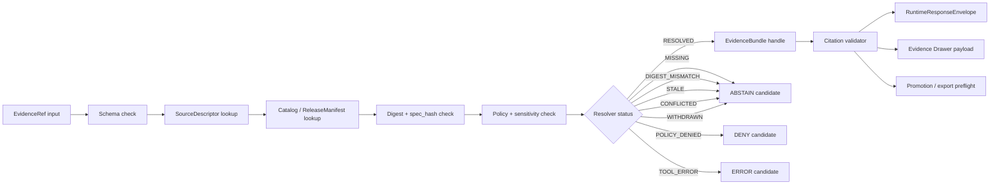

<!-- [KFM_META_BLOCK_V2]
doc_id: kfm://doc/NEEDS_VERIFICATION__tools_resolvers_readme
title: tools/resolvers
type: standard
version: v1
status: draft
owners: NEEDS_VERIFICATION__tools_or_proof_steward
created: NEEDS_VERIFICATION__YYYY-MM-DD
updated: NEEDS_VERIFICATION__YYYY-MM-DD
policy_label: NEEDS_VERIFICATION__public_or_internal
related: [../README.md, ../validators/README.md, ../../schemas/README.md, ../../policy/README.md, ../../tests/README.md, ../../data/catalog/README.md, ../../data/proofs/README.md, ../../data/receipts/README.md, ../../apps/governed_api/README.md]
tags: [kfm, tools, resolvers, evidence, evidence-ref, evidence-bundle, proof-objects, cite-or-abstain]
notes: [Target path is tools/resolvers/README.md. Owner, dates, policy label, adjacent path presence, executable inventory, schema home, CI callers, and branch-level enforcement remain NEEDS_VERIFICATION until the mounted repository is inspected.]
[/KFM_META_BLOCK_V2] -->

<a id="top"></a>

# tools/resolvers

Evidence-resolution tooling for turning KFM `EvidenceRef` pointers into policy-safe `EvidenceBundle` proof surfaces before validators, APIs, UI surfaces, exports, or model-assisted summaries rely on them.

> [!NOTE]
> **Status:** `experimental`  
> **Owners:** `NEEDS_VERIFICATION__tools_or_proof_steward`  
> **Path:** `tools/resolvers/README.md`  
> **Repo fit:** directory README for resolver utilities under the broader [`tools/`](../README.md) surface; upstream of validator, API, Evidence Drawer, Focus Mode, export, and promotion checks.  
> **Quick jumps:** [Scope](#scope) · [Repo fit](#repo-fit) · [Accepted inputs](#accepted-inputs) · [Exclusions](#exclusions) · [Directory tree](#directory-tree) · [Quickstart](#quickstart) · [Usage](#usage) · [Diagram](#diagram) · [Tables](#tables) · [Task list](#task-list--definition-of-done) · [FAQ](#faq) · [Appendix](#appendix)


> [!IMPORTANT]
> A resolver is not a citation formatter.
>
> In KFM, an `EvidenceRef` is a pointer. The resolver’s job is to prove whether that pointer resolves to an admissible, integrity-checked, policy-compatible, release-aware `EvidenceBundle`. If the proof path fails, downstream surfaces must **abstain, deny, or error** instead of rendering a fluent unsupported claim.

---

## Scope

`tools/resolvers/` is the proposed tooling lane for local, CI, and reviewer-facing helpers that resolve evidence pointers into inspectable proof objects.

This directory should help maintainers answer one narrow question:

> Can this claim, response, map popup, story node, export, or promotion candidate resolve every required `EvidenceRef` to a valid `EvidenceBundle` under the current scope, release, rights, sensitivity, and policy state?

### Current evidence snapshot

| Item | Status | Handling |
|---|---:|---|
| Target README path | `PROPOSED` | Drafted for `tools/resolvers/README.md`; live branch presence is `NEEDS_VERIFICATION`. |
| Resolver doctrine | `CONFIRMED` | KFM doctrine requires `EvidenceRef -> EvidenceBundle` resolution before consequential answer or publication. |
| Executable inventory | `UNKNOWN` | No resolver script, package, command name, or CI caller is claimed here. |
| Schema home | `NEEDS_VERIFICATION` | Use the repo’s canonical schema home. Do not duplicate definitions across `contracts/` and `schemas/`. |
| Public behavior | `PROPOSED` | Resolver outputs should feed finite outcomes such as `ANSWER`, `ABSTAIN`, `DENY`, and `ERROR`. |

[Back to top](#top)

---

## Repo fit

`tools/resolvers/` belongs in the tooling layer between evidence/catalog/proof objects and the validators, governed API, UI trust surfaces, and AI runtime envelopes that depend on them.

| Direction | Neighbor | Relationship |
|---|---|---|
| Upstream | [`../../schemas/README.md`](../../schemas/README.md) | Schema definitions for `EvidenceRef`, `EvidenceBundle`, `SourceDescriptor`, `ReleaseManifest`, `CatalogMatrix`, and finite envelopes. |
| Upstream | [`../../data/catalog/README.md`](../../data/catalog/README.md) | Catalog and release metadata lookup surfaces. |
| Upstream | [`../../data/proofs/README.md`](../../data/proofs/README.md) | Release-significant proof objects and proof packs. |
| Upstream | [`../../data/receipts/README.md`](../../data/receipts/README.md) | Process-memory receipts used for traceability, not as substitute proof. |
| Peer | [`../validators/README.md`](../validators/README.md) | Validators consume resolver outputs and should fail closed on missing or policy-blocked evidence. |
| Peer | [`../../policy/README.md`](../../policy/README.md) | Policy decisions constrain what evidence can be resolved, exposed, redacted, or denied. |
| Downstream | [`../../apps/governed_api/README.md`](../../apps/governed_api/README.md) | Runtime and API surfaces should call governed resolver behavior instead of trusting loose citation strings. |
| Downstream | [`../../tests/README.md`](../../tests/README.md) | Fixture suites should prove success, stale, restricted, missing, withdrawn, and digest-mismatch cases. |

> [!WARNING]
> Relative links above are repo-fit targets, not proof that this checkout currently contains every adjacent README. Re-run the repository link checker before merging this file.

[Back to top](#top)

---

## Accepted inputs

Use this lane for resolver-facing artifacts that are small enough to inspect, deterministic enough to test, and explicit enough to fail closed.

Accepted inputs include:

- `EvidenceRef` JSON objects or arrays.
- Expected digest, `spec_hash`, `release_id`, source role, or citation constraints.
- Explicit policy context, caller scope, and requested disclosure level.
- `SourceDescriptor`, `ReleaseManifest`, `CatalogMatrix`, and proof-pack references.
- Local fixture bundles for positive and negative resolver tests.
- Read-only catalog/proof roots used by CLI or CI helpers.
- Resolver reports that downstream validators can consume.

A resolver input should always make the requested scope visible:

```json
{
  "request_id": "resolver-fixture-001",
  "requested_by": "ci",
  "purpose": "citation_validation",
  "evidence_refs": [
    {
      "evidence_ref_id": "evref:kfm:example:001",
      "expected_digest": "sha256:aaaaaaaaaaaaaaaaaaaaaaaaaaaaaaaaaaaaaaaaaaaaaaaaaaaaaaaaaaaaaaaa",
      "expected_spec_hash": "sha256:bbbbbbbbbbbbbbbbbbbbbbbbbbbbbbbbbbbbbbbbbbbbbbbbbbbbbbbbbbbbbbbb",
      "release_id": "release:example"
    }
  ],
  "policy_context": {
    "audience": "public",
    "allowed_release_states": ["published"],
    "sensitivity_floor": "public"
  }
}
```

---

## Exclusions

Do **not** place these responsibilities in `tools/resolvers/`.

| Excluded item | Why it does not belong here | Put it here instead |
|---|---|---|
| RAW, WORK, or QUARANTINE data readers | Resolver tooling must not normalize unpublished data into public proof by accident. | `data/raw/`, `data/work/`, `data/quarantine/` |
| Source harvesting or live connector logic | Fetching data and resolving evidence are separate trust steps. | `tools/watchers/`, `pipelines/`, or repo-native connector lanes |
| Canonical schema definitions | Resolvers consume schemas; they do not define the canonical contract home. | `schemas/` or `contracts/` after ADR resolution |
| Promotion decisions | Promotion is a governed state transition, not a resolver side effect. | `tools/validators/promotion_gate/` and release workflows |
| Model-provider calls | Models must never fetch or decide evidence directly. | Governed API model adapter layer |
| Silent redaction/generalization | Resolver outputs may report policy obligations; transforms need receipts. | Policy, transform, and proof/receipt lanes |
| Human-only prose citations | Free-text citation hints are not proof objects. | `EvidenceRef` + `EvidenceBundle` contracts |

[Back to top](#top)

---

## Directory tree

The tree below is a **PROPOSED** shape. Use the real repository conventions if they differ.

```text
tools/resolvers/
├── README.md
├── evidence/                         # PROPOSED: EvidenceRef -> EvidenceBundle helpers
│   ├── README.md                     # NEEDS_VERIFICATION
│   ├── resolve_evidence_ref.*        # NEEDS_VERIFICATION: command/module name
│   └── bundle_result_codes.*         # NEEDS_VERIFICATION
├── catalog/                          # PROPOSED: catalog/release/proof lookup helpers
│   ├── README.md                     # NEEDS_VERIFICATION
│   └── lookup_release_artifact.*     # NEEDS_VERIFICATION
├── policy/                           # PROPOSED: resolver-facing policy adapter helpers
│   ├── README.md                     # NEEDS_VERIFICATION
│   └── policy_context_adapter.*      # NEEDS_VERIFICATION
└── reports/                          # PROPOSED: resolver report examples or renderer docs
    └── README.md                     # NEEDS_VERIFICATION
```

Expected adjacent fixture location:

```text
tests/fixtures/resolvers/
├── valid/
│   └── evidence_ref_resolves.json
└── invalid/
    ├── missing_bundle.json
    ├── digest_mismatch.json
    ├── policy_denied.json
    ├── stale_bundle.json
    └── withdrawn_release.json
```

[Back to top](#top)

---

## Quickstart

> [!CAUTION]
> The command names below are expected contract shapes, not confirmed executables. Replace them with repo-native entrypoints after `tools/resolvers/` is inspected.

### 1. Resolve one fixture-backed reference

```bash
# PROPOSED command shape — verify executable before use.
python -m tools.resolvers.evidence.resolve_evidence_ref \
  --evidence-ref tests/fixtures/resolvers/valid/evidence_ref_resolves.json \
  --catalog-root data/catalog \
  --proof-root data/proofs \
  --release-root data/published \
  --policy-context tests/fixtures/resolvers/context/public_viewer.json \
  --out /tmp/kfm-resolver-report.json
```

### 2. Fail closed on a digest mismatch

```bash
# PROPOSED command shape — expected to exit nonzero for blocking resolver failures.
python -m tools.resolvers.evidence.resolve_evidence_ref \
  --evidence-ref tests/fixtures/resolvers/invalid/digest_mismatch.json \
  --catalog-root data/catalog \
  --proof-root data/proofs \
  --release-root data/published \
  --policy-context tests/fixtures/resolvers/context/public_viewer.json \
  --out /tmp/kfm-resolver-report.digest_mismatch.json
```

### 3. Feed downstream citation validation

```bash
# PROPOSED command shape — resolver output should be machine-readable.
python -m tools.validators.citation_gate \
  --resolver-report /tmp/kfm-resolver-report.json \
  --runtime-response tests/fixtures/runtime/valid/focus_response.json
```

[Back to top](#top)

---

## Usage

### Resolution modes

| Mode | Use when | Expected behavior |
|---|---|---|
| `fixture` | Developing schemas, examples, or CI negative tests. | Resolve only from explicit fixture files; never reach live sources. |
| `catalog` | Validating a release candidate or published artifact set. | Resolve through catalog, release manifest, proof pack, and digest checks. |
| `runtime-preflight` | Preparing a governed API, Evidence Drawer, Focus Mode, story, or export response. | Resolve all cited refs before response assembly; return finite failures for incomplete coverage. |
| `review` | Supporting steward or maintainer review. | Preserve negative reasons, policy obligations, and audit references in readable reports. |

### Output contract

Resolver output should be boring, finite, and easy to test.

```json
{
  "resolver_report_version": "kfm.resolver_report.v1",
  "request_id": "resolver-fixture-001",
  "status": "RESOLVED",
  "resolved": [
    {
      "evidence_ref_id": "evref:kfm:example:001",
      "evidence_bundle_id": "evbundle:kfm:example:001",
      "release_id": "release:example",
      "digest_status": "MATCH",
      "policy_status": "ALLOW",
      "review_state": "published",
      "sensitivity_state": "public",
      "catalog_matrix_id": "catalogmatrix:kfm:example:001"
    }
  ],
  "blocked": [],
  "warnings": [],
  "audit_ref": "audit:kfm:resolver:example:001"
}
```

> [!TIP]
> Keep resolver reports compact. They should identify the proof path and failure reasons, not copy full bundles into every downstream artifact.

[Back to top](#top)

---

## Diagram



[Back to top](#top)

---

## Tables

### Resolver outcome matrix

| Resolver status | Meaning | Downstream posture |
|---|---|---|
| `RESOLVED` | Ref maps to an admissible `EvidenceBundle`; digest, release, and policy checks pass. | May continue to citation validation and finite response assembly. |
| `MISSING` | Ref cannot be found in the allowed catalog/proof scope. | `ABSTAIN` unless an internal tooling error caused the miss. |
| `DIGEST_MISMATCH` | Bundle or artifact exists but checksum does not match the requested proof path. | `ABSTAIN`; quarantine or correction workflow may be required. |
| `SPEC_HASH_MISMATCH` | Referenced spec/content identity does not match expected value. | `ABSTAIN`; rerun identity/canonicalization checks. |
| `POLICY_DENIED` | Evidence exists but cannot be disclosed for the requested audience or purpose. | `DENY` with reason and policy obligation. |
| `STALE` | Evidence exists but freshness/release constraints do not pass. | `ABSTAIN` or require refreshed bundle. |
| `WITHDRAWN` | Referenced release or bundle was withdrawn or superseded. | `ABSTAIN`; expose correction lineage where appropriate. |
| `CONFLICTED` | Multiple plausible bundles or source roles disagree and no review state resolves it. | `ABSTAIN`; request steward review. |
| `TOOL_ERROR` | Resolver failed due to malformed config, missing dependency, or runtime error. | `ERROR`; do not convert into evidence failure. |

### Object boundary matrix

| Object | Resolver responsibility | Resolver must not do |
|---|---|---|
| `EvidenceRef` | Validate shape, scope, expected identity, and requested release constraints. | Treat a bare ref as proof. |
| `EvidenceBundle` | Confirm bundle identity, source role, policy, review, release, and integrity status. | Rewrite bundle content or silently drop unsupported items. |
| `SourceDescriptor` | Use source role, rights, sensitivity, and admissibility constraints. | Promote a source role from contextual to authoritative. |
| `ReleaseManifest` | Confirm published/review-allowed artifact identity and supersession state. | Move files or publish a release. |
| `CatalogMatrix` | Confirm catalog/proof/release closure. | Let catalog presence replace proof closure. |
| `PolicyDecision` | Consume policy outcome and obligations. | Decide policy without the policy layer. |
| `RuntimeResponseEnvelope` | Feed resolved evidence and negative outcomes. | Generate model text or UI copy directly. |

[Back to top](#top)

---

## Task list / definition of done

Use this checklist before promoting `tools/resolvers/` from README-first draft to an active tooling lane.

- [ ] Verify whether `tools/resolvers/` already exists in the mounted repository.
- [ ] Verify owner coverage in `CODEOWNERS` or equivalent ownership policy.
- [ ] Confirm canonical schema home for `EvidenceRef`, `EvidenceBundle`, `SourceDescriptor`, `ReleaseManifest`, `CatalogMatrix`, and finite envelopes.
- [ ] Add or link positive fixture: `EvidenceRef` resolves to one allowed `EvidenceBundle`.
- [ ] Add negative fixtures for `MISSING`, `DIGEST_MISMATCH`, `SPEC_HASH_MISMATCH`, `POLICY_DENIED`, `STALE`, `WITHDRAWN`, and `CONFLICTED`.
- [ ] Ensure resolver reports are schema-validated.
- [ ] Ensure blocking failures exit nonzero in CI-facing mode.
- [ ] Ensure runtime/API-facing mode maps failures to `ABSTAIN`, `DENY`, or `ERROR` without losing reasons.
- [ ] Ensure resolver tooling never reads `data/raw/`, `data/work/`, or `data/quarantine/` for public/runtime resolution.
- [ ] Add tests proving no model adapter can fetch evidence directly.
- [ ] Add documentation links from `tools/README.md`, validator docs, and relevant runtime/API docs.
- [ ] Run repo-native docs/link checks after placeholders are resolved.

[Back to top](#top)

---

## FAQ

### Why does KFM need resolvers if it already has citations?

Because a citation-looking string can be decorative. A resolver makes citation operational: the ref either resolves to a governed proof object under current constraints, or the system records why it cannot.

### Is the resolver a validator?

Not exactly. The resolver establishes the proof path from pointer to bundle. Validators can then check citation coverage, catalog closure, promotion readiness, runtime envelope shape, and policy obligations using resolver output.

### Can a resolver fetch live data?

No for public/runtime resolution. Resolver tooling should use released, review-allowed, or fixture-scoped evidence. Live fetching belongs to source intake, watcher, or pipeline lanes and must emit receipts and governed artifacts before resolution.

### What should happen when evidence is sensitive?

Return a finite negative or constrained result. `POLICY_DENIED`, redaction obligation, or public-safe generalized bundle status should be visible to downstream surfaces. Do not silently expose exact sensitive evidence.

### What is the smallest useful implementation?

A fixture-only resolver that proves one success case and all major negative cases. That thin slice can then feed citation validation, Evidence Drawer payload tests, Focus Mode `ABSTAIN`/`DENY` tests, and promotion preflight checks.

[Back to top](#top)

---

## Appendix

<details>
<summary>Truth labels used in this README</summary>

| Label | Meaning |
|---|---|
| `CONFIRMED` | Verified from KFM doctrine or current-session direct evidence. |
| `PROPOSED` | Recommended target behavior or structure not verified as implemented. |
| `UNKNOWN` | Not knowable from the available repository evidence. |
| `NEEDS_VERIFICATION` | Concrete check required before merge, activation, or release. |
| `CONFLICTED` | Multiple plausible homes or semantics exist and must be resolved by ADR or repo evidence. |

</details>

<details>
<summary>Placeholder review list</summary>

Before commit, replace or confirm:

- `NEEDS_VERIFICATION__tools_resolvers_readme`
- `NEEDS_VERIFICATION__tools_or_proof_steward`
- `NEEDS_VERIFICATION__YYYY-MM-DD`
- `NEEDS_VERIFICATION__public_or_internal`
- Adjacent README links in the meta block and repo-fit table.
- Proposed executable names under `tools/resolvers/`.
- Proposed fixture paths under `tests/fixtures/resolvers/`.
- Any schema-home references if the repo uses `contracts/` instead of `schemas/`, or both with an ADR-defined split.

</details>

<details>
<summary>Resolver admission anti-patterns</summary>

Avoid these patterns even in early prototypes:

- Accepting free-text citations without `EvidenceRef` objects.
- Treating a catalog record as proof without bundle integrity checks.
- Returning `RESOLVED` when policy denies disclosure.
- Downgrading `DIGEST_MISMATCH` to a warning for public output.
- Letting model adapters call catalog, object storage, or canonical stores directly.
- Using resolver tooling to publish, promote, redact, or generalize artifacts.
- Hiding withdrawn or superseded evidence behind a successful answer.

</details>

[Back to top](#top)
