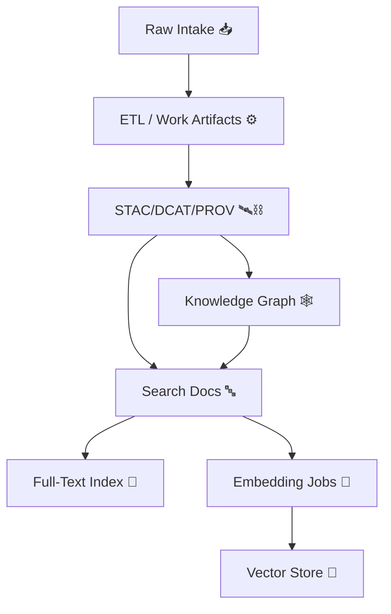

# 🔎 `tools/search` — Unified Retrieval & Search Tooling (KFM)


-purple)
-success)


> [!NOTE]
> This folder defines how **Kansas Frontier Matrix (KFM)** performs **search & retrieval** across *space 🗺️, time ⏳, text 🧾, and relationships 🕸️* — while staying **provenance-first** and **policy-controlled**.

---

## 🧾 Policy Metadata

| Field | Value |
|---|---|
| Path | `tools/search/README.md` |
| Scope | Index build + query orchestration + ranking/fusion + governance hooks |
| Primary consumers | `src/server` (API), `web` (UI Search Bar), `Focus Mode` (AI retrieval) |
| Backends (typical) | **PostGIS** (geo), **Neo4j** (graph), **Elasticsearch/OpenSearch** (full-text), **Vector store** (semantic), **Ollama** (local embeddings / RAG support) |
| Non‑negotiables | ✅ Evidence Triplet pointers (STAC + DCAT + PROV) • ✅ Policy gates (OPA) • ✅ Rebuildable indexes |
| Last updated | `2026-01-26` |

---

## 🧠 What “Search” means in KFM

KFM does **not** treat search as “a single database query.” Search is a **governed retrieval layer** that:

- 🔤 Finds relevant **documents / story nodes / dataset metadata** via full‑text search (e.g., fuzzy + phrase + structured filters).
- 🧭 Filters/boosts by **geospatial context** (bbox, contains, intersects, nearest).
- 🕸️ Expands via **knowledge graph context** (entities, events, places, references).
- 🧬 Adds **semantic retrieval** (embeddings) so meaning matches even when wording differs.
- ⛓️ Returns results with **traceable provenance pointers** so the UI and AI can cite sources.

> [!IMPORTANT]
> **Search is downstream of catalogs + graph.** Indexes are built from governed artifacts (STAC/DCAT/PROV + graph), not from raw mystery inputs.

---

## 🧩 Retrieval Backends: Who does what?

| Need | Best backend | Why |
|---|---|---|
| Bounding box / intersects / distance / within | PostGIS | Spatial indexes + geometry operations |
| “Find all events connected to person X near place Y” | Neo4j | Multi-hop traversal + semantic relationships |
| Keyword/phrase + fuzzy matching over narratives & OCR text | Elasticsearch / OpenSearch | Inverted index, analyzers, fuzziness |
| Meaning-based matching / RAG grounding | Vector store (Qdrant/Chroma/etc.) | Embedding nearest-neighbor retrieval |
| Local embedding generation | Ollama | Offline/local model hosting + embeddings |

---

## 🧭 Non‑Negotiables (Read before coding)

> [!CAUTION]
> If you violate these, the search layer becomes untrustworthy.

1. **No orphan results**  
   Every returned record must point back to governed artifacts:
   - `stac_id` (or item/collection reference)
   - `dcat_id` (dataset/distribution)
   - `prov_id` (activity/entity lineage)
   - (optional) `graph_id` (entity node id)

2. **Policy is not optional** 🛡️  
   - All query execution is subject to allow/deny rules (OPA).
   - Sensitive locations must be redacted/generalized where required.

3. **Rebuildable indexes** 🔁  
   If an index corrupts, we rebuild from source artifacts (catalog + graph) rather than “repair by hand.”

4. **Search results are evidence, not “answers”**  
   The AI (Focus Mode) must only produce claims that can be traced to retrieved evidence.

---

## 🗺️ Architecture at a Glance

```mermaid
flowchart LR
  U[User/UI 🧑‍💻] --> API[Governed API 🔗]
  API -->|Policy Gate (OPA)| QP[Query Planner 🧭]
  QP --> FT[Full‑Text Index 🔤]
  QP --> VS[Vector Store 🧬]
  QP --> PG[PostGIS 🗺️]
  QP --> KG[Neo4j 🕸️]
  FT --> FUSE[Rank/Fuse 📊]
  VS --> FUSE
  PG --> FUSE
  KG --> FUSE
  FUSE --> OUT[Results + Provenance ⛓️]
  OUT --> UI[UI: Search Bar + Map + Story Panel 🗺️📚]
  OUT --> FM[Focus Mode (AI) 🤖]
```

---

## 📁 Expected Folder Layout

> [!TIP]
> If the folder structure differs in your repo, keep the *ideas* but match the actual paths.

```text
tools/search/
  README.md                          👈 you are here
  adapters/                          🔌 backend connectors (elastic, qdrant, postgis, neo4j)
  schema/                            🧾 index mappings + search contract schemas
  indexing/                          🏗️ build/rebuild pipelines (from governed artifacts)
  ranking/                           📊 scoring, boosting, fusion (RRF, tie-breaks, etc.)
  policies/                          🛡️ OPA policy bundles (or glue to central policy pack)
  eval/                              🧪 relevance tests, golden queries, metrics (nDCG/MRR)
  scripts/                           🛠️ CLI entrypoints and maintenance jobs
```

---

## ⚡ Quickstart (Dev)

> [!NOTE]
> Service names can vary by `docker-compose.yml` / deployment. Treat this as a template.

1) **Bring up dependencies** (typical)
```bash
docker compose up -d
# or explicitly:
docker compose up -d postgres postgis neo4j elasticsearch ollama qdrant
```

2) **Build indexes** (spec)
```bash
# Rebuild everything from governed artifacts (STAC/DCAT/PROV + graph)
python -m tools.search.scripts.rebuild_all
```

3) **Smoke test**
```bash
# REST (example)
curl "http://localhost:8000/search?q=dust%20bowl&limit=10"

# GraphQL (example)
curl -X POST "http://localhost:8000/graphql" \
  -H "Content-Type: application/json" \
  -d '{ "query": "query($q:String!){ search(q:$q){ items { id title kind score provenance { stac dcat prov } } } }", "variables": { "q": "John Brown" } }'
```

---

## 🧾 Search Contract (Recommended Shape)

> [!IMPORTANT]
> Search is easiest to maintain when the **request & response shape** is stable and versioned.

### Request (suggested)
```json
{
  "q": "dust bowl black sunday",
  "kinds": ["story", "document", "dataset", "entity"],
  "filters": {
    "bbox": [-102.0, 36.9, -94.6, 40.0],
    "time": { "start": "1930-01-01", "end": "1940-12-31" },
    "tags": ["climate", "history"],
    "licenses": ["CC-BY", "Public-Domain"]
  },
  "page": { "size": 20, "cursor": null },
  "sort": "relevance"
}
```

### Response (suggested)
```json
{
  "items": [
    {
      "id": "story:ks:black_sunday",
      "kind": "story",
      "title": "Black Sunday Dust Storm",
      "snippet": "…",
      "score": 12.34,
      "geo": { "bbox": [-101.2, 37.1, -99.8, 38.0] },
      "time": { "start": "1935-04-14", "end": "1935-04-14" },
      "provenance": {
        "stac": "stac:item:…",
        "dcat": "dcat:dataset:…",
        "prov": "prov:activity:…",
        "graph": "neo4j:node:…"
      },
      "policy": { "visibility": "public", "redactions": [] }
    }
  ],
  "page": { "next_cursor": "…" },
  "debug": { "backend_hits": { "fulltext": 50, "vector": 20, "geo": 12, "graph": 7 } }
}
```

---

## 🏗️ Indexing Pipeline (Build Time)

### Inputs (governed)
- **Catalogs**: STAC + DCAT describe *what exists* and *where it is*.
- **PROV** describes *how it was produced*.
- **Graph** encodes *relationships* (people ↔ events ↔ places ↔ datasets ↔ stories).

### Outputs (searchable)
- Full‑text index docs (title, body, OCR text, story markdown, dataset abstracts)
- Vector embeddings (chunked content for semantic search / RAG)
- Geo fields (bbox/geometry/time windows for fast filtering)
- Provenance pointers attached to every index doc



---

## 🧬 Semantic Search & Embeddings (Ollama-friendly)

Typical approach:
- Chunk documents/story nodes into ~300–1,000 tokens
- Generate embeddings locally via **Ollama** (or configured embedding provider)
- Store vectors + metadata in vector DB
- Return *chunks* with provenance pointers (not just “documents”)

> [!TIP]
> Keep embeddings **rebuildable**:
> - Store chunking strategy version
> - Store embedding model name + digest/version
> - Record PROV activity for embedding generation

---

## 📊 Ranking, Fusion, and “Why did this show up?”

KFM search should be **explainable** to users and developers.

### Recommended fusion strategy
- Use **Reciprocal Rank Fusion (RRF)** to combine:
  - BM25 / full‑text
  - vector similarity
  - graph expansion boosts
  - geo/time contextual boosts

### Suggested boosting rules (examples)
- ✅ Boost results inside current map viewport
- ✅ Boost results matching current timeline window
- ✅ Boost curated “Story Nodes” when query is narrative
- ✅ Boost datasets with richer metadata (better STAC/DCAT completeness)
- ❌ Penalize low-quality OCR/noisy docs

> [!NOTE]
> Store explanation metadata under `debug.explain[]` in dev mode so relevancy tuning is measurable.

---

## 🛡️ Security, Safety, and Governance

Search is one of the most common **data leakage vectors**. Guardrails:

- **Input sanitization** (Prompt Gate style): strip prompt-injection strings when query is routed to AI tooling.
- **OPA enforcement**:
  - role-based visibility
  - dataset license/attribution requirements
  - sensitive geo redaction
- **PII detection / classification**:
  - detect patterns (IDs, addresses, names) where applicable
  - decide whether to redact before indexing or gate at query time

> [!IMPORTANT]
> If a result is restricted, do **not** leak it via counts, facets, or “did you mean” suggestions.

---

## 🧩 UI Integration Notes (Search Bar + Map)

The UI expects search to be:
- **fast** (typeahead + results)
- **stable** (bookmarkable URLs that reproduce state)
- **context-aware** (map extent + timeline influence ranking)
- **provenance-rich** (show “why this result” + “sources”)

Common flow:
1. User types in search bar 🔎
2. Results list updates (typeahead) ⚡
3. Selecting result:
   - pans/zooms map to bbox (if geo)
   - opens story panel (if story)
   - highlights features (if layer/entity)
4. UI can request more details via ID (GraphQL traversal / REST fetch)

---

## 🌐 Federation-Ready Search (Roadmap Alignment)

Long-term, KFM is designed to federate across “Frontier Matrix” instances (e.g., Nebraska FM, Missouri FM).
Search readiness requirements:
- Namespace IDs by instance (`ks:…`, `ne:…`)
- Include `instance_origin` on results
- Keep contracts stable (GraphQL federation / schema stitching compatible)
- Allow aggregator to harvest multiple DCAT feeds into a global search index

---

## 🧪 Relevance Evaluation (Don’t tune blind)

> [!TIP]
> Treat relevancy work like science: hypothesis → experiment → measure → iterate 🧪

Recommended:
- Maintain a **golden query set**:
  - `queries.yaml` (query → expected top results)
- Track metrics:
  - Recall@K, MRR, nDCG
- Log changes like experiments:
  - model changes (embeddings)
  - analyzer changes (synonyms, stemming)
  - boost changes (geo/time weighting)

---

## ✅ “I added data—why isn’t it searchable?”

Checklist:
- [ ] STAC item/collection exists and validates ✅
- [ ] DCAT dataset/distribution exists ✅
- [ ] PROV record links inputs → outputs ✅
- [ ] Graph node exists and links to STAC/DCAT ✅
- [ ] Index rebuild job ran successfully ✅
- [ ] Policy allows your role to see it ✅
- [ ] UI is requesting the right `kind`/filters ✅

---

## 🧯 Troubleshooting

<details>
<summary><strong>Search returns 0 results</strong> 😵</summary>

- Confirm indexes exist (and aliases point to current build)
- Verify query filters aren’t over-restricting (bbox/time window)
- Check OPA decisions: you may be denied or redacted
- Confirm the content is actually indexed (story text vs metadata only)

</details>

<details>
<summary><strong>Search is slow</strong> 🐢</summary>

- Ensure geo/time filters are applied early (prefilter)
- Avoid expensive wildcard queries
- Paginate aggressively
- Cache common queries (with policy-aware cache keys)

</details>

<details>
<summary><strong>Weird fuzzy matches</strong> 🌀</summary>

- Review analyzers (stemming, stopwords, synonyms)
- Tighten fuzziness for short queries
- Add domain synonyms carefully (counties, townships, alternate names)

</details>

---

## 📚 References & Project Docs (Local)

These project documents informed the design & constraints of this folder:

- KFM Architecture / Storage Trio (PostGIS + Neo4j + Search Index) 🧱
- KFM API principles (evidence-first, policy-controlled) 🔗
- KFM Focus Mode retrieval + citation enforcement 🤖⛓️
- Ollama integration overview (local embeddings/RAG) 🧠
- Roadmap: federation + GraphQL federation 🌐
- UI architecture: search bar + map + timeline integration 🗺️
- Research rigor: scientific method + experiment tracking 🧪
- Data mining concepts for classification/PII detection 🧬

> [!NOTE]
> If you change **search contracts**, also update:
> - API schema examples/tests
> - UI search integration
> - policy rules + audit logging
> - relevance evaluation fixtures

---

## 🧭 Next Actions (Contributor-Friendly)

- [ ] Implement/adapt `adapters/` for configured backends
- [ ] Add `schema/` mappings and version them
- [ ] Add `indexing/` rebuild scripts (deterministic)
- [ ] Add `eval/` golden queries + metrics
- [ ] Wire into API (`/search` + GraphQL `search()`)
- [ ] Ensure OPA policy checks occur **before** returning results

---

🧠 *Search is how KFM turns “lots of artifacts” into “usable knowledge.” Keep it fast, governed, and explainable.* ✨