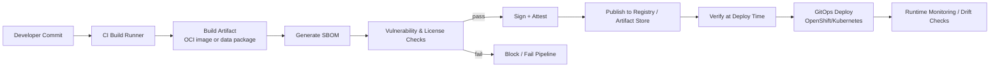

<!--
File: tools/supply-chain/README.md
KFM: Kansas Frontier Matrix
-->

# 🔗 Supply Chain Tooling (KFM)


A **DevSecOps + data-governance toolset** for producing, verifying, and deploying KFM artifacts with:
- **reproducible builds**
- **SBOMs** (software bill of materials)
- **signed artifacts** (images, bundles, manifests)
- **provenance / attestations**
- **policy-based gates** that align with KFM governance (“truth path”)

> [!IMPORTANT]
> This folder is a **governance surface**. If a build or dataset transform cannot be traced to its inputs and validations, it **must not** be promoted to release.  
> Any output without required provenance should be labeled **“not confirmed”** (or blocked), consistent with KFM’s evidence-first rules.

---

## What lives here

This directory is intended to house **portable tooling** used by CI and developers to secure the KFM supply chain.

Typical responsibilities:

| Area | What we produce | Why it matters |
|---|---|---|
| **Container build** | OCI image + digest | Pin the exact artifact that runs |
| **SBOM** | SPDX / CycloneDX | Know what’s inside (dependencies, licenses) |
| **Vuln scan** | report (e.g., SARIF/JSON) | Block known-critical issues from shipping |
| **Signing** | signature + transparency proof | Prevent tampering; enable verification |
| **Provenance** | build attestation (SLSA/in-toto style) | Auditability and accountability |
| **Policy gates** | pass/fail with reasons | Enforce governance consistently |

> [!NOTE]
> “Supply chain” here covers **software** (services, UI, jobs) *and* **data artifacts** (pipelines, derived layers).  
> Data artifacts should carry similar guarantees: **lineage, validations, licenses, and redaction rules**.

---

## Non-goals

- Replacing the project’s CI system (GitHub Actions/GitLab/Tekton/etc.)
- Acting as a general-purpose security handbook (keep this **executable** and **automatable**)
- Storing secrets in-repo (no private keys, tokens, or registry creds committed)
- Allowing any workflow that bypasses the **trust membrane** (frontend/external clients never touch storage directly)

---

## Directory layout

> [!TIP]
> If the folder is new, use this layout as the **initial scaffold**.

```text
tools/
└── supply-chain/
    ├── README.md                # (this file) How supply-chain gates work
    ├── scripts/                 # CLI wrappers used locally + in CI
    │   ├── build-image.*        # build OCI images (podman/buildah/docker)
    │   ├── sbom.*               # generate SBOM (spdx/cyclonedx)
    │   ├── scan.*               # vulnerability scan + policy threshold
    │   ├── sign.*               # sign artifacts (cosign/sigstore)
    │   ├── attest.*             # attach provenance + SBOM attestations
    │   └── verify.*             # verify signatures + attestations
    ├── policies/                # policy-as-code (OPA/Kyverno/Conftest/etc.)
    │   ├── vuln-threshold.rego
    │   ├── license-allowlist.rego
    │   └── admission/           # k8s admission policies (optional)
    ├── templates/               # CI snippets, config templates
    │   ├── cosign.pub.template
    │   ├── policy-bundle.template
    │   └── provenance.template.json
    └── docs/                    # deeper docs / runbooks for this toolset
        ├── threat-model.md
        ├── sbom-formats.md
        └── ci-integration.md
```

> [!CAUTION]
> The exact filenames above are **recommended**, not guaranteed to exist yet.  
> Keep the public interface stable once CI depends on it (scripts → contract).

---

## End-to-end flow



---

## Governance gates

The supply-chain gates should align with KFM’s broader governance steps (acquire → validate → enrich → catalog → serve → explain). In practice, that means **every promoted artifact** must have:

### Required gates (recommended defaults)

| Gate | Minimum output | Default policy |
|---|---|---|
| **Build determinism** | image digest + build metadata | Prefer pinned deps, lockfiles, and reproducible builds |
| **SBOM** | `sbom.(spdx|cdx).json` | Required for releases; optional for local dev |
| **Vulnerability scan** | `vuln-report.json` | Fail on Critical; allow High only with exception record |
| **License check** | `license-report.json` | Fail on disallowed licenses (project-defined allowlist) |
| **Signature** | signature + log proof | Required for anything deployed to shared clusters |
| **Provenance attestation** | `provenance.json` | Required for releases; must reference source revision |
| **Verification at deploy** | admission decision | Deploy blocked if signature/attestation invalid |

> [!IMPORTANT]
> Exceptions (e.g., “ship with High CVE”) must be explicit, time-bounded, and recorded as governed artifacts (e.g., `exceptions/*.yaml`) with reviewer + rationale.

---

## Quickstart

### Prerequisites (local)

- A container engine: **Podman** (preferred for rootless) or Docker
- An SBOM generator: Syft or equivalent
- A scanner: Grype/Trivy (or platform equivalent)
- A signing tool: Cosign (Sigstore)
- `jq` / `yq` for JSON/YAML wrangling

> [!NOTE]
> Tool choices are intentionally abstracted behind `tools/supply-chain/scripts/*` so CI can swap implementations without changing every pipeline.

### Example: build → sbom → scan → sign → verify (illustrative)

```bash
# From repo root:
cd tools/supply-chain

# 1) Build
./scripts/build-image.sh \
  --context ../../services/api-gateway \
  --file Containerfile \
  --tag quay.io/kfm/api-gateway:dev

# 2) SBOM
./scripts/sbom.sh \
  --image quay.io/kfm/api-gateway:dev \
  --format spdx-json \
  --out ../../artifacts/sbom/api-gateway.spdx.json

# 3) Scan (policy gate)
./scripts/scan.sh \
  --sbom ../../artifacts/sbom/api-gateway.spdx.json \
  --fail-on critical \
  --out ../../artifacts/scan/api-gateway.vuln.json

# 4) Sign + attest
./scripts/sign.sh --image quay.io/kfm/api-gateway:dev
./scripts/attest.sh \
  --image quay.io/kfm/api-gateway:dev \
  --sbom ../../artifacts/sbom/api-gateway.spdx.json \
  --provenance ../../artifacts/provenance/api-gateway.provenance.json

# 5) Verify
./scripts/verify.sh --image quay.io/kfm/api-gateway:dev
```

> [!TIP]
> For a first implementation, keep scripts thin wrappers around the chosen tools. The value is in the **consistent contracts** and **gates**, not bespoke scripting.

---

## CI/CD integration patterns

This folder should be usable from any CI, but KFM typically benefits from a **GitOps deploy** model:

1. CI builds and publishes a signed artifact (image digest, SBOM, provenance)
2. CI updates a deployment repo (or environment overlay) with **immutable digests**
3. GitOps controller applies manifests
4. Cluster admission verifies signatures/attestations before allowing pods

### Suggested CI stages (portable)

- `lint` (code, IaC, policies)
- `test` (unit/integration/contract)
- `build` (OCI image / data package)
- `sbom`
- `scan` (vuln + license)
- `sign + attest`
- `publish`
- `deploy (GitOps)`
- `verify (post-deploy smoke + policy reports)`

---

## Data artifacts: “data supply chain” notes

KFM data products (layers, derived tables, vector tiles, model outputs) should be treated like software artifacts:

- **input sources recorded**
- **transform steps versioned**
- **QA results attached**
- **licenses + CARE constraints enforced**
- **sensitivity/generalization applied before publication**

A minimal *data artifact provenance record* (example shape):

```json
{
  "artifact": {
    "kind": "dataset",
    "id": "kfm.dataset.<slug>@<version>",
    "hash": "sha256:<content-hash>"
  },
  "inputs": [
    {
      "source_id": "source.<catalog-id>",
      "license": "<spdx-or-custom>",
      "retrieved_at": "YYYY-MM-DD",
      "hash": "sha256:<raw-hash>"
    }
  ],
  "transform": {
    "pipeline": "pipelines/<name>",
    "pipeline_version": "<git-sha-or-tag>",
    "run_id": "<run-uuid>",
    "parameters": { "example": true }
  },
  "validation": {
    "schema": "schemas/<schema-id>@<version>",
    "checks": [
      { "id": "geo.sanity", "status": "pass" },
      { "id": "dedupe", "status": "pass" }
    ]
  },
  "governance": {
    "sensitivity": "public|restricted|redacted",
    "care_constraints": ["<constraint-id>"]
  }
}
```

> [!IMPORTANT]
> Treat this JSON as a **starting point** (not confirmed in repo).  
> The authoritative schema should live in the governed catalog once defined.

---

## Threat model (quick view)

<details>
<summary><strong>Common supply-chain threats → controls</strong></summary>

| Threat | Example | Primary control(s) |
|---|---|---|
| Dependency poisoning | typosquatting in npm/pypi | lockfiles, allowlists, SBOM, scanning |
| Build runner compromise | attacker modifies build output | provenance attestation, isolated runners, signing |
| Registry tampering | image tag repointed | immutable digests, signature verification, admission control |
| Secrets exfiltration | tokens leaked in logs | secret masking, least privilege, no secrets in artifacts |
| Policy bypass | manual deploy around gates | GitOps-only deploy, cluster-side verify + deny |

</details>

---

## Definition of Done (DoD) for a “release-ready” artifact

- [ ] Artifact is published by **digest** (not tag-only)
- [ ] SBOM generated and stored with the release
- [ ] Vulnerability scan passes policy (or has a governed exception)
- [ ] License scan passes policy (or has a governed exception)
- [ ] Artifact is signed
- [ ] Provenance attestation exists and references source revision
- [ ] Deployment verifies signature + provenance before admission
- [ ] Audit trail retained (who built, when, with what inputs)

---

## Contributing

1. **Prefer contracts over cleverness**: stable script interfaces are more valuable than custom logic.
2. **Make gates explainable**: failures should say *what failed* and *how to fix*.
3. **Keep secrets out**: use CI secret stores; never commit private keys.
4. **Document policy changes**: policy shifts are governance shifts.

> [!TIP]
> If you add a new gate, also add:
> - a policy file (if applicable),
> - a fixture/example,
> - and a CI stage snippet in `templates/`.

---

## Roadmap (starter)

- [ ] Add `scripts/` wrappers for build/sbom/scan/sign/attest/verify
- [ ] Add `policies/` for vuln thresholds + license allowlist
- [ ] Add CI integration examples (GitHub Actions / Tekton)
- [ ] Add cluster verification options (admission controller policy)
- [ ] Add standardized provenance schema for software + data artifacts