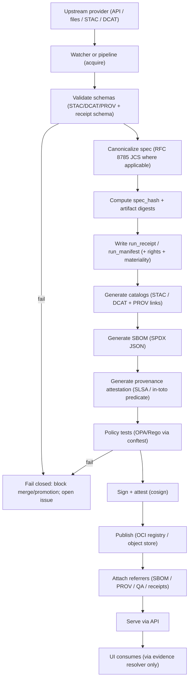

# KFM Supply-Chain Tooling (`tools/supply-chain`)

[](#kfm-non-negotiables)
[](#kfm-non-negotiables)
[](#policy-packs)
[](#what-we-produce)
[](#toolchain)

This folder defines the **supply-chain security contract** for Kansas Frontier Matrix (KFM). It is how we keep KFM:

- **fail-closed** (deny by default)
- **evidence-first** (prove it, or don’t ship it)
- **audit-ready** (every promotion has receipts + attestations + signatures)

It applies to:

- datasets and derived products (Raw → Work → Processed)
- catalogs (STAC / DCAT / PROV)
- watcher outputs and registry entries
- governed documentation builds (docs are treated as publishable artifacts)

> **Nothing is promoted or deployed unless it can prove (cryptographically + schematically + policy-wise) that it was produced correctly.**

---

## Table of contents

- [KFM non-negotiables](#kfm-non-negotiables)
- [Scope](#scope)
- [The “golden path” (promotion lifecycle)](#the-golden-path-promotion-lifecycle)
- [What we produce](#what-we-produce)
- [Directory layout](#directory-layout)
- [Toolchain](#toolchain)
- [Local usage](#local-usage)
- [CI integration](#ci-integration)
- [Policy packs](#policy-packs)
- [OCI referrers “provenance hub”](#oci-referrers-provenance-hub)
- [`run_receipt` / `run_manifest` contract](#run_receipt--run_manifest-contract)
- [Security notes](#security-notes)
- [Troubleshooting](#troubleshooting)
- [Governance & change control](#governance--change-control)
- [Glossary](#glossary)

---

## KFM non-negotiables

> [!IMPORTANT]
> These are architectural invariants. Supply-chain tooling exists to **enforce** them, not merely document them.

- **Trust membrane:** UI/external clients never access databases directly; all access is via the governed API + policy boundary.
- **Fail-closed posture:** policy checks deny by default (no “best effort” promotion).
- **Promotion gates:** datasets are promoted only when required checksums and catalogs exist and validate (STAC/DCAT/PROV).
- **Evidence-first UX:** Focus Mode must cite or abstain; every answer is traceable to evidence with an audit reference.

---

## Scope

This folder covers supply-chain controls for:

### 1) Build + ingest pipelines
- deterministic specs/config (canonicalization) → deterministic identifiers
- `run_receipt` / `run_manifest` that anchor what ran and what it produced
- reproducibility checks (where feasible)

### 2) Artifact integrity + provenance
- **SBOMs** attached to artifacts (SPDX JSON)
- **provenance attestations** (SLSA / in-toto style)
- **signatures** that bind evidence to the promoted artifact digest

### 3) Policy enforcement
- OPA/Rego policies (via `conftest` in CI) that deny promotion when:
  - required evidence is missing
  - signatures/attestations are invalid or unverifiable
  - required governance fields are missing (license, rights, classification, etc.)

---

## The “golden path” (promotion lifecycle)

This is the canonical flow for turning upstream material into promoted, governed KFM artifacts.



---

## What we produce

Minimum evidence artifacts expected for promotion:

| Evidence artifact | Typical filename | Purpose | Required for |
|---|---|---|---|
| Run receipt / manifest | `run_receipt.json` / `run_manifest.json` | Canonical record of run inputs + outputs + policy decisions | **Always** |
| Checksums / digests | `SHA256SUMS` (or embedded) | Content-addressed integrity for datasets + bundles | **Always** |
| Catalog metadata | `stac/…`, `dcat/…`, `prov/…` | Machine-readable discovery + lineage anchors | **Always** for promoted datasets |
| SBOM (SPDX) | `sbom.spdx.json` | What software components were involved | **Always** for promoted artifacts |
| Provenance attestation | `provenance.intoto.json` | How the artifact was built (builder, materials, steps) | **Always** for promoted artifacts |
| Signatures + transparency proof | (cosign sig + Rekor UUID) | Bind evidence to digest; tamper-evident | **Always** |
| QA evidence (optional, but recommended) | `qa/report.json` + attachments | Domain-specific quality checks | By policy / dataset class |

---

## Directory layout

This folder is designed to be portable across KFM repos. CI can treat it as a reusable **acceptance harness + policy kit**.

```text
tools/
└── supply-chain/                             # Supply-chain security tooling (SBOM, provenance, signing, verification)
    ├── README.md                             # You are here: how to run + how CI uses this folder
    ├── tool-versions.yaml                    # Normative tool pins/constraints used by CI + local parity
    │
    ├── scripts/                              # Entry points (local + CI) — keep behavior deterministic
    │   ├── install-tools.sh                   # Install pinned tools (or validate container toolchain matches pins)
    │   ├── verify.sh                          # Run acceptance harness (fail-closed; blocks promotion on mismatch)
    │   ├── sbom.sh                            # Generate SBOM for a target artifact (e.g., SPDX/CycloneDX)
    │   ├── provenance.sh                      # Emit SLSA / in-toto provenance for a build (predicate + metadata)
    │   ├── sign.sh                            # Cosign sign/attest wrapper (digest-only; no tag signing)
    │   └── discover-referrers.sh              # List OCI referrers for a subject digest (sboms/attestations/etc.)
    │
    ├── policies/                              # Policy pack for promotion/verification gates
    │   ├── provenance-guard/                  # Minimum promotion contract (required provenance fields + checks)
    │   │   ├── policy.rego                    # Rego rules (deny-by-default; require attestations/receipts)
    │   │   └── policy_test.rego               # Unit tests for provenance-guard policy
    │   └── materiality/                       # Optional: provider-aware triggers/thresholds (what changes require what)
    │       ├── policy.rego                    # Materiality rules (diff thresholds, dependency classes, risk levels)
    │       └── policy_test.rego               # Unit tests for materiality policy
    │
    └── fixtures/                              # Golden test vectors for acceptance + regression tests
        ├── example-run_receipt.v1.json        # Example run receipt (inputs/outputs/digests/decision summary)
        ├── example-sbom.spdx.json             # Example SBOM output (SPDX JSON baseline)
        └── example-provenance.intoto.json     # Example in-toto/SLSA provenance (predicate baseline)
```

> [!NOTE]
> If your repo does not yet have these files, create them exactly as named above. This README is the contract that explains what they must do.

---

## Toolchain

### Required tools

| Tool | Why it’s needed |
|---|---|
| **cosign** | signing + attestation verification |
| **conftest** + **OPA** | policy-as-code gates (deny by default) |
| **SBOM generator** (e.g., `syft`) | produce SPDX JSON SBOMs |
| **ORAS** | publish and discover OCI artifacts/referrers |
| `jq` / `yq` | deterministic transforms in CI |
| hash utilities | `sha256sum` / `shasum -a 256` |

### Version pinning and drift control (mandatory)

> [!IMPORTANT]
> Supply-chain tooling is treated as a **volatile dependency**. Pin versions (or container digests) and run regression tests whenever you upgrade.
>
> Two concrete risks called out in KFM’s integration work:
> - a Cosign verification-bypass vulnerability (CVE-2026-22703)
> - a breaking default change in Conftest (Rego v1 default)
>
> Treat tool upgrades as security events.

#### `tool-versions.yaml` contract

This file is **normative**: CI should fail if it’s missing or if tools do not match it.

Minimum keys to include:

```yaml
# tools/supply-chain/tool-versions.yaml
cosign:
  # must satisfy patched constraints (avoid known-vulnerable versions)
  min_patched_versions: ["2.6.2", "3.0.4"]  # acceptable: 2.6.2+ OR 3.0.4+ (pick one line)

conftest:
  pinned: true
opa:
  pinned: true
oras:
  pinned: true
sbom:
  tool: "syft"
  pinned: true
```

> [!TIP]
> Prefer containerized toolchains with **digest pinning** in CI to minimize drift.

---

## Local usage

### Quick start: verify a PR / candidate artifact

Run the acceptance harness locally before pushing:

```bash
# From repository root
bash tools/supply-chain/scripts/verify.sh
```

A correct run should:

1. validate schemas (STAC/DCAT/PROV where relevant)
2. validate the `run_receipt` / `run_manifest` schema
3. run `conftest test` for applicable policy packs
4. verify cosign signatures/attestations (fail-closed)
5. ensure digests/spec_hash are reproducible for the same inputs

### Generate an SBOM (example)

```bash
# Example: syft generates SPDX JSON for a container image
syft packages "ghcr.io/example/repo@sha256:0000000000000000000000000000000000000000000000000000000000000000" \
  -o spdx-json > sbom.spdx.json
```

### Attach SBOM + provenance (example)

```bash
SUBJECT="ghcr.io/example/repo@sha256:0000000000000000000000000000000000000000000000000000000000000000"

# Sign the subject digest (prefer digest-only, never mutable tags)
cosign sign "${SUBJECT}"

# Attach SBOM (as attestation)
cosign attest --type spdxjson --predicate sbom.spdx.json "${SUBJECT}"

# Attach provenance attestation
cosign attest --type slsaprovenance --predicate provenance.intoto.json "${SUBJECT}"
```

### Verify (example)

```bash
SUBJECT="ghcr.io/example/repo@sha256:0000000000000000000000000000000000000000000000000000000000000000"

cosign verify "${SUBJECT}"
cosign verify-attestation --type spdxjson "${SUBJECT}"
cosign verify-attestation --type slsaprovenance "${SUBJECT}"
```

> [!WARNING]
> Verification MUST be fail-closed. If verification can’t complete (network, transparency log, missing predicate fields), policy must treat it as failure.

---

## CI integration

CI must block merges/promotions unless all gates pass:

- ✅ schemas validate (including governed docs/story nodes where relevant)
- ✅ receipts/manifests exist and validate
- ✅ SBOM + provenance artifacts exist
- ✅ signatures + attestations verify
- ✅ Rego policy tests pass (default deny)

### Promotion kill-switch

> [!IMPORTANT]
> Automated promotion should have a **kill-switch**: a single configuration flag that can pause promotion/attestation publishing while still allowing validation to run.
>
> This protects the platform during incidents (toolchain CVEs, policy breakage, compromised credentials).

### GitHub Actions sketch (copy/paste)

```yaml
name: Supply Chain Gates

on:
  pull_request:
  push:
    branches: [main]

jobs:
  supply_chain:
    runs-on: ubuntu-latest
    permissions:
      contents: read
      id-token: write # required for keyless signing if used
    steps:
      - uses: actions/checkout@v4

      - name: Install / validate toolchain (pinned)
        run: |
          bash tools/supply-chain/scripts/install-tools.sh

      - name: Verify (fail-closed)
        run: |
          bash tools/supply-chain/scripts/verify.sh
```

> [!TIP]
> Pair this job with branch protection rules so merges are impossible unless this check is green.

---

## Policy packs

Policy packs are the **promotion contract** expressed as code.

### `provenance-guard` (minimum, always-on)

Denies promotion if required provenance fields, licenses/rights, or attestations are missing/invalid.

#### Minimal Rego example

```rego
package kfm.provenance_guard

default deny := []

deny[msg] {
  not input.spec_hash
  msg := "missing spec_hash"
}

deny[msg] {
  not input.spec_schema_id
  msg := "missing spec_schema_id (what schema defines the hashed spec?)"
}

deny[msg] {
  not input.spec_recipe_version
  msg := "missing spec_recipe_version (what canonicalization/recipe produced spec_hash?)"
}

deny[msg] {
  not input.artifact_digest
  msg := "missing artifact_digest"
}

deny[msg] {
  not input.license
  msg := "missing license"
}

deny[msg] {
  not input.rights
  msg := "missing rights (redistribution / restrictions / CARE flags)"
}

deny[msg] {
  input.policy_gate.status != "pass"
  msg := sprintf("policy_gate.status is not pass (got %v)", [input.policy_gate.status])
}
```

Run it with:

```bash
conftest test --policy tools/supply-chain/policies/provenance-guard run_receipt.json
```

### `materiality` (optional, provider-aware)

Encodes *when* upstream change is “material” enough to trigger promotion (thresholds, cadence, join keys, etc.). Use when watchers produce PRs automatically.

---

## OCI referrers “provenance hub”

KFM treats the OCI registry as a **provenance hub**:

- the promoted artifact digest is the **subject**
- evidence is attached as **referrers**, such as SBOM, PROV bundles, QA, receipts, and signatures

Consumer flow:

1. retrieve the subject by digest
2. discover all evidence attached to that digest via referrers
3. verify signatures/attestations and apply policy checks before use

> [!NOTE]
> If your registry does not support OCI referrers, define an alternate evidence discovery mechanism and enforce it in policy.

---

## `run_receipt` / `run_manifest` contract

Receipts/manifests are the spine of KFM provenance: they anchor `spec_hash`, digests, tool versions, policy decisions, and pointers to catalogs/evidence.

### Spec hash definition (normative)

- `spec_hash = sha256( JCS(spec) )`
- where `spec` is a **schema-defined object**
- and the receipt must record:
  - `spec_schema_id` (which schema defines `spec`)
  - `spec_recipe_version` (which canonicalization recipe was used)

### Suggested receipt fields

| Field | Meaning |
|---|---|
| `example` | schema/type identifier (e.g., `kfm.run_receipt.v1`) |
| `run_id` | stable run identifier |
| `fetched_at` | time of acquisition |
| `accessURL` | upstream source URL (or equivalent locator) |
| `etag` / `last_modified` | caching + change detection anchors |
| `spec_schema_id` | identifier of schema that defines the hashed spec |
| `spec_recipe_version` | canonicalization recipe version |
| `spec_hash` | deterministic hash of canonicalized spec/config |
| `artifact_digest` | digest of the produced/published artifact |
| `produced_artifacts[]` | list of outputs (paths, media types, digests) |
| `license` | license identifier/statement |
| `rights` | restrictions, redistribution, CARE/FAIR tags |
| `rekor_uuid` | transparency log reference (if applicable) |
| `materiality` | decision record for “material change” triggers |
| `tool_versions` | toolchain versions used |
| `policy_gate` | status + checks performed (pass/fail + list) |

### Example receipt (synthetic fixture)

```json
{
  "example": "kfm.run_receipt.v1",
  "run_id": "run_2026-02-13_example_0001",
  "fetched_at": "2026-02-13T00:00:00Z",
  "accessURL": "https://example.org/source",
  "etag": "W/\"abc123\"",
  "last_modified": "Wed, 12 Feb 2026 00:00:00 GMT",
  "spec_schema_id": "kfm.schema.watcher.v1",
  "spec_recipe_version": "1.0.0",
  "spec_hash": "sha256:1111111111111111111111111111111111111111111111111111111111111111",
  "artifact_digest": "sha256:2222222222222222222222222222222222222222222222222222222222222222",
  "produced_artifacts": [
    {
      "path": "stac/catalog.json",
      "media_type": "application/json",
      "digest": "sha256:3333333333333333333333333333333333333333333333333333333333333333"
    }
  ],
  "license": "CC-BY-4.0",
  "rights": {
    "redistribution": "allowed",
    "care": { "sensitive": false }
  },
  "rekor_uuid": "00000000-0000-0000-0000-000000000000",
  "materiality": {
    "status": "material",
    "reasons": ["etag_changed"]
  },
  "tool_versions": { "pipeline": "1.0.0" },
  "policy_gate": {
    "status": "pass",
    "checks": ["license_present", "stac_present"]
  }
}
```

---

## Security notes

### Treat toolchain upgrades as security events

- Pin tool versions or container digests.
- Add regression tests for:
  - cosign verification correctness (fail-closed)
  - Rego policy evaluation stability (especially around language defaults)
  - deterministic hashing behavior (`spec_hash` golden vectors)

### Secrets and signing identity

- Prefer keyless signing via CI OIDC where feasible.
- Never store long-lived signing keys in the repository.
- If offline signing is required, document key management and require governance review.

### “Docs are artifacts”

Documentation builds that ship to users are promoted artifacts too:

- compute deterministic digests
- attach provenance receipts
- fail-closed on any missing evidence

---

## Troubleshooting

### “Verification succeeded locally, failed in CI”
Common causes:
- tool version drift (pin versions/digests)
- non-deterministic build inputs (timestamps, file ordering, non-reproducible archives)
- missing CI permissions for keyless signing/verification

### “Referrers not discoverable”
- registry may not support OCI referrers
- evidence attached under a mutable tag instead of digest
- network/proxy blocks the registry API

### “Policy says missing license/rights”
- ensure dataset/catalog metadata includes license + rights fields
- ensure receipt carries license/rights or references the catalog record that carries them

---

## Governance & change control

Changes here are production-affecting because they change what KFM can publish.

**Required reviews (minimum):**
- security reviewer for toolchain changes (cosign/conftest/OPA)
- data governance reviewer for promotion contract/policy changes
- CI/infrastructure reviewer for workflow changes

### Definition of done checklist

- [ ] `tool-versions.yaml` exists and is enforced by CI
- [ ] acceptance harness (`verify.sh`) is deterministic and fail-closed
- [ ] policy packs include tests (`*_test.rego`) and run in CI
- [ ] fixtures exist for receipts + SBOM + provenance
- [ ] CI job is required by branch protection rules
- [ ] evidence artifacts are discoverable (OCI referrers or alternate enforced mechanism)
- [ ] upgrade procedure includes regression tests and explicit review

---

## Glossary

- **SBOM:** Software Bill of Materials (what components are inside an artifact).
- **Provenance attestation:** A signed statement describing how an artifact was built.
- **Referrer:** An OCI artifact linked to a subject digest (used to attach evidence like SBOM/PROV).
- **`spec_hash`:** Deterministic hash of canonicalized spec/config (used to detect changes reproducibly).
- **Fail-closed:** If verification cannot prove correctness, the system denies promotion by default.

