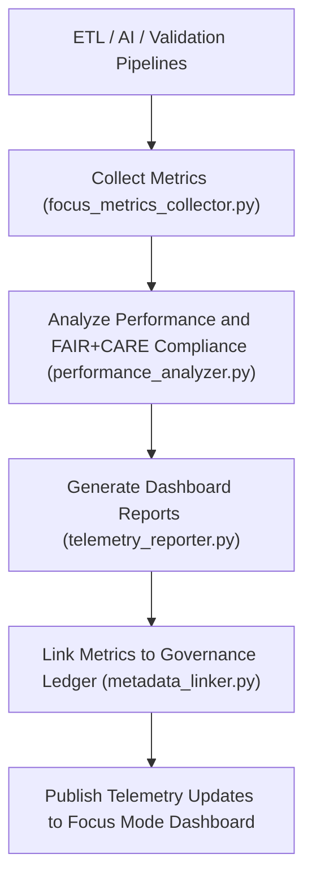

<div align="center">

# 📡 Kansas Frontier Matrix — **Telemetry Tools**
`tools/telemetry/README.md`

**Purpose:**  
FAIR+CARE-certified suite of **telemetry, performance monitoring, and data lineage tracking tools** powering the Focus Mode analytics and governance dashboards in the Kansas Frontier Matrix (KFM).  
These utilities provide full observability of data pipelines, AI models, and FAIR+CARE governance metrics under MCP-DL v6.3 compliance.

[](../../../docs/standards/faircare-validation.md)
[](../../../LICENSE)
[](../../../docs/architecture/repo-focus.md)

</div>

---

## 📚 Overview

The `tools/telemetry/` directory contains utilities that track real-time **data flow, governance performance, and AI explainability metrics** across KFM’s pipelines.  
Telemetry tools enable ethical, transparent reporting of system behavior, ensuring accountability and reproducibility in all data operations.

### Core Responsibilities
- Collect runtime and governance performance metrics for Focus Mode dashboards.  
- Measure ETL efficiency, validation latency, and AI inference explainability.  
- Aggregate FAIR+CARE ethics telemetry for reporting and certification tracking.  
- Maintain provenance-linked telemetry logs for auditability and transparency.  

---

## 🗂️ Directory Layout

```plaintext
tools/telemetry/
├── README.md                              # This file — documentation for Telemetry Tools
│
├── focus_metrics_collector.py             # Gathers operational metrics from ETL, AI, and governance systems
├── telemetry_reporter.py                  # Formats telemetry data for FAIR+CARE and Focus Mode dashboards
├── metadata_linker.py                     # Connects telemetry results with governance provenance records
├── performance_analyzer.py                # Evaluates system efficiency, drift, and sustainability metrics
├── faircare_metrics_audit.py              # Generates FAIR+CARE-aligned performance summaries
└── metadata.json                          # Provenance and checksum linkage metadata
```

---

## ⚙️ Telemetry Workflow



### Workflow Description
1. **Metric Collection:**  
   Gathers real-time telemetry from ETL, validation, and AI subsystems.  
2. **Performance Audit:**  
   Evaluates latency, throughput, and resource utilization against FAIR+CARE standards.  
3. **Governance Linkage:**  
   Integrates telemetry metrics with provenance and ledger data.  
4. **Dashboard Publishing:**  
   Updates Focus Mode dashboards and reports with certified telemetry outputs.  
5. **Ethics Audit:**  
   Ensures transparency, energy efficiency, and collective benefit reporting under FAIR+CARE.  

---

## 🧩 Example Telemetry Record

```json
{
  "id": "telemetry_tools_v9.5.0_2025Q4",
  "systems_monitored": [
    "etl",
    "ai",
    "validation",
    "governance"
  ],
  "metrics_collected": {
    "etl_latency_sec": 42.7,
    "ai_inference_time_ms": 203,
    "validation_pass_rate": 99.8,
    "energy_usage_wh": 18.3
  },
  "fairstatus": "certified",
  "checksum_verified": true,
  "governance_registered": true,
  "telemetry_ref": "releases/v9.5.0/focus-telemetry.json",
  "governance_ref": "reports/audit/ai_telemetry_ledger.json",
  "created": "2025-11-02T23:59:00Z",
  "validator": "@kfm-telemetry"
}
```

---

## 🧠 FAIR+CARE Governance Matrix

| Principle | Implementation |
|------------|----------------|
| **Findable** | Telemetry data indexed by system, timestamp, and governance record. |
| **Accessible** | Metrics stored in JSON format and linked to FAIR+CARE dashboards. |
| **Interoperable** | Compatible with FAIR+CARE, DCAT, and ISO performance metrics schemas. |
| **Reusable** | Data includes provenance, checksum, and validation linkage. |
| **Collective Benefit** | Supports equitable transparency and sustainable infrastructure audits. |
| **Authority to Control** | FAIR+CARE Council validates telemetry and ethics metrics. |
| **Responsibility** | Validators maintain real-time audit records and performance snapshots. |
| **Ethics** | Tracks sustainability, fairness, and energy governance compliance. |

Audit outputs stored in:  
`reports/audit/ai_telemetry_ledger.json` • `reports/fair/telemetry_tools_summary.json`

---

## ⚙️ Telemetry Tools Summary

| Tool | Function | Output |
|------|-----------|--------|
| `focus_metrics_collector.py` | Collects live operational metrics from system pipelines. | JSON metrics report |
| `performance_analyzer.py` | Evaluates performance and sustainability KPIs. | FAIR+CARE performance summary |
| `telemetry_reporter.py` | Formats and exports metrics to Focus Mode dashboards. | Telemetry JSON report |
| `faircare_metrics_audit.py` | Audits telemetry data for FAIR+CARE compliance. | Ethics and transparency log |
| `metadata_linker.py` | Links telemetry outputs with governance provenance. | Governance ledger update |
| `metadata.json` | Captures lineage, telemetry checksum, and governance linkage. | JSON |

Automation handled via `telemetry_tools_sync.yml`.

---

## 🧾 Retention Policy

| File Type | Retention Duration | Policy |
|------------|--------------------|--------|
| Telemetry Logs | 90 days | Archived for system optimization and ethics review. |
| FAIR+CARE Reports | 365 days | Retained for sustainability and governance audits. |
| Metadata | Permanent | Maintained for lineage and reproducibility. |
| Dashboard Metrics | 30 days | Updated continuously for real-time reporting. |

Cleanup handled via `telemetry_tools_cleanup.yml`.

---

## 🧾 Internal Use Citation

```text
Kansas Frontier Matrix (2025). Telemetry Tools (v9.5.0).
FAIR+CARE-certified telemetry suite for operational, governance, and sustainability monitoring.
Ensures transparency, accountability, and reproducibility under MCP-DL v6.3 ethics compliance.
```

---

## 🧾 Version Notes

| Version | Date | Notes |
|----------|------|--------|
| v9.5.0 | 2025-11-02 | Added performance analyzer and FAIR+CARE metrics auditor integration. |
| v9.3.2 | 2025-10-28 | Improved telemetry linkage with governance and AI systems. |
| v9.3.0 | 2025-10-26 | Established telemetry tools workspace for Focus Mode and FAIR+CARE monitoring. |

---

<div align="center">

**Kansas Frontier Matrix** · *Telemetry × FAIR+CARE Ethics × Provenance Accountability*  
[🔗 Repository](https://github.com/bartytime4life/Kansas-Frontier-Matrix) • [🧭 Docs Portal](../../../docs/) • [⚖️ Governance Ledger](../../../docs/standards/governance/)

</div>

