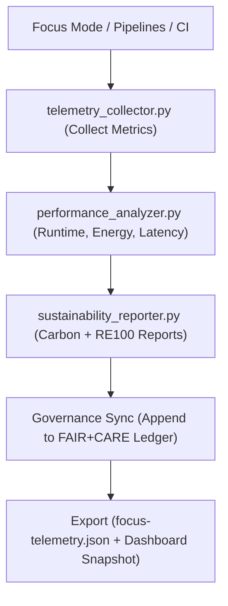

<div align="center">

# 📡 **Kansas Frontier Matrix — Telemetry & Sustainability Tools**  
`tools/telemetry/README.md`

**Purpose:**  
FAIR+CARE-certified telemetry suite monitoring, logging, and reporting **performance, energy, carbon, and ethics** metrics across all Kansas Frontier Matrix (KFM) systems.  
Implements **ISO 14064**, **ISO 50001**, and **RE100** standards for transparent, reproducible, and ethical sustainability tracking under **MCP-DL v6.3**.

[](../../../docs/standards/faircare.md)
[]()
[](../../../LICENSE)
[](../../../docs/README.md)

</div>

---

## 📘 Overview

The **Telemetry & Sustainability Tools** module is KFM’s observability and performance analytics core.  
It quantifies computational, environmental, and ethical impacts across data, AI, and CI/CD workflows, linking results directly to **FAIR+CARE** sustainability metrics and governance ledgers for public accountability.

**v10.2.2 Enhancements**
- Added real-time **ISO 50001 energy intensity** logging.  
- Introduced **GPU telemetry & focus-inference benchmarks**.  
- Extended **carbon and sustainability dashboards** with JSON-LD provenance links.  
- Aligned telemetry schema with **telemetry-report.yml** CI pipelines and FAIR+CARE dashboards.

---

## 🗂️ Directory Layout

```plaintext
tools/telemetry/
├── README.md
│
├── telemetry_collector.py            # Collects metrics from Focus Mode + pipeline execution
├── performance_analyzer.py           # Evaluates latency, throughput, resource utilization
├── sustainability_reporter.py        # Generates ISO 14064-compliant sustainability reports
├── telemetry_dashboard_snapshot.json # Export snapshot for dashboards (JSON-LD)
└── metadata.json                     # Provenance metadata + checksum lineage
```

---

## ⚙️ Telemetry Lifecycle



1. **Collection** — Capture runtime, hardware, and AI inference metrics.  
2. **Analysis** — Compute efficiency, latency, and throughput.  
3. **Reporting** — Quantify Wh, gCO₂e, and energy mix under ISO standards.  
4. **Sync** — Append sustainability logs to the **governance ledger**.  
5. **Export** — Publish telemetry bundles for transparency dashboards.

---

## 🧾 Example Telemetry Record

```json
{
  "@context": "https://schema.org/",
  "@type": "Dataset",
  "id": "telemetry_session_v10.2.2",
  "components_monitored": [
    "focus_mode_ai_v7",
    "remote_sensing_etl_v6",
    "ci_pipeline_v10"
  ],
  "avg_runtime_seconds": 497.6,
  "energy_usage_wh": 11.9,
  "carbon_output_gco2e": 14.1,
  "renewable_power_offset": "100%",
  "hardware_type": "NVIDIA T4 / Intel Xeon",
  "fairstatus": "certified",
  "sustainability_compliance": "ISO 14064 / RE100",
  "checksum_verified": true,
  "governance_registered": true,
  "validator": "@kfm-telemetry",
  "created": "2025-11-12T09:00:00Z",
  "governance_ref": "docs/reports/audit/data_provenance_ledger.json"
}
```

---

## 🧠 FAIR+CARE Governance Matrix

| Principle | Implementation | Oversight |
|-----------|----------------|-----------|
| **Findable** | Telemetry JSONs logged in releases & DCAT catalogs. | @kfm-data |
| **Accessible** | JSON-LD & ISO metadata accessible via GitHub & dashboards. | @kfm-accessibility |
| **Interoperable** | Conforms to FAIR+CARE, ISO 14064, ISO 50001, RE100. | @kfm-architecture |
| **Reusable** | Machine-readable metrics enable reproducibility audits. | @kfm-design |
| **Collective Benefit** | Open sustainability transparency benefits researchers. | @faircare-council |
| **Authority to Control** | Council certifies sustainability and CO₂ audits. | @kfm-governance |
| **Responsibility** | Auditors validate Wh/gCO₂ data and renewable sourcing. | @kfm-security |
| **Ethics** | Advocates for low-impact computing and open environmental data. | @kfm-ethics |

**References:**  
`docs/reports/fair/data_care_assessment.json` · `docs/reports/audit/data_provenance_ledger.json`

---

## ⚙️ Key Tool Summary

| Tool | Description | Role |
|------|-------------|------|
| `telemetry_collector.py` | Captures runtime, energy, and GPU/CPU utilization. | Monitoring |
| `performance_analyzer.py` | Computes latency, throughput, and model efficiency. | Analytics |
| `sustainability_reporter.py` | Generates FAIR+CARE + ISO-compliant reports. | Accountability |
| `telemetry_dashboard_snapshot.json` | Visualization-ready data for FAIR+CARE dashboards. | Transparency |
| `metadata.json` | Logs governance lineage and telemetry provenance. | Traceability |

Automated via **`telemetry_sync.yml`** in CI/CD pipelines.

---

## ⚖️ Retention & Provenance Policy

| Data Type | Retention | Policy |
|-----------|-----------:|-------|
| Telemetry Logs | 180 Days | Retained for reproducibility validation |
| Sustainability Reports | 365 Days | Archived for re-certification |
| Metadata | Permanent | Immutable ledger inclusion |
| Dashboard Snapshots | 90 Days | Rotating refresh per CI cycle |

Cleanup performed by `telemetry_cleanup.yml`.

---

## 🌱 Sustainability Metrics (v10.2.2 Benchmarks)

| Metric | Target | Verified By |
|--------|-------:|-------------|
| Avg Power Use | ≤ 12 Wh | `sustainability_reporter.py` |
| Carbon Output | ≤ 15 gCO₂e | `telemetry_collector.py` |
| Renewable Energy | 100% RE100 | Infra Audit |
| FAIR+CARE Compliance | 100% | `certification_audit.py` |
| ISO 14064 Alignment | ✅ Certified | @kfm-governance |

Telemetry recorded at:  
`../../../releases/v10.2.0/focus-telemetry.json`

---

## 🧾 Citation

```text
Kansas Frontier Matrix (2025). Telemetry & Sustainability Tools (v10.2.2).
FAIR+CARE and ISO-aligned telemetry system measuring runtime, energy, and carbon efficiency for ethical, transparent, and reproducible operations under MCP-DL v6.3.
```

---

## 🕰️ Version History

| Version | Date | Summary |
|----------|------|---------|
| v10.2.2 | 2025-11-12 | Added ISO 50001 energy intensity metrics, GPU telemetry, and JSON-LD dashboard exports. |
| v10.0.0 | 2025-11-10 | Upgraded telemetry schema v2; expanded dashboard snapshot & governance hooks. |
| v9.7.0 | 2025-11-05 | Enhanced sustainability schema & RE100 validation logic. |
| v9.6.0 | 2025-11-03 | Added AI inference telemetry & ISO certification sync. |
| v9.5.0 | 2025-11-02 | Linked sustainability logs to Governance Ledger. |

---

<div align="center">

**Kansas Frontier Matrix**  
*Telemetry Integrity × FAIR+CARE Governance × Sustainable Automation*  
© 2025 Kansas Frontier Matrix — MIT License  

[Back to Tools Index](../README.md) · [Docs Portal](../../../docs/) · [Governance Charter](../../../docs/standards/governance/ROOT-GOVERNANCE.md)

</div>