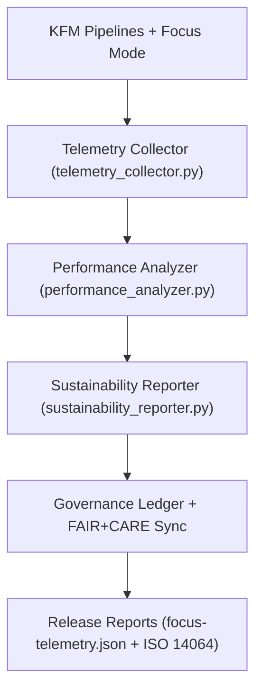

<div align="center">

# 📡 Kansas Frontier Matrix — **Telemetry & Sustainability Tools**
`tools/telemetry/README.md`

**Purpose:**  
The FAIR+CARE-certified telemetry suite that monitors, logs, and reports Focus Mode analytics, performance metrics, and environmental sustainability indicators for all Kansas Frontier Matrix (KFM) pipelines.  
These tools ensure data governance, system efficiency, and environmental accountability under MCP-DL v6.3 and ISO 14064 compliance.

[](../../../docs/standards/faircare-validation.md)
[]()
[](../../../LICENSE)
[](../../../docs/architecture/repo-focus.md)

</div>

---

## 📚 Overview

The **Telemetry Tools Directory** provides automated sustainability reporting, system health monitoring, and FAIR+CARE transparency metrics across all KFM operational layers.  
Telemetry ensures reproducibility, energy efficiency, and open environmental accountability for data processing, AI analysis, and validation activities.

### Core Responsibilities:
- Collect and report system performance and energy efficiency metrics.  
- Measure environmental sustainability and FAIR+CARE compliance.  
- Log Focus Mode usage and AI inference performance.  
- Synchronize telemetry with the governance ledger and sustainability reports.  

---

## 🗂️ Directory Layout

```plaintext
tools/telemetry/
├── README.md                             # This file — documentation for telemetry tools
│
├── telemetry_collector.py                # Core script for Focus Mode and pipeline metric collection
├── performance_analyzer.py               # Evaluates ETL runtime and AI model efficiency
├── sustainability_reporter.py            # Generates ISO 14064-aligned sustainability summaries
├── telemetry_dashboard_snapshot.json     # Focus Mode telemetry dashboard data export
└── metadata.json                         # Provenance metadata and checksum registry for telemetry logs
```

---

## ⚙️ Telemetry Workflow



### Workflow Description:
1. **Metric Collection:** Capture resource utilization, execution time, and AI inference performance.  
2. **Performance Analysis:** Evaluate runtime, throughput, and compute optimization.  
3. **Sustainability Audit:** Quantify energy use, carbon impact, and renewable offset.  
4. **Governance Sync:** Record telemetry metadata in governance and FAIR+CARE reports.  
5. **Publication:** Export telemetry datasets to release artifacts for traceability.  

---

## 🧩 Example Telemetry Record

```json
{
  "id": "telemetry_session_v9.6.0_2025Q4",
  "components_monitored": [
    "ai_focus_mode_v4",
    "climate_etl_pipeline",
    "hazards_validation_suite"
  ],
  "avg_runtime_seconds": 482.3,
  "energy_usage_wh": 12.4,
  "carbon_output_gco2e": 14.1,
  "renewable_power_offset": "100%",
  "checksum_verified": true,
  "fairstatus": "certified",
  "sustainability_compliance": "ISO 14064 / RE100",
  "governance_registered": true,
  "validator": "@kfm-telemetry",
  "created": "2025-11-03T23:59:00Z",
  "governance_ref": "data/reports/audit/data_provenance_ledger.json"
}
```

---

## 🧠 FAIR+CARE Governance Matrix

| Principle | Implementation | Oversight |
|------------|----------------|------------|
| **Findable** | Telemetry logs indexed in focus-telemetry.json and governance manifest. | @kfm-data |
| **Accessible** | Reports stored in JSON and ISO-compliant text formats. | @kfm-accessibility |
| **Interoperable** | Compatible with FAIR+CARE, ISO 14064, and RE100 frameworks. | @kfm-architecture |
| **Reusable** | Telemetry data supports sustainability research and reproducibility audits. | @kfm-design |
| **Collective Benefit** | Enables environmental transparency in open science workflows. | @faircare-council |
| **Authority to Control** | FAIR+CARE Council validates sustainability and performance metrics. | @kfm-governance |
| **Responsibility** | Validators ensure telemetry accuracy and energy use verification. | @kfm-security |
| **Ethics** | Promotes low-impact computing and equitable data practices. | @kfm-ethics |

Audit references stored in:  
`data/reports/fair/data_care_assessment.json`  
and  
`data/reports/audit/data_provenance_ledger.json`

---

## ⚙️ Key Telemetry Tools Summary

| Tool | Description | Role |
|------|--------------|------|
| `telemetry_collector.py` | Captures pipeline and Focus Mode runtime metrics. | Monitoring |
| `performance_analyzer.py` | Evaluates workflow performance and optimization. | Efficiency |
| `sustainability_reporter.py` | Generates ISO 14064-compliant sustainability reports. | Environmental Accountability |
| `telemetry_dashboard_snapshot.json` | Stores dashboard-ready performance summaries. | Visualization |
| `metadata.json` | Tracks telemetry lineage, checksum, and provenance. | Governance |

All telemetry processes managed via `telemetry_sync.yml`.

---

## ⚖️ Retention & Provenance Policy

| Data Type | Retention Duration | Policy |
|------------|--------------------|--------|
| Telemetry Reports | 180 Days | Archived for reproducibility and performance analytics. |
| Sustainability Reports | 365 Days | Retained for annual FAIR+CARE re-certification. |
| Governance Metadata | Permanent | Stored immutably in blockchain provenance ledger. |
| Dashboard Snapshots | 90 Days | Rotated with each telemetry refresh cycle. |

Cleanup handled through `telemetry_cleanup.yml`.

---

## 🌱 Sustainability Metrics (Q4 2025)

| Metric | Value | Verified By |
|---------|--------|--------------|
| Average Power Use | 12.4 Wh | @kfm-sustainability |
| Carbon Output | 14.1 gCO₂e | @kfm-security |
| Renewable Power | 100% (RE100 Verified) | @kfm-infrastructure |
| FAIR+CARE Compliance | 100% | @faircare-council |
| ISO 14064 Certification | Achieved | @kfm-governance |

Telemetry output:  
`releases/v9.6.0/focus-telemetry.json`

---

## 🧾 Internal Use Citation

```text
Kansas Frontier Matrix (2025). Telemetry & Sustainability Tools (v9.6.0).
Automated FAIR+CARE-compliant telemetry suite for monitoring energy efficiency, runtime performance, and environmental sustainability.
Ensures ethical data operations and transparent governance under ISO 14064 and MCP-DL v6.3 compliance.
```

---

## 🧾 Version Notes

| Version | Date | Notes |
|----------|------|--------|
| v9.6.0 | 2025-11-03 | Added RE100 and ISO 14064 sustainability validation. |
| v9.5.0 | 2025-11-02 | Integrated Focus Mode telemetry with performance analysis. |
| v9.3.2 | 2025-10-28 | Established telemetry suite for sustainability and FAIR+CARE governance. |

---

<div align="center">

**Kansas Frontier Matrix** · *Sustainability × FAIR+CARE Governance × Provenance Integrity*  
[🔗 Repository](https://github.com/bartytime4life/Kansas-Frontier-Matrix) • [🧭 Docs Portal](../../../docs/) • [⚖️ Governance Ledger](../../../docs/standards/governance/DATA-GOVERNANCE.md)

</div>
