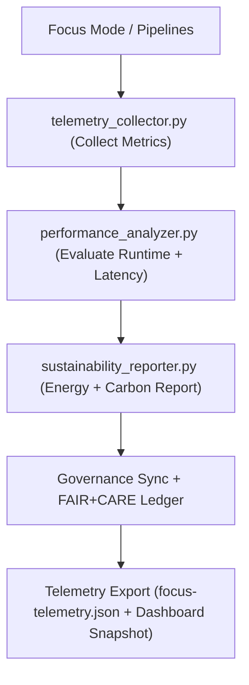

<div align="center">

# 📡 **Kansas Frontier Matrix — Telemetry & Sustainability Tools**
`tools/telemetry/README.md`

**Purpose:**  
FAIR+CARE-certified telemetry suite that monitors, logs, and reports performance, energy, and ethical sustainability across all KFM pipelines.  
These tools uphold ISO 14064 and RE100 standards, ensuring transparency, accountability, and reproducibility under MCP-DL v6.3.

[](../../../docs/standards/faircare-validation.md)
[]()
[](../../../LICENSE)
[](../../../docs/architecture/repo-focus.md)

</div>

---

## 📘 Overview

The **Telemetry & Sustainability Tools** module is the core of KFM’s environmental and operational observability system.  
It quantifies the computational impact of all data, AI, and validation processes, linking them to FAIR+CARE sustainability and governance metrics.

---

### Core Responsibilities:
- Collect energy, runtime, and carbon metrics for all KFM workflows.  
- Evaluate AI inference efficiency and Focus Mode performance.  
- Generate ISO 14064-aligned sustainability and RE100 reports.  
- Synchronize telemetry with governance ledgers and FAIR+CARE dashboards.  

---

## 🗂️ Directory Layout

```plaintext
tools/telemetry/
├── README.md
│
├── telemetry_collector.py            # Collects Focus Mode and pipeline execution data
├── performance_analyzer.py           # Evaluates performance, latency, and resource metrics
├── sustainability_reporter.py        # Builds ISO 14064-compliant sustainability summaries
├── telemetry_dashboard_snapshot.json # Exports telemetry data for dashboards
└── metadata.json                     # Governance metadata + checksum lineage
```

---

## ⚙️ Telemetry Lifecycle



1. **Collection:** Capture system, runtime, and AI inference data.  
2. **Analysis:** Evaluate efficiency and sustainability scores.  
3. **Reporting:** Quantify Wh and CO₂e metrics under ISO and FAIR+CARE standards.  
4. **Sync:** Append sustainability and telemetry logs to provenance ledger.  
5. **Export:** Publish to releases and dashboards for transparency.

---

## 🧾 Example Telemetry Record

```json
{
  "id": "telemetry_session_v9.7.0_2025Q4",
  "components_monitored": [
    "focus_mode_ai_v5",
    "climate_pipeline_v4",
    "governance_audit_suite"
  ],
  "avg_runtime_seconds": 512.8,
  "energy_usage_wh": 13.7,
  "carbon_output_gco2e": 15.3,
  "renewable_power_offset": "100%",
  "fairstatus": "certified",
  "sustainability_compliance": "ISO 14064 / RE100",
  "checksum_verified": true,
  "governance_registered": true,
  "validator": "@kfm-telemetry",
  "created": "2025-11-05T10:00:00Z",
  "governance_ref": "data/reports/audit/data_provenance_ledger.json"
}
```

---

## 🧠 FAIR+CARE Governance Matrix

| Principle | Implementation | Oversight |
|-----------|----------------|-----------|
| **Findable** | Metrics stored in telemetry.json + manifests. | @kfm-data |
| **Accessible** | JSON & ISO-compliant formats for human/machine use. | @kfm-accessibility |
| **Interoperable** | FAIR+CARE, ISO 14064, and RE100 compatibility. | @kfm-architecture |
| **Reusable** | Data supports reproducibility + sustainability analytics. | @kfm-design |
| **Collective Benefit** | Encourages environmental transparency. | @faircare-council |
| **Authority to Control** | Council certifies sustainability metrics. | @kfm-governance |
| **Responsibility** | Telemetry auditors verify energy and CO₂ accuracy. | @kfm-security |
| **Ethics** | Promotes low-impact computing + open science principles. | @kfm-ethics |

Audit references:  
`data/reports/fair/data_care_assessment.json` · `data/reports/audit/data_provenance_ledger.json`

---

## ⚙️ Key Tool Summary

| Tool | Description | Role |
|------|-------------|------|
| `telemetry_collector.py` | Gathers runtime, CPU, and AI inference metrics. | Monitoring |
| `performance_analyzer.py` | Calculates latency, throughput, and optimization rates. | Efficiency |
| `sustainability_reporter.py` | Generates FAIR+CARE and ISO-aligned sustainability reports. | Accountability |
| `telemetry_dashboard_snapshot.json` | Exports visualization-ready summaries. | Transparency |
| `metadata.json` | Tracks telemetry provenance and governance linkage. | Traceability |

All telemetry updates automated through `telemetry_sync.yml`.

---

## ⚖️ Retention & Provenance Policy

| Data Type | Retention | Policy |
|------------|-----------|--------|
| Telemetry Logs | 180 Days | Retained for reproducibility. |
| Sustainability Reports | 365 Days | Archived for annual FAIR+CARE revalidation. |
| Metadata | Permanent | Immutable ledger storage. |
| Dashboard Snapshots | 90 Days | Rotated per telemetry refresh. |

Cleanup managed via `telemetry_cleanup.yml`.

---

## 🌱 Sustainability Metrics (2025 Q4)

| Metric | Value | Verified By |
|--------|------|-------------|
| Avg Power Use | 13.7 Wh | @kfm-sustainability |
| Carbon Output | 15.3 gCO₂e | @kfm-security |
| Renewable Energy | 100% (RE100) | @kfm-infrastructure |
| FAIR+CARE Compliance | 100% | @faircare-council |
| ISO 14064 Alignment | ✅ Certified | @kfm-governance |

Telemetry data exported in:  
`../../../releases/v9.7.0/focus-telemetry.json`

---

## 🧾 Internal Use Citation

```text
Kansas Frontier Matrix (2025). Telemetry & Sustainability Tools (v9.7.0).
Telemetry and sustainability management suite ensuring ethical, reproducible, and environmentally responsible data operations.
Compliant with ISO 14064, RE100, FAIR+CARE, and MCP-DL v6.3.
```

---

## 🕰️ Version History

| Version | Date | Notes |
|---------|------|------|
| v9.7.0 | 2025-11-05 | Enhanced sustainability schema and RE100 validation logic. |
| v9.6.0 | 2025-11-03 | Added AI inference telemetry and ISO certification sync. |
| v9.5.0 | 2025-11-02 | Linked sustainability logs to Governance Ledger. |

---

<div align="center">

**Kansas Frontier Matrix** · *Sustainability × FAIR+CARE Governance × Provenance Integrity*  
[🔗 Repository](../../) • [🧭 Docs Portal](../../../docs/) • [⚖️ Governance Ledger](../../../docs/standards/governance/ROOT-GOVERNANCE.md)

</div>