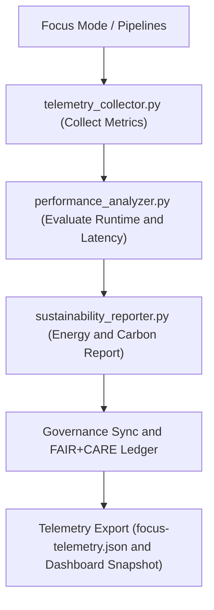

<div align="center">

# 📡 **Kansas Frontier Matrix — Telemetry & Sustainability Tools**  
`tools/telemetry/README.md`

**Purpose:**  
FAIR+CARE-certified telemetry suite that monitors, logs, and reports **performance, energy, carbon, and ethics** metrics across all KFM pipelines.  
Implements **ISO 14064** and **RE100** standards to ensure transparency, accountability, and reproducibility under **MCP-DL v6.3**.

[](../../../docs/standards/faircare-validation.md)
[]()
[](../../../LICENSE)
[](../../../docs/architecture/repo-focus.md)

</div>

---

## 📘 Overview

The **Telemetry & Sustainability Tools** module is the observability core for KFM.  
It quantifies computational impact across data and AI workflows, linking measurements to FAIR+CARE sustainability and governance metrics with checksum-verifiable provenance.

### Core Responsibilities
- Collect **energy, runtime, resource, and carbon** metrics for all workflows.  
- Evaluate **AI inference efficiency** and Focus Mode performance.  
- Generate **ISO 14064**-aligned sustainability and **RE100** usage reports.  
- Synchronize telemetry with **Governance Ledger** and FAIR+CARE dashboards.

---

## 🗂️ Directory Layout

```plaintext
tools/telemetry/
├── README.md
│
├── telemetry_collector.py            # Collect Focus Mode + pipeline execution metrics
├── performance_analyzer.py           # Evaluate latency, throughput, resource utilization
├── sustainability_reporter.py        # Build ISO 14064-compliant sustainability summaries
├── telemetry_dashboard_snapshot.json # Exported snapshot for dashboards
└── metadata.json                     # Governance metadata + checksum lineage
```

---

## ⚙️ Telemetry Lifecycle



1. **Collection** — Capture system, runtime, and AI inference data.  
2. **Analysis** — Evaluate efficiency and sustainability scores.  
3. **Reporting** — Quantify Wh and gCO₂e under ISO and FAIR+CARE standards.  
4. **Sync** — Append sustainability logs to the **provenance ledger**.  
5. **Export** — Publish to releases and dashboards for public transparency.

---

## 🧾 Example Telemetry Record

```json
{
  "id": "telemetry_session_v10.0.0_2025Q4",
  "components_monitored": [
    "focus_mode_ai_v5",
    "climate_pipeline_v4",
    "governance_audit_suite"
  ],
  "avg_runtime_seconds": 512.8,
  "energy_usage_wh": 13.7,
  "carbon_output_gco2e": 15.3,
  "renewable_power_offset": "100%",
  "fairstatus": "certified",
  "sustainability_compliance": "ISO 14064 / RE100",
  "checksum_verified": true,
  "governance_registered": true,
  "validator": "@kfm-telemetry",
  "created": "2025-11-10T10:00:00Z",
  "governance_ref": "data/reports/audit/data_provenance_ledger.json"
}
```

---

## 🧠 FAIR+CARE Governance Matrix

| Principle | Implementation | Oversight |
|-----------|----------------|-----------|
| **Findable** | Metrics stored in `focus-telemetry.json` and release manifests. | @kfm-data |
| **Accessible** | JSON + ISO-compliant exports for human/machine use. | @kfm-accessibility |
| **Interoperable** | FAIR+CARE, ISO 14064, and RE100 compatibility. | @kfm-architecture |
| **Reusable** | Data supports reproducibility and sustainability analytics. | @kfm-design |
| **Collective Benefit** | Encourages environmental transparency. | @faircare-council |
| **Authority to Control** | Council certifies sustainability metrics. | @kfm-governance |
| **Responsibility** | Telemetry auditors verify energy and CO₂ accuracy. | @kfm-security |
| **Ethics** | Promotes low-impact computing and open science. | @kfm-ethics |

**Audit references:**  
`data/reports/fair/data_care_assessment.json` · `data/reports/audit/data_provenance_ledger.json`

---

## ⚙️ Key Tool Summary

| Tool | Description | Role |
|------|-------------|------|
| `telemetry_collector.py` | Gathers runtime, CPU, and AI inference metrics. | Monitoring |
| `performance_analyzer.py` | Calculates latency, throughput, optimization rates. | Efficiency |
| `sustainability_reporter.py` | Generates FAIR+CARE + ISO-aligned sustainability reports. | Accountability |
| `telemetry_dashboard_snapshot.json` | Exposes visualization-ready summaries. | Transparency |
| `metadata.json` | Tracks telemetry provenance and governance linkage. | Traceability |

Automated by `telemetry_sync.yml`.

---

## ⚖️ Retention & Provenance Policy

| Data Type | Retention | Policy |
|-----------|-----------:|-------|
| Telemetry Logs | 180 Days | Retained for reproducibility. |
| Sustainability Reports | 365 Days | Archived for annual FAIR+CARE revalidation. |
| Metadata | Permanent | Immutable ledger storage. |
| Dashboard Snapshots | 90 Days | Rotated per telemetry refresh. |

Cleanup via `telemetry_cleanup.yml`.

---

## 🌱 Sustainability Metrics (2025 Q4)

| Metric | Value | Verified By |
|--------|------:|-------------|
| Avg Power Use | 13.7 Wh | @kfm-sustainability |
| Carbon Output | 15.3 gCO₂e | @kfm-security |
| Renewable Energy | 100% (RE100) | @kfm-infrastructure |
| FAIR+CARE Compliance | 100% | @faircare-council |
| ISO 14064 Alignment | ✅ Certified | @kfm-governance |

Telemetry exported in:  
`../../../releases/v10.0.0/focus-telemetry.json`

---

## 🧾 Citation

```text
Kansas Frontier Matrix (2025). Telemetry & Sustainability Tools (v10.0.0).
Telemetry and sustainability management suite ensuring ethical, reproducible, and environmentally responsible data operations under ISO 14064, RE100, FAIR+CARE, and MCP-DL v6.3.
```

---

## 🕰️ Version History

| Version | Date | Notes |
|---------|------|------|
| v10.0.0 | 2025-11-10 | Upgraded to telemetry schema v2; expanded dashboard snapshot and governance hooks. |
| v9.7.0 | 2025-11-05 | Enhanced sustainability schema and RE100 validation logic. |
| v9.6.0 | 2025-11-03 | Added AI inference telemetry and ISO certification sync. |
| v9.5.0 | 2025-11-02 | Linked sustainability logs to Governance Ledger. |

---

<div align="center">

**Kansas Frontier Matrix** · *Sustainability × FAIR+CARE Governance × Provenance Integrity*  
© 2025 Kansas Frontier Matrix — MIT License  

[Back to Tools](../README.md) · [Docs Portal](../../../docs/) · [Governance Charter](../../../docs/standards/governance/ROOT-GOVERNANCE.md)

</div>
