<div align="center">

# 📡 **Kansas Frontier Matrix — Telemetry & Sustainability Tools (v11.2.2)**  
`tools/telemetry/README.md`

**Purpose**  
Provide the **canonical telemetry and sustainability architecture** for KFM’s tools-platform — measuring and reporting:

- Runtime & performance characteristics  
- Energy usage (Wh) & carbon emissions (gCO₂e)  
- FAIR+CARE-aligned ethics metrics (A11y, governance outcomes)  
- Reliability & error budgets for tools and pipelines  

Telemetry & Sustainability Tools are the **observability anchor** for Reliable Pipelines v11, FAIR+CARE governance, and the Tools Platform (`tools/**`).

[]() ·
[]() ·
[]() ·
[]() ·
[]()

</div>

---

## 📘 1. Overview

The **Telemetry & Sustainability Tools** module:

- Collects **operational metrics** from:
  - ETL/AI pipelines  
  - Tools Platform (`tools/**`)  
  - Test Platform  
  - Focus Mode v3 and Story Nodes v3 flows  
  - Neo4j + STAC/DCAT subsystems  
- Computes **energy and carbon** footprints per execution  
- Aggregates and normalizes metrics into **OpenTelemetry v11** streams  
- Exports **ISO 14064 / ISO 50001**-aligned sustainability reports  
- Writes telemetry bundles into release artifacts (`focus-telemetry.json`)  
- Integrates with:
  - **Tools Platform Architecture** (`tools/ARCHITECTURE.md`)  
  - **Validation Tools** (`tools/validation/README.md`)  
  - **Audit & Governance Ledgers** (`data/reports/audit/**`)  

Telemetry is part of governance: if telemetry fails, releases can be blocked or downgraded.

---

## 🗂️ 2. Directory Layout (Emoji Style A)

```text
tools/
└── 📡 telemetry/
    ├── 📄 README.md                     # This document
    │
    ├── 📥 telemetry_collector.py        # Metric ingestion from tools & pipelines
    ├── 📊 performance_analyzer.py       # Latency, throughput, error rate, SLO scoring
    ├── 🌱 sustainability_reporter.py    # ISO 14064/50001 sustainability reports
    │
    ├── 📊 telemetry_dashboard.json      # Snapshot for dashboards (JSON/JSON-LD)
    └── 📑 metadata.json                 # Telemetry schema, lineage, and governance config
```

All sources under `tools/telemetry/` are **governed tools** and must follow:

- KFM-MDP v11.2.2 Markdown rules  
- Tools Platform Architecture (`tools/ARCHITECTURE.md`)  
- FAIR+CARE and sovereignty policies  

---

## 🧬 3. Telemetry Architecture (v11)

### 3.1 Conceptual Flow

```mermaid
flowchart TD
  A["Pipelines · Tools · Tests · Focus Mode v3"]
    --> B["📥 telemetry_collector.py\nCollect & Normalize Metrics (OTel v11)"]
  B --> C["📊 performance_analyzer.py\nLatency · Error Budgets · SLO Scoring"]
  C --> D["🌱 sustainability_reporter.py\nEnergy · Carbon · ISO 14064/50001"]
  D --> E["🏛 Governance Sync\nFAIR+CARE Ledgers · Governance Dashboards"]
  E --> F["📦 Export\nfocus-telemetry.json · telemetry_dashboard.json"]
```



### 3.2 Inputs

- Runtime metrics (duration, CPU, memory, I/O)  
- AI metrics (inference counts, error rates, model IDs)  
- Pipeline states (success/fail, retries, rollbacks)  
- Energy & Carbon metrics (via `energy_schema`, `carbon_schema`)  
- A11y metrics (screen reader usage, keyboard navigation)  

### 3.3 Outputs

- **Release-scoped telemetry bundles** (`focus-telemetry.json`)  
- CI-scope telemetry for governance dashboards (`data/reports/telemetry/**`)  
- Sustainability summaries for reporting under ISO 14064 / 50001  

---

## ⚙️ 4. Telemetry Collector (`telemetry_collector.py`)

### Responsibilities

- Connects to:
  - ETL pipelines  
  - AI inference services  
  - Tools & validation jobs  
  - CI workflows  

- Normalizes metrics into:
  - OTel v11-compatible metrics  
  - KFM-specific telemetry schemas (system, tools, data-domain specific)  

- Enforces:
  - No PII or sensitive values in numeric metrics  
  - Only domain-safe tags (e.g., domain name, pipeline name, job ID)  

**Example Metric Families**

- `kfm.tools.exec_time_ms`  
- `kfm.tools.energy_wh`  
- `kfm.tools.carbon_gco2e`  
- `kfm.tools.error_count`  
- `kfm.tools.retry_count`  
- `kfm.tools.calls`  
- `kfm.tools.care_flags`  

---

## 📊 5. Performance Analyzer (`performance_analyzer.py`)

### Functions

- Aggregates:
  - Latency distributions (p50, p90, p95, p99)  
  - Error rates per job and per tool  
  - Throughput metrics (jobs/minute, records/second)  

- Computes:
  - SLO compliance (e.g., 99% of validation jobs under X seconds)  
  - Error budgets (how much failure is allowed per period)  
  - Reliability trends across releases  

Outputs:

- JSON summaries consumed by:
  - Governance dashboards  
  - Reliability & on-call systems  
  - Focus Mode v3 (to explain reliability context to users)  

---

## 🌱 6. Sustainability Reporter (`sustainability_reporter.py`)

### Role

- Computes energy and carbon metrics for each:
  - Pipeline run  
  - Validation job  
  - AI training/evaluation job  
  - Telemetry collection batch  

- Aligns with:
  - **ISO 14064** (Greenhouse gas accounting)  
  - **ISO 50001** (Energy management)  

### Typical Fields

- `energy_wh` — Watt-hours used  
- `carbon_gco2e` — Estimated CO₂-equivalent grams  
- `renewable_power_pct` — Percent of renewable power usage  
- `sustainability_score` — Internal composite metric  
- `iso_14064_compliance` / `iso_50001_compliance` — booleans or status flags  

Outputs feed:

- `telemetry_dashboard.json`  
- `data/reports/sustainability/*.json`  

---

## 📦 7. Example Telemetry Record (v11.1.0)

```json
{
  "@context": "https://schema.org/",
  "@type": "Dataset",
  "id": "telemetry_session_v11.1.0",
  "components_monitored": [
    "tools/validation/faircare_validator.py",
    "tools/ai/focus_audit.py",
    "tools/ci/docs_validate.yml"
  ],
  "avg_runtime_seconds": 142.7,
  "energy_usage_wh": 4.8,
  "carbon_output_gco2e": 5.3,
  "renewable_power_offset": "100%",
  "hardware_type": "NVIDIA T4 · Intel Xeon",
  "fairstatus": "certified",
  "sustainability_compliance": "ISO 14064 · ISO 50001 · RE100",
  "checksum_verified": true,
  "governance_registered": true,
  "validator": "@kfm-telemetry",
  "created": "2025-11-24T09:45:00Z",
  "governance_ref": "docs/reports/audit/data_provenance_ledger.json"
}
```

---

## 🧠 8. FAIR+CARE Governance Matrix (Telemetry Tools)

| Principle            | Implementation                                                      | Oversight            |
|----------------------|----------------------------------------------------------------------|----------------------|
| **Findable**         | Telemetry sessions indexed by ID & release in DCAT/STAC catalogs    | `@kfm-data`          |
| **Accessible**       | JSON/JSON-LD under CC-BY/MIT; internal dashboards where appropriate | `@kfm-accessibility` |
| **Interoperable**    | OTel v11; ISO 14064/50001; DCAT 3.0; JSON-LD metadata               | `@kfm-architecture`  |
| **Reusable**         | Versioned schemas, consistent metric naming, documented semantics   | `@kfm-design`        |
| **Collective Benefit** | Sustainability transparency, enabling public/environmental insight| `@faircare-council`  |
| **Authority to Control** | Councils define sustainability thresholds and telemetry policies| `@kfm-governance`    |
| **Responsibility**   | Telemetry and sustainability owners validate metrics and assumptions | `@kfm-security`      |
| **Ethics**           | Tracks resource usage; flags unsustainable practices for remediation | `@kfm-ethics`        |

---

## 🧰 9. Tool Summary

| Tool                      | Role                                              | Outputs                                     |
|---------------------------|---------------------------------------------------|---------------------------------------------|
| `telemetry_collector.py`  | Collect + normalize metrics                       | OTel v11 streams, intermediate JSON         |
| `performance_analyzer.py` | Compute latency, SLOs, error budgets             | Performance summaries, reliability reports  |
| `sustainability_reporter.py` | Compute energy & carbon footprint             | Sustainability reports & compliance flags   |
| `telemetry_dashboard.json`| Aggregated, dashboard-ready metrics              | JSON/JSON-LD for visualizations             |
| `metadata.json`           | Defines telemetry schemas and governance configs | Validation + ingestion configuration        |

---

## ⚖️ 10. Retention & Provenance

| Artifact                  | Retention  | Notes                                           |
|---------------------------|-----------:|-------------------------------------------------|
| Raw Telemetry Logs        | ≥ 90 days  | Rotated after aggregation                       |
| Telemetry Summaries       | ≥ 365 days | Used for audits & re-certifications             |
| Sustainability Reports    | ≥ 365 days | Environmental compliance & reporting            |
| Governance-Linked Metrics | Permanent  | Treated as provenance & governance evidence     |
| Telemetry Schemas        | Permanent  | Schema evolution tracked in `schemas/telemetry` |

Rotation is managed via CI jobs that:

- Compact raw logs into summaries  
- Remove PII or any sensitive references (if accidentally collected)  
- Preserve only aggregate, governance-safe metrics for long-term storage  

---

## 🌍 11. Sustainability Targets (v11.1.0 Baseline)

| Metric                         | Target (per run) |
|--------------------------------|------------------|
| Energy Usage                   | ≤ 6 Wh           |
| Carbon Output                  | ≤ 8 gCO₂e        |
| Renewable Energy Utilization   | 100% (RE100)     |
| FAIR+CARE Telemetry Compliance | 100%             |

Telemetry helps:

- Evaluate KFM’s environmental footprint  
- Support improvement plans for more sustainable compute practices  
- Provide **explainable energy/carbon context** in Focus Mode when relevant  

---

## 🕰️ 12. Version History

| Version | Date       | Summary                                                                                                       |
|--------:|-----------:|---------------------------------------------------------------------------------------------------------------|
| v11.2.2 | 2025-11-27 | Upgraded to KFM-MDP v11.2.2; emoji layout aligned; clarified inputs/outputs; deeper FAIR+CARE & sustainability wiring. |
| v11.1.0 | 2025-11-24 | Telemetry tools fully integrated with Tools v11; OTel v11, energy v2, carbon v2, FAIR+CARE v11 flows.        |
| v11.0.0 | 2025-11-20 | First v11 telemetry uplift; integrated with Reliable Pipelines v11 SLO/error-budget model.                   |
| v10.2.2 | 2025-11-12 | Added ISO 50001 metrics; GPU-aware telemetry; JSON-LD dashboards.                                            |
| v10.0.0 | 2025-11-10 | Telemetry v2 schema; sustainability dashboards; RE100 checks.                                                |

---

<div align="center">

© 2025 Kansas Frontier Matrix — MIT License  
📡 Telemetry & Sustainability Tools v11 · FAIR+CARE Certified · ISO 14064/50001 Aligned · OTel v11 · Diamond⁹ Ω / Crown∞Ω  

[⬅️ Back to Tools Index](../README.md) · [🧱 Tools Architecture](../ARCHITECTURE.md) · [🛡 Governance Charter](../../../docs/standards/governance/ROOT-GOVERNANCE.md)

</div>