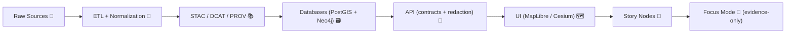

# 🧰 tools/templates — KFM Scaffolds & Starters

> [!NOTE]
> According to KFM’s architecture docs, **everything moves through a canonical pipeline** and must remain **provenance-linked + contract-first + deterministic**. This folder exists to make “doing it the right way” the fastest way. ✅

---

<p align="center">
  
  
  
  
</p>

---

## 🎯 Purpose

This directory contains **reusable templates** (and template _metadata_) used to scaffold new work across KFM:

- 🧪 **ETL / pipelines**: deterministic, replayable “truth-path” jobs
- 🧾 **Catalog artifacts**: STAC / DCAT / PROV stubs + validators
- 🕸️ **Graph migrations**: Neo4j ontology + migration skeletons
- 🧩 **API additions**: contract-first endpoint scaffolds + tests
- 🗺️ **UI layers**: MapLibre layer config templates + accessibility hooks
- 🧠 **AI/Focus**: evidence-first prompt bundles + citation guardrails
- 🧰 **CI “gates”**: fail-closed checks & validation harnesses

> [!TIP]
> If you’re looking for **documentation templates** (universal doc template, Story Node template, API contract extension doc, etc.), see:  
> 📁 `docs/templates/` ✅

---

## 🧭 The Non‑Negotiables (Templates MUST Respect)

KFM templates are not “nice-to-haves.” They enforce system invariants:

- 🧱 **Pipeline ordering is absolute**  
  ETL → Catalogs (STAC/DCAT/PROV) → Graph → API → UI → Story Nodes → Focus Mode  
- 🔒 **API boundary rule**  
  The UI **never** queries Neo4j directly. All access goes through the governed API layer.
- 🧾 **Provenance-first publishing**  
  Data is not “published” until catalogs + lineage exist and validate.
- 🧪 **Deterministic, idempotent ETL**  
  Same inputs → same outputs (or differences logged + explained). Safe re-runs.
- 🧯 **Fail-closed governance**  
  Missing license? invalid metadata? policy violation? → block/CI fail.

---

## 🗺️ Quick Visual: “Truth Path” Flow



---

## 📦 What Lives Here vs. docs/templates

| Folder | What it’s for | Examples |
|---|---|---|
| 📁 `tools/templates/` | **Executable scaffolds** + config/metadata that tooling can instantiate | pipeline skeletons, schema/validator stubs, API route skeletons, CI checks |
| 📁 `docs/templates/` | **Governed document formats** | universal doc template, Story Node template, API contract extension template |

---

## 🧩 Template Catalog (Index)

> [!IMPORTANT]
> Not every template listed below is guaranteed to exist on day one. This README is the **contract for what should live here**. If a template is missing, open an issue and/or add it in a PR.

### 1) 🧪 ETL / Pipelines

Recommended templates to standardize deterministic pipelines and their run artifacts.

- 📁 `pipeline-python/`  
  **Use when:** ingesting/transforming a dataset with Python (GeoPandas/Rasterio/etc.)  
  **Outputs:** `data/raw/...` → `data/work/...` → `data/processed/...` + catalog + prov  
- 📁 `pipeline-r/`  
  **Use when:** domain workflow is best in R (stats / time-series / exploratory)  
- 📁 `pipeline-simulation/`  
  **Use when:** generating “evidence artifacts” (models, predictions, OCR corpora, etc.)  
- 📁 `pipeline-config/`  
  **Use when:** you need a config-driven run (YAML/JSON) with strict versioning

### 2) 📚 Catalog + Lineage (STAC / DCAT / PROV)

Templates for boundary artifacts required before graph/UI use.

- 📁 `stac-collection/`
- 📁 `stac-item/`
- 📁 `dcat-dataset/`
- 📁 `prov-bundle/`
- 📁 `validators/` (JSON Schema + CLI validation runner stubs)

### 3) 🕸️ Graph / Ontology

- 📁 `neo4j-migration/`  
  Migration skeleton (up/down, constraints, indexes) + changelog entry
- 📁 `ontology-extension/`  
  “Add a concept safely” starter: version bump guidance + migration notes

### 4) 🔐 API (Contract‑First)

- 📁 `fastapi-route/`  
  Router + service + repo adapter stub + contract test
- 📁 `openapi-fragment/`  
  OpenAPI excerpt + compatibility notes
- 📁 `graphql-resolver/` (optional)  
  Schema + resolver stub (if GraphQL is enabled)

### 5) 🗺️ UI Layers (Map + Timeline + Accessibility)

- 📁 `ui-layer-registry/`  
  Layer config stub (style, source, filters, attribution, governance tags)
- 📁 `ui-story-map-step/`  
  A single scrollytelling step template (map state + narrative + citations)
- 📁 `ui-a11y-checklist/`  
  Accessibility-ready component checklist template

### 6) 🧠 AI / Focus Mode (Evidence‑First)

- 📁 `focus-context-bundle/`  
  “Evidence-only context bundle” manifest template (what the AI is allowed to see/use)
- 📁 `prompt-pack/`  
  System+developer prompt scaffolds with:
  - citation requirements
  - refusal modes
  - provenance logging hooks
- 📁 `ollama-local/` (optional)  
  Local LLM runner scaffolds (e.g., Modelfile + compose snippets + safety defaults)

### 7) 🧯 CI / Governance Gates

- 📁 `ci-schema-validate/`  
  Validate STAC/DCAT/PROV against KFM profiles
- 📁 `ci-license-check/`  
  Fail if license metadata is missing or invalid
- 📁 `ci-provenance-check/`  
  Fail if processed artifacts lack corresponding PROV bundle

---

## 🧬 Token & Naming Conventions

Templates should use **consistent tokens** so they can be instantiated by scripts later.

### ✅ Token format

Use double-braced tokens in template files:

- `{{DOMAIN_SLUG}}` (kebab-case)
- `{{DATASET_SLUG}}` (kebab-case)
- `{{DATASET_VERSION}}` (semver)
- `{{OWNER_GITHUB}}` (handle)
- `{{LICENSE_SPDX}}` (SPDX id)
- `{{SOURCE_URL}}` (canonical source)
- `{{STAC_COLLECTION_ID}}`
- `{{PROV_ACTIVITY_ID}}`

> [!TIP]
> Prefer **stable identifiers** over free text. If it can be an ID, make it an ID. 🧷

### ✅ Template folder naming

- `kebab-case/` for template directories
- `TEMPLATE__UPPER_SNAKE_CASE.md` only for governed docs (usually in `docs/templates/`)
- Include a `template.meta.yaml` (or `.json`) in each template root (see below)

---

## 🗂️ Recommended Template Layout (Inside Each Template)

Every template folder should follow this mini-contract:

```
📁 <template-name>/
├── template.meta.yaml        # 🔎 machine-readable template metadata
├── README.md                 # 🧾 human instructions + “when to use”
├── scaffold/                 # 🧱 files to be copied/instantiated
│   ├── ...                   # (project-ready structure)
└── tests/                    # ✅ optional: lint/contract tests for the template output
```

### `template.meta.yaml` (suggested fields)

```yaml
id: kfm.template.<name>
version: 0.1.0
owner: "@{{OWNER_GITHUB}}"
stage: ["etl", "catalog", "graph", "api", "ui", "story", "focus", "ci"]
description: "One-liner describing what this template scaffolds."
tokens:
  - DOMAIN_SLUG
  - DATASET_SLUG
  - LICENSE_SPDX
outputs:
  - "data/raw/{{DOMAIN_SLUG}}/"
  - "data/processed/{{DOMAIN_SLUG}}/{{DATASET_SLUG}}/"
validators:
  - "tools/validate/stac"
  - "tools/validate/dcat"
  - "tools/validate/prov"
```

---

## 🚀 How to Use Templates

### Option A: Manual copy (always works)

1) Pick a template folder in `tools/templates/`  
2) Copy `scaffold/` contents into the target location  
3) Replace tokens (`{{...}}`)  
4) Run local validation (or CI will fail later) ✅

### Option B: Scripted instantiation (recommended when available)

If the repo has a scaffolder (e.g., `tools/new/` or `tools/scaffold/`), prefer:

```bash
# Example (placeholder — align with actual tooling)
python tools/scaffold.py --template pipeline-python --domain land-treaties --dataset fort-sites
```

> [!NOTE]
> If a scaffolder doesn’t exist yet, templates should still be usable via Option A.

---

## ✅ Definition of Done (for adding or updating a template)

A template PR is “done” when it includes:

- [ ] 🧾 `README.md` explaining **what/when/how**
- [ ] 🔎 `template.meta.yaml` with tokens + outputs
- [ ] ✅ Example output folder tree (in the template README)
- [ ] 🧪 Validation guidance (what commands or CI checks should pass)
- [ ] 🔐 Governance notes (licenses, redactions, sensitivity tags if relevant)
- [ ] 🧷 Evidence/provenance wiring where applicable (STAC/DCAT/PROV paths referenced)
- [ ] 🧯 “Fail-closed” behavior documented (what should stop the merge)

---

## 🧯 Common Pitfalls (Avoid These)

- ❌ Writing UI features that bypass catalogs/PROV  
- ❌ Adding “magic fields” to metadata without extending the governed profiles  
- ❌ Creating pipelines that mutate `data/raw/` (raw is immutable snapshots)  
- ❌ Shipping story/narrative text without evidence links  
- ❌ Breaking API contracts without versioning + compatibility notes

---

## 🔗 Related Docs (Start Here)

- 📘 `docs/MASTER_GUIDE_v13.md` (canonical pipeline + contracts)
- 🧾 `docs/templates/` (governed doc templates: universal doc, Story Node, API contract extension)
- 📚 `docs/standards/` (KFM STAC/DCAT/PROV profiles)
- ⚖️ `docs/governance/` (ethics, sovereignty, review gates)

---

## 🧾 License & Attribution

Templates should include license placeholders and attribution fields where relevant (especially for datasets, third-party assets, and derived “evidence artifacts”).

> [!IMPORTANT]
> If license metadata is unknown, the correct behavior is: **STOP** 🛑  
> (Fail-closed is a feature, not a bug.)

---

## 🧭 Roadmap Ideas (Optional)

- 🧱 Add a “domain module” scaffolder that creates:
  - `data/raw/<domain>/`, `data/work/<domain>/`, `data/processed/<domain>/`
  - catalog stubs in canonical locations
  - `docs/data/<domain>/README.md`
- 🧠 Add a “Focus Mode pack” generator:
  - context bundle manifest
  - safety + citation prompt pack
  - provenance log stub for AI sessions

---

