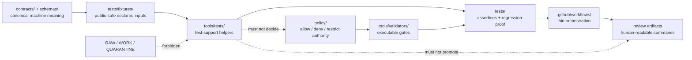

<!-- [KFM_META_BLOCK_V2]
doc_id: kfm://doc/TODO-tools-tests-readme-uuid
title: tools/tests README
type: standard
version: v1
status: draft
owners: TODO-VERIFY-owner
created: 2026-04-25
updated: 2026-04-25
policy_label: TODO-VERIFY-policy_label
related: [TODO-VERIFY-related-paths]
tags: [kfm, readme, tools, tests, verification]
notes: [Repo tree unavailable in this session; verify doc_id, owners, policy_label, related links, and directory inventory before publish.]
[/KFM_META_BLOCK_V2] -->

<a id="top"></a>

# tools/tests

Test-support tooling lane for deterministic, public-safe checks that help KFM prove fixtures, reports, and review artifacts without turning helper scripts into policy or publication authority.

> **Status:** experimental · **Owners:** TODO-VERIFY-owner · **Policy label:** TODO-VERIFY-policy_label  
> **Badges:**      
> **Quick jumps:** [Scope](#scope) · [Repo fit](#repo-fit) · [Inputs](#inputs) · [Exclusions](#exclusions) · [Directory tree](#directory-tree) · [Quickstart](#quickstart) · [Usage](#usage) · [Diagram](#diagram) · [Reference tables](#reference-tables) · [Task list](#task-list--definition-of-done) · [FAQ](#faq) · [Appendix](#appendix)

> [!IMPORTANT]
> Current implementation depth is **UNKNOWN** until a real KFM checkout is inspected. This README defines the safest repo-ready role for `tools/tests/` from the available KFM doctrine and adjacent documentation patterns; it does not claim the directory already contains any helper files beyond this proposed README.

---

## Scope

`tools/tests/` is the proposed home for **test-support helper tooling**: small, deterministic utilities that make KFM test fixtures, reports, required-path checks, and review artifacts easier to inspect.

### Working interpretation

Use `tools/tests/` when the main job is to **support the test system** without owning the tests themselves.

| This lane may own | This lane must not become |
| --- | --- |
| Test-support helper scripts | The canonical `tests/` suite |
| Fixture-safety or required-path checkers | A policy engine |
| Report normalizers for test output | A promotion gate |
| Helper contracts and local helper docs | A workflow orchestration layer |
| Public-safe helper examples | A source of truth for evidence, schemas, releases, or publication decisions |

### KFM rule of thumb

A helper in this lane may say:

> “This fixture set is missing a required public-safe sample.”

It must not say:

> “This candidate is approved for publication.”

Publication, policy, release, and review decisions stay with their governed owners.

[Back to top](#top)

---

## Repo fit

**Path:** `tools/tests/README.md`

| Surface | Relationship to `tools/tests/` | Status |
| --- | --- | --- |
| [`../README.md`](../README.md) | Upstream `tools/` landing page and tool-family map. | **NEEDS VERIFICATION** |
| [`../../tests/README.md`](../../tests/README.md) | Canonical test-suite home for assertions, fixtures, regression tests, and runtime proof tests. | **NEEDS VERIFICATION** |
| [`../validators/README.md`](../validators/README.md) | Adjacent executable validation lane; validators decide whether artifacts satisfy machine contracts and policy-linked gates. | **NEEDS VERIFICATION** |
| [`../ci/README.md`](../ci/README.md) | Adjacent CI helper/rendering lane; CI helpers should not be confused with test-support helpers. | **NEEDS VERIFICATION** |
| [`../../.github/workflows/README.md`](../../.github/workflows/README.md) | Workflow orchestration boundary. Business logic should live in tools, validators, policies, and tests, not YAML. | **NEEDS VERIFICATION** |
| [`../../schemas/README.md`](../../schemas/README.md) and [`../../contracts/README.md`](../../contracts/README.md) | Canonical contract/schema homes. Test-support helpers may consume schema-shaped fixtures but do not define schemas. | **NEEDS VERIFICATION** |
| [`../../policy/README.md`](../../policy/README.md) | Policy authority. Helpers may surface policy-test output, but policy remains upstream. | **NEEDS VERIFICATION** |

### Current evidence snapshot

| Evidence item | Status | How this README uses it |
| --- | --- | --- |
| KFM documentation doctrine requires README-like docs to state repo fit, accepted inputs, exclusions, evidence boundaries, diagrams/tables where useful, and definition-of-done logic. | **CONFIRMED** | This README follows that structure. |
| KFM pipeline doctrine treats tests, invalid fixtures, no-network tests, validator tests, policy tests, API contract tests, UI trust-state tests, citation validation, dry-run tests, and thin-slice tests as proof surfaces. | **CONFIRMED** | This lane supports those proof surfaces without replacing them. |
| Business logic should live in validators/tools rather than workflow YAML. | **CONFIRMED doctrine** | This README keeps orchestration out of scope and points workflow logic back to governed surfaces. |
| Actual `tools/tests/` inventory in the target repo. | **UNKNOWN** | No helper filename, package manager, runner, or implementation maturity is claimed. |
| Owners, policy label, related links, and doc UUID. | **NEEDS VERIFICATION** | Placeholders remain in the meta block and impact block. |

[Back to top](#top)

---

## Inputs

### Accepted contents and inputs

| Input or content class | Examples | Why it belongs here |
| --- | --- | --- |
| Test-support helper scripts | required-path checkers, fixture-shape auditors, public-safe fixture scanners, test-report normalizers | These helpers improve reviewability and repeatability without owning domain truth. |
| Declared fixture references | paths under `../../tests/fixtures/`, expected JSON fragments, golden Markdown snippets | Helpers should operate on explicit, reviewable inputs rather than hidden state. |
| Test report inputs | normalized pytest/JUnit-like summaries, helper-produced JSON reports, local dry-run outputs | Useful for compact review summaries when the source report remains available. |
| Required-path manifests | expected docs, schemas, policy, validator, fixture, and receipt paths | Helps prove documentation and proof-surface completeness without inventing implementation. |
| Negative-path samples | malformed fixture references, missing required fields, unsafe fixture examples | KFM treats negative states as first-class; helper tests should prove fail-closed behavior. |
| Helper-local documentation | helper purpose cards, input/output notes, examples that are safe to print in logs | Keeps helper behavior legible to reviewers and maintainers. |

### Input rules

1. Prefer declared file inputs over implicit environment scraping.
2. Prefer tiny, public-safe fixtures over large copied artifacts.
3. Prefer deterministic local inputs over live network state.
4. Keep helper-specific contracts narrow and explicit.
5. Make negative-path examples as legible as the passing examples.
6. Preserve upstream artifact shape instead of re-inventing it inside helper code.
7. Treat secrets, private records, unpublished data, and rights-unclear fixtures as **not admissible** here.

[Back to top](#top)

---

## Exclusions

| Does **not** belong here | Put it here instead | Why |
| --- | --- | --- |
| Unit, integration, end-to-end, or runtime-proof test files | [`../../tests/README.md`](../../tests/README.md) and its child lanes | `tools/tests/` supports tests; it is not the canonical test suite. |
| Domain validators or promotion validators | [`../validators/README.md`](../validators/README.md) | Validators operationalize schema, source-role, policy, and promotion checks. |
| Canonical policy decisions | [`../../policy/README.md`](../../policy/README.md) | Policy remains the source of allow/deny/restrict behavior. |
| Schema or contract definitions | [`../../schemas/README.md`](../../schemas/README.md) and [`../../contracts/README.md`](../../contracts/README.md) | Helpers consume contracts; they do not define them. |
| Workflow sequencing, permissions, or artifact upload behavior | [`../../.github/workflows/README.md`](../../.github/workflows/README.md) | Workflow choreography belongs at the CI boundary. |
| CI renderer helpers | [`../ci/README.md`](../ci/README.md) | Renderer helpers and test-support helpers are adjacent but distinct lanes. |
| Raw, WORK, QUARANTINE, canonical, private, or secret-bearing data | Governed data lifecycle lanes | Public test-support tooling must be safe to clone, run, and inspect. |
| Live source harvesting or external API probes | Source-specific pipeline/tool lanes after source activation review | First proof slices should stay no-network unless a later controlled integration lane says otherwise. |
| Auto-fix shortcuts that mutate governed artifacts | Nowhere by default | KFM review and promotion stay governed, auditable, and reversible. |
| Publication, release, or promotion decisions | Promotion/release gates and review surfaces | A helper may summarize readiness evidence; it must not promote. |

[Back to top](#top)

---

## Directory tree

### Current inventory

**NEEDS VERIFICATION:** no checked-out KFM repository tree was visible in this session, so the current contents of `tools/tests/` are not confirmed.

```text
tools/tests/
└── README.md  # proposed draft; commit status NEEDS VERIFICATION
```

### Possible stable growth shape

The shape below is **PROPOSED**, not a claim about current files.

<details>
<summary><strong>Future helper-family shape</strong> — PROPOSED / NEEDS VERIFICATION</summary>

```text
tools/tests/
├── README.md
├── check_required_paths.py              # PROPOSED: verify declared repo surfaces exist
├── check_public_safe_fixtures.py        # PROPOSED: flag unsafe fixture classes before review
├── normalize_test_report.py             # PROPOSED: normalize local test report output for review
├── summarize_fixture_inventory.py       # PROPOSED: compact fixture inventory summary
└── helpers/
    └── README.md                        # PROPOSED: split only if helper count justifies it
```

</details>

> [!WARNING]
> Do not create parallel helper names if the real checkout already has a different convention. Inspect the branch first, then adapt this README through a small follow-up patch.

[Back to top](#top)

---

## Quickstart

These commands are **inspection-first** and should not mutate the repository.

```bash
# 1. Confirm that you are inside the real KFM checkout.
git status --short

# 2. Inspect this lane before trusting any inventory claim.
test -d tools/tests && find tools/tests -maxdepth 2 -type f | sort

# 3. Inspect adjacent proof/tool surfaces.
find tools tests -maxdepth 3 -type f 2>/dev/null | sort | sed -n '1,200p'
```

Runner commands are **NEEDS VERIFICATION** until package manager and test framework conventions are confirmed.

```bash
# NEEDS VERIFICATION: replace with the repo-native runner after package inspection.
# python -m pytest tests -q
```

[Back to top](#top)

---

## Usage

### Adding or revising a helper

1. Name the helper after one narrow behavior.
2. Document accepted inputs, outputs, and failure behavior.
3. Keep the helper deterministic and no-network unless a governed integration lane explicitly authorizes otherwise.
4. Add positive and negative proof under the repo-native test lane, usually `../../tests/`.
5. Keep canonical policy, schema, source-role, and promotion decisions upstream.
6. Update this README when helper inventory or boundaries change.

### Helper contract card

Illustrative only — adapt to the repo’s actual manifest convention if one exists.

```yaml
# illustrative-helper-card.yaml
helper_id: public_safe_fixture_check
status: PROPOSED
inputs:
  - ../../tests/fixtures/
outputs:
  - build/test-support/public-safe-fixture-check.json
must_not:
  - read raw/work/quarantine data
  - contact live source systems
  - approve publication
  - rewrite fixtures silently
negative_paths:
  - missing required fixture
  - unsafe exact-location sample
  - secret-like token present
```

[Back to top](#top)

---

## Diagram



[Back to top](#top)

---

## Reference tables

### Boundary matrix

| Question | Answer |
| --- | --- |
| Can this lane generate reviewer-facing helper output? | **Yes, PROPOSED**, when the underlying machine artifact remains available and authoritative. |
| Can this lane normalize test reports? | **Yes, PROPOSED**, if normalization is deterministic and does not hide failing evidence. |
| Can this lane validate a schema? | **No**, use validator lanes; this lane may call or summarize validators but does not own validation law. |
| Can this lane decide policy? | **No**, policy belongs to `policy/` and validator/promotion surfaces. |
| Can this lane inspect fixtures? | **Yes, PROPOSED**, if fixture inspection is public-safe, deterministic, and bounded. |
| Can this lane publish artifacts? | **No**, publication is a governed state transition. |
| Can this lane read RAW, WORK, QUARANTINE, private, or secret-bearing data? | **No**, fail closed. |

### Truth labels used here

| Label | Use in this README |
| --- | --- |
| **CONFIRMED** | Backed by current-session evidence or supplied KFM doctrine. |
| **INFERRED** | Reasonable repo-role interpretation from adjacent KFM patterns. |
| **PROPOSED** | Recommended lane behavior or file shape not verified in implementation. |
| **UNKNOWN** | Not visible because the real checkout, tests, workflows, and runtime were unavailable. |
| **NEEDS VERIFICATION** | Specific item a maintainer should verify before publishing or depending on the claim. |

[Back to top](#top)

---

## Task list / definition of done

### For this README

- [ ] Confirm `tools/tests/` exists in the real checkout.
- [ ] Replace `TODO-VERIFY-owner` with the actual owner or owning team.
- [ ] Replace `TODO-VERIFY-policy_label` with the repo’s documented policy label.
- [ ] Assign a real `kfm://doc/<uuid>` value through the documentation control plane.
- [ ] Verify every related relative link from `tools/tests/README.md`.
- [ ] Replace the proposed directory tree with the branch-confirmed tree.
- [ ] Keep any proposed helper names clearly labeled until implemented.

### For any helper in this lane

- [ ] Entrypoint has one narrow job and a clear name.
- [ ] Inputs are declared files, not implicit logs or hidden environment state.
- [ ] Fixtures are public-safe, deterministic, small, and reviewable.
- [ ] Negative fixtures or failure cases are included.
- [ ] Helper emits finite, inspectable outcomes rather than vague text.
- [ ] Helper does not decide policy, promotion, publication, or source authority.
- [ ] Helper does not read RAW, WORK, QUARANTINE, private, or secret-bearing data.
- [ ] Tests run without network by default.
- [ ] Rollback is a simple revert with no public release side effect.

[Back to top](#top)

---

## FAQ

### Why is this not under `tests/`?

`tests/` should own assertions, fixtures, regression proof, and end-to-end proof. `tools/tests/` is for reusable helper scripts that support that proof work.

### Can a helper here call a validator?

Yes, as a narrow wrapper or summary step, but the validator remains authoritative. This lane must not re-implement validator law.

### Can a helper here fix malformed fixtures?

Not silently. A helper may report a problem or generate a proposed report. Auto-fix behavior is out of scope unless a later governed runbook explicitly defines it.

### Can a helper here fetch live source data?

No by default. First slices should be no-network. Live source behavior belongs to source-specific governed pipeline lanes after rights, source roles, credentials, quotas, and policy gates are verified.

[Back to top](#top)

---

## Appendix

<details>
<summary><strong>Maintainer review prompts</strong></summary>

Use these prompts when reviewing new helper work:

1. What exact proof surface does this helper support?
2. What authoritative object does it consume?
3. What object remains authoritative after the helper runs?
4. What negative path does it prove?
5. Could the helper accidentally bypass policy, review, source-role, or release gates?
6. Does it stay public-safe if logs are uploaded to CI artifacts?
7. Can the change be reverted without deleting evidence?

</details>

<details>
<summary><strong>Placement decision checklist</strong></summary>

| New file kind | Put it here? | Preferred home |
| --- | --- | --- |
| Test-support script | Usually yes | `tools/tests/` |
| Unit test | No | `tests/` |
| Fixture | Usually no | `tests/fixtures/` |
| Validator | No | `tools/validators/` |
| Policy file | No | `policy/` |
| CI renderer | No | `tools/ci/` |
| Workflow YAML | No | `.github/workflows/` |
| Schema | No | `schemas/` or repo-confirmed schema home |
| Contract prose | No | `contracts/` or docs contract home |
| Review summary artifact | No | governed build/release artifact path |

</details>

[Back to top](#top)
