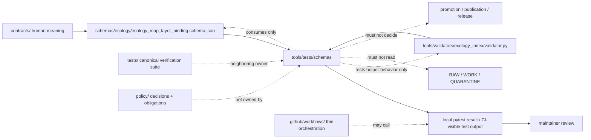

<!-- [KFM_META_BLOCK_V2]
doc_id: kfm://doc/NEEDS-VERIFICATION__tools_tests_schemas_readme
title: tools/tests/schemas
type: standard
version: v1
status: draft
owners: TODO-VERIFY-owner-or-CODEOWNERS
created: NEEDS_VERIFICATION__YYYY-MM-DD
updated: 2026-04-28
policy_label: TODO-VERIFY-public-or-restricted
related: [
  ../README.md,
  ../../README.md,
  ../../../README.md,
  ../../../tests/README.md,
  ../../../schemas/README.md,
  ../../../contracts/README.md,
  ../../../policy/README.md,
  ../../../.github/workflows/README.md,
  ../../validators/README.md,
  ../../ci/README.md,
  ../../validators/ecology_index/validator.py,
  ../../../schemas/ecology/ecology_map_layer_binding.schema.json,
  ./test_ecology_map_layer_binding_schema.py
]
tags: [kfm, tools, tests, schemas, json-schema, ecology, map-layer-binding, fail-closed]
notes: [
  doc_id, created date, owner, and policy_label remain placeholders pending active-branch governance verification.
  Current public main inspection shows this path as a schema-focused child lane under tools/tests with an empty README and one ecology map-layer schema test before this revision.
  This README is scoped to tool-side schema test support; it does not move schema authority out of schemas/, test authority out of tests/, or validator authority out of tools/validators/.
]
[/KFM_META_BLOCK_V2] -->

<a id="top"></a>

# `tools/tests/schemas`

Schema-focused test-support lane for proving tool-side schema compatibility and negative-path behavior without becoming the canonical schema registry, validator lane, or top-level test suite.

> [!IMPORTANT]
> **Status:** experimental  
> **Document status:** draft  
> **Owners:** `TODO-VERIFY-owner-or-CODEOWNERS`  
> **Path:** `tools/tests/schemas/README.md`  
> **Policy label:** `TODO-VERIFY-public-or-restricted`  
> **Evidence posture:** repo-inspected public-main snapshot + KFM doctrine-bounded guidance  
> **Quick jumps:** [Scope](#scope) · [Repo fit](#repo-fit) · [Accepted inputs](#accepted-inputs) · [Exclusions](#exclusions) · [Current snapshot](#current-snapshot) · [Directory tree](#directory-tree) · [Quickstart](#quickstart) · [Usage](#usage) · [Diagram](#diagram) · [Reference tables](#reference-tables) · [Task list](#task-list--definition-of-done) · [FAQ](#faq) · [Appendix](#appendix)


---

## Scope

`tools/tests/schemas/` is a narrow support lane for **schema-oriented tests that live beside tool helpers**. It should make tool-side schema behavior easier to inspect, especially when a helper consumes a schema from `schemas/`, a validator from `tools/validators/`, and a tiny public-safe example from a test function or fixture.

This lane is useful when the test is primarily about **tool compatibility with a declared schema**, not about owning the repository’s full contract test suite.

### Working interpretation

| This lane may hold | This lane must not become |
|---|---|
| Tool-local schema tests | The canonical `tests/` suite |
| Tiny schema examples or inline fixtures | The canonical schema home |
| Checks that a schema compiles under the expected validator | A schema-authoring surface |
| Negative-path tests for fields, enums, hashes, and conditional blocks | A policy engine |
| Tool-side compatibility tests for validator helper functions | A promotion or publication gate |

### KFM rule of thumb

A test in this lane may say:

> “This tool-side schema example fails closed when `spec_hash` is malformed.”

It must not say:

> “This layer is approved, published, policy-safe, or evidentially complete.”

Publication, policy, evidence closure, review, and release decisions stay with their governed owners.

[Back to top](#top)

---

## Repo fit

| Direction | Surface | Relationship |
|---|---|---|
| Current lane | [`./README.md`](./README.md) | Orientation and boundary contract for tool-side schema tests. |
| Sibling test | [`./test_ecology_map_layer_binding_schema.py`](./test_ecology_map_layer_binding_schema.py) | Current schema-focused test in this lane. |
| Parent support lane | [`../README.md`](../README.md) | Defines `tools/tests/` as test-support tooling, not the canonical test suite. |
| Tools root | [`../../README.md`](../../README.md) | Places this lane inside governed helper tooling. |
| Repository root | [`../../../README.md`](../../../README.md) | KFM identity, evidence-first posture, and repo-wide orientation. |
| Canonical tests | [`../../../tests/README.md`](../../../tests/README.md) | Owns assertions, fixtures, contract tests, regression proof, runtime proof, and E2E proof. |
| Machine schemas | [`../../../schemas/README.md`](../../../schemas/README.md) | Owns machine-readable schema authority once schema-home decisions are settled. |
| Human contracts | [`../../../contracts/README.md`](../../../contracts/README.md) | Owns contract intent, object meaning, and compatibility guidance. |
| Policy | [`../../../policy/README.md`](../../../policy/README.md) | Owns allow, deny, restrict, reason-code, sensitivity, rights, runtime, and publication decision rules. |
| Validators | [`../../validators/README.md`](../../validators/README.md) | Owns reusable fail-closed validation helpers and validator outcome grammar. |
| Ecology validator | [`../../validators/ecology_index/validator.py`](../../validators/ecology_index/validator.py) | Current validator helper consumed by the sibling ecology schema test. |
| Ecology schema | [`../../../schemas/ecology/ecology_map_layer_binding.schema.json`](../../../schemas/ecology/ecology_map_layer_binding.schema.json) | Current schema under test for governed ecology map-layer binding. |
| CI orchestration | [`../../../.github/workflows/README.md`](../../../.github/workflows/README.md) | May call tests; should not hide schema, validator, or policy logic in workflow YAML. |
| CI helpers | [`../../ci/README.md`](../../ci/README.md) | May summarize outputs; should not replace test assertions or schema validation. |

> [!NOTE]
> This lane consumes schema and validator surfaces; it does not own them. Keeping that split visible prevents a helper test from becoming quiet schema law.

[Back to top](#top)

---

## Accepted inputs

Use this lane only for inputs that are small, deterministic, public-safe, and directly tied to tool-side schema behavior.

| Accepted input | Examples | Required posture |
|---|---|---|
| Tool-side schema test files | `test_*_schema.py` files that exercise schema compilation and validation behavior | Runnable locally; no hidden network state. |
| Tiny inline examples | Minimal valid and invalid dictionaries inside a test file | Public-safe and intentionally scoped. |
| Schema references | Paths under `../../../schemas/` | Consumed only; schema authority remains upstream. |
| Validator helper imports | Narrow helper functions such as schema support checks | Imported behavior must remain testable and fail closed. |
| Negative-path cases | Missing required fields, invalid hashes, invalid enum values, missing conditional blocks | Negative paths should be as explicit as happy paths. |
| Conditional rendering/admission examples | Example: `render_type: 3d_tiles` requiring a governed `cesium` block | Tests the contract edge; does not approve 3D publication. |
| Helper-local README notes | Purpose, boundaries, inputs, failure semantics, and review checklist | Kept synchronized with tests when behavior changes. |

### Input rules

1. Prefer explicit paths over implicit repository scans.
2. Keep examples tiny enough to understand in review.
3. Keep tests no-network by default.
4. Make malformed examples intentional and legible.
5. Do not copy large provider records, source mirrors, or sensitive geometry into this lane.
6. Do not rewrite upstream schema or validator behavior from this lane.
7. Treat secrets, rights-unclear records, private data, RAW, WORK, QUARANTINE, and unpublished candidates as **not admissible**.

[Back to top](#top)

---

## Exclusions

| Does **not** belong here | Put it here instead | Why |
|---|---|---|
| Canonical JSON Schemas | [`../../../schemas/`](../../../schemas/) | This lane tests schema behavior; it does not define machine authority. |
| Human-readable contracts | [`../../../contracts/`](../../../contracts/) | Contract meaning belongs upstream. |
| General unit, integration, E2E, runtime-proof, or regression suites | [`../../../tests/`](../../../tests/) | `tools/tests/schemas/` is a support lane, not the canonical verification family. |
| Domain validators or promotion validators | [`../../validators/`](../../validators/) | Validators operationalize checks; this lane proves selected tool-side behavior. |
| Policy rules or reason-code law | [`../../../policy/`](../../../policy/) | Tests may exercise policy-shaped outcomes, but policy owns decisions. |
| Workflow triggers, permissions, artifacts, or branch protection claims | [`../../../.github/workflows/`](../../../.github/workflows/) and platform verification docs | YAML may orchestrate; it should not become hidden validation logic. |
| Live source harvesting or external API probes | Source-specific ingest or pipeline lanes after source activation review | Schema tests should stay deterministic and no-network by default. |
| RAW, WORK, QUARANTINE, canonical, private, or secret-bearing data | Governed data lifecycle lanes | Public helper tests must be safe to clone, inspect, and upload as CI output. |
| Publication, release, or promotion decisions | Promotion gate, release, proof, catalog, review, and policy surfaces | A passing schema test is not a publication decision. |
| UI screenshots with hidden trust assumptions | UI, accessibility, or E2E trust-state tests | Visual output must preserve evidence, policy, freshness, review, and correction meaning. |

[Back to top](#top)

---

## Current snapshot

| Claim | Label | What this README does with it |
|---|---:|---|
| `tools/tests/schemas/` exists on public `main`. | **CONFIRMED** | Treats this as a real child lane, not a hypothetical path. |
| The previous `README.md` at this path was effectively empty. | **CONFIRMED** | This file is a substantive replacement, not a minor prose cleanup. |
| The sibling test file is `test_ecology_map_layer_binding_schema.py`. | **CONFIRMED** | Uses that test as the current concrete anchor. |
| The sibling test validates `schemas/ecology/ecology_map_layer_binding.schema.json` with JSON Schema Draft 2020-12. | **CONFIRMED** | Documents Draft 2020-12 as the current test’s schema-validation posture. |
| The sibling test imports `assert_schema_supported` from `tools.validators.ecology_index.validator`. | **CONFIRMED** | Keeps validator authority separate from this test lane. |
| The current ecology schema requires governed map-layer fields such as `layer_id`, `candidate_id`, `evidence_bundle_id`, `drawer_id`, `render_type`, `source_ref`, `style_layer_ref`, `spec_hash`, and `status`. | **CONFIRMED** | Describes the current schema burden without generalizing it to all schemas. |
| `render_type: 3d_tiles` requires a `cesium` block with `enabled: true` and a non-empty `justification`. | **CONFIRMED** | Treats 3D admission as explicit and testable. |
| Active CI enforcement, branch protection, installed dependencies, and merge-blocking status for this lane. | **UNKNOWN / NEEDS VERIFICATION** | Avoids claiming this test currently blocks release or merge. |

> [!WARNING]
> A schema test that passes is evidence of a narrow contract behavior. It is not evidence of source rights, release approval, EvidenceBundle closure, map-layer publication readiness, or UI safety.

[Back to top](#top)

---

## Directory tree

### Current lane shape

```text
tools/tests/schemas/
├── README.md
└── test_ecology_map_layer_binding_schema.py
```

### Stable growth shape — PROPOSED / NEEDS VERIFICATION

Add only when the checked-out branch and repo-native runner justify the expansion.

```text
tools/tests/schemas/
├── README.md
├── test_ecology_map_layer_binding_schema.py
├── test_runtime_envelope_schema_support.py       # PROPOSED
├── test_source_descriptor_schema_support.py      # PROPOSED
├── fixtures/                                     # PROPOSED only for tiny public-safe examples
│   ├── README.md
│   ├── valid/
│   └── invalid/
└── helpers/                                      # PROPOSED only if repeated local utilities appear
    └── README.md
```

> [!CAUTION]
> Do not create parallel schema-test names if `tests/contracts/`, `schemas/tests/`, or another repo-native family already owns the same burden. Inspect first; then adapt.

[Back to top](#top)

---

## Quickstart

These commands are inspection-first and should not mutate the repository.

```bash
# 1. Confirm you are in the real checkout.
git status --short

# 2. Inspect this lane.
find tools/tests/schemas -maxdepth 2 -type f | sort

# 3. Inspect the current schema and validator surfaces this lane consumes.
sed -n '1,220p' schemas/ecology/ecology_map_layer_binding.schema.json
sed -n '1,260p' tools/validators/ecology_index/validator.py

# 4. Inspect neighboring documentation boundaries.
sed -n '1,220p' tools/tests/README.md
sed -n '1,220p' tools/validators/README.md
sed -n '1,220p' tests/README.md
sed -n '1,220p' schemas/README.md
```

Runner commands remain **NEEDS VERIFICATION** until the active branch confirms package manager, dependency installation, and test-runner convention.

```bash
# NEEDS VERIFICATION: current sibling test is pytest-style and imports jsonschema.
python -m pytest tools/tests/schemas/test_ecology_map_layer_binding_schema.py -q
```

[Back to top](#top)

---

## Usage

### Adding or revising a schema-support test

1. Start with the upstream schema path.
2. Add the smallest valid example needed to exercise the behavior.
3. Add negative cases that prove fail-closed behavior.
4. Use the repo-native validator helper instead of re-implementing validator law.
5. Keep all examples public-safe and no-network.
6. Link the test to the upstream schema and validator in this README.
7. Update the directory tree, current snapshot, and task list when inventory changes.

### Good test subjects

| Subject | Good test pressure |
|---|---|
| Required fields | Missing required field fails clearly. |
| Hash discipline | `spec_hash` must match the documented 64-character lowercase hex pattern. |
| Enum discipline | Unknown `render_type` or `status` values fail closed. |
| Conditional admission | `3d_tiles` requires explicit Cesium admission metadata. |
| Schema compiler support | Invalid schema shape raises rather than silently passing. |
| Fenced schema handling | If a schema is stored as fenced JSON, the loader strips the fence before validation. |

### Avoid in this lane

```text
- live source calls
- hidden environment variables
- broad provider records
- exact sensitive locations
- automatic fixture mutation
- release or promotion approval
- policy decisions by convenience
- schema edits disguised as tests
```

[Back to top](#top)

---

## Diagram



[Back to top](#top)

---

## Reference tables

### Boundary matrix

| Question | Answer |
|---|---|
| Can this lane validate examples against an upstream schema? | **Yes**, when the test is narrow, deterministic, and public-safe. |
| Can this lane own the schema being tested? | **No.** Use `schemas/` or the repo-confirmed schema home. |
| Can this lane import validator helper functions? | **Yes**, for compatibility tests. The validator lane remains authoritative for validator logic. |
| Can this lane decide whether a map layer is publishable? | **No.** Publication is a governed state transition. |
| Can this lane test 3D/Cesium admission requirements? | **Yes**, as schema behavior only; it does not authorize a 3D scene. |
| Can this lane keep large fixtures? | **No by default.** Prefer tiny inline examples or small public-safe fixtures. |
| Can this lane read RAW, WORK, QUARANTINE, private, or secret-bearing data? | **No.** Fail closed. |

### Current ecology map-layer binding checks

| Test pressure | Why it matters |
|---|---|
| Valid layer passes | Confirms the schema accepts a minimal governed map-layer binding. |
| Missing `evidence_bundle_id` fails | Keeps EvidenceBundle linkage visible in the map-layer contract. |
| Invalid `spec_hash` fails | Preserves deterministic identity discipline. |
| Invalid `render_type` fails | Prevents unsupported renderer modes from slipping into layer metadata. |
| `3d_tiles` requires `cesium` | Keeps 3D admission explicit rather than implied by render mode. |
| `3d_tiles` requires `justification` | Prevents decorative or unreviewed 3D adoption. |
| `3d_tiles` requires `enabled: true` | Ensures the conditional block is affirmative, not placeholder metadata. |
| Invalid schema raises `SchemaError` | Prevents malformed schema definitions from being treated as valid test inputs. |

### Truth labels used here

| Label | Use in this README |
|---|---|
| **CONFIRMED** | Verified from public-main repo inspection or directly visible KFM doctrine/source evidence. |
| **INFERRED** | Reasonable boundary interpretation from adjacent KFM README patterns. |
| **PROPOSED** | Recommended lane behavior or future shape not confirmed as implemented. |
| **UNKNOWN** | Not verified from active checkout, installed dependencies, CI, branch protection, or runtime evidence. |
| **NEEDS VERIFICATION** | Specific item maintainers should verify before relying on the claim. |

[Back to top](#top)

---

## Task list / definition of done

### For this README

- [ ] Assign a real `kfm://doc/<uuid>` value through the documentation control plane.
- [ ] Verify `created`, `updated`, `owners`, and `policy_label` against the active branch and governance records.
- [ ] Confirm whether active `CODEOWNERS` assigns this lane through `/tools/`, `/tools/tests/`, or a narrower rule.
- [ ] Verify every relative link from `tools/tests/schemas/README.md`.
- [ ] Replace any stale current-snapshot claims after the first commit containing this README.
- [ ] Confirm the repo-native runner command and update [Quickstart](#quickstart).
- [ ] Confirm whether this lane is advisory, CI-run, or merge-blocking.
- [ ] Keep the KFM Meta Block V2 synchronized with visible title and role.

### For any schema-support test in this lane

- [ ] Test has one narrow schema-support purpose.
- [ ] Upstream schema path is explicit.
- [ ] Upstream validator/helper path is explicit where imported.
- [ ] Valid and invalid examples are both present when the contract warrants them.
- [ ] Negative tests prove fail-closed behavior.
- [ ] Examples are tiny, deterministic, public-safe, and no-network.
- [ ] Test does not mutate upstream schemas, fixtures, policy, receipts, proofs, catalogs, or release artifacts.
- [ ] Failure messages are reviewable enough for maintainers to diagnose.
- [ ] Rollback is a simple revert or test removal with no public-release side effect.

### Review gates

- [ ] No schema authority moved into `tools/tests/schemas/`.
- [ ] No validator law re-implemented here by convenience.
- [ ] No policy or release decision inferred from schema validation.
- [ ] No RAW / WORK / QUARANTINE / private / secret-bearing input path added.
- [ ] No live source dependency added without a separate governed integration decision.
- [ ] No 3D/Cesium surface treated as admitted merely because a schema example passes.
- [ ] No claims of CI enforcement or branch protection made without platform evidence.

[Back to top](#top)

---

## FAQ

### Why is this lane under `tools/tests/` instead of `tests/`?

Because it is a **tool-support schema lane**. The current sibling test exercises schema/validator compatibility near the tool-helper family. Broader assertions, fixtures, regression proof, runtime proof, and release/correction drills still belong under `tests/`.

### Does this lane own `ecology_map_layer_binding.schema.json`?

No. It consumes the schema from `schemas/ecology/`. Edits to the schema belong in the schema authority surface, with this lane updated only to keep tests aligned.

### Does a passing schema test mean a layer can appear publicly?

No. A passing schema test only means the example satisfied the checked shape and local test behavior. Public release still requires evidence closure, policy posture, review state, release state, rights and sensitivity checks, and rollback/correction handling.

### Why mention Cesium in a schema-support README?

The current ecology map-layer binding schema has a `3d_tiles` branch. The test should make that admission rule explicit: 3D requires an affirmative Cesium block and justification. This lane tests that contract edge; it does not turn Cesium into the default renderer or truth source.

### Can this lane store fixtures?

Only tiny, public-safe fixtures when inline examples become too hard to maintain. Larger fixture families should move to the repo-confirmed fixture home, usually under `tests/fixtures/` or a schema-test fixture lane after documentation authority is settled.

[Back to top](#top)

---

## Appendix

<details>
<summary><strong>Maintainer verification prompts</strong></summary>

Use these prompts before hardening this file from `draft` to `review` or `published`.

1. Does active `main` still contain only `README.md` and `test_ecology_map_layer_binding_schema.py` in this lane?
2. Does the repo-native test runner execute this lane, or is it currently advisory?
3. Are `pytest` and `jsonschema` installed through a declared package manager or lockfile?
4. Does `schemas/ecology/ecology_map_layer_binding.schema.json` remain the schema under test?
5. Is fenced JSON still accepted intentionally, or should the schema file be normalized to raw JSON?
6. Does `tools/validators/ecology_index/validator.py` remain the correct helper import path?
7. Are 3D/Cesium admission rules still schema-level only, with publication controlled elsewhere?
8. Are any tests duplicating `tests/contracts/`, `schemas/tests/`, or validator-lane coverage?
9. Are all examples safe to print in logs and upload as CI artifacts?
10. Can the change be reverted without deleting evidence, receipts, proofs, catalogs, release records, or correction lineage?

</details>

<details>
<summary><strong>Pre-publish checklist</strong></summary>

- [x] KFM Meta Block V2 present.
- [x] One H1 only.
- [x] One-line purpose directly below the title.
- [x] Status, owners placeholder, badges, and quick jumps present.
- [x] Repo fit included with upstream/downstream links.
- [x] Accepted inputs and exclusions included.
- [x] Directory tree included.
- [x] Quickstart included with verification caveats.
- [x] Mermaid diagram included and grounded in real boundaries.
- [x] Tables used for boundary and current test behavior.
- [x] Task list includes definition of done and review gates.
- [x] Code fences are language-tagged.
- [x] Long appendix content is wrapped in `<details>`.
- [x] Unverified owner, policy label, doc ID, runner, and enforcement claims remain visibly unresolved.

</details>

[Back to top](#top)
