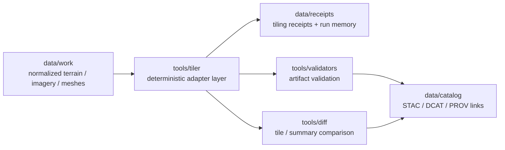
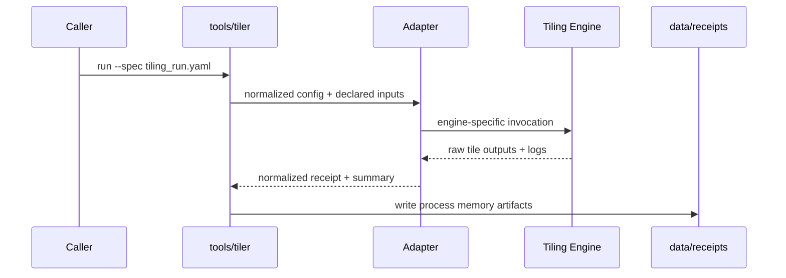

<!-- [KFM_META_BLOCK_V2]
doc_id: kfm://doc/tools/tiler/readme
title: tools/tiler
type: standard
version: v1
status: draft
owners: @bartytime4life
created: 2026-04-13
updated: 2026-04-13
policy_label: public
related: [
  ../README.md,
  ../../contracts/README.md,
  ../../schemas/README.md,
  ../../policy/README.md,
  ../../data/work/README.md,
  ../../data/receipts/README.md,
  ../../data/catalog/README.md,
  ../../tools/validators/README.md,
  ../../tools/diff/README.md,
  ../../tests/README.md,
  ../../.github/workflows/README.md
]
tags: [kfm, tools, tiler, 3d-tiles, terrain, imagery, deterministic, provenance]
notes: [
  Proposed lane contract for deterministic surface tiling in KFM.
  Public-main executable inventory for this lane is NEEDS VERIFICATION.
  This document defines scope, boundaries, and expected artifacts without asserting landed implementation.
]
[/KFM_META_BLOCK_V2] -->

# tools/tiler

Deterministic, evidence-first tiling helpers for turning governed surface inputs into **streaming delivery artifacts** such as terrain, imagery, and 3D tilesets.

> [!NOTE]
> **Status:** draft · **Lane posture:** proposed / README-first on public main · **Owners:** `@bartytime4life`  
> 
> 
> 
> 

**Quick jumps:** [Scope](#scope) · [Repo fit](#repo-fit) · [Inputs](#accepted-inputs) · [Exclusions](#exclusions) · [Directory shape](#proposed-directory-shape) · [Quickstart](#quickstart) · [Usage model](#usage-model) · [Lifecycle](#tiling-lifecycle) · [Artifacts](#artifacts-and-evidence) · [Invariants](#lane-invariants) · [FAQ](#faq)

---

## Scope

`tools/tiler/` is the **delivery-artifact tiling lane** for KFM.

It exists to provide a **deterministic wrapper surface** around one or more tiling engines so that terrain, imagery, and other surface-derived views can be published as governed streaming outputs without confusing those outputs with canonical data.

### This lane is responsible for

- canonical tiling entrypoints for governed surface publication
- deterministic parameter handling and run shaping
- adapter boundaries over one or more underlying tilers
- machine-readable tiling receipts and reviewer-readable summaries
- validation handoff to `tools/validators/`
- comparison handoff to `tools/diff/`
- provenance links into `data/receipts/` and catalog closure surfaces

### This lane is not responsible for

- declaring policy outcomes or sensitivity decisions
- acting as the canonical data store for terrain or imagery
- replacing schema authority in `schemas/`
- replacing contract authority in `contracts/`
- becoming a hidden publish lane or side-effectful release gate
- redefining STAC / DCAT / PROV ownership outside catalog lanes

> [!IMPORTANT]
> **KFM doctrine:** tiles are **derived delivery artifacts**, not truth objects.  
> Canonical source materials live upstream in data lanes; tiler outputs must remain reproducible from declared inputs.

---

## Repo fit

**Path:** `tools/tiler/`

**Upstream neighbors**

- [`../../data/work/README.md`](../../data/work/README.md) — staged, normalized, tiling-ready source materials
- [`../../contracts/README.md`](../../contracts/README.md) — authoritative machine contracts and CLI / artifact expectations
- [`../../schemas/README.md`](../../schemas/README.md) — schema authority for receipts, manifests, and tile summaries
- [`../../policy/README.md`](../../policy/README.md) — deny-by-default policy logic; not owned here

**Downstream / adjacent neighbors**

- [`../../data/receipts/README.md`](../../data/receipts/README.md) — process memory for tiling runs
- [`../../data/catalog/README.md`](../../data/catalog/README.md) — publication-facing discovery and provenance closure
- [`../../tools/validators/README.md`](../../tools/validators/README.md) — fail-closed checks over contracts and artifacts
- [`../../tools/diff/README.md`](../../tools/diff/README.md) — deterministic comparison of tile outputs and summaries
- [`../../tests/README.md`](../../tests/README.md) — fixtures and assertions for lane behavior
- [`../../.github/workflows/README.md`](../../.github/workflows/README.md) — orchestration surfaces, not authority

### Position in the governed flow



---

## Accepted inputs

This lane accepts **declared, reviewable inputs** only.

### Primary input classes

| Input class | Description | Expected source |
|---|---|---|
| surface geometry | DEM, mesh, terrain pyramids, hydro surfaces, or equivalent prepared surface assets | `data/work/` or other governed upstream handoff |
| imagery | orthophoto, raster overlay, or derived imagery prepared for publication | `data/work/` |
| run specification | explicit config describing tiling engine, parameters, target profile, and output layout | contract/config surface |
| provenance context | dataset identifiers, source hashes, spec hash, and upstream receipt references | `data/receipts/`, registry/catalog links |
| release context | optional release refs, publication target, or reviewer note bundle | release orchestration layer |

### Expected declared fields

> [!TIP]
> Exact field names are **NEEDS VERIFICATION** until contracts land, but the lane expects the following concepts to be explicit rather than inferred.

- `input_ref` or equivalent declared source path / URI
- `input_sha256` or equivalent immutable digest
- `spec_hash`
- `tiler_adapter`
- `output_profile`
- `crs`
- `lod_policy`
- `resampling_or_simplification_policy`
- `receipt_out`
- `summary_out`

### Input posture

- **Explicit over discovered**
- **Immutable over mutable**
- **Versioned over ambient**
- **Receipted over ad hoc**

---

## Exclusions

The following are out of scope for `tools/tiler/`:

- policy classification, allow/deny decisions, or rights adjudication
- source onboarding or registry identity assignment
- authoring STAC / DCAT / PROV as the authoritative home
- fixing malformed upstream source data in-place
- unbounded crawling or hidden source discovery
- runtime request-time answer generation
- replacing viewer logic in Focus Mode / app shells
- embedding unpublished trust-state or secrets in tile artifacts

---

## Proposed directory shape

> [!WARNING]
> The tree below is **PROPOSED**, not confirmed public-main implementation.

```text
tools/tiler/
├── README.md
├── adapters/
│   ├── README.md
│   ├── cesium_terrain_imagery/
│   └── example_noop/
├── configs/
│   ├── profiles/
│   └── examples/
├── summaries/
│   └── README.md
├── fixtures/
│   └── README.md
└── schemas/
    └── README.md
```

### Directory intent

| Path | Intent |
|---|---|
| `adapters/` | bounded wrappers around concrete tiling engines |
| `configs/` | reviewed profiles and example run specs |
| `summaries/` | reviewer-readable report templates or shaping helpers |
| `fixtures/` | tiny deterministic inputs for tests and docs |
| `schemas/` | lane-local helper references only if not conflicting with top-level schema authority |

---

## Quickstart

> [!CAUTION]
> Public-main executable names and flags are **PROPOSED** and must not be treated as implemented without repo evidence.

### 1) Prepare governed inputs upstream

Place or reference tiling-ready surfaces in a governed upstream location such as `data/work/`, along with digests and any upstream receipts.

### 2) Provide an explicit run spec

Example conceptual run spec:

```yaml
kind: tiling_run
version: v1
input_ref: data/work/surfaces/kansas_dem_cog.tif
input_sha256: "<sha256>"
spec_hash: "<spec_hash>"
tiler_adapter: cesium-terrain-imagery
output_profile: terrain_3dtiles_1_1
crs: EPSG:4326
lod_policy:
  max_geometric_error: 64
  max_depth: 16
receipt_out: data/receipts/tiling/kansas_dem/2026-04-13/receipt.json
summary_out: data/receipts/tiling/kansas_dem/2026-04-13/summary.json
```

### 3) Invoke the lane entrypoint

```bash
kfm-tiler run --spec ./path/to/tiling_run.yaml
```

### 4) Validate and compare before publication

```bash
kfm-tiles-validate --receipt ./data/receipts/.../receipt.json
kfm-tiles-diff --left ./prior/summary.json --right ./current/summary.json
```

### 5) Publish only through governed downstream lanes

Validated artifacts may then be linked into catalog and release surfaces by the appropriate publication workflow.

---

## Usage model

`tools/tiler/` should behave like a **deterministic adapter façade**.

### Conceptual commands

| Command | Intent | Notes |
|---|---|---|
| `run` | produce tile artifacts from explicit spec | main entrypoint |
| `plan` | resolve config and emit dry-run summary | no output mutation beyond report files |
| `summarize` | produce a compact artifact summary from an existing tileset | read-only |
| `receipt` | normalize raw engine outputs into KFM receipt shape | deterministic |
| `inspect` | bounded metadata extraction for reviewer use | read-only |

### Adapter model

Each adapter should expose the same conceptual lifecycle:

1. validate declared inputs
2. canonicalize parameters
3. invoke concrete engine
4. normalize outputs
5. emit receipt + summary
6. hand off to validators / diff



---

## Tiling lifecycle

### 1. Intake

The lane receives a **declared source set** and a run spec. No hidden discovery.

### 2. Canonicalization

Config is normalized into a stable shape so equivalent requests produce equivalent invocations.

### 3. Adapter execution

A concrete engine is called through a narrow adapter boundary.

### 4. Receipt emission

The lane records run identity, input hashes, adapter version, engine version, key parameters, and output summary.

### 5. Validation handoff

Downstream validators confirm structural and contract integrity.

### 6. Diff handoff

Optional deterministic comparison against prior output establishes whether changes came from data, config, or engine drift.

### 7. Publication handoff

Only after reviewable outputs exist should downstream publication / release surfaces act on the result.

---

## Artifacts and evidence

This lane should emit **process memory**, not release proof authority.

### Expected artifacts

| Artifact | Class | Purpose |
|---|---|---|
| `receipt.json` | receipt | process memory for the run |
| `summary.json` | review artifact | compact tile statistics and key metadata |
| `engine.log` | bounded support artifact | engine diagnostics if retained |
| `input_manifest.json` | support artifact | declared inputs + digests |
| `tile_inventory.json` | optional support artifact | counts, paths, size distribution |
| `geometry_summary.json` | optional support artifact | bounds, LOD, simplification summary |

### Receipt expectations

A tiling receipt should make the following reviewable:

- which inputs were tiled
- which adapter and engine version were used
- what spec hash governed the run
- where outputs were written
- whether the run completed, failed, or partially emitted artifacts
- where downstream validation results live

### Receipt / proof separation

> [!IMPORTANT]
> Tiling receipts belong with **run memory** in `data/receipts/`.  
> Release manifests, attestations, and publication proof packs remain separate trust objects and should not be collapsed into tiler receipts.

---

## Lane invariants

This lane is expected to be **fail-closed** and **reviewer-friendly**.

### Invariants

1. **Declared inputs only**  
   No ambient discovery that can silently change results.

2. **Deterministic shaping**  
   Equivalent inputs + equivalent spec + equivalent adapter version should produce materially equivalent outputs, or surface explicit drift.

3. **Derived artifact posture**  
   Tilesets are delivery artifacts, not canonical source truth.

4. **Bounded logs and outputs**  
   Safe for CI summaries and review surfaces; avoid secrets or unpublished trust-state leakage.

5. **Explicit provenance links**  
   Inputs, receipts, and downstream catalog references must remain traceable.

6. **No policy authority here**  
   This lane may surface metadata needed by policy, but must not decide policy outcomes.

---

## Validation and diff expectations

`tools/tiler/` should not absorb validation or comparison authority, but it must produce outputs that make those lanes effective.

### Expected validator checks downstream

- required artifact presence / shape
- bounding volume sanity
- CRS / coordinate metadata consistency
- LOD or hierarchy consistency
- digest and manifest integrity
- declared receipt linkage

### Expected diff checks downstream

- tile count changes
- byte-size drift
- bounds drift
- geometric error profile changes
- simplification or resampling changes
- adapter / engine version deltas

---

## Example profiles

> [!NOTE]
> These are conceptual profiles for lane design. Profile names and exact parameter surfaces are **PROPOSED**.

| Profile | Intended output | Typical use |
|---|---|---|
| `terrain_3dtiles_1_1` | streamed terrain as 3D Tiles | regional terrain delivery |
| `imagery_overlay_3dtiles_1_1` | imagery-linked 3D surface delivery | photo-textured surface exploration |
| `hydro_surface_review` | compact review surface | QA / reviewer comparison |
| `focus_mode_surface` | optimized view profile for app consumption | product-facing surface delivery |

---

## Example adapter posture

### `cesium-terrain-imagery` adapter

**Intent:** wrap a Cesium-family tiler behind KFM contracts and receipts.

**Adapter responsibilities**
- map KFM spec fields to engine flags
- normalize output layout
- capture engine version and invocation context
- emit lane-shaped receipt + summary

**Adapter non-goals**
- become the canonical definition of KFM tile semantics
- hide engine drift
- bypass validator or diff lanes

### `example_noop` adapter

Useful for:
- docs
- contract tests
- tiny fixture-based CI
- fail-closed behavior checks without heavyweight engines

---

## Testing posture

Tests should live in `tests/`, not be replaced by README claims.

### Expected test families

| Test family | Purpose |
|---|---|
| fixture tiling | tiny deterministic golden outputs |
| receipt shape | required fields and stable serialization |
| adapter failure | fail-closed behavior on bad inputs |
| drift detection | equivalent vs changed spec expectations |
| validator handoff | downstream contract compatibility |

---

## Security and governance notes

- Do not embed secrets, tokens, or unpublished endpoints in receipts or summaries.
- Do not silently fetch external sources during tiling.
- Do not publish directly from helper code unless an explicit governed caller owns that action.
- Treat coordinate reference system changes, simplification changes, and input substitutions as review-significant.
- Keep sensitive or rights-restricted source logic in `policy/` and dataset governance lanes.

---

## FAQ

### Why is this lane separate from `data/work/`?

Because `data/work/` holds staged and transform-ready materials, while `tools/tiler/` is a **tooling lane** that deterministically converts those materials into delivery artifacts.

### Are tiles canonical data?

No. Tiles are optimized streaming artifacts derived from canonical upstream sources.

### Does this lane own release approval?

No. It emits artifacts and receipts that support review, validation, and release decisions elsewhere.

### Should adapters auto-discover inputs from the repo?

No. KFM doctrine favors explicit, declared inputs over ambient discovery.

### Can this lane support more than one tiling backend?

Yes. That is a core design goal. The adapter boundary exists so KFM does not become coupled to any single vendor or engine.

---

## Open questions

> [!WARNING]
> These are intentionally marked for follow-up rather than asserted as settled.

- **NEEDS VERIFICATION:** exact executable names and module layout for public main
- **NEEDS VERIFICATION:** whether lane-local schemas belong here or only at top-level `schemas/`
- **PROPOSED:** normalized receipt schema for tiling runs
- **PROPOSED:** canonical tile summary schema for diff-friendly comparisons
- **PROPOSED:** whether hydro-specific surface tiling profiles should live here or under domain contracts

---

## Appendix A — minimal conceptual receipt

```json
{
  "kind": "tiling_receipt",
  "version": "v1",
  "status": "completed",
  "input_ref": "data/work/surfaces/kansas_dem_cog.tif",
  "input_sha256": "<sha256>",
  "spec_hash": "<spec_hash>",
  "tiler_adapter": "cesium-terrain-imagery",
  "engine_version": "<version>",
  "output_ref": "data/published/tiles/kansas_dem/v1/",
  "summary_ref": "data/receipts/tiling/kansas_dem/2026-04-13/summary.json",
  "recorded_at": "2026-04-13T00:00:00Z"
}
```

---

## Appendix B — authoring checklist

- [ ] Status / owners / badges present
- [ ] Quick jumps present
- [ ] Scope clearly distinguishes tooling from canonical data
- [ ] Inputs are explicit and reviewable
- [ ] Exclusions prevent policy / publish authority bleed
- [ ] Receipts vs proofs separation is explicit
- [ ] Proposed items labeled as `PROPOSED` or `NEEDS VERIFICATION`
- [ ] Relative links point to neighboring authoritative lanes
- [ ] Mermaid diagram reflects bounded lane role
