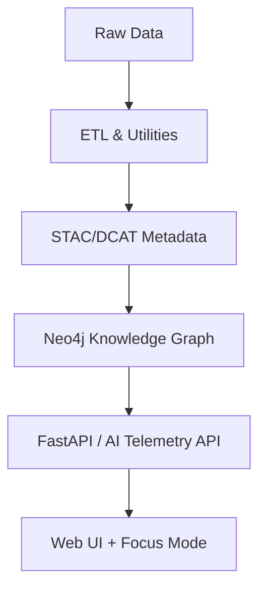

<div align="center">

# 🧰 Kansas Frontier Matrix — **Tools & Utilities Suite**  
`tools/utils/README.md`

**Automation · AI Telemetry · Provenance · Reproducibility**

[](../../../docs/)
[](../../../.github/workflows/ci.yml)
[](../../../.github/workflows/checksum.yml)
[](../../../data/stac/)
[](https://www.go-fair.org/fair-principles/)
[](../../../src/api/)
[](../../../web/)
[](../../../LICENSE)

</div>

---

## 📖 Table of Contents
- [Overview](#-overview)
- [Mermaid Diagram](#-mermaid-diagram)
- [Directory Structure](#️-directory-structure)
- [Core Functions](#-core-functions)
- [Environment Setup](#️-environment-setup)
- [Data Contract & Schema Validation](#-data-contract--schema-validation)
- [Integration with Workflows](#-integration-with-workflows)
- [Interoperability & Linked Data](#-interoperability--linked-data)
- [Example Usage](#-example-usage)
- [Dependencies](#-dependencies)
- [Provenance & Logging](#-provenance--logging)
- [Telemetry & API Integration](#-telemetry--api-integration)
- [AI & Focus Mode Support](#-ai--focus-mode-support)
- [Security & Integrity](#-security--integrity)
- [Testing & Validation](#-testing--validation)
- [Governance Metadata](#-governance-metadata)
- [MCP Compliance Checklist](#-mcp-compliance-checklist)
- [Related Documentation](#-related-documentation)
- [Versioning & Metadata](#-versioning--metadata)
- [License](#-license)
- [Version History](#-version-history)
- [Acknowledgments](#-acknowledgments)

---

## 📚 Overview

The **Tools & Utilities Suite** provides the shared, version-controlled automation layer used across all **Kansas Frontier Matrix (KFM)** workflows — from ETL pipelines to AI Focus Mode telemetry.  
Each script enforces deterministic execution, verified outputs, and machine-readable provenance compliant with **MCP-DL v6.3**, **STAC/DCAT-R3**, and **FAIR+CARE** principles.

> *“Automation with provenance — every byte tells its story.”*

These utilities integrate directly with the FastAPI backend, the Neo4j knowledge graph, and the React + MapLibre frontend.

---

## 🧭 Mermaid Diagram



---

## 🗂️ Directory Structure

```text
tools/utils/
├── checksum.py           # Compute/verify SHA-256 hashes for provenance tracking
├── convert_geojson.py    # Reproject & convert GIS formats (Shapefile ↔ GeoJSON ↔ COG)
├── generate_stac.py      # Build & validate STAC/DCAT Items and Collections
├── validate_json.py      # Validate JSON/Schema conformance
├── fetch_remote.py       # Retrieve and log remote datasets with provenance
├── summarize_logs.py     # Summarize ETL & Focus Mode telemetry logs
├── lint_markdown.sh      # Validate Markdown & documentation links
├── requirements.txt      # Python dependencies for utility scripts
└── README.md
```

---

## 🧩 Core Functions

| Script | Purpose | Common Use |
| :------| :--------| :----------|
| `checksum.py` | Compute/verify SHA-256 hashes | File integrity verification |
| `convert_geojson.py` | Convert and reproject vector datasets | GeoJSON + COG generation |
| `generate_stac.py` | Build and register STAC items | Populate STAC/DCAT catalogs |
| `validate_json.py` | Validate schemas | Metadata QA in CI |
| `fetch_remote.py` | Fetch & record data provenance | NOAA / USGS ingest automation |
| `summarize_logs.py` | Aggregate structured logs | Provenance & AI telemetry summaries |
| `lint_markdown.sh` | Check docs & links | Documentation validation |

---

## ⚙️ Environment Setup

```bash
conda create -n kfm-utils python=3.11 -y
conda activate kfm-utils
pip install -r tools/utils/requirements.txt
```

---

## 🧱 Data Contract & Schema Validation

Each validator aligns with **STAC/DCAT-R3** and the internal schema registry in  
`docs/contracts/data-contract-v3.json`.

| Schema | Description | Used By |
|:--------|:-------------|:--------|
| `stac-item.schema.json` | STAC item validation | `generate_stac.py` |
| `dataset-metadata.schema.json` | Frontier-Matrix dataset metadata | `validate_json.py` |
| `telemetry.schema.json` | Focus-Mode telemetry validation | `summarize_logs.py` |

---

## 🧮 Integration with Workflows

| Stage | Utility | Output |
| :---- | :-------| :------|
| Data Provenance | `checksum.py`, `summarize_logs.py` | Hashes + logs |
| Metadata Validation | `validate_json.py`, `generate_stac.py` | Valid STAC/DCAT JSON |
| Docs QA | `lint_markdown.sh` | Markdown report |
| Remote Ingestion | `fetch_remote.py` | Synced datasets |
| Geo Conversion | `convert_geojson.py` | GeoJSON/COG artifacts |

Run via:
```bash
make all-validate
```
Combines docs, checksum, and STAC validations.

---

## 🌐 Interoperability & Linked Data

All outputs comply with:
- **GeoSPARQL / RDF-Lite**: triples generated from STAC metadata.
- **CIDOC CRM alignment**: events, actors, and places mapped to `E7 Activity`, `E53 Place`, and `E5 Event`.
- **PROV-O ontology**: each checksum result represented as `prov:Entity → prov:Activity`.

---

## 🧠 Example Usage

```bash
python tools/utils/generate_stac.py --input data/processed/ --output data/stac/
python tools/utils/checksum.py verify --dir data/raw/
python tools/utils/summarize_logs.py --report reports/provenance_summary.json
```

---

## 📦 Dependencies

| Type | Tool | Purpose |
| :----| :----| :--------|
| **Python** | `jsonschema`, `pystac`, `requests` | Validation & STAC building |
| **CLI** | `make`, `jq`, `bash` | Automation & orchestration |
| **QA** | `markdownlint`, `linkchecker` | Documentation validation |

---

## 🧾 Provenance & Logging

Each tool appends to `logs/provenance.log`:
```
[YYYY-MM-DD HH:MM:SS] [user] [tool] [target] [status] [commit-sha] [confidence]
```

Outputs integrate with AI-driven Focus telemetry and backend dashboards.

---

## 🛰️ Telemetry & API Integration

- Metrics exposed under `/api/telemetry/utils`.  
- Logs feed into Focus Mode analytics through `summarize_logs.py`.  
- AI calculates runtime anomaly detection and dataset correlation metrics from these logs.

---

## 🤖 AI & Focus Mode Support

Utilities power **Focus Mode telemetry** and **explainable AI** layers:
- `summarize_logs.py` generates contextual summaries.  
- Provenance and metadata enable model interpretability.  
- STAC/DCAT data provide semantic grounding for AI entity linking.

---

## 🔐 Security & Integrity

- No in-place file modification.  
- `.env` secrets encrypted at runtime.  
- Digital signatures appended to checksums.  
- CI enforces STAC, checksum, and docs validations pre-merge.

---

## 🧪 Testing & Validation

Automated coverage targets:
- **Unit Tests:** 100 % coverage for checksum & schema validators.  
- **Integration Tests:** ETL and telemetry pipelines.  
- **Contract Tests:** JSON Schema validation via `pytest --schema`.  
- Executed through `make test` and `make all-validate`.

---

## 🧩 Governance Metadata

| Role | Responsibility | Current Owner |
|------|----------------|----------------|
| **Lead Architect** | Repository structure & compliance | @kfm-architecture |
| **Data Steward** | FAIR/DCAT conformance | @kfm-data |
| **Security Lead** | Credential & checksum policy | @kfm-security |
| **AI Ethics Reviewer** | FAIR+CARE oversight | @kfm-ai |
| **QA Manager** | Docs & CI/CD validation | @kfm-qa |

---

## 🧠 MCP Compliance Checklist

| Principle | Implementation |
| :---------| :--------------|
| **Documentation-First** | YAML headers + inline CLI help |
| **Reproducibility** | Deterministic ETL & hash logging |
| **Provenance** | Structured log + STAC lineage |
| **Open Standards** | STAC/DCAT-R3, CIDOC CRM, OWL-Time |
| **Auditability** | CI gates + log-based verification |
| **Accessibility** | WCAG-compliant CLI colors |

---

## 🔗 Related Documentation

- **Tools Index** — `tools/README.md`  
- **AI System** — `docs/architecture/ai-system.md`  
- **Data Architecture** — `docs/architecture/data-architecture.md`  
- **Focus Mode** — `docs/features/focus-mode.md`  
- **ETL Pipelines** — `src/pipelines/README.md`  
- **MCP Standards** — `docs/standards/README.md`

---

## 🧾 Versioning & Metadata

| Field | Value |
| :---- | :---- |
| **Version** | `v1.6.0` |
| **Codename** | *Graph-Aware Utilities Refresh* |
| **Last Updated** | 2025-10-22 |
| **Maintainers** | @kfm-data · @kfm-architecture |
| **Approvers** | @kfm-qa · @kfm-security · @kfm-ai |
| **License** | MIT |
| **Alignment** | STAC/DCAT-R3 · FAIR+CARE · CIDOC CRM · OWL-Time |
| **Maturity** | Platinum+ / Live |

---

## 📜 License

Released under **MIT License**.  
© 2025 Kansas Frontier Matrix — Developed under **MCP-DL v6.3** for deterministic, auditable, AI-assisted automation.

> *“Integrity by design — reproducibility by intelligence.”*

---

## 🧩 Version History

| Version | Date | Author | Summary |
| :------ | :---- | :------ | :-------- |
| v1.6.0 | 2025-10-22 | @kfm-architecture | Added schema validation, governance, AI, and Linked-Data updates |
| v1.5.0 | 2025-10-22 | @kfm-architecture | Introduced telemetry integration |
| v1.4.2 | 2025-10-22 | @kfm-data | FAIR+CARE alignment, footer badges |
| v1.4.0 | 2025-10-21 | @kfm-data | Full Platinum README integration |

---

### 🪶 Acknowledgments
Kansas Frontier Matrix is maintained by the @kfm-architecture council with contributions from  
@kfm-data, @kfm-ai, @kfm-ui, @kfm-standards, and the Kansas open-data community.  
Special thanks to the Kansas Historical Society, USGS, NOAA, and all partner archives.

---

<div align="center">

[](../../../.github/workflows/ci.yml)
[](../../../.github/workflows/docs-validate.yml)
[](../../../.github/workflows/checksum.yml)
[]()
[](../../../src/api/)
[](../../../web/)
[](../../../data/stac/)
[](https://www.go-fair.org/fair-principles/)
[]()

</div>